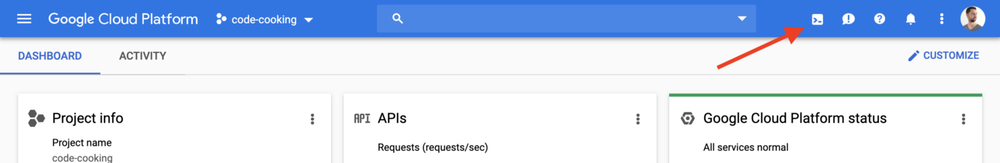
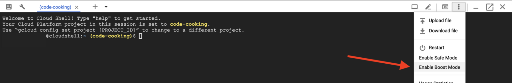
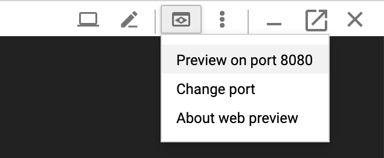
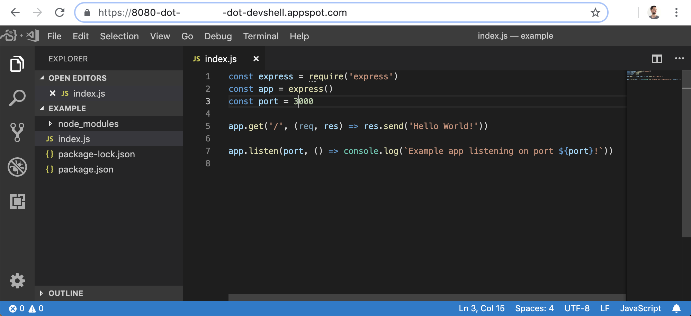

How to run Visual Studio Code in Google Cloud Shell

# How to run Visual Studio Code in Google Cloud Shell

[Christiaan Hees](https://medium.com/@chees)
Jul 8·2 min read

Did you know you can run Visual Studio Code in a browser? It’s so cool, it even works with extensions and all that. I’ll show you an example using [github.com/cdr/code-server](https://github.com/cdr/code-server/)

- •Go to [console.cloud.google.com](https://console.cloud.google.com/) and open Cloud Shell

- •Enable Boost Mode to make it faster

- •Install code-server

export VERSION=`curl -s https://api.github.com/repos/cdr/code-server/releases/latest | grep -oP '"tag_name": "\K(.*)(?=")'`

wget https://github.com/cdr/code-server/releases/download/$VERSION/code-server$VERSION-linux-x64.tar.gz

tar -xvzf code-server$VERSION-linux-x64.tar.gz
cd code-server$VERSION-linux-x64

- •Start the server

./code-server --no-auth --port 8080

> Note that you don’t need authentication since the Google Cloud Shell proxy already handles that for you.

- •Click on Web Preview -> Preview on port 8080

> If you get a 404, remove `?authuser=0`>  from the url. So for example, just

`[https://8080-dot-YOURID-dot-devshell.appspot.com/](https://8080-dot-yourid-dot-devshell.appspot.com/)`

> instead of

`[https://8080-dot-YOURID-dot-devshell.appspot.com/?authuser=0](https://8080-dot-yourid-dot-devshell.appspot.com/?authuser=0)`

#### That’s it, now you have an IDE running in your browser!

