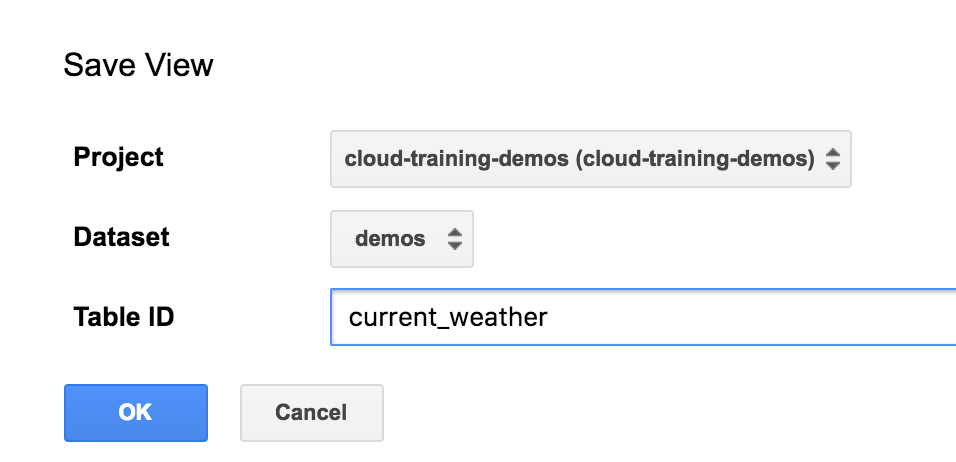
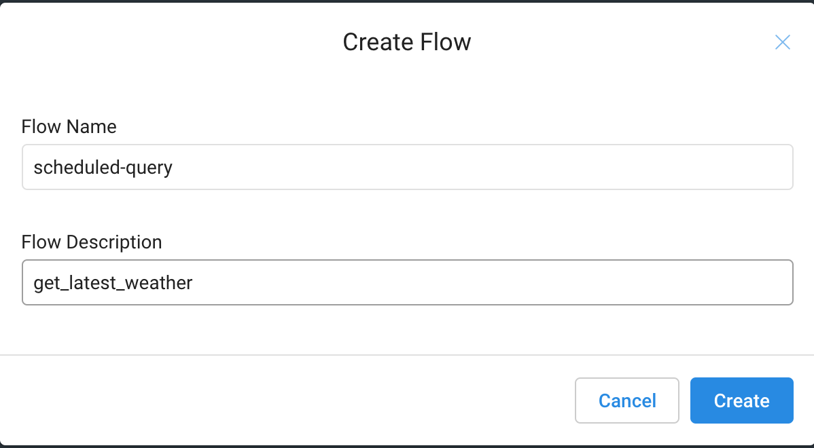
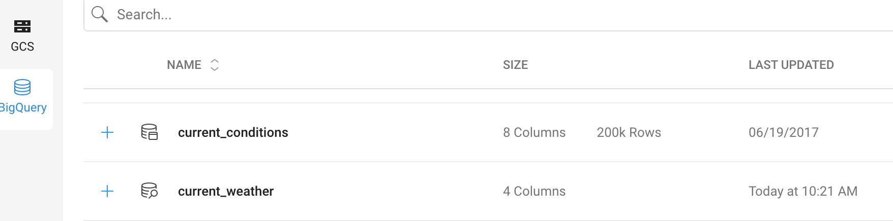
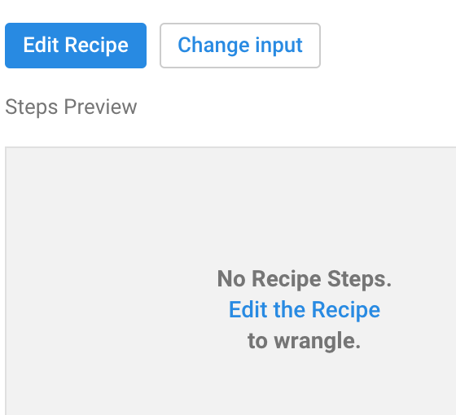
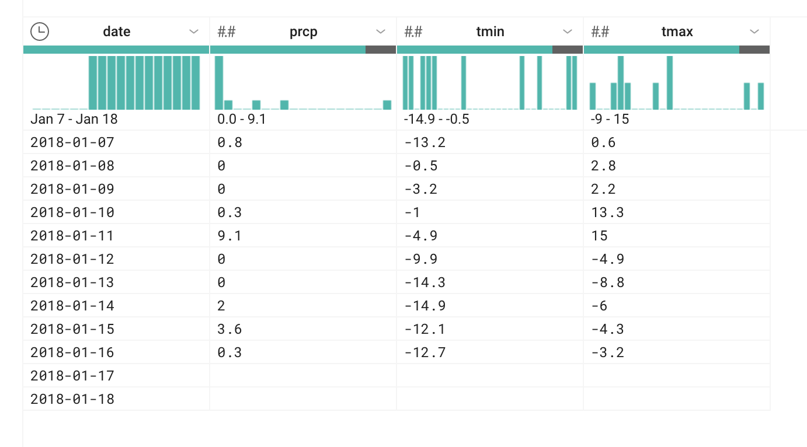
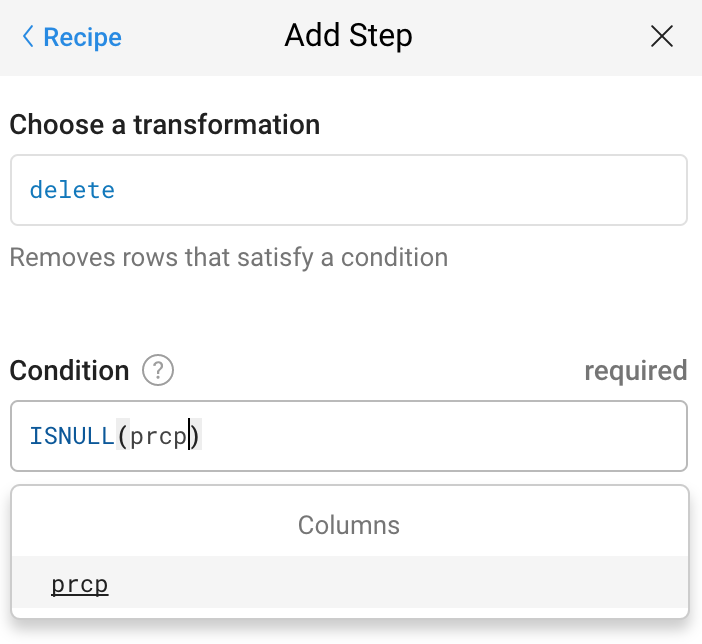
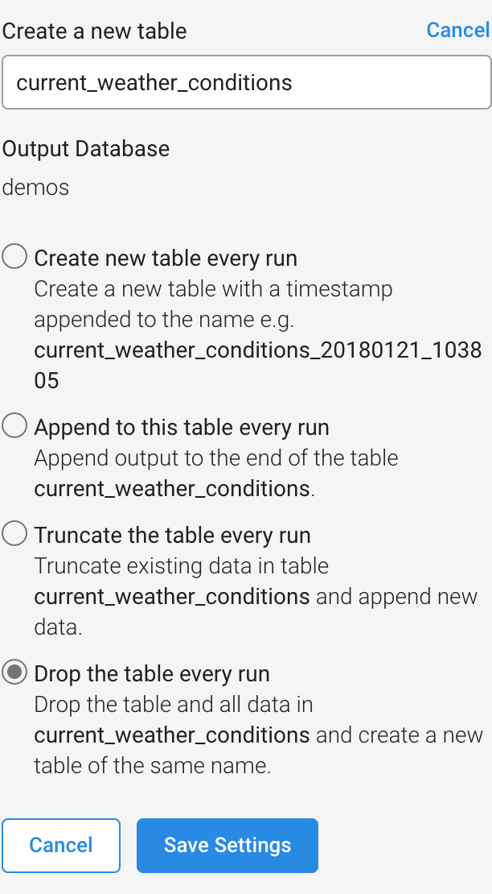
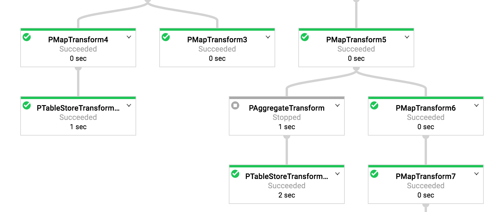
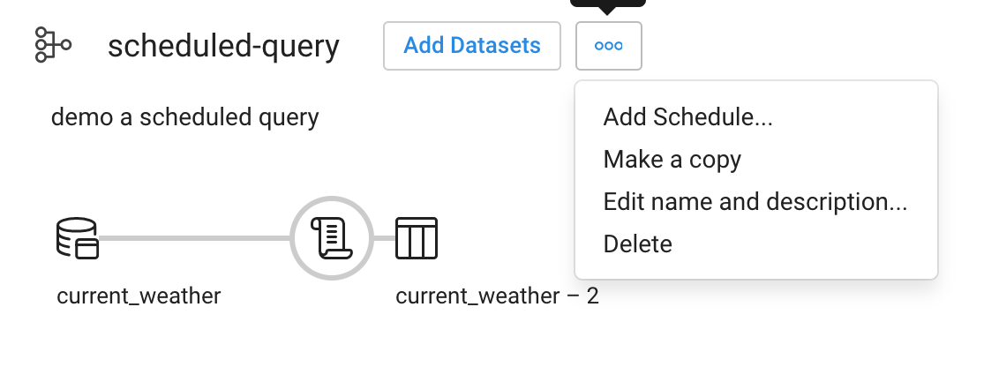
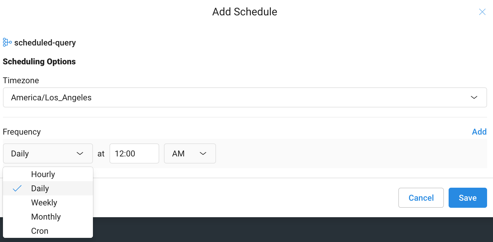

How to schedule a BigQuery ETL job with Dataprep – Google Cloud Platform - Community – Medium

# How to schedule a BigQuery ETL job with Dataprep

[Lak Lakshmanan](https://medium.com/@lakshmanok)
Jan 21, 2018·4 min read

The BigQuery user interface lets you do all kinds of things — run an interactive query, save as Table, export to table, etc. — but there is no way (yet!) to schedule a query to run at a specific time or periodicity. Graham Polley’s been on a roll lately, coming up with [four workarounds](https://shinesolutions.com/2018/01/21/scheduling-bigquery-jobs-this-time-using-cloud-storage-cloud-functions/) that are all serverless and involve other GCP products. But he’s missed what, in my mind, is the clear winner for ETL jobs — it’s flexible, it’s powerful, it involves no coding, and it’s likely you’ll want it in your toolkit even after the BigQuery team rolls out the ability to run scheduled queries.

To be clear: once BigQuery has scheduled queries, you want to use that, so that you can keep your data in BigQuery and take advantage of its scale and power. However, if you are doing transformations (the T in ETL), then consider this approach:

1. 1 "."In the BigQuery UI, save the desired query as a View.

2. 2 "."In Cloud Dataprep, write a new recipe, with a BigQuery source. Optionally, add some transforms to your recipe. For example, you might want to add some formulas, de-deduplications, transformations, etc.

3. 3 "."Export result of transformation to a BigQuery table or CSV file on Cloud Storage

4. 4 "."Schedule the Dataprep flow to run periodically

If the UI is different when you try to replicate the steps, just hunt around a bit. The functionality is likely to be there, just in a different place.

Scheduling a Query to run periodically is easy, really.

### 1. Save BigQuery query as View

I’m going to demonstrate using a query that pulls recent weather from a public dataset of weather, so type this into the BigQuery UI and then save as View:

#standardSQL
SELECT
date,
MAX(prcp) AS prcp,
MAX(tmin) AS tmin,
MAX(tmax) AS tmax
FROM (
SELECT
wx.date AS date,
IF (wx.element = 'PRCP',
wx.value/10,
NULL) AS prcp,
IF (wx.element = 'TMIN',
wx.value/10,
NULL) AS tmin,
IF (wx.element = 'TMAX',
wx.value/10,
NULL) AS tmax
FROM
`bigquery-public-data.ghcn_d.ghcnd_2018` AS wx
WHERE
id = 'USW00094846'
AND DATE_DIFF(CURRENT_DATE(), wx.date, DAY) < 15 )
GROUP BY
date
ORDER BY
date ASC

Save the query as a view

### 2. In Cloud Dataprep, write a new recipe

Step 1: Launch Dataprep from the GCP web console

#### Create a new flow

Recipes are part of a flow

#### Import BigQuery view as Dataprep dataset

Click on Import Datasets and follow the UI flow to get to your BigQuery dataset and import your newly created current_weather view as a Dataprep dataset.

Import the current_weather BigQuery View as a Dataprep Dataset

#### Add a new recipe and edit it

Add steps to the recipe

#### Add recipe steps to further transform the data

After you click on “Edit recipe”, Dataprep will pull out a sample of your dataset and show you the columns, their distributions, etc.

Click on the blue plus button to add a step to the recipe. We’ll remove any rows where the data columns are empty:

Writing a delete transform to delete rows that match a criterion

Note that as you write the formula, Dataprep shows you which rows/columns will be affected.

### 3. Run the job to Export the data

Click on “Run job”. The default is to create a CSV file on Cloud Storage, but we can change this to BigQuery by clicking on the pencil (“Edit”) icon:

Change the output of the job to write to your dataset in BigQuery

Click on “Run job” to run it once. Here, we ask the job to drop and replace the table each run, but as you can see, there are other options. This runs as a Dataflow job, i.e. at scale and distributed.

Dataprep flows run as Dataflow jobs! You don’t need to write Java/Python to use Dataflow.

### 4. Schedule the job to run periodically

Go to the “Flows” section of the Dataprep UI and click on the three buttons next to your new Flow. You’ll see an option to add a schedule:

Options include daily, weekly, etc. but also a crontab format for further flexibility:

Scheduling the job to run periodically
And that’s it!