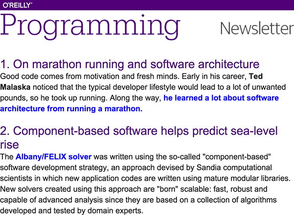
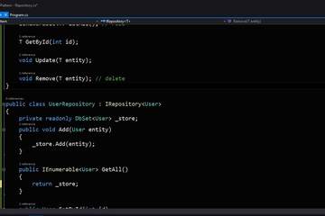
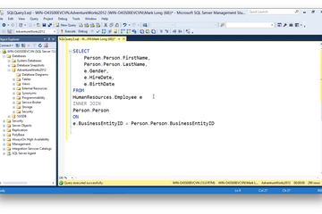
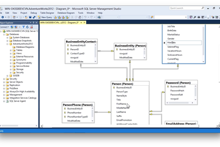

How to ship production-grade Go

 [Software Engineering](https://www.oreilly.com/topics/software-engineering)
                 Follow this topic

# How to ship production-grade Go

Five must-haves for robust, debuggable production code.

By [Kavya Joshi](https://www.oreilly.com/people/6893c50e-2813-4c96-95f9-9a807b41db6d),

 April 6, 2017

 

Tunnel  (source: [Pexels](https://pixabay.com/en/concrete-lights-perspective-tunnel-1845046/)).

For more ways to keep your Go skills sharp, check out Mark Bates’ [*Go Programming for the Web*](https://www.safaribooksonline.com/live-training/courses/go-programming-for-the-web/0636920081074/?utm_source=newsite&utm_medium=content&utm_campaign=lgen&utm_content=hot-to-ship-production-grade-go-text-cta) live online training on June 5, 7, and 8. He’ll show you how to build web, SOA, and API applications using Go.

Shipping a production-grade Go application is not the same as shipping a Go application. Remember, the big difference between your code and your code in production is all the ways it can fail; production-grade code is code that recognizes that difference, and prevents or plans for it.

So, how can you convert your Go to production-grade Go?

This article walks through five things to do to prime your code to run in production; the goal is for you to ship code that is robust, debuggable, and ready for the world.

Get O'Reilly's weekly programming newsletter

 

## Wrap Errors

Go applications in production (may) will encounter errors and panics. This section discusses how to write code that returns and handles errors usefully; the next section discusses panics.

First off, write code that returns errors, rather than code that panics. Errors indicate abnormal state, whereas panics indicate unrecoverable conditions. Errors should be handled; panics should typically abort the program.

When you create or handle an `error`, annotate it with useful context for debugging. Dave Cheney's [errors](https://github.com/pkg/errors) package is well-suited for this, and there are others you can use as well[1](https://www.oreilly.com/ideas/how-to-ship-production-grade-go#fn1).

Here's an example that uses the `errors` package for annotating errors:

- Say you have a function `getCount` that returns an int and an error .

To create the error, use `errors.new`. It creates an error with the provided message and annotates it with a stack trace at that point.

// Import Dave Cheney's errors package
"import github.com/pkg/errors"
func getCount(key) (int, error) {
if key <= 0 {
// Create an annotated error.
err := errors.New("invalid key")
return 0, err }
...
return count, nil
}

- Now, say `getCount` is called by a function `canProceed`.

`canProceed` checks the error and if it's non-`nil` , handles it or propagates it:

func canProceed(key int) bool {
count, err := getCount(key)
if err != nil {
// Handle or propagate err.
} else {
return count < threshold
}
}

The footnote discusses how to choose between handling an error or propagating it[2](https://www.oreilly.com/ideas/how-to-ship-production-grade-go#fn2). For now, let's look at examples of how to do both in a useful manner with the `errors` package.

#### Open Source Convention

 

## [OSCON in Austin, May. 8-11, 2017](http://conferences.oreilly.com/oscon/oscon-tx?intcmp=il-prog-confreg-update-ostx17_new_site_oscon_17_austin_right_rail_cta)

 [Learn More](http://conferences.oreilly.com/oscon/oscon-tx?intcmp=il-prog-confreg-update-ostx17_new_site_oscon_17_austin_right_rail_cta)

- If `canProceed` propagates `err` to its caller, `Wrap` the error first.

The `errors.Wrap` call returns a new error that annotates err with a stack trace at that point, and the provided message.

"import github.com/pkg/errors"
func canProceed(key int) (bool, error) {
count, err := getCount(key)
if err != nil {
// Wrap err with a message and stack trace before propagating it.
return false, errors.Wrap(err, “getCount failed”)
}
return count < threshold, nil
}

- Alternatively, `canProceed` could handle `err` by inspecting it and taking an action —

perhaps logging it, or incrementing an error count.
func canProceed(key int) bool {
count, err := getCount(key)
if err != nil {
// Handle err by logging it.
// If err was created by the errors package,
// this would print the annotations as well.
fmt.Printf(“%+v”, err)
return false
}
return count < threshold
}

The power of the annotations is evident when debugging. Printing an annotated error, as in the code above, prints the original error, the wrapped message, and optionally, the stack trace leading up to the error:

// To print the annotated error without the stack trace:
fmt.Printf("%v", err)
getCount failed: invalid key
// To print the stack trace as well, use %+v formatting flag
fmt.Printf("%+v", err)

A closing note on errors — handle errors **once**. In the example above, once `err` has been printed, it should be considered handled. If needed, it can be returned to `canProceed` ‘s caller to indicate the other return value should not be consumed, but ideally, the caller would not reinspect the error.

## Report Panics

This section discusses panics. Unlike errors, panics should not been handled by the program — they indicate unrecoverable conditions, and should abort the program. That said, it's incredibly useful to report panics that occur in production on a [Slack](https://slack.com/) channel or similar; remember, panics are bugs — serious bugs — and they should be easy to detect and debug too.

#### Safari

 

## [Learn faster. Dig deeper. See farther.](https://www.safaribooksonline.com/home/?utm_source=newsite&utm_medium=content&utm_campaign=lgen&utm_content=software-engineering-post-safari-right-rail-cta)

Join Safari. Get a free trial today and find answers on the fly, or master something new and useful.

 [Learn more](https://www.safaribooksonline.com/home/?utm_source=newsite&utm_medium=content&utm_campaign=lgen&utm_content=software-engineering-post-safari-right-rail-cta)

First, let's talk about what to do with panics and then, how to set it up.

An unchecked panic prints an error message and goroutine stack traces to `stderr` , before the program exits with a non-zero status. The `stderr` log alone is woefully insufficient to take timely action for production panics, so, log them to a service like [Sentry](https://sentry.io/welcome/) that can notify you when panics occur[3](https://www.oreilly.com/ideas/how-to-ship-production-grade-go#fn3). Alternatively, you can configure your application to post to a Slack channel directly, but know that this is the poor-person's approach to panic reporting, and if you can, you should use Sentry.

As to the how to report panics:

- To report panics of goroutines your application creates, use the inbuilt recover function.

`recover` captures the panic value for the current goroutine; the value is non-`nil` if the goroutine is panicking. `recover` is only useful within deferred functions since it effectively regains control of a panicking goroutine. After a call to `recover` , normal execution resumes, so call it in a deferred function at the top-level of a goroutine.

Here's an example of reporting panics using `recover` :

// postToSlack creates a message with the captured panic, timestamp, and hostname,

// and posts it to the configured Slack channel.
func postToSlack(panic interface{}) {
...
}
func reportPanics() {
// Capture the panic if there is one, and report it.
if panic := recover(); panic != nil {
postToSlack(panic)
}
}

// Version without panic reporting; this is not what you want!: func runWithoutPanicReporting() {

// myFunc encapsulates the core logic to do something.
// Run it in a separate goroutine.
go myFunc()
}
// Version with panic reporting; this is what you want:
func runMyFuncPanicReporting() {
go func() {

// Defer reportPanics before calling myFunc -- // if myFunc panics, reportPanic will capture and report the panic right before

// the goroutine exits.
defer reportPanics()
myFunc()
}()
}

The above idea can be used to enable panic reporting for each request goroutine in an HTTP server application, too — introduce a panic reporting middleware. The middleware handler would `defer reportPanics()` before calling the next handler. Be sure use this middleware first in the middleware chain, so all panics are reported:

func PanicReporterMiddleware(w http.ResponseWriter, r *http.Request, next http.HandlerFunc) {

defer reportPanics()
next(w, r)
}
// server.go
func runServer() {
// Set up your routes.
router := setUpRouter()
// Chain the PanicReporter middleware first:
// this example uses the negroni middleware library, but you can set this up
// in any middleware library.
n := negroni.New()
n.Use(negroni.HandlerFunc(PanicReporterMiddleware))
n.UseHandler(router)
// Run the HTTP server.
http.ListenAndServe(":3001", n)
}

- The deferred `recover` method above can't report panics for goroutines created by third-party libraries that your application uses. For reporting on those panics too, set up panic reporting at the application-level using a library like HashiCorp's [panicwrap](https://github.com/mitchellh/panicwrap), or at the system-level by leveraging your process supervisor[4](https://www.oreilly.com/ideas/how-to-ship-production-grade-go#fn4).

Using `panicwrap` is straightforward, but a high-level understanding of how it works and how your application is run is needed to configure it correctly. That discussion is outside the scope of this article, but I encourage you to [read the code](https://github.com/mitchellh/panicwrap/blob/master/panicwrap.go) and use it if it fits your needs.

## Use structured logging

This section presents logging, which is also crucially important to gain insight into your application's behavior as it runs in production.

Structured logging is logging using contextual key-value pairs rather than free-form text. The stdlib's `log` package only provides the latter, but you (can) should use a third-party package that provides the former.

Before we go into why to should use structured — rather than unstructured — logging, here's an example of how you might use each and the difference in their outputs:

Using the stdlib's log package:
log.Printf("Redirecting userId %d to %s", 1, "www.google.com")
The output is:
2017/03/25 17:00:00 Redirecting userId 1 to www.google.com
Using a structured logging package like `logrus`:
import log "github.com/Sirupsen/logrus"
func main() {
log.SetFormatter(&log.JSONFormatter{})
log.WithFields(log.Fields{
"userId": 1,
"server": "www.google.com",
}).Info("Redirecting user")
}
This outputs:

{"level":"info","msg":"Redirecting user","server":"www.google.com","time":"2017-03-25T17:00:00-08:00","userId":1}

The unstructured log output is more human-readable, but using ad hoc strings results in inconsistently formatted logs that are difficult to filter, query or otherwise process. On the other hand, the structured log is less human-readable but the structured format means your logs are machine parsable and processable; you can easily use any of the plethora of powerful tools available (— like [ELK](https://www.elastic.co/)  [5](https://www.oreilly.com/ideas/how-to-ship-production-grade-go#fn5)—) to analyze your logs.

The notable third-party libraries for structured logging in Go are `logrus`, used in the example above, `zap` and `log15`. They support a number of structured formats (JSON and others), and a number of other useful features that the stdlib `log` package does not — like log levels and the ability to attach context to a set of log lines.

For example, with these packages, you could arrange for a request handler's logs to always include the `userId`, `requestId` and `endpoint` fields:

import log "github.com/Sirupsen/logrus"
func init() {
log.SetFormatter(&log.JSONFormatter{})
}
func requestHandlerToDoSomething() {
// Get request parameters
if userId, err := getRequestParams(); err != nil {

return http.Error(w, “Request must contain a valid userId”, http.StatusBadRequest) }

// Include the userId, requestId, and endpoint to all log statements that // use this logger.

logger := log.WithFields(log.Fields {
“userId”: userId,
"requestId": ...,
"endpoint": ...,
})
logger.Info("Request started")
if err := checkIfUserCanDoSomething(); err != nil {
logger.Error("Unauthorized user")
return http.Error(w, “Unauthorized access”, http.StatusForbidden)
}
if err := DoSomething(); err != nil {
logger.Error("DoSomething failed")
return http.Error(w, "server error", http.StatusInternalServerError)
}
logger.Info("Request succeeded")
w.WriteHeader(http.StatusOK)
}

{"endpoint":"GET /doSomething","level":"info","msg":"Request started","requestId":1,"time":"2017-03-25T17:00:00-07:00","userId":1}

{"endpoint":"GET /doSomething","level":"error","msg":"DoSomething failed","requestId":1,"time":"2017-03-25T17:18:48-07:00","userId":1}

## Ship application metrics

Instrumentation enables you to answer questions about your application's behavior and performance, and monitor them over time. A complete instrumentation story includes collecting and analyzing both system and application metrics, but since the former requires no changes to your application, we're not going to cover it in this post. Instead, let's talk about application metrics in this section — namely, the metrics your application would expose.

The first question is what metrics should you collect?

This depends on the type of application, and the questions you want to be able to answer. For example, if you ran an HTTP service, the minimal set of questions would be: what percent of requests get an error response? What is the 99th percentile response time? To drill down further, you could collect these metrics per-endpoint and aggregate them usefully across endpoints. You could collect a ton of other information too. You want to know how many users are rate-limited at any given time, or how long a request to a remote service takes? Ship a metric for it!

The next question is how would you instrument your application to collect these metrics, and where would you send them?

There are a number of metrics systems like [Datadog](https://www.datadoghq.com/), [Prometheus](https://prometheus.io/), and [StatsD + Graphite](https://graphiteapp.org/#integrations) that support storing, aggregating and graphing time series metric data. They conveniently provide Go client libraries that you would use in your application, to collect and send metrics, too[6](https://www.oreilly.com/ideas/how-to-ship-production-grade-go#fn6). Keep in mind that picking between the systems should depend on your needs — how much you want to spend, whether you want to host the system yourself, the volume of data your applications will be sending, etc. — and the right system for you may change over time.

With respect to setting these systems up and using the Go client libraries, there is extensive documentation available online[6](https://www.oreilly.com/ideas/how-to-ship-production-grade-go#fn6). Once you've decided on a system, getting started with it should be no problem!

## Test more than you think you should

That you should write tests for code that will run in production is a given. This section discusses how to up your testing game by writing more *types* of tests and more *rigorous* tests.

In the average Go project, tests takes the form of per-package unit tests that live within the package. So, for an `api` package that has the files: `server.go` and `users.go`, there are corresponding `_test.go` files: `server_test.go` and `users_test.go`. For each function in the package file, there's likely a corresponding `Test` function or set of `Test` functions in the corresponding test file. While this is good practice, it's only the minimum and rarely sufficient for testing serious production code.

- If your package provides a public interface — and it likely does, if only to be used by the rest of your code — test the interface as a consumer would.

To do this, have a test file outside your package and write tests for the behavior and functionality exposed to users of your package. The unit tests within the package still have a place; since they have access to the package internals and private state, they can test internal behavior.

- Write integration tests.

This builds on the previous point. Integration tests test the interactions between your components.

Using the example above, say you have an internal admin service that talks to the api service to get the list of users. The code for the two services would live in separate packages and have independent sets of package internal unit tests and package external interface tests (described above), but you should additionally have a set of tests to exercise the interactions — things like does the admin service issue a request of the form the api service expects? Does the api service return a response the admin service cannot handle?

An example layout of the package structure with the suggestions above is:
api/
server.go
server_test.go
users.go
users_test.go
admin/
server.go
server_test.go
collector.go
collector_test.go
tests/
api_test.go
admin_test.go
integration_test.go

In addition to the two types of tests described above, end to end tests can be invaluable for a complex system. We will not discuss them here since they're typically run by separate systems, outside the application, and test the entire system as it runs in production, but the footnote contains links to information on them[7](https://www.oreilly.com/ideas/how-to-ship-production-grade-go#fn7).

Let's move on to how to write more rigorous tests.

- Use the right tools for testing.

Go has an impressive collection of tools to help you test your application, so use them!

​
Writing an application that deals with complex inputs or user-provided inputs?

Dimitry Vyokov's [go-fuzz](https://github.com/dvyukov/go-fuzz#go-fuzz-randomized-testing-for-go) is an incredible fuzz tester for Go programs.

​
Need to verify the standard output of your code?

Use [Example functions](https://golang.org/pkg/testing/#hdr-Examples) — provided in the stdlib — in your test suite.

​
Want an HTTP client or server for your tests?

The stdlib's [testing/httptest](https://golang.org/pkg/net/http/httptest/) package is your friend.

​
What about an io.Reader or io.Writer ?

Check out the stdlib's [testing/iotest](https://golang.org/pkg/testing/iotest/).

​

The list goes on… So, if you catch yourself shipping untested code to production, stop; whatever your testing needs, there's likely a Go package or tool you can use.

​

- Ensure your tests cover all the important code-paths.

Run `go test -cover` to execute the test suite for a package and get its test coverage, which captures how much of the package's code is exercised by the tests. For example, if the test coverage for your package is 77%, running the test suite runs 77% of the package's code.

The more useful measure of the effectiveness of your test suite is the number of **important** code paths that are tested. For that, use `go test -coverprofile=<filename>` to generate an in-depth coverage profile that includes information like what statements or code paths are tested. Use go `cover`(`go tool cover`) to analyze the cover profile, and write tests to fill in the important, uncovered paths.

No section on testing is complete without stating that you should test early and test often. Configure your code review tool of choice[8](https://www.oreilly.com/ideas/how-to-ship-production-grade-go#fn8) to enforce both — the test suite should be run for each review, and a test coverage report included. Configure your CI tool[8](https://www.oreilly.com/ideas/how-to-ship-production-grade-go#fn8) to guarantee the latter too — the build process should run your test suite and fail if any test fails.

* * *

The set of five ways to prime code for production presented above is by no means exhaustive. On the other hand, it's the minimal set and assumes the more obvious and practiced good code habits like documentation and unit tests.

It will nonetheless prove to be an extremely useful set, so before you unleash your Go code into production, make a list, put it on a post-it, and post it on a wall you can see:

- Wrap errors
- Report panics
- Use structured logs
- Ship application metrics
- Write more tests than you think you should.

Shipping production-grade Go is really that simple.

## Footnotes

1. Palantir's [stacktrace](https://github.com/palantir/stacktrace) is another package to wrap errors with stack traces. That said, the [errors](https://github.com/pkg/errors) package used in the article has a richer API and is more widely used.[↩︎](https://www.oreilly.com/ideas/how-to-ship-production-grade-go#fnref1)

2. To choose whether to handle an error or propagate it:

A good rule-of-thumb is to consider where in the call chain the error is most usefully handled, and accordingly propagate or handle it.

For example, if `canProceed` in the [Wrap Errors example](https://paper.dropbox.com/doc/Draft-SQLmpL23Hp0BDYf0pVtwx#:uid=316217106589920&h2=Wrap-Errors) above is called by an HTTP handler, `canProceed` should return an error — its caller needs to distinguish between the error cases and the count-over-threshold case in order to send the right HTTP response. Since the caller will inspect errors to do that, it should take the other actions like logging and reporting them as well; `canProceed` should not.

func MyRequestHandler(w http.ResponseWriter, r *http.Request) {
// Derive key from the request.
...
// Is the user is rate-limited?
proceed, err := canProceed(key)
// Could not compute count; examine err to send an appropriate response.
if err != nil {
fmt.Printf("Could not compute count. err: %v", err)
// HTTP 400 for an invalid key error, HTTP 500 for all others.
status := statusFromErr(err)
http.Error(w, http.StatusText(status), status)
return
}
// count >= threshold; send a rate-limited response.
if !proceed {
fmt.Println("User rate-limited", ...)
status := http.StatusTooManyRequests
http.Error(w, http.StatusText(status), status)
return
}
// Perform request.
}
[↩︎](https://www.oreilly.com/ideas/how-to-ship-production-grade-go#fnref2)

3. Sentry provides a lot more than just notifications on panics — it's useful to analyze stack traces, track trends, and determine the impact of bugs as well. [↩︎](https://www.oreilly.com/ideas/how-to-ship-production-grade-go#fnref3)

4. Upstart, [Supervisor](http://supervisord.org/), [runit](http://smarden.org/runit/) etc. are common process supervisors.

You could potentially leverage the supervisor's logs to determine when a process exited abnormally etc.[↩︎](https://www.oreilly.com/ideas/how-to-ship-production-grade-go#fnref4)

5. There are several log management services to choose from. ELK mentioned above and [Graylog](https://www.graylog.org/) are self-hosted. If you don't want to host and can pay — [hosted ELK](https://www.elastic.co/cloud), [Loggly](https://www.loggly.com/) and [Splunk](https://www.splunk.com/) are used widely; [Honeycomb](https://honeycomb.io/) is newer but looks promising too.[↩︎](https://www.oreilly.com/ideas/how-to-ship-production-grade-go#fnref5)

6. There are a number of metrics systems:

Prometheus is self-hosted — here are the [docs](https://prometheus.io/docs/introduction/overview/) and the [Go client library](https://github.com/prometheus/client_golang), as is StatsD + Graphite — [StatsD docs](https://github.com/etsy/statsd#statsd-) and one of the many [Go client](https://github.com/cactus/go-statsd-client) libraries, [Graphite](https://graphiteapp.org/#gettingStarted) docs. Datadog is provided as a service — [docs](http://docs.datadoghq.com/), [Go client library](https://github.com/DataDog/datadog-go), as is[Honeycomb.io](https://honeycomb.io/) — [docs](https://honeycomb.io/docs/), [Go client library](https://honeycomb.io/docs/connect/go/).[↩︎](https://www.oreilly.com/ideas/how-to-ship-production-grade-go#fnref6)

7. End to end tests test the entire system — or a subsystem — as a whole and end to end, in that they exercise all components, and the interactions between components. You would typically have a small number of end to end tests that are periodically run against the production system. Monitoring systems like [NewRelic](https://newrelic.com/) and [Sensu](https://sensuapp.org/) can be configured to do this for you, and trigger an alert if an end to end test fails.[↩︎](https://www.oreilly.com/ideas/how-to-ship-production-grade-go#fnref7)

8. Example of respectable code review tools are [Phabricator](https://www.phacility.com/), and [Gerrit](https://www.gerritcodereview.com/).

Widely used CI (Continuous Integration) systems are [Jenkins](https://jenkins.io/) and [CircleCI](https://circleci.com/). Of course there are others for both too[↩︎](https://www.oreilly.com/ideas/how-to-ship-production-grade-go#fnref8).

Article image: Tunnel  (source: [Pexels](https://pixabay.com/en/concrete-lights-perspective-tunnel-1845046/)).

 

##   [Kavya Joshi](https://www.oreilly.com/people/6893c50e-2813-4c96-95f9-9a807b41db6d)

Kavya Joshi is a backend/ systems developer based in San Francisco. Her favorite aspects of being a programmer are reasoning about systems at scale, and delving into the inner workings of sophisticated software. She enjoys speaking on these topics at technical conferences too, and will be giving a keynote on Understanding Channels at GopherCon July 12-15 in Denver, Colorado. Before moving to San Francisco, Kavya was at MIT, where she studied Computer Science. You can drop her a line at @kavya719

* * *

 Video

 

 [Software Engineering](https://www.oreilly.com/topics/software-engineering)

##   [How can I pass parameters to a command in C#?](https://www.oreilly.com/learning/how-can-i-pass-parameters-to-a-command-in-c)

By [Jeremy McPeak](https://www.oreilly.com/people/jeremy-mcpeak)

Learn how to pass data to a command without violating the command pattern in C#.

 Video

 

 [Software Engineering](https://www.oreilly.com/topics/software-engineering)

##   [How do I use the singleton pattern in C#?](https://www.oreilly.com/learning/how-do-i-use-the-singleton-pattern-in-c)

By [Jeremy McPeak](https://www.oreilly.com/people/jeremy-mcpeak)

Learn how to create thread-safe instances with the singleton pattern in C#.

 Video

 

 [Software Engineering](https://www.oreilly.com/topics/software-engineering)

##   [How should I format Transact-SQL queries?](https://www.oreilly.com/learning/how-should-i-format-transact-sql-queries)

By [Mark Long](https://www.oreilly.com/people/mark-long)

Learn the formatting possibilities for Transact-SQL queries and develop your own code structure.

 Video

 

 [Software Engineering](https://www.oreilly.com/topics/software-engineering)

##   [How do I locate data in my SQL Server tables using SQL Server Management Studio diagrams?](https://www.oreilly.com/learning/how-do-i-locate-data-in-my-sql-server-tables-using-sql-server-management-studio-diagrams)

By [Mark Long](https://www.oreilly.com/people/mark-long)

Locate data quickly and easily with the SQL Server Management Studio diagram tool.