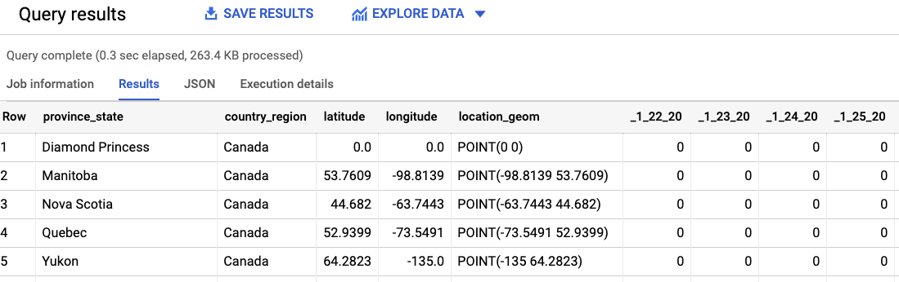
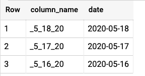
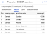
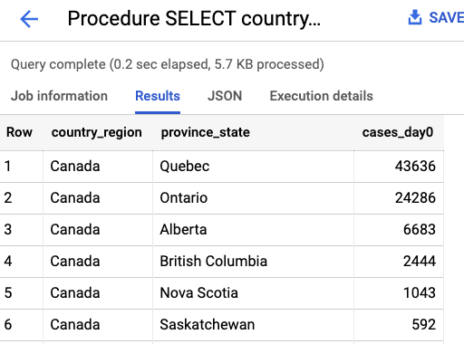
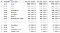
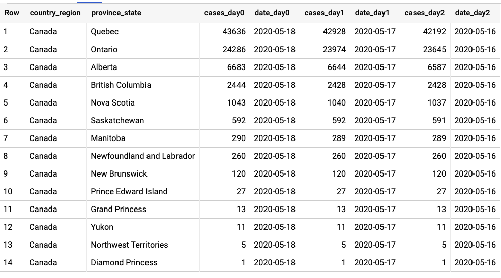
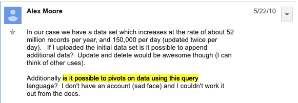

How to use Dynamic SQL in BigQuery - Towards Data Science

# How to use Dynamic SQL in BigQuery

## Format a string, and use EXECUTE IMMEDIATE

[Lak Lakshmanan](https://towardsdatascience.com/@lakshmanok?source=post_page-----8c04dcc0f0de----------------------)

[May 20](https://towardsdatascience.com/how-to-use-dynamic-sql-in-bigquery-8c04dcc0f0de?source=post_page-----8c04dcc0f0de----------------------) · 4 min read

Let’s say that we want to find the number of confirmed COVID cases over the past 3 days in various Canadian provinces. There is a BigQuery public dataset with information published by Johns Hopkins, and we can query it as follows:

SELECT
*
FROM `bigquery-public-data`.covid19_jhu_csse.confirmed_cases
WHERE country_region LIKE 'Canada'
We get:

There is a column for every date

Yikes! There is a column for every date. How do we find the last three days for which there is data?

Dynamic SQL in BigQuery! Image by [Jim Semonik](https://pixabay.com/users/44833-44833/?utm_source=link-attribution&utm_medium=referral&utm_campaign=image&utm_content=166539) from [Pixabay](https://pixabay.com/?utm_source=link-attribution&utm_medium=referral&utm_campaign=image&utm_content=166539)

## Information Schema to get columns

We can use INFORMATION_SCHEMA to get the list of columns and find the last three days using:

SELECT
column_name,
parse_date('_%m_%d_%y', column_name) AS date
FROM
`bigquery-public-data`.covid19_jhu_csse.INFORMATION_SCHEMA.COLUMNS
WHERE
table_name = 'confirmed_cases' AND
STARTS_WITH(column_name, '_')
ORDER BY date DESC LIMIT 3
This returns:

Latest days in the table

## Creating a dynamic SQL statement

You can run a dynamic SQL statement using EXECUTE IMMEDIATE. For example, suppose we have a variable with the column name _5_18_20, this is how to use it to execute a SELECT statement:

DECLARE col_0 STRING;
SET col_0 = '_5_18_20';**EXECUTE IMMEDIATE**  **format**("""
SELECT
country_region, province_state,
 ** %s** AS cases_day0
FROM `bigquery-public-data`.covid19_jhu_csse.confirmed_cases
WHERE country_region LIKE 'Canada'
ORDER BY cases_day0 DESC
""", **col_0);**

Look carefully at the query above. First of all, because I’m declaring a variable, etc., this is a BigQuery script where each statement ends with a semicolon.

I am then using BigQuery’s [string format function](https://cloud.google.com/bigquery/docs/reference/standard-sql/string_functions#format_string) to create the statement I want to run. Because I am passing in a string, I specify %s in the format string and pass in col_0.

The result consists of two stages:

with the result of the second stage being:

## Scripting the last 3 days

We can combine the above three ideas — INFORMATION_SCHEMA, scripting, and EXECUTE IMMEDIATE to get the data for the past 3 days.

DECLARE columns ARRAY<STRUCT<column_name STRING, date DATE>>;SET columns = (
WITH all_date_columns AS (
SELECT column_name, parse_date('_%m_%d_%y', column_name) AS date
FROM `bigquery-public-data`.covid19_jhu_csse.INFORMATION_SCHEMA.COLUMNS
WHERE table_name = 'confirmed_cases' AND STARTS_WITH(column_name, '_')
)

SELECT ARRAY_AGG(STRUCT(column_name, date) ORDER BY date DESC LIMIT 3) AS columns

FROM all_date_columns
);EXECUTE IMMEDIATE format("""
SELECT
country_region, province_state,
%s AS cases_day0, '%t' AS date_day0,
%s AS cases_day1, '%t' AS date_day1,
%s AS cases_day2, '%t' AS date_day2
FROM `bigquery-public-data`.covid19_jhu_csse.confirmed_cases
WHERE country_region LIKE 'Canada'
ORDER BY cases_day0 DESC
""",
columns[OFFSET(0)].column_name, columns[OFFSET(0)].date,
columns[OFFSET(1)].column_name, columns[OFFSET(1)].date,
columns[OFFSET(2)].column_name, columns[OFFSET(2)].date
);
The steps:

- Declare columns as an array variable that will store the column name and date for the 3 most recent days
- Set columns to be the result of the query to get 3 days. Notice that I’m doing an ARRAY_AGG so that I get the complete resultset stored in one variable.
- Format the query. Note that I am using `%t` to represent a timestamp (see the String format documentation for details), and passing in six parameters.

The result is:

## Execute Immediate USING

Instead of using String format, you can do named variables as follows:
EXECUTE IMMEDIATE """
SELECT country_region, province_state, _5_18_20 AS cases
FROM `bigquery-public-data`.covid19_jhu_csse.confirmed_cases
WHERE country_region LIKE [**@country**](http://twitter.com/country)
ORDER BY cases DESC LIMIT 3
"""
**USING 'Canada' AS country;**
You can also do positional variables using question marks:
EXECUTE IMMEDIATE """
SELECT country_region, province_state, _5_18_20 AS cases
FROM `bigquery-public-data`.covid19_jhu_csse.confirmed_cases
WHERE country_region **LIKE ?**
ORDER BY cases DESC **LIMIT ?**
"""
**USING 'Canada', 3;**

The USING clause is tricky in some situations. For example, the following doesn’t work:

*EXECUTE IMMEDIATE """
SELECT country_region, province_state, ? AS cases -- PROBLEM!!!
FROM `bigquery-public-data`.covid19_jhu_csse.confirmed_cases
WHERE country_region LIKE ?
ORDER BY cases DESC LIMIT ?
"""
USING '_5_18_20', 'Canada', 3; -- DOESNT WORK!!!!*
That’s because the first parameter gets interpreted as:
*'_5_18_20' AS cases*

So, you can’t pass in a column name through USING. Hence, I recommend using String FORMAT() to create the query to execute immediately because it doesn’t have these problems.

## What’s next? PIVOT(), that’s what!

The Dynamic SQL feature was released on BigQuery’s 10th birthday. Here’s a video featuring some BigQuery friends wishing it a happy birthday:

The [very first user](https://groups.google.com/g/bigquery-discuss/c/vQ96W1HZFj4) thread from 10 years ago raves about processing 60B records in a few seconds and muses about near-real-time queries (the more things change …). In that same thread is the first feature request … for pivots:

Dynamic SQL finally makes this possible and [Felipe Hoffa](https://medium.com/u/279fe54c149a?source=post_page-----8c04dcc0f0de----------------------) has promised he’ll write a function to finally be able to PIVOT() inside BigQuery - stay tuned.

Enjoy!

*Thanks to my colleague *[*Jagan R. Athreya*](https://medium.com/u/ac51b9da0e54?source=post_page-----8c04dcc0f0de----------------------)* for useful discussions on USING and the suggestion to use FORMAT and to *[*Felipe Hoffa*](https://medium.com/u/279fe54c149a?source=post_page-----8c04dcc0f0de----------------------)* for the walk down nostalgia lane.*