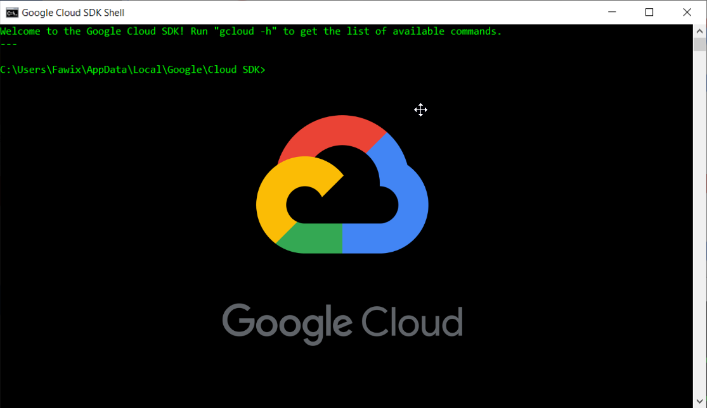
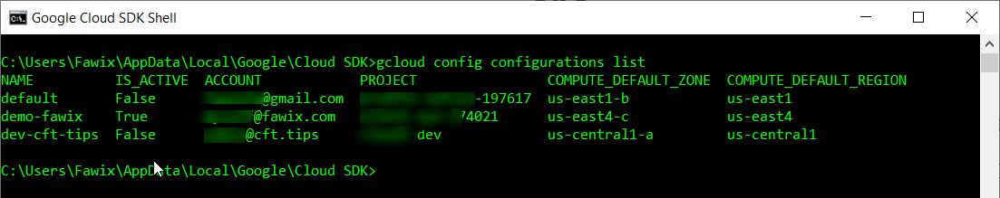

How to use multiple accounts with gcloud - Google Cloud - Community - Medium

## GCP TIPS

# How to use multiple accounts with gcloud

## Learn how to easily switch contexts with gcloud.

[Fatima Silveira](https://medium.com/@mfsilv?source=post_page-----848fdb53a39a----------------------)

[Apr 17](https://medium.com/google-cloud/how-to-use-multiple-accounts-with-gcloud-848fdb53a39a?source=post_page-----848fdb53a39a----------------------) · 2 min read

Do you want to know how to work with multiple accounts and organizations in *gcloud* while keeping your sanity? Let me share with you a little known feature in *gcloud* that does just that.

# gcloud config configurations

There is a sub-module in *gcloud config *that allows you to group a set of *configurations* and give it a name. You can then activate it on-demand! This means it becomes super easy to switch between different accounts or organizations whenever you need. In other words, context switching.

This is how you use it:
gcloud config configurations activate config-name

Switching between configurations is very simple and it carries all the information you set when you created it — this means that you don’t have to login again even if you are using different credentials. Simply type the command above *et voilà.*

* * *

*...*

Before we get into details on how to create them, let me give you a few examples when this is useful:

- Switching between environments with distinct regions and zones.
- Switching between different credentials, especially for testing.
- Switching between completely different organizations.

gcloud configurations example. Source: my terminal

Notice on the screenshot above that I have accounts for different organizations, projects, compute zone, and compute region — and these are only a subset of [possible settings](https://cloud.google.com/sdk/gcloud/reference/config/set).

* * *

*...*

Of course to use a *configuration* you must first create it. This step requires a bit of typing but it’s a one-time effort, and will save a lot of time in the long run. This is how you create a new configuration:

|     |     |
| --- | --- |
| 1   | $ gcloud config configurations create config-name |
| 2   | Created [demo-config]. |
| 3   | Activated [demo-config]. |
| 4   |     |
| 5   | $ gcloud config set project my-project-id |
| 6   | Updated property [core/project]. |
| 7   |     |
| 8   | $ gcloud config set account my-account@example.com |
| 9   | Updated property [core/account]. |
| 10  |     |
| 11  | $ gcloud config set compute/region us-east1 |
| 12  | Updated property [compute/region]. |
| 13  |     |
| 14  | $ gcloud config set compute/zone us-east1-b |
| 15  | Updated property [compute/zone]. |

 [view raw](https://gist.github.com/fawix/8ea183fce91eddbd9e1d73939d28bef8/raw/fc13f0821e47e9a2086e35a6b3858595408f045d/gcloud_config.sh)  [gcloud_config.sh](https://gist.github.com/fawix/8ea183fce91eddbd9e1d73939d28bef8#file-gcloud_config-sh) hosted with ❤ by [GitHub](https://github.com/)

Give the config a memorable name, then add the *project id* and the *account *at a minimum. I typically also set the compute region and zone since I work with these a lot. For development, you may also want to add a service account.

By the way, did you notice I didn’t have to log in when creating the config above? That is because that account was already in use by another configuration. Yes, that easy!

If you do need to add a new account just invoke the following:
gcloud auth login

Using this trick will save you a lot of time and make your experience in *gcloud* better! It’s well worth to learn and configure if you work with multiple contexts;

Ready to create your first configuration? [Let me know how it goes!](https://twitter.com/fawix)