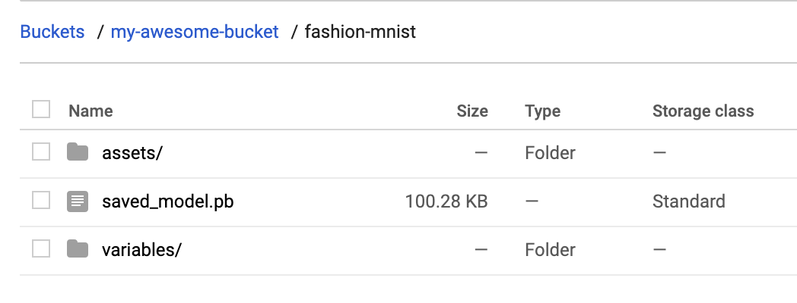
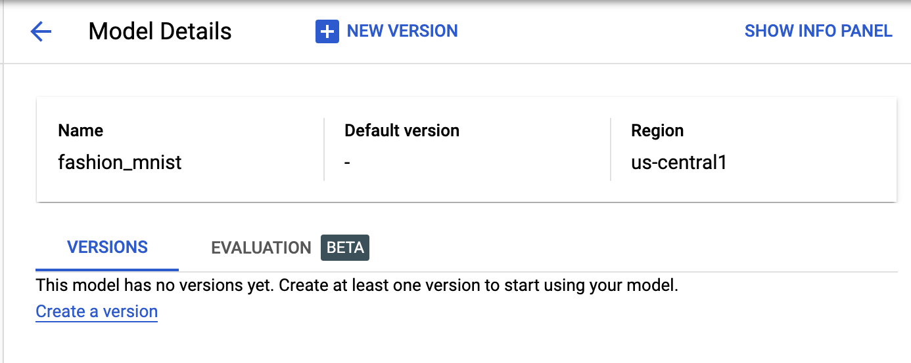
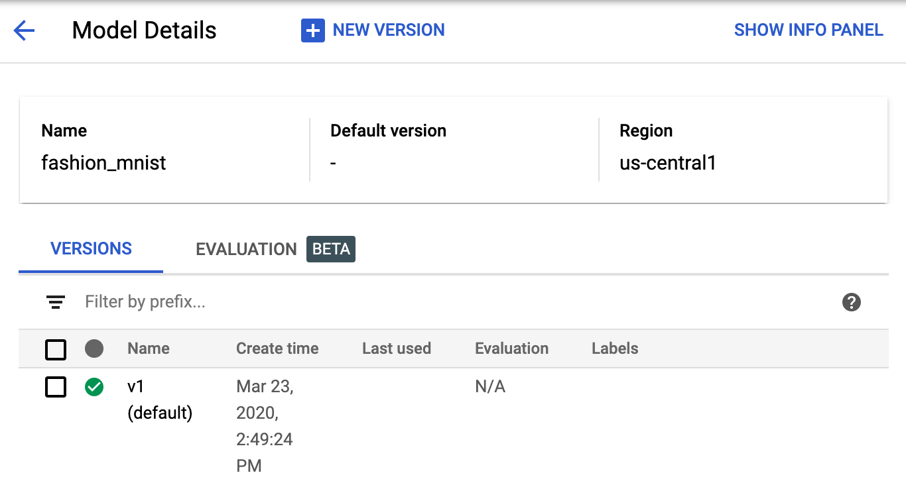
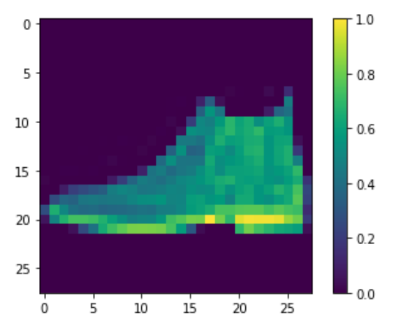
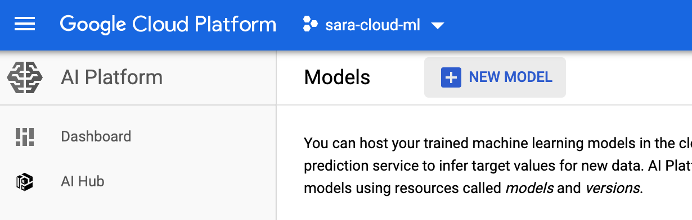
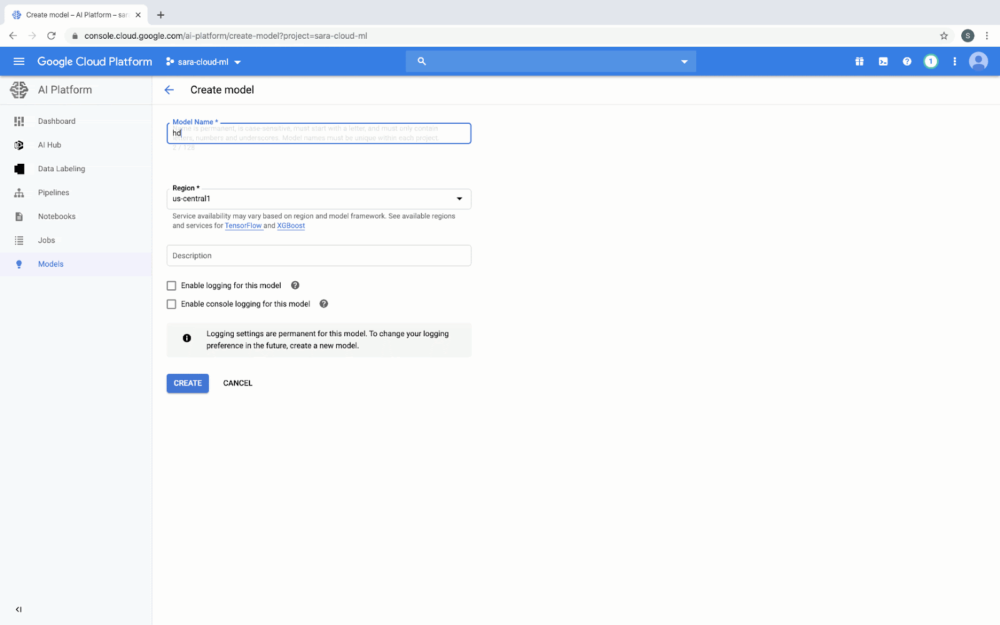

How-to deploy TensorFlow 2 Models on Cloud AI Platform — The TensorFlow Blog

*Posted by [Sara Robinson](https://twitter.com/SRobTweets), Developer Advocate*

Google Cloud’s AI Platform [recently added](https://cloud.google.com/ai-platform/docs/release-notes#March_09_2020) support for deploying TensorFlow 2 models. This lets you scalably serve predictions to end users without having to manage your own infrastructure. In this post, I’ll walk you through the process of deploying two different types of TF2 models to [AI Platform](https://cloud.google.com/ai-platform) and use them to generate predictions with the AI Platform Prediction API. I’ll include one example for an image classifier and another for structured data. We’ll start by adding code to existing TensorFlow [tutorials](https://www.tensorflow.org/tutorials), and finish with models deployed on AI Platform.

In addition to cloud-based deployment options, TensorFlow also includes open source tools for deploying models, like [TensorFlow Serving](https://www.tensorflow.org/tfx/guide/serving), which you can run on your own infrastructure. Here, our focus is on using a managed service.

AI Platform supports both autoscaling and manual scaling options. Autoscaling means your model infrastructure will scale to zero when no one is calling your model endpoint so that you aren’t charged when your model isn’t in use. If usage increases, AI Platform will automatically add resources to meet demand. Manual scaling lets you specify the number of nodes you’d like to keep running at all times, which can reduce cold start latency on your model.

The focus here will be on the deployment and prediction processes. AI Platform includes a variety of tools for custom model development, including infrastructure for training and hosted notebooks. When we refer to AI Platform in this post, we’re talking specifically about [AI Platform Prediction](https://cloud.google.com/ai-platform/prediction/docs/overview), a service for deploying and serving custom ML models. In this post, we’ll build on [existing tutorials](https://www.tensorflow.org/tutorials/keras/classification) in the TensorFlow docs by adding code to deploy your model to Google Cloud and get predictions.

In order to deploy your models, you’ll need a Google Cloud project with billing activated (you can also use the [Google Cloud Platform Free Tier](https://cloud.google.com/free/)). If you don’t have a project yet, follow the instructions [here](https://cloud.google.com/resource-manager/docs/creating-managing-projects) to create one. Once you’ve created a project, [enable](https://console.cloud.google.com/flows/enableapi?apiid=ml.googleapis.com,compute_component&_ga=2.151299519.784334601.1584974202-413280468.1556849151) the AI Platform API.

### Deploying a TF2 image model to AI Platform

To show you how to deploy a TensorFlow 2 model on AI Platform, I’ll be using the model trained in [this tutorial](https://www.tensorflow.org/tutorials/keras/classification) from the TF documentation. This trains a model on the [Fashion MNIST dataset](https://github.com/zalandoresearch/fashion-mnist), which classifies images of articles of clothing into 10 different categories. Start by running through that whole notebook. You can click on the “Run in Google Colab” button at the top of the page to get started. Make sure to save your own copy of the notebook so you don’t lose your progress.

We’ll be using the `probability_model` created at the end of this notebook, since it outputs classifications in a more human-readable format. The output of `probability_model` is a 10-element softmax array with the probabilities that the given image belongs to each class. Since it’s a softmax array, all of the elements add up to 1. The highest-confidence classification will be the item of clothing corresponding with the index with the highest value.

In order to connect to your Cloud project, you will next need to authenticate your Colab notebook. Inside the notebook you opened for the Fashion MNIST tutorial, create a code cell:

	from google.colab import auth
	auth.authenticate_user()

Then run the following, replacing “your-project-id-here” with the ID of the Cloud project you created:

	CLOUD_PROJECT = 'your-project-id-here'
	BUCKET = 'gs://' + CLOUD_PROJECT + '-tf2-models'

For the next few code snippets, we’ll be using gcloud: the Google Cloud CLI along with gsutil, the CLI for interacting with Google Cloud Storage. Run the line below to configure gcloud with the project you created:

`!gcloud config set project $CLOUD_PROJECT`

In the next step, we’ll create a Cloud Storage bucket and print our GCS bucket URL. This will be used to store your saved model. You only need to run this cell once:

	!gsutil mb $BUCKET
	print(BUCKET)

Cloud AI Platform expects our model in TensorFlow 2 SavedModel format. To export our model in this format to the bucket we just created, we can run the following command. The `model.save()` method accepts a GCS bucket URL. We’ll save our model assets into a `fashion-mnist` subdirectory:

`probability_model.save(BUCKET + '/fashion-mnist', save_format='tf')`

To verify that this exported to your storage bucket correctly, navigate to your bucket in the [Cloud Console](https://console.cloud.google.com/) (visit storage -> browser). You should see something like this:

With that we’re ready to deploy the model to AI Platform. In AI Platform, a model resource contains different versions of your model. Model names must be unique within a project. We’ll start by creating a model:

	MODEL = 'fashion_mnist'
	!gcloud ai-platform models create $MODEL --regions=us-central1

Once this runs, you should see the model in the [Models section](https://console.cloud.google.com/ai-platform/models) of the AI Platform Cloud Console:

It has no versions yet, so we’ll create one by pointing AI Platform at the SavedModel assets we uploaded to Google Cloud Storage. Models in AI Platform can have many versions. Versioning can help you ensure that you don’t break users who are dependent on a specific version of your model when you publish a new version. Depending on your use case, you can also serve different model versions to a subset of your users, for example, to run an experiment.

You can create a version either through the Cloud Console UI, gcloud, or the AI Platform API. Let’s deploy our first version with gcloud. First, save some variables that we’ll reference in our deploy command:

	VERSION = 'v1'
	MODEL_DIR = BUCKET + '/fashion-mnist'

Finally, run this gcloud command to deploy the model:

	!gcloud ai-platform versions create $VERSION \
	  --model $MODEL \
	  --origin $MODEL_DIR \
	  --runtime-version=2.1 \
	  --framework='tensorflow' \
	  --python-version=3.7

This command may take a minute to complete. When your model version is ready, you should see the following in the Cloud Console:

### Getting predictions on a deployed image classification model

Now comes the fun part, getting predictions on our deployed model! You can do this with gcloud, the AI Platform API, or directly in the UI. Here we’ll use the API. We’ll use this predict method from the AI Platform docs:

	import googleapiclient.discovery

	def predict_json(project, model, instances, version=None):

	    service = googleapiclient.discovery.build('ml', 'v1')
	    name = 'projects/{}/models/{}'.format(project, model)

	    if version is not None:
	        name += '/versions/{}'.format(version)

	    response = service.projects().predict(
	        name=name,
	        body={'instances': instances}
	    ).execute()

	    if 'error' in response:
	        raise RuntimeError(response['error'])

	    return response['predictions']

We’ll start by sending two test images to our model for prediction. To do that, we’ll convert these images from our test set to lists (so it’s valid JSON) and send them to the method we’ve defined above along with our project and model:

`test_predictions = predict_json(CLOUD_PROJECT, MODEL, test_images[:2].tolist())`

In the response, you should see a JSON object with softmax as the key, and a 10-element `softmax` probability list as the value. We can get the predicted class of the first test image by running:

`np.argmax(test_predictions[0]['softmax'])`

Our model predicts class 9 for this image with 98% confidence. If we look at the beginning of the notebook, we’ll see that 9 corresponds with ankle boot. Let’s plot the image to verify our model predicted correctly. Looks good!

	plt.figure()
	plt.imshow(test_images[0])
	plt.colorbar()
	plt.grid(False)
	plt.show()

### Deploying TensorFlow 2 models with structured data

Now that you know how to deploy an image model, we’ll look at another common model type - a model trained on structured data. Using the same approach as the previous section, we’ll use [this tutorial](https://www.tensorflow.org/tutorials/structured_data/feature_columns) from the TensorFlow docs as a starting point and build upon it for deployment and prediction. This is a binary classification model that predicts whether a patient has heart disease.

To start, make a copy of the tutorial in Colab and run through the cells. Note that this model takes Keras feature columns as input and has two different types of features: numerical and categorical. You can see this by printing out the value of `feature_columns`. This is the input format our model is expecting, which will come in handy after we deploy it. In addition to sending features as tensors, we can also send them to our deployed model as lists. Note that this model has a mix of numerical and categorical features. One of the categorical features (`thal`) should be passed in as a string; the rest are either integers or floats.

Following the same process as above, let’s export our model and save it to the same Cloud Storage bucket in a `hd-prediction` subdirectory:

`model.save(BUCKET + '/hd-prediction', save_format='tf')`

Verify that the model assets were uploaded to your bucket. Since we showed how to deploy models with gcloud in the previous section, here we’ll use the Cloud Console. Start by selecting **New Model** in the Models section of AI Platform in the Cloud Console:

Then follow these steps (you can see a demo in the following GIF, and you can read about them in the text below).

Head over to the [models section](https://console.cloud.google.com/ai-platform/models) of your Cloud console. Then select the **New model** button and give your model a name, like [object Object] and select **Create**.

Once your model resource has been created, select **New version**. Give it a name (like [object Object]), then select the most recent Python version (3.7 at the time of this writing). Under frameworks select **TensorFlow** with Framework version **2.1** and ML runtime version **2.1**. In **Model URL**, enter the Cloud Storage URL where you uploaded your TF SavedModel earlier. This should be equivalent to [object Object] if you followed the steps above. Then select **Save**, and when your model is finished deploying you’ll see a green checkmark next to the version name in your console.

To format our data for prediction, we’ll send each test instance as JSON objects with keys being the name of our features and the values being a list with each feature value. Here’s the code we’ll use to format the first two examples from our test set for prediction:

	# First remove the label column
	test = test.pop('target')

	caip_instances = []
	test_vals = test[:2].values

	for i in test_vals:
	    example_dict = {k: [v] for k,v in zip(test.columns, i)}
	    caip_instances.append(example_dict)

Here’s what the resulting array of `caip_instances` looks like:

	[{'age': [60],
	  'ca': [2],
	  'chol': [293],
	  'cp': [4],
	  'exang': [0],
	  'fbs': [0],
	  'oldpeak': [1.2],
	  'restecg': [2],
	  'sex': [1],
	  'slope': [2],
	  'thal': ['reversible'],
	  'thalach': [170],
	  'trestbps': [140]},
	...]

We can now call the same `predict_json` method we defined above, passing it our new model and test instances:

`test_predictions = predict_json(CLOUD_PROJECT, 'hd_prediction', caip_instances)`

Your response will look something like the following (exact numbers will vary):
`[{'output_1': [-1.4717596769332886]}, {'output_1': [-0.2714746594429016]}]`

Note that if you’d like to change the name of the output tensor (currently `output_1`), you can add a `name` parameter when you define your Keras model in the tutorial above:

`layers.Dense(1, name='prediction_probability')`

In addition to making predictions with the API, you can also make prediction requests with gcloud. All of the prediction requests we’ve made so far have used online prediction, but AI Platform also supports batch prediction for large offline jobs. To create a batch prediction job, you can make a JSON file of your test instances and kick off the job with gcloud. You can read more about batch prediction [here](https://cloud.google.com/ai-platform/prediction/docs/batch-predict).

### What’s next?

You’ve now learned how to deploy two types of TensorFlow 2 models to Cloud AI Platform for scalable prediction. The models we’ve deployed here all use autoscaling, which means they’ll scale down to 0 so you’re only paying when your model is in use. Note that AI Platform also supports *manual scaling*, which lets you specify the number of nodes you’d like to leave running.

If you’d like to learn more about what we did here, check out the following resources:

- [TensorFlow structured data tutorial](https://www.tensorflow.org/tutorials/structured_data/feature_columns)
- [AI Platform Prediction: deploying models guide](https://cloud.google.com/ai-platform/prediction/docs/deploying-models)
- [AI Platform Prediction: online prediction guide](https://cloud.google.com/ai-platform/prediction/docs/online-predict)

I’d love to hear your thoughts on this post. If you’ve got any feedback or topics you’d like to see covered in the future, find me on Twitter at [@SRobTweets](http://twitter.com/SRobTweets).