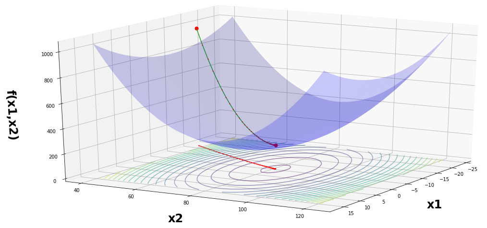
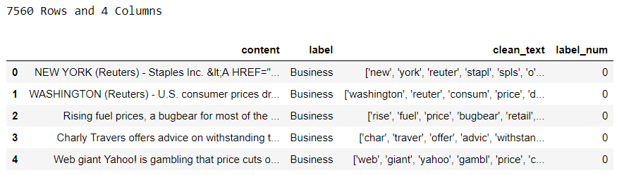
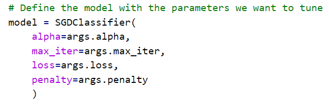

Hyperparameter Tuning On Google Cloud Platform With Scikit-Learn

# Hyperparameter Tuning On Google Cloud Platform With Scikit-Learn

[Rob Salgado](https://towardsdatascience.com/@robert.salgado) in [Towards Data Science](https://towardsdatascience.com/)

[May 20](https://towardsdatascience.com/hyperparameter-tuning-on-google-cloud-platform-with-scikit-learn-7d6155195efb) · 10 min read

Google Cloud Platform’s AI Platform (formerly ML Engine) offers a hyperparameter tuning service for your models. Why should you take the extra time and effort to learn how to use it instead of just running the code you already have on a virtual machine? Are the benefits worth the extra time and effort?

One reason to use it is that AI Platform offers Bayesian Optimization out of the box. It is more efficient than a grid search and will be more accurate than a random search in the long run. They also offer early stopping and the ability to resume a completed training job. That allows you to use past data to run a few more well informed trails if you think you haven’t ran enough trials the first time.

All of that can help speed the hyperparameter tuning process up while doing a better job than either grid search or random search to find the best fit. When training on lot’s of data frequently or running lots of experiments it can definitely save money and time.

Stochastic Gradient Descent Visualized [Source](https://gist.github.com/felipessalvatore/c2e1c09dfcb8710b847e2457620f8204)

As always, all my code can be found on my git hub [page](https://github.com/robsalgado/personal_data_science_projects/tree/master/hp_tuning_gcp). After going through how to run a hyperparameter tuning job on GCP, I’ll compare the training time and cost for three predefined machines that they offer.

I’ll also show how to retrieve the best hyperparameters from the training run automatically from the api. You can then pass those directly into your production model or if you’re running experiments save them in a csv on Google Cloud Storage, a table in BigQuery or wherever you want for analysis later.

So what is Bayesian Optimization for hyperparameter tuning anyway? Hyperparameter tuning is an optimization problem which means the exact nature is unknown and expensive to compute so it would be beneficial to go about it in an informed way.

> Bayesian optimization is an extremely powerful technique when the mathematical form of the function is unknown or expensive to compute. The main idea behind it is to compute a posterior distribution over the objective function based on the data (using the famous Bayes theorem), and then select good points to try with respect to this distribution. > [> Source](https://cloud.google.com/blog/products/gcp/hyperparameter-tuning-cloud-machine-learning-engine-using-bayesian-optimization)

That means that as as more trials run and the posterior distribution begins to improve, the hyperparameter values which are most fruitful start to emerge. So by making informed decisions for future hp values based on what the model has learned, we can speed up the process of finding the best fit. To learn more about Bayesian statistics check out this [book](https://greenteapress.com/wp/think-bayes/).

Photo by [Jose Antonio Gallego Vázquez](https://unsplash.com/@joseantoniogall?utm_source=medium&utm_medium=referral) on [Unsplash](https://unsplash.com/?utm_source=medium&utm_medium=referral)

There’s 4 main parts to submitting a hyperparameter tuning job on GCP:

- A training file which includes the usual code with the model you want to use and the score you want to evaluate the model on. It also includes an argument parser to add in the hp values for the different parameters you want to tune for each trial
- A yaml file with the hyperparameter values you want to use in the training file
- A shell executable file to submit the training job
- A setup file to install the additional dependencies

If you’re not familiar with working in the cloud or on GCP specifically, there are a few extra steps, but I think they are worth it and once you have the framework set up, it’s easy to adapt it to different models.

The model I’m using as an example here is a multiclass text classification model from one of my previous [articles](https://medium.com/@robert.salgado/multiclass-text-classification-from-start-to-finish-f616a8642538). The model isn’t really important here but it’s Stochastic Gradient Descent and before that there’s feature creation (tf-idf) and dimensionality reduction (LSA). You can tune the hyperparameters for those as well if you want. The training data has already been cleaned up and here’s what it looks like:

The classes are perfectly balanced with 1,890 examples each. Let’s take a closer look at each file we’re going to need to run our training job.

# Training File

At the top is the argument parser. This will feed in the hp values for each trail to the estimator from the yaml file. The hp values for the model will be passed in by the argument parser from the yaml file like so:

Then we have to download the training data from Google Cloud Storage. From there the text goes through the tf-idf vectorizer, we define our target and features and then we reduce the dimensions of our target. Then the usual train-test-split and then we fit the training data to the classifier and predict on the test data.

After that we define our score which is just going to be accuracy in this case since we have balanced classes. The next bit is calling the hypertune library where we set our metric and the global step that the metric value is associated with. After each trial, the model is saved in the GCS folder you specify.

# Hyperparameter Configuration File

In the first part of this file, you specify the goal which in our case is to maximize the accuracy. If you were trying to optimize based on something like RMSE, then you would want to set this to minimize. Then you set the number of trials you want to run. The more trials the better but there definitely is a point of diminishing returns. They recommend setting the number of trails to at least 10x the number of parameters you have which would be 50 in our case.

Next you have to specify the number of concurrent trials you want to run. Running trials in parallel reduces the time it takes to run but can also reduce the effectiveness when using Bayesian Optimization. This is because it uses the results of previous trials to inform the hp values for subsequent trials.

Then you have to pass in the hp metric tag and finally you can also enable early stopping which will stop a trial if it’s obvious it’s not going to be fruitful and save time. After that, you define the min/max value or different types/categories for each hp which is pretty straight forward and essentially what you are doing in a grid search.

Then you have to define what you want to happen for each parameter. When you have a range of values you want to explore, you can either pass in discrete values like I’m doing here for ‘n_components’ or give a min/max range and have it go through and scale the values to search through linearly. They also have a log scale and a reverse log scale option you can use if the space you’re searching through is very large. For categorical one’s you have to pass those discreet values.

Optionally you can also specify a search algorithm. If you don’t it defaults to Bayesian Optimization. The other choices are grid search or random search so you can do those as well. This is also where you can resume an earlier trial if you think more trials can be worth it by using ‘ resumePreviousJobId’ field and passing in the job id.

# Setup File

This simply downloads the hypertune library dependency we need. If you need other dependencies you cannot download directly to AI Platform you can add them here. Here the only thing we need is the hypertune library.

# Shell Script

This contains the variables and gcloud commands we need to submit the training job. In terms of the variables, the ‘bucket name’ is the bucket you want the models to be downloaded to and the ‘job directory’ is the folder within the bucket where you want the models saved to. It’s good practice to add in a timestamp to the ‘job name’ for future identification.

The ‘training package path’ is the folder you saved your files to on GCP and the ‘main trainer module’ is the file with the model and argument parsers. You also need to set the runtime version for the AI Platform, the python version, the region, the scale tier as well as point to where the hp config yaml file is.

Then the actual gcloud commands to run the training job which use the above variables we defined. The last part is an optional command if you want to stream the logs to the console but you can certainly close the shell at that point and do something else.

# Putting Everything Together

Open up the code editor which can be be accessed on GCP by opening the shell and clicking on the ‘pen’ icon on the bottom right: