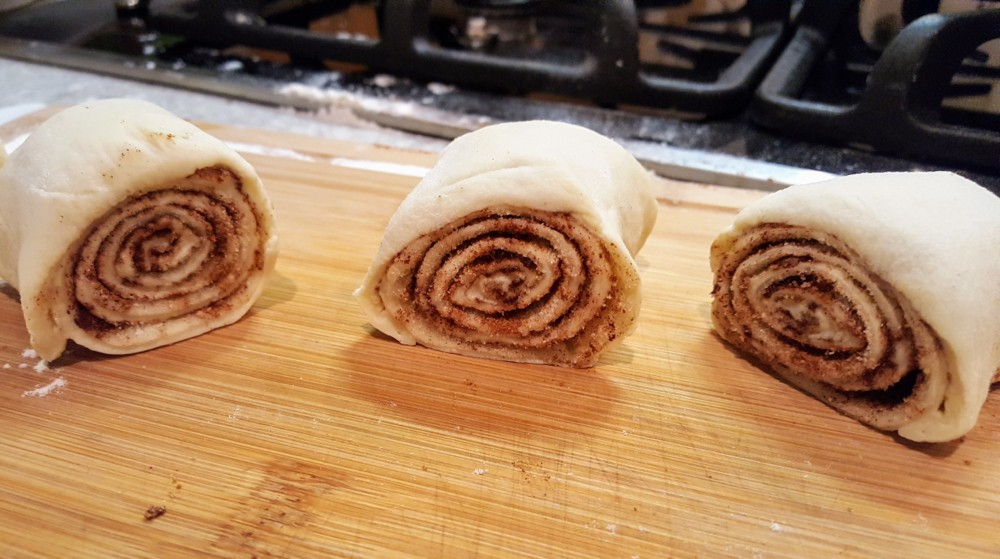
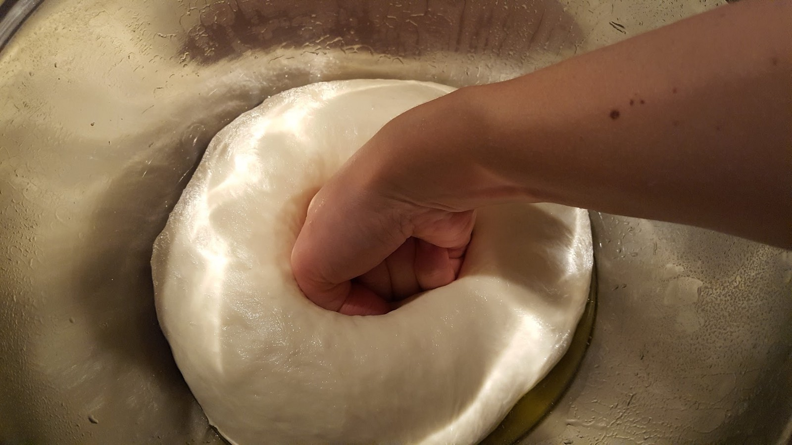
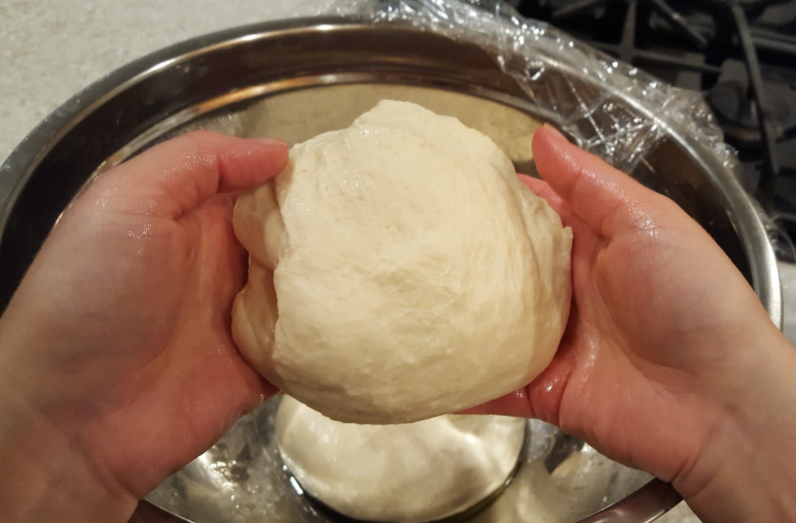
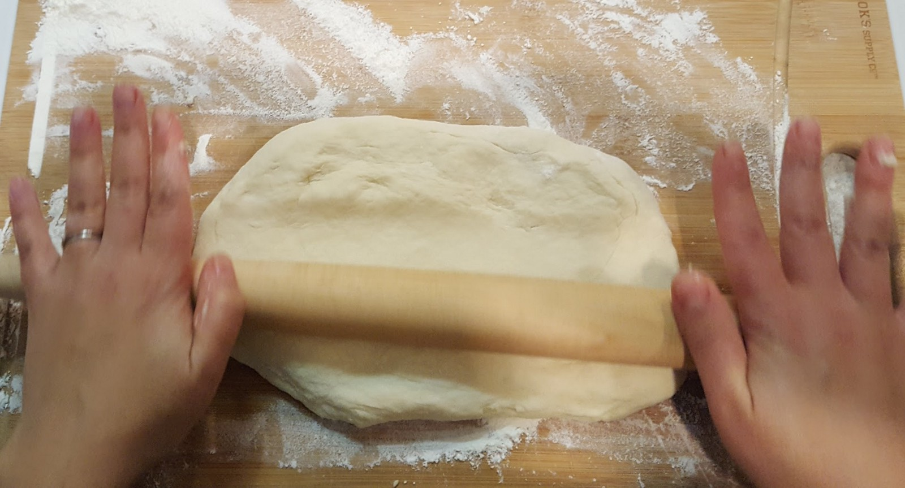
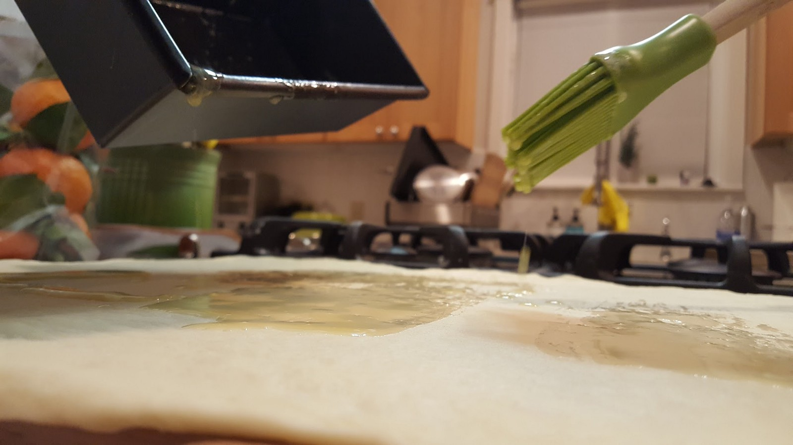
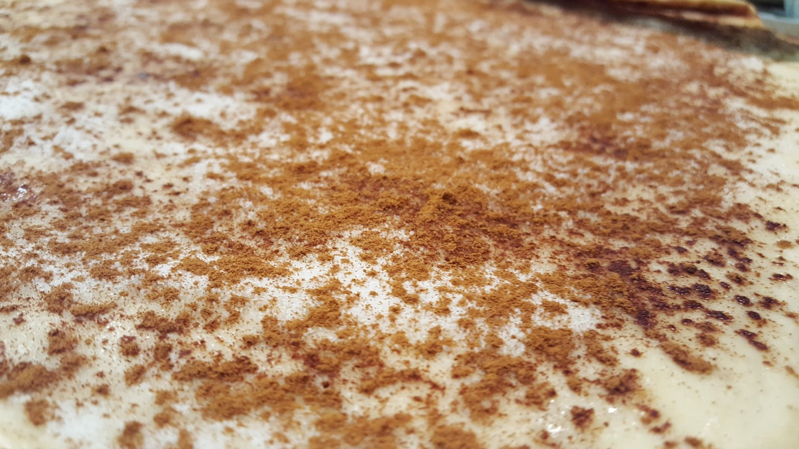
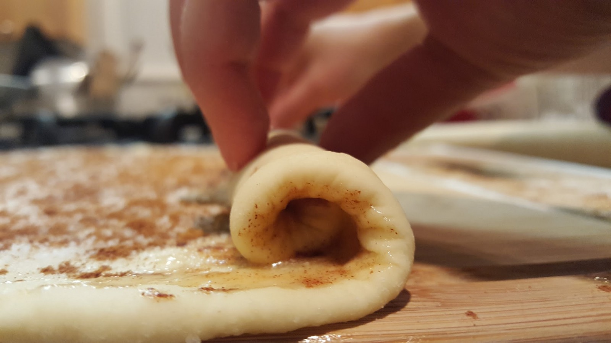
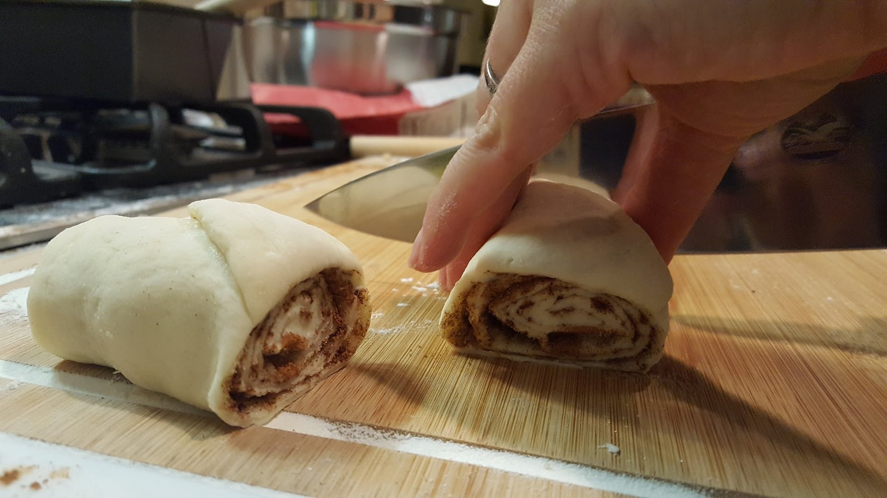
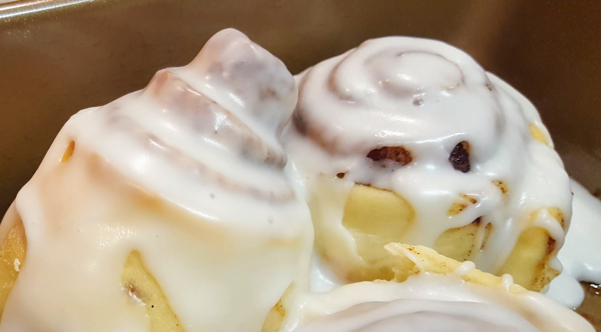
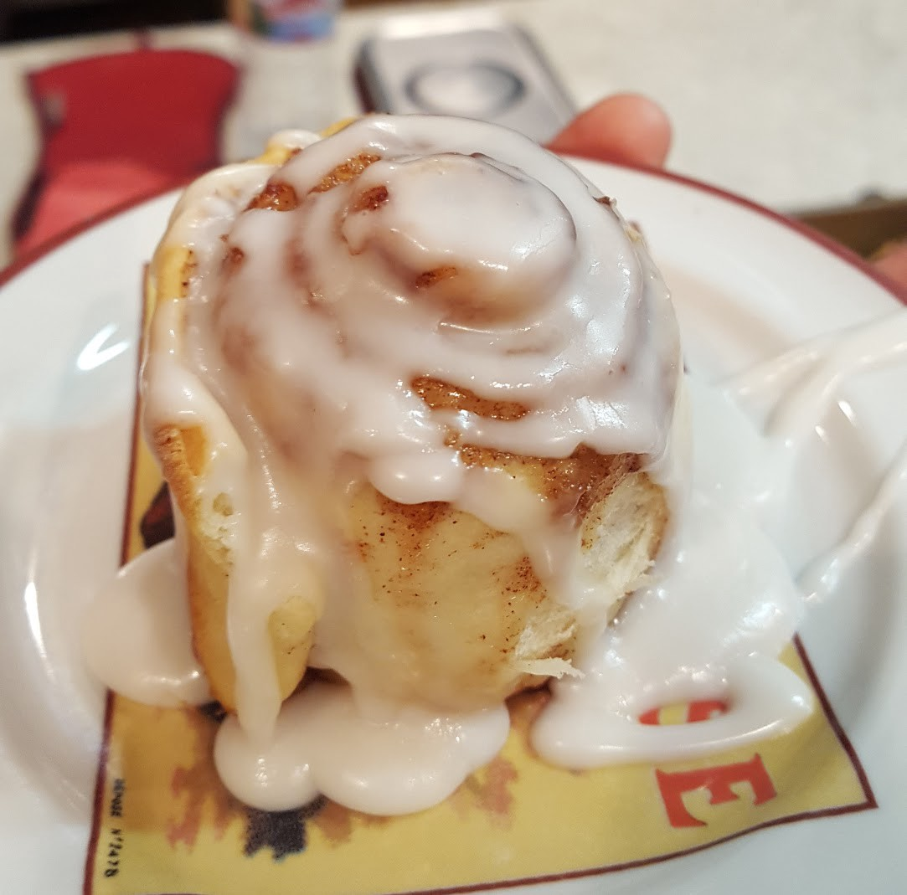

I Made the Pizza Cinnamon Rolls from Mario Batali’s Sexual Misconduct Apology Letter

# I Made the Pizza Cinnamon Rolls from Mario Batali’s Sexual Misconduct Apology Letter

Last night, I made cinnamon rolls. I’m not a huge fan of cinnamon rolls, per se, but this recipe was included in [Mario Batali’s sexual misconduct apology letter](http://time.com/5067633/mario-batali-cinnamon-rolls-apology/), and so I feel compelled to make them. Batali is not the first powerful man to request forgiveness for “inappropriate actions” towards his coworkers and employees. He is not the most high profile, and he is ostensibly not even the worst offender. But he is the only one who included a recipe.

And of course, the glaring question is why? Was his PR team drunk? Is life suddenly a really long, depressing *SNL* sketch? Do these cinnamon rolls somehow destroy the patriarchy? Does the icing advocate for equal pay?

I figure the only way to answer these questions is to make the damn rolls.

I bake a lot. Never one to pass up on a pun, my husband doesn’t bring me flowers, but flours. I’ve become skilled to the point that I can make a dessert from virtually anything, that I can have a small cake made from start to finish — including baking time — on the table in about half an hour.

Good baking, I’ve been told, comes from love, and treacly as that sounds, I find some truth in it. Good baking means being able to roll with setbacks and mistakes and ovens that for some reason run twenty degrees hot but only on Sundays, a metaphor so aligned with loving someone that it feels almost too obvious. Good baking requires an attention to detail and care that is hard to muster when you just don’t give a shit or you are distracted by your own rage.

Good baking means you have to trust yourself.

I find myself fluctuating between apathy and anger as I try to follow Batali’s recipe, which is sparse on details. The base of the rolls is pizza dough — Batali notes that you can either buy it, or use his recipe to make your own.

I make my own, because I’m a woman, and for us there are no fucking shortcuts. We spend 25 years working our asses off to be the most qualified Presidential candidate in U.S. history and we get beaten out by a sexual deviant who likely needs to call the front desk for help when he’s trying to order pornos in his hotel room.

Donald Trump is President, so I’m making the goddamn dough by scratch.

Here I am punching down the dough because, according to Twitter, I hate men.

I use Batali’s recipe that he’s linked to, which I’ve made before, and I’m already hesitant. Pizza dough is chewy and crispy, not tender — the latter is what you’d hope cinnamon rolls would be. It’s a savory recipe — incorporating white wine and a generous amount of salt — and I feel like he’s shoe-horning it into a dessert where it doesn’t belong. He’s cutting corners because he gets to cut corners.

I roll out the dough — Batali specifies a thickness, but no dimensions, which is strange if you’re making a rolled dessert. There are pieces missing here, and I’m trying to fill in the gaps. The result will be sub-par because he hasn’t provided all the information, and I will blame myself.

I baste a layer of melted butter over the dough.

A guy on Twitter tells me that I’m a vile man-hater. His feed contains a photo of my very-alive husband wearing a feminist t-shirt. Underneath he’s written the message “RIP.”

I sprinkle the sugar and cinnamon over the top.

I think about the time that I was an intern at a local news station, and assigned to hand out cake while celebrating some milestone (it had to do with the Salt Lake City Winter Olympics.) One of the producers I’d been working with closely walked up to the table.

“Do you want a piece?” I asked.

“Yeah,” he said, looking me up and down. “Oh, you mean of cake? No thanks.” He and another male staff member laughed while I stood, holding a piece of cake in each hand, dumbstruck.

Batali does not specify how tightly to roll the dough. I do so too tightly because fuck everything.

I remember the time another producer walked his fingers across my lap while I was typing at a computer. I turned to stare at him, and he grabbed my badge which was clipped to my waist.

“I wanted to see how your last name was spelled.”
I think I’ve used too much dough.

I think about how the last conversation about compensation I had resulted in someone who made more yearly than I ever will telling me I was holding them “emotionally hostage” and then demanding to know, over and over again why I needed the money.

“Just tell me,” they demanded. “Tell me why you need it.” Over and over until it broke me.

If they are edible, I will eat every single one of these fucking rolls myself.

Batali says to cut them in slices roughly three inches thick, which is too wide. The rolls should not be that thick. I know this is wrong, but I do it anyway because that is what the recipe says. (I am not following my gut and cutting them thinner. If I had, I suspect the results would have been better. But for most of us, going off book isn’t an option.) There is no estimation of how many rolls the recipe should yield. Batali says to place the rolls in a small cake pan, but again, there are no dimensions.

My husband hovers close by, doing a little excited jig. Few things delight him like elaborate desserts made for no apparent reason on a weeknight. But he soon links the pieces together and stops dancing.

“Oh, god,” he says. “These are *those* cinnamon rolls, aren’t they?”
I nod.

I put them in the oven. I think about how Michelle Williams made less than [$1000 for a reshoot of a movie for which Mark Wahlberg made $1.5M](http://money.cnn.com/2018/01/10/media/mark-wahlberg-michelle-williams-pay-gap/index.html).

Because I’ve rolled them too tightly, the middle pops up and out of one of the rolls.

One of the cinnamon rolls has a *fucking* erection.

The recipe calls for too much icing, and the result is that the rolls are drenched in it. We’ve reached the “ARE YOU FUCKING KIDDING ME” portion of the recipe.

The pizza dough does not mix well with the sweetness. The icing is sickly sweet, the rolls themselves oddly savory. I was right about the texture — the dough is too tough. I hate them, but I keep eating them. Like I’m somehow destroying Batali’s shitty sexist horcrux in every bite.

I remind myself that is not how recipes work. That isn’t even how dark magic works.

I know that in the court of the internet, any output that is less than perfect will be blamed on me, and not on a hastily-written, untested recipe. I’ve made flaky pie crusts in the kitchens of Air BnBs using warped cutting boards and a bottle of wine as a rolling pin, but this won’t matter. *I’ve* fucked up the recipe.

Most women don’t even need to hear the shitty comments made to us anymore. We’ve heard them so many times, we can create our own.

*Maybe if you spent less time whining about men who want to fuck you (which you should take as a compliment because who the hell would want to fuck you, anyway), and more time in the kitchen, this wouldn’t happen.*

I throw the rest of the cinnamon rolls in the trash.
(Okay, fine, I eat two more.)

*Of course you did. Jesus fucking Christ, you’re disgusting and your husband does not love you.*

Batali’s another drop in the bucket. He’s not the first, he certainly won’t be the last (he already isn’t). The misogyny runs so deep that the calls now come from inside our heads. We blame ourselves. We hate ourselves. We wonder if our skirts are too short, if our bodies are too noticeable. If we’re asking for too much, or not enough. We don’t trust ourselves, even when we should.

We try to follow a half-written recipe and think it’s our fault when it doesn’t work.

We need to undo an entire humanity’s history worth of hate against women. Apologies are a good start.

Just skip the goddamn recipe.