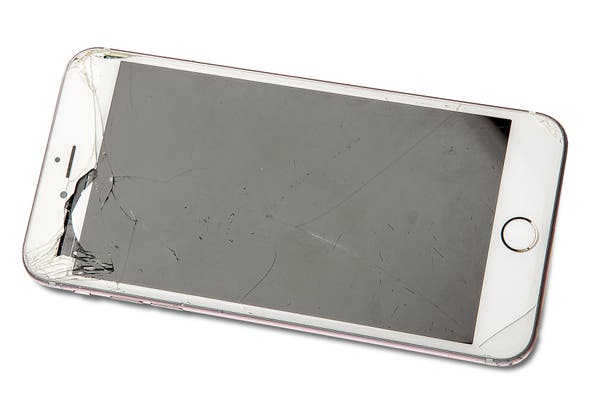

I Quit My Smartphone - The New York Times

Advertisement

[Continue reading the main story](https://www.nytimes.com/2020/01/20/style/quit-smartphone.html#after-top)

Unauthorized access.

Image

Credit...Photo Illustration by Tony Cenicola/The New York Times

# I Quit My SmartphoneI Quit My Smartphone

Thanks to the Allen Carr technique for
quitting smoking.
By Lisa Wells
Jan. 20, 2020
* * *

About a year ago, I noticed a distressing tendency in myself to drift off while the people I loved were talking. It didn’t matter if they were talking about a book they had read or recent health problems or crushing grief or revelations from therapy.

Never before had I struggled to listen, but now I couldn’t help checking out. Several times in the last year, my husband has had to ask in the middle of a conversation, “Where did you go?”

Where *did* I go? Nowhere good. Usually my mind returned me to the small computer in my pocket, to an unanswered email, to a “like” or a retweet, to a comment I found threatening or flattering (though increasingly, any kindness I received through a device acted on my nervous system like derision).

Suffice to say, I went away. In giving my attention to the device, I withheld it from the person I value most.

Advertisement

[Continue reading the main story](https://www.nytimes.com/2020/01/20/style/quit-smartphone.html#after-story-ad-1)

And there were other troubling symptoms. It was hard to read or write for sustained periods, which is concerning because that is my job. I was forcing myself to push through a handful of pages before reaching for the phone as reward — orienting toward the activities I loved as if they were chores, and toward the object as a source of pleasure (though it was more often a source of anxiety).

I hadn’t deliberately chosen to worship my smartphone, but when you repeatedly bow your head to something, stroking it thousands of times a day, it begins to shine like an idol.

I tried to moderate, leaving the phone off or at home when I went for a walk. But rather than feeling free, I felt more tightly leashed, worried about missing phantom emergencies. I’d reflexively pat my body down, like I did when I first quit smoking: the addiction policing the addict. Come to think of it, this was all beginning to feel very familiar.

Once upon a time, I smoked a half a pack a day. Sometimes I smoked more, sometimes less, but I was a smoker through and through. Before I quit, I couldn’t imagine life without cigarettes, my constant companion, my carcinogenic security blanket!

I leaned on them for everything. They calmed my stress, anger and fear. They underscored celebration and increased pleasure.

Advertisement

[Continue reading the main story](https://www.nytimes.com/2020/01/20/style/quit-smartphone.html#after-story-ad-2)

I used them as an excuse to be outdoors, to escape socializing, or as entree to a circle of others. I loved the good will fellowship of smokers, the gift economy of bumming. I loved the ceremony of packing a fresh pack, undressing the cellophane, lighting up, stubbing out. I loved it all. Frankly, I still think smoking looks cool, and quite often sexy.

No one thought I would quit smoking — least of all me — but I did. Not because I was fed up with smelling bad, or being sick all the time, or because I knew smoking caused cancer and heart disease.

Instead, it was because every hour on the hour, no matter where I was, who I was talking to or what I was doing, an internal timer would go off alerting me to my master’s need, pulling my focus away no matter how desperately I wanted to stay in the moment.

“Each cigarette causes the craving for the next, to fill the emptiness caused by the nicotine leaving your body.”

I had read this in “The Easy Way to Stop Smoking,” a 1985 book by Allen Carr that helped me (and purported millions of others) to quit cold turkey. To paraphrase a key point: You do not smoke because you need something to do with your hands, or because you love the ritual of it, or any of the other excuses people make. You smoke because you’re addicted to a powerful drug called nicotine.

“Get it clear in your mind,” he writes. “CIGARETTES DO NOT FILL A VOID. THEY CREATE ONE!”

I wound up kicking nicotine by never smoking another cigarette. It was that simple. It was hellish at first, and then I got used to it.

Advertisement

[Continue reading the main story](https://www.nytimes.com/2020/01/20/style/quit-smartphone.html#after-story-ad-3)

Smartphones are not cigarettes (I’d argue their charms are fewer), but like cigarettes, those who design and peddle them have worked hard to cultivate addiction in their users, creating voids that only they can fill. I don’t deny the convenience and timesaving benefits in having a smartphone, but I don’t think*  *convenience is what is driving people to stroke their screens [about 2,600 times a day](https://blog.dscout.com/mobile-touches).

So I got rid of my smartphone. And brother, it was approximately one million times easier than quitting smoking. I can check my email and social media platforms on a laptop as needed, but now that they are out of my pocket they no longer nag at me.

Turns out using a dumbphone is like riding a bike; T9 (the old-fashioned texting we used to do using the nine numerical buttons) is not nearly as bad as I’d remembered. I have a gazetteer in the car, and when that fails, I ask people for directions. (This typically prompts the Samaritan to pull out a smartphone.)

It took about 72 hours to teach my body that we had gone back to the old ways, and though I had assumed it would take much longer, the change was almost instantaneous. Moderation requires effort and will power, but when the device is gone there is nothing to resist. I can read a book for hours in a sitting, and when my loved ones speak I hear the story they’re telling.

Which is to say, I am free again to enjoy the things I have always loved, to worship the god I choose.

Advertisement

[Continue reading the main story](https://www.nytimes.com/2020/01/20/style/quit-smartphone.html#after-story-ad-4)

* * *

[# I Also Quit](https://www.nytimes.com/interactive/2020/01/20/style/quitters.html)

[My Job](https://www.nytimes.com/2020/01/20/style/quit-job.html)
,

[A Band](https://www.nytimes.com/2020/01/20/style/steve-gorman-black-crowes.html)

,
[Gum](https://www.nytimes.com/2020/01/20/style/quit-chewing-gum.html)
,

[The Presidential Campaign](https://www.nytimes.com/2020/01/20/style/marianne-williamson-presidential-race.html)

,
[New York](https://www.nytimes.com/2020/01/20/style/quit-new-york.html)
,
[Sex](https://www.nytimes.com/2020/01/20/style/quit-sex.html)
,

[The Priesthood](https://www.nytimes.com/2020/01/20/style/leaving-priesthood.html)

,
[Cars](https://www.nytimes.com/2020/01/20/style/quit-cars.html)
,
[My Smartphone](https://www.nytimes.com/2020/01/20/style/quit-smartphone.html)
,
[Dating](https://www.nytimes.com/2020/01/20/style/no-sex-celibacy.html)
,
[Caring](https://www.nytimes.com/2020/01/20/style/stop-giving-a-damn.html)
,
[My Church](https://www.nytimes.com/2020/01/20/style/left-church.html)
,

[Skincare](https://www.nytimes.com/2020/01/20/style/quit-skin-care-routine.html)

,
[Dating Apps](https://www.nytimes.com/2020/01/20/style/quit-dating-apps.html)
,

[My Laundry Service](https://www.nytimes.com/2020/01/20/style/quit-convenience-culture.html)

,
[An Affair](https://www.nytimes.com/2020/01/20/style/quit-affair.html)
,
[Yale](https://www.nytimes.com/2020/01/20/style/quit-yale.html)
,
[Friendships](https://www.nytimes.com/2020/01/20/style/quit-friendship.html)
,

[Buying Things](https://www.nytimes.com/2020/01/20/style/quit-buying-things.html)

,
[Quitting](https://www.nytimes.com/2020/01/20/style/quit-quitting.html)
,

[This Assignment](https://www.nytimes.com/2020/01/20/style/quit-this-assignment.html)

21 stories of walking away.

* * *

[Lisa Wells](https://www.lisawellswriter.com/) lives in Seattle and is the author of “The Fix,” a collection of poetry.

Photo illustration by Tony Cenicola/The New York Times