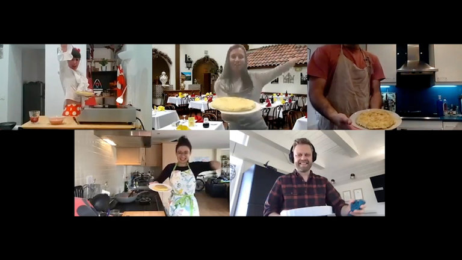
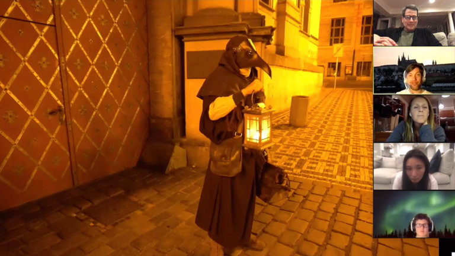
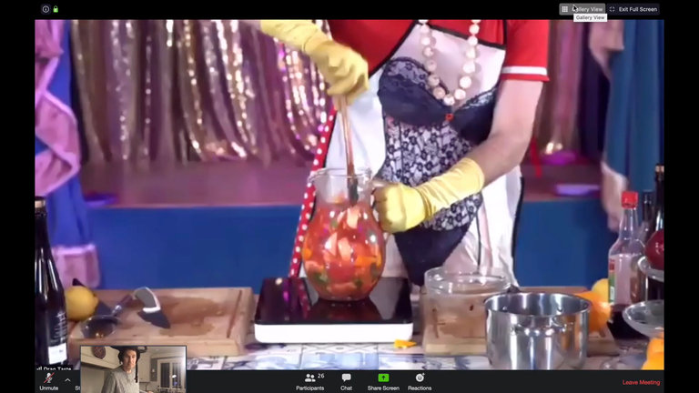

I Spent a Weekend Bingeing Airbnb’s Virtual Experiences. Was it Worth It? - The New York Times

 [At Home](https://www.nytimes.com/spotlight/at-home?action=click&pgtype=Article&state=default&module=STORY_MAPS_ATH_promo&variant=show&region=TOP_BANNER&context=at_home_menu)  ›

- [Cook: Baked Rajma](https://www.nytimes.com/2020/05/04/dining/your-new-favorite-beans.html?action=click&pgtype=Article&state=default&module=STORY_MAPS_ATH_promo&variant=show&region=TOP_BANNER&context=at_home_menu)

- [Read: Stephen King](https://www.nytimes.com/interactive/2020/05/04/arts/best-stephen-king-books.html?action=click&pgtype=Article&state=default&module=STORY_MAPS_ATH_promo&variant=show&region=TOP_BANNER&context=at_home_menu)

- [Smash: A Coronavirus Piñata](https://www.nytimes.com/2020/05/04/style/coronavirus-pinata-papier-mache.html?action=click&pgtype=Article&state=default&module=STORY_MAPS_ATH_promo&variant=show&region=TOP_BANNER&context=at_home_menu)

- [Get: An Indoor Plant](https://www.nytimes.com/2020/05/04/smarter-living/coronavirus-indoor-plants.html?action=click&pgtype=Article&state=default&module=STORY_MAPS_ATH_promo&variant=show&region=TOP_BANNER&context=at_home_menu)

# I Spent a Weekend Bingeing Airbnb’s Virtual Experiences. Was it Worth It?

While the rest of the country was binge-watching, David Pogue went binge-experiencing, cramming seven virtual Airbnb courses into a single weekend.

Video

By [David Pogue](https://www.nytimes.com/by/david-pogue)

- May 4, 2020

-

    - 
    - 
    - [](https://www.nytimes.com/2020/05/04/travel/airbnb-online-experiences-virus.htmlmailto:?subject=NYTimes.com%3A%20I%20Spent%20a%20Weekend%20Bingeing%20Airbnb%E2%80%99s%20Virtual%20Experiences.%20Was%20it%20Worth%20It%3F&body=From%20The%20New%20York%20Times%3A%0A%0AI%20Spent%20a%20Weekend%20Bingeing%20Airbnb%E2%80%99s%20Virtual%20Experiences.%20Was%20it%20Worth%20It%3F%0A%0AWhile%20the%20rest%20of%20the%20country%20was%20binge-watching%2C%20David%20Pogue%20went%20binge-experiencing%2C%20cramming%20seven%20virtual%20Airbnb%20courses%20into%20a%20single%20weekend.%0A%0Ahttps%3A%2F%2Fwww.nytimes.com%2F2020%2F05%2F04%2Ftravel%2Fairbnb-online-experiences-virus.html%3Fsmid%3Dem-share)

    -
    -

*Travel and travel planning are being disrupted by the worldwide spread of the coronavirus. For the latest updates, read*[* The New York Times’s Covid-19 coverage here*](https://www.nytimes.com/news-event/coronavirus?action=click&module=RelatedLinks&pgtype=Article&action=click&module=RelatedLinks&pgtype=Article)*.*

In the Great Lockdown, two-way video has become our primary social channel. Meetings, parties, concerts, music lessons, exercise classes: Any interactions that can be adapted to a Zoom video call, have been. Surely there’s nothing left to be Zoomified.

Actually, there is. Airbnb recently introduced what it calls [Online Experiences](https://www.airbnb.com/s/experiences/online): Live interactive sessions, conducted over Zoom by guides around the world, for small groups of “tourists” stuck at home. Over the course of an hour or two, the hosts dive into a wide range of artistic, cultural, musical, culinary and athletic topics: “[Dance Like a K-pop Star](https://www.airbnb.com/experiences/1655388?source=p2),” presented live by a guide in South Korea; “[Cooking with a Moroccan Family](https://www.airbnb.com/experiences/1659307?source=p2),” from Marrakesh; “[Tokyo Anime and Subcultures](https://www.airbnb.com/experiences/1655666?source=p2),” from Japan; “[Day in the Life of a Shark Scientist](https://www.airbnb.com/experiences/1659045?source=p2),” from South Africa.

The average price per person is about $10, but you might pay as little as $2 (“[Cultural Journey through London Chinatown](https://www.airbnb.com/experiences/1658271?currentTab=experience_tab&federatedSearchId=a195ca9d-a976-4b6c-b333-0db235d0f093&searchId=&sectionId=5dc9d786-01d6-411b-84f4-c80c20d0aa13&source=p2)”) or as much as $73 (“[Private Astrology Reading & Natal Chart](https://www.airbnb.com/experiences/1654805?source=p2),” from Barcelona). At the moment, some 200 classes are available, but the company adds another dozen or so every week, after vetting and viewing a dress rehearsal of each. Catherine Powell, who leads the Airbnb Experiences program, says that her team has received thousands of proposals. (“We had one called, ‘My Experiences Watching My Cat,’” she says. “That one was rejected.”)

Many of the guides once led these sessions in person, as part of Airbnb’s Experiences program. (Visiting Alaska? Go salmon fishing! Visiting Italy? Do a wine tasting!) When the company suspended those risky in-person interactions in March, the guides, suddenly unemployed, proposed adapting their classes to video.

And so, last weekend, while the rest of the country was binge-watching, I went binge-experiencing. I crammed in seven Airbnb courses, all in hopes of answering the question: How well can a Zoom video chat replicate experiencing another place or culture? And how is it any better than, say, watching a YouTube video on the topic?

## A weekend of experiences

I discovered the answer to that second question immediately. These classes are not canned videos. They are live and two-way, and you are *with *people. The classes are generally small enough that you can chat, discuss and joke with both your instructor and your fellow classmates. You hear their various accents, notice the sun’s different position in their time zones, and get a sense of their interior decoration tastes.

The main event, though, is the hosts’ presentations, and they can be mind-blowing. [“Meet the Dogs of Chernobyl”](https://www.airbnb.com/experiences/1663575?source=p2) ($52), for example, is one of the few classes in which the host actually ventures away from home. Lucas Hixson, a radiation specialist, arrived in Ukraine in 2015 to discover more than 1,000 dogs, starving and unattended, in the Chernobyl Exclusion Zone. They’re the descendants of pets who were abandoned by their fleeing owners after the 1986 power-plant disaster.

Video

Mr. Hixson took us on his daily rounds to visit and feed these dogs near the creepily still, silent power plant. Apart from Mr. Hixson’s driver/cameraman, we didn’t see another person.

We did see the famous Unit 4 reactor, now covered by a massive containment shell; the smoke from the [local wildfires](https://www.nytimes.com/aponline/2020/04/06/world/europe/ap-eu-ukraine-chernobyl-fire.html?searchResultPosition=14)that have been burning since April 4; and, of course, the dogs.

 [  ## Ideas from The Times on what to read, cook, watch, play and listen to while staying safe At Home.                            ](https://www.nytimes.com/spotlight/at-home?pgtype=Article&action=click&pgtype=Article&state=default&module=STORY_MAPS_ATH_promo&variant=show&region=MID_MAIN_CONTENT&context=at_home_story_promo&region=MID_MAIN_CONTENT&contentCollection=AtHome)

Some approached Mr. Hixson, wagging their tails, clearly delighted by his visit. Others hovered warily at a distance, waiting to approach the food until he left. “The dogs of Chernobyl have what I would call a street-dog mentality,” Mr. Hixson told us. “They’re not feral, but they’re also not still domesticated.”

This tour was like stepping into a documentary — one where you can freely cut between two camera angles (one in the car, one in Mr. Hixson’s hands) and pause the film whenever you have a question for the director.

More ways to glimpse the world from your couch

[ 52 Places, Virtually April 14, 2020  ](https://www.nytimes.com/2020/04/14/travel/52-places-to-go-virtual-travel.html?action=click&module=RelatedLinks&pgtype=Article)

[ How to See the World When You’re Stuck at Home March 24, 2020  ](https://www.nytimes.com/2020/03/24/travel/coronavirus-virtual-travel.html?action=click&module=RelatedLinks&pgtype=Article)

After that intense and moving journey, I was ready for [Guided Meditation with Sleepy Sheep](https://www.airbnb.com/experiences/1321334?source=p2) ($8), hosted by Beccy Routledge from her farmhouse in Loch Lomond, Scotland.

On paper, there’s not much to it: Ms. Routledge introduced us to her chickens (we witnessed an egg-laying on camera) and to her four “naughty sheep,” who lived up to the description by noisily butting heads over a food bucket.

Her daughter Rivkah then guided us through a gentle, eyes-closed meditation. “Start to notice all the sounds around you,” she instructed us. “Listen for the sound the furthest away, and the sound the closest to you.” It helped that her voice was backed by twittering birds and rustling sheep. By the end, it was impossible not to feel de-stressed; even one of the sheep had fallen asleep.

“[Follow a Plague Doctor Through Prague](https://www.airbnb.com/experiences/1658926?source=p2)” ($11) was, as promised, a walking tour of the Czech Republic’s capital city. It incorporated stops at the important locations in the history of the pneumonic and bubonic plagues that killed 200 million Europeans over the years.

The twist, though, is that the entire tour was actually a beautifully shot *video*. It depicted a “plague doctor” — a man wearing the classic 1656 plague-medic outfit, including that weird, full-face beak mask — leading us silently through the deserted streets of Prague’s Old Town at night.

Video

The beaked man, we learned, was our host, David Merten. During our session, he narrated the video, pausing the playback to tell a story or take a question. (I asked him about the beak. Doctors of the time, he said, believed that the Black Death spread as a toxic gas. Dried flowers, herbs and spices inside the beak were supposed to offer protection.)

My teenage son joined me for “[Secrets of Magic](https://www.airbnb.com/experiences/1653761?currentTab=experience_tab&federatedSearchId=a195ca9d-a976-4b6c-b333-0db235d0f093&searchId=a3cff201-1e70-4fcd-8431-378da1e4862d&sectionId=21380807-297a-4da4-87de-fe4528fddf87&source=p2)” ($20), taught by Martin Rees from his home in central England. Mr. Rees holds a handful of unlikely Guinness Book records, including “Most Magic Tricks in a Wind Tunnel,” but his greatest achievement may be nearly perfecting the long-distance magic class.

He presented a live close-up magic show on camera — the highlights were the flaming wallet, the lollipop-through-bill trick, and memorizing-a-deck-in-10-seconds — and then began teaching us magic. Few tricks are easy enough for absolute beginners but still baffling to an audience, but Mr. Rees had found three great ones, which he taught with enthusiasm, British humor and the appropriate emphasis on presentation.

## Expert one-on-ones

At one point during “[The Art of Mime with a Parisian Master](https://www.airbnb.com/experiences/1441348?source=p2)” ($17), I had to work to stay focused on plucking my invisible flower and presenting it to my invisible lover. I’d become distracted by the improbability of the situation: A one-time colleague of Marcel Marceau was critiquing my mime performance from his studio in Paris in real time. (His note was that when I proffered the flower, I tended to stick my butt out.) It was Ivan Bacciocchi, co-director of the International School of Dramatic Corporal Mime in Paris, speaking French and translated by a fellow instructor.

That kind of interaction with leaders in various fields — Olympic gold medalists, Grammy nominees, wine experts — is another hallmark of these experiences. Under what other circumstance could you get a private lesson (my wife and I were the only attendees that day) from a four-time, Emmy-nominated Foley artist?

A Foley artist adds or re-creates everyday sound effects to movies and TV shows, like footsteps, clothing rustles and door squeaks — and the host of “[Secrets of Hollywood Sound FX](https://www.airbnb.com/experiences/1656094?source=p2)” ($39) has done a lot of it. It was Adam DeCoster, whose work you’ve heard in “Cheers,” “Lost,” “Orange Is the New Black” and more than 500 other shows.

We were completely unprepared for how much we’d laugh in this class. Some of the humor comes from Mr. DeCoster himself, who’s dry and self-deprecating. “I love that we get to have the word ‘artist’ in our title,” he said.

The rest comes from the sheer absurdity of the craft. How does Mr. DeCoster make the footsteps-in-snow crunch in the “Fargo” TV series? Next to the microphone, he squeezes “a pimp’s hat” filled with cornstarch and Rice Krispies. How does he create the cocking-rifle sounds in a SWAT-team scene? By rattling an ancient metal aircraft part.

He also demonstrated his precious collection of flea-market shoes, which he uses to record footsteps: a worn-out dress shoe “for the President,” a white “female FBI agent shoe,” and, hilariously, a ratty, completely flattened men’s loafer whose footfalls sound exactly like classy high heels.

“If you’ve watched TV in the last 30 years, you’ve heard one of these shoes,” he said.

But the hardest my wife and I laughed all weekend — indeed, all lockdown — was during “[Sangria and Secrets with Drag Queens](https://www.airbnb.com/experiences/1652939?source=p2)” ($23), hosted from Portugal by the drag queen Teresa Al Dente.

The session is billed as “a cabaret-style digital cocktail class you’ll never forget,” and wow, is that accurate.

Ms. Al Dente and three companions appeared, in full costume and makeup, on a glittering stage set. “I want everyone to stand up. Come on, stand up — you’re in quarantine, people, you’re not dead,” she said, peering into the camera at her 25 pupils. “I’m going to give you 60 seconds to go to your closet, your wardrobe, your bedroom, and come back just a little bit more fabulous. Pick out a scarf, a hat, a wig, some lipstick. Off you go! Everyone!”

Video

And sure enough: We each returned wearing something a little bit more festive. What followed was Portuguese sangria “cooking class,” punctuated, if you can believe it, by choreographed, lip-synced musical numbers, complete with lights, props and a smoke machine.

By the end of the 90-minute class/show/therapy session, we had laughed our stomachs sore. We raised our glasses of homemade sangria and toasted each other across the oceans.

## The future of online experiences

There were no duds among my online experiences, but that’s not to say that they were flawless. We could have seen more of the sleepy Scottish sheep if Ms. Routledge had held her phone sideways instead of upright. Mr. DeCoster, the Foley artist, struggled with his own lighting as the setting sun blasted his lens and turned him into DeCoster the Friendly Ghost. And we’d have become better magicians if Mr. Rees had allowed us to show him the tricks we’d just learned and then suggested improvements.

On the other hand, these guides have been guiding for only a few days; the polish will come. Meanwhile, the heart of their experiences — personality, humor, expertise — is already strong.

So how close *can* a video chat come to taking you into a new place or culture? As it turns out, very close. As page after page of five-star reviews make clear, you really do meet new people in new places; you genuinely do lose yourself in another world. This new format is an ingenious, inexpensive way to carry you and your family away during lockdown, and even — why not? — long after the present plague passes.

* * *

***Follow New York Times Travel ****on*[* Instagram*](https://www.instagram.com/nytimestravel/)*,*[* Twitter*](https://twitter.com/nytimestravel)* and*[* Facebook*](https://www.facebook.com/nytimestravel/)*. And*[* sign up for our weekly Travel Dispatch newsletter*](https://www.nytimes.com/newsletters/traveldispatch)* to receive expert tips on traveling smarter and inspiration for your next vacation.*

- 
- 
- [](https://www.nytimes.com/2020/05/04/travel/airbnb-online-experiences-virus.htmlmailto:?subject=NYTimes.com%3A%20I%20Spent%20a%20Weekend%20Bingeing%20Airbnb%E2%80%99s%20Virtual%20Experiences.%20Was%20it%20Worth%20It%3F&body=From%20The%20New%20York%20Times%3A%0A%0AI%20Spent%20a%20Weekend%20Bingeing%20Airbnb%E2%80%99s%20Virtual%20Experiences.%20Was%20it%20Worth%20It%3F%0A%0AWhile%20the%20rest%20of%20the%20country%20was%20binge-watching%2C%20David%20Pogue%20went%20binge-experiencing%2C%20cramming%20seven%20virtual%20Airbnb%20courses%20into%20a%20single%20weekend.%0A%0Ahttps%3A%2F%2Fwww.nytimes.com%2F2020%2F05%2F04%2Ftravel%2Fairbnb-online-experiences-virus.html%3Fsmid%3Dem-share)

-

## [At Home](https://www.nytimes.com/spotlight/at-home)

Here's what to read, cook, watch, play, listen to and do while staying safe at home.

[### Working From Home, Celebrities Grapple With Revealing Too Much](https://www.nytimes.com/2020/05/04/realestate/working-from-home-celebrities-privacy-coronavirus.html)May 4

[### Jane Brody’s Guide to Life in Lockdown](https://www.nytimes.com/2020/05/04/well/live/coronavirus-lockdown-health-advice.html)7h ago

## [More in Travel](https://www.nytimes.com/section/travel?action=click&module=MoreInSection&pgtype=Article&region=Footer&contentCollection=At%20Home)

[   Pobel](https://www.nytimes.com/2020/05/01/travel/coronavirus-street-art.html?action=click&module=moreIn&pgtype=Article&region=Footer&action=click&module=MoreInSection&pgtype=Article&region=Footer&contentCollection=At%20Home)

[### Street Art Confronts the Pandemic](https://www.nytimes.com/2020/05/01/travel/coronavirus-street-art.html?action=click&module=moreIn&pgtype=Article&region=Footer&action=click&module=MoreInSection&pgtype=Article&region=Footer&contentCollection=At%20Home)May 1

[Continue reading the main story](https://www.nytimes.com/2020/05/04/travel/airbnb-online-experiences-virus.html?action=click&module=MoreInSection&pgtype=Article&region=Footer&contentCollection=At%20Home#after-pp_morein)

 [   PAID POST: Wellcome Trust](https://adclick.g.doubleclick.net/pcs/click?xai=AKAOjsvcofEpi8jdItb4wCU-nHfNFK1kwBTixv8MTfP6q6N1JmTqB2OQfHqDYiDzlivv-0R_1KqK8fPB4fSSHP0Icwio_7Smx76AJIutR1QO6f2MomR5Wg30zLZRO_UfdAcFxBTzSlrNkgW3Ft6n-3HTzzMBZgexr6AVXuM4VGHAwmccoxHFU4wsJvvqWDD5NOUT0JQ58rDXTMc0x0pdelMFQVG2V7DlmNqMmJNjZqAeZMDskirhyve9AVGLDGfHg58vDw&sig=Cg0ArKJSzPDZQkaazDCgEAE&urlfix=1&adurl=https://www.nytimes.com/paidpost/wellcome-trust/why-funding-the-covid-19-response-could-be-the-best-investment-a-business-can-make.html%3Fcpv_ap_id%3D50038089%26sr_source%3Dlift_morein%26tbs_nyt%3D2020-April-nytnative_morein)  [Funding Covid-19 Response Could Be the Best Investment a Business Can Make](https://adclick.g.doubleclick.net/pcs/click?xai=AKAOjsvcofEpi8jdItb4wCU-nHfNFK1kwBTixv8MTfP6q6N1JmTqB2OQfHqDYiDzlivv-0R_1KqK8fPB4fSSHP0Icwio_7Smx76AJIutR1QO6f2MomR5Wg30zLZRO_UfdAcFxBTzSlrNkgW3Ft6n-3HTzzMBZgexr6AVXuM4VGHAwmccoxHFU4wsJvvqWDD5NOUT0JQ58rDXTMc0x0pdelMFQVG2V7DlmNqMmJNjZqAeZMDskirhyve9AVGLDGfHg58vDw&sig=Cg0ArKJSzPDZQkaazDCgEAE&urlfix=1&adurl=https://www.nytimes.com/paidpost/wellcome-trust/why-funding-the-covid-19-response-could-be-the-best-investment-a-business-can-make.html%3Fcpv_ap_id%3D50038089%26sr_source%3Dlift_morein%26tbs_nyt%3D2020-April-nytnative_morein)

[](https://adclick.g.doubleclick.net/pcs/click?xai=AKAOjsvcofEpi8jdItb4wCU-nHfNFK1kwBTixv8MTfP6q6N1JmTqB2OQfHqDYiDzlivv-0R_1KqK8fPB4fSSHP0Icwio_7Smx76AJIutR1QO6f2MomR5Wg30zLZRO_UfdAcFxBTzSlrNkgW3Ft6n-3HTzzMBZgexr6AVXuM4VGHAwmccoxHFU4wsJvvqWDD5NOUT0JQ58rDXTMc0x0pdelMFQVG2V7DlmNqMmJNjZqAeZMDskirhyve9AVGLDGfHg58vDw&sig=Cg0ArKJSzPDZQkaazDCgEAE&urlfix=1&adurl=https://www.nytimes.com/paidpost/wellcome-trust/why-funding-the-covid-19-response-could-be-the-best-investment-a-business-can-make.html%3Fcpv_ap_id%3D50038089%26sr_source%3Dlift_morein%26tbs_nyt%3D2020-April-nytnative_morein)

[   Rachelle Baker](https://www.nytimes.com/2020/04/30/travel/coloring-books.html?action=click&module=moreIn&pgtype=Article&region=Footer&action=click&module=MoreInSection&pgtype=Article&region=Footer&contentCollection=At%20Home)

[### While at Home, Let’s Color the World](https://www.nytimes.com/2020/04/30/travel/coloring-books.html?action=click&module=moreIn&pgtype=Article&region=Footer&action=click&module=MoreInSection&pgtype=Article&region=Footer&contentCollection=At%20Home)April 30

[   Susanne Masters](https://www.nytimes.com/2020/04/29/travel/travel-photography.html?action=click&module=moreIn&pgtype=Article&region=Footer&action=click&module=MoreInSection&pgtype=Article&region=Footer&contentCollection=At%20Home)

[### Drawing Places, Capturing Memories](https://www.nytimes.com/2020/04/29/travel/travel-photography.html?action=click&module=moreIn&pgtype=Article&region=Footer&action=click&module=MoreInSection&pgtype=Article&region=Footer&contentCollection=At%20Home)April 29

## Editors’ Picks

[   Golden Cosmos](https://www.nytimes.com/2020/04/29/parenting/fun-parent.html?algo=bandit-story_desk_filter&fellback=false&imp_id=91409225&imp_id=697936552&action=click&module=editorsPicks&pgtype=Article&region=Footer)

[### I Don’t Want to Be a Fun Mom](https://www.nytimes.com/2020/04/29/parenting/fun-parent.html?algo=bandit-story_desk_filter&fellback=false&imp_id=91409225&imp_id=697936552&action=click&module=editorsPicks&pgtype=Article&region=Footer)April 29

[   Image by Till Lauer](https://www.nytimes.com/2020/04/27/parenting/only-child-siblings-emily-oster.html?algo=bandit-story_desk_filter&fellback=false&imp_id=384313043&imp_id=763063403&action=click&module=editorsPicks&pgtype=Article&region=Footer)

[### Only Children Are Not Doomed](https://www.nytimes.com/2020/04/27/parenting/only-child-siblings-emily-oster.html?algo=bandit-story_desk_filter&fellback=false&imp_id=384313043&imp_id=763063403&action=click&module=editorsPicks&pgtype=Article&region=Footer)April 28

## Most Popular

### [Opinion: Trump and His Infallible Advisers](https://www.nytimes.com/2020/05/04/opinion/trump-coronavirus.html?algo=top_conversion&fellback=false&imp_id=889015784&imp_id=710122202&action=click&module=trending&pgtype=Article&region=Footer)

### [Opinion: What Joe Biden Needs to Do to Beat Trump](https://www.nytimes.com/2020/05/04/opinion/axelrod-plouffe-joe-biden.html?algo=top_conversion&fellback=false&imp_id=279969937&imp_id=523270673&action=click&module=trending&pgtype=Article&region=Footer)

### [3 Hospital Workers Gave Out Masks. Weeks Later, They All Were Dead.](https://www.nytimes.com/2020/05/04/nyregion/coronavirus-ny-hospital-workers.html?algo=top_conversion&fellback=false&imp_id=490986051&imp_id=915994865&action=click&module=trending&pgtype=Article&region=Footer)

### [Opinion: Coronavirus and the Sweden Myth](https://www.nytimes.com/2020/05/04/opinion/coronavirus-sweden-herd-immunity.html?algo=top_conversion&fellback=false&imp_id=357763600&imp_id=898107235&action=click&module=trending&pgtype=Article&region=Footer)

### [Late Night Takes Mike Pence to Task for Not Wearing a Face Mask](https://www.nytimes.com/2020/04/29/arts/television/late-night-mike-pence-mayo-clinic-mask-coronavirus.html?algo=top_conversion&fellback=false&imp_id=654830155&imp_id=861927369&action=click&module=trending&pgtype=Article&region=Footer)

### [The Vinyl? It’s Pricey. The Sound? Otherworldly.](https://www.nytimes.com/2020/04/28/arts/music/electric-recording-co-vinyl.html?algo=top_conversion&fellback=false&imp_id=732761757&imp_id=286289624&action=click&module=trending&pgtype=Article&region=Footer)

### [Opinion: Democrats, It’s Time to Consider a Plan B](https://www.nytimes.com/2020/05/03/opinion/joe-biden-tara-reade.html?algo=top_conversion&fellback=false&imp_id=710970845&imp_id=383870597&action=click&module=trending&pgtype=Article&region=Footer)

### [‘Life Has to Go On’: How Sweden Has Faced the Virus Without a Lockdown](https://www.nytimes.com/2020/04/28/world/europe/sweden-coronavirus-herd-immunity.html?algo=top_conversion&fellback=false&imp_id=455788444&imp_id=324452456&action=click&module=trending&pgtype=Article&region=Footer)

### [A Mother, a Pandemic and Scorched Rice](https://www.nytimes.com/2020/04/28/well/eat/coronavirus-cooking-rice-family-mothers-daughters.html?algo=top_conversion&fellback=false&imp_id=952415004&imp_id=173215164&action=click&module=trending&pgtype=Article&region=Footer)

### [Your Chicken Is No Longer Pink. That Doesn’t Mean It’s Safe to Eat.](https://www.nytimes.com/2020/05/01/science/chicken-cooking-temperature-bacteria.html?algo=top_conversion&fellback=false&imp_id=525736036&imp_id=868530586&action=click&module=trending&pgtype=Article&region=Footer)

Advertisement

[Continue reading the main story](https://www.nytimes.com/2020/05/04/travel/airbnb-online-experiences-virus.html#after-bottom)