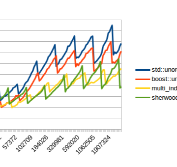

I Wrote a Fast Hash Table

I Wrote a Fast Hash Table

https://probablydance.com/2014/05/03/i-wrote-a-fast-hash-table/

As others have pointed out, Robin Hood Hashing should be your default hash table implementation. Unfortunately I couldn’t find a hashtable on the internet that uses robin hood hashing while o…