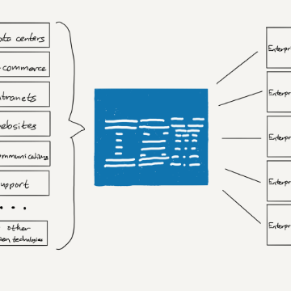

IBM’s Old Playbook

IBM’s Old Playbook

https://stratechery.com/2018/ibms-old-playbook/

IBM has bought Red Hat in an attempt to recreate its success in the 90s; it’s not clear, though, that the company or the market is the same.