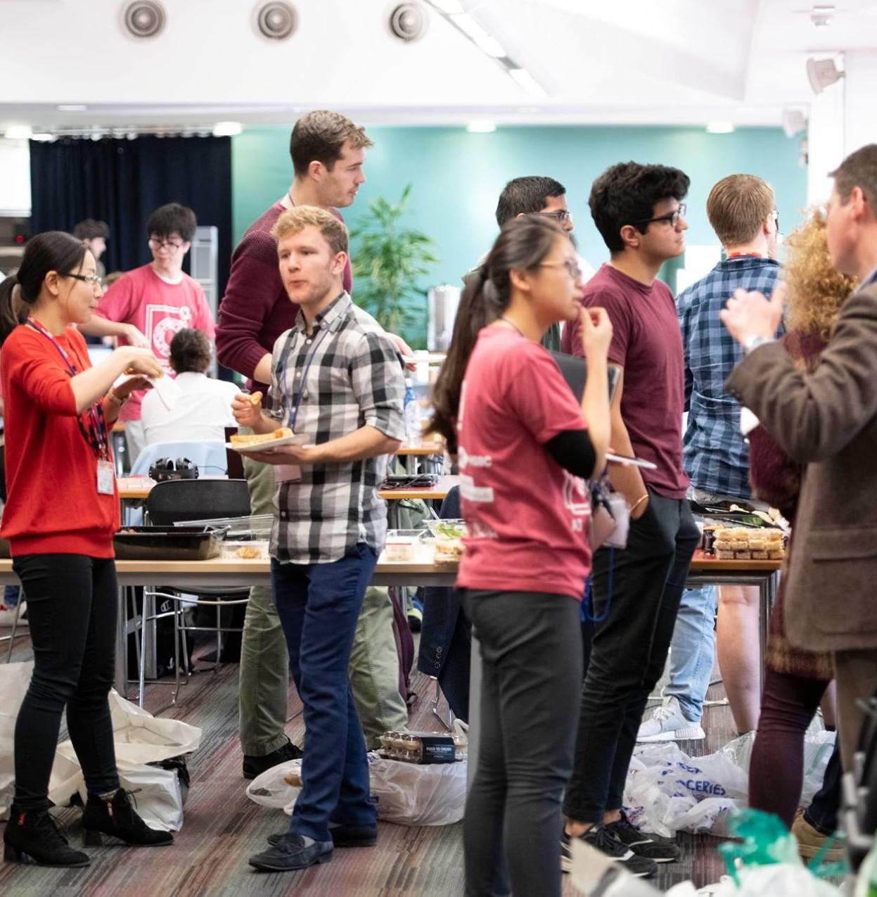
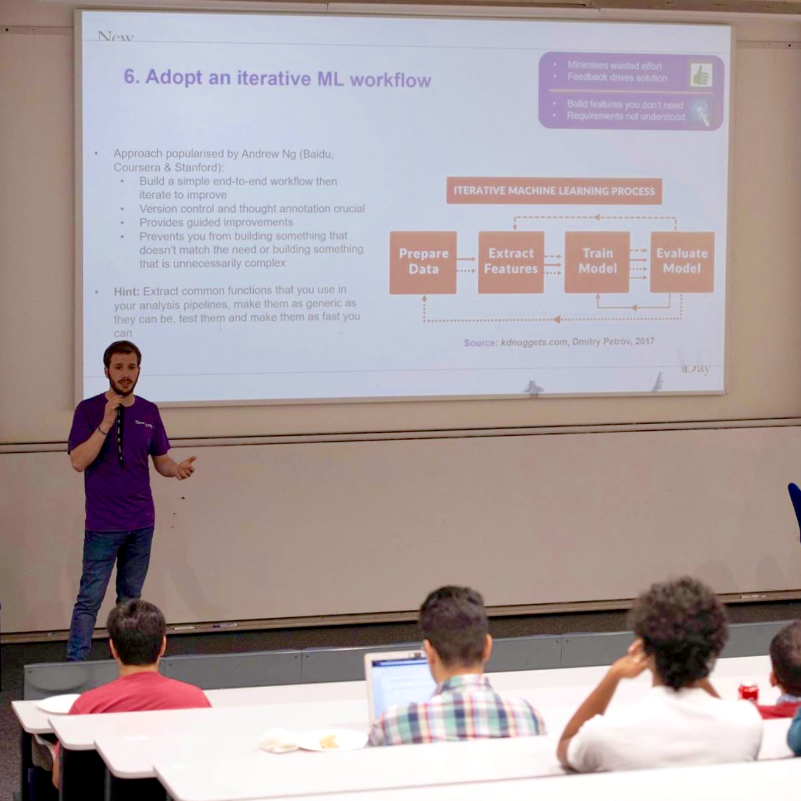
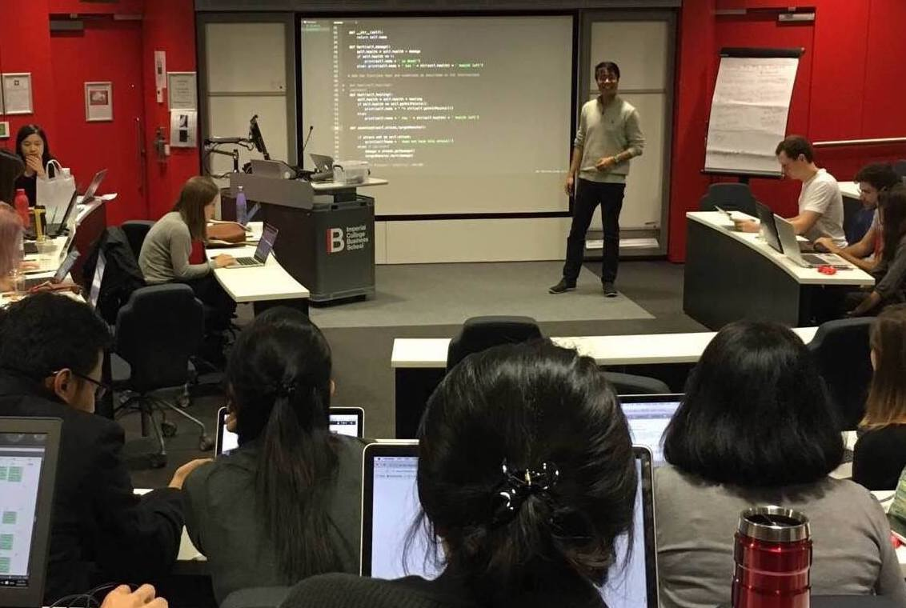
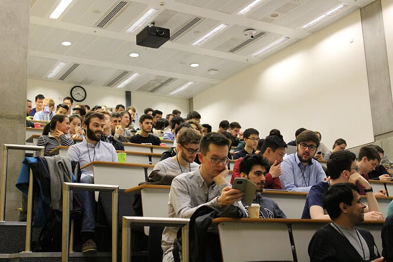
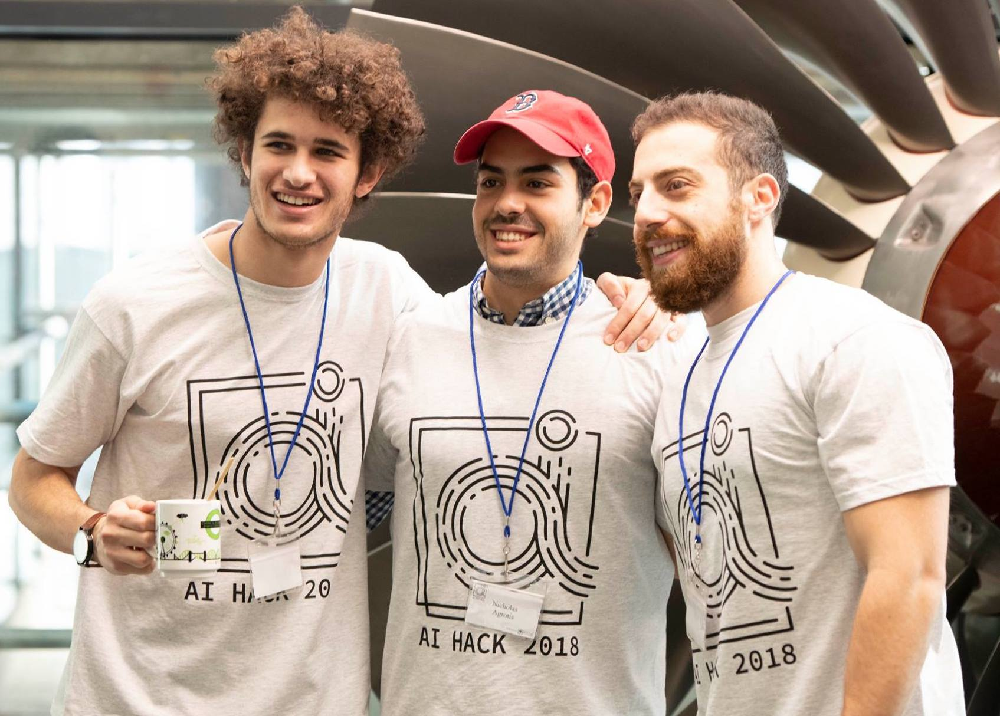
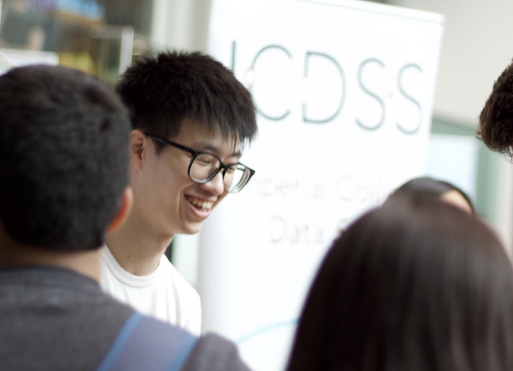
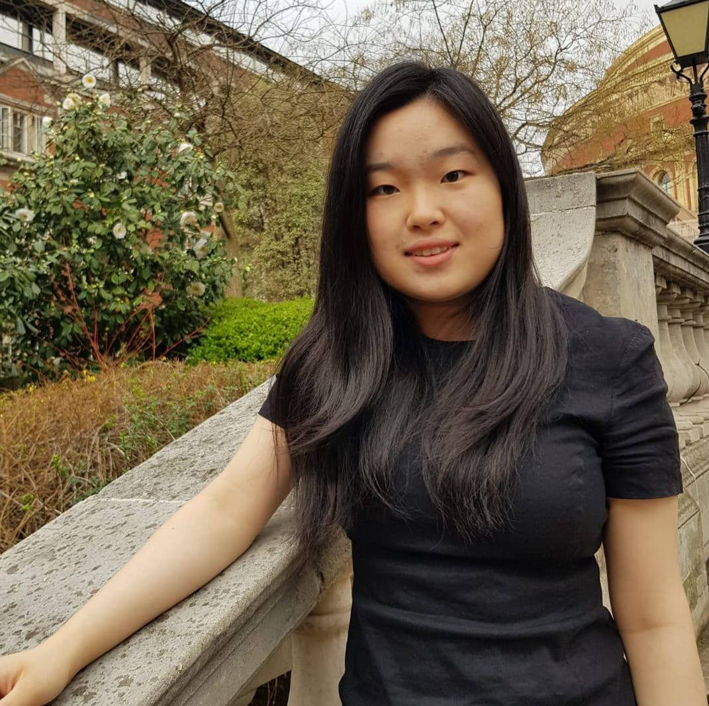
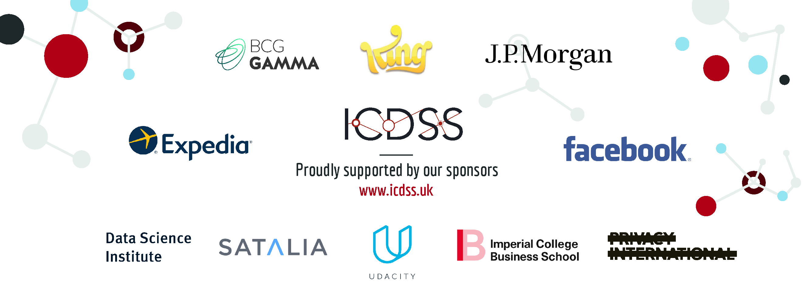

ICDSS

## About

### Building a Community

With a student reach across all departments, the Imperial College Data Science Society (ICDSS) serves to bring together Imperial's diverse and passionate data science community. ICDSS aims to harness the skills and creativity of Imperial’s most talented students to become the UK’s leading assemblage of data scientists and entrepreneurs.

### Bridging the Gap

ICDSS’s goal is to equip students from all disciplines with key data science skills and bridge the gaps between industry and academia. We aim to push our members to reach their full potential by acting as their go-to resource for the latest technologies, industry trends, and networking opportunities in the data science space.

[Join the Society](https://www.imperialcollegeunion.org/activities/a-to-z/data-science)

## Activities

## Workshops

Our workshop series cover various topics including data analysis, data visualisation, machine learning, and programming both in R and Python, the latter being a member favourite. Over the course of the last two years, we achieved a cumulative attendance of over 600 students. Last year, we partnered with Udacity to deliver high-quality training to our members.

## Industry Talks

Regular talks by data scientists from industry provide our members with insights into the real-world applications of data science. Previous speakers included data scientists from J.P. Morgan, LinkedIn, Uber, and BCG Gamma. Our 2019-2020 roadmap aims to bring in more sponsors and talks from the financial services and pharmaceutical/bio-tech sectors.

## Competition & Data Hackathons

[(AI Hack)](http://aihack.org/)

Our advanced hack team won first prize and the most disruptive award at the Angel Hack and Hack Justice competitions. In 2018, the first Imperial College Data Challenge Hackathon took off. 80 participants were chosen from over 300 applicants to take part in solving 7 challenges provided by companies such as GSK, TfL, and Deliveroo. In 2019, we scaled the event to 300 participants including students from other top universities in the UK.

## Imperial Strategics &

Data Science Projects

Previously we provided industry project opportunities to the top students recruited into our advanced hack team, and less technical in-house projects for students from other backgrounds. This year we hope to source many more projects per term from industry partners for our students to work on. This will provide students with the chance to build portfolios of high impact projects to accelerate their development and increase their employability.

## Team

Shashwat Dalal
Chair

- [(L)](http://icdss.club.s3-website.eu-west-2.amazonaws.com/mailto:shashwat.dalal16@ic.ac.uk)
- [(L)](https://www.linkedin.com/in/shashwat-dalal/)

Jenniffer Mosquera
Head of Corporate Relations

- [(L)](http://icdss.club.s3-website.eu-west-2.amazonaws.com/mailto:j.solorzano-mosquera17@imperial.ac.uk)
- [(L)](https://www.linkedin.com/in/jenniffersolorzanomosquera/)

Difei Yu
Head of Corporate Relations

- [(L)](http://icdss.club.s3-website.eu-west-2.amazonaws.com/mailto:difei.yu15@imperial.ac.uk)
- [(L)](https://www.linkedin.com/in/difei-yu-678609ab/)

Enyi Shang
Head of Marketing

- [(L)](http://icdss.club.s3-website.eu-west-2.amazonaws.com/mailto:enyi.shang16@imperial.ac.uk)
- [(L)](https://www.linkedin.com/in/enyi-shang-1616a9b9/)

Peter Udvardi
Head of Operations

- [(L)](http://icdss.club.s3-website.eu-west-2.amazonaws.com/mailto:peter.udvardi16@imperial.ac.uk)
- [(L)](https://www.linkedin.com/in/peterudvardi/)

Jergus Strucka
Head of Talent Development

- [(L)](http://icdss.club.s3-website.eu-west-2.amazonaws.com/mailto:jergus.strucka15@imperial.ac.uk)
- [(L)](https://www.linkedin.com/in/jergus-strucka/)

Satya Johnson
Head of Talent Development

- [(L)](http://icdss.club.s3-website.eu-west-2.amazonaws.com/mailto:satya.johnson17@imperial.ac.uk)
- [(L)](https://www.linkedin.com/in/satyapjohnson/)

Stacey Wu
Head of Finance

- [(L)](http://icdss.club.s3-website.eu-west-2.amazonaws.com/mailto:zheng.wu18@imperial.ac.uk)
- [(L)](https://www.linkedin.com/in/stacey-wu-68146513a/)

Adam Bhajji
Vice President

- [(L)](http://icdss.club.s3-website.eu-west-2.amazonaws.com/mailto:adam.bhaiji16@imperial.ac.uk)
- [(L)](https://www.linkedin.com/in/adambhaiji/)

Further contact information can be found [here](https://www.notion.so/shashwatdalal/53b1419fa8864294b60ff0a1aad6205d?v=21928dc37a90456299564288bb14b949).

## Current and Past Sponsors

- [Become a Sponsor](http://icdss.club.s3-website.eu-west-2.amazonaws.com/sponsorship/index.html#packages)
- [Learn More](http://icdss.club.s3-website.eu-west-2.amazonaws.com/sponsorship/index.html)