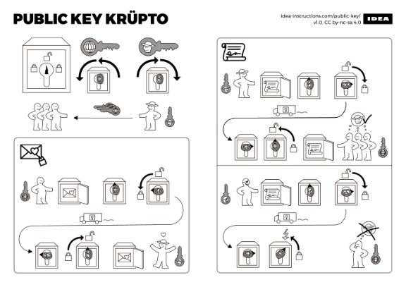
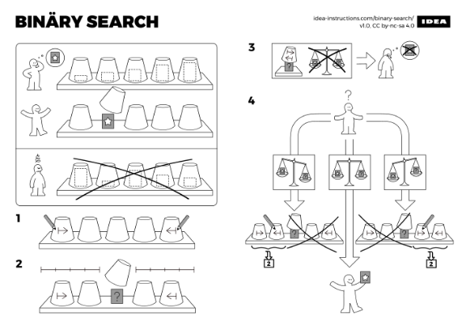
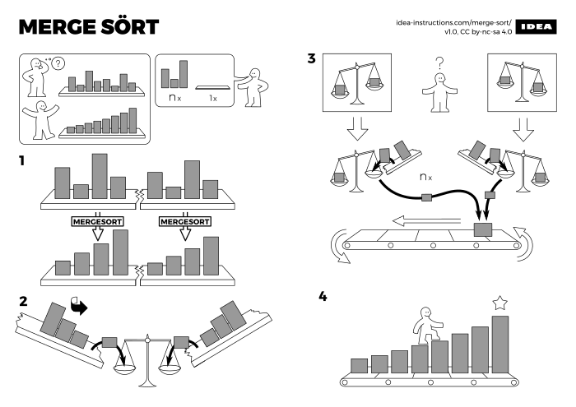
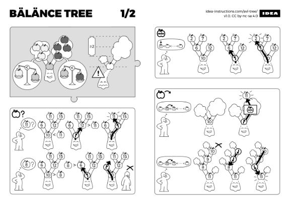
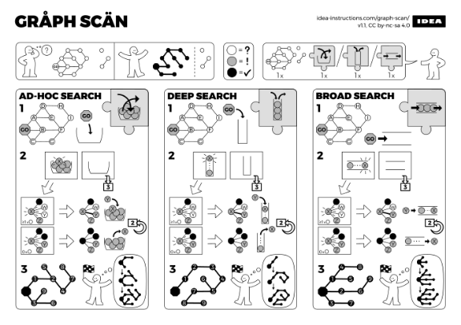
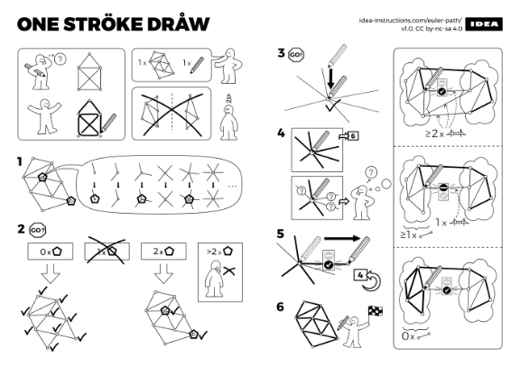

IDEA - nonverbal algorithm assembly instructions

# nonverbal algorithm assembly instructions

 

*An ongoing series of nonverbal
algorithm assembly instructions.*

 

**IDEA** is a series of nonverbal algorithm assembly instructions by [Sándor P. Fekete](https://www.ibr.cs.tu-bs.de/users/fekete/), [Sebastian Morr](https://morr.cc/), and [Sebastian Stiller](http://mo.tu-bs.de/staff/stiller/). They were originally created for Sándor's [algorithms and datastructures lecture](https://www.ibr.cs.tu-bs.de/courses/ws1718/aud/webpages/) at TU Braunschweig, but we hope they will be useful in all sorts of context. We publish them here so that they can be used by teachers, students, and curious people alike. Visit the [about page](https://idea-instructions.com/about/) to learn more.