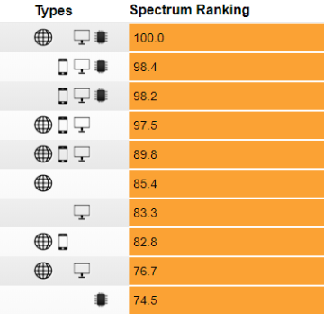

IEEE Language Rankings 2018

IEEE Language Rankings 2018

http://blog.revolutionanalytics.com/2018/08/ieee-language-rankings-2018.html

Python retains its top spot in the fifth annual IEEE Spectrum top programming language rankings, and also gains a designation as an "embedded language". Data science language R remains the only domain-specific slot in the top 10 (where it as listed as an "enterprise language") and drops one place compared to its 2017 ranking to take the #7 spot. Looking at other data-oriented languages, Matlab as at #11 (up 3 places), SQL is at #24 (down 1), Julia at #32 (down 1) and SAS at #40 (down 3). Click the screens