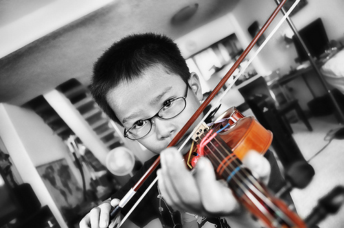

If You're Busy, You're Doing Something Wrong: The Surprisingly Relaxed Lives of Elite Achievers - Study Hacks - Cal Newport

# If You’re Busy, You’re Doing Something Wrong: The Surprisingly Relaxed Lives of Elite Achievers

November 11th, 2011 · [312 comments](https://www.calnewport.com/blog/2011/11/11/if-youre-busy-youre-doing-something-wrong-the-surprisingly-relaxed-lives-of-elite-achievers/#comments)

**The Berlin Study**

In the early 1990s, a trio of psychologists descended on the Universität der Künste, a historic arts academy in the heart of West Berlin. They came to study the violinists.

As described in their subsequent [publication in *Psychological Review*](https://psycnet.apa.org/journals/rev/100/3/363.pdf), the researchers asked the academy’s music professors to help them identify a set of stand out violin players — the students who the professors believed would go onto careers as professional performers.

We’ll call this group the *elite players. *

**For a point of comparison, they also selected a group of students from the school’s education department. These were students who were on track to become music teachers. They were serious about violin, but as their professors explained, their ability was not in the same league as the first group.

We’ll call this group the *average players.*

The three researchers subjected their subjects to a series of in-depth interviews. They then gave them diaries which divided each 24-hour period into 50 minute chunks, and sent them home to keep a careful log of how they spent their time.

Flush with data, the researchers went to work trying to answer a fundamental question: *Why are the elite players better than the average players? *

**The obvious guess is that the elite players are more dedicated to their craft. That is, they’re willing to put in the long,Tiger Mom-style hours required to get good, while the average players are off goofing around and enjoying life.

*The data, as it turns out, had a different story to tell…*

**Decoding the Patterns of the Elite**

We can start by disproving the assumption that the elite players dedicate more hours to music. **The time diaries revealed that both groups spent, on average, the same number of hours on music per week** (around 50).

The difference was in how they spent this time. **The elite players were spending almost three times more hours than the average players on deliberate practice** — [the uncomfortable, methodical work of stretching your ability](https://calnewport.com/blog/2010/01/06/the-grandmaster-in-the-corner-office-what-the-study-of-chess-experts-teaches-us-about-building-a-remarkable-life/).

This might not be surprising, as the importance of deliberate practice had been replicated and reported many times (c.f., [Gladwell](https://www.amazon.com/Outliers-Story-Success-Malcolm-Gladwell/dp/0316017922)).

*But the researchers weren’t done.*

They also studied how the students scheduled their work. **The average players, they discovered, spread their work throughout the day.** A graph included in the paper, which shows the average time spent working versus the waking hours of the day, is essentially flat.

**The elite players, by contrast, consolidated their work into two well-defined periods.** When you plot the average time spent working versus the hours of the day for these players, there are two prominent peaks: one in the morning and one in the afternoon.

In fact, the more elite the player, the more pronounced the peaks. For *the best of the best* — the subset of the elites who the professors thought would go on to play in one of Germany’s two best professional orchestras — there was essentially no deviation from a rigid two-sessions a day schedule.

This isolation of work from leisure had pronounced effects in other areas of the players’ lives.

Consider, for example, sleep: **the elite players slept an hour more per night than the average players.**

Also consider relaxation. The researchers asked the players to estimate how much time they dedicated each week to leisure activities — an important indicator of their subjective feeling of relaxation. By this metric, **the elite players were significantly more relaxed than the average players, **and the best of the best were the most relaxed of all.

**Hard Work is Different than Hard to Do Work**
To summarize these results:

- The average players are working just as many hours as the elite players (around 50 hours a week spent on music),
- but they’re not dedicating these hours to the right type of work (spending almost 3 times less hours than the elites on crucial deliberate practice),
- and furthermore, they spread this work haphazardly throughout the day. So even though they’re not doing *more* work than the elite players, they end up sleeping less and feeling more stressed. Not to mention that they remain worse at the violin.

I’ve seen this same phenomenon time and again in my study of high achievers. It came up so often in my study of top students, for example, that I even coined a name for it: [the paradox of the relaxed Rhodes Scholar.](https://calnewport.com/blog/2007/07/20/the-power-of-being-the-best/)

This study sheds some light on this paradox. **It provides empirical evidence that there’s a difference between [*hard work* and *hard to do work*](https://calnewport.com/blog/2009/08/20/focus-hard-in-reasonable-bursts-one-day-at-a-time/):**

- ***Hard work*** is deliberate practice. It’s not fun while you’re doing it, but you don’t have to do too much of it in any one day (the elite players spent, on average, 3.5 hours per day engaged in deliberate practice, broken into two sessions). It also provides you measurable progress in a skill, which generates a strong sense of contentment and motivation. Therefore, although hard work is hard, it’s not draining and it can fit nicely into a relaxed and enjoyable day.
- ***Hard to do work***, by contrast,* is* draining. It has you running around all day in a state of false busyness that leaves you, like the average players from the Berlin study, feeling tired and stressed. It also, as we just learned, has very little to do with real accomplishment.

This analysis leads to an important conclusion. Whether you’re a student or well along in your career, **[if your goal is to build a remarkable life](https://calnewport.com/blog/2011/08/11/the-career-craftsman-manifesto/), then busyness and exhaustion should be your enemy.** If you’re chronically stressed and up late working, you’re doing something wrong. You’re the average players from the Universität der Künste — not the elite. You’ve built a life around hard to do work, not hard work.

The solution suggested by this research, as well as my own, is as simple as it is startling: *Do less. But do what you do with complete and hard focus. Then when you’re done be done, and go enjoy the rest of the day.*

(Photo by [RKHawaii](https://www.flickr.com/photos/rkhawaii/3847524178/))
#####

*This post is the first in my series on **the deliberate practice hypothesis**, which claims that applying [the principles of deliberate practice](https://calnewport.com/blog/2010/01/06/the-grandmaster-in-the-corner-office-what-the-study-of-chess-experts-teaches-us-about-building-a-remarkable-life/) to the world of knowledge work is a key strategy for building [a remarkable working life.](https://calnewport.com/blog/2011/08/11/the-career-craftsman-manifesto/)*

## 312 thoughts on “If You’re Busy, You’re Doing Something Wrong: The Surprisingly Relaxed Lives of Elite Achievers”

1. Trace F  says:

[November 11, 2011 at 1:56 am](https://www.calnewport.com/blog/2011/11/11/if-youre-busy-youre-doing-something-wrong-the-surprisingly-relaxed-lives-of-elite-achievers/#comment-26079)

Thanks for the article Cal, as always – great use of the case study method to illuminate this fundamental time-management principle.

But a keen reader will immediately see that from the two elements suggested here, time structured for deliberate practice and the practice itself, it’s the latter that’s the more difficult. To use your example, the maestros not only know when to practice, but they also know how to practice.

I’d argue that it’s this element that prevents most people from becoming more than merely good. And, admittedly, it’s this element that’s the more difficult to crack as it involves a number of cognitive, capital, and emotional elements to align. I’d encourage a future post that discusses some of these generalizable principles (e.g. identifying great coaches, generating constant feedback, self-discipline, etc.) if you feel that they are within the realm of your blog.

[Reply](https://www.calnewport.com/blog/2011/11/11/if-youre-busy-youre-doing-something-wrong-the-surprisingly-relaxed-lives-of-elite-achievers/?replytocom=26079#respond)

2. [Shrutarshi Basu](https://basus.me/)  says:

[November 11, 2011 at 3:36 am](https://www.calnewport.com/blog/2011/11/11/if-youre-busy-youre-doing-something-wrong-the-surprisingly-relaxed-lives-of-elite-achievers/#comment-26081)

This is a very timely article, I’ve been experimenting with my best working hours myself and have come to similar conclusions. However, there are two details that you left out that I would love to know:

Firstly, what was the time gap between the two intense practice sessions and how did the elites use this time to relax and recharge?

Secondly, 7*3.5 = 24.5 hours. If that’s all the time devoted to deliberate practice what were they doing for the remaining 25.5 hours and how did that affect their abilities?

[Reply](https://www.calnewport.com/blog/2011/11/11/if-youre-busy-youre-doing-something-wrong-the-surprisingly-relaxed-lives-of-elite-achievers/?replytocom=26081#respond)

3. Jeff Christiansen  says:

[November 11, 2011 at 3:42 am](https://www.calnewport.com/blog/2011/11/11/if-youre-busy-youre-doing-something-wrong-the-surprisingly-relaxed-lives-of-elite-achievers/#comment-26082)

This topic was also covered in Talent is Overrated by Geoff Colvin

[Reply](https://www.calnewport.com/blog/2011/11/11/if-youre-busy-youre-doing-something-wrong-the-surprisingly-relaxed-lives-of-elite-achievers/?replytocom=26082#respond)

4. J  says:

[November 11, 2011 at 3:53 am](https://www.calnewport.com/blog/2011/11/11/if-youre-busy-youre-doing-something-wrong-the-surprisingly-relaxed-lives-of-elite-achievers/#comment-26083)

Really great article, nice to hear a follow-up and response to the gladwell reasoning.

One tiny thing – “less hours” should be “*fewer* hours”
Great job summarising everything into one actionable to-do!

[Reply](https://www.calnewport.com/blog/2011/11/11/if-youre-busy-youre-doing-something-wrong-the-surprisingly-relaxed-lives-of-elite-achievers/?replytocom=26083#respond)

5. jld  says:

[November 11, 2011 at 5:05 am](https://www.calnewport.com/blog/2011/11/11/if-youre-busy-youre-doing-something-wrong-the-surprisingly-relaxed-lives-of-elite-achievers/#comment-26084)

Ah! 50 hours a week is “Surprisingly Relaxed”, I didn’t know…

[Reply](https://www.calnewport.com/blog/2011/11/11/if-youre-busy-youre-doing-something-wrong-the-surprisingly-relaxed-lives-of-elite-achievers/?replytocom=26084#respond)

    1. [Courtney](https://facebook.com/TrebleStrings)  says:

[August 13, 2015 at 7:31 pm](https://www.calnewport.com/blog/2011/11/11/if-youre-busy-youre-doing-something-wrong-the-surprisingly-relaxed-lives-of-elite-achievers/#comment-306040)

Fifty hours a week is relaxed when you consider how it is divided.

Three and a half hours per day of deliberate practice is not even half of the fifty hours. It’s 24.5 hours, and that’s assuming these numbers include weekends.

These are college students, which mean they are probably averaging 15 hours per week in class, and since this is a music school we can assume that figures into their fifty hours per week spent on music. That brings us up to 39.5 hours.

These students are probably spending five or six hours a week in an orchestra rehearsal. Let’s call it 5.5, which brings us up to 45 hours. Then, they likely have at least one hour of private lessons. Now we are at 46. We can easily assume the other four hours are accounted for in homework for music classes.

There are 118 additional hours in the week. If they sleep a full eight hours a night and spend three hours a day on things like eating and personal hygiene, that still leaves 41 hours of free time. That allows for a part-time job, regular exercise, a couple of hours for an outside hobby, and an active social life.

[Reply](https://www.calnewport.com/blog/2011/11/11/if-youre-busy-youre-doing-something-wrong-the-surprisingly-relaxed-lives-of-elite-achievers/?replytocom=306040#respond)

6. [Honourable Mentions](https://honourablementions.blogspot.com/)  says:

[November 11, 2011 at 5:42 am](https://www.calnewport.com/blog/2011/11/11/if-youre-busy-youre-doing-something-wrong-the-surprisingly-relaxed-lives-of-elite-achievers/#comment-26085)

I think there may be something extra contributing to the differences in skill between the two groups. You often advocate simplicity and minimising distractions in your posts. Multi-tasking research supports this philosophy. When we switch between tasks or try to do two things at the same time we end up taking longer to perform the tasks and we can overlook crucial details, neither of which are productive. These problems arise due to the costs of dividing our attention and the time taken to get back ‘into the zone.’ The elite violinists would not have faced these problems because they consolidated their practice. However, the average players spaced theirs out across the day. They probably wasted a little bit of each practice session getting back into the zone. These losses would have accumulated across the day, reducing the effectiveness and impact of their practising as well as leading to the later study hours etc. you mentioned. So maybe the deliberate practice components of trying to step outside their comfort zone AND maintaining focus rather than switching between tasks was what gave the elite violinists the edge. Just a thought.

[Reply](https://www.calnewport.com/blog/2011/11/11/if-youre-busy-youre-doing-something-wrong-the-surprisingly-relaxed-lives-of-elite-achievers/?replytocom=26085#respond)

7. jalmos  says:

[November 11, 2011 at 6:17 am](https://www.calnewport.com/blog/2011/11/11/if-youre-busy-youre-doing-something-wrong-the-surprisingly-relaxed-lives-of-elite-achievers/#comment-26086)

I would argue that the specific example of musicians is one that is not easily translatable to “elite achievers” universally.

There are many fields in which definable elites exist who do not require such rigidity. In some areas, lack of rigidity is far more beneficial.

I work in many different areas of the computer world and find that the elites are, more often than not, ones with their fingers in more pies than they have digits, so to speak. The very best can do their chosen “thing” better than anyone, yet that always requires that they be at least competent, if not particularly capable, in other areas as well.

Being a superlative musician does indeed require intense, specific practice. But not all things mirror that pattern. This mold may apply to many disciplines. It does not apply in general.

[Reply](https://www.calnewport.com/blog/2011/11/11/if-youre-busy-youre-doing-something-wrong-the-surprisingly-relaxed-lives-of-elite-achievers/?replytocom=26086#respond)

8. Sriram Srinivasan  says:

[November 11, 2011 at 6:45 am](https://www.calnewport.com/blog/2011/11/11/if-youre-busy-youre-doing-something-wrong-the-surprisingly-relaxed-lives-of-elite-achievers/#comment-26087)

It seems to me that cause is being confused with correlation. From what little I have learnt of this experiment, I *could* conclude that there are a certain set of people who just seem to have everything … they are elite players, sleep more, are more relaxed etc. There’s nothing in it that tells me that the latter attributes contribute to ones musical ability.

[Reply](https://www.calnewport.com/blog/2011/11/11/if-youre-busy-youre-doing-something-wrong-the-surprisingly-relaxed-lives-of-elite-achievers/?replytocom=26087#respond)

9. Pingback: [the wire: 11/11/2011 | hrudu.](https://www.hrudu.com/the-wire-11112011/)

10. Carl Shan  says:

[November 11, 2011 at 8:13 am](https://www.calnewport.com/blog/2011/11/11/if-youre-busy-youre-doing-something-wrong-the-surprisingly-relaxed-lives-of-elite-achievers/#comment-26089)

“By this metric, the elite players were significantly more relaxed than the average players, and the best of the best were the most relaxed of all.”

Just wanted point out here that it may also be possible that this correlation may be reversed — that is, the elite were able to be more relaxed and spend more time on leisure because they were the elite and not the other way around. Perhaps eliteness produces relaxedness instead of relaxedness producing eliteness.

Thoughts?

[Reply](https://www.calnewport.com/blog/2011/11/11/if-youre-busy-youre-doing-something-wrong-the-surprisingly-relaxed-lives-of-elite-achievers/?replytocom=26089#respond)

    1. Sam  says:

[April 9, 2015 at 2:40 pm](https://www.calnewport.com/blog/2011/11/11/if-youre-busy-youre-doing-something-wrong-the-surprisingly-relaxed-lives-of-elite-achievers/#comment-281906)

I think its a vicious cycle, the more relaxed you are the more you can focus at the task at hand, and the more you focus, the better you get at skill, which relaxes you after the achievement/growth of skill set. What comes first? I’d say relaxation, the less worried you are about something, the more you can focus on doing the task, instead of fearing the outcome

[Reply](https://www.calnewport.com/blog/2011/11/11/if-youre-busy-youre-doing-something-wrong-the-surprisingly-relaxed-lives-of-elite-achievers/?replytocom=281906#respond)

        1. Symankedoo  says:

[April 12, 2015 at 4:28 am](https://www.calnewport.com/blog/2011/11/11/if-youre-busy-youre-doing-something-wrong-the-surprisingly-relaxed-lives-of-elite-achievers/#comment-282358)

I agree with your general point, though I have never heard of relaxation being described as vicious!

[Reply](https://www.calnewport.com/blog/2011/11/11/if-youre-busy-youre-doing-something-wrong-the-surprisingly-relaxed-lives-of-elite-achievers/?replytocom=282358#respond)

        2. Laura  says:

[November 15, 2018 at 10:42 pm](https://www.calnewport.com/blog/2011/11/11/if-youre-busy-youre-doing-something-wrong-the-surprisingly-relaxed-lives-of-elite-achievers/#comment-397699)

Perhaps more of a virtuous cycle, in this case.

[Reply](https://www.calnewport.com/blog/2011/11/11/if-youre-busy-youre-doing-something-wrong-the-surprisingly-relaxed-lives-of-elite-achievers/?replytocom=397699#respond)

    2. Levan Bokeria  says:

[May 25, 2015 at 4:14 pm](https://www.calnewport.com/blog/2011/11/11/if-youre-busy-youre-doing-something-wrong-the-surprisingly-relaxed-lives-of-elite-achievers/#comment-290244)

This is the only comment that addresses the elephant in the room – the problem of determining causation. Perhaps the original article in Psychological Review discusses this, but I’m surprised Cal did not say a word about the possibility of reverse causation or of the third variable problem.

If would be nice if Cal pointed to a study that used a randomized design procedure to assign people to two groups that used different study strategies, and then observed results.

[Reply](https://www.calnewport.com/blog/2011/11/11/if-youre-busy-youre-doing-something-wrong-the-surprisingly-relaxed-lives-of-elite-achievers/?replytocom=290244#respond)

11. Feedsh  says:

[November 11, 2011 at 8:28 am](https://www.calnewport.com/blog/2011/11/11/if-youre-busy-youre-doing-something-wrong-the-surprisingly-relaxed-lives-of-elite-achievers/#comment-26090)

Great post Cal!

I find Honourable Mentions comment almost as valuable though, as it gives an explanation why this is actually the case.

My question: can you use this knowledge as a manager, a start-up manager? Can you become a better manager by applying this “methodology”?

[Reply](https://www.calnewport.com/blog/2011/11/11/if-youre-busy-youre-doing-something-wrong-the-surprisingly-relaxed-lives-of-elite-achievers/?replytocom=26090#respond)

12. [Ome](https://www.omecool20.com/)  says:

[November 11, 2011 at 8:48 am](https://www.calnewport.com/blog/2011/11/11/if-youre-busy-youre-doing-something-wrong-the-surprisingly-relaxed-lives-of-elite-achievers/#comment-26091)

Cal, what I like about the stuff you have written since I followed your blog is the focus on clarity of what makes achievers great  I love this article and will definitely post it up my FB wall 

[Reply](https://www.calnewport.com/blog/2011/11/11/if-youre-busy-youre-doing-something-wrong-the-surprisingly-relaxed-lives-of-elite-achievers/?replytocom=26091#respond)

13. martin  says:

[November 11, 2011 at 9:08 am](https://www.calnewport.com/blog/2011/11/11/if-youre-busy-youre-doing-something-wrong-the-surprisingly-relaxed-lives-of-elite-achievers/#comment-26092)

@Shrutarshi Basu: as a musician not everything you do is practicing. there are reheasals, concerts, an a very important part listening to music. professional musicians spend a lot of time listening, which for me would fit with the relaxed lifestyle.

but there’s one thing that i’d argue about the results:

many to-be professional musicions practice a lot during childhood and adolescence. whereas average musicians do not/spend less.

so they are at very different levels of perfection at the same age. which hugely affects the need for practicing and stress (“man, this guy is 13 and plays better than i ever will…”)

martin

[Reply](https://www.calnewport.com/blog/2011/11/11/if-youre-busy-youre-doing-something-wrong-the-surprisingly-relaxed-lives-of-elite-achievers/?replytocom=26092#respond)

14. [Jonathan Pincas](https://www.saynototheoffice.com/)  says:

[November 11, 2011 at 9:27 am](https://www.calnewport.com/blog/2011/11/11/if-youre-busy-youre-doing-something-wrong-the-surprisingly-relaxed-lives-of-elite-achievers/#comment-26093)

I too had the first same impression as Carl, that perhaps it was the ‘gift’ of the elite that allowed them to be more relaxed. However, from personal experience and observation I’d say the conclusions are correct. Personally, I was an extremely high achiever throughout my academic career, but was always much more relaxed about work than other students. They seemed to be always studying while I was relaxing. But then when necessary, i.e., before exams, I would just study non-stop all night!

[Reply](https://www.calnewport.com/blog/2011/11/11/if-youre-busy-youre-doing-something-wrong-the-surprisingly-relaxed-lives-of-elite-achievers/?replytocom=26093#respond)

15. Dipthong  says:

[November 11, 2011 at 10:43 am](https://www.calnewport.com/blog/2011/11/11/if-youre-busy-youre-doing-something-wrong-the-surprisingly-relaxed-lives-of-elite-achievers/#comment-26094)

While this is an interesting research, it is related ultimately to a kinesthetic skill. While we can take cues from it, it would be illogical to extrapolate this to everything a student or a career oriented professional does and going to the extent of saying “if your goal is to build a remarkable life, then busyness and exhaustion should be your enemy”.

However, we can always benefit from the learning that deliberate out of comfort zone practice + focused consistency may be helpful in general to get ahead.

[Reply](https://www.calnewport.com/blog/2011/11/11/if-youre-busy-youre-doing-something-wrong-the-surprisingly-relaxed-lives-of-elite-achievers/?replytocom=26094#respond)

16. Pingback: [Anna Batchelder » “Focus hard. In reasonable bursts. One day at a time.”](https://annabatchelder.com/ideas/?p=103)

17. Caroline Rankin  says:

[November 11, 2011 at 11:51 am](https://www.calnewport.com/blog/2011/11/11/if-youre-busy-youre-doing-something-wrong-the-surprisingly-relaxed-lives-of-elite-achievers/#comment-26098)

Your math is a bit off. 3.5 hrs of deliberate practice a day, becomes 50 hrs a week…how? 3.5 * 7 = 24.5!

[Reply](https://www.calnewport.com/blog/2011/11/11/if-youre-busy-youre-doing-something-wrong-the-surprisingly-relaxed-lives-of-elite-achievers/?replytocom=26098#respond)

    1. Eddie Mange  says:

[March 9, 2016 at 2:00 pm](https://www.calnewport.com/blog/2011/11/11/if-youre-busy-youre-doing-something-wrong-the-surprisingly-relaxed-lives-of-elite-achievers/#comment-346215)

Caroline, 50 was just an estimate. Remember the article says 3.5 Hrs twice a day (2 times a day) with a break in between. So it’s actually [3.5+3.5] X 7 = 49 hrs.

It is correct that 3.5*7= 24.5 hrs.

[Reply](https://www.calnewport.com/blog/2011/11/11/if-youre-busy-youre-doing-something-wrong-the-surprisingly-relaxed-lives-of-elite-achievers/?replytocom=346215#respond)

18. [Brian](https://orderedmovements.com/)  says:

[November 11, 2011 at 2:36 pm](https://www.calnewport.com/blog/2011/11/11/if-youre-busy-youre-doing-something-wrong-the-surprisingly-relaxed-lives-of-elite-achievers/#comment-26101)

Excellent post…

however, the interesting thing is that precisely Malcolm Gladwell, whom you refer to, tells a different story in ‘Outliers’. He actually also talks about musicians at a German academy (I wonder if it’s the same study).

What he claims there they found was that the difference between elite performers and the rest was simply hours of practice. That’s where the 10’000 hours rule comes from. He claims they found that the elite performers had practiced a total of 10’000 hours at that time, the good but not great ones 8’000 and the ones who will be teachers 5’000 or so.

What they also found was that there were no elite players who had practiced significantly less time and there were also no mediocre players who had practiced 10’000 hours but still didn’t make it…

I’m curious which story is right…but Gladwell says the exact opposite of what you’re saying here.

[Reply](https://www.calnewport.com/blog/2011/11/11/if-youre-busy-youre-doing-something-wrong-the-surprisingly-relaxed-lives-of-elite-achievers/?replytocom=26101#respond)

    1. Ivan Wong  says:

[April 6, 2015 at 2:06 am](https://www.calnewport.com/blog/2011/11/11/if-youre-busy-youre-doing-something-wrong-the-surprisingly-relaxed-lives-of-elite-achievers/#comment-281233)

What gladwell talked about was the “cumulative hours of practice”, it’s different from this article.

From this article, I wonder whether the elite players are more focused during their practice which made it more effective than those average players.

[Reply](https://www.calnewport.com/blog/2011/11/11/if-youre-busy-youre-doing-something-wrong-the-surprisingly-relaxed-lives-of-elite-achievers/?replytocom=281233#respond)

19. Pingback: [Farnam Street – If You’re Busy, You’re Doing Something Wrong](https://www.farnamstreetblog.com/2011/11/if-you%e2%80%99re-busy-you%e2%80%99re-doing-something-wrong/)

20. [Kristian Glass](https://www.doismellburning.co.uk/)  says:

[November 11, 2011 at 5:21 pm](https://www.calnewport.com/blog/2011/11/11/if-youre-busy-youre-doing-something-wrong-the-surprisingly-relaxed-lives-of-elite-achievers/#comment-26105)

This is so true – I found as an undergraduate I had poor work/life discipline, and both suffered as a result. When I graduated and started a full time job, it was great – get into the office, work solidly, leave, and then my free time was wholly mine. I’m now doing contract work and noticing the lines start to blur again slightly – this article has provided the kick I needed to put a stop to that right now.

[Reply](https://www.calnewport.com/blog/2011/11/11/if-youre-busy-youre-doing-something-wrong-the-surprisingly-relaxed-lives-of-elite-achievers/?replytocom=26105#respond)

21. [Dan Hawk](https://danhawk.com/)  says:

[November 11, 2011 at 6:28 pm](https://www.calnewport.com/blog/2011/11/11/if-youre-busy-youre-doing-something-wrong-the-surprisingly-relaxed-lives-of-elite-achievers/#comment-26107)

I was a music major in composition and arranging in college and can tell you that though you might spend 3-4 hours in deliberate practice, you are also in group rehearsals, theory classes and other music related activities for another 3-4 hours daily. In other words, the 50 hr figure is correct.

[Reply](https://www.calnewport.com/blog/2011/11/11/if-youre-busy-youre-doing-something-wrong-the-surprisingly-relaxed-lives-of-elite-achievers/?replytocom=26107#respond)

22. Shuttle_Service  says:

[November 11, 2011 at 6:43 pm](https://www.calnewport.com/blog/2011/11/11/if-youre-busy-youre-doing-something-wrong-the-surprisingly-relaxed-lives-of-elite-achievers/#comment-26108)

Cal,

Do you just skim through them to see if they validate your conclusions? Because, guess what, I read this paper, too and it tells a different story:

“At age 13 the award-winning musicians practiced **13.7** hr per

week (Ruoff, 1981), an amount close to the 12.2 hr estimated by our best group and higher than the 8.8 and 6.2 hr per week estimated by the good and music teacher groups, respectively. At age 17, the practice of the award-winning musicians averaged 15.5 hr per week (Kaminski et al., 1984) compared with the **19.2,16.8, and 9.1** hr per week estimated by **the best, good, and music** teacher groups. The agreement between the estimates of our best violinists and the award-winning violinists’ diary data is reasonably close and is consistent with the hypothesis that** the best violinists practice more than the good violinists during early adolescence and more than the music teachers during the ir entire developmental period.**”

Keep spewing out nonsense. I’ll keep knocking you down.

[Reply](https://www.calnewport.com/blog/2011/11/11/if-youre-busy-youre-doing-something-wrong-the-surprisingly-relaxed-lives-of-elite-achievers/?replytocom=26108#respond)

23. Shuttle_Service  says:

[November 11, 2011 at 6:44 pm](https://www.calnewport.com/blog/2011/11/11/if-youre-busy-youre-doing-something-wrong-the-surprisingly-relaxed-lives-of-elite-achievers/#comment-26109)

If anybody wants to read the paper for themselves, here’s a link that’s not behind a paywall:

https://projects.ict.usc.edu/itw/gel/EricssonDeliberatePracticePR93.pdf

[Reply](https://www.calnewport.com/blog/2011/11/11/if-youre-busy-youre-doing-something-wrong-the-surprisingly-relaxed-lives-of-elite-achievers/?replytocom=26109#respond)

24. Pingback: [Anonymous](https://www.vishalashah.com/2011/11/11/11218/)

25. Sebastian  says:

[November 11, 2011 at 7:57 pm](https://www.calnewport.com/blog/2011/11/11/if-youre-busy-youre-doing-something-wrong-the-surprisingly-relaxed-lives-of-elite-achievers/#comment-26111)

Funny thing, just asked today some students of the University der Künste whether they know or don’t know the study.

Only one knew…
what does this tell us…?

[Reply](https://www.calnewport.com/blog/2011/11/11/if-youre-busy-youre-doing-something-wrong-the-surprisingly-relaxed-lives-of-elite-achievers/?replytocom=26111#respond)

26. Pingback: [Weekend Reading: Social Graphs Edition - ProfHacker - The Chronicle of Higher Education](https://chronicle.com/blogs/profhacker/weekend-reading-social-graphs-edition/37229)

27. Simon  says:

[November 11, 2011 at 8:05 pm](https://www.calnewport.com/blog/2011/11/11/if-youre-busy-youre-doing-something-wrong-the-surprisingly-relaxed-lives-of-elite-achievers/#comment-26113)

Shuttle_Service, thanks for that link.
I read the paper myself and I quite agree: the interpretation here is WAY off.

And not only is the comments about practice way off, the statement here that the best players spent the most time in leisure activities is also completely incorrect. While they may have *self-reported* that, the actual paper states:

“The best violinists spent 3.5 hr per day on leisure,
which is reliably less than the 4.7 hr for the good violinists”
“The best violinists, who spent the least amount of time on
leisure,”
“the best group spent less time on leisure than the good group did during the
diary week.”

So, yeah. This is completely upside-down. The actual paper says nothing of the kind without an extreme amount of very self-serving editing.

[Reply](https://www.calnewport.com/blog/2011/11/11/if-youre-busy-youre-doing-something-wrong-the-surprisingly-relaxed-lives-of-elite-achievers/?replytocom=26113#respond)

28. Nick  says:

[November 11, 2011 at 8:19 pm](https://www.calnewport.com/blog/2011/11/11/if-youre-busy-youre-doing-something-wrong-the-surprisingly-relaxed-lives-of-elite-achievers/#comment-26114)

Shuttle-

I read this paper a couple of months ago, to help with my own personal development and practice.

The paper says that the award winning musicians practiced 15 hours a week, the best practiced 19, the good 16, and the music teachers 9. So, that kinda shows that the award winning musicians didnt practice a lot more than the other ones.

More importantly, though, is that Cal is trying to show that being an elite performer does not require a life of being stressed out. The Ericsson paper proves this, too. The award winning musicians took more naps, structured their free time more, and had more free time.

One of Cal’s main ideas is that being an elite performer can be achieved with a balanced, happy life. The Ericsson paper proves this, along with many other examples.

[Reply](https://www.calnewport.com/blog/2011/11/11/if-youre-busy-youre-doing-something-wrong-the-surprisingly-relaxed-lives-of-elite-achievers/?replytocom=26114#respond)

29. Shuttle_Service  says:

[November 11, 2011 at 9:26 pm](https://www.calnewport.com/blog/2011/11/11/if-youre-busy-youre-doing-something-wrong-the-surprisingly-relaxed-lives-of-elite-achievers/#comment-26115)

Nick,

The ‘award winning musicians’ is from another study (Kaminski et al., 1984). They cite another study – not their own study.

If you read another paper, this is what they say about the differing result from the Kaminski study:

**“The difference between the results and our own can be explained by the more select samples of musicians studied by us and Kaminski et al.(1984)”**

In their own study, the ‘best violinists’ (i.e. the elite ones) are the ones who practice the most, contra Cal’s claim, emphasized here again: “The time diaries revealed that both groups spent, on average, the same number of hours on music per week (around 50).”

(By the way, this number 50 is nowhere to be seen on the paper. Where is this number 50 coming from?)

Don’t take this guy’s word. Whatever study he cites, go read it for yourself.

[Reply](https://www.calnewport.com/blog/2011/11/11/if-youre-busy-youre-doing-something-wrong-the-surprisingly-relaxed-lives-of-elite-achievers/?replytocom=26115#respond)

30. Shuttle_Service  says:

[November 11, 2011 at 9:27 pm](https://www.calnewport.com/blog/2011/11/11/if-youre-busy-youre-doing-something-wrong-the-surprisingly-relaxed-lives-of-elite-achievers/#comment-26116)

> If you read another paper, this is what they say about the differing result from the Kaminski study:

I meant if you read one more paragraph. It’s all from the same paper. I encourage you to read it:

https://projects.ict.usc.edu/itw/gel/EricssonDeliberatePracticePR93.pdf

[Reply](https://www.calnewport.com/blog/2011/11/11/if-youre-busy-youre-doing-something-wrong-the-surprisingly-relaxed-lives-of-elite-achievers/?replytocom=26116#respond)

31. [Lance](https://www.lanceramoth.com/)  says:

[November 11, 2011 at 9:48 pm](https://www.calnewport.com/blog/2011/11/11/if-youre-busy-youre-doing-something-wrong-the-surprisingly-relaxed-lives-of-elite-achievers/#comment-26117)

Loved the article, right up my alley. Upon reading your article, one fundamental idea that came to mind was that context switching has measurable costs and can lead to wasted time and energy. Plus, focusing over a long period of time allows one to reach depths of discovery that may be unobtainable otherwise.

[Reply](https://www.calnewport.com/blog/2011/11/11/if-youre-busy-youre-doing-something-wrong-the-surprisingly-relaxed-lives-of-elite-achievers/?replytocom=26117#respond)

32. Nick  says:

[November 11, 2011 at 10:12 pm](https://www.calnewport.com/blog/2011/11/11/if-youre-busy-youre-doing-something-wrong-the-surprisingly-relaxed-lives-of-elite-achievers/#comment-26118)

Shuttle-

I dont think either of us wants to turn this debate into a flame war on Cal’s post.

I have read the Ericsson paper. My numbers might have been wrong, so I apologize for that.

Still, I distinctly remember the paper explaining that the high achieving musicians took more naps and had better structured, and I think more, free time than lower performing students.

Again, this ties in with one of Cal’s main ideas and the ultimate point of this post- becoming great at something does not require a life of complete stress and being tired. Yes, you will have to work, and work hard- Cal has always made this known in his articles (which I think a lot of people dont recognize). But after that hard, focused, purposeful work is done, you can relax and have fun, with the confidence that your work efforts will help you become great. Becoming great at something will then give you career capital in other areas, so that you can lead a great life.

[Reply](https://www.calnewport.com/blog/2011/11/11/if-youre-busy-youre-doing-something-wrong-the-surprisingly-relaxed-lives-of-elite-achievers/?replytocom=26118#respond)

33. Pingback: [Creative process meets information she can’t ignore | Voix de Michèle](https://voixdemichele.com/2011/11/creative-process-meets-information-she-cant-ignore/)

34. Pingback: [If You’re Busy, You’re Doing S… (calnewport.com) « e-what?](https://www.e-what.net/949)

35. Nikos  says:

[November 12, 2011 at 2:13 am](https://www.calnewport.com/blog/2011/11/11/if-youre-busy-youre-doing-something-wrong-the-surprisingly-relaxed-lives-of-elite-achievers/#comment-26122)

I have not read the original study, however please note that music students and music education students are worlds apart. If you know you are not going to be competing in performance it makes no sense to spend as much time practising as the performance majors. Furthermore, many music education student ended up in their field because they wanted to continue in music but did not have the same ability to compete well as a performer. From what you wrote, it was not clear whether the practise patterns reflected practise before or after selection into performance or education worlds. It would have made more sense to design a prospective study documenting practise patterns and professional ambitions before measuring outcomes..

[Reply](https://www.calnewport.com/blog/2011/11/11/if-youre-busy-youre-doing-something-wrong-the-surprisingly-relaxed-lives-of-elite-achievers/?replytocom=26122#respond)

36. [Mary Campbell Gallagher](https://www.barwrite.com/)  says:

[November 12, 2011 at 3:06 am](https://www.calnewport.com/blog/2011/11/11/if-youre-busy-youre-doing-something-wrong-the-surprisingly-relaxed-lives-of-elite-achievers/#comment-26123)

Cal,

Can we transfer this information about violinists to benefit people spending two months studying intensively for a high-stakes examination? I recommend to bar candidates that they spend most of their day studying, i.e., eight to 10 hours a day, with 10-minute breaks every 90 minutes. Should bar candidates study fewer hours? Do those 10-minute breaks relieve stress, or are they a distraction?

[Reply](https://www.calnewport.com/blog/2011/11/11/if-youre-busy-youre-doing-something-wrong-the-surprisingly-relaxed-lives-of-elite-achievers/?replytocom=26123#respond)

37. Pingback: [If You’re Busy, Something's Wrong:Relaxed Elite Achievers | Gaurav's Blog](https://www.gauravblog.com/?p=1328)

38. Pingback: [» Full, but happy day Sunshine and Shadows](https://www.sunshine-and-shadows.com/2011/11/11/full-but-happy-day/)

39. Amy C.  says:

[November 12, 2011 at 8:21 am](https://www.calnewport.com/blog/2011/11/11/if-youre-busy-youre-doing-something-wrong-the-surprisingly-relaxed-lives-of-elite-achievers/#comment-26126)

Do you know Simonton’s work on genius and cerativity? It’s exhaustive. Just came across it (in endnotes to Cziketmaliyhi-or however you spell it-‘s book on Creativity), and he is coincidentally, at my institution. https://psychology.ucdavis.edu/Simonton/default.html

[Reply](https://www.calnewport.com/blog/2011/11/11/if-youre-busy-youre-doing-something-wrong-the-surprisingly-relaxed-lives-of-elite-achievers/?replytocom=26126#respond)

40. Sophia  says:

[November 12, 2011 at 11:28 am](https://www.calnewport.com/blog/2011/11/11/if-youre-busy-youre-doing-something-wrong-the-surprisingly-relaxed-lives-of-elite-achievers/#comment-26129)

I am skeptical about the conclusions given in Cal’s post.

The main issue I see is that part of being an elite musician is to really love one’s instrument and music, to have the conviction that this is what one wants to do for the rest of one’s life – and to have the technical skills for it.

Many music students lack one or the other, or both. They may still be reasonably good musicians, but they lack the inner drive.

And no amount of productivity hacks can make up for the lack of that inner drive.

As students or workers, unless we are really sure that we are preparing for or are living our vocation, our call, principles that apply for those who do believe are having such a call, do not apply.

If, for example, a student is sure in themselves to become a brain surgeon and this is all they want to do in their life – allright, then I think the productivity principles of elite music performers may apply.

But most students and workers are not like that. Most people don’t really know what to do with their lives. Most people do not have the kind of one-pointed focus and conviction that the elites do.

So I think that the principles that apply for elites do not apply for the ordinar(ily) confused person, however well-intended the advice may be.

[Reply](https://www.calnewport.com/blog/2011/11/11/if-youre-busy-youre-doing-something-wrong-the-surprisingly-relaxed-lives-of-elite-achievers/?replytocom=26129#respond)

41. Pingback: [If you’re busy, you’re doing something wrong - Miasmi | Miasmi](https://www.miasmi.com/2011/11/if-youre-busy-youre-doing-something-wrong/)

42. Pingback: [yay blog! « nuno.wordpress.com](https://nuno.wordpress.com/2011/11/12/yay-blog/)

43. [Mary Campbell Gallagher](https://www.barwrite.com/)  says:

[November 12, 2011 at 12:35 pm](https://www.calnewport.com/blog/2011/11/11/if-youre-busy-youre-doing-something-wrong-the-surprisingly-relaxed-lives-of-elite-achievers/#comment-26133)

Follow up. Most law school graduates are not the brilliant violinists of their classes, the time is short, and the stakes are high. I recommend taking one day off per week. But does the research indicate a better strategy for them, with the knowledge and study skills they already have?

[Reply](https://www.calnewport.com/blog/2011/11/11/if-youre-busy-youre-doing-something-wrong-the-surprisingly-relaxed-lives-of-elite-achievers/?replytocom=26133#respond)

44. Pingback: [Intriguing Ideas in Productivity | feed on my links](https://webtrough.wordpress.com/2011/11/12/intriguing-ideas-in-productivity/)

45. Jacob  says:

[November 12, 2011 at 3:30 pm](https://www.calnewport.com/blog/2011/11/11/if-youre-busy-youre-doing-something-wrong-the-surprisingly-relaxed-lives-of-elite-achievers/#comment-26136)

Cal, I can see your philosophy here is very different from that when it comes to becoming an A* Student.

I guess the answer is that these ideas are supposed to answer how to become a grandmaster, rather than achieving high grades?

[Reply](https://www.calnewport.com/blog/2011/11/11/if-youre-busy-youre-doing-something-wrong-the-surprisingly-relaxed-lives-of-elite-achievers/?replytocom=26136#respond)

46. [Study Hacks](https://www.calnewport.com/)  says:

[November 12, 2011 at 5:32 pm](https://www.calnewport.com/blog/2011/11/11/if-youre-busy-youre-doing-something-wrong-the-surprisingly-relaxed-lives-of-elite-achievers/#comment-26137)

*A few thoughts….*

First, there is some confusion in the comments about the difference between the total hours dedicated to music and the total hours dedicated to deliberate practice. Both groups spent around 50 hours per week dedicated to music. This is around 7 hours a day on music. Within these 7 hours a day, the elite players were dedicating 3.5 of these hours on deliberate practice while the average players were dedicating only like 1.5. In other words, they were both working the same amount of time, but the elite players spent more of these working hours on what mattered.

@HonourableMention: I like your hypothesis that part of what helps about focusing your practice is that it minimizes context switching. I wouldn’t be surprised if this is one of the advantages gained by the elite players.

@Sriram: Welcome to the world of social psychology research.

@martin: Something I didn’t mention is that the author’s controlled for amount of time dedicated to playing violin over the subject’s lifetime so far. That is, both groups had been playing for around 10 years. On the other hand, the elite group had consistently dedicated more of that time to deliberate practice.

@Brian: Gladwell was counting hours of deliberate practice. That’s what’s interesting about the details of this study, it’s not that the average players spend less time “doing music stuff” than elite players, it’s just that they spend less time “doing *important* music stuff.” In other words, the average players do not have more free time on their hands than the elites, which is something you might mistakenly take away from Gladwell’s presentation.

@shuttleservice: see my above comments, what’s important about these data is that although elite players spend more time dedicated to deliberate practice (something I make crystal clear in my post), they do not spend more time dedicated to music activities in general than the average players. That is, if you asked both, how many hours were you “working” this week, and how many hours were you “relaxing,” they would report roughly the same thing. It’s all about what you do with the time that matters…

@Simon: when measuring someone’s relaxation, what matters is their subjective state: do they feel relaxed or not? With this in mind, “estimated hours spent in leisure activities” is the more relevant metric here. The fact that the average players estimate that they spent much less time in leisure activities then they actually did shows that they do not feel that relaxed. It also shows that these increased number of leisure time hours are likely spreading out through the day, in between work, in a way that isn’t really registering as leisure.

@Amy: I’m not familiar with Simonton…looks very interesting.

@Sophia: That’s a common assumption, but I don’t know that it’s true. An interesting place to explore that argument is in the work of Bloom (and his students) on how virtuosos in many different fields developed their skill. They find no evidence of an early decision about livelihood, or any evidence of early display of unusual talent. The build up toward taking the decision to pursue something like music full time is gradual, playing out over years, and having to do with many small factors along the way. In other word’s, there’s no magic here. You don’t need a violin gene to become a professional violinist. You need 10,000 hours of deliberate practice, one way or the other.

[Reply](https://www.calnewport.com/blog/2011/11/11/if-youre-busy-youre-doing-something-wrong-the-surprisingly-relaxed-lives-of-elite-achievers/?replytocom=26137#respond)

47. Damo  says:

[November 12, 2011 at 10:44 pm](https://www.calnewport.com/blog/2011/11/11/if-youre-busy-youre-doing-something-wrong-the-surprisingly-relaxed-lives-of-elite-achievers/#comment-26139)

Just read an interesting study done by one of k. Ericcsons doctoral students titled “AN EXPERT PERFORMANCE APPROACH TO EXAMINING FACTORS CONTRIBUTING TO ACADEMIC SUCCESS IN ORGANIC CHEMISTRY” [(L)](https://etd.lib.fsu.edu/theses_1/submitted/etd-07142008-153452/unrestricted/Nandagopal%20Dissertation.pdf)

[Reply](https://www.calnewport.com/blog/2011/11/11/if-youre-busy-youre-doing-something-wrong-the-surprisingly-relaxed-lives-of-elite-achievers/?replytocom=26139#respond)

48. Damo  says:

[November 12, 2011 at 10:49 pm](https://www.calnewport.com/blog/2011/11/11/if-youre-busy-youre-doing-something-wrong-the-surprisingly-relaxed-lives-of-elite-achievers/#comment-26140)

for some reason the link want included in my last comment
here it is.

https://etd.lib.fsu.edu/theses_1/submitted/etd-07142008-153452/unrestricted/Nandagopal%20Dissertation.pdf

[Reply](https://www.calnewport.com/blog/2011/11/11/if-youre-busy-youre-doing-something-wrong-the-surprisingly-relaxed-lives-of-elite-achievers/?replytocom=26140#respond)

49. Lana  says:

[November 13, 2011 at 2:25 am](https://www.calnewport.com/blog/2011/11/11/if-youre-busy-youre-doing-something-wrong-the-surprisingly-relaxed-lives-of-elite-achievers/#comment-26145)

FOOD FOR THOUGHT:

This article is comparing apples with oranges…. not apples to apples. Tthe “average” players are not striving toward the same goal as the “elite” players otherwise they would be in the same major. Training to teach music means they must take their focus and energy away from learning the craft of performing…. they will never be able to become “elite” teachers while they focus on being “elite” players and they will never become “elite” players while they focus on being”elite” teachers.

[Reply](https://www.calnewport.com/blog/2011/11/11/if-youre-busy-youre-doing-something-wrong-the-surprisingly-relaxed-lives-of-elite-achievers/?replytocom=26145#respond)

50. Simon  says:

[November 13, 2011 at 11:13 am](https://www.calnewport.com/blog/2011/11/11/if-youre-busy-youre-doing-something-wrong-the-surprisingly-relaxed-lives-of-elite-achievers/#comment-26147)

Leaving aside the arguments above regarding the total working hours; the research points strongly in the direction that deliberate practice is vital and task-switching is generally bad. For a kinesthetic task such as violin or tennis, deliberate practice appears to be quite straight forward (e.g. repeating passages of music, chords, etc. or for tennis repeated backhand crosscourt followed by repeated backhand down the line, etc.). However, I’d be interested in finding out what are Cal and readers ideas for deliberate practice in say computer programming, maths, research, or say electronic music production? Test sets, simple programs, mini-projects?

[Reply](https://www.calnewport.com/blog/2011/11/11/if-youre-busy-youre-doing-something-wrong-the-surprisingly-relaxed-lives-of-elite-achievers/?replytocom=26147#respond)

51. Sophia  says:

[November 13, 2011 at 5:49 pm](https://www.calnewport.com/blog/2011/11/11/if-youre-busy-youre-doing-something-wrong-the-surprisingly-relaxed-lives-of-elite-achievers/#comment-26149)

@Cal:

> In other word’s, there’s no magic here. You don’t need a violin gene to become a professional violinist. You need 10,000 hours of deliberate practice, one way or the other.

I remain unconvinced by this line of reasoning, because it suggests, essentially, “If I manage to practice something for 10,000 hours and practice it smart, then I will like it and become good at it.”

I am not convinced this is true; I do not even remotely see myself succeeding with such a pattern. I am sure I could become reasonably good at what I would practice – but I don’t think I would love it or be passionate about it.

Findings from general developmental psychology and practical life suggest that it makes a big difference *when *in life we begin to practice something, because our cognitive and physical abilities change dramatically over time.

For example, the average adult person can never learn a language with the ease that young children do. And if you’re 20 years old when you first start practicing ballet – forget it, you’ll never be a prima ballerina. To learn reading and writing as an adult is much more difficult for adults than it is for children, and the teaching and practice principles are different.

On the other hand, marathon running is something that people around 40 are more suitable for than younger ones.

20-year old military generals are not common either.

One can become good at many a thing, and sound productivity strategies certainly play an important role in this.

But to love what one does, to feel fulfilled by it – that is another matter.

[Reply](https://www.calnewport.com/blog/2011/11/11/if-youre-busy-youre-doing-something-wrong-the-surprisingly-relaxed-lives-of-elite-achievers/?replytocom=26149#respond)

52. [Study Hacks](https://www.calnewport.com/)  says:

[November 13, 2011 at 6:46 pm](https://www.calnewport.com/blog/2011/11/11/if-youre-busy-youre-doing-something-wrong-the-surprisingly-relaxed-lives-of-elite-achievers/#comment-26150)

@Damo: Can you summarize that paper for us? Sounds fascinating.

@Simon: I think you’ve hit on the most interesting question lurking behind this work. I’d love to hear peoples’ experience in this regard. I’m also preparing some more research and posts on this “deliberate practice in the wild” topic in the near future. Stay tuned!

@Sophia: The role that age of acquisition plays in skill development is interesting. The DP folks tend to brush aside, saying starting young is only important in that it gives you a head start on acquiring practice hours. But the examples you give confirms that more can be at play.

In terms of the difference between being good at something and loving something, I think the idea that these are independent is flawed, and a uniquely modern American perspective. I suspect that love for something often draws heavily on mastery of that thing.

[Reply](https://www.calnewport.com/blog/2011/11/11/if-youre-busy-youre-doing-something-wrong-the-surprisingly-relaxed-lives-of-elite-achievers/?replytocom=26150#respond)

53. Mo  says:

[November 14, 2011 at 1:52 am](https://www.calnewport.com/blog/2011/11/11/if-youre-busy-youre-doing-something-wrong-the-surprisingly-relaxed-lives-of-elite-achievers/#comment-26153)

Having had a friend who switched from music to music education, I can tell you that they are very different programs. For one thing, you aren’t just practicing the violin (or whatever your instrument is), you are learning to play all the instruments that would be in an elementary school band and/or orchestra well enough to teach that instrument to a beginning student. You almost don’t play your “home” instrument anymore, because you are so busy learning the others. I don’t know if this is how the German program works, but that is what my friend went through. She actually took a year off from college and went back home, volunteering in her old school system’s music education program in exchange for lessons from the teachers. She often played with the 5th and 6th graders, who thought it was hilarious. I would definitely call this work deliberate practice – she did it on her own so that she could pass all the exams certifying that she could play the instruments well enough to teach without paying the college level tuition and music lessons. We lost touch after school, hope she is still a music teacher.

As for the violin gene/age thing… part of the problem is that to become better, you need good teachers. The really good teachers only want to take pupils who have a strong chance of succeeding. If you want to be a professional musician, realistically you have to get one of these teachers to take you on. It’s really the master teachers who determine what the threshold talent level for a given field is. Some may find another way in, but….

One of the best quotes I’ve seen on this is over at the Wordplay site:

“Some say success is determined by who you know. Others claim it depends on the quality of your work. The truth is, the quality of your work determines who you get to know.” –Terry Rossio, Oscar nominated screenwriter of Pirates of the Caribbean.

[Reply](https://www.calnewport.com/blog/2011/11/11/if-youre-busy-youre-doing-something-wrong-the-surprisingly-relaxed-lives-of-elite-achievers/?replytocom=26153#respond)

54. [Michael A. Robson](https://www.21tiger.com/)  says:

[November 14, 2011 at 2:10 am](https://www.calnewport.com/blog/2011/11/11/if-youre-busy-youre-doing-something-wrong-the-surprisingly-relaxed-lives-of-elite-achievers/#comment-26154)

Oh, so the study was misinterpreted, and Gladwell’s work still stands up? Alright, then I don’t feel so bad that the site ‘ate’ my 500wd post. Cheers.

[Reply](https://www.calnewport.com/blog/2011/11/11/if-youre-busy-youre-doing-something-wrong-the-surprisingly-relaxed-lives-of-elite-achievers/?replytocom=26154#respond)

55. George Tasker  says:

[November 14, 2011 at 6:45 am](https://www.calnewport.com/blog/2011/11/11/if-youre-busy-youre-doing-something-wrong-the-surprisingly-relaxed-lives-of-elite-achievers/#comment-26156)

It has been my observation in my experience teaching folks across a huge range of ages from primary to retired individuals that the reason that Sophia’s observation about the apparent learning difficulties is apparently true is because the way folks at different ages respond to learning.

I observed that when one is in primary that they know they don’t know everything and consequently are more prepared to have a go at what they don’t know. Secondary school – I made a mistake! Oh dear I look so silly in front of my peers. Oh well. (shrug).

At adult hood there is this perception that one knows what they should do so they will get it perfect the first time and when they don’t the consequent shame becomes a significant hurdle to proper learning. I would always start with a new group of adults by reminding them that they were in this room because they knew that they didn’t know everything so be prepared to make mistakes and don’t feel bad about it.

One particular gentleman sticks out in my mind because he came into the classroom every lesson and after I was finished with him he was my star student. He was prepared to forget the shame of making mistakes and get on with learning which is what he was paying to do.

To put it one more way, kids fall down and bounce straight back up. Adults fall down and stay down.

[Reply](https://www.calnewport.com/blog/2011/11/11/if-youre-busy-youre-doing-something-wrong-the-surprisingly-relaxed-lives-of-elite-achievers/?replytocom=26156#respond)

56. Pingback: [Better Projects: My love/hate relationship with 'Being Busy'](https://www.betterprojects.net/2011/11/my-lovehate-relationship-with-being.html)

57. Pingback: [If you’re busy you’re doing something wrong : ::BodyGeeks – Exploring the limits of the human body for your entertainment::](https://bodygeeks.com/2011/11/if-youre-busy-youre-doing-something-wrong/)

58. Pingback: [Culturalexception » Working Hard Does Not Equal Success](https://culturalexception.com/working-hard-does-not-equal-success/)

59. [Mary Campbell Gallagher](https://www.barwrite.com/)  says:

[November 14, 2011 at 12:25 pm](https://www.calnewport.com/blog/2011/11/11/if-youre-busy-youre-doing-something-wrong-the-surprisingly-relaxed-lives-of-elite-achievers/#comment-26162)

Cal, I see that my question is being left as an exercise for the writer. You’ve given me, as always, a lot to think about. I have still not worked out what is possible, under the circumstances of limited time to prepare for a high-stakes exam and students’ prior training.

[Reply](https://www.calnewport.com/blog/2011/11/11/if-youre-busy-youre-doing-something-wrong-the-surprisingly-relaxed-lives-of-elite-achievers/?replytocom=26162#respond)

60. [Mary Campbell Gallagher](https://www.barwrite.com/)  says:

[November 14, 2011 at 12:26 pm](https://www.calnewport.com/blog/2011/11/11/if-youre-busy-youre-doing-something-wrong-the-surprisingly-relaxed-lives-of-elite-achievers/#comment-26163)

@Michael A. Robson, The site has eaten drafts of mine, too.

[Reply](https://www.calnewport.com/blog/2011/11/11/if-youre-busy-youre-doing-something-wrong-the-surprisingly-relaxed-lives-of-elite-achievers/?replytocom=26163#respond)

61. [Iulia](https://www.passionad.wordpress.com/)  says:

[November 14, 2011 at 12:41 pm](https://www.calnewport.com/blog/2011/11/11/if-youre-busy-youre-doing-something-wrong-the-surprisingly-relaxed-lives-of-elite-achievers/#comment-26164)

Your article is very interesting and useful. It got me into thinking I may be more of an average player. However, I have noticed that, when my tasks inlude my passions I “miraculously” turn into an elite player.

Therefore, I believe that the main difference between hard work and hard to do work is passion. As Confucius said: ”Choose a job you love, and you will never have to work a day in your life.”. Those who are passionate about their work focus easily, hence are better prepared which leads to them being more confident and relaxed. While the people who do not do their work with pleasure get distracted easily and waste too much time not practising, when practising :).

Thank you very much for your article. It added strong bricks to my beliefs.

[Reply](https://www.calnewport.com/blog/2011/11/11/if-youre-busy-youre-doing-something-wrong-the-surprisingly-relaxed-lives-of-elite-achievers/?replytocom=26164#respond)

62. Pingback: [Teoknologi » Teoknologi #007 Det har hänt en del](https://teoknologi.se/2011/11/teoknologi-007-det-har-hant-en-del/)

63. JAY  says:

[November 14, 2011 at 4:33 pm](https://www.calnewport.com/blog/2011/11/11/if-youre-busy-youre-doing-something-wrong-the-surprisingly-relaxed-lives-of-elite-achievers/#comment-26167)

@ cal/Damo Summary: “In sum, it was revealed that variables associated with background preparation,

ability measures, studying strategies, problem-solving performance and problem-solving

strategy differentiated significantly between achievement groups.”

[Reply](https://www.calnewport.com/blog/2011/11/11/if-youre-busy-youre-doing-something-wrong-the-surprisingly-relaxed-lives-of-elite-achievers/?replytocom=26167#respond)

64. [Hue Rhodes](https://www.huerhodes.com/)  says:

[November 14, 2011 at 4:52 pm](https://www.calnewport.com/blog/2011/11/11/if-youre-busy-youre-doing-something-wrong-the-surprisingly-relaxed-lives-of-elite-achievers/#comment-26168)

Cal, if this is the same study detailed in “Talent Is Overrated” then you’re glossing over an important point. The elite students took naps mid-day because directed practice is so exhausting, and so unpleasant, that they needed more sleep. Both the elite students and the music teachers ranked directed practice as the least pleasant activity, below chores and laundry. I hope your followers read this post and decide to relax more, for health’s sake. But if the conclusion they come to is that relaxing, first-and-foremost, will get them that elite level performance, they will be disappointed (at least, per the study.) What they should prepare themselves for is years and years of rigorous drill in the least pleasant activities they can imagine, directed practice. After which they’ll need a nap.

[Reply](https://www.calnewport.com/blog/2011/11/11/if-youre-busy-youre-doing-something-wrong-the-surprisingly-relaxed-lives-of-elite-achievers/?replytocom=26168#respond)

65. JAY  says:

[November 14, 2011 at 4:59 pm](https://www.calnewport.com/blog/2011/11/11/if-youre-busy-youre-doing-something-wrong-the-surprisingly-relaxed-lives-of-elite-achievers/#comment-26169)

Factors that gave better grades
Past GPA in related courses (chem 1 /2)
Problem Solving strategy
(high-achieving students would engage in more

integrative (organizing relevant aspects of a problem) and connective (relative concepts

present in the problem to relevant prior knowledge)
Less variable factors
Diary
Reading strategies

[Reply](https://www.calnewport.com/blog/2011/11/11/if-youre-busy-youre-doing-something-wrong-the-surprisingly-relaxed-lives-of-elite-achievers/?replytocom=26169#respond)

66. JAY  says:

[November 14, 2011 at 5:01 pm](https://www.calnewport.com/blog/2011/11/11/if-youre-busy-youre-doing-something-wrong-the-surprisingly-relaxed-lives-of-elite-achievers/#comment-26170)

factors that showed little variance:
SRL interview strategies
motivation variables

[Reply](https://www.calnewport.com/blog/2011/11/11/if-youre-busy-youre-doing-something-wrong-the-surprisingly-relaxed-lives-of-elite-achievers/?replytocom=26170#respond)

67. JAY  says:

[November 14, 2011 at 5:04 pm](https://www.calnewport.com/blog/2011/11/11/if-youre-busy-youre-doing-something-wrong-the-surprisingly-relaxed-lives-of-elite-achievers/#comment-26171)

Ask your teachers not your peers for help:

However, although it was revealed that strategies such as seeking assistance from professors and reviewing notes during midterm weeks are positively related to organic

chemistry performance while strategies such as seeking information and seeking assistance from peers are negatively related, it is unclear whether these variables

represent variables that ensure or reflect a certain level of performance.

[Reply](https://www.calnewport.com/blog/2011/11/11/if-youre-busy-youre-doing-something-wrong-the-surprisingly-relaxed-lives-of-elite-achievers/?replytocom=26171#respond)

68. Pingback: [Link roundup November 14, 2011](https://www.digitalmcgyver.com/link-roundup/link-roundup-november-14-2011/)

69. [Charlie](https://www.bootstrappingindependence.com/)  says:

[November 14, 2011 at 6:10 pm](https://www.calnewport.com/blog/2011/11/11/if-youre-busy-youre-doing-something-wrong-the-surprisingly-relaxed-lives-of-elite-achievers/#comment-26174)

I have heard this a few times now in regards to music, but what about for those people who are forced into something like hourly paid work, where working more hours = generating greater income? How about office work where face time is required, even if you could complete all work within a few hours? Unfortunately, most of our society is not structured to allow this kind of pattern, but structured to prevent it.

[Reply](https://www.calnewport.com/blog/2011/11/11/if-youre-busy-youre-doing-something-wrong-the-surprisingly-relaxed-lives-of-elite-achievers/?replytocom=26174#respond)

70. Pingback: [Study Hacks » Blog Archive » If You’re Busy, You’re Doing Something Wrong: The Surprisingly Relaxed Lives of Elite Achievers | fozbaca’s WordPress](https://fozbaca.wordpress.com/2011/11/15/study-hacks-%c2%bb-blog-archive-%c2%bb-if-you%e2%80%99re-busy-you%e2%80%99re-doing-something-wrong-the-surprisingly-relaxed-lives-of-elite-achievers/)

71. Ali  says:

[November 15, 2011 at 7:40 pm](https://www.calnewport.com/blog/2011/11/11/if-youre-busy-youre-doing-something-wrong-the-surprisingly-relaxed-lives-of-elite-achievers/#comment-26186)

I’ve spent a lot of time studying the paper you discuss here to try and understand how I can use it in my everyday life. What you say is accurate, but I suspect you may have missed an important point, and that is that the elite performers all took an afternoon nap before beginning the second session of the day. My understanding was that this nap helped to relax the mind and allow more intense focus during the second session.

[Reply](https://www.calnewport.com/blog/2011/11/11/if-youre-busy-youre-doing-something-wrong-the-surprisingly-relaxed-lives-of-elite-achievers/?replytocom=26186#respond)

72. calvin  says:

[November 16, 2011 at 3:45 am](https://www.calnewport.com/blog/2011/11/11/if-youre-busy-youre-doing-something-wrong-the-surprisingly-relaxed-lives-of-elite-achievers/#comment-26191)

perhaps the real lesson is take more naps. elite players are better performers. perhaps they engage in behaviors that are greater learning challenges (hence deliberate challenging practice) and enhance these efforts through neural consolidation via more sleep -naps and dreaming.

the basic activity here is wiring your brain through training, expansion, integration, and development. these violinists would be horrible if they were regularly sleep deprived and they probably understand that. rest and relaxation is incredibly important to cognitive and creative development, and not just sleeping at night. naps and relaxation periods are when we engage in free association and imagination. — where we make NEW connections.

everyone knows this. children, who are learning the most must sleep the most. if you want to learn more, really extend what you know, you will be sleeping more for the same reason that children sleep more. you have to recharge and build your brain network.

neural pathway formation is very sensitive and dependent on neuro-chemistry. But once pathways are formed, they are much more robust and less sensitive to neuro-chemistry. eg. learning to ride a bike depends on mood and feeling. but once you learn how to ride a bike your moods and feelings are irrelevant to your ability to do it.

Mood and feelings are primarily driven by neuro-chemistry. this is why we do training for intense (adrenalin) situations in non-intense situations to build pathways unaffected by the impacts of adrenalin.

Building new connections is hard, and it requires recovery and consolidation time. The lesson is really to spend more time in difficult learning tasks. And make sure you take naps and rest and use relaxation time to build up those connections while thinking about what you are working on. The best performers likely have a much more integrated approach to their practice that involves rest and down time as well as focused sessions. That is they are both more focused and more rested. This holistic approach is not being looked at, but it begs the question, are the elite players superior because they are more rested or more focused or both?

[Reply](https://www.calnewport.com/blog/2011/11/11/if-youre-busy-youre-doing-something-wrong-the-surprisingly-relaxed-lives-of-elite-achievers/?replytocom=26191#respond)

73. Shuttle_Service  says:

[November 16, 2011 at 4:55 am](https://www.calnewport.com/blog/2011/11/11/if-youre-busy-youre-doing-something-wrong-the-surprisingly-relaxed-lives-of-elite-achievers/#comment-26192)

Cal,

I re-read most of the paper again to see just how you were distorting it for your own agenda. (I haven’t finished all of study 2 and the concluding remarks but I will get to it.)

I don’t know where to begin – there are so many things to pick apart. First let’s begin with this 50 hour number you throw around:

> The average players are **> working**>  just as many hours as the elite players (around 50 hours a week spent on music),

Misleading at best but to be honest, just demonstrably false. ’50 hours’ doesn’t refer to the number of working hours. It relates to the number of hours spent on music-related tasks

Quoting the authors:

> When the duration of all music-related activities was summed across the diary week, the average number of hours per week was 50.6, and no reliable differences between the groups were found.

Well, what are music-related activities? Extracting the data from their table:
> Music related activities:
> Practice (alone)
> Practice (with others)
> Playing for fun (alone)
>  Playing for fun (with others)
> Taking lessons
> Giving lessons
> Solo performance
> Group performance
> Listening to music
> Music theory
> Professional conversation
> Organization and preparation”

I don’t know about you but a reasonable number of the items on this list don’t register to me as work, eg: playing for fun, giving lessons, listening to music, professional conversation and organization and preparation.

For the rest of the paper, the authors concentrate on the practice alone component, which they consider to be deliberate practice.

You also write:

> “The elite players, by contrast, consolidated their work into two well-defined periods. When you plot the average time spent working versus the hours of the day for these players, there are two prominent peaks: one in the morning and one in the afternoon.

> In fact, the more elite the player, the more pronounced the peaks. For the best of the best — the subset of the elites who the professors thought would go on to play in one of Germany’s two best professional orchestras — there was essentially no deviation from a rigid two-sessions a day schedule.”

At best, misleading but probably just false.

You are probably referring to figure 2: “Proportion of time spent practicing along with the violinas a function of time of day for the best violinists (top panel), the good violinists (middle panel), and the music teachers (bottom panel).” (I would post it here if I could do so without major headache.)

Yes there are peaks, but even in their non-peak periods, the elite and good players spend more of their time practicing than music teachers do on their ‘peak’.

To support your peak theory, the amount of working hours would have to be the same for two groups. One group would have to have a peaky work sessions and the other more uniform work sessions.

Moreover, it’s just simply false that “the more elite the player, the more pronounced the peaks”. You just made this up. If anything, the good players’ graph looks more peaky and elite players’ graph looks more uniform – though the effect is slight and I don’t have the data for these graphs to run tests/measurements on them. (Of course, the authors never say a word about how ‘peakiness’ relates to performance.)

Now if anything, I claim that elite players are a lot harder working than good players and music teachers. When they are 18, elite players have amassed 7k hours of practice. Good players have amassed 5k hours of practice, whereas music teachers have only amassed only 3k hours of practice.

Lastly, you simply leave out the fact that elite players spend more time on music than good players. The elite players also spent less time on leisure. You leave these out, I guess, since it doesn’t fit your conclusions:

> “The two more accomplished groups differed in the
> accumulated amount of estimated practice, and the best group
> spent less time on leisure than the good group did during the
> diary week. Most interestingly, the subjects in the best group
> were able to estimate quite accurately the time they allocated to
> leisure, whereas the good violinists underestimated their leisure
> time during the diary week by more than 11 hr. With our
> finding that, compared with the good violinists, the best violinists
> tended to spend more time on music-related activities,
> these results suggest that our most accomplished subjects show
> a greater involvement in music and organize their time better,
> especially their leisure time.”

Anyway, I am simply convinced that you don’t give these papers an accurate reading.

[Reply](https://www.calnewport.com/blog/2011/11/11/if-youre-busy-youre-doing-something-wrong-the-surprisingly-relaxed-lives-of-elite-achievers/?replytocom=26192#respond)

74. Shuttle_Service  says:

[November 16, 2011 at 6:28 am](https://www.calnewport.com/blog/2011/11/11/if-youre-busy-youre-doing-something-wrong-the-surprisingly-relaxed-lives-of-elite-achievers/#comment-26193)

Simon,
It’s a bit hard to tell.
You ask researches what improves performance – they say deliberate practice.

You ask them what deliberate practice is – they say practice aimed at improving performance. (That’s not the only characteristic – hence why I say a ‘bit’ circular.)

This is a bit circular – but it’s not a vicious circularity – I don’t think so.

Here’s a paragraph from the paper, for why I think it’s not a bad circularity:

> “Early investigators of extended skill acquisition in typing (Book, 1925b; Dvorak et al., 1936) and other perceptual-motor skills (Kao, 1937) carefully monitored improvements in perfor- mance and collected verbal reports on subjects’ cognitivepro- cesses. These studies revealed subjects’ active search for meth- ods to improve performance and found that changes in meth- ods could often be related to clear improvements. Other studies (Chase & Ericsson, 1981; VanLehn, 1991) have also shown**>  that subjects actively try out different methods and refine methods in response to errors and violated expectations.**>  The critical importance of a correct method or strategy has also been dem- onstrated in date calculation (Addis & O. A. Parsons, as de- scribed in Ericsson & Faivre, 1988), mental multiplication (Chase & Ericsson, 1982; Staszewski, 1988), absolute judgment of colors and pitches (for a review see Ericsson & Faivre, 1988), motor skills (Norman, 1976), and methods of work (R. H. Sea- shore, 1939).”

So I guess you would need to try different methods to see which one works.

[Reply](https://www.calnewport.com/blog/2011/11/11/if-youre-busy-youre-doing-something-wrong-the-surprisingly-relaxed-lives-of-elite-achievers/?replytocom=26193#respond)

75. Pingback: [If You’re Busy, You’re Doing Something Wrong. Really? « heningbanget](https://henings.wordpress.com/2011/11/16/if-you%e2%80%99re-busy-you%e2%80%99re-doing-something-wrong-really/)

76. [Joe](https://www.royalyorkdental.com/)  says:

[November 16, 2011 at 2:09 pm](https://www.calnewport.com/blog/2011/11/11/if-youre-busy-youre-doing-something-wrong-the-surprisingly-relaxed-lives-of-elite-achievers/#comment-26198)

Terrific article Cal. I wonder how often the separation between the good and the great stems from coaching ability.

Occasionally someone might stumble onto a path of deliberate practice and greatness. Jazz great Charlie Parker comes to mind. And we all love those stories.

But I would put my money on the fact that **elite coaches and mentors groom elite players**.

[Reply](https://www.calnewport.com/blog/2011/11/11/if-youre-busy-youre-doing-something-wrong-the-surprisingly-relaxed-lives-of-elite-achievers/?replytocom=26198#respond)

77. Matt  says:

[November 16, 2011 at 6:23 pm](https://www.calnewport.com/blog/2011/11/11/if-youre-busy-youre-doing-something-wrong-the-surprisingly-relaxed-lives-of-elite-achievers/#comment-26199)

@Hue Rhodes

huh… really? They rated the deliberate task at such unpleasant levels? I haven’t read the book, but please give me the page number about that and I’ll start reading. To be good is to suffer that much? How can anyone “relax” knowing you’re going through another a few hours of practice? Same with sleeping. I’d say the stress would kill them before the world will really recognize them.

@Charlie

Hm.. I wonder if what you’re describing is your situation…. Anyways, I’d say reassess what you want in life. More money at the cost of shorter life and probably added unnecessary stress? It’s fine if you choose that, just don’t regret it.

@Cal

With all these factors you see, age and stuff, perhaps you should have some kind of disclaimer, like you’re narrowing down to certain factors or else probably more people will disagree with you based on their own factors….

What’s worse is that some of them just limit themselves to just those few factors and almost ignore what you say and jump the gun on the conclusion. Maybe, just saying.

[Reply](https://www.calnewport.com/blog/2011/11/11/if-youre-busy-youre-doing-something-wrong-the-surprisingly-relaxed-lives-of-elite-achievers/?replytocom=26199#respond)

78. Pingback: [Study Hacks » Blog Archive » Complicate the Formula: John McPhee’s Deliberate Practice Strategy](https://calnewport.com/blog/2011/11/16/complicate-the-formula-john-mcphees-deliberate-practice-strategy/)

79. [Jackson Wong](https://about.me/jackson.wong)  says:

[November 17, 2011 at 11:07 am](https://www.calnewport.com/blog/2011/11/11/if-youre-busy-youre-doing-something-wrong-the-surprisingly-relaxed-lives-of-elite-achievers/#comment-26210)

cool, will definitely practice doing this

[Reply](https://www.calnewport.com/blog/2011/11/11/if-youre-busy-youre-doing-something-wrong-the-surprisingly-relaxed-lives-of-elite-achievers/?replytocom=26210#respond)

80. ade  says:

[November 17, 2011 at 3:53 pm](https://www.calnewport.com/blog/2011/11/11/if-youre-busy-youre-doing-something-wrong-the-surprisingly-relaxed-lives-of-elite-achievers/#comment-26212)

*> In terms of the difference between being good at something and loving something, I think the idea that these are independent is flawed, and a uniquely modern American perspective. I suspect that love for something often draws heavily on mastery of that thing.*

I quite agree with Cal on this. I started to love swimming only after I had mastered it. I had a terrible teacher though.

[Reply](https://www.calnewport.com/blog/2011/11/11/if-youre-busy-youre-doing-something-wrong-the-surprisingly-relaxed-lives-of-elite-achievers/?replytocom=26212#respond)

81. Pingback: [Practice More Effectively, Not Necessarily Longer | Songcography.com](https://classical.songcography.com/practice-more-effectively-not-necessarily-longer)

82. Pingback: [What entrepreneurs can learn from German violinists « Ready to Learn](https://blog.wfj3.com/2011/11/what-entrepreneurs-can-learn-from-german-violinists/)

83. Pingback: [Practice More Effectively, Not Necessarily Longer | "So You Want To Play The Piano"](https://piano.artlinds.com/2011/11/18/practice_more_effectively_not_necessarily_longer/)

84. Pingback: [What I have been reading (or meant to read) this week November 18, 2011 | Alex Balfour](https://www.alexbalfour.com/2011/11/18/what-i-have-been-reading-or-meant-to-read-this-week-november-18-2011/)

85. Pingback: [Link love (Powered by ponderances and vitamin D) | Musings of an Abstract Aucklander](https://eemusings.wordpress.com/2011/11/19/link-love-powered-by-ponderances-and-vitamin-d/)

86. Pingback: [Your Toolbox – And Some Stock(ing) Tips | Angela's Horn Studio](https://www.angelashornstudio.com/blog/?p=863)

87. Elias  says:

[November 21, 2011 at 5:29 pm](https://www.calnewport.com/blog/2011/11/11/if-youre-busy-youre-doing-something-wrong-the-surprisingly-relaxed-lives-of-elite-achievers/#comment-26262)

I think there’s something to be said for natural ability in this equation as well. Some kids just have “it” in a way other kids don’t. Some people are just naturally gifted. My guess is that may be the missing link between the elite and the almost-elite in some cases. They all work hard, practice constantly, but there are a handful whose natural ability allows them to reach a higher level.

[Reply](https://www.calnewport.com/blog/2011/11/11/if-youre-busy-youre-doing-something-wrong-the-surprisingly-relaxed-lives-of-elite-achievers/?replytocom=26262#respond)

88. Janis  says:

[November 22, 2011 at 1:08 am](https://www.calnewport.com/blog/2011/11/11/if-youre-busy-youre-doing-something-wrong-the-surprisingly-relaxed-lives-of-elite-achievers/#comment-26265)

People often forget how much work can be done away from one’s instrument, too. I was also one of those annoying kids who shot far ahead of everyone else in school; my old math prof still tells people I was his most “brilliant student.” Did I do more homework than everyone else? No. But even when I was doing other stuff, I was still thinking about numbers. I would read books about them that weren’t homework. I would design my own alphabets, while thinking about how they interfaced with the math I was learning. I would watch TV shows about math and science.

The difference was that if you had asked me at the time what I was doing, I would have told you I was *relaxing*.

Simply put, elites are *always working*. Always. and because they are *always working*, they don’t realize it. If you were to watch Yo Yo Ma in the morning, and it looked like he was just brushing his teeth, I can guarantee you he would really be brushing his teeth and working out a cello issue in his head at the same time. Elites *think* they don’t have to work as hard as anyone else because they work *all the time*.

[Reply](https://www.calnewport.com/blog/2011/11/11/if-youre-busy-youre-doing-something-wrong-the-surprisingly-relaxed-lives-of-elite-achievers/?replytocom=26265#respond)

89. [Linda Gartz](https://www.familyarchaeologist.com/)  says:

[November 23, 2011 at 2:09 am](https://www.calnewport.com/blog/2011/11/11/if-youre-busy-youre-doing-something-wrong-the-surprisingly-relaxed-lives-of-elite-achievers/#comment-26276)

Perhaps part of becoming an elite is an inborn ability to concentrate so hard. We can all try to focus more, but I believe the elites have something in their nature that actually allows them to focus more completely–and therefore they accomplish more. I can focus to the best of my ability, and I won’t be Michelangelo. After teaching for many years, I’ve learned that people who suffer from ADHD are told their whole lives to just “focus.” That’s like telling a clinically depressed person to “just snap out of it.” Work toward becoming more focused. Try it in small doses and increase the time. But if you find no matter how hard you try, you simply can’t, you might need medication — and it’s no shame. I know kids who never would have gotten through school without it. Or perhaps you will actually be happy just being competent – and not an elite. That’s no shame either.

[Reply](https://www.calnewport.com/blog/2011/11/11/if-youre-busy-youre-doing-something-wrong-the-surprisingly-relaxed-lives-of-elite-achievers/?replytocom=26276#respond)

90. [Study Hacks](https://www.calnewport.com/)  says:

[November 23, 2011 at 10:56 pm](https://www.calnewport.com/blog/2011/11/11/if-youre-busy-youre-doing-something-wrong-the-surprisingly-relaxed-lives-of-elite-achievers/#comment-26281)

> Perhaps part of becoming an elite is an inborn ability to concentrate so hard.

This is possible. But I’ve noticed in my work with students that focus is quite trainable, like any other skill, so another, more compelling hypothesis, is that focus is key, and it is also learnable, but most people don’t realize the latter helping to keep elite achievement rare.

[Reply](https://www.calnewport.com/blog/2011/11/11/if-youre-busy-youre-doing-something-wrong-the-surprisingly-relaxed-lives-of-elite-achievers/?replytocom=26281#respond)

91. Pingback: [How many productivity peeks do you have in one day? « The thoughts of a 20 something company worker](https://thethoughtsofa20somethingcompanyworker.wordpress.com/2011/11/24/how-many-productivity-peeks-do-you-have-in-one-day/)

92. Kevin H  says:

[November 24, 2011 at 6:57 pm](https://www.calnewport.com/blog/2011/11/11/if-youre-busy-youre-doing-something-wrong-the-surprisingly-relaxed-lives-of-elite-achievers/#comment-26287)

Cal,

I really like the idea of deliberate practice, and I do think that deliberate practice is a significant factor when separating the “geniuses” from the normal.

However, what do you think about savants or “exceptional” geniuses?

For example: https://seattletimes.nwsource.com/html/localnews/2016447952_gabriel09m.html

What is your take on the learning processes of these types of people? I think inborn genetics plays a part in facilitating this type of learning, but that the processes of learning by these types of people can be replicated by normal people. I think that your ideas of studying reflect this concept. To what extent do you think that inborn genetics plays a part in the inclination of people towards this type of learning?

[Reply](https://www.calnewport.com/blog/2011/11/11/if-youre-busy-youre-doing-something-wrong-the-surprisingly-relaxed-lives-of-elite-achievers/?replytocom=26287#respond)

93. KevinH  says:

[November 24, 2011 at 7:10 pm](https://www.calnewport.com/blog/2011/11/11/if-youre-busy-youre-doing-something-wrong-the-surprisingly-relaxed-lives-of-elite-achievers/#comment-26288)

Cal,

I agree with the idea of deliberate practice and how it distinguishes the “geniuses” from the normal people. However, what do you think of savants? Take Gabriel See for example: https://seattletimes.nwsource.com/html/localnews/2016447952_gabriel09m.html

I think that genetics plays a part in facilitating an inclination to an efficient type of learning, and I think that your “big idea” studying techniques reflect this type of learning. To what extent do you believe inborn characteristics facilitate an inclination to this type of learning?

I actually think that using the studying and learning techniques you suggest can bring a normal person up to the level of “genius” and that society is too focused on the significance of “inborn talent.” However, I cannot reconcile this view when presented with the caliber of people such as Gabriel See and other savants.

[Reply](https://www.calnewport.com/blog/2011/11/11/if-youre-busy-youre-doing-something-wrong-the-surprisingly-relaxed-lives-of-elite-achievers/?replytocom=26288#respond)

94. KevinH  says:

[November 24, 2011 at 7:11 pm](https://www.calnewport.com/blog/2011/11/11/if-youre-busy-youre-doing-something-wrong-the-surprisingly-relaxed-lives-of-elite-achievers/#comment-26289)

Oh I forgot,
Happy Thanksgiving and enjoy your modern-day dinosaur!

[Reply](https://www.calnewport.com/blog/2011/11/11/if-youre-busy-youre-doing-something-wrong-the-surprisingly-relaxed-lives-of-elite-achievers/?replytocom=26289#respond)

95. Anthony Bazile  says:

[November 26, 2011 at 6:08 am](https://www.calnewport.com/blog/2011/11/11/if-youre-busy-youre-doing-something-wrong-the-surprisingly-relaxed-lives-of-elite-achievers/#comment-26305)

First of all I have to thank you for posting this article it truly made me think a lot about my own schedule and the way I study.I have to say that I experienced the same thing the researchers found in the elite players habits. I experienced it back in my high school years in my birth country. Now in college I find myself behind in many ways, writing papers two nights before they are due and staying up late to study and get relatively poor grades in my exams.Frustrated by my work, I sometimes recall the way I was in high school and how I managed my time.I realized that I was always on top of my work without being stressed and enjoyed more free time.For instance,I used to wake up every Sunday morning at 5:00 am to start studying until 8:00 or 9:00AM. I finished all of my work(for the week)and could enjoy the rest of my day being sure that I memorized whatever I needed to memorize and reviewed for all of my classes which kept me one step ahead of the game.During the week, immediately after getting home I would start studying before sundown and go to bed as early as 9PM.I was focused and knew that I had to manage my time to get the most out of my work.My grades were always up and I rarely struggled. After reading your article,I understand now why I was so efficient. Thanks again for this article it helps a lot.

[Reply](https://www.calnewport.com/blog/2011/11/11/if-youre-busy-youre-doing-something-wrong-the-surprisingly-relaxed-lives-of-elite-achievers/?replytocom=26305#respond)

96. Pingback: [Links 11/26/11 | Mike the Mad Biologist](https://mikethemadbiologist.com/2011/11/26/links-112611/)

97. Pingback: [Leer van topviolisten: werk harder en minder](https://dutchproblogger.nl/blogtips/leer-van-topviolisten-werk-harder-en-minder/)

98. 60naranja  says:

[December 1, 2011 at 7:35 pm](https://www.calnewport.com/blog/2011/11/11/if-youre-busy-youre-doing-something-wrong-the-surprisingly-relaxed-lives-of-elite-achievers/#comment-26368)

shuttle: *Moreover, it’s just simply false that “the more elite the player, the more pronounced the peaks”. You just made this up. If anything, the good players’ graph looks more peaky and elite players’ graph looks more uniform – though the effect is slight and I don’t have the data for these graphs to run tests/measurements on them.*

I think you’re using “uniform” in some kind of really non-standard way here. “Uniform” usually means evenly dispersed, and the graph for the teachers is clearly more uniform over the waking hours: for any given hour, the percentage of practice is around the same. This is definitely not the case for the good and best students, even if you normalized for total time spent practicing (area under the curve).

Also, the graph for the best students clearly shows two well-separated periods of time; the graph for the good students has around the same area under the curve (perhaps even higher), indicating a similar total amount of time practicing, but without such a strong dip around 1:00-3:00 pm.

[Reply](https://www.calnewport.com/blog/2011/11/11/if-youre-busy-youre-doing-something-wrong-the-surprisingly-relaxed-lives-of-elite-achievers/?replytocom=26368#respond)

99. Pingback: [Study Hacks » Blog Archive » Is Talent Underrated? Making Sense of a Recent Attack on Practice](https://calnewport.com/blog/2011/12/02/is-talent-underrated-making-sense-of-a-recent-attack-on-practice/)

100. Pingback: [If You’re Busy, You’re Doing Something Wrong | Andrew Spittle](https://andrewspittle.net/2011/12/03/busy-work/)

101. Pingback: [If You’re Busy, You’re Doing Something Wrong | Andrew Spittle](https://andrewspittle.net/2011/12/03/busy-work/)

102. David Locke  says:

[December 4, 2011 at 2:54 pm](https://www.calnewport.com/blog/2011/11/11/if-youre-busy-youre-doing-something-wrong-the-surprisingly-relaxed-lives-of-elite-achievers/#comment-26418)

I took an illustration class my final semester in college. It was a class open to non-majors. Very quickly, the class fell into two groups of people: those with the skills–the majors, and those of us without the skills–the non-majors. When an assignment was given, the non-majors started on the final project right away, while the majors did many small experiments where they learned the skill and its nuances. A few hours before the work was due, the non-majors focused on the deadline, while the majors started in on the assigned piece and finished it quickly and fluidly. Looking at the finished work, it was obvious who the majors and non-majors were. The fluidity and the tediousness separated the artists from the non-artists.

This might seem much like the music example, but in reading Ian Stewart’s letters to a math student book, he tells the student that they must have fluid skills and that the math must come easy. So no, skills here means any and every skill not just art, or music.

The lessons of the artists in that class didn’t sink in until I went about learning how to dance Argentine tango. I learned the real thing, not the ballroom equivalent. I learned how to practice, how to acquire the skills, how to be fluid. The framework I learned does get in the way when a teacher can’t explain themselves in a way that makes what they are teaching easy. The last class I took turned out to be a ballroom class, and the instructor said of some comment I made that I was being very technical. Oh, well. It’s simpler that way.

Deliberate practice is everywhere. It isn’t done, because nobody insisted on it back when I was in school. It’s a secret. Nobody says, here are the toys, we have all the toys, play with them, practice, notice the variation, become a virtuoso.

Even before that illustration class, a tech Sargent, back when I was in the Air Force said pretty much what the previous paragraph said. It was true. But, no I didn’t get it. Deliberate practice was an option back then. Everything is an art. Everything is a story, as in Billy Joel’s “Bill was a real estate novelist.” All things brought into existence be they a set of accounting books, a rocket ship, or a sale require an artists fluidity.

In another before that art class story, I went off to the university candy store and encountered an accounting student and his tutor. The student bought something, and the tutor asked, “Ok, what journal entries would you make for this transaction?” I was amazed that people thought that way. That thinking was the result of deliberate practice.

We don’t need double-blind studies and statistical correlation to make the case for deliberate practice. We just need to be deliberate in seeing what the world is teaching us.

[Reply](https://www.calnewport.com/blog/2011/11/11/if-youre-busy-youre-doing-something-wrong-the-surprisingly-relaxed-lives-of-elite-achievers/?replytocom=26418#respond)

103. Pingback: [A Few Notes on the Process of Kicking Ass. – Katherine Scott Nelson](https://katherinescottnelson.wordpress.com/2011/12/04/a-few-notes-on-the-process-of-kicking-ass/)

104. Pingback: [Expanded Techniques for Business Automation and Efficient Behavior | THE LIFE DESIGN PROJECT](https://thelifedesignproject.com/expanded-techniques-for-business-automation-and-efficient-behavior/)

105. Pingback: [A geek with a hat » Stop being so fucking productive](https://swizec.com/blog/stop-being-so-fucking-productive/swizec/3124)

106. Pingback: [Hard Work Versus Hard to Do Work « Alicia Morga's Blog](https://www.aliciamorga.com/2011/12/hard-work-versus-hard-to-do-work/)

107. [Nancy Lebovitz](https://www.nancybuttons.com/)  says:

[December 9, 2011 at 6:22 pm](https://www.calnewport.com/blog/2011/11/11/if-youre-busy-youre-doing-something-wrong-the-surprisingly-relaxed-lives-of-elite-achievers/#comment-26486)

Check out Kenny Werner’s *Effortless Mastery* for a detailed account of how to do directed practice (jazz piano in particular, but a lot of it generalizes). A lot of it is about getting over the fear of making mistakes.

[Reply](https://www.calnewport.com/blog/2011/11/11/if-youre-busy-youre-doing-something-wrong-the-surprisingly-relaxed-lives-of-elite-achievers/?replytocom=26486#respond)

108. Pingback: [How to Deliberately Practice Software Engineering? | Q&A System](https://www.qandasystem.info/programmers/how-to-deliberately-practice-software-engineering/)

109. Soeren  says:

[December 11, 2011 at 3:52 pm](https://www.calnewport.com/blog/2011/11/11/if-youre-busy-youre-doing-something-wrong-the-surprisingly-relaxed-lives-of-elite-achievers/#comment-26519)

Dear Cal,

interestingly you did not mention another point: the best violinists apparently use some form of fixed schedule. There are many indications in the paper. They were very precise in their work (deliberate practice) routine as well as in their time estimates.

Sincerely
Soeren

[Reply](https://www.calnewport.com/blog/2011/11/11/if-youre-busy-youre-doing-something-wrong-the-surprisingly-relaxed-lives-of-elite-achievers/?replytocom=26519#respond)

110. Pingback: [An chimpanzee’s lesson about living a successful life | Mitch Wagner's Blog](https://mitchwagner.com/2011/12/an-chimpanzees-lesson-about-living-a-successful-life/)

111. Pingback: [Stop Being So Damn Productive | Lifehacker Australia](https://www.lifehacker.com.au/2011/12/stop-being-so-damn-productive/)

112. but then  says:

[December 12, 2011 at 11:02 pm](https://www.calnewport.com/blog/2011/11/11/if-youre-busy-youre-doing-something-wrong-the-surprisingly-relaxed-lives-of-elite-achievers/#comment-26536)

What if you want to be (or are expected to be) excellent at more than just one thing?

[Reply](https://www.calnewport.com/blog/2011/11/11/if-youre-busy-youre-doing-something-wrong-the-surprisingly-relaxed-lives-of-elite-achievers/?replytocom=26536#respond)

113. Pingback: [Work It « The Big Think](https://www.thebigthink.org/2011/12/12/work-it/)

114. Pingback: [Study Hacks » Blog Archive » If You’re Busy, You’re Doing Something Wrong: The Surprisingly Relaxed Lives of Elite Achievers | Secularity (under construction)](https://seculardiscourse.wordpress.com/2011/12/14/study-hacks-blog-archive-if-youre-busy-youre-doing-something-wrong-the-surprisingly-relaxed-lives-of-elite-achievers/)

115. [justin locke](https://www.justinlocke.com/)  says:

[December 13, 2011 at 8:31 pm](https://www.calnewport.com/blog/2011/11/11/if-youre-busy-youre-doing-something-wrong-the-surprisingly-relaxed-lives-of-elite-achievers/#comment-26562)

What a fascinating article. I have not read the study in question, but since there aren’t very many hard-core professional musicians posting comments here, I thought I would add my individual two cents.

We had a saying at the Boston Symphony/Pops, which was, “don’t wear it out… save it for the show.” In hard-core professional performing, it’s not just about precision, it’s about audience connection and excitement. Energy spent practicing is energy that is no longer available for performing. Efficiency is key.

In my experience, what made the difference between a top performer and an also-ran (other than burning desire) was the willingness to spend time mastering fundamentals. I suppose this is what the article refers to as “hard to do” work. Just arguing semantics here, but fundamentals aren’t necessarily harder, but it is harder to do them just because they’re so boring and you have to do them over and over again. There is no real direct reason to do them, as one does not derive pleasure directly from doing them. You have to have a higher goal, for which mastery (and misery pertaining thereto) of the fundamentals is necessary.

Another element not mentioned (is it seldom mentioned anywhere) is the phenomenon of “assimilation.” If you are practicing on a deep fundamental level, you may not see immediate results. But then you will come back to the same series of notes that you practiced super slow three weeks ago, and suddenly something that was unplayable will now seem is effortless. The subconscious mind is constantly processing this input, and it can sometimes takes weeks, or even years for fundamental practicing to bear fruit.

Something else that never gets mentioned is, lousy practicing equals lousy performance. If you’re too tired to practice with great focus and intensity, you’re better off not practicing at all, because the sloppiness of your practicing will get ground into the subconscious mind like ironing stains into a shirt.

There are many different kinds of practicing. There is the aforementioned core fundamentals practicing (which most people, sadly, don’t really do all that much), there’s “maintenance” practicing, where you are just keeping your muscles and calluses in shape, and then there’s practicing to learn a new piece of music that you’ve never seen before. Of course, in theory (very much in theory), if your command of fundamentals is good enough, you can sight read anything. It’s like being able to read a book you’ve never read before because your vocabulary and general language skills are good enough.

There is also an element of Toyota lean discipline in the process. Your fingers not only know how to find B-flat, they also know how to button buttons, tie a tie, and open the door. A big part of fundamental practicing is playing B-flat while getting rid of anything that isn’t about playing B-flat. Again, it’s all about super efficiency leading to what is sometimes referred to as “the essence of effortlessness.” Sometimes you hear the phrase, “the good ones make it look easy.” Just as reading this comment is easy for you because you have massive control of the highy difficult fundamentals of language, once you have acquired control of the fundamentals of a musical instrument, most of it becomes second nature, and now it’s just a question of thinking of the best way to make the audience happy.

then there’s the whole issue of what makes an audience excited by your performance, but that’s a different subject really. many people with massive technique had no clue of how to do that.

note i will speaking at authors@google next week about a related topic, what made great conductors so much much better than the also-rans.

and blatant commercial announcement here, you can read the chapter on practicing in my book, “real men don’t rehearse.” –jl

[Reply](https://www.calnewport.com/blog/2011/11/11/if-youre-busy-youre-doing-something-wrong-the-surprisingly-relaxed-lives-of-elite-achievers/?replytocom=26562#respond)

116. Pingback: [The obvious guess is that the elite players are more dedicated to their craft. That is, they’re willing to put in the long, Tiger Mom-style hours required to get good, while the average players are off goofing around and enjoying life. The data, as it tur](https://brunofernandes.me/2011/11/11/if-youre-busy-youre-doing-something-wrong/)

117. Pingback: [Friday Link Love « The Blue Room](https://theblueroomblog.org/2011/12/16/friday-link-love-31/)

118. Pingback: [Mé best of 2011 anebo Odkazy, které byste nem?li p?ehlédnout : Rozvoj osobnosti, podnikání a trading](https://blog.starec.eu/rozvoj-osobnosti/me-best-of-2011-anebo-odkazy-ktere-byste-nemeli-prehlednout/)

119. Pingback: [Teoknologi » Deliberate practice](https://teoknologi.se/2011/12/deliberate-practice/)

120. Pingback: [If You’re Busy, You’re Doing Something Wrong: The Surprisingly Relaxed Lives of Elite Achievers | Just Stuff I Found](https://www.juststuffifound.com/2011/12/19/if-youre-busy-youre-doing-something-wrong-the-surprisingly-relaxed-lives-of-elite-achievers/)

121. Pingback: [If You’re Busy, You’re Doing Something Wrong: The Surprisingly Relaxed Lives of Elite Achievers | Just Stuff I Found](https://www.juststuffifound.com/2011/12/19/if-youre-busy-youre-doing-something-wrong-the-surprisingly-relaxed-lives-of-elite-achievers/)

122. Pingback: [Study Hacks » Blog Archive » Flow is the Opiate of the Medicore: Advice on Getting Better from an Accomplished Piano Player](https://calnewport.com/blog/2011/12/23/flow-is-the-opiate-of-the-medicore-advice-on-getting-better-from-an-accomplished-piano-player/)

123. Renee  says:

[December 27, 2011 at 12:12 pm](https://www.calnewport.com/blog/2011/11/11/if-youre-busy-youre-doing-something-wrong-the-surprisingly-relaxed-lives-of-elite-achievers/#comment-26693)

Hi Cal. I’m a high school student and currently in a year full of exams. My dreams are to open two online businesses and I want to start them as soon as possible, but I don’t want them to get in the way of my studies. My education is important to me since I want to get into med school. Your advice?

[Reply](https://www.calnewport.com/blog/2011/11/11/if-youre-busy-youre-doing-something-wrong-the-surprisingly-relaxed-lives-of-elite-achievers/?replytocom=26693#respond)

124. Pingback: [2012 resolutions. « On a bright and sunny day,](https://gopperlie.wordpress.com/2012/01/01/2012-resolutions/)

125. Pingback: [Avalanches are not just about being busy » The Voiceover Boblog](https://bobsouer.com/blog/2012/01/01/avalanches-are-not-just-about-being-busy/)

126. Pingback: [Work Like a Sprinter | cheerful.egg](https://cheerfulegg.wordpress.com/2012/01/02/work-like-a-sprinter/)

127. Pingback: [No time to blog, so here’s a link roundup | A Little Ludwig Goes A Long Way](https://theludwigs.com/2012/01/no-time-to-blog-so-heres-a-link-roundup/)

128. Pingback: [Judith Leist | Judith Leist](https://www.judithleist.com/2012/01/12/practice-more-effectively-not-necessarily-longer/)

129. Pingback: [Clean slate | Cerebrar](https://cerebrar.wordpress.com/2012/01/14/clean-slate/)

130. Pingback: [Is Talent Underrated? Making Sense of a Recent Attack on Practice | Bookmarks](https://welcome.totheinter.net/bookmarks/2011/12/is-talent-underrated-making-sense-of-a-recent-attack-on-practice/)

131. Pingback: [Power of Repetition | Khojy](https://khojy.com/repetition/)

132. Pingback: [What we’ve been reading – IM](https://sandbox.kerema.net/im/716/what-weve-been-reading-10/)

133. Pingback: [Music Chord » Blog Archive » Practice More Effectively, Not Necessarily Longer](https://musicchord.rhythmandeasy.com/practice-more-effectively-not-necessarily-longer-2/)

134. Pingback: [Practice More Effectively, Not Necessarily Longer | Kev's B-Bop](https://kevsb-bop.rhythmandeasy.com/practice-more-effectively-not-necessarily-longer/)

135. Pingback: [Krissy Guitar » Blog Archive » Practice More Effectively, Not Necessarily Longer](https://krissyguitar.rhythmandeasy.com/practice-more-effectively-not-necessarily-longer/)

136. Pingback: [If you are busy, you are doing something wrong « Tien Le's Blog](https://tienle.wordpress.com/2012/02/28/if-you-are-busy-you-are-doing-something-wrong/)

137. Pingback: [Krissy Guitar » Blog Archive » Practice More Effectively, Not Necessarily Longer](https://krissyguitar.rhythmandeasy.com/practice-more-effectively-not-necessarily-longer-2/)

138. Pingback: [Deliberate Practice « doughertytuba](https://doughertytuba.com/2012/02/21/deliberatepractice/)

139. Pingback: [Chris Sharma and the Difficult Balance « thestonemind](https://thestonemind.com/2012/03/01/sharma-difficult-ballance/)

140. Pingback: [Reading: March 5-11, 2012 | Mind the Gapp](https://www.mindthegapp.com/?p=2716)

141. [Sharky of DentistFind.com](https://dentistfind.com/)  says:

[March 13, 2012 at 9:37 pm](https://www.calnewport.com/blog/2011/11/11/if-youre-busy-youre-doing-something-wrong-the-surprisingly-relaxed-lives-of-elite-achievers/#comment-27285)

Interesting finding. It makes sense, the goal is focus and automation. If you automatic most of your daily life where you do not need to think then you will have more mental energy when you practice.

I wonder if the findings apply to other activities as well…

[Reply](https://www.calnewport.com/blog/2011/11/11/if-youre-busy-youre-doing-something-wrong-the-surprisingly-relaxed-lives-of-elite-achievers/?replytocom=27285#respond)

142. Pingback: [Long hours are for suckers! « Synonyms for Fun](https://jdyearsley.wordpress.com/2012/03/16/long-hours-are-for-suckers/)

143. Iosqvin  says:

[March 29, 2012 at 7:26 pm](https://www.calnewport.com/blog/2011/11/11/if-youre-busy-youre-doing-something-wrong-the-surprisingly-relaxed-lives-of-elite-achievers/#comment-27642)

As a music major I would like to point out that there is a big difference between the important daily activities of a musician training to be a performer and one training to be an educator are very different. I am neither (I’m a theory major) and I have friends who do both so I’m not biased towards one or the other, but basically

Education majors do lots of projects, take lots of hours, observe teachers at public schools, tutor other students, etc. They are always running around, stressed out, and low on sleep.

Performance majors practice. A lot. You never see them.

So while yes, they are both spending a comparable amount of time on music, the “elite” spend more time on deliberate practice because that’s their job.

I just wanted to point out that **while the study claims to compare the schedules of the elite and the average, what it really shows is the difference in schedules between performers and educators.** It would have been better to pick all of the violinists from the performance track and compare them to each other.

[Reply](https://www.calnewport.com/blog/2011/11/11/if-youre-busy-youre-doing-something-wrong-the-surprisingly-relaxed-lives-of-elite-achievers/?replytocom=27642#respond)

144. [Michael Owens](https://violinfingerchart.com/)  says:

[April 20, 2012 at 5:23 pm](https://www.calnewport.com/blog/2011/11/11/if-youre-busy-youre-doing-something-wrong-the-surprisingly-relaxed-lives-of-elite-achievers/#comment-28048)

Yes, there is a big difference between daily activities of someone who wants to perform music as a profession vs. those who want to become an educator.

All of my classmates who are shooting to be world-class performers spend most of their time in the sound proof practicing rooms. And some of them seem to sleep there, because you see them inside practicing ALL the time. 

And as others have already noted, a much better comparison would have been to separate out those who are practicing for future performances vs. those who are going on to be educators. I’d like to see those results as well.

[Reply](https://www.calnewport.com/blog/2011/11/11/if-youre-busy-youre-doing-something-wrong-the-surprisingly-relaxed-lives-of-elite-achievers/?replytocom=28048#respond)

145. Pingback: [The “Art” of Doing Nothing « from my notebook](https://acmul.wordpress.com/2012/05/14/the-art-of-doing-nothing/)

146. Pingback: [Guide to 4th Year Animation | Inbetween](https://betweenclaps.wordpress.com/2012/05/13/4thyearguide/)

147. Pingback: [Peak Productivity Time: How to Become Uber-Effective at Work](https://agilelifestyle.net/peak-productivity-time)

148. Pingback: [Another Parallel between Clients & Consultants: If You’re Busy, You’re Doing Something Wrong « DU Sport Psych](https://dusportpsych.wordpress.com/2012/05/23/another-parallel-between-clients-consultants-if-youre-busy-youre-doing-something-wrong/)

149. Pingback: [Don’t break the chain | Life Putting](https://www.danputt.com/2012/05/25/dont-break-the-chain/)

150. Rain  says:

[May 30, 2012 at 1:08 am](https://www.calnewport.com/blog/2011/11/11/if-youre-busy-youre-doing-something-wrong-the-surprisingly-relaxed-lives-of-elite-achievers/#comment-29447)

As a high school student, does this mean I should be putting more energy into class time and spending frees relaxing? Or more energy into the whole school day and relaxing at home (despite monstrous amounts of homework)?

[Reply](https://www.calnewport.com/blog/2011/11/11/if-youre-busy-youre-doing-something-wrong-the-surprisingly-relaxed-lives-of-elite-achievers/?replytocom=29447#respond)

151. Pingback: [How to Improve | Ratha Grimes](https://www.ratha.com/blog/2012/06/how-to-improve)

152. Pingback: [???????????????????..?????????… | Ian's Blog ???????????????????..?????????… | ???????????????](https://geekblog.zhaoyan.me/?p=133)

153. Pingback: [How to Become an Expert: Deliberate Practice | The Four Hour Medical Student](https://www.fourhourmedicalstudent.com/how-to-become-an-expert-deliberate-practice/)

154. Pingback: [Study Hacks » Blog Archive » Perfectionism is a Loser’s Strategy](https://calnewport.com/blog/2012/07/24/perfectionism-is-a-losers-strategy/)

155. Pingback: [Work on the hard stuff, focus more](https://calvinconaway.com/2011/11/12/work-on-the-hard-stuff-focus-more/)

156. Heba M.  says:

[August 24, 2012 at 9:42 am](https://www.calnewport.com/blog/2011/11/11/if-youre-busy-youre-doing-something-wrong-the-surprisingly-relaxed-lives-of-elite-achievers/#comment-38553)

Really great article.

“Do less. But do what you do with complete and hard focus. Then when you’re done be done, and go enjoy the rest of the day.”

[Reply](https://www.calnewport.com/blog/2011/11/11/if-youre-busy-youre-doing-something-wrong-the-surprisingly-relaxed-lives-of-elite-achievers/?replytocom=38553#respond)

157. Pingback: [WolframAlpha « Where's Your Proofs?](https://wheresyourproofs.wordpress.com/2012/09/25/wolframalpha/)

158. Pingback: [Hard Work vs Hard to Do Work | Aerochick's Cycling Blog](https://aerochick.com/2012/10/hard-work-vs-hard-to-do-work/)

159. Pingback: [Perfectionism is a Loser’s Strategy | Inky Mirror](https://inkycookies.wordpress.com/2012/07/26/perfectionism-is-a-losers-strategy/)

160. Pingback: [Self-Employed? Use Science to be WAY More Productive in 2013!](https://www.bidsketch.com/blog/save-time/be-more-productive/)

161. Pingback: [Como ser mais produtivo em 2013 | João Alexandre](https://joaoalexandre.com/blog/produtividade-2013/)

162. Pingback: [thank you 2012. | On a bright and sunny day,](https://gopperlie.wordpress.com/2013/01/01/thank-you-2012/)

163. Pingback: [Long hours are for suckers! | Synonyms for Fun](https://joshuayearsley.com/synonyms/?p=584)

164. Pingback: [No time to meditate. Really?](https://meditationiseasy.com/blog/meditation-advice/no-time-to-meditate-really)

165. Pingback: [some thoughts after reading the links of my “great links” « Olofsson's ASIC, Algorithm, AI world](https://olofssonzee.wordpress.com/2013/01/16/some-thoughts-after-reading-the-links-of-my-great-links/)

166. Pingback: [Annoying, successful musicians | LaDona's Music Studio](https://ladonasmusicstudio.com/2013/01/15/annoying-successful-musicians/)

167. Pingback: [Forget Flow – The Secret to Skill Lies in Discomfort | Expert Enough](https://expertenough.com/2886/forget-flow-the-secret-to-skill-lies-in-discomfort)

168. Pingback: [In praise of practice | educationandstuff](https://educationandstuff.wordpress.com/2013/02/25/in-praise-of-practice/)

169. Pingback: [A Matter of Focus](https://birches.jason-fleming.com/2013/03/a-matter-of-focus/)

170. Pingback: [Do Less and Focus Hard: If You’re Busy, You’re Doing Something Wrong](https://seanloos.com/blog/do-less-and-focus-hard-if-youre-busy-youre-doing-something-wrong/)

171. Pingback: [Do Less and Focus Hard: If You’re Busy, You’re Doing Something Wrong | Tips for the Unready](https://blog.monophotos.org/do-less-and-focus-hard-if-youre-busy-youre-doing-something-wrong/)

172. [Teresa](https://www.musicreadingsavant.com/)  says:

[March 6, 2013 at 1:04 am](https://www.calnewport.com/blog/2011/11/11/if-youre-busy-youre-doing-something-wrong-the-surprisingly-relaxed-lives-of-elite-achievers/#comment-64891)

Deliberate practice is what it’s all about. I like to call it “focused practice” instead, because that’s exactly what you are doing…focusing. The more you are focused, the more you will get done and achieve very high levels in a short amount of time.

[Reply](https://www.calnewport.com/blog/2011/11/11/if-youre-busy-youre-doing-something-wrong-the-surprisingly-relaxed-lives-of-elite-achievers/?replytocom=64891#respond)

173. Pingback: [Impetuous Curiosity](https://blog.ni.ma/2013/03/05/do-less-and-focus-hard-if-youre-busy-youre-doing-something-wrong/)

174. Pingback: [Do Less And Focus Hard: If You’re Busy, You’re Doing Something Wrong | Lifehacker Australia](https://www.lifehacker.com.au/2013/03/do-less-and-focus-hard-if-youre-busy-youre-doing-something-wrong/)

175. A force for good  says:

[March 6, 2013 at 9:05 am](https://www.calnewport.com/blog/2011/11/11/if-youre-busy-youre-doing-something-wrong-the-surprisingly-relaxed-lives-of-elite-achievers/#comment-64938)

“If you’re busy, you’re doing something wrong”

I don’t know where to begin with this, with the self-congratulatory convincing yourself that you’re successful because you work harder/smarter than the unsuccessful, or the condemnation of the “unsuccessful” because they don’t work hard/smart enough to achieve greatness-

This article completely ignores talent as a factor, and makes the glaring mistake that we’re all more or less equal and that if only we focus and work hard enough at a goal, we cannot fail to achieve it.

Which means that if we haven’t achieved what we want, that we should devote more and more and more time to it until we do, which will cause those gullible enough to believe this nonsense to waste precious time from their lives focusing and practicing at something we are not good at…

I tried to read this with an open mind, and glean some principles from this dross that might help me live more efficiently, but it seems so flawed from the ground up that I cannot help but reject it almost entirely… sure, “focused” practice/effort is more valuable and effective than brute repetition, I guess I can agree with that, in principle…

The author conveniently fails to define what “focused” means, while extolling it as the key…

Drivel. This is my first encounter with this author, and maybe it’s an off day for him, but I am definitely not impressed.

[Reply](https://www.calnewport.com/blog/2011/11/11/if-youre-busy-youre-doing-something-wrong-the-surprisingly-relaxed-lives-of-elite-achievers/?replytocom=64938#respond)

176. Ebelebe Gideon  says:

[March 6, 2013 at 9:44 am](https://www.calnewport.com/blog/2011/11/11/if-youre-busy-youre-doing-something-wrong-the-surprisingly-relaxed-lives-of-elite-achievers/#comment-64942)

I agree, but sometimes it may not always be so, take for instance in research, you know there is work to be done but you don’t know how or what to do to get the desired result. It is those hours of deliberating that sometimes give you the hunch for the how.

[Reply](https://www.calnewport.com/blog/2011/11/11/if-youre-busy-youre-doing-something-wrong-the-surprisingly-relaxed-lives-of-elite-achievers/?replytocom=64942#respond)

177. Pingback: [You’re working too hard. Stop it. | OpenArms.tv](https://openarms.tv/you%e2%80%99re-working-too-hard-stop-it/)

178. Pingback: [Study Tools to Become Your Blog’s Best Proofreader | I Wanna Wrangle Your Stories](https://hiremeautomattic.wordpress.com/2013/03/07/study-tools-to-become-your-blogs-best-proofreader/)

179. Pingback: [3.7 Today's Interesting News - The Lenz Review » The Lenz Review](https://thelenzreview.com/3-7-todays-interesting-news/)

180. Ilya  says:

[March 7, 2013 at 6:58 pm](https://www.calnewport.com/blog/2011/11/11/if-youre-busy-youre-doing-something-wrong-the-surprisingly-relaxed-lives-of-elite-achievers/#comment-65051)

This article does not state clearly if the study compared the time the students spent practicing their instrument or the time they spent on “music” in general. If it is the latter, the study is worthless and this article lacks any foundation for its conclusions. As other commenters mentioned, education majors have a busy schedule that is heavy with classes and teaching and performance majors mostly spend their time practicing the instrument. If they’re giving 50 hours per week as the time spend on music study, it is likely they mean all the time related to music, not just the time spent practicing the instrument. From my experience, “performance majors” spend 3-4 hours a day practicing their instrument, which rises to 6-8 in the period before exams or competition. The education majors practice their instrument much less, because their focus is on pedagogy classes. Unfortunately there is no data in this article how much either group actually practices.

[Reply](https://www.calnewport.com/blog/2011/11/11/if-youre-busy-youre-doing-something-wrong-the-surprisingly-relaxed-lives-of-elite-achievers/?replytocom=65051#respond)

181. [Ana](https://thezeka.tumblr.com/)  says:

[March 7, 2013 at 9:02 pm](https://www.calnewport.com/blog/2011/11/11/if-youre-busy-youre-doing-something-wrong-the-surprisingly-relaxed-lives-of-elite-achievers/#comment-65059)

Quite interesting. I’ll try to incorporate this into my life – if it leads to better results with more relaxation, wonderful  !

[Reply](https://www.calnewport.com/blog/2011/11/11/if-youre-busy-youre-doing-something-wrong-the-surprisingly-relaxed-lives-of-elite-achievers/?replytocom=65059#respond)

182. Pingback: [The Surprisingly Relaxed Lives of Elite Achievers – dot.WordPress](https://drfluellen.wordpress.com/2011/11/20/the-surprisingly-relaxed-lives-of-elite-achievers/)

183. Pingback: [You Can't Skip the Marketing: Or, how I ended up a certain creek without a certain paddling implement. « Grymm & Epic](https://www.grymmandepic.com/you-cant-skip-marketin/)

184. Pingback: [Trabajar duro no es igual que trabajar mucho | Rio Drac](https://riodrac.wordpress.com/2013/03/08/trabajar-duro-no-es-igual-que-trabajar-mucho/)

185. Pingback: [Link Love: 3.7.13 | Nubby Twiglet](https://nubbytwiglet.com/2013/03/07/link-love-3-7-13/)

186. Pingback: [Picks of the Week: Tales from the Dugout, Lecrae, and The Problem of Busyness | Seeing Everything By Him](https://jcstrickland.wordpress.com/2013/03/08/picks-of-the-week-tales-from-the-dugout-lecrae-and-the-problem-of-busyness/)

187. [Ray](https://www.raydouglasrealtor.com/)  says:

[March 8, 2013 at 11:47 pm](https://www.calnewport.com/blog/2011/11/11/if-youre-busy-youre-doing-something-wrong-the-surprisingly-relaxed-lives-of-elite-achievers/#comment-65105)

I’m pretty relaxed, I’m on my way to being a genius!! hah jk. This is some good information on elite players.

[Reply](https://www.calnewport.com/blog/2011/11/11/if-youre-busy-youre-doing-something-wrong-the-surprisingly-relaxed-lives-of-elite-achievers/?replytocom=65105#respond)

188. Pingback: [#bloglinks 6 | schwarze Box](https://schwarzebox.wordpress.com/2013/03/09/bloglinks-6/)

189. Pingback: [If You’re Busy, You’re Doing Something Wrong | Catalin Parascan](https://catalinparascan.wordpress.com/2013/03/09/if-youre-busy-youre-doing-something-wrong/)

190. Pingback: [Linky is cranky crank | Between the Devil and the Deep Blue Sea](https://lizbourke.wordpress.com/2013/03/09/linky-is-cranky-crank/)

191. Pingback: [Marketing Your Small Business in 2 Hours a Day | Conversion Insights](https://conversioninsights.net/marketing-small-business-2-hours-a-day/)

192. anonymous worker  says:

[March 10, 2013 at 11:31 pm](https://www.calnewport.com/blog/2011/11/11/if-youre-busy-youre-doing-something-wrong-the-surprisingly-relaxed-lives-of-elite-achievers/#comment-65358)

Anyone working 50 hours a week should stop working 50 hours a week. Most people I know work around 15 hours a week on a super busy week. The rest of the time is spent watching movies, smoking, playing video games and eating/snacking.

On the other hand, sometimes, if you need to accomplish a given set of tasks in a very limited amount of time, there is no possible way of getting it done without being stressed and working nonstop and suffering from a lack of sleep – but in all honesty, that kind of workload is NOT sustainable and can only be continued in short spurts.

[Reply](https://www.calnewport.com/blog/2011/11/11/if-youre-busy-youre-doing-something-wrong-the-surprisingly-relaxed-lives-of-elite-achievers/?replytocom=65358#respond)

193. Pingback: [Social media anxiety: notes from an introvert | Rowing Girl](https://rowinggirl.com/2013/03/12/slow-burn-social-media/)

194. Pingback: [TGIF | REVERIE KINDS OF WONDERFUL | Reverie Magazine](https://reveriemag.com/2013/03/15/tgif-reverie-kinds-of-wonderful-40/)

195. Pingback: [Don’t Get Busy | Casual Friday in Serioustown](https://serioustown.wordpress.com/2013/03/15/dont-get-busy/)

196. Dan  says:

[March 16, 2013 at 12:32 am](https://www.calnewport.com/blog/2011/11/11/if-youre-busy-youre-doing-something-wrong-the-surprisingly-relaxed-lives-of-elite-achievers/#comment-65678)

You only pay me for the 15 minutes a day where I produce genius but I’m gonna keep charging you for 8 hours.

[Reply](https://www.calnewport.com/blog/2011/11/11/if-youre-busy-youre-doing-something-wrong-the-surprisingly-relaxed-lives-of-elite-achievers/?replytocom=65678#respond)

197. Pingback: [If You’re Busy, You’re Doing Something Wrong | take a memo](https://tetsusoh.wordpress.com/2013/03/17/if-youre-busy-youre-doing-something-wrong/)

198. Lisa Davidson  says:

[March 17, 2013 at 12:23 am](https://www.calnewport.com/blog/2011/11/11/if-youre-busy-youre-doing-something-wrong-the-surprisingly-relaxed-lives-of-elite-achievers/#comment-65757)

isn’t this just more self-improvement? I found myself reading this with a rising sense of anxiety. To divide people already into elite and average to begin with is doing everyone a disservice. I think the main problem may be the competitiveness of it all. If someone wants to practice, that’s great, and of course it’s incredibly difficult, but I’m not sure if scattering it throughout the day would make it less effective. It might be better, because you’re taking lots and lots of “relaxing” breaks. It’s going to be really hard no matter what you do. And it seems like the “elite” players may have made practicing their first priority, so they start in the morning and go until they’ve had enough, and then they take a long break and go after it again. And the scatterers may not be giving it the first priority?

[Reply](https://www.calnewport.com/blog/2011/11/11/if-youre-busy-youre-doing-something-wrong-the-surprisingly-relaxed-lives-of-elite-achievers/?replytocom=65757#respond)

199. Pingback: [John Pavley: Too Much to Do and What to Do About It | shpot](https://www.shpot.com/2013/03/16/john-pavley-too-much-to-do-and-what-to-do-about-it/)

200. Pingback: [If You’re Busy, You’re Doing Something Wrong: The Surprisingly Relaxed Lives of Elite Achievers | Sage Lewis](https://www.sagelewis.com/2013/03/16/if-youre-busy-youre-doing-something-wrong-the-surprisingly-relaxed-lives-of-elite-achievers/)

201. Pingback: [El cansancio constante es señal de hacer mal tu trabajo](https://www.uberbin.net/archivos/estrategias/el-cansancio-constante-es-senal-de-hacer-mal-tu-trabajo.php)

202. Pingback: [Betanuggets: Back from Texas ‹ Betarocket](https://www.betarocket.co.uk/2013/03/18/betanuggets-back-from-texas/)

203. Pingback: [Links of the Day | Buzu's Oficial Blog](https://imbuzu.wordpress.com/2013/03/20/links-of-the-day/)

204. Michael Harabedian  says:

[March 22, 2013 at 12:29 am](https://www.calnewport.com/blog/2011/11/11/if-youre-busy-youre-doing-something-wrong-the-surprisingly-relaxed-lives-of-elite-achievers/#comment-66136)

This whole study is in error because it is based on one wrong assumption: the elite players and the average players have the same God-given talent. They do not.

Two quick examples: I could practice shooting a basketball according to the elite players’ regimen and never be able to take the court with Michael Jordan. Secondly, I could practice my footwork like an elitist and never play futbol like Cristiano Ronaldo.

God gives the talent and the skills and the native abilities to people. Without that God-given talent, it doesn’t matter what regimen we employ.

[Reply](https://www.calnewport.com/blog/2011/11/11/if-youre-busy-youre-doing-something-wrong-the-surprisingly-relaxed-lives-of-elite-achievers/?replytocom=66136#respond)

205. Pingback: [Links for a Lazy Sunday | Hardcovers and Heroines](https://hardcoversandheroines.com/2013/03/24/links-for-a-lazy-sunday-21/)

206. Pingback: [Study Hacks Blog» If You’re Busy, You’re Doing Something Wrong: The Surprisingly Relaxed Lives of Elite Achievers | differentstrokes4art](https://differentstrokes4art.wordpress.com/2013/03/25/study-hacks-blog-if-youre-busy-youre-doing-something-wrong-the-surprisingly-relaxed-lives-of-elite-achievers/)

207. Pingback: [less | quotiddly](https://quotiddly.wordpress.com/2013/03/25/1132/)

208. Stefano  says:

[March 27, 2013 at 7:22 pm](https://www.calnewport.com/blog/2011/11/11/if-youre-busy-youre-doing-something-wrong-the-surprisingly-relaxed-lives-of-elite-achievers/#comment-66464)

After reading all these posts I’m too tired to practice.

[Reply](https://www.calnewport.com/blog/2011/11/11/if-youre-busy-youre-doing-something-wrong-the-surprisingly-relaxed-lives-of-elite-achievers/?replytocom=66464#respond)

209. Pingback: [11 Facts You Need To Know About Your Brain | Strategy Lab Marketing Regina](https://strategylab.ca/11-facts-you-need-to-know-about-your-brain/)

210. Pingback: [Jillian Kuhn Warren – Communication | Marketing | Writing | Web | Media | Raleigh & Durham, NC | Around the Web: March 2013](https://www.jillianwarren.com/2013/04/around-the-web-march-2013/)

211. Pingback: [STRESSED, BUSY, AND PRACTICE HABITS « Drummer Blog](https://andyourrunningout.wordpress.com/2013/04/04/stressed-busy-and-practice-habits/)

212. Pingback: [If You're Busy You're Doing It Wrong - Chris Forrest Harvey](https://www.chrisfharvey.com/2013/04/if-youre-busy-youre-doing-it-wrong/)

213. Pingback: [The Best People Are Also The Most Efficient | Apartment 46](https://apt46.net/2011/12/15/the-best-people-are-also-the-most-efficient/)

214. Pingback: [The Commitment Project » The Surprisingly Relaxed Lives of Elite Achievers](https://www.commitmentproject.org/2011/11/15/the-surprisingly-relaxed-lives-of-elite-achievers/)

215. Pingback: [Reading Goals For July 2013 | Jeremy Weng](https://jeremyweng.com/are-talents-overrated/)

216. Pingback: [Reading Goals For July 2013 | Jeremy Weng](https://jeremyweng.com/reading-goals-for-july-2013/)

217. Pingback: [Links for a Lazy Sunday | An Un-Calibrated Centrifuge](https://alisonhisako.wordpress.com/2013/04/17/links-for-a-lazy-sunday-17/)

218. Pingback: [If You’re Busy, You’re Doing Something Wrong: The Surprisingly Relaxed Lives of Elite Achievers | Innov8tive Thoughts](https://innov8tivethoughts.wordpress.com/2013/09/25/if-youre-busy-youre-doing-something-wrong-the-surprisingly-relaxed-lives-of-elite-achievers/)

219. Pingback: [How to Become the Best at What You Do (In Music, Sound, Writing, or Anything Else)](https://www.trustmeimascientist.com/2013/09/03/how-to-become-the-best-at-what-you-do-in-music-sound-writing-or-anything-else/)

220. Pingback: [Happiness At Work #68 ~ the power of the positive and learning from success | performance~marks](https://performancemarks.com/2013/10/18/happiness-at-work-68-the-power-of-the-positive-and-learning-from-success/)

221. Pingback: [61 Ideas for Superhuman Productivity](https://www.ndoherty.com/productivity/)

222. Gabriel  says:

[November 23, 2013 at 9:59 pm](https://www.calnewport.com/blog/2011/11/11/if-youre-busy-youre-doing-something-wrong-the-surprisingly-relaxed-lives-of-elite-achievers/#comment-120439)

This is so awesome in so many ways that i cannot begin to say. Thank you so much for this life-changing information. Best regards from Brazil…

[Reply](https://www.calnewport.com/blog/2011/11/11/if-youre-busy-youre-doing-something-wrong-the-surprisingly-relaxed-lives-of-elite-achievers/?replytocom=120439#respond)

223. Pingback: [areUXperienced? | Stop being busy and start being awesome.](https://areuxperienced.me/2011/12/13/stop-being-busy-and-start-being-awesome/)

224. Pingback: [Train Smarter, Twice A Day | Firearm User Network](https://firearmusernetwork.com/2013/12/05/train-smarter-twice-a-day/)

225. Pingback: [Solitude and Resolutions | seeking beauty in the everyday](https://simplechiceveryday.wordpress.com/2014/01/03/solitude-and-resolutions/)

226. Pingback: [Treasury Trouble? | Wealthcare For Women](https://wealthcareforwomen.com/2013/02/06/treasury-trouble/)

227. Pingback: [Nå elitnivå utan att öva ihjäl dig | Ett magiskt liv](https://www.magik.se/2014/01/13/na-elitniva-utan-att-ova-ihjal-dig/)

228. Pingback: [TGIF: Google Music, Girls In Bands Don't Get Laid & Rare Beatles Letter | Turn The Record Over](https://www.turntherecordover.com/2011/11/tgif-google-music-girls-in-bands-dont-get-laid-rare-beatles-letter/)

229. André F.  says:

[January 28, 2014 at 7:15 pm](https://www.calnewport.com/blog/2011/11/11/if-youre-busy-youre-doing-something-wrong-the-surprisingly-relaxed-lives-of-elite-achievers/#comment-144430)

Cal,

there’s an interesting culture of gamers, that practice 10h+ per day, and they are the ones that win championsips. It is actually very much known in these communities that those who practice harder+more time, much more than 7h per day, get better results. They have the least relaxed lives of all. There’s a game called Starcraft, where there is a clear distinction between Korean and non-korean players. That distinction is made simply because koreans win everything they set foot on. Why? They live in gaming houses, where they have maids that cook them food and make their beds, where they play 10h+ per day. They breathe and dream about the game. The few non-koreans that went on to live on those houses were able to achieve similar performances.

Having seen many koreans destroy non-koreans in a lot of games, i simply don’t buy into this idea of just working 7h and call it a day to be the best. That’s simply lack of better competition.

[Reply](https://www.calnewport.com/blog/2011/11/11/if-youre-busy-youre-doing-something-wrong-the-surprisingly-relaxed-lives-of-elite-achievers/?replytocom=144430#respond)

230. Pingback: [Six Links Worthy Of Your Attention #74 « MindCorp | Newsfeed](https://mindcorp.co.uk/tweetfeed/?p=581)

231. Pingback: [Gabriella Literaria69 ideas para una productividad sobrehumana » Gabriella Literaria](https://www.gabriellaliteraria.com/?p=653)

232. Pingback: [6 Surprising Things You Can Do to Increase Productivity...Backed By Science - Living the Simple Life Now | Living the Simple Life Now](https://livingthesimplelifenow.com/6-things-you-can-do-to-be-more-productive-backed-by-science/)

233. Justine Kim  says:

[February 10, 2014 at 4:50 am](https://www.calnewport.com/blog/2011/11/11/if-youre-busy-youre-doing-something-wrong-the-surprisingly-relaxed-lives-of-elite-achievers/#comment-148607)

I was just wondering if it was better to spend all your time learning every nuance of one hard problem rather than doing several easy, medium problems to learn a concept?

[Reply](https://www.calnewport.com/blog/2011/11/11/if-youre-busy-youre-doing-something-wrong-the-surprisingly-relaxed-lives-of-elite-achievers/?replytocom=148607#respond)

234. Jeremy  says:

[February 27, 2014 at 3:36 am](https://www.calnewport.com/blog/2011/11/11/if-youre-busy-youre-doing-something-wrong-the-surprisingly-relaxed-lives-of-elite-achievers/#comment-154014)

I wish I could practice well and have a relaxing day. We are all so busy at my music school with homework and tests most of us are lucky to get an hour a day of personal practice. I pretty much hate it and I am not going back next semester so that I can get some time on the bass, sleep, relaxation time. I am jealous of these German university kids.

[Reply](https://www.calnewport.com/blog/2011/11/11/if-youre-busy-youre-doing-something-wrong-the-surprisingly-relaxed-lives-of-elite-achievers/?replytocom=154014#respond)

235. Pingback: [Play | English@mhs](https://melbhsenglish.wordpress.com/2014/03/02/play/)

236. Pingback: [Pills vs Powders? Use Heisenberg’s “Empire Mindset” to Decide](https://nootroponaut.com/pills-vs-powders-use-heisenbergs-empire-mindset-to-decide/)

237. Pingback: [Antique Violins » Blog Archive » Is ‘Deliberate Practice’ Really the Key to Being a Great Violin Player?](https://antique-violins.co.uk/blog/deliberate-practice-violin-player/)

238. Pingback: [How to Become an Expert - A Pragmatic Path](https://www.apragmaticpath.com/become-expert/)

239. Pingback: [How to Attract an Audience While You're Still Learning the Craft - song written.](https://nicholastozier.com/the-weekend-songwriter-how-to-attract-an-audience-while-you-learn-the-craft/)

240. Pingback: [On Failure | AJA MOORE](https://ajamandtoast.net/2014/06/on-failure/)

241. Pingback: [Relaxed efficiency and early nights | Sarah Core](https://sarahfcore.wordpress.com/2014/09/28/relaxed-efficiency-and-early-nights/)

242. Pingback: [Un año de “melao, melao, melao” – Archivo No Muerto](https://letras.andycyca.me/?p=1041)

243. Pingback: [Work Better, Not Longer - Real Life E®](https://reallifee.com/work-better-not-longer)

244. Pingback: [Two Biggest Signs You’ll Always Be Average (Skip #1 If You’re Sensitive)](https://www.isaiahhankel.com/average)

245. Pingback: [If I could save time in a bottle… » The Green Pen](https://www.ericasalkin.com/2015/01/12/if-i-could-save-time-in-a-bottle/)

246. Pingback: [The Difference Between Successful and Very Successful People | Knote](https://knote.com/2015/01/23/the-difference-between-successful-and-very-successful-people/)

247. Pingback: [fluencyTIP 15-01 : RELAX! You’ll Learn Faster & Better If You Do | fluencyTIPS](https://fluencytips.wordpress.com/2015/01/31/fluencytip-15-01-relax-youll-learn-faster-better-if-you-do/)

248. Pingback: [fluencyTIP 15-01 : RELAX! You’ll Learn Faster & Better If You Do | fluencyTIPS](https://fluencytips.wordpress.com/2015/01/05/fluencytip-15-01-relax-youll-learn-faster-better-if-you-do/)

249. Pingback: [fluencyTIP 15-01 : RELAX! Work Smarter, Not Harder | fluencyTIPS](https://fluencytips.wordpress.com/2015/02/01/fluencytip-15-01-relax-youll-learn-faster-better-if-you-do/)

250. Pingback: [23 Things Top Students Do | LifeTitude](https://www.lifetitude.org/23-things-top-students-do/)

251. Pingback: [23 Things Top Students Do - Nishank Gupta](https://www.nishankgupta.in/23-things-top-students-do/)

252. Pingback: [Always Work Smarter Not Harder | Video Vault](https://321how.com/always-work-smarter-not-harder/)

253. Pingback: [The Difference Between Successful and Very Successful People](https://knote.com/2015/01/26/the-difference-between-successful-and-very-successful-people/)

254. Pingback: [Deliberate Practice | Our Great Pursuit](https://ourgreatpursuit.wordpress.com/2015/03/06/deliberate-practice/)

255. Pingback: [What Goes Into Deep Work? You Do | bxrtley](https://bxrtley.wordpress.com/2015/02/26/deep-work-marathon/)

256. Pingback: [Work Like a Sprinter](https://www.cheerfulegg.com/2012/01/02/work-like-a-sprinter/)

257. [Austin](https://consordini.com/)  says:

[March 30, 2015 at 10:33 am](https://www.calnewport.com/blog/2011/11/11/if-youre-busy-youre-doing-something-wrong-the-surprisingly-relaxed-lives-of-elite-achievers/#comment-279873)

Nice article! Thanks, author 

[Reply](https://www.calnewport.com/blog/2011/11/11/if-youre-busy-youre-doing-something-wrong-the-surprisingly-relaxed-lives-of-elite-achievers/?replytocom=279873#respond)

258. Pingback: [The More You Know: Practice More Efficiently, Not Just More | West County Strings](https://westcountystrings.com/2015/04/04/the-more-you-know-practice-more-efficiently-not-just-more/)

259. Pingback: [Marlene Metz Hartzler - Practice Better, Enjoy Life More - Marlene Metz Hartzler](https://marlenehartzler.com/practice-better-enjoy-life-more/)

260. [P. W. Uduk](https://www.basicpulse.blogspot.com/)  says:

[April 9, 2015 at 6:52 pm](https://www.calnewport.com/blog/2011/11/11/if-youre-busy-youre-doing-something-wrong-the-surprisingly-relaxed-lives-of-elite-achievers/#comment-281942)

Thanks for this valuable insight into the work hard play hard philosophy.

[Reply](https://www.calnewport.com/blog/2011/11/11/if-youre-busy-youre-doing-something-wrong-the-surprisingly-relaxed-lives-of-elite-achievers/?replytocom=281942#respond)

261. Pingback: [Starcat’s Favorites: Lilac Season | Starcat's Corner](https://www.starcatscorner.com/2015/05/starcats-favorites-lilac-season/)

262. Pingback: [Do less, then do it better | Culture Curious](https://culturecuriosity.wordpress.com/2015/05/31/do-less-then-do-it-better/)

263. Pingback: [Link love (Powered by ponderances and vitamin D) - NZ Muse](https://nzmuse.com/2011/11/link-love-powered-by-ponderances-and-vitamin-d/)

264. Pingback: [CFH Training Plan 08/06/2015 – 14/06/2015 | Momentum Training](https://www.momentum-training.com/2015/06/cfh-training-plan-08062015-14062015/)

265. [violin expert](https://bestviolinlessonsonline.wordpress.com/)  says:

[June 14, 2015 at 9:06 pm](https://www.calnewport.com/blog/2011/11/11/if-youre-busy-youre-doing-something-wrong-the-surprisingly-relaxed-lives-of-elite-achievers/#comment-295035)

Hello,

I play the violin for 2 years now and your right I have been doing somthing very wrong. I always was busy and never realy took the time to relex thank you so mutch for remembering me that!

[Reply](https://www.calnewport.com/blog/2011/11/11/if-youre-busy-youre-doing-something-wrong-the-surprisingly-relaxed-lives-of-elite-achievers/?replytocom=295035#respond)

266. Ken Hudson  says:

[July 13, 2015 at 12:06 pm](https://www.calnewport.com/blog/2011/11/11/if-youre-busy-youre-doing-something-wrong-the-surprisingly-relaxed-lives-of-elite-achievers/#comment-300423)

This is an interesting but very mis-leading and flawed article. It assumes that by correcting the way you work, you could become the next…Issac Stern, or the like. There is something called “innate talent” that some have that is not subject to rational analysis as you have done here. Growing up I studied all the articles similar to this, to be as efficient and use my time as effective as I could in quest of the goal of becoming a great musician. I went to Juilliard. While there, I had a roommate that for several years practically never practiced as I did, and yet, seemed to have a natural gift to playing with no visible evidence of working at it, like I did. Needless to say, he became a star performer on stage with a very extensive and successfully long career. It always baffled me how some could be so innately talented. At the time I was convinced I could overcome anyone that talented with efficient hard work. It did not work. There are so many more things at work here than what you suggest. Personality, politics, natural gifts, contacts, etc.etc. As one, who had done his homework 50 years ago, following paths like the one you suggest, I can definitely tell you…your analysis above, is very flawed!

[Reply](https://www.calnewport.com/blog/2011/11/11/if-youre-busy-youre-doing-something-wrong-the-surprisingly-relaxed-lives-of-elite-achievers/?replytocom=300423#respond)

267. Pingback: [14 Ways to Redesign Your Day for an Optimal Work-life Balance | Kolorado Resources](https://koloradoresources.wordpress.com/2015/07/23/14-ways-to-redesign-your-day-for-an-optimal-work-life-balance/)

268. Pingback: [Embracing Boredom, Demanding Respect, and Saying No to the Yes-Worthy – Disrupting the Rabblement](https://www.ndoherty.com/energy/)

269. Pingback: [NeuroAgile Quick Links #4 | Agile Pain Relief](https://apr.staging.wpengine.com/notesfromatooluser/2012/02/neuroagile-quick-links-4.html)

270. Pingback: [4 Difficulties Of Having Your Own Business | Online Learning Courses and Education](https://www.topnotchlearning.com.au/difficulties-of-having-business/)

271. Pingback: [Achieving The Breakthrough: Like Einstein or Nelly – Jaive Agit](https://jaivex.com/index.php/2015/09/28/achieving-the-breakthrough-like-einstein-or-nelly/)

272. Pingback: [Achieving The Breakthrough: Like Einstein or Nelly – jaivex.com](https://jaivex.com/achieving-the-breakthrough-like-einstein-or-nelly-2/)

273. Pingback: [Mastery Is Not Magic: Insights on The Hard Way](https://themodernteam.com/mastery-is-not-magic-insights-on-the-hard-way/)

274. Pingback: [VMV Inskin » » How To Look Good? BE Good.](https://inskin.vmvhypoallergenics.com/how-to-look-good-be-good/)

275. Pingback: [Weekly Therapy: And whether or not it is clear to you, no doubt the universe is unfolding as it should | 30-Something Therapy](https://www.30somethingtherapy.com/weekly-therapy-and-whether-or-not-it-is-clear-to-you-no-doubt-the-universe-is-unfolding-as-it-should/)

276. Pingback: [A List Of Great Online Resources | The Naira Guy](https://www.thenairaguy.com/2016/03/a-list-of-wonderful-online-resources/)

277. Pingback: [The Importance of Not Staying Busy - The Deadline](https://thedeadline.biz/the-importance-of-not-staying-busy/)

278. Pingback: [The Importance of Not Staying Busy News – Webreviews](https://www.webreviews.eu/2016/05/12/the-importance-of-not-staying-busy-news/)

279. Pingback: [FundaVision | Funding Accelerator Process | Create, Build and Fund your Business | The Importance of Not Staying Busy](https://fundavision.com/the-importance-of-not-staying-busy/)

280. Pingback: [Sweet Dreams: Why artists need good sleep habits | God and Gigs](https://godandgigs.com/2016/06/09/sweet-dreams-why-artists-need-good-sleep-habits/)

281. Pingback: [Succcess and the Unified Soul | Carla Barger](https://carlabarger.wordpress.com/2016/06/24/succcess-and-the-unified-soul/)

282. Pingback: [Saturday Insight - Independent Stock Analysis](https://independentstockanalysis.com/saturday-insight/)

283. Pingback: [Redesigning your day for better work-life balance | An Abstracted Collective](https://abstractedcollective.wordpress.com/2016/01/02/redesigning-your-day-for-better-work-life-balance/)

284. Pingback: [The great banjo quiz | getoutoftherecliner](https://getoutoftherecliner.wordpress.com/2017/01/09/the-great-banjo-quiz/)

285. Pingback: [Social media anxiety: notes from an introvert | The Content Coach | Libby O'Loghlin](https://contentcoach.ch/launch/slow-burn-social-media/)

286. Pingback: [513: If You're Busy You're Doing Something Wrong: The Surprisingly Relaxed Lives of Elite Achievers by Cal Newport (Practice) - Optimal Living Daily Podcast](https://optimallivingdaily.com/513-if-youre-busy-youre-doing-something-wrong-the-surprisingly-relaxed-lives-of-elite-achievers-by-cal-newport-practice/)

287. Pingback: [Le talent c'est d'avoir envie, c'est à la portée de tous - On peut y arriver](https://onpeutyarriver.com/2017/05/talent-avoir-envie/)

288. Pingback: [If I could save time in a bottle… – The Green Pen](https://www.ericasalkin.com/2015/01/12/if-i-could-save-time-in-a-bottle/)

289. Pingback: [It's Okay to Be Busy - Productivityist](https://productivityist.com/busy/)

290. [Review](https://reviewexpress.org/)  says:

[February 26, 2018 at 6:07 pm](https://www.calnewport.com/blog/2011/11/11/if-youre-busy-youre-doing-something-wrong-the-surprisingly-relaxed-lives-of-elite-achievers/#comment-383213)

As a beginner violin player, which violin will be best. I have written a great article on violin lessons so that every player can take the nice lessons, It is great discussion and sharing place our own opinion so thanks for your great idea,

[Reply](https://www.calnewport.com/blog/2011/11/11/if-youre-busy-youre-doing-something-wrong-the-surprisingly-relaxed-lives-of-elite-achievers/?replytocom=383213#respond)

291. Pingback: [Best Subreddits for Getting Organized | Boot Butler](https://bootbutler.2no.com/best-subreddits-for-getting-organized/)

292. Pingback: [Top 10 blog posts by calnewport | MTS Blog](https://blog.massivetimesaver.com/2018/05/09/top-10-blog-posts-by-calnewport/)

293. Pingback: [Overwhelmed – perpetual possibilities](https://perpetualposibilities.wordpress.com/2018/05/03/overwhelmed/)

294. [Zack.Buchanan](https://hydroxsask.com/)  says:

[June 6, 2018 at 6:35 pm](https://www.calnewport.com/blog/2011/11/11/if-youre-busy-youre-doing-something-wrong-the-surprisingly-relaxed-lives-of-elite-achievers/#comment-387628)

I love the name of the blog! I am a strong believer of people should be doing things they love so to them they don’t feel as they are “busy” but instead doing what they love! Great blog post and great comments!!

[Reply](https://www.calnewport.com/blog/2011/11/11/if-youre-busy-youre-doing-something-wrong-the-surprisingly-relaxed-lives-of-elite-achievers/?replytocom=387628#respond)

295. Pingback: [Habits of top students – EDU ??????](https://eduacharya.wordpress.com/2018/06/11/habits-of-top-students/)

296. [Marie Douglas](https://trugreenenergy.com/)  says:

[July 27, 2018 at 2:14 am](https://www.calnewport.com/blog/2011/11/11/if-youre-busy-youre-doing-something-wrong-the-surprisingly-relaxed-lives-of-elite-achievers/#comment-390935)

This article is very well written. I think this theory can also be found in athletes or those who have lost a significant amount of weight. We perform better and achieve greater results when we are relaxed! It’s just basic knowledge that if we are not so darn busy worrying about things all the time we can actually enjoy our practice and the results will speak for themselves! Thank you so much for sharing (I need to remind my 3rd year nursing student daughter of this)

[Reply](https://www.calnewport.com/blog/2011/11/11/if-youre-busy-youre-doing-something-wrong-the-surprisingly-relaxed-lives-of-elite-achievers/?replytocom=390935#respond)

297. [Ashley Hoober](https://cabomonarchrealty.com/)  says:

[September 10, 2018 at 6:39 pm](https://www.calnewport.com/blog/2011/11/11/if-youre-busy-youre-doing-something-wrong-the-surprisingly-relaxed-lives-of-elite-achievers/#comment-394186)

not sure if I could do that! crazy amount of time

[Reply](https://www.calnewport.com/blog/2011/11/11/if-youre-busy-youre-doing-something-wrong-the-surprisingly-relaxed-lives-of-elite-achievers/?replytocom=394186#respond)

298. Pingback: [How to increase productivity through better rest | Good Money by Vancity](https://blog.vancity.com/increase-productivity-through-better-rest/)

299. [Ashley Hoober](https://cabomonarchrealty.com/)  says:

[January 15, 2019 at 12:11 am](https://www.calnewport.com/blog/2011/11/11/if-youre-busy-youre-doing-something-wrong-the-surprisingly-relaxed-lives-of-elite-achievers/#comment-401815)

Ive shown this to so many of my friends and colleagues, and even my children haha, if you love what you do it may feel much less strenuous

[Reply](https://www.calnewport.com/blog/2011/11/11/if-youre-busy-youre-doing-something-wrong-the-surprisingly-relaxed-lives-of-elite-achievers/?replytocom=401815#respond)

300. Ron  says:

[August 24, 2019 at 3:25 am](https://www.calnewport.com/blog/2011/11/11/if-youre-busy-youre-doing-something-wrong-the-surprisingly-relaxed-lives-of-elite-achievers/#comment-414765)

in a country like India, you have to factor in intense jealousy and harm your colleagues do to your career like deliberately misguiding you, feeding false information, depriving you of resources like someone providing third rate and damaged violins to others or banning them from using violins, instigating others against them, creating a toxic environment for you. That is why many people, although talented, are not able even to put in their best effort.. We should certainly include this aspect too for people from India.

[Reply](https://www.calnewport.com/blog/2011/11/11/if-youre-busy-youre-doing-something-wrong-the-surprisingly-relaxed-lives-of-elite-achievers/?replytocom=414765#respond)

301. [Allsound](https://sound-unsound.com/)  says:

[October 10, 2019 at 4:53 pm](https://www.calnewport.com/blog/2011/11/11/if-youre-busy-youre-doing-something-wrong-the-surprisingly-relaxed-lives-of-elite-achievers/#comment-416902)

We are busy doing instead of being busy actually BEING.

[Reply](https://www.calnewport.com/blog/2011/11/11/if-youre-busy-youre-doing-something-wrong-the-surprisingly-relaxed-lives-of-elite-achievers/?replytocom=416902#respond)

302. Santhip  says:

[November 15, 2019 at 6:36 pm](https://www.calnewport.com/blog/2011/11/11/if-youre-busy-youre-doing-something-wrong-the-surprisingly-relaxed-lives-of-elite-achievers/#comment-417876)

I love your work. But I wished you used a more better voting system within the comments, so as to get exposed to the top comments which others would agree upon. I was hoping to vote up the comments while reading through them, and was disappointed to see that it wasn’t present in site of a famous author like Cal Newport. Love your blog. Hate to see the primitive comment system.

[Reply](https://www.calnewport.com/blog/2011/11/11/if-youre-busy-youre-doing-something-wrong-the-surprisingly-relaxed-lives-of-elite-achievers/?replytocom=417876#respond)

303. VICTOR FERNANDES SIQUEIRA  says:

[November 17, 2019 at 5:31 pm](https://www.calnewport.com/blog/2011/11/11/if-youre-busy-youre-doing-something-wrong-the-surprisingly-relaxed-lives-of-elite-achievers/#comment-417997)

Excelent article! But it clearly gives more questions than answers due to the lack of details. I think it would be great to make an extended version or a second article going in depth on how the students divided their day.

And of course it’s hard to apply to every kind of job. Classical musicians that play on orchestras usually are more technical, meaning that they have to spend most of their time on a mechanical study (increasing tangible technique); some time on a more nuanced one, the interpretation, that even being more relative, has recipies to be followed.

So I get the impression that it would be best apllied to people with a more mechanical job, or even those that have to learn one part of the day and work on the other. It would be great though if someone made another research on other kinds of people.

[Reply](https://www.calnewport.com/blog/2011/11/11/if-youre-busy-youre-doing-something-wrong-the-surprisingly-relaxed-lives-of-elite-achievers/?replytocom=417997#respond)

304. John Gaddi  says:

[November 22, 2019 at 12:40 pm](https://www.calnewport.com/blog/2011/11/11/if-youre-busy-youre-doing-something-wrong-the-surprisingly-relaxed-lives-of-elite-achievers/#comment-418315)

Nice thesis, but you are forgetting that late capitalism is structured in a way that only a tiny subset of people ever get to the point of even having a shot at becoming elite.

[Reply](https://www.calnewport.com/blog/2011/11/11/if-youre-busy-youre-doing-something-wrong-the-surprisingly-relaxed-lives-of-elite-achievers/?replytocom=418315#respond)

305. Pingback: [Is 'Deliberate Practice' Really The Key to Being A Great Violin Player? | Bridgewood & Neitzert | London](https://bridgewoodandneitzert.london/70740/)

### Leave a Reply

Your email address will not be published. Required fields are marked *
Comment
Name *
Email *
Website

Confirm you are NOT a spammer. Additionally, by using this form you agree with this site's privacy policy and you consent to having your submitted data collected and stored. We promise not to spam you.