If correlation doesn’t imply causation, then what does? | DDI

# If correlation doesn’t imply causation, then what does?

by Michael Nielsen on January 23, 2012

It is a commonplace of scientific discussion that correlation does not imply causation. Business Week recently ran an [spoof article](http://www.businessweek.com/magazine/correlation-or-causation-12012011-gfx.html) pointing out some amusing examples of the dangers of inferring causation from correlation. For example, the article points out that Facebook’s growth has been strongly correlated with the yield on Greek government bonds: ([credit](http://www.businessweek.com/magazine/correlation-or-causation-12012011-gfx.html))

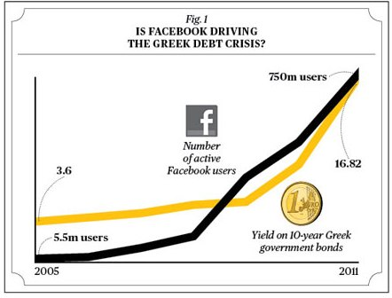

Despite this strong correlation, it would not be wise to conclude that the success of Facebook has somehow *caused* the current (2009-2012) Greek debt crisis, nor that the Greek debt crisis has caused the adoption of Facebook!

Of course, while it’s all very well to piously state that correlation doesn’t imply causation, it does leave us with a conundrum: under what conditions, exactly, can we use experimental data to deduce a causal relationship between two or more variables?

The standard scientific answer to this question is that (with some caveats) we can infer causality from a well designed [randomized controlled experiment](http://en.wikipedia.org/wiki/Randomized_controlled_trial). Unfortunately, while this answer is satisfying in principle and sometimes useful in practice, it’s often impractical or impossible to do a randomized controlled experiment. And so we’re left with the question of whether there are other procedures we can use to infer causality from experimental data. And, given that we can find more general procedures for inferring causal relationships, what does causality mean, anyway, for how we reason about a system?

It might seem that the answers to such fundamental questions would have been settled long ago. In fact, they turn out to be surprisingly subtle questions. Over the past few decades, a group of scientists have developed a theory of *causal inference* intended to address these and other related questions. This theory can be thought of as an algebra or language for reasoning about cause and effect. Many elements of the theory have been laid out in a [famous book](http://www.amazon.com/Causality-Reasoning-Inference-Judea-Pearl/dp/0521773628) by one of the main contributors to the theory, [Judea Pearl](http://en.wikipedia.org/wiki/Judea_Pearl). Although the theory of causal inference is not yet fully formed, and is still undergoing development, what has already been accomplished is interesting and worth understanding.

In this post I will describe one small but important part of the theory of causal inference, a *causal calculus* developed by Pearl. This causal calculus is a set of three simple but powerful algebraic rules which can be used to make inferences about causal relationships. In particular, I’ll explain how the causal calculus can sometimes (but not always!) be used to infer causation from a set of data, even when a randomized controlled experiment is not possible. Also in the post, I’ll describe some of the limits of the causal calculus, and some of my own speculations and questions.

The post is a little technically detailed at points. However, the first three sections of the post are non-technical, and I hope will be of broad interest. Throughout the post I’ve included occasional “Problems for the author”, where I describe problems I’d like to solve, or things I’d like to understand better. Feel free to ignore these if you find them distracting, but I hope they’ll give you some sense of what I find interesting about the subject. Incidentally, I’m sure many of these problems have already been solved by others; I’m not claiming that these are all open research problems, although perhaps some are. They’re simply things I’d like to understand better. Also in the post I’ve included some exercises for the reader, and some slightly harder problems for the reader. You may find it informative to work through these exercises and problems.

Before diving in, one final caveat: I am not an expert on causal inference, nor on statistics. The reason I wrote this post was to help me internalize the ideas of the causal calculus. Occasionally, one finds a presentation of a technical subject which is beautifully clear and illuminating, a presentation where the author has seen right through the subject, and is able to convey that crystalized understanding to others. That’s a great aspirational goal, but I don’t yet have that understanding of causal inference, and these notes don’t meet that standard. Nonetheless, I hope others will find my notes useful, and that experts will speak up to correct any errors or misapprehensions on my part.

### Simpson’s paradox

Let me start by explaining two example problems to illustrate some of the difficulties we run into when making inferences about causality. The first is known as [Simpson’s paradox](http://en.wikipedia.org/wiki/Simpson's_paradox). To explain Simpson’s paradox I’ll use a concrete example based on the passage of the Civil Rights Act in the United States in 1964.

In the US House of Representatives, 61 percent of Democrats voted for the Civil Rights Act, while a much higher percentage, 80 percent, of Republicans voted for the Act. You might think that we could conclude from this that being Republican, rather than Democrat, was an important factor in causing someone to vote for the Civil Rights Act. However, the picture changes if we include an additional factor in the analysis, namely, whether a legislator came from a Northern or Southern state. If we include that extra factor, the situation *completely* reverses, in both the North *and* the South. Here’s how it breaks down:

**North:** Democrat (94 percent), Republican (85 percent)
**South:** Democrat (7 percent), Republican (0 percent)

Yes, you read that right: in *both* the North and the South, a larger fraction of Democrats than Republicans voted for the Act, despite the fact that *overall* a larger fraction of Republicans than Democrats voted for the Act.

You might wonder how this can possibly be true. I’ll quickly state the raw voting numbers, so you can check that the arithmetic works out, and then I’ll explain why it’s true. You can skip the numbers if you trust my arithmetic.

**North:** Democrat (145/154, 94 percent), Republican (138/162, 85 percent)
**South:** Democrat (7/94, 7 percent), Republican (0/10, 0 percent)
**Overall:** Democrat (152/248, 61 percent), Republican (138/172, 80 percent)

One way of understanding what’s going on is to note that a far greater proportion of Democrat (as opposed to Republican) legislators were from the South. In fact, at the time the House had 94 Democrats, and only 10 Republicans. Because of this enormous difference, the very low fraction (7 percent) of southern Democrats voting for the Act dragged down the Democrats’ overall percentage much more than did the even lower fraction (0 percent) of southern Republicans who voted for the Act.

(The numbers above are for the House of Congress. The numbers were different in the Senate, but the same overall phenomenon occurred. I’ve taken the numbers from [Wikipedia’s article about Simpson’s paradox](http://en.wikipedia.org/wiki/Simpson's_paradox#Civil_Rights_Act_of_1964), and there are more details there.)

If we take a naive causal point of view, this result looks like a paradox. As I said above, the overall voting pattern seems to suggest that being Republican, rather than Democrat, was an important causal factor in voting for the Civil Rights Act. Yet if we look at the individual statistics in *both* the North and the South, then we’d come to the exact *opposite* conclusion. To state the same result more abstractly, Simpson’s paradox is the fact that the correlation between two variables can actually be *reversed* when additional factors are considered. So two variables which appear correlated can become anticorrelated when another factor is taken into account.

You might wonder if results like those we saw in voting on the Civil Rights Act are simply an unusual fluke. But, in fact, this is not that uncommon. [Wikipedia’s page on Simpson’s paradox](http://en.wikipedia.org/wiki/Simpson's_paradox) lists many important and similar real-world examples ranging from understanding whether there is gender-bias in university admissions to which treatment works best for kidney stones. In each case, understanding the causal relationships turns out to be much more complex than one might at first think.

I’ll now go through a second example of Simpson’s paradox, the kidney stone treatment example just mentioned, because it helps drive home just how bad our intuitions about statistics and causality are.

Imagine you suffer from kidney stones, and your Doctor offers you two choices: treatment A or treatment B. Your Doctor tells you that the two treatments have been tested in a trial, and treatment A was effective for a higher percentage of patients than treatment B. If you’re like most people, at this point you’d say “Well, okay, I’ll go with treatment A”.

Here’s the gotcha. Keep in mind that this *really happened*. Suppose you divide patients in the trial up into those with large kidney stones, and those with small kidney stones. Then even though treatment A was effective for a higher overall percentage of patients than treatment B, treatment B was effective for a higher percentage of patients in *both groups*, i.e., for both large and small kidney stones. So your Doctor could just as honestly have said “Well, you have large [or small] kidney stones, and treatment B worked for a higher percentage of patients with large [or small] kidney stones than treatment A”. If your Doctor had made either one of these statements, then if you’re like most people you’d have decided to go with treatment B, i.e., the exact opposite treatment.

The kidney stone example relies, of course, on the same kind of arithmetic as in the Civil Rights Act voting, and it’s worth stopping to figure out for yourself how the claims I made above could possibly be true. If you’re having trouble, you can click through to the [Wikipedia page](http://en.wikipedia.org/wiki/Simpson's_paradox#Kidney_stone_treatment), which has all the details of the numbers.

Now, I’ll confess that before learning about Simpson’s paradox, I would have unhesitatingly done just as I suggested a naive person would. Indeed, even though I’ve now spent quite a bit of time pondering Simpson’s paradox, I’m not entirely sure I wouldn’t still sometimes make the same kind of mistake. I find it more than a little mind-bending that my heuristics about how to behave on the basis of statistical evidence are obviously not just a little wrong, but utterly, horribly wrong.

Perhaps I’m alone in having terrible intuition about how to interpret statistics. But frankly I wouldn’t be surprised if most people share my confusion. I often wonder how many people with real decision-making power – politicians, judges, and so on – are making decisions based on statistical studies, and yet they don’t understand even basic things like Simpson’s paradox. Or, to put it another way, they have not the first clue about statistics. Partial evidence may be worse than no evidence if it leads to an illusion of knowledge, and so to overconfidence and certainty where none is justified. It’s better to know that you don’t know.

### Correlation, causation, smoking, and lung cancer

As a second example of the difficulties in establishing causality, consider the relationship between cigarette smoking and lung cancer. In 1964 the United States’ Surgeon General issued a [report](http://profiles.nlm.nih.gov/ps/access/NNBBMQ.pdf) claiming that cigarette smoking causes lung cancer. Unfortunately, according to Pearl the evidence in the report was based primarily on correlations between cigarette smoking and lung cancer. As a result the report came under attack not just by tobacco companies, but also by some of the world’s most prominent statisticians, including the great [Ronald Fisher](http://en.wikipedia.org/wiki/Ronald_Fisher). They claimed that there could be a hidden factor – maybe some kind of genetic factor – which caused both lung cancer *and* people to want to smoke (i.e., nicotine craving). If that was true, then while smoking and lung cancer would be correlated, the decision to smoke or not smoke would have no impact on whether you got lung cancer.

Now, you might scoff at this notion. But derision isn’t a principled argument. And, as the example of Simpson’s paradox showed, determining causality on the basis of correlations is tricky, at best, and can potentially lead to contradictory conclusions. It’d be much better to have a principled way of using data to conclude that the relationship between smoking and lung cancer is not just a correlation, but rather that there truly is a causal relationship.

One way of demonstrating this kind of causal connection is to do a randomized, controlled experiment. We suppose there is some experimenter who has the power to *intervene* with a person, literally forcing them to either smoke (or not) according to the whim of the experimenter. The experimenter takes a large group of people, and randomly divides them into two halves. One half are forced to smoke, while the other half are forced not to smoke. By doing this the experimenter can *break* the relationship between smoking and any hidden factor causing both smoking and lung cancer. By comparing the cancer rates in the group who were forced to smoke to those who were forced not to smoke, it would then be possible determine whether or not there is truly a causal connection between smoking and lung cancer.

This kind of randomized, controlled experiment is highly desirable when it can be done, but experimenters often don’t have this power. In the case of smoking, this kind of experiment would probably be illegal today, and, I suspect, even decades into the past. And even when it’s legal, in many cases it would be impractical, as in the case of the Civil Rights Act, and for many other important political, legal, medical, and econonomic questions.

### Causal models

To help address problems like the two example problems just discussed, Pearl introduced a [causal calculus](http://ftp.cs.ucla.edu/pub/stat_ser/R212.pdf). In the remainder of this post, I will explain the rules of the causal calculus, and use them to analyse the smoking-cancer connection. We’ll see that even without doing a randomized controlled experiment it’s possible (with the aid of some reasonable assumptions) to *infer* what the outcome of a randomized controlled experiment would have been, using only relatively easily accessible experimental data, data that doesn’t require experimental intervention to force people to smoke or not, but which can be obtained from purely observational studies.

To state the rules of the causal calculus, we’ll need several background ideas. I’ll explain those ideas over the next three sections of this post. The ideas are *causal models* (covered in this section), *causal conditional probabilities*, and *d-separation*, respectively. It’s a lot to swallow, but the ideas are powerful, and worth taking the time to understand. With these notions under our belts, we’ll able to understand the rules of the causal calculus

To understand causal models, consider the following graph of possible causal relationships between smoking, lung cancer, and some unknown hidden factor (say, a hidden genetic factor):

This is a quite general model of causal relationships, in the sense that it includes both the suggestion of the US Surgeon General (smoking causes cancer) and also the suggestion of the tobacco companies (a hidden factor causes both smoking and cancer). Indeed, it also allows a third possibility: that perhaps both smoking and some hidden factor contribute to lung cancer. This combined relationship could potentially be quite complex: it could be, for example, that smoking alone actually reduces the chance of lung cancer, but the hidden factor increases the chance of lung cancer so much that someone who smokes would, on average, see an increased probability of lung cancer. This sounds unlikely, but later we’ll see some toy model data which has exactly this property.

Of course, the model depicted in the graph above is not the most general possible model of causal relationships in this system; it’s easy to imagine much more complex causal models. But at the very least this is an *interesting* causal model, since it encompasses both the US Surgeon General and the tobacco company suggestions. I’ll return later to the possibility of more general causal models, but for now we’ll simply keep this model in mind as a concrete example of a causal model.

Mathematically speaking, what do the arrows of causality in the diagram above mean? We’ll develop an answer to that question over the next few paragraphs. It helps to start by moving away from the specific smoking-cancer model to allow a causal model to be based on a more general graph indicating possible causal relationships between a number of variables:

Each vertex in this causal model has an associated random variable, 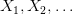. For example, in the causal model above 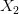 could be a two-outcome random variable indicating the presence or absence of some gene that exerts an influence on whether someone smokes or gets lung cancer, 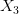 indicates “smokes” or “does not smoke”, and 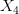 indicates “gets lung cancer” or “doesn’t get lung cancer”. The other variables 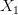 and  would refer to other potential dependencies in this (somewhat more complex) model of the smoking-cancer connection.

A notational convention that we’ll use often is to interchangeably use 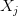 to refer to a random variable in the causal model, and also as a way of labelling the corresponding vertex in the graph for the causal model. It should be clear from context which is meant. We’ll also sometimes refer interchangeably to the causal model or to the associated graph.

For the notion of causality to make sense we need to constrain the class of graphs that can be used in a causal model. Obviously, it’d make no sense to have loops in the graph:

We can’t have 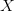 causing 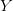 causing 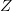 causing ! At least, not without a time machine. Because of this we constrain the graph to be a [directed acyclic graph](http://en.wikipedia.org/wiki/Directed_acyclic_graph), meaning a (directed) graph which has no loops in it.

By the way, I must admit that I’m not a fan of the term directed acyclic graph. It sounds like a very complicated notion, at least to my ear, when what it means is very simple: a graph with no loops. I’d really prefer to call it a “loop-free graph”, or something like that. Unfortunately, the “directed acyclic graph” nomenclature is pretty standard, so we’ll go with it.

Our picture so far is that a causal model consists of a directed acyclic graph, whose vertices are labelled by random variables . To complete our definition of causal models we need to capture the allowed relationships between those random variables.

Intuitively, what causality means is that for any particular  the only random variables which directly influence the value of  are the *parents* of , i.e., the collection 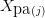 of random variables which are connected directly to . For instance, in the graph shown below (which is the same as the complex graph we saw a little earlier), we have 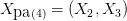:

Now, of course, vertices further back in the graph – say, the parents of the parents – could, of course, influence the value of . But it would be indirect, an influence mediated through the parent vertices.

Note, by the way, that I’ve overloaded the  notation, using 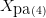 to denote a collection of random variables. I’ll use this kind of overloading quite a bit in the rest of this post. In particular, I’ll often use the notation  (or 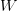,  or ) to denote a subset of random variables from the graph.

Motivated by the above discussion, one way we could define causal influence would be to require that  be a function of its parents:

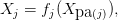

where 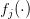 is some function. In fact, we’ll allow a slightly more general notion of causal influence, allowing  to not just be a deterministic function of the parents, but a random function. We do this by requiring that  be expressible in the form:

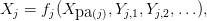

where  is a function, and 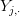 is a collection of random variables such that: (a) the  are independent of one another for different values of 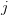; and (b) for each ,  is independent of all variables 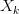, except when  is  itself, or a descendant of . The intuition is that the  are a collection of auxiliary random variables which inject some extra randomness into  (and, through , its descendants), but which are otherwise independent of the variables in the causal model.

Summing up, a causal model consists of a directed acyclic graph, , whose vertices are labelled by random variables, , and each  is expressible in the form 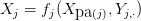 for some function . The  are independent of one another, and each  is independent of all variables , except when  is  or a descendant of .

In practice, we will not work directly with the functions  or the auxiliary random variables . Instead, we’ll work with the following equation, which specifies the causal model’s joint probability distribution as a product of conditional probabilities:

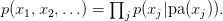

I won’t prove this equation, but the expression should be plausible, and is pretty easy to prove; I’ve asked you to prove it as an optional exercise below.

### Exercises

- Prove the above equation for the joint probability distribution.

### Problems

- **(Simpson’s paradox in causal models)** Consider the causal model of smoking introduced above. Suppose that the hidden factor is a gene which is either switched on or off. If on, it tends to make people both smoke and get lung cancer. Find explicit values for conditional probabilities in the causal model such that 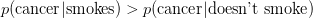, and yet if the additional genetic factor is taken into account this relationship is reversed. That is, we have both 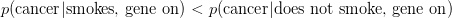 and 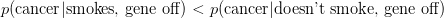.

### Problems for the author

- An alternate, equivalent approach to defining causal models is as follows: (1) all root vertices (i.e., vertices with no parents) in the graph are labelled by independent random variables. (2) augment the graph by introducing new vertices corresponding to the 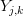. These new vertices have single outgoing edges, pointing to . (3) Require that non-root vertices in the augmented graph be deterministic functions of their parents. The disadvantage of this definition is that it introduces the overhead of dealing with the augmented graph. But the definition also has the advantage of cleanly separating the stochastic and deterministic components, and I wouldn’t be surprised if developing the theory of causal inference from this point of view was stimulating, at the very least, and may possibly have some advantages compared to the standard approach. So the problem I set myself (and anyone else who is interested!) is to carry the consequences of this change through the rest of the theory of causal inference, looking for advantages and disadvantages.

I’ve been using terms like “causal influence” somewhat indiscriminately in the discussion above, and so I’d like to pause to discuss a bit more carefully about what is meant here, and what nomenclature we should use going forward. All the arrows in a causal model indicate are the *possibility* of a *direct* causal influence. This results in two caveats on how we think about causality in these models. First, it may be that a child random variable is actually completely independent of the value of one (or more) of its parent random variables. This is, admittedly, a rather special case, but is perfectly consistent with the definition. For example, in a causal model like

it is possible that the outcome of cancer might be independent of the hidden causal factor or, for that matter, that it might be independent of whether someone smokes or not. (Indeed, logically, at least, it may be independent of both, although of course that’s not what we’ll find in the real world.) The second caveat in how we think about the arrows and causality is that the arrows only capture the *direct* causal influences in the model. It is possible that in a causal model like

 will have a causal influence on  through its influence on  and . This would be an indirect causal influence, mediated by other random variables, but it would still be a causal influence. In the next section I’ll give a more formal definition of causal influence that can be used to make these ideas precise.

### Causal conditional probabilities

In this section I’ll explain what I think is the most imaginative leap underlying the causal calculus. It’s the introduction of the concept of *causal conditional probabilities*.

The notion of ordinary conditional probabilities is no doubt familiar to you. It’s pretty straightforward to do experiments to estimate conditional probabilities such as 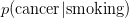, simply by looking at the population of people who smoke, and figuring out what fraction of those people develop cancer. Unfortunately, for the purpose of understanding the causal relationship between smoking and cancer,  isn’t the quantity we want. As the tobacco companies pointed out, there might well be a hidden genetic factor that makes it very likely that you’ll see cancer in anyone who smokes, but that wouldn’t therefore mean that smoking causes cancer.

As we discussed earlier, what you’d really like to do in this circumstance is a randomized controlled experiment in which it’s possible for the experimenter to force someone to smoke (or not smoke), breaking the causal connection between the hidden factor and smoking. In such an experiment you really could see if there was a causal influence by looking at what fraction of people who smoked got cancer. In particular, if that fraction was higher than in the overall population then you’d be justified in concluding that smoking helped cause cancer. In practice, it’s probably not practical to do this kind of randomized controlled experiment. But Pearl had what turns out to be a very clever idea: to imagine a hypothetical world in which it really *is* possible to force someone to (for example) smoke, or not smoke. In particular, he introduced a *conditional causal probability*  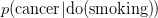, which is the conditional probability of cancer in this hypothetical world. This should be read as the (causal conditional) probability of cancer given that we “do” smoking, i.e., someone has been forced to smoke in a (hypothetical) randomized experiment.

Now, at first sight this appears a rather useless thing to do. But what makes it a clever imaginative leap is that although it may be impossible or impractical to do a controlled experiment to determine 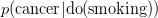, Pearl was able to establish a set of rules – a causal calculus – that such causal conditional probabilities should obey. And, by making use of this causal calculus, it turns out to sometimes be possible to *infer* the value of probabilities such as , even when a controlled, randomized experiment is impossible. And that’s a very remarkable thing to be able to do, and why I say it was so clever to have introduced the notion of causal conditional probabilities.

We’ll discuss the rules of the causal calculus later in this post. For now, though, let’s develop the notion of causal conditional probabilities. Suppose we have a causal model of some phenomenon:

Now suppose we introduce an external experimenter who is able to intervene to deliberately set the value of a particular variable  to 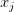. In other words, the experimenter can override the other causal influences on that variable. This is equivalent to having a new causal model:

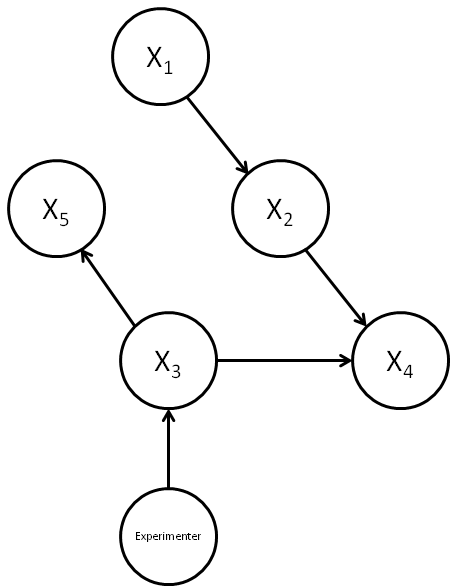

In this new causal model, we’ve represented the experimenter by a new vertex, which has as a child the vertex . All other parents of  are cut off, i.e., the edges from the parents to  are deleted from the graph. In this case that means the edge from  to  has been deleted. This represents the fact that the experimenter’s intervention overrides the other causal influences. (Note that the edges to the children of  are left undisturbed.) In fact, it’s even simpler (and equivalent) to consider a causal model where the parents have been cut off from , and no extra vertex added:

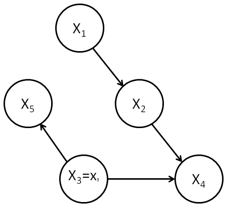

This model has no vertex explicitly representing the experimenter, but rather the relation 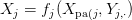 is replaced by the relation 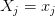. We will denote this graph by 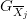, indicating the graph in which all edges pointing to  have been deleted. We will call this a *perturbed graph*, and the corresponding causal model a *perturbed causal model*. In the perturbed causal model the only change is to delete the edges to , and to replace the relation  by the relation .

Our aim is to use this perturbed causal model to compute the conditional causal probability 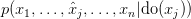. In this expression, 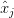 indicates that the  term is omitted before the , since the value of  is set on the right. By definition, the causal conditional probability  is just the value of the probability distribution in the perturbed causal model, 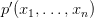. To compute the value of the probability in the perturbed causal model, note that the probability distribution in the original causal model was given by

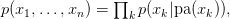

where the product on the right is over all vertices in the causal model. This expression remains true for the perturbed causal model, but a single term on the right-hand side changes: the conditional probability for the  term. In particular, this term gets changed from 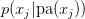 to , since we have fixed the value of  to be . As a result we have:

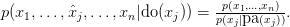

This equation is a fundamental expression, capturing what it means for an experimenter to intervene to set the value of some particular variable in a causal model. It can easily be generalized to a situation where we partition the variables into two sets,  and , where  are the variables we suppose have been set by intervention in a (possibly hypothetical) randomized controlled experiment, and  are the remaining variables:

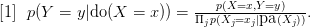

Note that on the right-hand side the values for 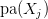 are assumed to be given by the appropriate values from  and 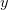. The expression [1] can be viewed as a *definition* of causal conditional probabilities. But although this expression is fundamental to understanding the causal calculus, it is not always useful in practice. The problem is that the values of some of the variables on the right-hand side may not be known, and cannot be determined by experiment. Consider, for example, the case of smoking and cancer. Recall our causal model:

What we’d like is to compute . Unfortunately, we immediately run into a problem if we try to use the expression on the right of equation [1]: we’ve got no way of estimating the conditional probabilities for smoking given the hidden common factor. So we can’t obviously compute . And, as you can perhaps imagine, this is the kind of problem that will come up a lot whenever we’re worried about the possible influence of some hidden factor.

All is not lost, however. Just because we can’t compute the expression on the right of [1] directly doesn’t mean we can’t compute causal conditional probabilities in other ways, and we’ll see below how the causal calculus can help solve this kind of problem. It’s not a complete solution – we shall see that it doesn’t always make it possible to compute causal conditional probabilities. But it does help. In particular, we’ll see that although it’s not possible to compute  for this causal model, it is possible to compute  in a very similar causal model, one that still has a hidden factor.

With causal conditional probabilities defined, we’re now in position to define more precisely what we mean by causal influence. Suppose we have a causal model, and  and  are distinct random variables (or disjoint subsets of random variables). Then we say  has a *causal influence* over  if there are values  and  of  and  of  such that . In other words, an external experimenter who can intervene to change the value of  can cause a corresponding change in the distribution of values at . The following exercise gives an information-theoretic justification for this definition of causal influence: it shows that an experimenter who can intervene to set  can transmit information to  if and only if the above condition for causal inference is met.

### Exercises

- **(The causal capacity)** This exercise is for people with some background in information theory. Suppose we define the causal capacity between  and  to be , where  is the mutual information, the maximization is over possible distributions  for  (we use the hat to indicate that the value of  is being set by intervention), and  is the corresponding random variable at , with distribution . Shannon’s noisy channel coding theorem tells us that an external experimenter who can intervene to set the value of  can transmit information to an observer at  at a maximal rate set by the causal capacity. Show that the causal capacity is greater than zero if and only if  has a causal influence over .

We’ve just defined a notion of causal influence between two random variables in a causal model. What about when we say something like “Event A” causes “Event B”? What does this mean? Returning to the smoking-cancer example, it seems that we would say that smoking causes cancer provided 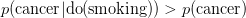, so that if someone makes the choice to smoke, uninfluenced by other causal factors, then they would increase their chance of cancer. Intuitively, it seems to me that this notion of events causing one another should be related to the notion of causal influence just defined above. But I don’t yet see quite how to do that. The first problem below suggests a conjecture in this direction:

### Problems for the author

- Suppose  and  are random variables in a causal model such that  for some pair of values  and . Does this imply that  exerts a causal influence on ?
- **(Sum-over-paths for causal conditional probabilities?)** I believe a kind of sum-over-paths formulation of causal conditional probabilities is possible, but haven’t worked out details. The idea is as follows (the details may be quite wrong, but I believe something along these lines should work). Supose  and  are single vertices (with corresponding random variables) in a causal model. Then I would like to show first that if  is not an ancestor of  then , i.e., intervention does nothing. Second, if  is an ancestor of  then  may be obtained by summing over all directed paths from  to  in , and computing for each path a contribution to the sum which is a product of conditional probabilities along the path. (Note that we may need to consider the same path multiple times in the sum, since the random variables along the path may take different values).
- We used causal models in our definition of causal conditional probabilities. But our informal definiton – imagine a hypothetical world in which it’s possible to force a variable to take a particular value – didn’t obviously require the use of a causal model. Indeed, in a real-world randomized controlled experiment it may be that there is no underlying causal model. This leads me to wonder if there is some other way of formalizing the informal definition we’ve given?
- Another way of framing the last problem is that I’m concerned about the empirical basis for causal models. How should we go about constructing such models? Are they fundamental, representing true facts about the world, or are they modelling conveniences? (This is by no means a dichotomy.) It would be useful to work through many more examples, considering carefully the origin of the functions  and of the auxiliary random variables .

### d-separation

In this section we’ll develop a criterion that Pearl calls *directional separation* (*d-separation*, for short). What d-separation does is let us inspect the graph of a causal model and conclude that a random variable  in the model can’t tell us anything about the value of another random variable  in the model, or vice versa.

To understand d-separation we’ll start with a simple case, and then work through increasingly complex cases, building up our intuition. I’ll conclude by giving a precise definition of d-separation, and by explaining how d-separation relates to the concept of conditional independence of random variables.

Here’s the first simple causal model:
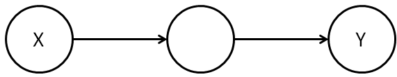

Clearly, knowing  can in general tell us something about  in this kind of causal model, and so in this case  and  are *not* d-separated. We’ll use the term *d-connected* as a synonym for “not d-separated”, and so in this causal model  and  are d-connected.

By contrast, in the following causal model  and  don’t give us any information about each other, and so they are d-separated:

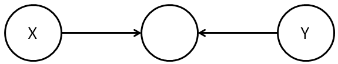

A useful piece of terminology is to say that a vertex like the middle vertex in this model is a *collider* for the path from  to , meaning a vertex at which both edges along the path are incoming.

What about the causal model:
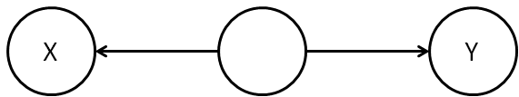

In this case, it is possible that knowing  will tell us something about , because of their common ancestry. It’s like the way knowing the genome for one sibling can give us information about the genome of another sibling, since similarities between the genomes can be inferred from the common ancestry. We’ll call a vertex like the middle vertex in this model a *fork* for the path from  to , meaning a vertex at which both edges are outgoing.

### Exercises

- Construct an explicit causal model demonstrating the assertion of the last paragraph. For example, you may construct a causal model in which  and  are joined by a fork, and where  is actually a function of .
- Suppose we have a path from  to  in a causal model. Let  be the number of colliders along the path, and let  be the number of forks along the path. Show that  can only take the values  or , i.e., the number of forks and colliders is either the same or differs by at most one.

We’ll say that a path (of any length) from  to  that contains a collider is a *blocked* path. By contrast, a path that contains no colliders is called an *unblocked* path. (Note that by the above exercise, an unblocked path must contain either one or no forks.) In general, we define  and  to be *d-connected* if there is an unblocked path between them. We define them to be *d-separated* if there is no such unblocked path.

It’s worth noting that the concepts of d-separation and d-connectedness depend only on the graph topology and on which vertices  and  have been chosen. In particular, they don’t depend on the nature of the random variables  and , merely on the identity of the corresponding vertices. As a result, you can determine d-separation or d-connectdness simply by inspecting the graph. This fact – that d-separation and d-connectdness are determined by the graph – also holds for the more sophisticated notions of d-separation and d-connectedness we develop below.

With that said, it probably won’t surprise you to learn that the concept of d-separation is closely related to whether or not the random variables  and  are independent of one another. This is a connection you can (optionally) develop through the following exercises. I’ll state a much more general connection below.

### Exercises

- Suppose that  and  are d-separated. Show that  and  are independent random variables, i.e., that .
- Suppose we have two vertices which are d-connected in a graph . Explain how to construct a causal model on that graph such that the random variables  and  corresponding to those two vertices are *not* independent.
- The last two exercises almost but don’t quite claim that random variables  and  in a causal model are independent if and only if they are d-separated. Why does this statement fail to be true? How can you modify the statement to make it true?

So far, this is pretty simple stuff. It gets more complicated, however, when we extend the notion of d-separation to cases where we are conditioning on already *knowing* the value of one or more random variables in the causal model. Consider, for example, the graph:

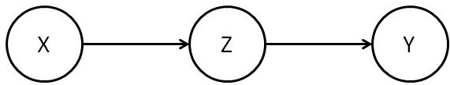
(Figure A.)

Now, if we know , then knowing  doesn’t give us any additional information about , since by our original definition of a causal model  is already a function of  and some auxiliary random variables which are independent of . So it makes sense to say that  blocks this path from  to , even though in the unconditioned case this path would not have been considered blocked. We’ll also say that  and  are d-separated, given .

It is helpful to give a name to vertices like the middle vertex in Figure A, i.e., to vertices with one ingoing and one outgoing edge. We’ll call such vertices a *traverse* along the path from  to . Using this language, the lesson of the above discussion is that if  is in a traverse along a path from  to , then the path is blocked.

By contrast, consider this model:
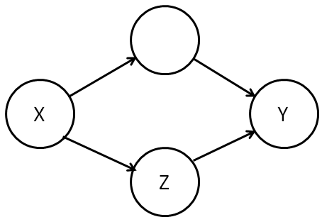

In this case, knowing  will in general give us additional information about , even if we know . This is because while  blocks one path from  to  there is another unblocked path from  to . And so we say that  and  are d-connected, given .

Another case similar to Figure A is the model with a fork:

Again, if we know , then knowing  as well doesn’t give us any extra information about  (or vice versa). So we’ll say that in this case  is blocking the path from  to , even though in the unconditioned case this path would not have been considered blocked. Again, in this example  and  are d-separated, given .

The lesson of this model is that if  is located at a fork along a path from  to , then the path is blocked.

A subtlety arises when we consider a collider:

(Figure B.)

In the unconditioned case this would have been considered a blocked path. And, naively, it seems as though this should still be the case: at first sight (at least according to my intuition) it doesn’t seem very likely that  can give us any additional information about  (or vice versa), even given that  is known. Yet we should be cautious, because the argument we made for the graph in Figure A breaks down: we can’t say, as we did for Figure A, that  is a function of  and some auxiliary independent random variables.

In fact, we’re wise to be cautious because  and  really *can* tell us something extra about one another, given a knowledge of . This is a phenomenon which Pearl calls *Berkson’s paradox*. He gives the example of a graduate school in music which will admit a student (a possibility encoded in the value of ) if either they have high undergraduate grades (encoded in ) or some other evidence that they are exceptionally gifted at music (encoded in ). It would not be surprising if these two attributes were anticorrelated amongst students in the program, e.g., students who were admitted on the basis of exceptional gifts would be more likely than otherwise to have low grades. And so in this case knowledge of  (exceptional gifts) would give us knowledge of  (likely to have low grades), conditioned on knowledge of  (they were accepted into the program).

Another way of seeing Berkson’s paradox is to construct an explicit causal model for the graph in Figure B. Consider, for example, a causal model in which  and  are independent random bits,  or , chosen with equal probabilities . We suppose that , where  is addition modulo . This causal model does, indeed, have the structure of Figure B. But given that we know the value , knowing the value of  tells us everything about , since .

As a result of this discussion, in the causal graph of Figure B we’ll say that  unblocks the path from  to , even though in the unconditioned case the path would have been considered blocked. And we’ll also say that in this causal graph  and  are d-connected, conditional on .

The immediate lesson from the graph of Figure B is that  and  can tell us something about one another, given , if there is a path between  and  where the only collider is at . In fact, the same phenomenon can occur even in this graph:

(Figure C.)

To see this, suppose we choose  and  as in the example just described above, i.e., independent random bits,  or , chosen with equal probabilities . We will let the unlabelled vertex be . And, finally, we choose . Then we see as before that  can tell us something about , given that we know , because .

The general intuition about graphs like that in Figure C is that knowing  allows us to infer something about the ancestors of , and so we must act as though those ancestors are known, too. As a result, in this case we say that  unblocks the path from  to , since  has an ancestor which is a collider on the path from  to . And so in this case  is d-connected to , given .

Given the discussion of Figure C that we’ve just had, you might wonder why forks or traverses which are ancestors of  can’t block a path, for similar reasons? For instance, why don’t we consider  and  to be d-separated, given , in the following graph:

The reason, of course, is that it’s easy to construct examples where  tells us something about  in *addition* to what we already know from . And so we can’t consider  and  to be d-separated, given , in this example.

These examples motivate the following definition:

**Definition:** Let ,  and  be disjoint subsets of vertices in a causal model. Consider a path from a vertex in  to a vertex in . We say the path is *blocked* by  if the path contains either: (a) a collider which is not an ancestor of , or (b) a fork which is in , or (c) a traverse which is in . We say the path is *unblocked* if it is not blocked. We say that  and  are *d-connected*, given , if there is an unblocked path between some vertex in  and some vertex in .  and  are *d-separated*, given , if they are not d-connected.

Saying “ and  are d-separated given ” is a bit of a mouthful, and so it’s helpful to have an abbreviated notation. We’ll use the abbreviation . Note that this notation includes the graph ; we’ll sometimes omit the graph when the context is clear. We’ll write  to denote unconditional d-separation.

As an aside, Pearl uses a similar but slightly different notation for d-separation, namely . Unfortunately, while the symbol  looks like a LaTeX symbol, it’s not, but is most easily produced using a rather dodgy LaTeX hack. Instead of using that hack over and over again, I’ve adopted a more standard LaTeX notation.

While I’m making asides, let me make a second: when I was first learning this material, I found the “d” for “directional” in d-separation and d-connected rather confusing. It suggested to me that the key thing was having a directed path from one vertex to the other, and that the complexities of colliders, forks, and so on were a sideshow. Of course, they’re not, they’re central to the whole discussion. For this reason, when I was writing these notes I considered changing the terminology to i-separated and i-connected, for informationally-separated and informationally-connected. Ultimately I decided not to do this, but I thought mentioning the issue might be helpful, in part to reassure readers (like me) who thought the “d” seemed a little mysterious.

Okay, that’s enough asides, let’s get back to the main track of discussion.

We saw earlier that (unconditional) d-separation is closely connected to the independence of random variables. It probably won’t surprise you to learn that conditional d-separation is closely connected to conditional independence of random variables. Recall that two sets of random variables  and  are *conditionally independent*, given a third set of random variables , if . The following theorem shows that d-separation gives a criterion for when conditional independence occurs in a causal model:

**Theorem (graphical criterion for conditional independence):** Let  be a graph, and let ,  and  be disjoint subsets of vertices in that graph. Then  and  are d-separated, given , if and only if for all causal models on  the random variables corresponding to  and  are conditionally independent, given .

*(Update: Thanks to Rob Spekkens for pointing out an error in my original statement of this theorem.)*

I won’t prove the theorem here. However, it’s not especially difficult if you’ve followed the discussion above, and is a good problem to work through:

### Problems

- Prove the above theorem.

### Problems for the author

- The concept of d-separation plays a central role in the causal calculus. My sense is that it should be possible to find a cleaner and more intuitive definition that substantially simplifies many proofs. It’d be good to spend some time trying to find such a definition.

### The causal calculus

We’ve now got all the concepts we need to state the rules of the causal calculus. There are three rules. The rules look complicated at first, although they’re easy to use once you get familiar with them. For this reason I’ll start by explaining the intuition behind the first rule, and how you should think about that rule. Having understood how to think about the first rule it’s easy to get the hang of all three rules, and so after that I’ll just outright state all three rules.

In what follows, we have a causal model on a graph , and  are disjoint subsets of the variables in the causal model. Recall also that  denotes the perturbed graph in which all edges pointing to  from the parents of  have been deleted. This is the graph which results when an experimenter intervenes to set the value of , overriding other causal influences on .

**Rule 1: When can we ignore observations:** I’ll begin by stating the first rule in all its glory, but don’t worry if you don’t immediately grok the whole rule. Instead, just take a look, and try to start getting your head around it. What we’ll do then is look at some simple special cases, which are easily understood, and gradually build up to an understanding of what the full rule is saying.

Okay, so here’s the first rule of the causal calculus. What it tells us is that when , then we can ignore the observation of  in computing the probability of , conditional on both  and an intervention to set :

To understand why this rule is true, and what it means, let’s start with a much simpler case. Let’s look at what happens to the rule when there are no  or  variables in the mix. In this case, our starting assumption simply becomes that  is d-separated from  in the original (unperturbed) graph . There’s no need to worry about  because there’s no  variable whose value is being set by intervention. In this circumstance we have , so  is independent of . But the statement of the rule in this case is merely that , which is, indeed, equivalent to the standard definition of  and  being independent.

In other words, the first rule is simply a generalization of what it means for  and  to be independent. The full rule generalizes the notion of independence in two ways: (1) by adding in an extra variable  whose value has been determined by passive observation; and (2) by adding in an extra variable  whose value has been set by intervention. We’ll consider these two ways of generalizing separately in the next two paragraphs.

We begin with generalization (1), i.e., there is no  variable in the mix. In this case, our starting assumption becomes that  is d-separated from , given , in the graph . By the graphical criterion for conditional independence discussed in the last section this means that  is conditionally independent of , given , and so , which is exactly the statement of the rule. And so the first rule can be viewed as a generalization of what it means for  and  to be independent, conditional on .

Now let’s look at the other generalization, (2), in which we’ve added an extra variable  whose value has been set by intervention, and where there is no  variable in the mix. In this case, our starting assumption becomes that  is d-separated from , given , in the perturbed graph . In this case, the graphical criterion for conditional indepenence tells us that  is independent from , conditional on the value of  being set by experimental intervention, and so . Again, this is exactly the statement of the rule.

The full rule, of course, merely combines both these generalizations in the obvious way. It is really just an explicit statement of the content of the graphical criterion for conditional independence, in a context where  has been observed, and the value of  set by experimental intervention.

**The rules of the causal calculus:** All three rules of the causal calculus follow a similar template to the first rule: they provide ways of using facts about the causal structure (notably, d-separation) to make inferences about conditional causal probabilities. I’ll now state all three rules. The intuition behind rules 2 and 3 won’t necessarily be entirely obvious, but after our discussion of rule 1 the remaining rules should at least appear plausible and comprehensible. I’ll have bit more to say about intuition below.

As above, we have a causal model on a graph , and  are disjoint subsets of the variables in the causal model.  denotes the perturbed graph in which all edges pointing to  from the parents of  have been deleted.  denotes the graph in which all edges pointing out from  to the children of  have been deleted. We will also freely use notations like  to denote combinations of these operations.

**Rule 1: When can we ignore observations:** Suppose . Then:
**Rule 2: When can we ignore the act of intervention:** Suppose . Then:

**Rule 3: When can we ignore an intervention variable entirely:** Let  denote the set of nodes in  which are not ancestors of . Suppose . Then:

In a sense, all three rules are statements of conditional independence. The first rule tells us when we can ignore an observation. The second rule tells us when we can ignore the *act* of intervention (although that doesn’t necessarily mean we can ignore the value of the variable being intervened with). And the third rule tells us when we can ignore an intervention entirely, both the act of intervention, and the value of the variable being intervened with.

I won’t prove rule 2 or rule 3 – this post is already quite long enough. (If I ever significantly revise the post I may include the proofs). The important thing to take away from these rules is that they give us conditions on the structure of causal models so that we know when we can ignore observations, acts of intervention, or even entire variables that have been intervened with. This is obviously a powerful set of tools to be working with in manipulating conditional causal probabilities!

Indeed, according to Pearl there’s even a sense in which this set of rules is *complete*, meaning that using these rules you can identify all causal effects in a causal model. I haven’t yet understood the proof of this result, or even exactly what it means, but thought I’d mention it. The proof is in papers by [Shpitser and Pearl](http://ftp.cs.ucla.edu/pub/stat_ser/r329-uai.pdf) and [Huang and Valtorta](http://www.cse.sc.edu/~mgv/papers/HuangValtortaUAI06.pdf). If you’d like to see the proofs of the rules of the calculus, you can either have a go at proving them yourself, or you can [read the proof](http://ftp.cs.ucla.edu/pub/stat_ser/R218-B.pdf).

### Problems for the author

- Suppose the conditions of rules 1 and 2 hold. Can we deduce that the conditions of rule 3 also hold?

### Using the causal calculus to analyse the smoking-lung cancer connection

We’ll now use the causal calculus to analyse the connection between smoking and lung cancer. Earlier, I introduced a simple causal model of this connection:

The great benefit of this model was that it included as special cases both the hypothesis that smoking causes cancer and the hypothesis that some hidden causal factor was responsible for both smoking and cancer.

It turns out, unfortunately, that the causal calculus doesn’t help us analyse this model. I’ll explain why that’s the case below. However, rather than worrying about this, at this stage it’s more instructive to work through an example showing how the causal calculus *can* be helpful in analysing a similar but slightly modified causal model. So although this modification looks a little mysterious at first, for now I hope you’ll be willing to accept it as given.

The way I’m going to modify the causal model is by introducing an extra variable, namely, whether someone has appreciable amounts of tar in their lungs or not:

(By tar, I don’t mean “tar” literally, but rather all the material deposits found as a result of smoking.)

This causal model is a plausible modification of the original causal model. It is at least plausible to suppose that smoking causes tar in the lungs and that those deposits in turn cause cancer. But if the hidden causal factor is genetic, as the tobacco companies argued was the case, then it seems highly unlikely that the genetic factor caused tar in the lungs, except by the indirect route of causing those people to smoke. (I’ll come back to what happens if you refuse to accept this line of reasoning. For now, just go with it.)

Our goal in this modified causal model is to compute probabilities like . What we’ll show is that the causal calculus lets us compute this probability *entirely* in terms of probabilities like  and other probabilities that *don’t* involve an intervention, i.e., that don’t involve .

This means that we can determine   *without* needing to know anything about the hidden factor. We won’t even need to know the *nature* of the hidden factor. It also means that we can determine  without needing to intervene to force someone to smoke or not smoke, i.e., to set the value for .

In other words, the causal calculus lets us do something that seems almost miraculous: we can figure out the probability that someone would get cancer given that they are in the smoking group in a randomized controlled experiment, without needing to do the randomized controlled experiment. And this is true even though there may be a hidden causal factor underlying both smoking and cancer.

Okay, so how do we compute ?

The obvious first question to ask is whether we can apply rule 2 or rule 3 directly to the conditional causal probability .

If rule 2 applies, for example, it would say that intervention doesn’t matter, and so . Intuitively, this seems unlikely. We’d expect that intervention really can change the probability of cancer given smoking, because intervention would override the hidden causal factor.

If rule 3 applies, it would say that , i.e., that an intervention to force someone to smoke has no impact on whether they get cancer. This seems even more unlikely than rule 2 applying.

However, as practice and a warm up, let’s work through the details of seeing whether rule 2 or rule 3 can be applied directly to .

For rule 2 to apply we need . To check whether this is true, recall that  is the graph with the edges pointing out from  deleted:

Obviously,  is not d-separated from  in this graph, since  and  have a common ancestor. This reflects the fact that the hidden causal factor indeed does influence both  and . So we can’t apply rule 2.

What about rule 3? For this to apply we’d need . Recall that  is the graph with the edges pointing toward  deleted:

Again,  is not d-separated from , in this case because we have an unblocked path directly from  to . This reflects our intuition that the value of  can influence , even when the value of  has been set by intervention. So we can’t apply rule 3.

Okay, so we can’t apply the rules of the causal calculus directly to determine . Is there some indirect way we can determine this probability? An experienced probabilist would at this point instinctively wonder whether it would help to condition on the value of , writing:

Of course, saying an experienced probabilist would instinctively do this isn’t quite the same as explaining *why* one should do this! However, it is at least a moderately obvious thing to do: the only extra information we potentially have in the problem is , and so it’s certainly somewhat natural to try to introduce that variable into the problem. As we shall see, this turns out to be a wise thing to do.

### Exercises

- I used without proof the equation . This should be intuitively plausible, but really requires proof. Prove that the equation is correct.

To simplify the right-hand side of equation [2], we first note that we can apply rule 2 to the second term on the right-hand side, obtaining . To check this explicitly, note that the condition for rule 2 to apply is that . We already saw the graph  above, and, indeed,  is d-separated from  in that graph, since the only path from  to  is blocked at . As a result, we have:

At this point in the presentation, I’m going to speed the discussion up, telling you what rule of the calculus to apply at each step, but not going through the process of explicitly checking that the conditions of the rule hold. (If you’re doing a close read, you may wish to check the conditions, however.)

The next thing we do is to apply rule 2 to the first term on the right-hand side of equation [3], obtaining . We then apply rule 3 to remove the , obtaining . Substituting back in gives us:

So this means that we’ve reduced the computation of  to the computation of . This doesn’t seem terribly encouraging: we’ve merely substituted the computation of one causal conditional probability for another. Still, let us continue plugging away, and see if we can make progress. The obvious first thing to try is to apply rule 2 or rule 3 to simplify . Unfortunately, though not terribly surprisingly, neither rule applies. So what do we do? Well, in a repeat of our strategy above, we again condition on the other variable we have available to us, in this case :

Now we’re cooking! Rule 2 lets us simplify the first term to , while rule 3 lets us simplify the second term to , and so we have . To substitute this expression back into equation [4] it helps to change the summation index from  to , since otherwise we would have a duplicate summation index. This gives us:

This is the promised expression for  (i.e., for probabilities like , assuming the causal model above) in terms of quantities which may be observed directly from experimental data, and which don’t require intervention to do a randomized, controlled experiment. Once  is determined, we can compare it against . If  is larger than  then we can conclude that smoking does, indeed, play a causal role in cancer.

Something that bugs me about the derivation of equation [5] is that I don’t really know how to “see through” the calculations. Yes, it all works out in the end, and it’s easy enough to follow along. Yet that’s not the same as having a deep understanding. Too many basic questions remain unanswered: Why did we have to condition as we did in the calculation? Was there some other way we could have proceeded? What would have happeed if we’d conditioned on the value of the hidden variable? (This is not obviously the wrong thing to do: maybe the hidden variable would ultimately drop out of the calculation). Why is it possible to compute causal probabilities in this model, but not (as we shall see) in the model without tar? Ideally, a deeper understanding would make the answers to some or all of these questions much more obvious.

### Problems for the author

- Why is it so much easier to compute  than  in the model above? Is there some way we could have seen that this would be the case, without needing to go through a detailed computation?
- Suppose we have a causal model , with  a subset of vertices for which all conditional probabilities are known. Is it possible to give a simple characterization of for which subsets  and  of vertices it is possible to compute  using just the conditional probabilities from ?

Unfortunately, I don’t know what the experimentally observed probabilities are in the smoking-tar-cancer case. If anyone does, I’d be interested to know. In lieu of actual data, I’ll use some toy model data suggested by Pearl; the data is quite unrealistic, but nonetheless interesting as an illustration of the use of equation [5]. The toy model data is as follows:

(1) 47.5 percent of the population are nonsmokers with no tar in their lungs, and 10 percent of these get cancer.

(2) 2.5 percent are smokers with no tar, and 90 percent get cancer.
(3) 2.5 percent are nonsmokers with tar, and 5 percent get cancer.
(4) 47.5 percent are smokers with tar, and 85 percent get cancer.
In this case, we get:

By contrast,  percent, and so if this data was correct (obviously it’s not even close) it would show that smoking actually somewhat *reduces* a person’s chance of getting lung cancer. This is despite the fact that  percent, and so a naive approach to causality based on correlations alone would suggest that smoking causes cancer. In fact, in this imagined world smoking might actually be useable as a preventative treatment for cancer! Obviously this isn’t truly the case, but it does illustrate the power of this method of analysis.

Summing up the general lesson of the smoking-cancer example, suppose we have two competing hypotheses for the causal origin of some effect in a system, A causes C or B causes C, say. Then we should try to construct a realistic causal model which includes both hypotheses, and then use the causal calculus to attempt to distinguish the relative influence of the two causal factors, on the basis of experimentally accessible data.

Incidentally, the kind of analysis of smoking we did above obviously wasn’t done back in the 1960s. I don’t actually know how causality was established over the protestations that correlation doesn’t impy causation. But it’s not difficult to think of ways you might have come up with truly convincing evidence that smoking was a causal factor. One way would have been to look at the incidence of lung cancer in populations where smoking had only recently been introduced. Suppose, for example, that cigarettes had just been introduced into the (fictional) country of Nicotinia, and that this had been quickly followed by a rapid increase in rates of lung cancer. If this pattern was seen across many new markets then it would be very difficult to argue that lung cancer was being caused solely by some pre-existing factor in the population.

### Exercises

- Construct toy model data where smoking increases a person’s chance of getting lung cancer.

Let’s leave this model of smoking and lung cancer, and come back to our original model of smoking and lung cancer:

What would have happened if we’d tried to use the causal calculus to analyse this model? I won’t go through all the details, but you can easily check that whatever rule you try to apply you quickly run into a dead end. And so the causal calculus doesn’t seem to be any help in analysing this problem.

This example illustrates some of the limitations of the causal calculus. In order to compute  we needed to assume a causal model with a particular structure:

While this model is plausible, it is not beyond reproach. You could, for example, criticise it by saying that it is not the presence of tar deposits in the lungs that causes cancer, but maybe some other factor, perhaps something that is currently unknown. This might lead us to consider a causal model with a revised structure:

So we could try instead to use the causal calculus to analyse this new model. I haven’t gone through this exercise, but I strongly suspect that doing so we wouldn’t be able to use the rules of the causal calculus to compute the relevant probabilities. The intuition behind this suspicion is that we can imagine a world in which the tar may be a spurious side-effect of smoking that is in fact entirely unrelated to lung cancer. What causes lung cancer is really an entirely different mechanism, but we couldn’t distinguish the two from the statistics alone.

The point of this isn’t to say that the causal calculus is useless. It’s remarkable that we can plausibly get information about the outcome of a randomized controlled experiment without actually doing anything like that experiment. But there are limitations. To get that information we needed to make some presumptions about the causal structure in the system. Those presumptions are plausible, but not logically inevitable. If someone questions the presumptions then it may be necessary to revise the model, perhaps adopting a more sophisticated causal model. One can then use the causal calculus to attempt to analyse that more sophisticated model, but we are not guaranteed success. It would be interesting to understand systematically when this will be possible and when it will not be. The following problems start to get at some of the issues involved.

### Problems for the author

- Is it possible to make a more precise statement than “the causal calculus doesn’t seem to be any help” for the original smoking-cancer model?
- Given a probability distribution over some random variables, it would be useful to have a classification theorem describing all the causal models in which those random variables could appear.
- Extending the last problem, it’d be good to have an algorithm to answer questions like: in the space of all possible causal models consistent with a given set of observed probabilities, what can we say about the possible causal probabilities? It would also be useful to be able to input to the algorithm some constraints on the causal models, representing knowledge we’re already sure of.
- In real-world experiments there are many practical issues that must be addressed to design a realiable randomized, controlled experiment. These issues include [selection bias](http://en.wikipedia.org/wiki/Selection_bias), [blinding](http://en.wikipedia.org/wiki/Blind_experiment), and many others. There is an entire field of [experimental design](http://en.wikipedia.org/wiki/Design_of_experiments) devoted to addressing such issues. By comparison, my description of causal inference ignores many of these practical issues. Can we integrate the best thinking on experimental design with ideas such as causal conditional probabilities and the causal calculus?
- From a pedagogical point of view, I wonder if it might have been better to work fully through the smoking-cancer example *before* getting to the abstract statement of the rules of the causal calculus. Those rules can all be explained and motivated quite nicely in the context of the smoking-cancer example, and that may help in understanding.

### Conclusion

I’ve described just a tiny fraction of the work on causality that is now going on. My impression as an admittedly non-expert outsider to the field is that this is an exceptionally fertile field which is developing rapidly and giving rise to many fascinating applications. Over the next few decades I expect the theory of causality will mature, and be integrated into the foundations of disciplines ranging from economics to medicine to social policy.

**Causal discovery:** One question I’d like to understand better is how to *discover* causal structures inside existing data sets. After all, human beings do a pretty good (though far from perfect) job at figuring out causal models from their observation of the world. I’d like to better understand how to use computers to automatically discover such causal models. I understand that there is already quite a literature on the automated discovery of causal models, but I haven’t yet looked in much depth at that literature. I may come back to it in a future post.

I’m particularly fascinated by the idea of extracting causal models from very large unstructured data sets. The [KnowItAll group](http://www.cs.washington.edu/research/knowitall/) at the University of Washington (see [Oren Etzioni](https://plus.google.com/108035303158224422698/posts) on Google Plus) have done fascinating work on a related but (probably) easier problem, the problem of open information extraction. This means taking an unstructured information source (like the web), and using it to extract facts about the real world. For instance, using the web one would like computers to be able to learn facts like “Barack Obama is President of the United States”, without needing a human to feed it that information. One of the things that makes this task challenging is all the misleading and difficult-to-understand information out on the web. For instance, there are also webpages saying “George Bush is President of the United States”, which was probably true at the time the pages were written, but which is now misleading. We can find webpages which state things like “[Let’s imagine] [Steve Jobs is President of the United States](http://radar.oreilly.com/2011/03/steve-jobs-president.html)“; it’s a difficult task for an unsupervised algorithm to figure out how to interpret that “Let’s imagine”. What the KnowItAll team have done is made progress on figuring out how to learn facts in such a rich but uncontrolled environment.

What I’m wondering is whether such techniques can be adapted to extract causal models from data? It’d be fascinating if so, because of course humans don’t just reason with facts, they also reason with (informal) causal models that relate those facts. Perhaps causal models or a similar concept may be a good way of representing some crucial part of our knowledge of the world.

### Problems for the author

- What systematic causal fallacies do human beings suffer from? We certainly often make mistakes in the causal models we extract from our observations of the world – one example is that we often do assume that correlation implies causation, even when that’s not true – and it’d be nice to understand what systematic biases we have.
- Humans aren’t just good with facts and causal models. We’re also really good at juggling multiple causal models, testing them against one another, finding problems and inconsistencies, and making adjustments and integrating the results of those models, even when the results conflict. In essence, we have a (working, imperfect) theory of how to deal with causal models. Can we teach machines to do this kind of integration of causal models?
- We know that in our world the sun rising causes the rooster to crow, but it’s possible to imagine a world in which it is the rooster crowing that causes the sun to rise. This could be achieved in a suitably designed virtual world, for example. The reason we believe the first model is correct in our world is not intrinsic to the data we have on roosters and sunrise, but rather depends on a much more complex network of background knowledge. For instance, given what we know about roosters and the sun we can easily come up with plausible causal mechanisms (solar photons impinging on the rooster’s eye, say) by which the sun could cause the rooster to crow. There do not seem to be any similarly plausible causal models in the other direction. How do we determine what makes a particular causal model plausible or not? How do we determine the class of plausible causal models for a given phenomenon? Can we make this kind of judgement automatically? (This is all closely related to the last problem).

**Continuous-time causality:** A peculiarity in my post is that even though we’re talking about causality, and time is presumably important, I’ve avoided any explicit mention of time. Of course, it’s implicitly there: if I’d been a little more precise in specifying my models they’d no doubt be conditioned on events like “smoked at least a pack a day for 10 or more years”. Of course, this way of putting time into the picture is rather coarse-grained. In a lot of practical situations we’re interested in understanding causality in a much more temporally fine-grained way. To explain what I mean, consider a simple model of the relationship between what we eat and our insulin levels:

This model represents the fact that what we eat determines our insulin levels, and our insulin levels in turn play a part in determining how hungry we feel, and thus what we eat. But as a model, it’s quite inadequate. In fact, there’s a much more complex feedback relationship going on, a constant back-and-forth between what we eat at any given time, and our insulin levels. Ideally, this wouldn’t be represented by a few discrete events, but rather by a causal model that reflects the continual feedback between these possibilities. What I’d like to see developed is a theory of continuous-time causal models, which can address this sort of issue. It would also be useful to extend the calculus to continuous spaces of events. So far as I know, at present the causal calculus doesn’t work with these kinds of ideas.

### Problems for the author

- Can we formulate theories like electromagnetism, general relativity and quantum mechanics within the framework of the causal calculus (or some generalization)? Do we learn anything by doing so?

**Other notions of causality:** A point I’ve glossed over in the post is how the notion of causal influence we’ve been studying relates to other notions of causality.

The notion we’ve been exploring is based on the notion of causality that is established by a (hopefully well-designed!) randomized controlled experiment. To understand what that means, think of what it would mean if we used such an experiment to establish that smoking does, indeed, cause cancer. All this means is that *in the population being studied*, forcing someone to smoke will increase their chance of getting cancer.

Now, for the practical matter of setting public health policy, that’s obviously a pretty important notion of causality. But nothing says that we won’t tomorrow discover some population of people where no such causal influence is found. Or perhaps we’ll find a population where smoking actively helps prevent cancer. Both these are entirely possible.

What’s going on is that while our notion of causality is useful for some purposes, it doesn’t necessarily say anything about the details of an underlying causal mechanism, and it doesn’t tell us how the results will apply to other populations. In other words, while it’s a useful and important notion of causality, it’s not the only way of thinking about causality. Something I’d like to do is to understand better what other notions of causality are useful, and how the intervention-based approach we’ve been exploring relates to those other approaches.

### Acknowledgments

Thanks to Jen Dodd, Rob Dodd, and Rob Spekkens for many discussions about causality. Especial thanks to Rob Spekkens for pointing me toward the epilogue of Pearl’s book, which is what got me hooked on causality!

### Principal sources and further reading

A readable and stimulating overview of causal inference is the epilogue to [Judea Pearl’s book](http://www.amazon.com/Causality-Reasoning-Inference-Judea-Pearl/dp/0521773628). The epilogue, in turn, is based on a [survey lecture](http://singapore.cs.ucla.edu/LECTURE/lecture_sec1.htm) by Pearl on causal inference. I highly recommend getting a hold of the book and reading the epilogue; if you cannot do that, I suggest looking over the survey lecture. A draft copy of the first edition of the entire book is [available](http://bayes.cs.ucla.edu/BOOK-99/book-toc.html) on Pearl’s website. Unfortunately, the draft does not include the full text of the epilogue, only the survey lecture. The lecture is still good, though, so you should look at it if you don’t have access to the full text of the epilogue. I’ve also been told good things about the book on causality by [Spirtes, Glymour and Scheines](http://www.amazon.com/Causation-Prediction-Adaptive-Computation-Learning/dp/0262194406), but haven’t yet had a chance to have a close look at it. An unfortunate aspect of the current post is that it gives the impression that the theory of causal inference is entirely Judea Pearl’s creation. Of course that’s far from the case, a fact which is quite evident from both Pearl’s book, and the Spirtes-Glymour-Scheines book. However, the particular facets I’ve chosen to focus on are due principally to Pearl and his collaborators: most of the current post is based on [chapter 3](http://bayes.cs.ucla.edu/BOOK-99/ch3.pdf) and [chapter 1](http://bayes.cs.ucla.edu/BOOK-99/ch1.pdf) of Pearl’s book, as well as a [1994 paper](http://ftp.cs.ucla.edu/pub/stat_ser/R212.pdf) by Pearl, which established many of the key ideas of the causal calculus. Finally, for an enjoyable and informative discussion of some of the challenges involved in understanding causal inference I recommend Jonah Lehrer’s [recent article](http://www.wired.com/magazine/2011/12/ff_causation/all/1) in *Wired*.

 *Interested in more? Please [follow me on Twitter](http://www.michaelnielsen.org/ddi/if-correlation-doesnt-imply-causation-then-what-does/htp://www.michaelnielsen.org/ddi/feed/>subscribe to this blog</a>, or <a href=). You may also enjoy reading my new book about open science, [Reinventing Discovery](http://www.amazon.com/Reinventing-Discovery-New-Networked-Science/dp/product-description/0691148902).*

From → [Uncategorized](http://www.michaelnielsen.org/ddi/category/uncategorized/)