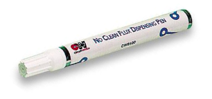
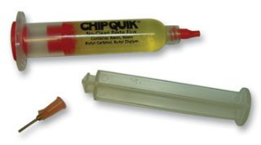
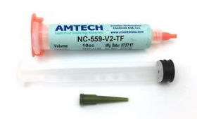
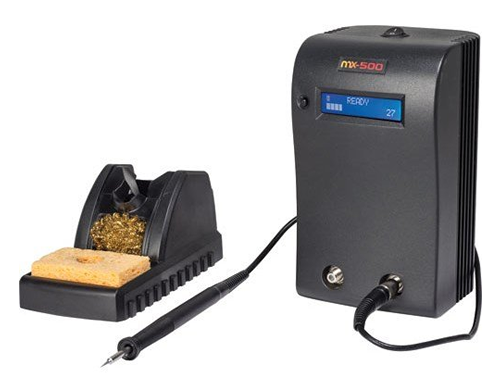
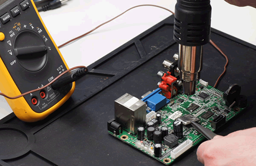

If you aren't soldering, you probably aren't testing IoT thoroughly | Pen Test Partners

# If you aren’t soldering, you probably aren’t testing IoT thoroughly

Andrew Tierney 08 Mar 2018

Testing IoT requires lots of different skills including (but not limited to) web app, mobile app, API, RF, source code/firmware analysis and hardware reverse engineering.

Testing hardware and extracting firmware is VERY likely to require soldering skills. Hence, if you don’t know how to solder, you probably aren’t testing IoT properly.

Here’s a 101 covering the many things I’ve learnt about soldering over the years whilst testing IoT hardware. I hope you find it useful.

### Safety

Solder can splash and spatter. It may go in your eyes. I have been soldering for 25 years and only once got any in my eyes enough to hurt. Wear eye protection if you feel you need it.

Solder and soldering is hot. Don’t hold the hot bits.

### Lead

Unless you eat or breathe it, lead is not so dangerous. Wash hands, don’t eat solder, don’t eat your lunch whilst soldering.

### Flux fumes

These are the bigger danger. Get a fume extractor. Do not breathe them in.

### Solder

Use leaded solder, even on lead free devices. It melts at much lower temperatures, is safer (as lead isn’t the primary risk), and is easier to see bad joints.

Use 60/40 leaded. 63/37 eutectic is OK but I find that it is harder to get good joints when tacking wires, and it makes it harder to detect when parts are about to come loose during desoldering.

Nearly all solder is “flux cored” i.e. there is flux in the middle. Most of the difference you will see in solder is down to the flux. This part from Loctite has a relatively active flux that is good for rework:

http://uk.farnell.com/multicore-loctite/609961/solder-wire-60-40-188-c-250g/dp/609961?CMP=i-ddd7-00001003

Mix leaded solder into lead free – the lead will bring down the melting point of the solder on the board.

I use two different thicknesses of solder – one 0.7mm and another 32awg. The thin one is only for very fine rework.

### Flux

Additional flux is recommended for many jobs. It helps the solder wet surfaces properly, cleans dirt away, keeps solder from bridging.

I use the following:

**CircuitWorks flux pen** – generally for cleaning up BGAs and soldering NAND/SPI flash using a drag tip.

http://uk.farnell.com/circuitworks/cw8100/dispensing-pen-flux-no-clean-9g/dp/130692?CMP=i-ddd7-00001003

**ChipQuick flux** – this is highly active and viscous, making solder form into globs. Great for desoldering.

http://uk.farnell.com/chip-quik/smd291/flux-syringe-10cc-no-clean/dp/1850216

**Amtech Tacky Flux** – I use it for nearly all SMT and BGA soldering. Getting hold of it here is hard – stuff on eBay and Amazon is often fake.

https://store.rossmanngroup.com/amtech-nc-559-v2-30-cc-16160.html
Keep flux off hands. It is an irritant and causes dermatitis.

Do not breathe flux fumes. Use a fume extractor if possible (or breathe at the right times if you’re feeling brave!)

### Tips

If using Metcal, you can’t change the temperature without changing the tip.

Metcal tips come in three temperatures called F (normal), T (temperature sensitive i.e. low temp) and C (ceramic i.e. high temp). Generally you only need F due to the way they regulate power.

If the Metcal display is showing high power usage (bar graph full all the time) and you can’t melt solder, you either don’t have enough contact or the tip is too small. Wet the tip or try a bigger tip.

The Metcal stand has magnets in it to quench the field in it, so it cools down. You don’t need to turn it on and off all of the time.

If using an adjustable iron, 370degC is the normal temperature. A bit lower for SMT, a bit higher for bigger stuff.

As you get better, generally you can tweak the temperature up a bit to speed up.

Tip shape is generally personal preference. Remember you need enough contact to transfer heat quickly. Generally, a chisel tip is best.

Choose a tip that is big enough to get the joint to working temp in under 2s. People often choose too small a tip.

When changing tips on the Metcal, power off, use the silicon mat to remove the tip and place it in the holder. Be cautious as stabbing yourself with a 300degC fine tip is very painful.

Never file or sand a tip.

If a tip is looking tarnished or dark, first try brass wool and solder. If this fails, plunge the tip into a pot of tip cleaner.

### Soldering

Make the sponge damp. Don’t do this in the kitchen sink over plates/utensils as you will transfer lead. Ideally use a wash bottle.

Clean the tip with brass wool first. This ensures all dirt is off. After this, use the sponge to clean the tip.

Don’t wipe the tip on the sponge too frequently as the repeated heating/cooling damages the tip.

Use helping hands, croc clips, hemostats, or blue tack to hold connectors etc. in place.

### For normal joints

Wet the tip (i.e. cover in solder).
Wipe excess solder off on sponge, or tap against stand.

Place tip against part to solder, wait a fraction of a second, introduce solder, add enough solder, remove tip and solder.

Leaded joints should be bright, shiny and concave.

### For tacking/bodging

Sometimes it is easier to place solder onto the test pad or component and then place the wire.

Sometimes it is easier to hold the wire in place and “load” the tip with solder first.

Experiment! Get some cheap boards and see what you can do.

### Desoldering

You will be surprised how much heat components can take before they are damaged.

Decide if you want to remount the component or re-use the rest of the device. We will take more care if we do.

Mask off anything you don’t want damaged. Use tinfoil and [Kapton tape](https://www.kaptontape.com/solder_wave_tapes.php) (the yellow transparent tape). Prime suspects for damage are plastic connectors, batteries, crystals.

There are five different methods that will work:

- **Soldering iron + desoldering tools **(either wick or desoldering pump). This is good for through-hole components, and generally for 8 and 16 PIN SOIC. Don’t be scared to add more solder to make lead-free into leaded, and to retain a bit of heat.
- **Soldering iron + ChipQuick **(solder that contains Bismuth and melts at 138degC). This is good for NAND flash and similar. Gets the melting point very low and lets you work the device with an iron.
- **Hot air tool**. Best for BGA. Preheat the board with ~180degC air keeping the tool moving. Change to 400degC and move it around the component you want off. Airflow should not be so fast as to blow small components off.

- **Toaster oven/heatgun**. Get the whole board hot and smack it on something hard to get all components off.

- **Retronix **– are great at rework and device removal. If it is fiddly or damaging the device will be expensive, get the professionals to do it. Better to spend a few £ getting rework done than risk trashing a board or component. http://www.retronix.com/.

After chips are desoldered, they often need cleaning. Use extra flux and solder wick. Careful not to damage pins or landing pads.

### Reballing

Some BGA devices will need reballing to be read in a socket.

For very small devices such as EMMC, this can be done with a lot of flux and solder – it will make the pads proud of the surface enough for a socket to work.

If you need to remount the part, it will certainly need reballing.

Currently I use [Retronix](http://www.retronix.com/) to do this as it’s often cheaper to outsource this type of work.

### Bodges

We often find ourselves wanting to monitor or inject lots of signals. You learn a lot of bodges!

30AWG Kynar wire is your friend here. There is lots in the lab. It is hard to strip – use a proper tool. I always strip both ends as there is nothing more frustrating than stripping one end, soldering it, and then ripping the pad off the board soldering the other end.

Some people swear by PTFE insulated magnet wire. This should be “stripped” by the heat of the soldering iron… I just can’t get comfy with it.

Test pads can often be soldered to. Dab small amount of solder onto the test pad, then join the wire.

It is often stronger to find a through-via and solder the wire to that. 30AWG should fit through most vias.

Empty through-hole connectors can be filled with pin headers. We have all of the common pitches available. At a push, you can just use the pins without the plastic carrier.

SMT pads for pin headers can be soldered to with normal pin headers – just use a bit more solder!

It is easy to tack wires onto 2.54mm pitch connectors/SMD. 1mm is fine for most people. 0.5mm is a bit of a push (but possible!).

You can also abrade the solder resist (green stuff) off the board and then solder to that. I just use a scalpel to remove it.

Use hot glue for strain relief. Do not cover the whole board as you will then find you need to access a trace under the glue. At a push, it can be removed with a heat-gun and patience.

**Be careful, but I hope you find the above useful when reversing IoT!**