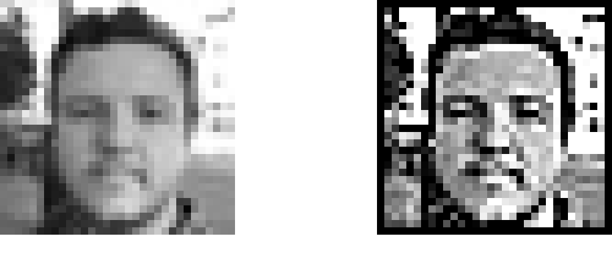
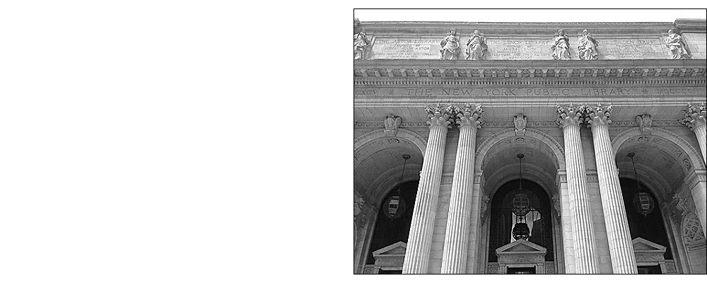

Image Kernels explained visually

[Back](http://setosa.io/ev/)

# Image Kernels

### Explained Visually

[**Tweet](https://twitter.com/intent/tweet?original_referer=http%3A%2F%2Fsetosa.io%2Fev%2Fimage-kernels%2F&ref_src=twsrc%5Etfw&text=Image%20Kernels%20explained%20visually&tw_p=tweetbutton&url=http%3A%2F%2Fsetosa.io%2Fev%2Fimage-kernels%2F&via=setosaio)

|     |     |
| --- | --- |
|     | [(L)](https://www.facebook.com/sharer/sharer.php?u=http%3A%2F%2Fsetosa.io%2Fev%2Fimage-kernels%2F&display=popup&ref=plugin&src=like&kid_directed_site=0) |

By [Victor Powell](http://twitter.com/vicapow)

An image kernel is a small matrix used to apply effects like the ones you might find in Photoshop or Gimp, such as blurring, sharpening, outlining or embossing. They're also used in machine learning for 'feature extraction', a technique for determining the most important portions of an image. In this context the process is referred to more generally as "convolution" (see: [convolutional neural networks](https://en.wikipedia.org/wiki/Convolutional_neural_network).)

To see how they work, let's start by inspecting a black and white image. The matrix on the left contains numbers, between 0 and 255, which each correspond to the brightness of one pixel in a picture of a face. The large, granulated picture has been blown up to make it easier to see; the last image is the "real" size.

 

Let's walk through applying the following 3x3** sharpen **kernel to the image of a face from above.

 0-10-15-10-10)(

Below, for each 3x3 block of pixels in the image on the left, we multiply each pixel by the corresponding entry of the kernel and then take the sum. That sum becomes a new pixel in the image on the right. Hover over a pixel on either image to see how its value is computed.

 kernel:input imageoutput image255254?255255?249255?× 0× -1× 0× -1× 5× -1× 0× -1× 0++++++++?=()

One subtlety of this process is what to do along the edges of the image. For example, the top left corner of the input image only has three neighbors. One way to fix this is to extend the edge values out by one in the original image while keeping our new image the same size. In this demo, we've instead ignored those values by making them black.

Here's a playground were you can select different kernel matrices and see how they effect the original image or build your own kernel. You can also upload your own image or use live video if your browser supports it.

 

The **sharpen** kernel emphasizes differences in adjacent pixel values. This makes the image look more vivid.

For more, have a look at Gimp's excellent documentation on using [Image kernel's](http://docs.gimp.org/en/plug-in-convmatrix.html). You can also apply your own custom filters in Photoshop by going to Filter -> Other -> Custom...

For more explanations, visit the Explained Visually [project homepage.](http://setosa.io/ev/)

Or subscribe to our mailing list.

[(L)](http://setosa.io/ev/image-kernels/#)Window size:  x
Viewport size:  x
[< 1 min to Spreed]()