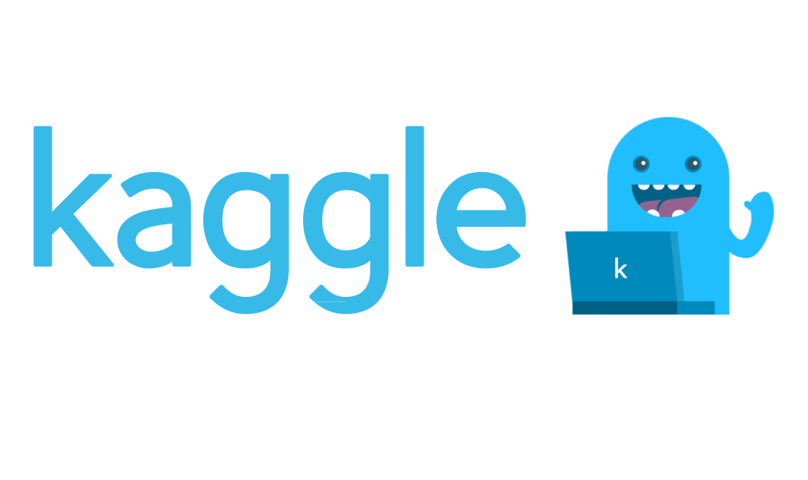
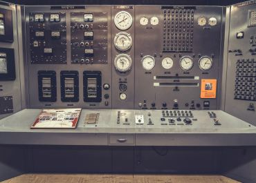

Image Segmentation: tips and tricks from 39 Kaggle competitions | Neptune Blog

# Image Segmentation: tips and tricks from 39 Kaggle competitions

Posted April 7, 2020

Imagine if you could get all the tips and tricks you need to hammer a Kaggle competition. I have gone over 39 Kaggle competitions including

- [Data Science Bowl 2017](https://www.kaggle.com/c/data-science-bowl-2017/) – $1,000,000
- [Intel & MobileODT Cervical Cancer Screening](https://www.kaggle.com/c/intel-mobileodt-cervical-cancer-screening) – $100,000
- [2018 Data Science Bowl](https://www.kaggle.com/c/data-science-bowl-2018)– $100,000
- [Airbus Ship Detection Challenge](https://www.kaggle.com/c/airbus-ship-detection)  – $60,000
- [Planet: Understanding the Amazon from Space](https://www.kaggle.com/c/planet-understanding-the-amazon-from-space) – $60,000
- [APTOS 2019 Blindness Detection](https://www.kaggle.com/c/aptos2019-blindness-detection) – $50,000
- [Human Protein Atlas Image Classification](https://www.kaggle.com/c/human-protein-atlas-image-classification) – $37,000
- [SIIM-ACR Pneumothorax Segmentation](https://www.kaggle.com/c/siim-acr-pneumothorax-segmentation) – $30,000
- [Inclusive Images Challenge](https://www.kaggle.com/c/inclusive-images-challenge) – $25,000

 – and extracted that knowledge for you. Dig in.

## Contents

 [External Data**](https://neptune.ai/blog/image-segmentation-tips-and-tricks-from-kaggle-competitions#external-data)

 [Preprocessing**](https://neptune.ai/blog/image-segmentation-tips-and-tricks-from-kaggle-competitions#preprocessing)

 [Data Augmentations**](https://neptune.ai/blog/image-segmentation-tips-and-tricks-from-kaggle-competitions#data-augmentations)

 [Modeling**](https://neptune.ai/blog/image-segmentation-tips-and-tricks-from-kaggle-competitions#modeling)

 [Hardware Setups**](https://neptune.ai/blog/image-segmentation-tips-and-tricks-from-kaggle-competitions#hardware-setups)

 [Loss Functions**](https://neptune.ai/blog/image-segmentation-tips-and-tricks-from-kaggle-competitions#loss-functions)

 [Training Tips**](https://neptune.ai/blog/image-segmentation-tips-and-tricks-from-kaggle-competitions#training-tips)

 [Evaluation and Cross-validation**](https://neptune.ai/blog/image-segmentation-tips-and-tricks-from-kaggle-competitions#evaluation-cross-validation)

 [Ensembling Methods**](https://neptune.ai/blog/image-segmentation-tips-and-tricks-from-kaggle-competitions#ensembling-methods)

 [Post Processing**](https://neptune.ai/blog/image-segmentation-tips-and-tricks-from-kaggle-competitions#post-processing)

## **External Data**

- Use of the[(L)](https://luna16.grand-challenge.org/)[LUng Node Analysis Grand Challenge](https://luna16.grand-challenge.org/) data because it contains detailed annotations from radiologists
- Use of the[(L)](https://wiki.cancerimagingarchive.net/display/Public/LIDC-IDRI)[LIDC-IDRI](https://wiki.cancerimagingarchive.net/display/Public/LIDC-IDRI) data because it had radiologist descriptions of each tumor that they found
- Use [Flickr CC](https://www.flickr.com/creativecommons/), [Wikipedia Commons datasets](https://commons.wikimedia.org/wiki/Publicly_available_global_data_sets)
- Use [Human Protein Atlas Dataset](https://www.proteinatlas.org/about/download)
- Use [IDRiD](https://www.mdpi.com/2306-5729/3/3/25) dataset

## **Data Exploration and Gaining insights**

- [Clustering of 3d segmentation](http://citeseerx.ist.psu.edu/viewdoc/download?doi=10.1.1.149.2721&rep=rep1&type=pdf) with the 0.5 threshold
- Identify if there is a [substantial difference in train/test label distributions](https://www.kaggle.com/c/inclusive-images-challenge/discussion/72450#433005)

## **Preprocessing**

- Perform blob Detection using the[(L)](https://en.wikipedia.org/wiki/Blob_detection#The_difference_of_Gaussians_approach)[Difference of Gaussian (DoG) method](https://en.wikipedia.org/wiki/Blob_detection#The_difference_of_Gaussians_approach). Used the implementation available in [skimage](https://scikit-image.org/) package.
- Use of [patch-based inputs for training](https://www.mdpi.com/2072-4292/11/2/114/pdf-vor)in order to reduce the time of training
- Use [cudf](https://github.com/rapidsai/cudf) for loading data instead of [Pandas](https://towardsdatascience.com/a-quick-introduction-to-the-pandas-python-library-f1b678f34673) because it has a faster reader
- Ensure that all the images have the[same orientation](https://github.com/albumentations-team/albumentations)
- Apply contrast limited adaptive [histogram equalization](https://towardsdatascience.com/histogram-equalization-5d1013626e64)
- Use [OpenCV](https://docs.opencv.org/master/d9/df8/tutorial_root.html) for all general image preprocessing
- Employ [automatic active learning](https://towardsdatascience.com/review-suggestive-annotation-deep-active-learning-framework-biomedical-image-segmentation-e08e4b931ea6) and adding manual annotations
- [Resize all images to the same resolution](https://github.com/albumentations-team/albumentations) in order to apply the same model to scans of different thicknesses
- [Convert scan images](https://github.com/albumentations-team/albumentations) into normalized 3D numpy arrays
- Apply single[Image Haze Removal](http://kaiminghe.com/) using Dark Channel Prior
- Convert all data to[(L)](https://www.ncbi.nlm.nih.gov/books/NBK547721/)[Hounsfield units](https://www.ncbi.nlm.nih.gov/books/NBK547721/)
- Find duplicate images using [pair-wise correlation on RGBY](https://www.kaggle.com/c/human-protein-atlas-image-classification/discussion/77269#583768)
- Make labels more balanced by[(L)](https://www.sebastiansylvan.com/post/importancesampling/)[developing a sampler](https://www.sebastiansylvan.com/post/importancesampling/)
- Apply p[seudo labeling](https://towardsdatascience.com/pseudo-labeling-to-deal-with-small-datasets-what-why-how-fd6f903213af)to test data in order [to](https://www.analyticsvidhya.com/blog/2017/09/pseudo-labelling-semi-supervised-learning-technique/)  [improve score](https://arxiv.org/abs/1908.02983)
- [Scale down images/masks to 320×480](https://github.com/albumentations-team/albumentations)
- [Histogram equalization](https://towardsdatascience.com/histogram-equalization-5d1013626e64) (CLAHE) with kernel size 32×32
- Convert [DCM to PNG](https://www.kaggle.com/c/siim-acr-pneumothorax-segmentation/discussion/97120#560788)
- Calculate the [md5 hash for each image](https://www.kaggle.com/c/cdiscount-image-classification-challenge/discussion/45798) when there are duplicate images

## **Data Augmentations**

- Use[(L)](https://github.com/albu/albumentations)[albumentations](https://github.com/albu/albumentations) package for augmentations
- Apply random[rotation by 90 degrees](https://github.com/albu/albumentations)
- Use h[orizontal, vertical or both flips](https://github.com/albu/albumentations)
- Attempt [heavy geometric transformations](https://www.kaggle.com/c/data-science-bowl-2018/discussion/54741#477226): Elastic Transform, Perspective

Transform, Piecewise Affine transforms, pincushion distortion

- Apply [random HSV](https://www.kaggle.com/c/data-science-bowl-2018/discussion/54741#477226)
- Use of [loss-less augmentation](http://juliandewit.github.io/kaggle-ndsb2017/)for generalization to prevent loss of useful image information
- Apply [channel shuffling](https://www.kaggle.com/c/data-science-bowl-2018/discussion/54741#477226)
- Do [data augmentation](https://www.kdnuggets.com/2018/05/data-augmentation-deep-learning-limited-data.html) based on class [frequency](https://towardsdatascience.com/deep-learning-unbalanced-training-data-solve-it-like-this-6c528e9efea6)
- Apply [gaussian noise](https://www.kaggle.com/c/data-science-bowl-2018/discussion/54741#477226)
- Use[(L)](https://en.wikipedia.org/wiki/Octahedral_symmetry#The_isometries_of_the_cube)[lossless permutations of 3D images](https://en.wikipedia.org/wiki/Octahedral_symmetry#The_isometries_of_the_cube) for data augmentation
- [Rotate](https://github.com/albumentations-team/albumentations) by a random angle from 0 to 45 degrees
- [Scale](https://github.com/albumentations-team/albumentations) by a random factor from 0.8 to 1.2
- [Brightness](https://github.com/albumentations-team/albumentations) changing
- Randomly change [hue, saturation and value](https://github.com/albumentations-team/albumentations)
- Apply [D4](https://en.wikipedia.org/wiki/Dihedral_group) augmentations
- Contrast limited adaptive [histogram equalization](https://towardsdatascience.com/histogram-equalization-5d1013626e64)
- Use the [AutoAugment](https://arxiv.org/pdf/1805.09501.pdf)   augmentation strategy

## **Modeling**

### **Architectures**

- Use of a[(L)](https://arxiv.org/abs/1505.04597)[U-net](https://arxiv.org/abs/1505.04597) based architecture. Adopted the concepts and applied them to 3D input tensors
- Employing automatic active learning and adding [manual annotations](https://medium.com/dataturks/manually-annotated-open-datasets-5cea7b1e5890)
- The[(L)](https://research.googleblog.com/2016/08/improving-inception-and-image.html)[inception-ResNet v2 architecture](https://research.googleblog.com/2016/08/improving-inception-and-image.html) for training features with different receptive fields
- [Siamese networks](https://www.cs.cmu.edu/~rsalakhu/papers/oneshot1.pdf) with adversarial training
- [*ResNet50*](https://towardsdatascience.com/understanding-and-coding-a-resnet-in-keras-446d7ff84d33), [*Xception*](https://arxiv.org/abs/1610.02357), [*Inception ResNet *](https://arxiv.org/abs/1602.07261)*v2* x 5 with Dense (FC) layer as the final layer
- Use of a [global max-pooling layer](https://keras.io/layers/pooling/) which returns a fixed-length output no matter the input size
- Use of [stacked dilated convolutions](https://arxiv.org/abs/1904.03076)
- [VoxelNet](https://arxiv.org/abs/1711.06396)
- Replace plus sign in [LinkNet](https://arxiv.org/abs/1707.03718)  [skip connections](https://arxiv.org/pdf/1912.05074.pdf)with concat and conv1x1
- [Generalized mean pooling](https://arxiv.org/pdf/1711.02512.pdf)
- Keras [NASNetLarge](https://www.tensorflow.org/api_docs/python/tf/keras/applications/NASNetLarge) to train the model from scratch using 224x224x3
- Use of the [3D convnet](https://towardsdatascience.com/understanding-1d-and-3d-convolution-neural-network-keras-9d8f76e29610) to slide over the images
- Imagenet-pre-trained [ResNet152](https://towardsdatascience.com/review-resnet-winner-of-ilsvrc-2015-image-classification-localization-detection-e39402bfa5d8) as the feature extractor
- [Replace the final fully-connected layers of ResNet by 3 fully connected layers with dropout](https://www.kaggle.com/c/planet-understanding-the-amazon-from-space/discussion/36887#207397)
- Use [ConvTranspose](https://www.kaggle.com/c/siim-acr-pneumothorax-segmentation/discussion/107518#619543) in the decoder
- Applying the [VGG baseline architecture](https://medium.com/analytics-vidhya/cnns-architectures-lenet-alexnet-vgg-googlenet-resnet-and-more-666091488df5)
- Implementing the[(L)](http://vlg.cs.dartmouth.edu/c3d/)[C3D](http://vlg.cs.dartmouth.edu/c3d/) network with adjusted receptive fields and a 64 unit bottleneck layer on the end of the network
- Use of [UNet](https://towardsdatascience.com/understanding-semantic-segmentation-with-unet-6be4f42d4b47) type architectures with pre-trained weights to improve convergence and performance of binary segmentation on 8-bit RGB input images
- [LinkNet](https://arxiv.org/abs/1707.03718) since it’s fast and memory efficient
- [MASKRCNN](https://github.com/matterport/Mask_RCNN)
- [BN-Inception](https://github.com/microsoft/CNTK/tree/master/Examples/Image/Classification/GoogLeNet/BN-Inception)
- [Fast Point R-CNN](https://arxiv.org/abs/1908.02990)
- [Seresnext](https://github.com/osmr/imgclsmob/blob/master/pytorch/pytorchcv/models/seresnext.py)
- [UNet](https://towardsdatascience.com/understanding-semantic-segmentation-with-unet-6be4f42d4b47) and [Deeplabv3](https://arxiv.org/abs/1706.05587)
- [Faster RCNN](https://arxiv.org/abs/1506.01497)
- [SENet154](https://paperswithcode.com/paper/squeeze-and-excitation-networks)
- [ResNet152](https://www.kaggle.com/pytorch/resnet152)
- [NASNet-A-Large](https://arxiv.org/pdf/1707.07012.pdf)
- [EfficientNetB4](https://www.kaggle.com/c/siim-acr-pneumothorax-segmentation/discussion/107795#619987)
- [ResNet101](https://www.kaggle.com/pytorch/resnet101)
- [*GAPNet*](https://www.groundai.com/project/gapnet-graph-attention-based-point-neural-network-for-exploiting-local-feature-of-point-cloud/1)
- [PNASNet-5-Large](https://arxiv.org/pdf/1712.00559.pdf)
- [Densenet121](https://www.kaggle.com/pytorch/densenet121)
- [AC-GAN](https://machinelearningmastery.com/how-to-develop-an-auxiliary-classifier-gan-ac-gan-from-scratch-with-keras/)
- [XceptionNet (96), XceptionNet (299), Inception v3 (139), InceptionResNet v2 (299), DenseNet121 (224)](https://www.kaggle.com/c/sp-society-camera-model-identification/discussion/49602#282979)
- [AlbuNet (resnet34)](https://www.kaggle.com/c/siim-acr-pneumothorax-segmentation/discussion/107824#650999) from[(L)](https://github.com/ternaus/TernausNet)[ternausnets](https://github.com/ternaus/TernausNet)
- [SpaceNet](https://medium.com/the-downlinq/a-deep-dive-into-the-spacenet-4-winning-algorithms-8d611a5dfe25)
- [Resnet50](https://www.kaggle.com/c/siim-acr-pneumothorax-segmentation/discussion/107824#650999) from[(L)](https://github.com/SpaceNetChallenge/SpaceNet_Off_Nadir_Solutions/tree/master/selim_sef/zoo)[selim_sef SpaceNet 4](https://github.com/SpaceNetChallenge/SpaceNet_Off_Nadir_Solutions/tree/master/selim_sef/zoo)
- [SCSEUnet (seresnext50)](https://www.kaggle.com/c/siim-acr-pneumothorax-segmentation/discussion/107824) from[(L)](https://github.com/SpaceNetChallenge/SpaceNet_Off_Nadir_Solutions/tree/master/selim_sef/zoo)[selim_sef SpaceNet 4](https://github.com/SpaceNetChallenge/SpaceNet_Off_Nadir_Solutions/tree/master/selim_sef/zoo)
- A custom [Unet and Linknet](https://www.kaggle.com/c/data-science-bowl-2018/discussion/54835#320935)[architecture](https://www.kaggle.com/c/data-science-bowl-2018/discussion/54835#320935)
- [FPNetResNet50 (5 folds)](https://www.kaggle.com/c/siim-acr-pneumothorax-segmentation/discussion/107872)
- [FPNetResNet101 (5 folds)](https://www.kaggle.com/c/siim-acr-pneumothorax-segmentation/discussion/107872)
- [FPNetResNet101 (7 folds with different seeds)](https://www.kaggle.com/c/siim-acr-pneumothorax-segmentation/discussion/107872)
- [PANetDilatedResNet34 (4 folds)](https://www.kaggle.com/c/siim-acr-pneumothorax-segmentation/discussion/107872)
- [PANetResNet50 (4 folds)](https://www.kaggle.com/c/siim-acr-pneumothorax-segmentation/discussion/107872)
- [EMANetResNet101 (2 folds)](https://www.kaggle.com/c/siim-acr-pneumothorax-segmentation/discussion/107872)
- [RetinaNet](https://github.com/fizyr/keras-retinanet)
- [Deformable R-FCN](https://github.com/msracver/Deformable-ConvNets)
- [Deformable Relation Networks](https://github.com/msracver/Relation-Networks-for-Object-Detection)

### **Hardware Setups**

- [Use of the AWS GPU instance p2.xlarge with a NVIDIA K80 GPU](https://www.kaggle.com/c/cdiscount-image-classification-challenge/discussion/45724)
- [Pascal Titan-X GPU](https://www.kaggle.com/c/cdiscount-image-classification-challenge/discussion/45724)
- [Use of 8 TITAN X GPUs](https://www.kaggle.com/c/carvana-image-masking-challenge/discussion/40121#226179)
- [6 GPUs: 2](https://www.kaggle.com/c/carvana-image-masking-challenge/discussion/40121#226179)[*1080Ti + 4*](https://www.kaggle.com/c/carvana-image-masking-challenge/discussion/40121#226179)[1080](https://www.kaggle.com/c/carvana-image-masking-challenge/discussion/40121#226179)
- [Server with 8×NVIDIA Tesla P40, 256 GB RAM and 28 CPU cores](https://www.kaggle.com/c/cdiscount-image-classification-challenge/discussion/45724)
- [Intel Core i7 5930k, 2×1080, 64 GB of RAM, 2x512GB SSD, 3TB HDD](https://www.kaggle.com/c/cdiscount-image-classification-challenge/discussion/45850)
- [GCP 1x P100, 8x CPU, 15 GB RAM, SSD or 2x P100, 16x CPU, 30 GB RAM](https://www.kaggle.com/c/inclusive-images-challenge/discussion/72450)
- [NVIDIA Tesla P100 GPU with 16GB of RAM](https://www.kaggle.com/c/sp-society-camera-model-identification/discussion/49602)
- [Intel Core i7 5930k, 2×1080, 64 GB of RAM, 2x512GB SSD, 3TB HDD](https://www.kaggle.com/c/cdiscount-image-classification-challenge/discussion/45850)
- [980Ti GPU, 2600k CPU, and 14GB RAM](https://www.kaggle.com/c/human-protein-atlas-image-classification/discussion/77325)

### **Loss Functions**

- [Dice Coefficient](https://towardsdatascience.com/metrics-to-evaluate-your-semantic-segmentation-model-6bcb99639aa2)because it works well with imbalanced data
- [Weighted boundary loss](https://www.kaggle.com/lyakaap/weighing-boundary-pixels-loss-script-by-keras2) whose aim is to reduce the distance between the predicted segmentation and the ground truth
- [MultiLabelSoftMarginLoss](https://pytorch.org/docs/stable/nn.html?highlight=multilabelsoftmarginloss#torch.nn.MultiLabelSoftMarginLoss) that creates a criterion that optimizes a multi-label one-versus-all loss based on max-entropy, between input  and target
- Balanced cross entropy (BCE)[with logit loss](https://www.kaggle.com/c/siim-acr-pneumothorax-segmentation/discussion/101429) that involves weighing the positive and negative examples by a certain coefficient
- [Lovasz](https://www.kaggle.com/c/siim-acr-pneumothorax-segmentation/discussion/107981) that performs direct optimization of the mean intersection-over-union loss in neural networks based on the convex Lovasz extension of sub-modular losses
- [FocalLoss + Lovasz](https://www.kaggle.com/c/siim-acr-pneumothorax-segmentation/discussion/107687) obtained by summing the Focal and Lovasz losses
- [Arc margin loss](https://arxiv.org/abs/1801.07698) that incorporates margin in order to maximise face class separability
- [Npairs loss](https://www.tensorflow.org/addons/api_docs/python/tfa/losses/npairs_loss) that computes the npairs loss between y_true and y_pred.
- A combination of [BCE and Dice loss](https://www.kaggle.com/c/carvana-image-masking-challenge/discussion/40199) functions
- [LSEP](https://arxiv.org/pdf/1704.03135.pdf) – a pairwise ranking that is is smooth everywhere and thus is easier to optimize
- [Center loss](https://ydwen.github.io/papers/WenECCV16.pdf) that simultaneously learns a center for deep features of each class and penalizes the distances between the deep features and their corresponding class centers
- [Ring Loss](https://arxiv.org/abs/1803.00130) that augments standard loss functions such as Softmax
- [Hard triplet loss](https://www.tensorflow.org/addons/tutorials/losses_triplet) that trains a network to embed features of the same class at the same time maximizing the embedding distance of different classes
- [*1 + BCE – Dice*](https://www.kaggle.com/c/siim-acr-pneumothorax-segmentation/discussion/107687) that involves subtracting the BCE and DICE losses then adding 1
- [Binary cross-entropy –  log(dice)](https://www.kaggle.com/c/carvana-image-masking-challenge/discussion/40144) that is the binary cross-entropy minus the log of the dice loss
- [Combinations](https://github.com/SpaceNetChallenge/SpaceNet_Off_Nadir_Solutions/blob/master/selim_sef/training/losses.py) of BCE, dice and focal
- [Lovasz Loss](https://www.kaggle.com/c/siim-acr-pneumothorax-segmentation/discussion/107981) that  loss performs direct optimization of the mean intersection-over-union loss
- [BCE + DICE](https://www.kaggle.com/c/siim-acr-pneumothorax-segmentation/discussion/107795#619987) -Dice loss is  obtained by calculating smooth dice coefficient function
- [Focal loss with Gamma 2](https://www.kaggle.com/c/human-protein-atlas-image-classification/discussion/77320) that is an improvement to the standard cross-entropy criterion
- [BCE + DICE + Focal](https://www.kaggle.com/c/siim-acr-pneumothorax-segmentation/discussion/107546) – this is basically a summation of the three loss functions
- [Active Contour Loss](https://www.kaggle.com/c/siim-acr-pneumothorax-segmentation/discussion/107981) that incorporates the area and size information and integrates the information in a dense deep learning model
- [1024 * BCE(results, masks) + BCE(cls, cls_target)](https://www.kaggle.com/c/siim-acr-pneumothorax-segmentation/discussion/107603)
- [Focal + kappa](https://www.kaggle.com/c/aptos2019-blindness-detection/discussion/108058) – Kappa is a loss function for multi-class classification of ordinal data in deep learning. In this case we sum it and the focal loss
- [ArcFaceLoss](https://arxiv.org/pdf/1801.07698v1.pdf) — Additive Angular Margin Loss for Deep Face Recognition
- s[oft Dice trained on positives only](https://www.kaggle.com/c/siim-acr-pneumothorax-segmentation/discussion/107522) – Soft Dice uses predicted probabilities
- [2.7 * BCE(pred_mask, gt_mask) + 0.9 * DICE(pred_mask, gt_mask) + 0.1 * BCE(pred_empty, gt_empty)](https://www.kaggle.com/c/siim-acr-pneumothorax-segmentation/discussion/108397) which is a custom loss used by the Kaggler
- [*nn.SmoothL1Loss()*](https://www.kaggle.com/c/aptos2019-blindness-detection/discussion/108065)*  *that creates a criterion that uses a squared term if the absolute element-wise error falls below 1 and an L1 term otherwise
- Use of the [Mean Squared Error objective function](https://towardsdatascience.com/why-using-mean-squared-error-mse-cost-function-for-binary-classification-is-a-bad-idea-933089e90df7) in scenarios where it seems to work better than [binary-cross entropy objective function](https://machinelearningmastery.com/cross-entropy-for-machine-learning/).

### **Training tips**

- [Try different learning rates](https://machinelearningmastery.com/learning-rate-for-deep-learning-neural-networks/)
- [Try different batch sizes](https://machinelearningmastery.com/use-different-batch-sizes-training-predicting-python-keras/)
- Use [SDG with momentum with manual rate scheduling](https://www.kaggle.com/c/carvana-image-masking-challenge/discussion/38125#213920)
- Too much [augmentation](https://medium.com/secure-and-private-ai-writing-challenge/data-augmentation-increases-accuracy-of-your-model-but-how-aa1913468722) will reduce the accuracy
- Train on image [crops and predict](https://www.kaggle.com/c/understanding_cloud_organization/discussion/115115) on full images
- Use of Keras’s [ReduceLROnPlateau()](https://www.kaggle.com/c/bengaliai-cv19/discussion/135998) to the learning rate
- Train [without augmentation until plateau](https://www.kaggle.com/c/inclusive-images-challenge/discussion/72450) then apply soft and hard augmentation to some epochs
- [Freeze all layers except the](https://www.kaggle.com/c/tgs-salt-identification-challenge/discussion/65763) last one and use 1000 images from [Stage1 for tuning](https://www.kaggle.com/c/quickdraw-doodle-recognition/discussion/72892)
- Make labels more balanced by[(L)](https://www.sebastiansylvan.com/post/importancesampling/)[developing a sampler](https://www.sebastiansylvan.com/post/importancesampling/)
- Use of [class aware sampling](https://www.kaggle.com/c/sp-society-camera-model-identification/discussion/49314)
- Use dropout and augmentation while tuning the last layer
- [Pseudo Labeling](https://www.kaggle.com/c/carvana-image-masking-challenge/discussion/38298) to improve score
- Use [Adam reducing LR on plateau with patience 2–4](https://www.kaggle.com/c/sp-society-camera-model-identification/discussion/49299)
- Use [Cyclic LR with SGD](https://www.kaggle.com/c/sp-society-camera-model-identification/discussion/49299)
- Reduce the [learning rate](https://machinelearningmastery.com/understand-the-dynamics-of-learning-rate-on-deep-learning-neural-networks/)by a factor of two if validation loss does not improve for two consecutive epochs
- Repeat the [worst batch out](https://medium.com/kaggle-blog/carvana-image-masking-challenge-1st-place-winners-interview-78fcc5c887a8) of 10 batches
- [Train with default UNET](https://www.kaggle.com/c/carvana-image-masking-challenge/discussion/40126)
- [Overlap tiles](https://www.kaggle.com/c/carvana-image-masking-challenge/discussion/40126) so that each edge pixel is covered twice
- [Hyperparameter tuning: learning rate on training, non-maximum suppression and score threshold on inference](https://www.kaggle.com/c/rsna-pneumonia-detection-challenge/discussion/71022)
- [Remove low bounding box](https://www.kaggle.com/c/rsna-pneumonia-detection-challenge/discussion/70505) with low confidence score
- Train different [convolutional neural networks](https://machinelearningmastery.com/ensemble-methods-for-deep-learning-neural-networks/) then build an ensemble
- Stop [training when the F1 score](https://www.kaggle.com/c/human-protein-atlas-image-classification/discussion/77320) is decreasing
- [Differential learning rate](https://blog.slavv.com/differential-learning-rates-59eff5209a4f) with gradual reducing
- Train ANNs in [a stacking way using](https://www.kaggle.com/c/statoil-iceberg-classifier-challenge/discussion/48207) 5 folds and 30 repeats
- Track of your experiments using[(L)](https://docs.neptune.ml/)[Neptune](https://docs.neptune.ml/).

## **Evaluation and cross-validation**

- Split on [non-uniform stratified](https://www.kaggle.com/c/inclusive-images-challenge/discussion/71433) by classes
- Avoid [overfitting](https://elitedatascience.com/overfitting-in-machine-learning) by applying [cross-validation](https://machinelearningmastery.com/early-stopping-to-avoid-overtraining-neural-network-models/) while [tuning](https://machinelearningmastery.com/introduction-to-regularization-to-reduce-overfitting-and-improve-generalization-error/) the last layer
- [10-fold CV ensemble for classification](https://www.kaggle.com/c/rsna-pneumonia-detection-challenge/discussion/70421)
- Combination [of 5 10-fold CV](https://www.kaggle.com/c/rsna-pneumonia-detection-challenge/discussion/70421) ensembles for detection
- Sklearn’s[stratified K fold function](http://scikit-learn.org/stable/modules/generated/sklearn.model_selection.StratifiedKFold.html)
- 5 [KFold Cross-Validation](https://machinelearningmastery.com/k-fold-cross-validation/)
- Adversarial [Validation & Weighting](https://www.kaggle.com/c/PLAsTiCC-2018/discussion/75011)

## **Ensembling methods**

- Use simple [majority voting](https://www.kaggle.com/c/human-protein-atlas-image-classification/discussion/77256) for ensemble
- [XGBoost](https://www.analyticsvidhya.com/blog/2017/06/which-algorithm-takes-the-crown-light-gbm-vs-xgboost/) on the [max malignancy at 3 zoom levels,](https://www.kaggle.com/c/data-science-bowl-2017/discussion/31551) the z-location and the [amount of strange tissue](https://www.kaggle.com/c/statoil-iceberg-classifier-challenge/discussion/48207)
- [LightGBM](https://www.analyticsvidhya.com/blog/2017/06/which-algorithm-takes-the-crown-light-gbm-vs-xgboost/)  for models [with too many](https://www.kaggle.com/c/quickdraw-doodle-recognition/discussion/73738) classes. This was done for raw data features only.
- [CatBoost](https://www.analyticsvidhya.com/blog/2017/08/catboost-automated-categorical-data/) for [a second-layer model](https://www.kaggle.com/c/cdiscount-image-classification-challenge/discussion/45733)
- Training with 7 features for the [gradient boosting classifier](https://machinelearningmastery.com/gentle-introduction-gradient-boosting-algorithm-machine-learning/)
- Use[‘curriculum learning’](https://arxiv.org/abs/1904.03626) to speed up model training. In this technique, models are first trained on simple samples then progressively moving to hard ones.
- Ensemble with [ResNet50, InceptionV3, and InceptionResNetV2](https://www.kaggle.com/c/inclusive-images-challenge/discussion/72450)
- [Ensemble method](https://github.com/ahrnbom/ensemble-objdet) for object detection
- An ensemble of [Mask RCNN](https://www.analyticsvidhya.com/blog/2019/07/computer-vision-implementing-mask-r-cnn-image-segmentation/), [YOLOv3](https://machinelearningmastery.com/how-to-perform-object-detection-with-yolov3-in-keras/), and [Faster RCNN](https://towardsdatascience.com/faster-r-cnn-for-object-detection-a-technical-summary-474c5b857b46)architectures n with a classification network — [DenseNet-121](https://towardsdatascience.com/understanding-and-visualizing-densenets-7f688092391a) architecture

## **Post Processing**

- Apply [test time augmentation ](https://towardsdatascience.com/test-time-augmentation-tta-and-how-to-perform-it-with-keras-4ac19b67fb4d)— presenting an image to a model several times with different random transformations and average the predictions you get
- Equalize test prediction [probabilities](https://machinelearningmastery.com/probability-metrics-for-imbalanced-classification/) instead of only using predicted classes
- Apply [geometric mean](https://machinelearningmastery.com/arithmetic-geometric-and-harmonic-means-for-machine-learning/) to the [predictions](https://medium.com/@flawnsontong1/what-is-geometric-deep-learning-b2adb662d91d)
- [Overlap tiles during inferencing so that each edge pixel](https://www.kaggle.com/c/carvana-image-masking-challenge/discussion/40126) is covered at least thrice because UNET tends to have bad predictions around edge areas.
- [Non-maximum suppression](https://www.kaggle.com/c/rsna-pneumonia-detection-challenge/discussion/70632) and bounding box shrinkage
- [Watershed post processing](https://www.kaggle.com/c/data-science-bowl-2018/discussion/54741) to detach objects in instance segmentation problems.

## **Final Thoughts**

Hopefully, this article gave you some background into image segmentation tips and tricks and given you some tools and frameworks that you can use to start competing.

We’ve covered tips on:

- architectures
- training tricks,
- losses,
- pre-processing,
- post processing
- ensembling
- tools and frameworks.

If you want to go deeper down the rabbit hole, simply follow the links and see how the best image segmentation models are built.

Happy segmenting!

### [Derrick Mwiti](https://www.linkedin.com/in/mwitiderrick/)

Data Scientist

* * *

···
**Neptune is the most lightweight experiment tracking tool**

- Metrics and results
- Hyperparameters
- Charts and visualizations
- Data versions
- Model binaries
- Notebook checkpoints

[Create your FREE account](https://neptune.ai/register)

## Other Articles You May Want to Read

 

### 15 Best Tools for Tracking Machine Learning Experiments

Pawel Kijko

April 07, 2020

 

### Exploratory Data Analysis for Natural Language Processing: A Complete Guide to Python Tools

Jakub Czakon

April 07, 2020

 

### Experiment Management: How to Organize Your Model Development Process

Jakub Czakon

April 07, 2020