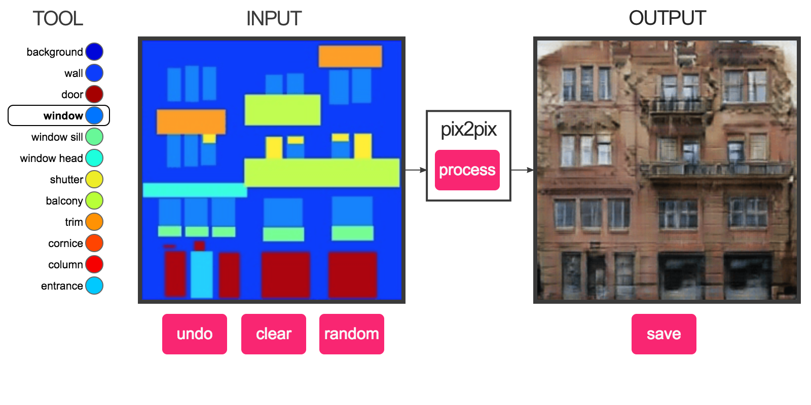
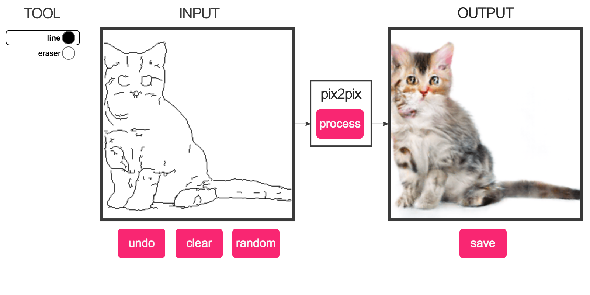
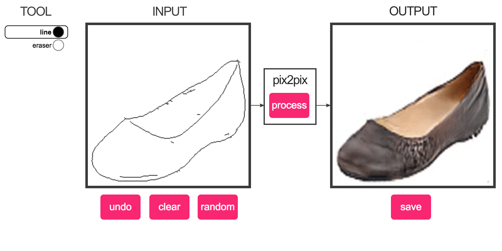
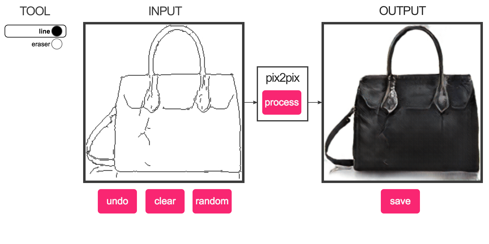

Image-to-Image Demo - Affine Layer

[![](data:image/svg+xml,%3C%3Fxml version%3D%221.0%22 encoding%3D%22UTF-8%22 standalone%3D%22no%22%3F%3E%0A%3Csvg width%3D%22100px%22 height%3D%22100px%22 viewBox%3D%220 0 100 100%22 version%3D%221.1%22 xmlns%3D%22http%3A%2F%2Fwww.w3.org%2F2000%2Fsvg%22 xmlns%3Axlink%3D%22http%3A%2F%2Fwww.w3.org%2F1999%2Fxlink%22%3E%0A    %3C%21-- Generator%3A Sketch 42 %2836781%29 - http%3A%2F%2Fwww.bohemiancoding.com%2Fsketch --%3E%0A    %3Ctitle%3Elogo%3C%2Ftitle%3E%0A    %3Cdesc%3ECreated with Sketch.%3C%2Fdesc%3E%0A    %3Cdefs%3E%0A        %3Crect id%3D%22path-1%22 x%3D%2215%22 y%3D%2215%22 width%3D%2235%22 height%3D%2236%22%3E%3C%2Frect%3E%0A        %3Cmask id%3D%22mask-2%22 maskContentUnits%3D%22userSpaceOnUse%22 maskUnits%3D%22objectBoundingBox%22 x%3D%220%22 y%3D%220%22 width%3D%2235%22 height%3D%2236%22 fill%3D%22white%22%3E%0A            %3Cuse xlink%3Ahref%3D%22%23path-1%22%3E%3C%2Fuse%3E%0A        %3C%2Fmask%3E%0A        %3Cellipse id%3D%22path-3%22 cx%3D%2215.1507839%22 cy%3D%2249.0755757%22 rx%3D%2215.0944915%22 ry%3D%2215.0944915%22%3E%3C%2Fellipse%3E%0A        %3Cmask id%3D%22mask-4%22 maskContentUnits%3D%22userSpaceOnUse%22 maskUnits%3D%22objectBoundingBox%22 x%3D%220%22 y%3D%220%22 width%3D%2230.188983%22 height%3D%2230.188983%22 fill%3D%22white%22%3E%0A            %3Cuse xlink%3Ahref%3D%22%23path-3%22%3E%3C%2Fuse%3E%0A        %3C%2Fmask%3E%0A        %3Cellipse id%3D%22path-5%22 cx%3D%2248.8492161%22 cy%3D%2215.3771436%22 rx%3D%2215.0944915%22 ry%3D%2215.0944915%22%3E%3C%2Fellipse%3E%0A        %3Cmask id%3D%22mask-6%22 maskContentUnits%3D%22userSpaceOnUse%22 maskUnits%3D%22objectBoundingBox%22 x%3D%220%22 y%3D%220%22 width%3D%2230.188983%22 height%3D%2230.188983%22 fill%3D%22white%22%3E%0A            %3Cuse xlink%3Ahref%3D%22%23path-5%22%3E%3C%2Fuse%3E%0A        %3C%2Fmask%3E%0A        %3Cellipse id%3D%22path-7%22 cx%3D%2248.8492161%22 cy%3D%2249.0900343%22 rx%3D%2215.0944915%22 ry%3D%2215.0944915%22%3E%3C%2Fellipse%3E%0A        %3Cmask id%3D%22mask-8%22 maskContentUnits%3D%22userSpaceOnUse%22 maskUnits%3D%22objectBoundingBox%22 x%3D%220%22 y%3D%220%22 width%3D%2230.188983%22 height%3D%2230.188983%22 fill%3D%22white%22%3E%0A            %3Cuse xlink%3Ahref%3D%22%23path-7%22%3E%3C%2Fuse%3E%0A        %3C%2Fmask%3E%0A        %3Cellipse id%3D%22path-9%22 cx%3D%2215.3980442%22 cy%3D%2215.3771436%22 rx%3D%2215.0944915%22 ry%3D%2215.0944915%22%3E%3C%2Fellipse%3E%0A        %3Cmask id%3D%22mask-10%22 maskContentUnits%3D%22userSpaceOnUse%22 maskUnits%3D%22objectBoundingBox%22 x%3D%220%22 y%3D%220%22 width%3D%2230.188983%22 height%3D%2230.188983%22 fill%3D%22white%22%3E%0A            %3Cuse xlink%3Ahref%3D%22%23path-9%22%3E%3C%2Fuse%3E%0A        %3C%2Fmask%3E%0A    %3C%2Fdefs%3E%0A    %3Cg id%3D%22Page-1%22 stroke%3D%22none%22 stroke-width%3D%221%22 fill%3D%22none%22 fill-rule%3D%22evenodd%22%3E%0A        %3Cg id%3D%22logo%22 stroke%3D%22%23000000%22 stroke-width%3D%222%22%3E%0A            %3Cg id%3D%22Group%22 transform%3D%22translate%2850.000000%2C 50.000000%29 rotate%28-315.000000%29 translate%28-50.000000%2C -50.000000%29 translate%2818.000000%2C 17.500000%29%22%3E%0A                %3Cuse id%3D%22Rectangle%22 mask%3D%22url%28%23mask-2%29%22 xlink%3Ahref%3D%22%23path-1%22%3E%3C%2Fuse%3E%0A                %3Cuse id%3D%22Oval-1%22 mask%3D%22url%28%23mask-4%29%22 fill%3D%22%23FFFFFF%22 xlink%3Ahref%3D%22%23path-3%22%3E%3C%2Fuse%3E%0A                %3Cuse id%3D%22Oval-1%22 mask%3D%22url%28%23mask-6%29%22 fill%3D%22%23FFFFFF%22 xlink%3Ahref%3D%22%23path-5%22%3E%3C%2Fuse%3E%0A                %3Cuse id%3D%22Oval-1%22 mask%3D%22url%28%23mask-8%29%22 fill%3D%22%23FFFFFF%22 xlink%3Ahref%3D%22%23path-7%22%3E%3C%2Fuse%3E%0A                %3Cuse id%3D%22Oval-1%22 mask%3D%22url%28%23mask-10%29%22 fill%3D%22%23FFFFFF%22 xlink%3Ahref%3D%22%23path-9%22%3E%3C%2Fuse%3E%0A            %3C%2Fg%3E%0A        %3C%2Fg%3E%0A    %3C%2Fg%3E%0A%3C%2Fsvg%3E)](https://affinelayer.com/)

[Image-to-Image Demo](https://affinelayer.com/pixsrv/)
Interactive Image Translation with pix2pix-tensorflow

*Written by **[Christopher Hesse](https://twitter.com/christophrhesse)* — *February 19th, 2017*

Recently, I made a [Tensorflow port](https://github.com/affinelayer/pix2pix-tensorflow) of [pix2pix by Isola et al.](https://github.com/phillipi/pix2pix), covered in the article [Image-to-Image Translation in Tensorflow](https://affinelayer.com/pix2pix/). I've taken a few pre-trained models and made an interactive web thing for trying them out. Chrome is recommended.

The pix2pix model works by training on pairs of images such as building facade labels to building facades, and then attempts to generate the corresponding output image from any input image you give it. The idea is straight from the [pix2pix paper](https://arxiv.org/abs/1611.07004), which is a good read.

facades

Trained on a database of building facades to labeled building facades. It doesn't seem sure about what to do with a large empty area, but if you put enough windows on there it often has reasonable results. Draw "wall" color rectangles to erase things.

I didn't have the names of the different parts of building facades so I just guessed what they were called.

edges2cats

Trained on about 2k stock cat photos and edges automatically generated from those photos. Generates cat-colored objects, some with nightmare faces. The best one I've seen yet was a [cat-beholder](https://affinelayer.com/pixsrv/beholder.jpg).

Some of the pictures look especially creepy, I think because it's easier to notice when an animal looks wrong, especially around the eyes. The auto-detected edges are not very good and in many cases didn't detect the cat's eyes, making it a bit worse for training the image translation model.

edges2shoes

Trained on [a database of ~50k shoe pictures](http://vision.cs.utexas.edu/projects/finegrained/utzap50k/) collected from Zappos along with edges generated from those pictures automatically. If you're really good at drawing the edges of shoes, you can try to produce some new designs. Keep in mind it's trained on real objects, so if you can draw more 3D things, it seems to work better.

edges2handbags

Similar to the previous one, trained on a database of ~137k handbag pictures collected from Amazon and automatically generated edges from those pictures. If you draw a shoe here instead of a handbag, you get a very oddly textured shoe.

Implementation

The models were trained and exported with the pix2pix.py script from [pix2pix-tensorflow](https://github.com/affinelayer/pix2pix-tensorflow). The interactive demo is made in javascript using the Canvas API and talks to a backend server that runs the images through Tensorflow. The backend server can run Tensorflow itself, or forward the requests to [Cloud ML](https://cloud.google.com/ml/) a hosted Tensorflow service run by Google.

The pre-trained models are available in the [Datasets section](https://github.com/affinelayer/pix2pix-tensorflow#datasets-and-trained-models) on GitHub. All the ones released alongside the original pix2pix implementation should be available. The models can be exported from the pre-trained ones using the pix2pix.py script, and the exported models are linked from the [server README](https://github.com/affinelayer/pix2pix-tensorflow/tree/master/server) on GitHub.

The edges for the cat photos were generated using [Holistically-Nested Edge Detection](https://github.com/s9xie/hed) and the functionality was added to [process.py](https://github.com/affinelayer/pix2pix-tensorflow/blob/master/tools/process.py) and the dependencies were added to the [Docker image](https://hub.docker.com/r/affinelayer/pix2pix-tensorflow/).

all code samples on this site are in the public domain unless otherwise stated

[![](data:image/svg+xml,%3C%3Fxml version%3D%221.0%22 encoding%3D%22UTF-8%22 standalone%3D%22no%22%3F%3E%0A%3Csvg width%3D%22100px%22 height%3D%22100px%22 viewBox%3D%220 0 100 100%22 version%3D%221.1%22 xmlns%3D%22http%3A%2F%2Fwww.w3.org%2F2000%2Fsvg%22 xmlns%3Axlink%3D%22http%3A%2F%2Fwww.w3.org%2F1999%2Fxlink%22%3E%0A    %3C%21-- Generator%3A Sketch 42 %2836781%29 - http%3A%2F%2Fwww.bohemiancoding.com%2Fsketch --%3E%0A    %3Ctitle%3Etwitter%3C%2Ftitle%3E%0A    %3Cdesc%3ECreated with Sketch.%3C%2Fdesc%3E%0A    %3Cdefs%3E%3C%2Fdefs%3E%0A    %3Cg id%3D%22Page-1%22 stroke%3D%22none%22 stroke-width%3D%221%22 fill%3D%22none%22 fill-rule%3D%22evenodd%22%3E%0A        %3Cg id%3D%22twitter%22 fill-rule%3D%22nonzero%22 fill%3D%22%23F92672%22%3E%0A            %3Cpath d%3D%22M35.7519134%2C81.2096791 C64.7360437%2C81.2096791 80.5863373%2C57.1976441 80.5863373%2C36.3752552 C80.5863373%2C35.6932286 80.5724457%2C35.0142948 80.5418534%2C34.338428 C83.6186144%2C32.1141808 86.2928038%2C29.338498 88.4020526%2C26.1787484 C85.5786385%2C27.4337309 82.540279%2C28.2785644 79.3529525%2C28.6595127 C82.6062574%2C26.7086895 85.1039029%2C23.6227275 86.2822369%2C19.943913 C83.2376919%2C21.7488105 79.8660896%2C23.060622 76.2761914%2C23.7688595 C73.4007162%2C20.7060158 69.3069591%2C18.7903209 64.7740329%2C18.7903209 C56.0720928%2C18.7903209 49.0154906%2C25.8471809 49.0154906%2C34.5457705 C49.0154906%2C35.7822996 49.1537361%2C36.9850662 49.4240931%2C38.1387614 C36.327627%2C37.4797758 24.7146452%2C31.209477 16.9425891%2C21.6750744 C15.5893091%2C24.0037531 14.8089849%2C26.7087668 14.8089849%2C29.5950666 C14.8089849%2C35.0620004 17.5909047%2C39.8882215 21.8212579%2C42.7116355 C19.2359848%2C42.6317604 16.8074106%2C41.9220847 14.6847599%2C40.7408384 C14.6824403%2C40.8069509 14.6824403%2C40.8714061 14.6824403%2C40.942065 C14.6824403%2C48.5734014 20.1140653%2C54.9449617 27.3242736%2C56.3887559 C26.0001685%2C56.7497302 24.6070436%2C56.9432842 23.1691772%2C56.9432842 C22.1553769%2C56.9432842 21.1676588%2C56.8435021 20.2076207%2C56.659113 C22.2137266%2C62.9201078 28.0309648%2C67.4762296 34.9277754%2C67.6035474 C29.534552%2C71.8308078 22.7405749%2C74.348556 15.3566577%2C74.348556 C14.0863146%2C74.348556 12.831358%2C74.2762993 11.5979474%2C74.1304302 C18.5718189%2C78.6004707 26.8526308%2C81.2086816 35.7527639%2C81.2086816%22 id%3D%22Shape%22%3E%3C%2Fpath%3E%0A        %3C%2Fg%3E%0A    %3C%2Fg%3E%0A%3C%2Fsvg%3E)](https://twitter.com/christophrhesse)[![](data:image/svg+xml,%3C%3Fxml version%3D%221.0%22 encoding%3D%22UTF-8%22 standalone%3D%22no%22%3F%3E%0A%3Csvg width%3D%22100px%22 height%3D%22100px%22 viewBox%3D%220 0 100 100%22 version%3D%221.1%22 xmlns%3D%22http%3A%2F%2Fwww.w3.org%2F2000%2Fsvg%22 xmlns%3Axlink%3D%22http%3A%2F%2Fwww.w3.org%2F1999%2Fxlink%22%3E%0A    %3C%21-- Generator%3A Sketch 42 %2836781%29 - http%3A%2F%2Fwww.bohemiancoding.com%2Fsketch --%3E%0A    %3Ctitle%3Erss%3C%2Ftitle%3E%0A    %3Cdesc%3ECreated with Sketch.%3C%2Fdesc%3E%0A    %3Cdefs%3E%3C%2Fdefs%3E%0A    %3Cg id%3D%22Page-1%22 stroke%3D%22none%22 stroke-width%3D%221%22 fill%3D%22none%22 fill-rule%3D%22evenodd%22%3E%0A        %3Cg id%3D%22rss%22 fill%3D%22%23F92672%22%3E%0A            %3Cellipse id%3D%22Oval-1%22 cx%3D%2228.4712624%22 cy%3D%2270.0384616%22 rx%3D%228.47900866%22 ry%3D%228.2913302%22%3E%3C%2Fellipse%3E%0A            %3Cpath d%3D%22M19%2C36.7735036 C41.6946018%2C38.6161117 59.8351412%2C56.1456608 62.0519035%2C78.2440986 L49.7815343%2C78.2440986 C47.6709502%2C62.736186 34.9565604%2C50.5052613 19%2C48.7500136 L19%2C36.7735036 Z%22 id%3D%22Oval-1%22%3E%3C%2Fpath%3E%0A            %3Cpath d%3D%22M19%2C16.1912989 C53.2966503%2C18.1111482 80.8090992%2C44.7986803 83.1198892%2C78.2440986 L70.0797727%2C78.2440986 C67.8187966%2C51.8248273 46.1124387%2C30.811446 19%2C28.9325028 L19%2C16.1912989 Z%22 id%3D%22Oval-1%22%3E%3C%2Fpath%3E%0A        %3C%2Fg%3E%0A    %3C%2Fg%3E%0A%3C%2Fsvg%3E)](https://affinelayer.com/feed.xml)

[(L)](https://affinelayer.com/pixsrv/#)Window size:  x
Viewport size:  x