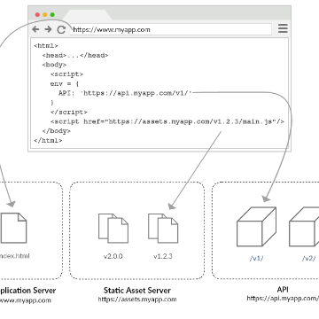

Immutable Web Apps

Immutable Web Apps

https://immutablewebapps.org/

Immutable Web Apps Introduction Immutable Web Applications is a framework-agnostic methodology for building and deploying static single-page applications that: Minimizes risk and complexity of live releases. Simplifies and maximizes caching. Minimizes the need for servers and administration of runtime environments. Enables continuous delivery through simple, flexible, atomic deployments. Principles The methodology is based on the principles of strictly separating : Configuration from code. Release tasks from build tasks.