Improving third-party web performance at The Telegraph

# Improving third-party web performance at The Telegraph

[Gareth Clubb](https://medium.com/@gareth.clubb)
Apr 30·9 min read

At The Telegraph we’re currently going through a process of rebuilding our public-facing website. This gives us the opportunity to take learnings from the existing build but also write some of the code from scratch. You can see our progress so far on pages such as [Gaming](https://www.telegraph.co.uk/gaming/) and [Culture](https://www.telegraph.co.uk/culture/). We can monitor the impact this has on metrics across usability, performance and accessibility.

We’re incredibly passionate about the web, particularly performance, and regularly attend local meetups such as [LDNWebPerf](https://ldnwebperf.org/) to learn from others in the industry. We knew web performance was crucial to the success of our new website but didn’t know how to introduce the topic into an organisation with more than 160 years of history and in excess of 1000 employees. We recognised that with millions of visits per month, performance improvements would be of huge value to our users.

We started slowly, fixing the immediate problems within our technical control: this brought good results but only accounted for 5% of the requests. We knew we would have to start working with the wider business to tackle the rest.

Improving the performance impact of third-party scripts on a website takes time; results won’t come overnight, but by being patient and chipping away slowly, eventually these efforts will be rewarded.

### Creating a Performance Culture

The most important and hardest thing to achieve when tackling web performance at The Telegraph was trying to instil a performance culture. A lot of the performance challenges we have faced have not been technical but have been ‘organisational’. Everyone wants ‘that tag’ on a page which will make the organisation money so it was very important that we get the right individuals in a room to educate, challenge and work together.

We set up a web performance working group and invited people from across the company — covering Advertising, Marketing, Commercial and of course Technology. The meetings are run fortnightly and we use them as an opportunity to review third-party tags, discuss current challenges and work as a cross-organisational team to try to make our web pages as fast as possible.

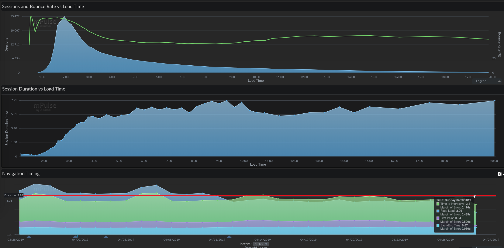

Akamai’s mPulse showing important front-end metrics for a subset of pages.

Making web performance visible to non-technical teams will keep it at the forefront of their minds when they consider any additional requests so we’re now working to try to build different RUM dashboards for different teams. For example, one built around key advertising metrics that is on display in the advertising area and one built for marketing so that if any regressions happen from a third-party, we can help show them where that came from.

### Breaking down the silos (build a rapport)

There are a lot of different teams at The Telegraph, some with an entry level onto the website — through tag managers, embeds and advertising. As the core technical team, we found it imperative to work with these teams to show support. We would never dismiss anyone or anything but simply be on hand to offer best practice advice.

Over time we built up a good rapport across the organisation and that gave us very early insight into what was potentially being added onto the site, when it was being added (so we could keep a record) and most importantly, we could offer advice for the benefit of our end users.

### Deferring all JavaScript

The single biggest improvement (and easiest to implement technically) came from deferring all JavaScript, including our own, by adding the defer attribute to each script tag.

WebPageTest filmstip comparing before and after deferred scripts.

Mention you’re going to delay JavaScript execution to any marketing, advertising or analytics team and you may see hesitation and reluctance in their reply. They worry about lost revenue if adverts don’t load fast enough or worry that analytics will be skewed which won’t reflect true visitor numbers. Both of which could have an effect on the entire organisation’s income.

We created a deferred JavaScript test on our QA environments and watched the statistics over a number of days. The results were promising:

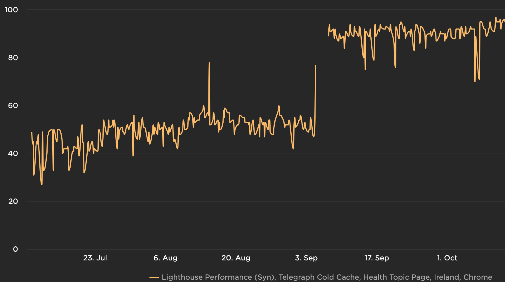

Nearly 100% improvement in Lighthouse Performance score (unthrottled) when scripts were deferred.

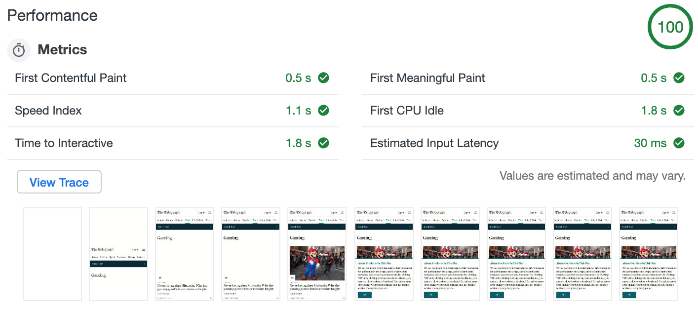

Unthrottled Lighthouse Performance Score (https://www.telegraph.co.uk/gaming/)

We’ve made huge strides in the right direction to improve our overall performance scores but we’re well aware that there is still a huge amount to be done, especially around mobile devices and slower connections.

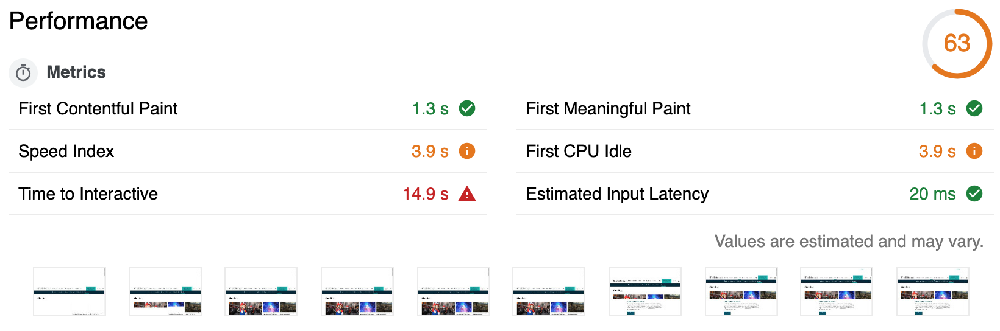

Using WebPageTest ‘Fast 3G’ simulated connection (https://www.telegraph.co.uk/gaming/)

The Speed Index score is high because of a third-party cookie notification banner — we’re going to move that into our core codebase as soon as possible.

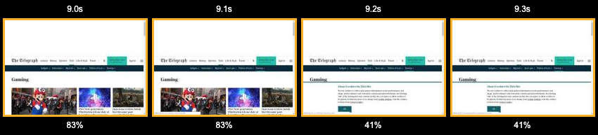

WebPageTest filmstrip showing the cookie notification banner.

Time to Interactive (TTI) and First CPU idle measure how soon the page might be interactive to a user. The high values shown above can be attributed to third-party JavaScript. We’re working hard with teams across the organisation to educate, help and question any JavaScript that is executed on site. As a team, we know we’ll get there — it just takes time.

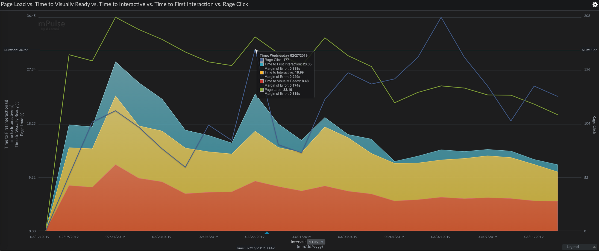

Akamai’s mPulse tracking key performance metrics vs rage clicks on a subset of pages.

We can say with confidence though that deferring our JavaScript hasn’t skewed any existing analytics and it certainly hasn’t delayed any advertising. By using custom performance marks in the advertising code, deferring JavaScript and reducing bundle sizes, the First Ad Loaded metric improved by an average of four seconds.

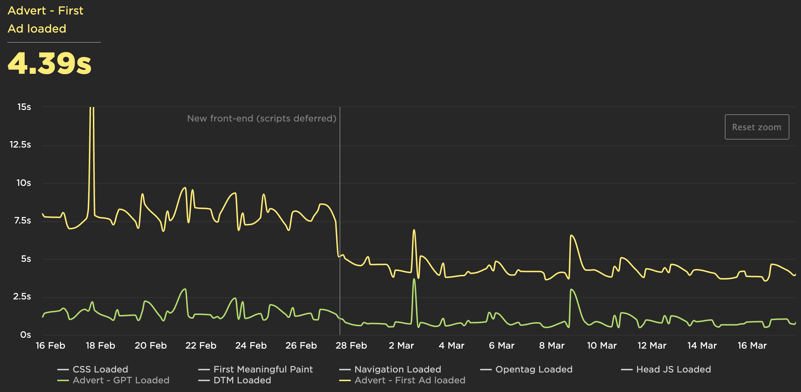

Custom First Ad Loaded metric improving by an average of 4 seconds.

Noticeable improvements have also been recorded in other areas, particularly where the CPU spends most of its time.

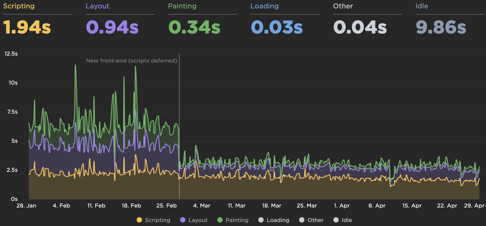

Over 2 second improvement in Layout and Painting (https://www.telegraph.co.uk/culture/).

We also saw that by reducing our JavaScript bundle sizes (both first and third-party), we would end up with a reduction in Time To Interactive.

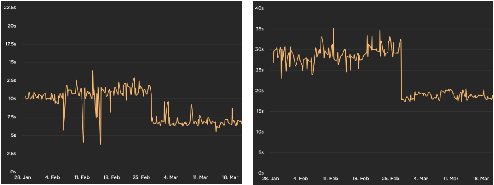

6 second improvement in TTI for Chrome and a 15 second improvement for iPhone 6 (https://www.telegraph.co.uk/culture/).

### Regular audits of our tag managers

Third-party tags can be added by different teams across the organisation and they are often forgotten about over time. People move on, contracts expire or the results are yielded but the teams never get back in touch to have the scripts removed. That’s why it’s incredibly important to audit any tag manager and to do so often.

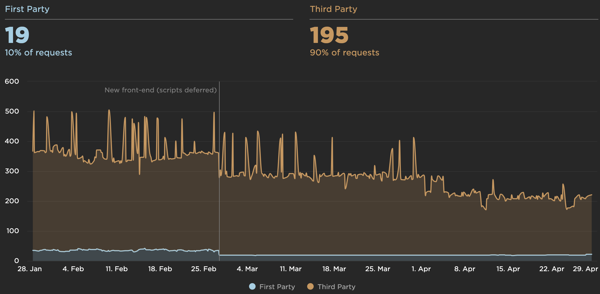

Number of third-party requests gradually declining over time from regular audits (https://www.telegraph.co.uk/culture/).

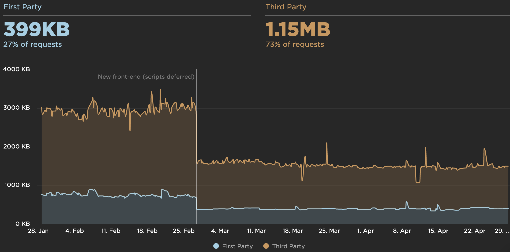

1 MB reduction in third-party payload (https://www.telegraph.co.uk/culture/).

At The Telegraph, we review our tag manager entries at least every quarter. We will reach out to the individual or team that made the original request (for it to be added) to check if they still require it to be present on the website.

When we started this process we had a collection of very old scripts and couldn’t track the original requester. We removed those on the premise that, if they were important, people would get back in touch — no one did.

### Testing each additional tag request

Our main tag manager is currently controlled by our internal technical support team. Teams must send them a written request for the addition of any new script. This made it very easy for us to work with the team to add a performance testing phase to each and every request.

Testing an individual script can be difficult. Scripts have impacts on other scripts and when you have in excess of 200 third-party requests, the fluctuations in readings can make it challenging to get any meaningful data.

For this reason, we’ve started testing in isolation. We have a blank page with some dummy text on it and a single, synchronous, tag manager. We would add the third-party script there and run the page through WebPageTest after the initial benchmarking.

Some of the key metrics we would try to monitor:

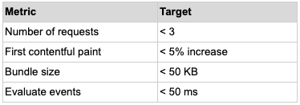

These targets aren’t set in stone and there is a percentage of give and take. We try to use them as best we can; it really just boils down to being sensible. If there is a large amount of degradation in any of our monitored metrics then it’s an obvious rejection with a clear explanation of why.

For larger pieces of work, we would spin them up on a QA environment and let SpeedCurve monitor it over a few days. Some of the results weren’t impressive and thus didn’t make the cut.

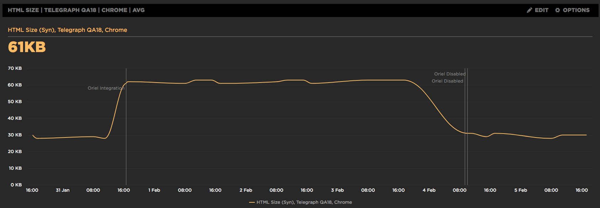

This script was added via ESI and doubled the HTML size from 30 KB to 60 KB.

### Monitoring

#### Synthetic

There are a large number of tools on the market to monitor a website’s performance synthetically — many are built around WebPageTest APIs. At The Telegraph we use [SpeedCurve](https://speedcurve.com/) and have found it invaluable to help pinpoint potential problems along the way. The dashboards they offer around JavaScript usage and third-parties remind us to keep a record of where we’ve come from and where we need to be.

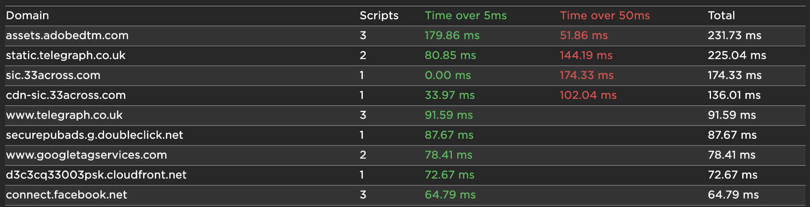

SpeedCurve can easily highlight offending domains that delay First CPU Idle.

#### Real User Monitoring (RUM)

It goes without saying that synthetic monitoring will only get you so far and that is why we’re currently exploring many options when it comes to real user monitoring. We’ve toyed with the idea of beaconing and collecting our own data as well as using an external service like Akamai’s mPulse or SpeedCurve’s LUX.

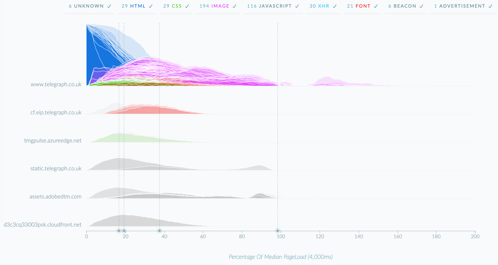

mPulse dashboard showing at which point resources are called for users during the page’s loading process.

#### Metrics we monitor

- •Lighthouse Performance, Accessibility and SEO scores
- •Asset sizes (HTML, CSS, JavaScript, images, number of DOM elements)
- •First CPU Idle
- •Custom metrics such as First Ad Loaded and our definition of First Meaningful Paint

### Ideas in the backlog

#### Business metrics

One correlation we haven’t made yet is the one between our core business metrics and our web performance improvements. As a team, we would love to tell the business when a third-party request comes in how much it will cost them. We’re not quite there yet.

In hindsight, we would have prioritised this correlation earlier in the process as it can be a powerful tool when negotiating performance improvements with stakeholders and management.

#### Aim for smaller bundles and reduce parse/compile times

When we’ve spotted potential problems with third-parties, we always try to get in touch with them and, more often than not, they’re willing to listen. We’re now getting to the stage where we can start to actively try to pursue smaller bundle sizes and dig deeper into what individual scripts are doing to see if we can offer suggestions on reducing the time it takes to parse and compile their scripts.

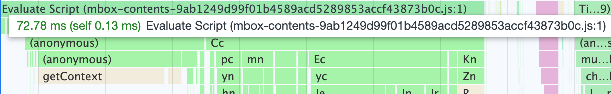

Adobe’s Target (used for A/B testing) takes ~70 ms to be evaluated.

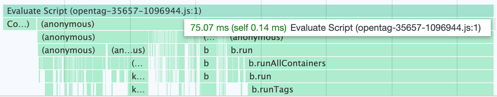

Qubit’s Opentag (tag manager) takes ~75 ms to be evaluated.

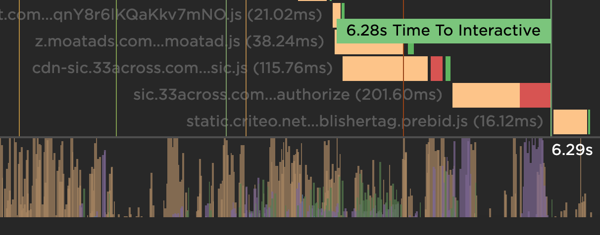

One third-party (native advert supplier) is blocking TTI by nearly 1000 ms. 300 ms of which is spent evaluating the two scripts.

#### Server-side Tag Manager or CDN Proxy

Organisations can often turn to their CDN providers to proxy third-party requests, however, for some this isn’t an option. The Telegraph is currently investigating a proxy via Akamai but also potentially building a server-side tag manager via serverless architecture.

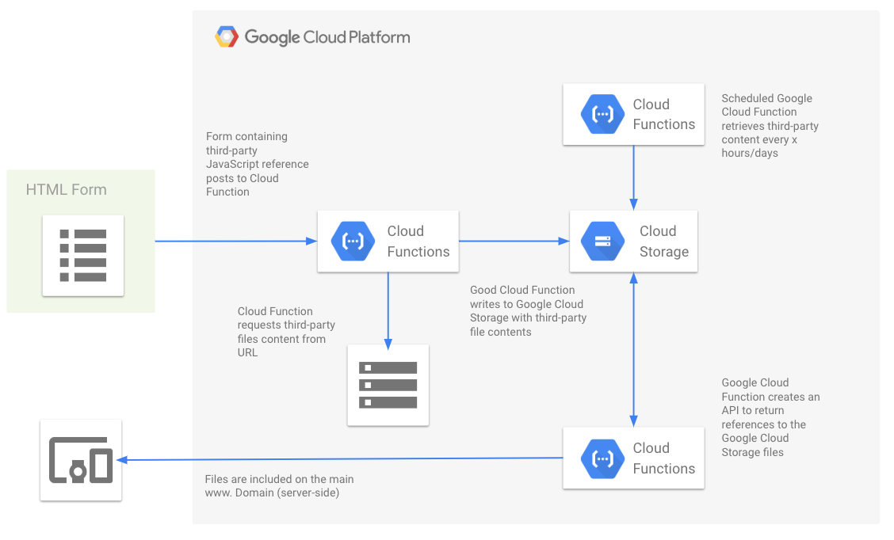

Architecture: General > Server-side tag manager

The general idea here being that a HTML form which contains references to the third-party files would POST to a Cloud Function. This Cloud Function can download the data from those scripts and save them to Cloud Storage.

The references to these files can be included server-side via the main www. domain. The third-parties would have to be called every x hours/days to get relevant updates.

Benefits:

- •Removes need for client-side tag manager (excessive JavaScript)
- •Efficient cache policy for repeat visits
- •No additional DNS lookups or SSL handshakes
- •HTTP/2 multiplexing

By following best practice advice for web performance, involving teams from across the organisation and making our changes visible — the business and most importantly our users can see the real benefits. No matter where a person lives, what device or connection they use — we should all have the same access to news and information.

We need to try to be as inclusive as possible — web performance and accessibility is imperative to making that happen. Resolving third-party issues, our biggest performance challenge to date, will help us get there.

*Gareth Clubb is a Principal Software Engineer at The Telegraph. You can follow his work on *[*Twitter*](https://twitter.com/digitalclubb)*. Thanks to the *[*Telegraph Engineering*](https://twitter.com/telegrapheng)* team and *[*Simon Hearne*](https://twitter.com/simonhearne)* (Akamai) for their reviews, contributions and commitment to making the web a faster place.*