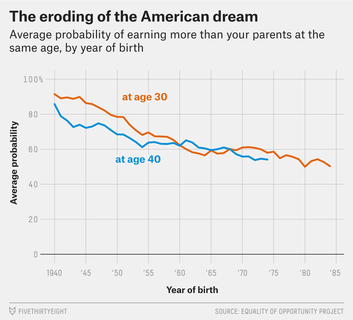
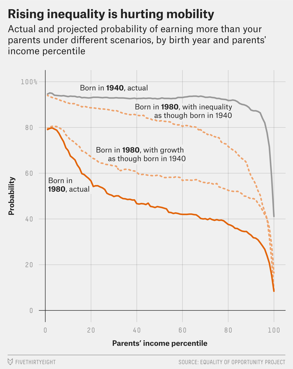

Inequality Is Killing The American Dream

Dec. 8, 2016at2:15 PM

# Inequality Is Killing The American Dream

By [Ben Casselman](https://fivethirtyeight.com/contributors/ben-casselman/)

Filed under [Economic Mobility](https://fivethirtyeight.com/tag/economic-mobility/)

- [](https://fivethirtyeight.com/features/inequality-is-killing-the-american-dream/?share=facebook&nb=1)
- [](https://fivethirtyeight.com/features/inequality-is-killing-the-american-dream/?share=twitter&nb=1)
- [](https://fivethirtyeight.com/features/inequality-is-killing-the-american-dream/?ex_cid=538twittermailto:?subject=I%20thought%20you%E2%80%99d%20like%20this%20article%20from%20FiveThirtyEight&body=https%3A%2F%2Ffivethirtyeight.com%2Ffeatures%2Finequality-is-killing-the-american-dream%2F?ex_cid=538email)

Decades of rising income inequality and slowing economic growth have eroded a pillar of the American dream: the hope that each generation will do better than the one that came before, according to [new research released Thursday](http://www.equality-of-opportunity.org/).

If the findings hold up, they have profound economic, social and even political implications. The decline in what economists call “mobility” — how easy it is to move up the income ladder over a lifetime or across generations — has been especially stark in the Rust Belt states that helped propel Donald Trump to victory in last month’s presidential election.

In 1970, according to the research, conducted by Stanford economist Raj Chetty and several co-authors, roughly nine out of every 10 American 30-year-olds earned more than their parents did at the same age, after adjusting for inflation. In 2014, only half of 30-year-olds could say the same.[1](https://fivethirtyeight.com/features/inequality-is-killing-the-american-dream/?ex_cid=538twitter#fn-1) The slowdown in mobility shows up in all 50 states and is true across the income spectrum. The biggest declines were among the children of middle-class families.

The researchers identify two main drivers of the drop in mobility. First, economic growth has [slowed in recent decades](https://fivethirtyeight.com/features/trump-and-clinton-have-little-to-say-about-slow-economic-growth/). That means the economic pie is growing more slowly than it used to, which makes it harder for each generation to surpass the previous one — there is less new income to go around. Second, income inequality has risen, which means that fewer people are benefiting from any new income being generated. Chetty and his colleagues estimate that inequality is more than twice as important as slowing growth, accounting for more than 70 percent of the decline in mobility.

Their research comes out the same week as a [separate study](http://equitablegrowth.org/research-analysis/economic-growth-in-the-united-states-a-tale-of-two-countries/) by French economist Thomas Piketty and others that found that the bottom half of American adults by income today [earn no more](http://www.nytimes.com/2016/12/06/business/economy/a-bigger-economic-pie-but-a-smaller-slice-for-half-of-the-us.html?_r=0) in pre-tax income than the bottom half of American adults did in the 1970s.

“There really is a dramatic change in what’s going on in the income distribution in the U.S.,” said Nathaniel Hendren, an economist at Harvard and another of the latest paper’s authors. “The rungs of the ladder are growing further apart, so the difference in outcomes in being born to a rich family versus being born to a poor family is getting greater.”

Chetty and Hendren’s research, which is based on an analysis of tax records and Census Bureau data, hasn’t yet been subjected to peer review, and it relies on a novel methodology for linking parents’ and children’s incomes that will doubtless face scrutiny from other economists. But Chetty is widely respected, and his work has been [cited by both liberals and conservatives](http://www.wsj.com/articles/economist-raj-chettys-proposals-on-inequality-draw-interest-on-both-sides-of-the-political-aisle-1445383469). The paper tries to address some of the most frequent conservative criticisms of related work, including that directed at Piketty.

The research is the latest in a series of papers from Chetty, Hendren and their co-authors looking at patterns in economic mobility in the U.S. The researchers have previously studied what is known as relative mobility, which measures how much the economic pecking order is [reshuffled from one generation to the next](https://fivethirtyeight.com/features/rich-kids-stay-rich-poor-kids-stay-poor/) — how likely it is, for example, that someone born into the poorest 20 percent of households will rise to the richest 20 percent. They found that relative mobility [varies significantly](http://www.rajchetty.com/chettyfiles/mobility_geo.pdf) from one part of the country to another but [overall hasn’t changed much over time](http://www.equality-of-opportunity.org/assets/documents/mobility_trends.pdf).

In their new paper, the researchers tried to measure a different concept, absolute mobility: How likely is it that someone will earn more than his or her parents did? Unlike the relatively flat line of relative mobility, the trend for absolute mobility points clearly downward. Nearly all Americans born in the 1940s, regardless of income, could expect to out-earn their parents in adulthood (or live in households that did). But mobility fell sharply over the next 20 years: Just 70 percent of Americans born in 1955 out-earned their parents at age 30, and only about 60 percent of those born in 1960 did so. The decline has slowed since then, but it hasn’t stopped: Among Americans born in the early 1980s, barely half have managed to surpass their parents’ earnings.

Notably, the one break from the downward trend came among Americans born in the late 1960s and early 1970s, who entered their prime working years during the economic boom of the late 1990s. That suggests that economic growth — and especially the kind of broad-based prosperity that was a [hallmark of that boom](https://fivethirtyeight.com/features/no-bill-clinton-does-not-know-how-to-fix-the-economy/) — could help improve mobility. The researchers tested that theory by analyzing what the mobility would have looked like had economic growth remained as high as it was in the middle of the 20th century. Sure enough, mobility would have improved: 62 percent of Americans born in 1980 would have out-earned their parents instead of the 50 percent seen in the real world.

But inequality was a much bigger driver. The researchers analyzed a scenario in which growth followed its real-world path, but that growth was distributed more equally. In that scenario, the rate of mobility would rise to 80 percent, wiping out more than two-thirds of the 40-year decline.

Ultimately, Hendren said, restoring mobility will require both. “You need growth, and you need it to be broad-based,” Hendren said.

The paper’s findings are consistent with other evidence of declining American prosperity, such as the [stagnation in household income](https://fivethirtyeight.com/features/the-american-middle-class-hasnt-gotten-a-raise-in-15-years/) and the [shrinking of the middle class](https://fivethirtyeight.com/features/most-americans-arent-middle-class-anymore/). In the past, some economists, particularly on the right, have [challenged such claims](http://www.nationalreview.com/article/428450/middle-class-not-losing-ground). They argue, for example, that researchers often focus too much on measures of income that ignore the effects of taxes and government programs that help the poor. And they say government figures often [overstate inflation](http://blogs.wsj.com/economics/2015/07/06/just-how-stagnant-are-wages-anyway/) in part by failing to account fully for improving quality and technological developments — houses and cars are bigger and better-made today than they were in the 1970s, but those improvements don’t show up in inflation statistics. That makes the stagnation in household income — and related problems, such as declining mobility — look worse than it really is, these critics argue.

The new paper, however, finds that the decline in mobility looks more or less the same even when looking at after-tax income, using alternative measures of inflation or making other adjustments such as accounting for the shrinking size of the typical U.S. family. Those factors influence the levels of mobility — exactly how likely it is for children to out-earn their parents — but they don’t change the overall downward trend.

Hendren said he and his colleagues were surprised at how consistent — and stark — the results were, cutting across regions and income groups. “This is something that is just [affecting] kids of all backgrounds,” Hendren said.