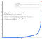
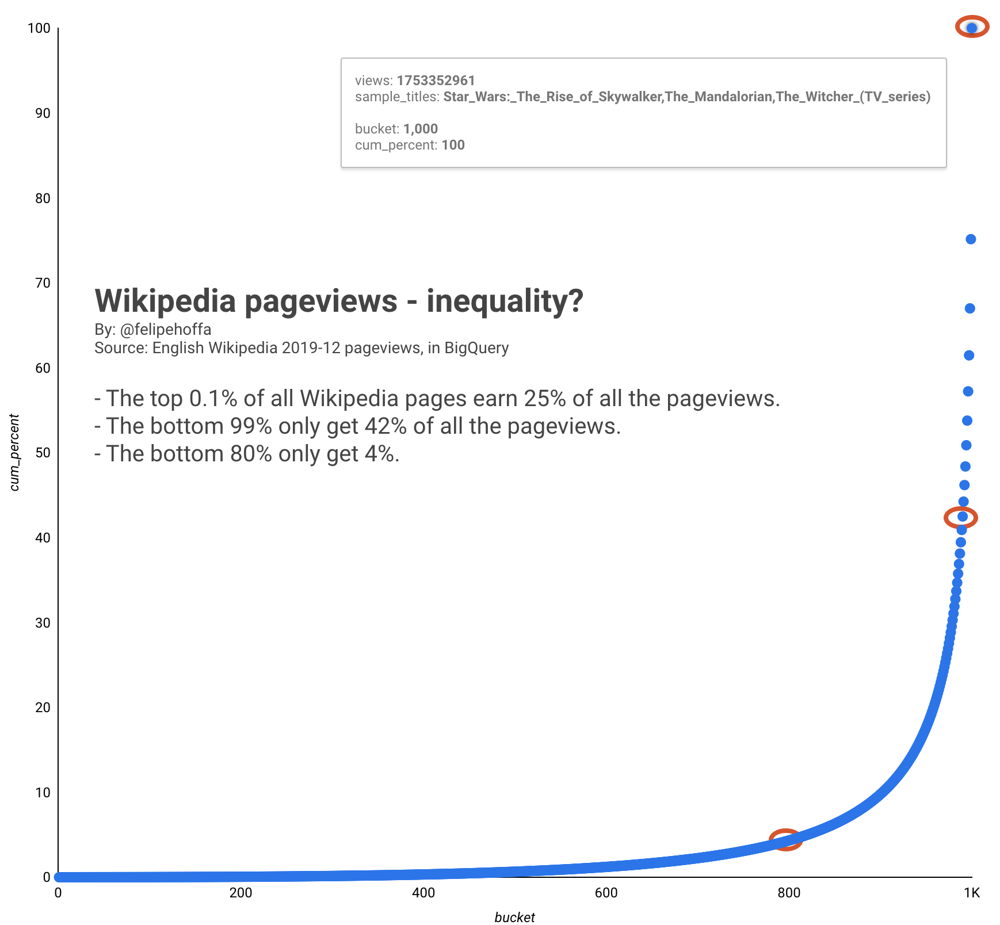
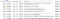

Inequality: How to plot a Lorenz curve with SQL, BigQuery, and Data Studio

# Inequality: How to plot a Lorenz curve with SQL, BigQuery, and Data Studio

## The top 0.1% of all Wikipedia pages earn 25% of the pageviews. The bottom 99% only get 42% of all the views. And the bottom 80% — only get 4%. This is just one example — in this post we’ll review how to get these numbers for this and any other dataset.

[Felipe Hoffa](https://towardsdatascience.com/@hoffa?source=post_page-----c70824b0748d----------------------)

[Jan 24](https://towardsdatascience.com/inequality-how-to-draw-a-lorenz-curve-with-sql-bigquery-and-data-studio-c70824b0748d?source=post_page-----c70824b0748d----------------------) · 5 min read

How can we get these numbers out of a SQL table?

# Step 0: What is BigQuery?

If this is your first time with BigQuery, get ready for a fun ride. Check out this post:

[ ## BigQuery without a credit card: Discover, learn and share   ### If you ever had trouble signing up for BigQuery, worry no more — now it’s easier than ever to sign up and start…    #### towardsdatascience.com](https://towardsdatascience.com/bigquery-without-a-credit-card-discover-learn-and-share-199e08d4a064)

# Step 1: Your data, BigQuery, and SQL

First — we need to define our dataset. In this case, it’s all the pageviews in the English Wikipedia during December 2019 — after removing all the special pages:

WITH wiki_prefixes AS (
SELECT ['File:', 'Draft:', 'Help:', 'en:', '...'] x
)

, data AS (
SELECT *
FROM `fh-bigquery.wikipedia_extracts.201912_en_totals`
WHERE title NOT IN ('-', 'Main_Page')
AND (
title NOT LIKE '%:%'
OR REGEXP_EXTRACT(title, '[^:]*:')
NOT IN UNNEST((SELECT(x) FROM wiki_prefixes))
)
)

You need to give a consecutive row number to each row in this dataset, ordered by the # of pageviews:

SELECT title, views, ROW_NUMBER() OVER (ORDER BY views) rn
FROM data

Now you can use that row number to divide all the pages in 1,000 different buckets:

SELECT 1+fhoffa.x.int(rn/(SELECT (1+COUNT(*))/1000 FROM data)) bucket
, COUNT(*) pages
, SUM(views) views
, STRING_AGG(title ORDER BY views DESC LIMIT 3) sample_titles
FROM (
SELECT title, views, ROW_NUMBER() OVER (ORDER BY views) rn
FROM data
)
GROUP BY 1

To get a bucket I have a subquery on the first line:`(SELECT (1+COUNT(*))/1000 FROM data)` . That gets me a number based on the total number of rows out of my dataset, and by dividing each row number by this value, we get 1k different buckets, from 0 to 999. Each of these buckets will have the `SUM(views)` of its pages, and `STRING_AGG(title ORDER BY views DESC LIMIT 3)` serves to keep some sample titles to identify each bucket.

Now we will surround this query with a new one calculating the cumulative number of views while we go through the 1k buckets, and also the total # of pageviews from all these pages:

SELECT SUM(views) OVER(ORDER BY bucket) cum_views
, SUM(views) OVER() total_views
FROM (
...
)

The way to get the cumulative vs the grand total for each row is the `OVER(ORDER BY bucket)` vs just `OVER()`.

Next step: Take the cumulative number of views, and divide them by the total:
SELECT ROUND(100*cum_views/total_views,3) cum_percent
FROM (
...
)

And now we have a cumulative percent we can chart in Data Studio. Let’s put everything together, creating a new table:

CREATE TABLE `wikipedia_extracts.201912_lorenz_curve`
AS

WITH wiki_prefixes AS (SELECT ['File:', 'Talk:', 'Template_talk:', 'Wikipedia:', 'Category:', 'User_talk:', 'Page:', 'Template:', 'Category_talk:' , 'User:', 'Author:', 'Portal:', 'Wikipedia_talk:', 'Portal_talk:', 'File_talk:', 'Draft:', 'Help:', 'Draft_talk:', 'en:', 'Book_talk:', 'Module:', 'MOS:', 'Special:', 'Book:'] x)

, data AS (
SELECT *
FROM `fh-bigquery.wikipedia_extracts.201912_en_totals`
WHERE title NOT IN ('-', 'Main_Page')
AND (
title NOT LIKE '%:%'

OR REGEXP_EXTRACT(title, '[^:]*:') NOT IN UNNEST((SELECT(x) FROM wiki_prefixes))

)
)SELECT ROUND(100*cum_views/total_views,3) cum_percent, *
FROM (

SELECT SUM(views) OVER(ORDER BY bucket) cum_views, *, SUM(views) OVER() total_views

FROM (

SELECT 1+fhoffa.x.int(rn/(SELECT (1+COUNT(*))/1000 FROM data)) bucket, COUNT(*) pages, SUM(views) views

, STRING_AGG(title ORDER BY views DESC LIMIT 3) sample_titles
FROM (
SELECT title, views, ROW_NUMBER() OVER (ORDER BY views) rn
FROM data
)
GROUP BY 1
)
)# 34.1 sec elapsed, 805.8 MB processed)

Buckets #991 to #1000, the top 1%

# Step 2: Visualizing in Data Studio

Go to the new table you just created in BigQuery, and follow these steps:
> Explore with Data Studio
> → Save
> → Create new report and share