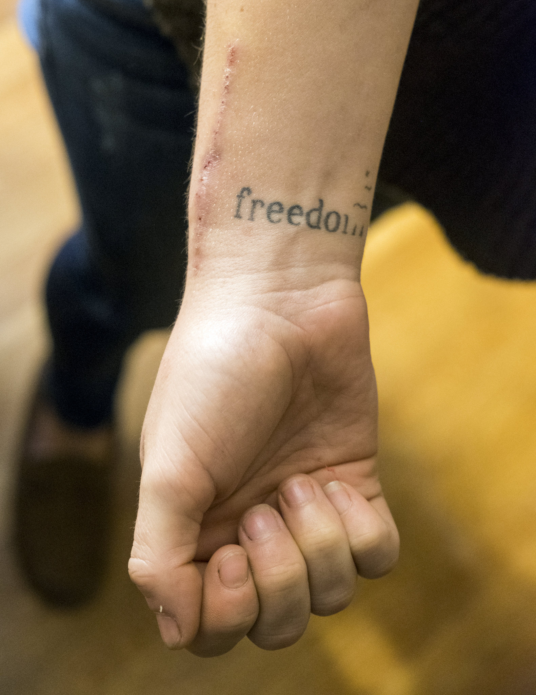
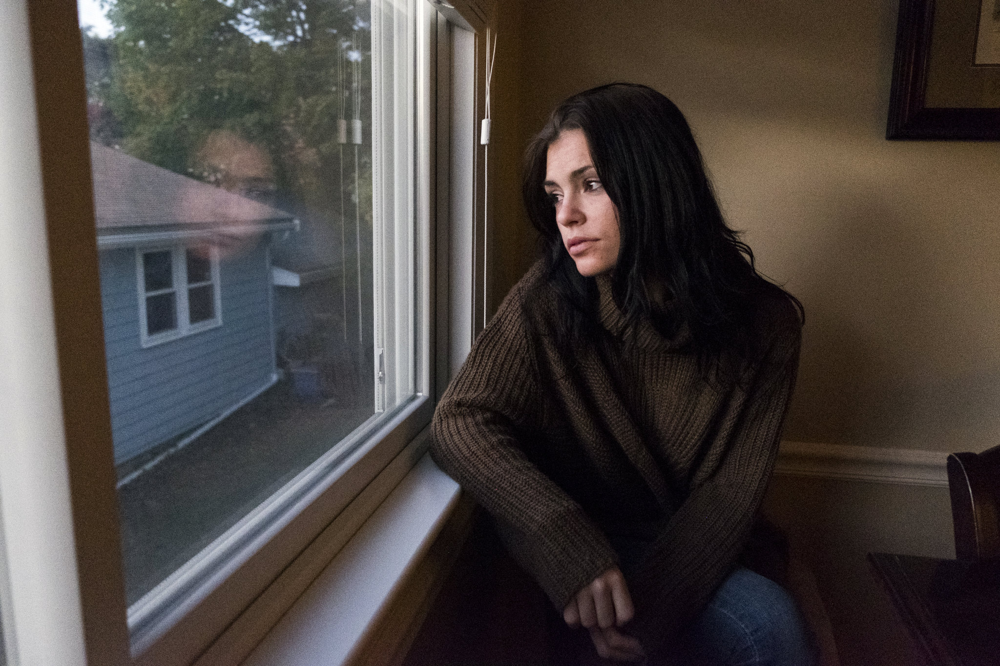
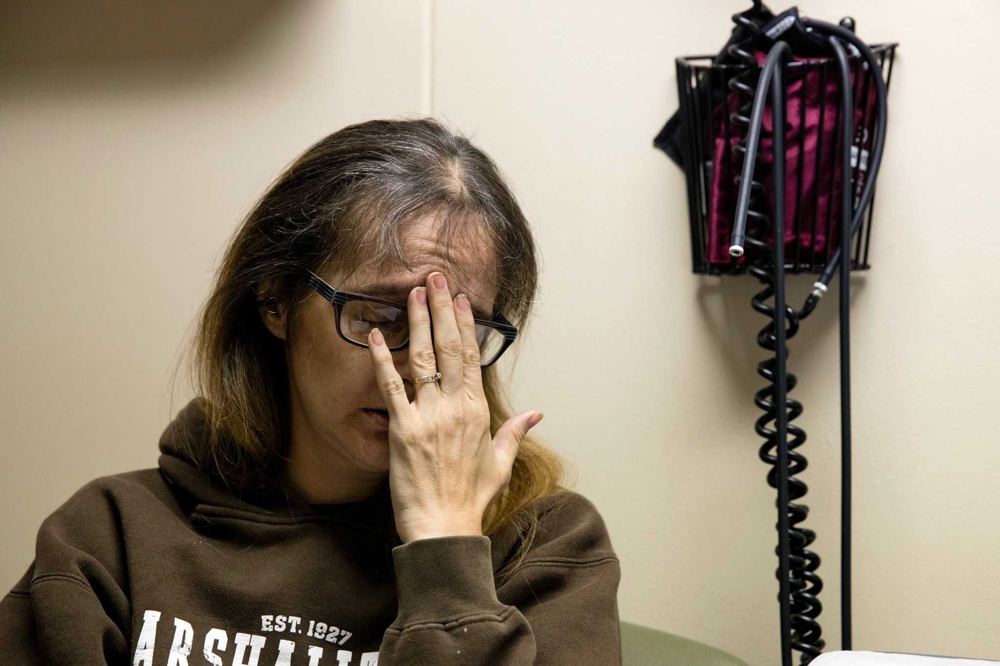
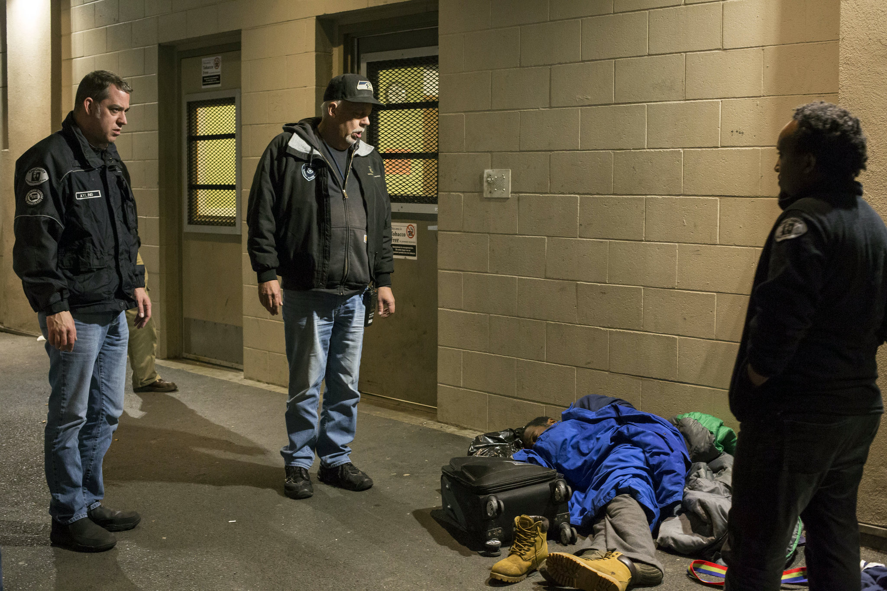
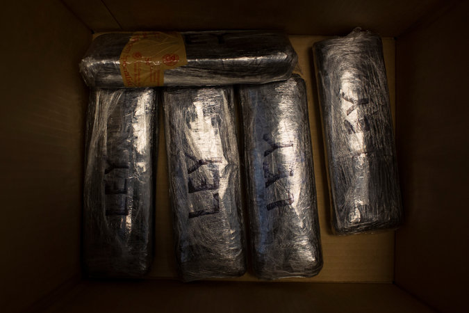
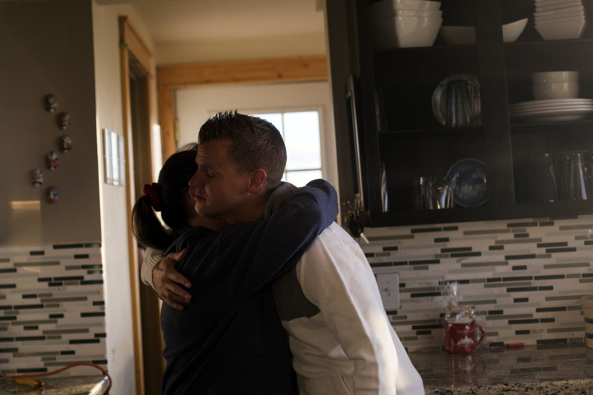
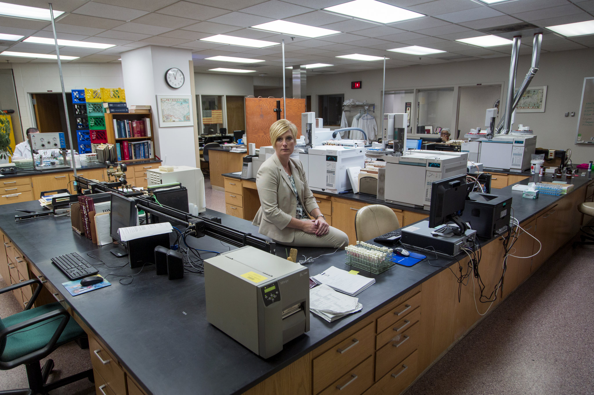

Inside a Killer Drug Epidemic: A Look at America’s Opioid Crisis

 Cover Photo

 

 Katie Harvey of Marblehead, Mass., displays a tattoo next to track marks. The tattoo represents her goal to break free of drugs.    Credit M. Scott Brauer for The New York Times

# Inside a Killer Drug Epidemic: A Look at America’s Opioid Crisis

The opioid epidemic killed more than 33,000 people in 2015. What follows are stories of a national affliction that has swept the country, from cities on the West Coast to bedroom communities in the Northeast.

JAN. 6, 2017

[Continue reading the main story](https://www.nytimes.com/2017/01/06/us/opioid-crisis-epidemic.html?hp&action=click&pgtype=Homepage&clickSource=story-heading&module=photo-spot-region&region=top-news&WT.nav=top-news&_r=0#story-continues-1)Share This Page

- [**Share](#)
- [**Tweet](#)
- [**Email](#)
- [**More](#)
- [**Save](#)

Opioid addiction is America’s 50-state epidemic. It courses along Interstate highways in the form of cheap smuggled heroin, and flows out of “pill mill” clinics where pain medicine is handed out like candy. It has ripped through New England towns, where people overdose in the aisles of dollar stores, and it has ravaged coal country, where addicts speed-dial the sole doctor in town licensed to prescribe a medication.

Public health officials have called the current opioid epidemic the worst drug crisis in American history, [killing more than 33,000 people](https://www.cdc.gov/mmwr/volumes/65/wr/mm655051e1.htm?s_cid=mm655051e1_w) in 2015. Overdose deaths were nearly equal to the number of deaths from car crashes. In 2015, for the first time, deaths from heroin alone [surpassed gun homicides](https://www.washingtonpost.com/news/wonk/wp/2016/12/08/heroin-deaths-surpass-gun-homicides-for-the-first-time-cdc-data-show/?utm_term=.f254cf450cc9).

And there’s no sign it’s letting up, a team of New York Times reporters found as they examined [the epidemic on the ground](http://www.nytimes.com/2017/01/06/us/has-opioid-abuse-affected-you-readers-respond.html) in states across the country. From New England to “safe injection” areas in the Pacific Northwest, communities are searching for a way out of a problem that can feel inescapable.

##  Here are their stories

-

### Massachusetts

-

### Iowa

-

### California

-

### Washington

-

### Arizona

-

### Utah

-

### Wisconsin

 [Continue reading the main story](https://www.nytimes.com/2017/01/06/us/opioid-crisis-epidemic.html?hp&action=click&pgtype=Homepage&clickSource=story-heading&module=photo-spot-region&region=top-news&WT.nav=top-news&_r=0#story-continues-1)

## Related Coverage

- [              ##   Fentanyl Outpaces Heroin as the Deadliest Drug on Long Island  DEC. 28, 2016](https://www.nytimes.com/2016/12/28/nyregion/fentanyl-epidemic-long-island.html)

- [              ##   Rise in Infant Drug Dependence Is Felt Most in Rural Areas  DEC. 12, 2016](https://www.nytimes.com/2016/12/12/health/rise-in-infant-drug-dependence-in-us-is-felt-most-in-rural-areas.html)

- [              ##   Fraction of Americans With Drug Addiction Receive Treatment, Surgeon General Says  NOV. 17, 2016](https://www.nytimes.com/2016/11/18/us/substance-abuse-surgeon-general-report.html)

- [              ##   Opioid Poisonings Rise Sharply Among Toddlers and Teenagers  OCT. 31, 2016](https://www.nytimes.com/2016/10/31/well/family/opioid-poisonings-rise-sharply-among-toddlers-and-teens.html)

- [              ##   Drug Linked to Ohio Overdoses Can Kill in Doses Smaller than a Snowflake  SEPT. 5, 2016](https://www.nytimes.com/2016/09/06/us/ohio-cincinnati-overdoses-carfentanil-heroin.html)

 Photo

 

**

 Addicted to heroin, Katie Harvey decided to enter a detox program. Once a popular honors student, she has been in and out of detox eight times and in 2015, wrote a public online apology to her family and friends.    Credit M. Scott Brauer for The New York Times

**Marblehead, Mass.**

#### In Suburbia, ‘Tired of Everything’

Katie Harvey walked out of the house where she lived with friends, shoved her duffel bag into her mother’s car and burst into tears.

 [Continue reading the main story](https://www.nytimes.com/2017/01/06/us/opioid-crisis-epidemic.html?hp&action=click&pgtype=Homepage&clickSource=story-heading&module=photo-spot-region&region=top-news&WT.nav=top-news&_r=0#story-continues-3)

Advertisement

[Continue reading the main story](https://www.nytimes.com/2017/01/06/us/opioid-crisis-epidemic.html?hp&action=click&pgtype=Homepage&clickSource=story-heading&module=photo-spot-region&region=top-news&WT.nav=top-news&_r=0#story-continues-4)

“I need to go to detox,” she told her mother, Maureen Cavanagh. “I’m just tired of everything.”

Ms. Harvey, 24, had been shooting heroin for three years. She had been in and out of detox — eight times altogether. But it had always been someone else’s idea.

This time, Ms. Harvey made the arrangements herself. She had come to loathe her life. “I haven’t even been doing enough to get really high,” she said. “I’m just maintaining myself so I don’t get sick.”

Before she left for detox, Ms. Harvey curled up on the couch in her mother’s living room in this well-to-do suburb north of Boston and reflected on her life: her low self-esteem despite model-worthy good looks; her many lies to her family; how she had pawned her mother’s jewelry and had sex with strange men for money to pay for drugs.

As she spoke, tears spilled from her eyes. She wiped them with the cuff of her sweater, which covered track marks and a tattoo that said “freedom” — her goal, to be unshackled from the prison of addiction.

Ms. Harvey had been a popular honors student. But she developed [anorexia](http://health.nytimes.com/health/guides/disease/anorexia-nervosa/overview.html?inline=nyt-classifier). Alcohol was next. By 21, she was hooked on heroin.

In 2015, she was arrested on charges of prostitution. In an extraordinary act of contrition, she wrote [a public apology online](http://patch.com/massachusetts/marblehead/former-marblehead-student-apologizing-friends-family-after-her-arrest-0) to her friends and family.

Still, she plunged in deeper. She estimated that at her worst, she was shooting up a staggering number of times a day, perhaps as many as 15 — heroin, cocaine, fentanyl. She overdosed five times. In Massachusetts, almost five residents die every day from overdoses.

“I don’t know how I’m alive, honestly,” Ms. Harvey said.

That night in October, she went into detox. Four days later, she checked out. She went back to her friends and drugs, developing an [abscess](http://health.nytimes.com/health/guides/disease/abscess/overview.html?inline=nyt-classifier) on her arm, probably from dirty needles.

Two weeks later, she was back in detox. This time, she stayed, then entered a 30-day treatment program.

The return trips to detox have been an emotional roller coaster for her mother. To cope, Ms. Cavanagh founded a group, [Magnolia New Beginnings](http://www.magnolianewbeginnings.org/), to help drug users and their families.

Among her words of advice: Tell your children you love them, because “it might be the last thing you say to them.” * KATHARINE Q. SEELYE*

 [Continue reading the main story](https://www.nytimes.com/2017/01/06/us/opioid-crisis-epidemic.html?hp&action=click&pgtype=Homepage&clickSource=story-heading&module=photo-spot-region&region=top-news&WT.nav=top-news&_r=0#story-continues-10)

 Photo

 

**

 Andrea Steen at an appointment with her substance abuse coordinator in Marshalltown, Iowa. She is taking Suboxone to mitigate her cravings, a treatment she heard about from a Facebook friend in Tennessee. “She could tell when I was high,” Ms. Steen said of her online friend.    Credit Scott Morgan for The New York Times

**Marshalltown, Iowa**

#### Help May Be Thin on the Ground

Andrea Steen is one of the fortunate ones. For people in this rural community of 28,000, getting medication to help overcome opioid addiction used to require long drives to treatment centers.

That changed about a year ago when two doctors here were licensed to prescribe Suboxone, a drug that eases withdrawal symptoms and helps keep opioid cravings at bay. Now Ms. Steen is one of their patients, coming once a month to check in and renew her prescription.

This epidemic is different from those of the past in significant ways. One is that it has spawned a growing demand for medications that can help modify addiction’s impact.

One of them is naloxone, known as Narcan, a powerful antidote that has jolted hundreds of overdosed users back to life. Another is buprenorphine, typically sold as Suboxone.

By keeping users from experiencing cravings and withdrawal, Suboxone can make it easier for addicts to stay off heroin and other opioids. The number of doctors certified to prescribe buprenorphine has more than doubled since 2011, to about 36,000 from about 16,000, according to the Substance Abuse and Mental Health Services Administration. Yet the drug remains out of reach for many rural Americans.

[ “I was in love with it the first time I tried it. I craved and sought it through every step of my days.”   Braden Ewell, Odessa, Tex. We collected responses from readers about their experiences with opioids. Read more here »](http://www.nytimes.com/2017/01/05/us/has-opioid-abuse-affected-you-readers-respond.html)

Ms. Steen, 46, is among 20 patients who get Suboxone from the two doctors authorized to prescribe it here. Until last summer, she said, she abused Vicodin and morphine relentlessly. She would steal them from her disabled husband, who would try in vain to hide them. But sometimes she couldn’t root out the pills fast enough, and she would experience what every addict dreads most: withdrawal.

She heard about Suboxone from a friend in Tennessee whom she met through Facebook.

“She could tell when I was high,” Ms. Steen said. “Her husband was on Suboxone. She was trying to help me.”

Ms. Steen started on Suboxone in July, initially making weekly visits to Dr. Nicole Gastala and Dr. Timothy Swinton, the family practitioners here who prescribe the drug. Then it was every other week.

Unlike methadone, which also helps treat opioid addiction but must be taken under supervision at special clinics, Suboxone can be taken at home. Some doctors fail to follow Suboxone patients closely, or to test their urine to make sure they are not abusing or selling the medication or using other drugs. But the protocol here is strict.

Besides her doctor visits, Ms. Steen must attend group therapy and have regular urine tests.

She has mostly stopped craving opioids, for now. *ABBY GOODNOUGH*

 [Continue reading the main story](https://www.nytimes.com/2017/01/06/us/opioid-crisis-epidemic.html?hp&action=click&pgtype=Homepage&clickSource=story-heading&module=photo-spot-region&region=top-news&WT.nav=top-news&_r=0#story-continues-17)

 Photo

 

**

 Jordan, who asked that his last name not be disclosed, was on his third stint in rehab. He once blew through a $20,000 inheritance in a month to get what he called the best heroin in the city. He was getting treatment at The Hills center in Los Angeles.    Credit Kendrick Brinson for The New York Times

**Los Angeles**

#### Tough-Love Rehab

They enter through an unmarked turquoise storefront, nestled between fashion boutiques on Melrose Avenue. They gather in a circle, ready for the tough-love approach they have come to expect from Howard C. Samuels, a clinical psychologist who runs the Hills, a drug rehabilitation center whose location is central to its marketing.

A spot in the room is hard to come by, as are most drug rehabilitation services, especially for the poor and anyone without the proper insurance. The Hills, which can cost around $50,000, serves a more privileged population, yet its mission is no less daunting.

In 2014, [heroin became the most common](http://publichealth.lacounty.gov/sapc/MDU/MDBrief/HeroinBriefFinal.pdf) reported drug of choice among those seeking treatment in Los Angeles County, surpassing marijuana and methamphetamine.

Dr. Samuels began with what he called a reality check. “How many of you have been to at least five treatment centers?” he asked. Nearly every one of the 19 clients in the room raised a hand.

“How about 10?” Still half of the clients raised their hands.

One of them, Jordan, who agreed to tell his story only if his last name was not disclosed, knows he is one of the lucky ones. This is only his third time in rehab, a relative rookie at 33 years old. This was his 118th day sober.

 Photo
 
**

 Jordan has been collecting his sobriety chips. At the time a reporter spoke to him, he was on his 118th day sober.    Credit Kendrick Brinson for The New York Times

He had smoked pot, taken ecstasy and occasionally snorted cocaine. But heroin seemed off-limits to him, a college-educated son of two therapists, until a friend offered him some to smoke. Four years later, he blew through a $20,000 inheritance in a month to get what he called the best heroin in the city.

After his first days of detox were over at the Hills, Jordan began what would be months of therapy. He confronted what Dr. Samuels calls “character defects,” and rattles his off easily: lust, anger, lack of discipline.

On this day, he knows he will draw the wrath of Dr. Samuels: Subverting the rules, he recently went out for his seventh tattoo. “My addiction has been replaced with addiction to other things: going to the gym, smoking, girls, getting tattoos.”

“Don’t you owe me an apology?” Dr. Samuels said to him, almost shouting.
Jordan answered quietly: “Yeah, I guess I owe you and some people an apology.”

“I’m glad you’re apologizing to me. That’s good, but what’s bad is, it came so naturally,” Dr. Samuels said.

“All of us have some real impulse control problems,” he continued. “That’s why we’re drug addicts.”

*JENNIFER MEDINA*

 [Continue reading the main story](https://www.nytimes.com/2017/01/06/us/opioid-crisis-epidemic.html?hp&action=click&pgtype=Homepage&clickSource=story-heading&module=photo-spot-region&region=top-news&WT.nav=top-news&_r=0#story-continues-24)

 Photo

 

**

 Members of the King County’s Emergency Service Patrol, from left, Todd Ayling, Dan Manus and Soloman Tesfay, prepare to help an intoxicated man in Seattle. Mr. Manus, a former addict himself, says, “It just seems today that there’s so much more out there, so many more people.”    Credit David Ryder for The New York Times

**Seattle**

#### ‘For the Grace of God, There Go I’

The girl looked to be barely out of her teens, and was teetering on the brink of consciousness.

“She couldn’t even form a sentence,” said Dan Manus, a soft-spoken 61-year-old in a Seattle Seahawks cap. His jaw tightened as he recalled the night in October when he and his partner on the King County Emergency Service Patrol found the girl and, he thinks, saved her life.

A former addict, he knows the terrain too well. He’s been clean for 22 years now, and working for the county for the last nine.

“I can relate to everybody I work with down there, because for the grace of God, there go I,” Mr. Manus said, standing in the patrol parking lot between runs. “So, yeah, I feel like this kind of was my calling.”

The Emergency Service Patrol was established in the 1980s by a private charity (later taken over by King County) to rescue street alcoholics by bringing them to a safe “sobering center” to sleep it off.

In October, though, in an acknowledgment of heroin’s new ravages — treatment admissions for heroin in King County surpassed alcohol for the first time in 2015 — Mr. Manus and other patrol crew members were trained and equipped with naloxone.

[ “I remember the moments of shame and guilt after being resuscitated from an overdose. It didn’t start like that, but no one told me it would end like that.”   Zach Neuser, Midland, Tex. We collected responses from readers about their experiences with opioids. Read more here »](http://www.nytimes.com/2017/01/05/us/has-opioid-abuse-affected-you-readers-respond.html)

“Harm reduction” is an approach that was to some degree pioneered here. One of the nation’s first clean-needle exchanges started in nearby Tacoma in 1988.

King County is now considering opening what could be the country’s first safe-injection site. There, addicts could use drugs under supervision by a health worker who may, crucially, also open the door to recovery programs, all under one roof.

For Mr. Manus, the crisis is personal. In 1992, he was saved from death by someone who found him in mid-overdose and called paramedics.

## California Today

The news and stories that matter to Californians (and anyone else interested in the state), delivered weekday mornings.

 Receive occasional updates and special offers for The New York Times's products and services.

Recaptcha requires verification

I'm not a robot

reCAPTCHA

[Privacy](https://www.google.com/intl/en/policies/privacy/) - [Terms](https://www.google.com/intl/en/policies/terms/)

- [See Sample](http://www.nytimes.com/newsletters/sample/california-today?pgtype=subscriptionspage&version=new&contentId=CA&eventName=sample&module=newsletter-sign-up)

- [Manage Email Preferences](https://www.nytimes.com/mem/email.html)

- [Privacy Policy](https://www.nytimes.com/privacy)

Seattle was a different, harder-edged city back then. Grunge music, and the heroin that swirled like a slipstream through the lives and song lyrics of some of its stars, was spilling out of the clubs.

The mix of drugs was changing, too. [Heroin’s impact in King County surged in the late 1990s](http://adai.uw.edu/pubs/pdf/2015drugusetrends.pdf) in the number of times it was identified in connection with a drug death, before beginning a near decade-long slide — a period that coincided with an increase in the number of times prescription opioids were found in victims’ bodies, which peaked in 2009. In that same year, heroin’s role began rising again to hit its highest-ever, worst numbers in 2014 with a drop since then, according to county figures.

More people lately seem to be on complex combinations of drugs, Mr. Manus said — like the girl who, at his direction, was treated by paramedics.

“It just seems today that there’s so much more out there, so many more people,” Mr. Manus said quietly. “It feels nonstop.” *KIRK JOHNSON*

 [Continue reading the main story](https://www.nytimes.com/2017/01/06/us/opioid-crisis-epidemic.html?hp&action=click&pgtype=Homepage&clickSource=story-heading&module=photo-spot-region&region=top-news&WT.nav=top-news&_r=0#story-continues-31)

 Photo

 

**

 An undercover Homeland Security agent inspects a car in which border patrol agents found heroin and methamphetamine in Nogales, Ariz. Much of the heroin that enters the United States comes hidden in cars, suitcases or hollowed fire extinguishers, or strapped to thighs, crotches and chests of people who cross between both countries.    Credit Caitlin O'Hara for The New York Times

**Nogales, Ariz.**

#### Outwitting the Mules

A tipster warned: Look out for a silver Nissan Sentra approaching the busy Dennis DeConcini Port of Entry in Nogales, Ariz., a crucial gateway for cheap heroin made in Mexico.

Early one morning, the Nissan rolled into passport control. A Customs and Border Protection officer caught the telltale signs of a driver who had something to hide: the darting eyes, the tight grip on the steering wheel.

The driver carried a border-crossing card, an entry permission given only to Mexican citizens. He also carried his wife and two small children and a load of heavy drugs: four pounds of methamphetamine in the passenger’s backrest, and seven and a half pounds of heroin between the engine and the dashboard.

Last year, Customs and Border Protection agents seized more than 930 pounds of heroin in Arizona, which is almost one-third of all heroin seized along the entire southern border. Agents acknowledge that they catch only a small fraction of what goes through.

 Photo
 
**

 Heroin seized by border agents in Nogales. An agent speculated that the drugs belonged to a distribution offshoot of the Sinaloa cartel called the Chino Leys.    Credit Caitlin O'Hara for The New York Times

Much of the heroin that enters this country comes hidden in cars, concealed in suitcases, squeezed inside hollowed fire extinguishers, or strapped to the thighs, crotches and chests of Mexicans and Americans who cross between the two countries.

To the special agents assigned to Homeland Security Investigations, a division of Immigration and Customs Enforcement, mules are the first link of a knotted chain that may or may not lead to the agents’ ultimate prize: a top drug trafficker.

“It’s about preventing the narcotics from entering the community,” said Jesus Lozania, the agent in charge in Nogales. “It’s taking down the organization from the bottom all the way to the top: the mules, the people who coordinate the logistics, the persons who handle the money after the narcotics are sold in the United States. That cash has to make its way back to Mexico.”

It is about building conspiracy cases bit by bit.

That morning at the border, three special agents noticed the black letters stamped on the bricks of heroin: LEY. “That’s probably from the Chino Leys, probably Sinaloa,” said one of the agents, who declined to provide his name because he works undercover.

The Chino Leys, he said, are one of the drug distribution organizations in the Sinaloa cartel, which controls the routes that slice through Arizona, aimed for the Northeast. Cleveland, New York and New Jersey are main destinations for Sinaloa’s heroin these days.

The driver said he had borrowed his cousin’s car to come to Nogales to buy sweaters. The disbelieving agent pressed on. The driver crossed his arms.

“The guy’s not talking,” the agent said. *FERNANDA SANTOS*

 [Continue reading the main story](https://www.nytimes.com/2017/01/06/us/opioid-crisis-epidemic.html?hp&action=click&pgtype=Homepage&clickSource=story-heading&module=photo-spot-region&region=top-news&WT.nav=top-news&_r=0#story-continues-39)

 Photo

 

**

 Kolton World, 30, hugs his mother, Marsha, before she leaves for her job at a dry cleaner in Huntington, Utah. Every day she gives him one pill of naltrexone to control heroin cravings. The [Four Corners Behavioral Health](http://www.fourcorners.ws/) center in the nearby town of Price is the only substance-abuse center for miles. Three of its staff members have lost family members to addiction.    Credit Cayce Clifford for The New York Times

**Huntington, Utah**

#### Staying Clean in the High Desert

As she drives to work each morning, past horse ranches and nodding oil pumps, Marsha World stops to give her son, Kolton, a pale yellow pill to help keep him off heroin for another day.

There are few options for drug treatment in the high desert of central Utah, a remote expanse of struggling coal mines, white-steepled Mormon towns and some of the country’s highest opiate death rates.

The lone doctor licensed to prescribe one addiction-treating drug has a waiting list. The main detox center is the county jail. So mothers like Ms. World occupy the lonely front lines of a heroin crisis that has reached deep into the remotest corners of rural America.

The sun was just skimming over the sagebrush hills when Ms. World climbed out of her car and palmed that day’s naltrexone pill for her 30-year-old son. Unlike other medications Mr. World has taken over 11 years of addiction and rehab, jail and relapse, this one seemed to help.

Mr. World was in a treatment program ordered by the local drug court, and Ms. World had promised the judge she would keep the pills at her house and bring one to him. Every day.

[ “Every time he lied to me about getting clean, I would believe him and try to help him out. Now I just hope his bottom is not his death.”   Ross, Tucson, Ariz. We collected responses from readers about their experiences with opioids. Read more here »](http://www.nytimes.com/2017/01/05/us/has-opioid-abuse-affected-you-readers-respond.html)

The rate of prescription overdose deaths among the 32,000 people sprinkled across two neighboring counties in this corner of Utah is nearly four times the state average. Addiction has rippled through ranks of miners who relied on pain pills after years of digging coal and working in the power plants.

Karen Dolan, who runs the [Four Corners Behavioral Health](http://www.fourcorners.ws/) center in the nearby town of Price, the only substance-abuse facility for miles, said three of her staff members had lost family members to addiction. At the power plant where her husband works, some of his co-workers’ family members have died of overdoses. Heroin accounts for 31 percent of the clinic’s admissions, up from 3 percent in 2010.

“People call every day and say, ‘Do you have an opening?’” Ms. Dolan said. “We don’t have any money to pay for medication-assisted treatment, and we don’t have prescribers to provide treatment.”

After years struggling with heroin addiction in Salt Lake City, Mr. World moved back in 2013, to the community where he had grown up in a loving family that went to Mormon services on weekends. (He is no longer a part of the church.)

But it was no sanctuary. When Mr. World found a stray Chihuahua on the road a few months ago, it turned out the dog’s young owner was in jail because of an opiate addiction. And getting drugs here proved just as easy as in the city: One Facebook message to an acquaintance did it.

But it has been more than 300 days since he last used. His days now are work, therapy, random drug tests at the sheriff’s office and morning visits from Mom.

“Love you,” she said after he took his pill. She hugged her son and his boyfriend goodbye, and drove to her job at the dry cleaner. * JACK HEALY*

 [Continue reading the main story](https://www.nytimes.com/2017/01/06/us/opioid-crisis-epidemic.html?hp&action=click&pgtype=Homepage&clickSource=story-heading&module=photo-spot-region&region=top-news&WT.nav=top-news&_r=0#story-continues-46)

 Photo

 

**

 Sara Schreiber is the forensic technical director of the Milwaukee County medical examiner’s office. Last year, more than 265 people in the county died of drug-related overdoses, including the medical examiner’s son. In one seven-week period last summer, more than 70 people died of overdoses.    Credit Darren Hauck for The New York Times

**Milwaukee**

#### In the End, Uncomprehending

Sometimes they call themselves “the last responders.”

They work in the county medical examiner’s office, in a low-slung brick building downtown in the shadow of an old Pabst factory. Here is where they take over after a [drug addiction](http://health.nytimes.com/health/guides/disease/drug-abuse-and-dependence/overview.html?inline=nyt-classifier) has been more powerful than pleas from family, 12-step programs or even Narcan.

“We’re the end of the line,” said Sara Schreiber, the forensic technical director, walking through the autopsy rooms to talk about the office’s part in the opioid addiction epidemic — a crisis that has hit especially hard here.

Last year, 299 people in Milwaukee County died of drug-related overdoses. One of them was the medical examiner’s own son.

Adam Peterson died in September at the age of 29, found unresponsive in a friend’s apartment. “At this time I am not speaking publicly about Adam’s death, and I appreciate your forbearance as my wife and I work through this issue,” his father, Brian L. Peterson, the medical examiner, wrote in an email.

Dr. Peterson has continued his work despite his grief. He oversees a staff of nearly 30 people — administrators, toxicologists and laboratory employees — who have perhaps never been more overwhelmed. They are confronting a surge of drug-related deaths in Milwaukee County, the most populous county in Wisconsin, with nearly one million people in the city and suburbs.

[ “Seven rehabs, suboxone, doctors, methadone clinics, money, money, money that you do not have but you would sell your soul to get.”   Karen, Yardley, Pa. We collected responses from readers about their experiences with opioids. Read more here »](http://www.nytimes.com/2017/01/05/us/has-opioid-abuse-affected-you-readers-respond.html)

They have witnessed an alarming rise in drug-related deaths for years now: 251 deaths in 2014, 255 in 2015, and they surpassed those figures in 2016. Dr. Peterson’s son was among those who died last summer in a surge of overdoses that in seven weeks took more than 70 lives.

Ms. Schreiber has witnessed much of the epidemic. The victims have been mostly middle-aged; more male than female; more white than black.

As she walked through the laboratory, she pointed out the epidemic’s effects. Now, the machines that analyze blood to help determine the ever-more-toxic blends of drugs are running far more often. They’re juggling more cases and analyzing more specimens than before.

Ms. Schreiber and her colleagues struggle with questions that they cannot answer. What can they do to stem the epidemic? How can they influence people while they are still alive?

It’s hard to know where to begin, she said. “You can’t outrun it.”
* JULIE BOSMAN*

A version of this article appears in print on January 8, 2017, on Page A11 of the New York edition with the headline: Opioid Tide From Coast to Coast.   [Order Reprints](http://www.nytreprints.com/)|  [Today's Paper](http://www.nytimes.com/pages/todayspaper/index.html)|[Subscribe](http://www.nytimes.com/subscriptions/Multiproduct/lp839RF.html?campaignId=48JQY)

 [Continue reading the main story](https://www.nytimes.com/2017/01/06/us/opioid-crisis-epidemic.html?hp&action=click&pgtype=Homepage&clickSource=story-heading&module=photo-spot-region&region=top-news&WT.nav=top-news&_r=0#whats-next)