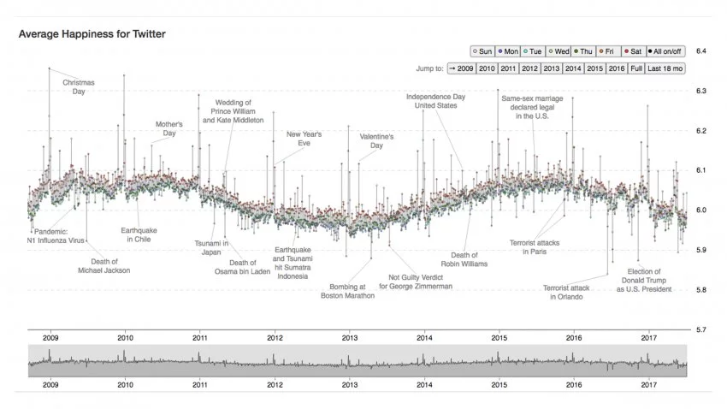

Inside the Lab That's Quantifying Happiness

**
[(L)](https://www.outsideonline.com/1741111/rowan-jacobsen)
[Rowan Jacobsen](https://www.outsideonline.com/1741111/rowan-jacobsen)**

* * *

Aug 11, 2017

## At the University of Vermont, mathematicians in the Computational Story Lab are reading your tweets and learning a lot about our collective well-being

In Mississippi, people tweet about cake and cookies an awful lot; in Colorado, it’s noodles. In Mississippi, the most-tweeted activity is eating; in Colorado, it’s running, skiing, hiking, snowboarding, and biking, in that order. In other words, the two states fall on opposite ends of the behavior spectrum. If you were to assign a caloric value to every food mentioned in every tweet by the citizens of the United States and a calories-burned value to every activity, and then totaled them up, you would find that Colorado tweets the best caloric ratio in the country and Mississippi the worst.

Sure, you’d be forgiven for doubting people’s honesty on Twitter. On those rare occasions when I destroy an entire pint of Ben and Jerry’s, I most assuredly do not tweet about it. Likewise, I don’t reach for my phone every time I strap on a pair of skis.

And yet there’s this: Mississippi has the [worst rate of diabetes and heart disease](https://stateofobesity.org/lists/highest-rates-diabetes/) in the country and [Colorado has the best](https://stateofobesity.org/lists/lowest-rates-adult-obesity/). Mississippi has the [second-highest percentage of obesity](https://stateofobesity.org/lists/highest-rates-diabetes/); Colorado has the lowest. Mississippi has the [worst life expectancy](http://www.businessinsider.com/us-states-with-the-highest-and-lowest-life-expectancy-2017-5) in the country; Colorado is near the top. Perhaps we are being more honest on social media than we think. And perhaps social media has more to tell us about the state of the country than we realize.

That’s the proposition of Peter Dodds and Chris Danforth, who co-direct the University of Vermont’s [Computational Story Lab](https://www.uvm.edu/storylab/), a warren of whiteboards and grad students in a handsome brick building near the shores of Lake Champlain. Dodds and Danforth are applied mathematicians, but they would make a pretty good comedy duo. When I stopped by the lab recently, both were in running clothes and cracking jokes. They have an abundance of curls between them and the wiry energy of chronic thinkers. They came to UVM in 2006 to start the [Vermont Complex Systems Center](https://www.uvm.edu/~cmplxsys/), which crunches big numbers from big systems and looks for patterns. Out of that, they hatched the Computational Story Lab, which sifts through some of that public data to discern the stories we’re telling ourselves. “It took us a while to come up with the name,” Dodds told me as we shotgunned espresso and gazed into his MacBook. “We were going to be the Department of Recreational Truth.”

This year, they teamed up with their PhD student Andy Reagan to launch the [Lexicocalorimeter](http://panometer.org/instruments/lexicocalorimeter/?year=2012&view=dashboard&region=contiguousUS&users=all&state=CO&viz=wordshift), an online tool that uses tweets to compute the calories in and calories out for every state. It’s no mere party trick; the Story Labbers believe the Lexicocalorimeter has important advantages over slower, more traditional methods of gathering health data. “We don’t have to wait to look at statistics at the end of the year,” Danforth says. “This sort of data is available every day. We can tell if a public health campaign to invest in school nutrition is changing the way people talk about food or engage in activities.” For example, what if [Michael Bloomberg’s proposed ban on sodas](http://www.nytimes.com/2012/05/31/nyregion/bloomberg-plans-a-ban-on-large-sugared-drinks.html) larger than 16 ounces had gone through in New York? Using traditional surveys and hospital reports, it would have taken years to measure the impact. But if the Lexicocalorimeter was tuned finely enough to accurately measure the changes in soda habits by neighborhood, then public health officials could use it to target investments and adjust the campaign to reduce obesity far more effectively.

Playing around with the Lexicocalorimeter is illuminating and occasionally horrifying—a glimpse of the unvarnished American character.

Playing around with the Lexicocalorimeter is illuminating and occasionally horrifying—a glimpse of the unvarnished American character. Click on a state, and it displays the 200 words that made the biggest difference in that state’s calorie counts. [In Louisiana](http://panometer.org/instruments/lexicocalorimeter/?year=2012&view=dashboard&region=contiguousUS&users=all&state=LA&viz=wordshift) (#48 in caloric balance), everybody’s eating chocolate, cookies, shrimp, and cake. Everybody’s eating, period. It’s one of the only activities frequently mentioned. In California (#12), they dance, run, hike, and bike, but they rarely sit or lie down. In my home state of [Vermont](http://panometer.org/instruments/lexicocalorimeter/?year=2012&view=dashboard&region=contiguousUS&users=all&state=VT&viz=wordshift), the food on the tip of everybody’s thumbs is bacon, which is probably a big part of why we consume slightly more calories than the average state. (In our defense, we also spend an inordinate amount of time tweeting about beets, broccoli, and bananas.) Despite that, we are fairly exercise obsessed, with—you guessed it—skiing leading the way. ([We crush it on sledding, too.](http://panometer.org/instruments/lexicocalorimeter/activity/?search=sledding)) All this gives us the third-best caloric ratio in the nation, behind Colorado and Wyoming. And sure enough, the health numbers match: We have some of the lowest rates of diabetes and obesity and one of the highest life expectancies.

In general, all states are more alike than we might like to believe. “Watching TV or movie” is the most-tweeted activity for every single state in the union, and “pizza” is the most-tweeted food for every state except Wyoming (cookies) and Mississippi (ice cream). Where a state’s individual character really shines is in the foods and activities mentioned far more or less than average. Texas (#36) can’t stop tweeting about doughnuts; Maine (#5) is hooked on lobster. In activities, the mountain states do a lot of running, the South is a solid block of eating, New Jersey is all about “getting my nails done,” and Delaware distinguishes itself with “talking on the phone.”

Dodds and Danforth acknowledge their methods are not perfect. The butter on the lobster doesn’t get counted. There’s no way of calculating if somebody ran one mile or ten. But when you’re talking tens of millions of tweets per day over the full range of demographics, the inaccuracies even out—at least as much as they do compared to the other, equally flawed ways of measuring society’s eating and exercising habits. As Dodds points out, the numbers speak for themselves: The Lexicocalorimeter correlates extremely well with rates of diabetes and obesity. “The ridiculous thing about this,” he says, “is that it works.”

* * *

We live in strange times. “People leave so much of their id on the web,” Danforth marveled to me, “and they share it openly. That’s enabled a whole host of new instruments to try to understand what’s predictable about our behavior. And it turns out a lot is. As much as we think we’re really complex, people have very structured ways of behaving. The way we move around the earth is very predictable. The way we use language is very predictable.”

For example, Barack Obama’s approval ratings over his presidency strongly correlate with the sentiment of tweets about him *three months in advance* of the approval polls. In other words, if you’d been a savvy politico with a tool for measuring tweets, you’d have had valuable intel months ahead of anyone else. “It’s an amazing time in social science because of the data available,” Dodds says. “It’s opened up a window that we absolutely did not have access to before.”

   
(Courtesy of the Computational Story Lab)

That’s the idea behind the UVM team’s [Hedonometer](http://hedonometer.org/index.html), which surveys the country’s tweets each day and calculates a happiness score for each. The team had people rate 10,000 words on a happiness scale of one (sad) to nine (happy). Most words are neutral. The [happiest words](http://hedonometer.org/words.html) are “laughter” (8.50), “happiness” (8.44), and “love” (8.42). “Hahaha” gets a 7.94, putting it a bit higher than “kisses” (7.74). The biggest negatives are “terrorist” (1.30), “suicide” (1.30), and “rape” (1.44). “Shit” gets a 2.50, “bitch” a 3.14, and “fuck” a surprisingly respectable 4.14. Fuck yeah! “Swearing is really important,” Dodds says.

All this adds up to a [mesmerizing sine wave](http://hedonometer.org/index.html?from=2008-09-10&to=2017-07-10) tracking the nation’s mood from 2009 (the fledging of Twitter) to the present. “One of our goals was to provide a snapshot of the public’s response to something,” Danforth explained, “the texture of the day.” Most regular days fall into a narrow band with an average happiness level around six, though Saturdays are consistently the happiest days of the week and Tuesdays the grumpiest. There’s also a daily pattern, with happiness levels soaring around 5 and 6 a.m., when we’re all newly optimistic about the day, and then plunging throughout the morning and evening as reality sets in, reaching a trough of despair around 11 p.m. “The wheels kind of come off,” says Dodds. “We call it the daily unraveling of the human mind.”

You can also [parse this by state](http://hedonometer.org/maps.html?time=2013&comp=Hawaii). The happiest state is—unsurprisingly—Hawaii. The bottom dwellers are, once again, Mississippi and Louisiana, though Delaware gets a surprising bronze for melancholy. The West is happy, both coastal and mountains, while the South and Midwest are unhappy. Only Tennessee bucks the trend, an island of smiles in a sea of Southern gloom.

The happiest day of the year is always Christmas, when the Hedonometer spikes as words like “Christmas,” “happy,” “family,” and “love” flood the ether. The five unhappiest days since 2009: the shooting at Sandy Hook Elementary School, the Boston Marathon bombings, the Orlando nightclub attack, the shooting of Dallas police officers, and the election of Donald Trump.

National happiness is not consistent. We were quite happy from 2009 to 2011, despite the Great Recession. Then our mood darkened from 2011 to 2014, but we came out of it: The Hedonometer surged! The year 2015 was a relatively joyful one, and the good feelings kept going in 2016—until the election took over. Since then, signs have been growing that something terrible is happening to the American psyche. We’ve never been so erratic, with the normally smooth blips of the Hedonometer starting to twitch like someone failing a lie-detector test. And as of this writing, we’re sinking into an unprecedented malaise.

That is, if you believe the Hedonometer. On the face of it, measuring something as intangible as happiness sounds absurd. Yet, as with the Lexicocalorimeter, the Hedonometer matches “real world” measures such as the [Gallup Well-Being Index](http://www.well-beingindex.com/) (which polls people on things like life satisfaction and personal health) and the [Peace Index](http://visionofhumanity.org/) (which surveys rates of homicides, violent crime, and incarceration).

History is full of concepts—from longitude to time—that seemed imprecise until the right instrument came along. Even temperature, which to us seems objective, was considered unmeasurable for centuries. “People thought you couldn’t do it,” Dodds says. “Because it’s too multifaceted, and the first thermometers were awful.” But eventually our instruments improved.

History is full of concepts—from longitude to time—that seemed imprecise until the right instrument came along.

Dodds and Danforth see no reason why happiness can’t also be quantifiable. “We’re carrying around these phones that are sensing so much of our behavior,” says Danforth. “Tone of voice. Who we talk to. The types of words we use. We’re trying to push on a few areas and see what’s predictable, both on the population scale and for individuals.” And what they’re finding is that our phones have become surprisingly good instruments for taking our emotional temperatures. “Can we tell you’re about to experience an episode of depression based on your social media behavior? Maybe your friends can’t see it, maybe you don’t even realize it, but you’ve started to communicate with a smaller group socially, or you’re not moving around the earth as much.”

By analyzing the tweets of both depressed and healthy individuals, the Story Lab has developed algorithms that can accurately identify depression months before actual diagnoses by mental health practitioners. They’ve even done it with Instagram, discovering that depressed individuals are more likely to post photos that are bluer, grayer, and darker. Their method outperformed professional practitioners at identifying previously undiagnosed depression. The lab is now partnering with a psychiatrist at UVM who hopes to use the algorithm to search the social media history of ER visitors (who give their consent) to predict suicidal behavior.

* * *

One of the clearest signs that the Hedonometer is on to something is how well it works with media besides Twitter. The Story Lab has analyzed the words in 10,000 books and 1,000 movie scripts, and it accurately sorts the feel-goods from the nihilists. [*Sex and the City* is the cheeriest film of all](http://hedonometer.org/movies/ranked-list.html?comp=Sex%20and%20the%20City), powered by words like love, smiles, wedding, beautiful, and, yes, sex. At the bottom of the list we have grim fare like *Commando*, *Day of the Dead*, *The Bourne Ultimatum*, and *Omega Man*.

Yet for grimness, none of those can touch *Outside*’s masterpiece of masochism, “[Bury My Pride at Wounded Knees](https://www.outsideonline.com/1885136/bury-my-pride-wounded-knees),” by Mark Jenkins, about competing in the 2010 Death Race. I asked Reagan, Dodds, and Danforth to take the emotional temperature of 49 [classic *Outside* stories](http://hedonometer.org/showcase/outside/?comp=Because%20It%27s%20There.%20(Sort%20of.)), which run the gamut from Steve Rinella’s joyful paean to Argentinian steak (“Me, Myself, and Ribeye”) to Jenkins’ mudfest, which begins “I unintentionally pitchfork a clod of manure into my mouth” and goes downhill from there.

   
(Courtesy of the Computational Story Lab)

Beyond a piece’s overall happiness score, the Hedonometer allows us to chart its emotional journey. Here’s “[Into Thin Air](http://hedonometer.org/books/v1/?book=Into%20Thin%20Air&refExtent=%5B0.00,1.00%5D&compExtent=%5B0.62,0.68%5D),” perhaps the ultimate *Outside* classic, which starts off happy (Everest adventure!), plunges about a third of the way through the story as Krakauer reaches the perilous Lhotse Face (“It was here that we had our first encounter with death on the mountain”), soars at the halfway point (summit!), and then tanks far and fast as storms move in, mistakes are made, and people die.

Not only does the fall-rise-fall emotional arc of “Into Thin Air” nicely mirror the Himalayas, but it also happens to be a good example of a classic narrative arc. Riffing off [Kurt Vonnegut’s famous talk](https://www.youtube.com/watch?v=oP3c1h8v2ZQ) on the shapes of archetypal stories, the Story Labbers came up with [six arcs](https://www.uvm.edu/storylab/wp-content/uploads/paper-schematic-150.png) that stories tend to follow: Rags-to-Riches (rise), Tragedy (fall), Man-in-a-Hole (fall-rise), Icarus (rise-fall), Cinderella (rise-fall-rise), and Oedipus (fall-rise-fall). Encouragingly, an analysis of the bestseller lists found that the more complex narratives (Cinderella and Oedipus) tend to sell better than the simpler ones.

This fall, the UVM team will be working on teasing even more stories out of the data we share: Can financial crashes be predicted ahead of time? When does fake news trump real news? How does a society settle on the story it tells about itself? The questions are far from trivial. “Humans are storytelling organisms,” Dodds says. It’s how we learn who we are. As the Story Lab gets even better at finding the signals in our noise, let’s hope we like what we discover.

Filed To:[Mindfulness](https://www.outsideonline.com/category/mindfulness)  /  [Fitness](https://www.outsideonline.com/category/fitness)  /  [Media](https://www.outsideonline.com/category/media)  /  [Social Media](https://www.outsideonline.com/category/social-media)  /  [Mississippi](https://www.outsideonline.com/category/mississippi)  /  [Politics](https://www.outsideonline.com/category/politics)  /  [Colorado](https://www.outsideonline.com/category/colorado)  /  [Vermont](https://www.outsideonline.com/category/vermont)