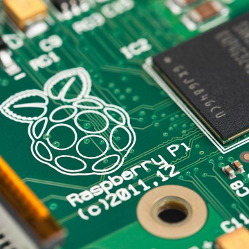

Inside the Raspberry Pi: The story of the $35 computer that changed the world

Inside the Raspberry Pi: The story of the $35 computer that changed the world

https://www.techrepublic.com/article/inside-the-raspberry-pi-the-story-of-the-35-computer-that-changed-the-world/?utm_medium=email&utm_source=topic+optin&utm_campaign=awareness&utm_content=20190105+prog+nl&mkt_tok=eyJpIjoiTmpBM01qTTVZV1ZrTjJZNCIsInQiOiIxQURlRHJENXFzemJzMU53VFU2MnY0RmY0Z3BkS2I1MWFXQU96TnBMVlVkcFwvMkV6eE9mdFwvMVV3WDJnUlRjNGRxSWo4akJqZDAwZGdJdmkxTVltN1dnN3NNWk1OZmZqT2M3eExpN2trdm9Ud3JaRmI0cXUrTlNKa2I1ZUZWQmZsIn0%3D

The co-creators of the credit-card-sized board reveal the many challenges they overcame to build the breakthrough machine.