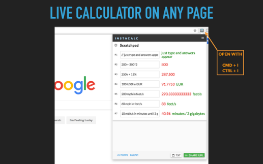

InstaCalc Online Calculator

# The power of a spreadsheet with the ease of a calculator

- [Examples](https://instacalc.com/#examples-start)

- [Key Features](https://instacalc.com/#examples-variables)

- [Unit Conversion](https://instacalc.com/#examples-units)

- [Programming](https://instacalc.com/#examples-programming)

- [Scientific](https://instacalc.com/#examples-scientific)

- [Extras](https://instacalc.com/#examples-extras)

Try typing in the calc below, answers update in real time.

## Getting Started - Simple Budget

3008002102501,56018,720

[powered byinstacalc](https://instacalc.com/50004)[*open_in_new*](https://instacalc.com/50004)

 [Simple Budget](https://instacalc.com/50004)  [Home Loan](https://instacalc.com/50011)  [BMI](https://instacalc.com/1735)  [Unit Conversion](https://instacalc.com/50012)  [Hourly Salary](https://instacalc.com/1738)  [Programming](https://instacalc.com/50008)  [Website Bandwidth](https://instacalc.com/1740)  [Website Earnings](https://instacalc.com/1741)  [Growth Estimation](https://instacalc.com/3402)  [Currency conversion](https://instacalc.com/3841)  [Freelance salary rate](https://instacalc.com/22297)  [Bill Splitting](https://instacalc.com/50083)

## Get the Chrome Extension

[Install the Chrome Extension](https://chrome.google.com/webstore/detail/instacalc/hfoojdaofolilkhakmhicmonbjmkpoai) and get a live calculator on any page: