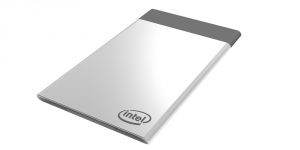

Intel Unveils Compute Card, a Credit Card-Sized Compute Platform

# Intel Unveils Compute Card, a Credit Card-Sized Compute Platform

Today, Intel is announcing a new modular compute platform called the [Intel® Compute Card](http://www.intel.com/ComputeCard) along with a range of partners who will be working with Intel to help accelerate the ecosystem of solutions based on the Intel Compute Card. Intel has been a leader in delivering technology to help realize the benefits of the Internet of Things and enable more smart and connected devices. The Intel Compute Card is being developed with that in mind, to transform the way compute and connectivity can be integrated and used in future devices.

The Intel Compute Card has all the elements of a full computer, including Intel SoC, memory, storage and wireless connectivity with flexible I/O options so hardware manufacturers can optimize for their particular solutions – from interactive refrigerators and smart kiosks to security cameras and IoT gateways. Device makers simply design a standard Intel Compute Card slot into their device and then utilize the best Intel Compute Card for their performance and price needs. This reduces the time and resources needed to design and validate the compute block and helps speed up innovation to bring the power of intelligence into an ever wider range of devices.

**Fact sheet:** [Newly Announced Intel® Compute Card, a Credit Card-Sized Compute Platform](http://newsroom.intel.com/newsroom/wp-content/uploads/sites/11/2017/01/intel-compute-card-fact-sheet.pdf)

Intel is working with a wide range of partners who share our vision that the Intel Compute Card could significantly change the way they and the rest of the industry design and productize a wide range of solutions in the near future. These partners are working to develop products that can take advantage of the simplified design, ease of serviceability and user upgradeability of the Intel Compute Card. Intel is proud to be working with leading global partners, including Dell*, HP*, Lenovo* and Sharp*, to bring this vision to reality. In addition, Intel is working with a range of regional partners who are all looking to bring unique solutions to their respective markets. These early partners include Seneca Data*, InFocus*, Contec DTx*, TabletKiosk* and Pasuntech*.

The Intel Compute Card will be available in mid-2017 and will come with a range of processors options, including the latest [7th Gen Intel® Core™ processors](http://www.intel.com/content/www/us/en/processors/core/core-processor-family.html). For more information and to stay up to date on the Intel Compute Card, visit [www.intel.com/ComputeCard](http://www.intel.com/ComputeCard).

Tags: [Compute Card](https://newsroom.intel.com/tag/compute-card/)

## Other News

 [     March 16, 2017    Helping the World Get Its Game on at Intel Extreme Masters and Beyond](https://newsroom.intel.com/editorials/helping-world-get-game-intel-extreme-masters-beyond/)

 [     March 14, 2017    Intel and TAG Heuer Fuse Style and Innovation with TAG Heuer Connected Modular 45](https://newsroom.intel.com/news/intel-tag-heuer-fuse-style-innovation-tag-heuer-connected-modular-45/)

 [     March 13, 2017    Intel to Acquire Mobileye](https://newsroom.intel.com/news-releases/intel-acquire-mobileye/)