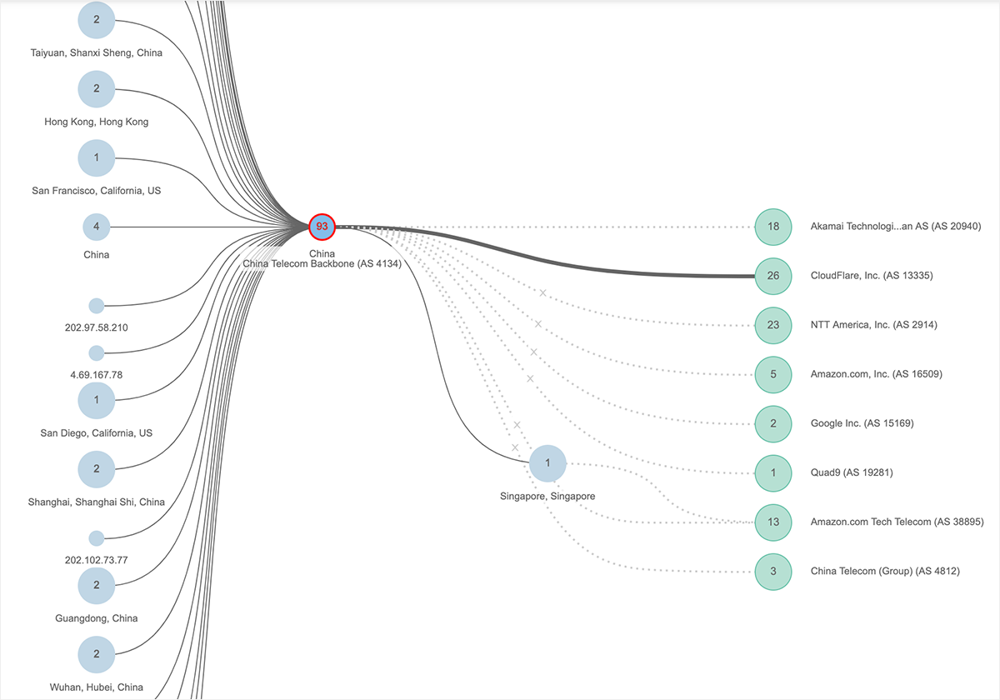
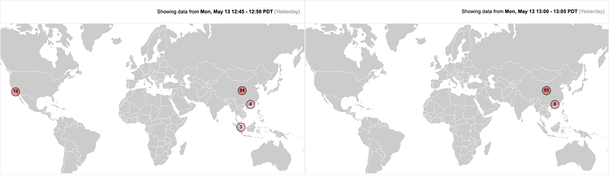
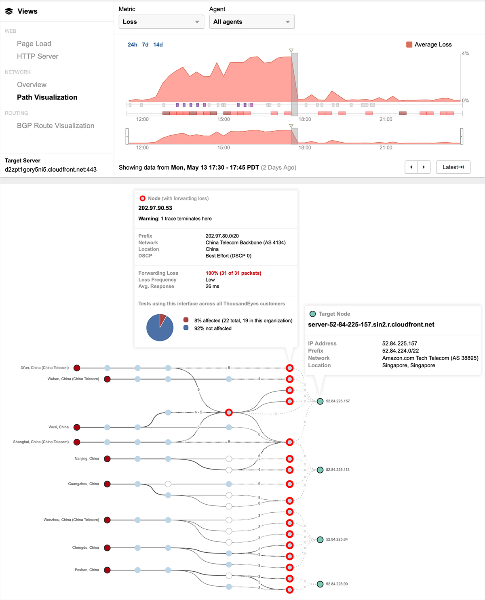

Internet Outage Reveals Reach of China's Connectivity

 [(L)](https://www.thousandeyes.com/)
 [Subscribe]()

- [Product](https://www.thousandeyes.com//product/tour/overview)

- [Solutions](https://www.thousandeyes.com//network-monitoring)

- [Customers](https://www.thousandeyes.com//customers)

- [Resources](https://www.thousandeyes.com//resources)

- [About](https://www.thousandeyes.com//about)

- [Blog](https://blog.thousandeyes.com/)

# Internet Outage Reveals Reach of China’s Connectivity

Posted by [Angelique Medina](https://blog.thousandeyes.com/author/amedina/) on May 14th, 2019

At 12:30 PM PDT on May 13th, China Telecom experienced a significant outage that lasted for nearly five hours, with after effects for some hours further. Coming as it did at a moment of heightened tensions with the United States over trade policies, it may be tempting to jump to speculation about potential geopolitical motivations. However, doing so misses some important foundational realities about China and the Internet that many folks aren’t aware of. This outage is a great opportunity to dig into the state of Chinese Internet connectivity.

## What We Saw

Yesterday, beginning in the early afternoon, our global vantage points started to detect substantial packet loss across China Telecom’s backbone for Internet traffic both entering and exiting China. The packet loss continued sporadically over many hours, primarily impacting network infrastructure in mainland China, but also affecting China Telecom’s network in Singapore and multiple points in the U.S., including Los Angeles.

Over the course of the prolonged outage, any traffic routed through affected infrastructure was dropped, which meant that some Internet users in and outside of China would have experienced service disruptions connecting to various websites and applications. Users in China attempting to reach sites hosted external to China would have been impacted, along with users outside of China trying to connect to sites hosted within China.

Though not exclusively impacting western sites and services, many major U.S. brands, such as Apple, Amazon, Microsoft, Slack, Workday, SAP, and others were impacted over the course of the outage window. The figure below shows a partial scope of the collateral damage of the outage.

Figure 1: Cloud-based services impacted by China Telecom outage.

At its peak, we detected over 100 services disrupted as a result of network conditions in China Telecom’s global backbone. We also detected the shifting geographic impact of the outage, as illustrated by the two heat maps below, captured at separate points during the outage.

Figure 2: Geographic scope of China Telecom outage varied over the outage period.

The most intensive period of the outage occurred within the first three hours after its start at 12:30 PT, but many services continued to be impacted hours later. The extended nature of the outage for one particular service can be seen in figure 3 below. Packet loss to Amazon Web Services begins to spike starting at 12:30 PT and continues for approximately five hours. The path visualization below shows network conditions between 17:30-17:45 PT, when traffic destined for AWS was continuing to get dropped by China Telecom routers.

Figure 3: AWS services impacted between 12:30-17:45 PT for China Telecom users.

Another U.S.-based service impacted by the outage was Cloudflare’s managed DNS service. For example, WeWork’s domain names are hosted by Cloudflare, and in the Path Visualization below you can see that traffic attempting to access Cloudflare’s DNS servers (represented by the green colored node on the far right with IP address 173.245.58.135—which is part of the routed prefix 173.245.58.0/24 that is geolocated in the U.S.) was dropped by China Telecom routers located within China. The result was that many users from within China couldn’t access WeWork sites.

Figure 4: Cloudflare’s managed DNS service impacted, preventing DNS resolution for WeWork domains.

## China is Deeply Interconnected

The outage is now resolved, but at ThousandEyes we believe that every Internet outage is a learning opportunity and this is no exception. There are two takeaways here that may not be generally well understood.

First, most people think about the ‘[Great Firewall](https://blog.thousandeyes.com/deconstructing-great-firewall-china/)’ as a monolithically administered set of rules that keeps China-based users hermetically sealed from the rest of the globe. They imagine that on one side sits China’s vast number of users and the network infrastructure that services them. On the other, the rest of the Internet. But the reality is that China is fairly well connected to external sites and services — at least those that serve commercial interests.

Standard operating procedure across China’s Internet Service Providers (ISPs) allows for access to most western cloud-based business services. Access to these types of sites from within China serves China’s interests by allowing domestic and foreign-based companies to conduct business more effectively. Generally speaking, you can reach many U.S. services from within China.

Secondly, most folks may also not realize that a Chinese ISP would have a global presence. However, as shown in figure 2 above, the scope of infrastructure controlled and managed by China Telecom extends far beyond China’s geographic borders. The provider also maintains global interconnects, peering with service providers in many locations around the globe.

Those readers who recall the [BGP route leak last year that impacted Google’s services](https://blog.thousandeyes.com/internet-vulnerability-takes-down-google/), may remember China Telecom’s guest appearance in that episode. China Telecom was peered with the ISP (MainOne) responsible for the route leak in a Nigerian facility. China Telecom’s failure to filter the advertised route to Google (instead propagating it to its other peers) led to service disruptions for some users trying to reach Google’s services.

## The Internet is Unpredictable Everywhere

Wherever the Internet is, be it in a free-wheeling democracy, or a highly state-controlled environment, it is fundamentally unpredictable. This is due to the way it is constructed as a collection of voluntarily interconnected but separately administered networks, the automated nature of its foundational technologies (such as BGP routing), and the utter lack of centralized operational governance.

When bad things go down in one part of the Internet, particularly in such a consequential country like China, the ripple effect is felt across the rest of the Internet. In this case, over a hundred business services were affected, and no doubt there were productivity and revenue losses as a result.

Businesses today rely on the Internet to a degree that is pretty stunning when you consider how unpredictable it is. It is the ultimate uncontrolled environment. Which begs the question, if you can’t control it directly, do you have the visibility you need to manage it as best as possible?

## Now About That Speculation

Because ThousandEyes is essentially a real-time map of the (always-changing) Internet, we’re able to track Internet outages and their global impact, whether they occur in China, [Russia](https://blog.thousandeyes.com/yandex-packet-loss-ddos-or-russian-firewall/) or elsewhere, but we can’t and won’t speculate on geopolitics and possible motivations (if any) for network events of this kind.

However, it’s worth noting that ISPs in China are well versed in imposing finely grained controls on traffic entering and exiting their networks. If there was an intent to demonstrate an ability to embargo U.S. apps and services, it certainly did not come through very clearly from a technical point of view. After all, the sites and services disrupted were indiscriminate, affecting those hosted both in and outside of China.

## Get Visibility Now

Major Internet outages are a wake-up call for enterprise teams to pay attention to the vast set of external dependencies that businesses rely on. If you don’t have the ability to see deeply into app and network layer conditions beyond your four walls, then when unpredictable things happen across your cloud and Internet ecosystem, you will be in for a rough ride. To stay updated on Internet outages and incidents around the globe, [subscribe to our blog]().

Category:  [Outage Reports](https://blog.thousandeyes.com/category/outage-reports/)

Tags:  [CDN](https://blog.thousandeyes.com/tag/cdn/), [China](https://blog.thousandeyes.com/tag/china/), [Digital Experience](https://blog.thousandeyes.com/tag/digital-experience/), [Digital Operations](https://blog.thousandeyes.com/tag/digital-operations/), [DNS](https://blog.thousandeyes.com/tag/dns/), [Web Performance](https://blog.thousandeyes.com/tag/web-performance/)

Like what you read? Show your appreciation through likes and shares!

[**](https://blog.thousandeyes.com/internet-outage-reveals-reach-of-chinas-connectivity/#)[**](https://blog.thousandeyes.com/internet-outage-reveals-reach-of-chinas-connectivity/#)[**](https://blog.thousandeyes.com/internet-outage-reveals-reach-of-chinas-connectivity/#)

Subscribe to the
Network Intelligence Blog!
Subscribe

[← Back to ThousandEyes Blog](https://blog.thousandeyes.com/)

### You Might Also Like

 [Introducing a New and Optimized Navigation Menu for Faster Insights](https://blog.thousandeyes.com/introducing-new-optimized-navigation-menu/)

 

 [Read more »](https://blog.thousandeyes.com/introducing-new-optimized-navigation-menu/)

 [Don’t Deprecate Your Digital Experience Visibility](https://blog.thousandeyes.com/dont-deprecate-digital-experience-visibility/)

 

 [Read more »](https://blog.thousandeyes.com/dont-deprecate-digital-experience-visibility/)

 [Modern DNS and the Value of One Second](https://blog.thousandeyes.com/modern-dns-and-the-value-of-one-second/)

 

 [Read more »](https://blog.thousandeyes.com/modern-dns-and-the-value-of-one-second/)

- [0 comments]()
- [**ThousandEyes**](https://disqus.com/home/forums/thousandeyes/)
- [Login](https://disqus.com/embed/comments/?base=default&f=thousandeyes&t_i=5318%20https%3A%2F%2Fblog.thousandeyes.com%2F%3Fp%3D5318&t_u=https%3A%2F%2Fblog.thousandeyes.com%2Finternet-outage-reveals-reach-of-chinas-connectivity%2F&t_e=Internet%20Outage%20Reveals%20Reach%20of%20China%E2%80%99s%20Connectivity&t_d=Internet%20Outage%20Reveals%20Reach%20of%20China%E2%80%99s%20Connectivity&t_t=Internet%20Outage%20Reveals%20Reach%20of%20China%E2%80%99s%20Connectivity&s_o=default#)
- [](https://disqus.com/home/inbox/)
- [ Recommend](https://disqus.com/embed/comments/?base=default&f=thousandeyes&t_i=5318%20https%3A%2F%2Fblog.thousandeyes.com%2F%3Fp%3D5318&t_u=https%3A%2F%2Fblog.thousandeyes.com%2Finternet-outage-reveals-reach-of-chinas-connectivity%2F&t_e=Internet%20Outage%20Reveals%20Reach%20of%20China%E2%80%99s%20Connectivity&t_d=Internet%20Outage%20Reveals%20Reach%20of%20China%E2%80%99s%20Connectivity&t_t=Internet%20Outage%20Reveals%20Reach%20of%20China%E2%80%99s%20Connectivity&s_o=default#)
- tTweetfShare
- [Sort by Best](https://disqus.com/embed/comments/?base=default&f=thousandeyes&t_i=5318%20https%3A%2F%2Fblog.thousandeyes.com%2F%3Fp%3D5318&t_u=https%3A%2F%2Fblog.thousandeyes.com%2Finternet-outage-reveals-reach-of-chinas-connectivity%2F&t_e=Internet%20Outage%20Reveals%20Reach%20of%20China%E2%80%99s%20Connectivity&t_d=Internet%20Outage%20Reveals%20Reach%20of%20China%E2%80%99s%20Connectivity&t_t=Internet%20Outage%20Reveals%20Reach%20of%20China%E2%80%99s%20Connectivity&s_o=default#)

Start the discussion…

###### Log in with

-
-
-
-

######  or sign up with Disqus

?

### Disqus is a discussion network

- Disqus never moderates or censors. The rules on this community are its own.
- Don't be a jerk or do anything illegal. Everything is easier that way.

[Read full terms and conditions](https://docs.disqus.com/kb/terms-and-policies/)

Be the first to comment.

- [*✉*Subscribe*✔*](https://disqus.com/embed/comments/?base=default&f=thousandeyes&t_i=5318%20https%3A%2F%2Fblog.thousandeyes.com%2F%3Fp%3D5318&t_u=https%3A%2F%2Fblog.thousandeyes.com%2Finternet-outage-reveals-reach-of-chinas-connectivity%2F&t_e=Internet%20Outage%20Reveals%20Reach%20of%20China%E2%80%99s%20Connectivity&t_d=Internet%20Outage%20Reveals%20Reach%20of%20China%E2%80%99s%20Connectivity&t_t=Internet%20Outage%20Reveals%20Reach%20of%20China%E2%80%99s%20Connectivity&s_o=default#)
- [**Disqus' Privacy Policy](https://help.disqus.com/customer/portal/articles/466259-privacy-policy)

[(L)](https://www.thousandeyes.com/)
 201 Mission Street Suite 1700
 San Francisco, CA USA  94105

USA Sales: [+1 (800) 757-1353](https://blog.thousandeyes.com/internet-outage-reveals-reach-of-chinas-connectivity/tel:18007571353)

[www.thousandeyes.com](https://www.thousandeyes.com/)

Categories
[Case Studies](https://blog.thousandeyes.com/category/case-studies/)
[Company News](https://blog.thousandeyes.com/category/culture/)
[Engineering](https://blog.thousandeyes.com/category/engineering/)
[Industry](https://blog.thousandeyes.com/category/cloud/)
[Outage Reports](https://blog.thousandeyes.com/category/outage-reports/)
[Product](https://blog.thousandeyes.com/category/product/)
Follow Us
[** Facebook](https://www.facebook.com/ThousandEyes)
[** Twitter](https://www.twitter.com/thousandeyes)
[** LinkedIn](https://www.linkedin.com/company/thousandeyes)
[** YouTube](https://www.youtube.com/channel/UCMEp56ebIP6sIFJgU6iVv8A)

Subscribe

Stay connected with blog updates and outage reports delivered while they're still fresh.

Subscribe

© 2019 ThousandEyes Inc. All Rights Reserved.

 [Terms of Use](https://www.thousandeyes.com//website-terms-of-use) | [Privacy Policy](https://www.thousandeyes.com//trust/privacy)

