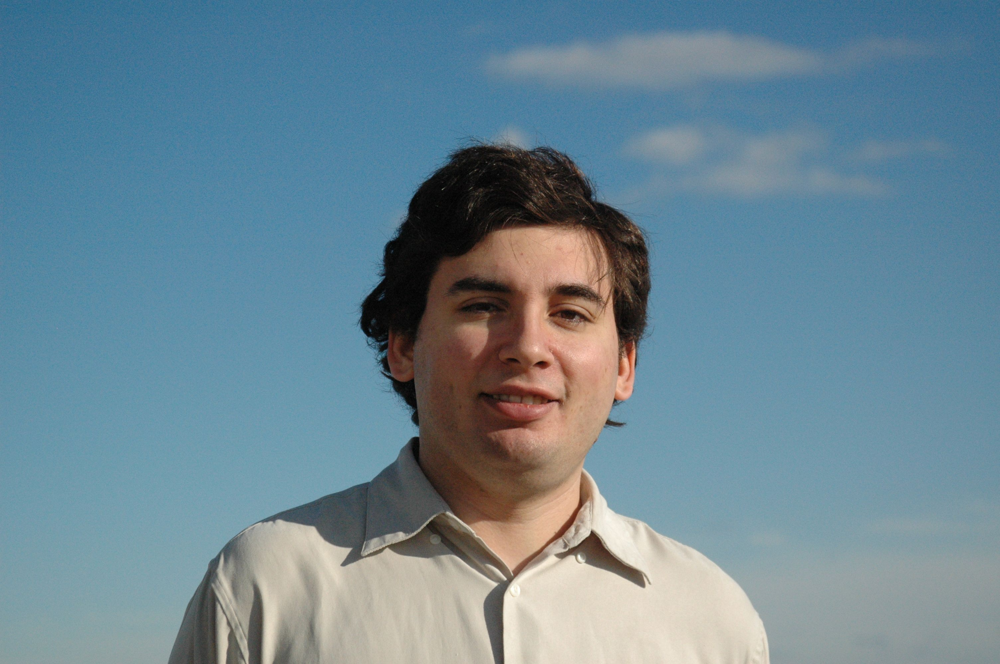

Interview With Joe Blitzstein · Simply Statistics

# Interview With Joe Blitzstein

 **Joe Blitzstein**

Joe Blitzstein is [Professor of the Practice in Statistics](http://news.harvard.edu/gazette/story/2011/11/the-lasting-lure-of-logic/) at Harvard University and co-director of the graduate program. He moved to Harvard after obtaining his Ph.D. with Persi Diaconis at Stanford University. Since joining the faculty at Harvard, he has been immortalized in Youtube prank videos, been awarded a “favorite professor” distinction four times, and performed interesting research on the statistical analysis of social networks. Joe was also the first person to discover our blog on Twitter. You can find more information about him on his [personal website](http://www.people.fas.harvard.edu/~blitz/Site/Home.html). Or check out his Stat 110 class, now available [from iTunes](http://itunes.apple.com/WebObjects/MZStore.woa/wa/viewPodcast?id=495213607)!

 **Which term applies to you: data scientist/statistician/****analyst?**
Statistician, but that should and does include working with data! I
think statistics at its best interweaves modeling, inference,
prediction, computing, exploratory data analysis (including
visualization), and mathematical and scientific thinking. I don’t
think “data science” should be a separate field, and I’m concerned
about people working with data without having studied much statistics
and conversely, statisticians who don’t consider it important ever to
look at real data. I enjoyed the discussions by Drew Conway and on
your blog (athttp://www.drewconway.com/zia/?p=2378and
http://simplystatistics.tumblr.com/post/11271228367/datascientist)
and think the relationships between statistics, machine learning, data
science, and analytics need to be clarified.
 **How did you get into statistics/data science (e.g. your history)?**
I always enjoyed math and science, and became a math major as an
undergrad Caltech partly because I love logic and probability and
partly because I couldn’t decide which science to specialize in. One
of my favorite things about being a math major was that it felt so
connected to everything else: I could often help my friends who were
doing astronomy, biology, economics, etc. with problems, once they had
explained enough so that I could see the essential pattern/structure
of the problem. At the graduate level, there is a tendency for math to
become more and more disconnected from the rest of science, so I was
very happy to discover that statistics let me regain this, and have
the best of both worlds: you can apply statistical thinking and tools
to almost anything, and there are so many opportunities to do things
that are both beautiful and useful.
 **Who were really good mentors to you? What were the qualities that really**
**helped you?**
I’ve been extremely lucky that I have had so many inspiring
colleagues, teachers, and students (far too numerous to list), so I
will just mention three. My mother, Steffi, taught me at an early age
to love reading and knowledge, and to ask a lot of “what if?”
questions. My PhD advisor, Persi Diaconis, taught me many beautiful
ideas in probability and combinatorics, about the importance of
starting with a simple nontrivial example, and to ask a lot of “who
cares?” questions. My colleague Carl Morris taught me a lot about how
to think inferentially (Brad Efron called Carl a “natural”
statistician in his interview at
http://www-stat.stanford.edu/~ckirby/brad/other/2010Significance.pdf,
by which I think he meant that valid inferential thinking does not
come naturally to most people), about parametric and hierarchical
modeling, and to ask a lot of “does that assumption make sense in the
real world?” questions.
 **How do you get students fired up about statistics in your classes?**
Statisticians know that their field is both incredibly useful in the
real world and exquisitely beautiful aesthetically. So why isn’t that
always conveyed successfully in courses? Statistics is often
misconstrued as a messy menagerie of formulas and tests, rather than a
coherent approach to scientific reasoning based on a few fundamental
principles. So I emphasize thinking and understanding rather than
memorization, and try to make sure everything is well-motivated and
makes sense both mathematically and intuitively. I talk a lot about
paradoxes and results which at first seem counterintuitive, since
they’re fun to think about and insightful once you figure out what’s
going on.
And I emphasize what I call “stories,” by which I mean an
application/interpretation that does not lose generality. As a simple
example, if X is Binomial(m,p) and Y is Binomial(n,p) independently,
then X+Y is Binomial(m+n,p). A story proof would be to interpret X as
the number of successes in m Bernoulli trials and Y as the number of
successes in n different Bernoulli trials, so X+Y is the number of
successes in the m+n trials. Once you’ve thought of it this way,
you’ll always understand this result and never forget it. A
misconception is that this kind of proof is somehow less rigorous than
an algebraic proof; actually, rigor is determined by the logic of the
argument, not by how many fancy symbols and equations one writes out.
My undergraduate probability course, Stat 110, is now worldwide
viewable for free on iTunes U at
http://itunes.apple.com/WebObjects/MZStore.woa/wa/viewPodcast?id=495213607
with 34 lecture videos and about 250 practice problems with solutions.
I hope that will be a useful resource, but in any case looking through
those materials says more about my teaching style than anything I can
write here does.
**What are your main research interests these days?**
I’m especially interested in the statistics of networks, with
applications to social network analysis and in public health. There is
a tremendous amount of interest in networks these days, coming from so
many different fields of study, which is wonderful but I think there
needs to be much more attention devoted to the statistical issues.
Computationally, most network models are difficult to work with since
the space of all networks is so vast, and so techniques like Markov
chain Monte Carlo and sequential importance sampling become crucial;
but there remains much to do in making these algorithms more efficient
and in figuring out whether one has run them long enough (usually the
answer is “no” to the question of whether one has run them long
enough). Inferentially, I am especially interested in how to make
valid conclusions when, as is typically the case, it is not feasible
to observe the full network. For example, respondent-driven sampling
is a link-tracing scheme being used all over the world these days to
study so-called “hard-to-reach” populations, but much remains to be
done to know how best to analyze such data; I’m working on this with
my student Sergiy Nesterko. With other students and collaborators I’m
working on various other network-related problems. Meanwhile, I’m also
finishing up a graduate probability book with Carl Morris,
“Probability for Statistical Science,” which has quite a few new
proofs and perspectives on the parts of probability theory that are
most useful in statistics.
 **You have been immortalized in several Youtube videos. Do you think this**
**helped make your class more “approachable”?**
There were a couple strange and funny pranks that occurred in my first
year at Harvard. I’m used to pranks since Caltech has a long history
and culture of pranks, commemorated in several “Legends of Caltech”
volumes (there’s even a movie in development about this), but pranks
are quite rare at Harvard. I try to make the class approachable
through the lectures and by making sure there is plenty of support,
help, and encouragement is available from the teaching assistants and
me, not through YouTube, but it’s fun having a few interesting
occasions from the history of the class commemorated there.