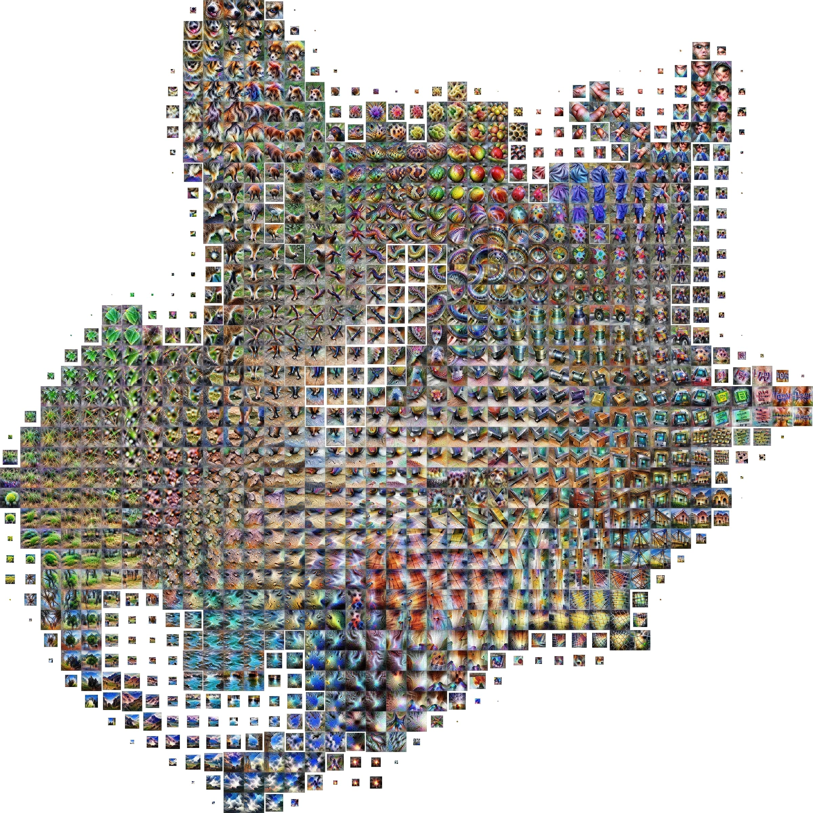
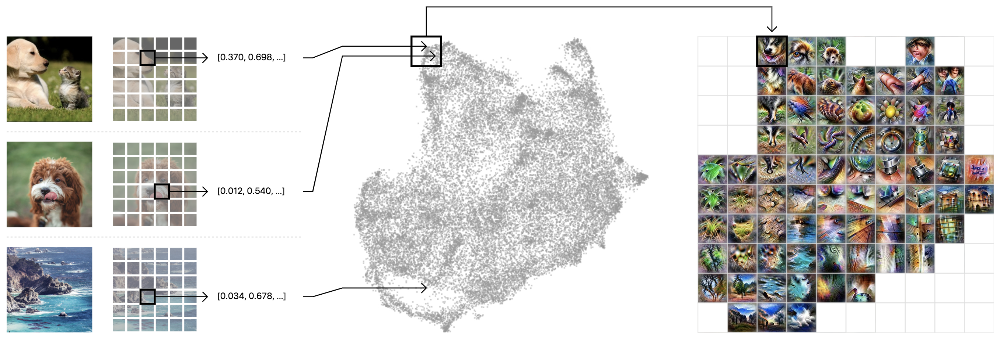

Introducing Activation Atlases

 ![](data:image/svg+xml,%3csvg xmlns='http://www.w3.org/2000/svg' class='icon js-evernote-checked' width='100%25' height='100%25' viewBox='0 0 330 418' preserveAspectRatio='none' data-evernote-id='66'%3e %3cpath d='M103.728-104.851a20.335%2c20.335%2c0%2c0%2c0-13.505%2c0L-16.926-60.458a20.338%2c20.338%2c0%2c0%2c0-9.549%2c9.55L-70.851%2c56.249a20.338%2c20.338%2c0%2c0%2c0%2c0%2c13.506L-26.458%2c176.9a20.343%2c20.343%2c0%2c0%2c0%2c9.551%2c9.55L90.249%2c230.828a20.336%2c20.336%2c0%2c0%2c0%2c13.505%2c0L210.9%2c186.435a20.337%2c20.337%2c0%2c0%2c0%2c9.549-9.55L264.828%2c69.729a20.336%2c20.336%2c0%2c0%2c0%2c0-13.505L220.435-50.926a20.337%2c20.337%2c0%2c0%2c0-9.551-9.549Z' data-evernote-id='281' class='js-evernote-checked'%3e%3c/path%3e%3cpath d='M186.713%2c201.118a20.332%2c20.332%2c0%2c0%2c0-13.506%2c0l-107.16%2c44.4a20.342%2c20.342%2c0%2c0%2c0-9.55%2c9.551L12.117%2c362.232a20.341%2c20.341%2c0%2c0%2c0%2c0%2c13.507L56.515%2c482.9a20.335%2c20.335%2c0%2c0%2c0%2c9.551%2c9.55l107.166%2c44.38a20.334%2c20.334%2c0%2c0%2c0%2c13.507%2c0l107.159-44.4a20.339%2c20.339%2c0%2c0%2c0%2c9.55-9.552l44.38-107.166a20.338%2c20.338%2c0%2c0%2c0%2c0-13.506l-44.4-107.16a20.343%2c20.343%2c0%2c0%2c0-9.552-9.55Z' data-evernote-id='282' class='js-evernote-checked'%3e%3c/path%3e %3c/svg%3e)

# Introducing Activation Atlases

  March 6, 2019

We’ve created [a*ctivation atlases*](https://distill.pub/2019/activation-atlas)*  *(in [collaboration](https://ai.googleblog.com/2019/03/exploring-neural-networks.html) with Google researchers), a new technique for visualizing what interactions between neurons can represent. As AI systems are deployed in increasingly sensitive contexts, having a better understanding of their internal decision-making processes will let us identify weaknesses and investigate failures.

[Read Paper](https://distill.pub/2019/activation-atlas)[View Code](https://github.com/tensorflow/lucid/#activation-atlas-notebooks)[Try Demo](https://distill.pub/2019/activation-atlas/app.html)

Modern neural networks are [often](https://www.technologyreview.com/s/604087/the-dark-secret-at-the-heart-of-ai/)  [criticized](https://www.nytimes.com/2017/11/21/magazine/can-ai-be-taught-to-explain-itself.html) as being a “black box.” Despite their success at a variety of problems, we have a limited understanding of how they make decisions internally. Activation atlases are a new way to see some of what goes on inside that box.

 

An activation atlas of the InceptionV1 vision classification network reveals many fully realized features, such as electronics, buildings, food, animal ears, plants, and watery backgrounds. [Explore it ➞](https://distill.pub/2019/activation-atlas/app.html)

Activation atlases build on feature visualization, a technique for studying what the hidden layers of neural networks can represent. [Early](https://pdfs.semanticscholar.org/65d9/94fb778a8d9e0f632659fb33a082949a50d3.pdf)  [work](https://arxiv.org/pdf/1312.6034v2.pdf) in feature visualization primarily focused on [individual neurons](https://distill.pub/2017/feature-visualization/). By collecting hundreds of thousands of examples of neurons interacting and visualizing those, activation atlases move from individual neurons to visualizing the space those neurons jointly represent.

 
Collect a million activation vectors from different training examples.

Arrange them in 2D so that similar ones are close together.

Impose a grid and use feature visualization on the average of each cell.

Understanding what’s going on inside neural nets isn’t solely a question of scientific curiosity — our lack of understanding handicaps our ability to audit neural networks and, in high stakes contexts, ensure they are safe. Normally, if one was going to deploy a critical piece of software one could review all the paths through the code, or even do formal verification, but with neural networks, our ability to do this kind of review has presently been much more limited. With activation atlases humans can discover unanticipated issues in neural networks — for example, places where the network is relying on spurious correlations to classify images, or where re-using a feature between two classes leads to strange bugs. Humans can even use this understanding to “[attack](https://arxiv.org/pdf/1312.6199.pdf)” the model, modifying images to fool it.

For example, a special kind of activation atlas can be created to show how a network tells apart frying pans and woks. Many of the things we see are what one expects. Frying pans are more squarish, while woks are rounder and deeper. But it also seems like the model has learned that frying pans and woks can also be distinguished by food around them — in particular, wok is supported by the presence of noodles. Adding noodles to the corner of the image will fool the model 45% of the time! This is similar to work like [adversarial patches](https://arxiv.org/pdf/1712.09665.pdf), but based on human understanding.

 

InceptionV1 partly relies on the presence of noodles to distinguish woks from frying pans. Adding noodles fools the model 45% of the time. More examples can be found in [the paper](https://distill.pub/2019/activation-atlas).

Other human-designed attacks based on the network overloading certain feature detectors are often more effective (some succeed as often as 93% of the time). But the noodle example is particularly interesting because it’s a case of the model picking up on something that is correlated, but not causal, with the correct answer. This has structural similarities to types of errors we might be particularly worried about, such as fairness and bias issues.

Activation atlases worked better than we anticipated and seem to strongly suggest that neural network activations can be meaningful to humans. This gives us increased optimism that it is possible to achieve interpretability in vision models in a strong sense.

We’re excited to have done this work in [collaboration](https://ai.googleblog.com/2019/03/exploring-neural-networks.html) with researchers at Google. We believe that working together on safety-relevant research helps us all ensure the best outcome for society as AI research progresses.

*Want to make neural networks not be a black box? [Apply](https://openai.com/jobs/) to work at OpenAI.*

  Thanks to our co-authors at Google: Shan Carter, Zan Armstrong and Ian Johnson.

  Thanks to Greg Brockman, Dario Amodei, Jack Clark and Ashley Pilipiszyn for feedback on this blog post.

  We also thank Christian Howard for his help in coordination from the Google side, Phillip Isola for being Distill’s acting editor and Arvind Satyanarayan for feedback on our paper.

 By  [Chris Olah](https://blog.openai.com/tag/chris-olah/) & [Ludwig Schubert](https://blog.openai.com/tag/ludwig-schubert/).

 [Tweet](https://twitter.com/intent/tweet?text=Introducing%20Activation%20Atlases&url=https://blog.openai.com/introducing-activation-atlases/)  [Share](https://www.facebook.com/sharer/sharer.php?u=https://blog.openai.com/introducing-activation-atlases/)