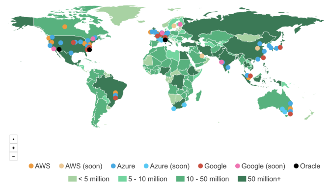

Introducing ZoneCheckr—View Regions and Zones of Major Cloud Platforms on One Map

- [Platform](https://cloudcheckr.com/platform/)
- [Solutions](https://cloudcheckr.com/solutions/)
- [Partners](https://cloudcheckr.com/partners/)
- [Pricing](https://cloudcheckr.com/pricing/)
- [Resources](https://cloudcheckr.com/resources/)
- [Customers](https://cloudcheckr.com/customers/)
- [Login](https://app.cloudcheckr.com/LogOn)
- [Get Started](https://cloudcheckr.com/getstarted)

****

 [****](https://twitter.com/share?url=https://cloudcheckr.com/2017/10/introducing-zonecheckr-find-regions-and-availability-zones/) [****](https://www.linkedin.com/shareArticle?mini=true&url=https://cloudcheckr.com/2017/10/introducing-zonecheckr-find-regions-and-availability-zones/&title=Introducing%20ZoneCheckr,%20A%20Free%20Tool%20to%20View%20Regions%20and%20Zones%20of%20Major%20Cloud%20Platforms%20on%20One%20Map&summary=&source=) [****](https://cloudcheckr.com/2017/10/introducing-zonecheckr-find-regions-and-availability-zones/?__s=3fkoduuc9tgamqdem1jemailto:?Subject=CloudCheckr:%20Introducing%20ZoneCheckr,%20A%20Free%20Tool%20to%20View%20Regions%20and%20Zones%20of%20Major%20Cloud%20Platforms%20on%20One%20Map&Body=https://cloudcheckr.com/2017/10/introducing-zonecheckr-find-regions-and-availability-zones/)

|Article|Amazon Web Services|October 23, 2017

# Introducing ZoneCheckr, A Free Tool to View Regions and Zones of Major Cloud Platforms on One Map

It can be tricky trying to decide where to host your instances, databases and storage. Gartner estimates there are over 1.7 million decisions to make when choosing EC2 instances from Amazon Web Services. Add the options for Microsoft Azure, Google Cloud and others, and it can seem like an insurmountable process. To help, CloudCheckr has created [ZoneCheckr](http://zonecheckr.com/), a free web-based app that helps you visualize where the major cloud providers offer computing zones. By putting all of these zones on a single map, you can be more informed when you decide where to place your resources.

They say a picture is worth a thousand words, so an interactive picture must be worth even more! [ZoneCheckr](http://zonecheckr.com/) lets you toggle on or off specific cloud platforms to customize your view. Plus you can click on any country to see the population so you can make better decisions about how to serve your customers.

# [ZoneCheckr.com](http://zonecheckr.com/)

Putting together this map was an interesting process. Some of the early observations follow:

- ○If you want to serve more than one billion potential customers in India, it looks like only AWS and Microsoft Azure are focusing there, both with regions in Mumbai. but Azure also has regions in Central and Southern India. Google has plans for India too.
- ○The entire continent of Africa is underserved, but Azure has plans to open two regions in South Africa soon.
- ○Oracle has a long way to go, with only two regions in the US and one in Europe.
- ○In South America, Saõ Paulo, Brazil seems to be the place to be, with AWS, Azure and Google all sharing a presence there.
- ○Similarly, Sydney, Australia is well-represented by AWS, Azure and Google.
- ○China is tricky to serve, as the government has significant restrictions. American corporations have to walk a fine line, with regions in places like Hong Kong and Shanghai. Technically, Microsoft does have a region in Beijing, but due to China’s regulations, that facility is owned and operated by a Chinese firm under license from Microsoft. Businesses have to think twice about hosting their proprietary data in a region where the government could gain access to that data.

Of course, the Internet is global, so you could host all of your infrastructure in one country or even one region and service the rest of the world, but the latency of cross-country or even undersea cables can have an impact. And the recent natural disasters should certainly influence your decision making. Additionally, governments may insist on local hosting, especially when dealing with sensitive data. Finally, it’s worth noting that most cloud providers do not provide the exact locations of their data centers, for security reasons, but this map should be pretty accurate. We also had to artificially reposition some coordinates so each vendor would be visible, such as in Saõ Paulo and Sydney.

- [1 comment]()
- [**CloudCheckr**](https://disqus.com/home/forums/cloudcheckr/)
- [(L)](https://disqus.com/embed/comments/?base=default&f=cloudcheckr&t_i=12458&t_u=https%3A%2F%2Fcloudcheckr.com%2F2017%2F10%2Fintroducing-zonecheckr-find-regions-and-availability-zones%2F&t_d=Regions%20and%20Availability%20Zones%20Free%20Tool%20for%20AWS%2C%20Azure%2C%20Google%2C%20Oracle&t_t=Regions%20and%20Availability%20Zones%20Free%20Tool%20for%20AWS%2C%20Azure%2C%20Google%2C%20Oracle&s_o=default#)
- [](https://disqus.com/home/inbox/)
- [ Recommend](https://disqus.com/embed/comments/?base=default&f=cloudcheckr&t_i=12458&t_u=https%3A%2F%2Fcloudcheckr.com%2F2017%2F10%2Fintroducing-zonecheckr-find-regions-and-availability-zones%2F&t_d=Regions%20and%20Availability%20Zones%20Free%20Tool%20for%20AWS%2C%20Azure%2C%20Google%2C%20Oracle&t_t=Regions%20and%20Availability%20Zones%20Free%20Tool%20for%20AWS%2C%20Azure%2C%20Google%2C%20Oracle&s_o=default#)
- [⤤  Share](https://disqus.com/embed/comments/?base=default&f=cloudcheckr&t_i=12458&t_u=https%3A%2F%2Fcloudcheckr.com%2F2017%2F10%2Fintroducing-zonecheckr-find-regions-and-availability-zones%2F&t_d=Regions%20and%20Availability%20Zones%20Free%20Tool%20for%20AWS%2C%20Azure%2C%20Google%2C%20Oracle&t_t=Regions%20and%20Availability%20Zones%20Free%20Tool%20for%20AWS%2C%20Azure%2C%20Google%2C%20Oracle&s_o=default#)
- [Sort by Best](https://disqus.com/embed/comments/?base=default&f=cloudcheckr&t_i=12458&t_u=https%3A%2F%2Fcloudcheckr.com%2F2017%2F10%2Fintroducing-zonecheckr-find-regions-and-availability-zones%2F&t_d=Regions%20and%20Availability%20Zones%20Free%20Tool%20for%20AWS%2C%20Azure%2C%20Google%2C%20Oracle&t_t=Regions%20and%20Availability%20Zones%20Free%20Tool%20for%20AWS%2C%20Azure%2C%20Google%2C%20Oracle&s_o=default#)

Join the discussion…

- [Attach](https://disqus.com/embed/comments/?base=default&f=cloudcheckr&t_i=12458&t_u=https%3A%2F%2Fcloudcheckr.com%2F2017%2F10%2Fintroducing-zonecheckr-find-regions-and-availability-zones%2F&t_d=Regions%20and%20Availability%20Zones%20Free%20Tool%20for%20AWS%2C%20Azure%2C%20Google%2C%20Oracle&t_t=Regions%20and%20Availability%20Zones%20Free%20Tool%20for%20AWS%2C%20Azure%2C%20Google%2C%20Oracle&s_o=default#)

-

 [Daniel Ehrlich](https://disqus.com/by/danielehrlich/)    •  [3 days ago](https://cloudcheckr.com/2017/10/introducing-zonecheckr-find-regions-and-availability-zones/?__s=3fkoduuc9tgamqdem1je#comment-3582696741)

Oracle Cloud needs to be updated. This is the correct link which has some additional regions: [https://cloud.oracle.com/da...](https://disq.us/url?url=https%3A%2F%2Fcloud.oracle.com%2Fdata-regions%3AmM6bbGUfKQx739Y3ng0KR9_WgQA&cuid=5070370).

Looks great and thanks for making and posting all.

    - [−](https://disqus.com/embed/comments/?base=default&f=cloudcheckr&t_i=12458&t_u=https%3A%2F%2Fcloudcheckr.com%2F2017%2F10%2Fintroducing-zonecheckr-find-regions-and-availability-zones%2F&t_d=Regions%20and%20Availability%20Zones%20Free%20Tool%20for%20AWS%2C%20Azure%2C%20Google%2C%20Oracle&t_t=Regions%20and%20Availability%20Zones%20Free%20Tool%20for%20AWS%2C%20Azure%2C%20Google%2C%20Oracle&s_o=default#)
    - [****](https://disqus.com/embed/comments/?base=default&f=cloudcheckr&t_i=12458&t_u=https%3A%2F%2Fcloudcheckr.com%2F2017%2F10%2Fintroducing-zonecheckr-find-regions-and-availability-zones%2F&t_d=Regions%20and%20Availability%20Zones%20Free%20Tool%20for%20AWS%2C%20Azure%2C%20Google%2C%20Oracle&t_t=Regions%20and%20Availability%20Zones%20Free%20Tool%20for%20AWS%2C%20Azure%2C%20Google%2C%20Oracle&s_o=default#)

## Also on **CloudCheckr**

- [

### Visualize Your Ideal Cloud Configuration Using Migrate in CloudCheckr for VMware

    - 1 comment •

    - 2 months ago

[ John C Smith — Great read! I will be sharing this with all the people I call on that are moving to the cloud.](http://disq.us/?url=http%3A%2F%2Fcloudcheckr.com%2F%3Fp%3D11848&key=EdNSoqgF5PHKDEP-nYAHmQ)](http://disq.us/?url=http%3A%2F%2Fcloudcheckr.com%2F%3Fp%3D11848&key=EdNSoqgF5PHKDEP-nYAHmQ)

- [

### Throwback to AWS London Summit: A Chat with AWS for Business

    - 1 comment •

    - 3 months ago

[ Chidi Oparah — Brilliant write up... thanks](http://disq.us/?url=http%3A%2F%2Fcloudcheckr.com%2F%3Fp%3D11140&key=n56NcM5EYQ860FRIPUsomg)](http://disq.us/?url=http%3A%2F%2Fcloudcheckr.com%2F%3Fp%3D11140&key=n56NcM5EYQ860FRIPUsomg)

- [Powered by Disqus](https://disqus.com/)
- [*✉*Subscribe*✔*](https://disqus.com/embed/comments/?base=default&f=cloudcheckr&t_i=12458&t_u=https%3A%2F%2Fcloudcheckr.com%2F2017%2F10%2Fintroducing-zonecheckr-find-regions-and-availability-zones%2F&t_d=Regions%20and%20Availability%20Zones%20Free%20Tool%20for%20AWS%2C%20Azure%2C%20Google%2C%20Oracle&t_t=Regions%20and%20Availability%20Zones%20Free%20Tool%20for%20AWS%2C%20Azure%2C%20Google%2C%20Oracle&s_o=default#)
- [*d*Add Disqus to your site](https://publishers.disqus.com/engage?utm_source=cloudcheckr&utm_medium=Disqus-Footer)
- [*🔒*Privacy](https://help.disqus.com/customer/portal/articles/466259-privacy-policy)

## Related Resources

[   ](https://cloudcheckr.com/2017/10/how-resellers-can-use-automation-to-increase-success-in-the-cloud/)

|Article|October 26, 2017

###### [How MSPs, CSPs and Resellers Use Automation to Increase Success in the Cloud](https://cloudcheckr.com/2017/10/how-resellers-can-use-automation-to-increase-success-in-the-cloud/)

[   ](https://cloudcheckr.com/news/zonecheckr-enhancements/)
|News|October 24, 2017

###### [ZoneCheckr Just One of This Week’s Many Insightful Enhancements](https://cloudcheckr.com/news/zonecheckr-enhancements/)

[   ](https://cloudcheckr.com/2017/10/introducing-zonecheckr-find-regions-and-availability-zones/)

|Article|October 23, 2017

###### [Introducing ZoneCheckr, A Free Tool to View Regions and Zones of Major Cloud Platforms on One Map](https://cloudcheckr.com/2017/10/introducing-zonecheckr-find-regions-and-availability-zones/)

## Ready to Explore CloudCheckr?

Start a free 14-day trial or request a personalized demo to understand how CloudCheckr can help you optimize and automate your cloud.

[Start a Trial](https://app.cloudcheckr.com/)[Request a Demo](https://cloudcheckr.com/demo/)

1-833-CLDCHCK
342 N. Goodman St
Rochester, NY 14607

- [****](https://www.linkedin.com/organization/3178533)
- [****](https://www.facebook.com/CloudCheckr/)
- [****](https://twitter.com/cloudcheckr)
- [Company](https://cloudcheckr.com/2017/10/introducing-zonecheckr-find-regions-and-availability-zones/?__s=3fkoduuc9tgamqdem1je#)
    - [About](https://cloudcheckr.com/company/)
    - [Blog](https://cloudcheckr.com/resources/?type=article)
    - [Careers](https://cloudcheckr.com/careers/)
    - [Contact](https://cloudcheckr.com/connect)
- [Useful Links](https://cloudcheckr.com/2017/10/introducing-zonecheckr-find-regions-and-availability-zones/?__s=3fkoduuc9tgamqdem1je#)
    - [Support](http://support.cloudcheckr.com/)
    - [Resources](https://cloudcheckr.com/resources/)
    - [Videos](https://cloudcheckr.com/resources/?type=video)
    - [FAQs](https://support.cloudcheckr.com/help/cloudcheckr-faq/)
- [Legal](https://cloudcheckr.com/2017/10/introducing-zonecheckr-find-regions-and-availability-zones/?__s=3fkoduuc9tgamqdem1je#)
    - [End User License Agreement](https://cloudcheckr.com/end-user-license-agreement/)
    - [Service License](https://cloudcheckr.com/service-license/)
    - [Data Security](https://cloudcheckr.com/data-security/)
    - [Privacy Policy](https://cloudcheckr.com/privacy-policy/)
    - [Master Service Agreement](http://info.cloudcheckr.com/l/138111/2017-04-19/25cc1v/138111/38761/CloudCheckr_MSA__Pro_04_12_2016__1___1_.pdf)

*** *

Contact us!
a small down arrow to minimize chat box
We're not around, but we'll get back to you as soon as possible.
Your Namesignifies that this field can not be left blank
Your Emailsignifies that this field can not be left blank
Your Phone Number

We're online 7am-7pm EST. Leave us a note with any questions you may have and the appropriate person will reach out to you!

signifies that this field can not be left blank

[(L)](https://disqus.com/home/)[✔](https://www.surveymonkey.com/s/MMWLGSR?u=237923038)[>](https://help.disqus.com/)

[Close✕](https://disqus.com/home/preload/?utm_source=disqus_embed#)[View on Disqus⏍](https://disqus.com/home/preload/?utm_source=disqus_embed#)