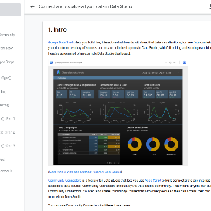

Introducing the Data Studio Community Connector Codelab

Introducing the Data Studio Community Connector Codelab

https://developers.googleblog.com/2018/05/introducing-data-studio-community.html

Data Studio is Google's free next gen business intelligence and data visualization platform. Community Connectors for Data Studio let you build connectors to any internet-accessible data source using Google Apps Script. You can build Community Connectors for commercial, enterprise, and personal use. Learn how to build Community Connectors using the Data Studio Community Connector Codelab.