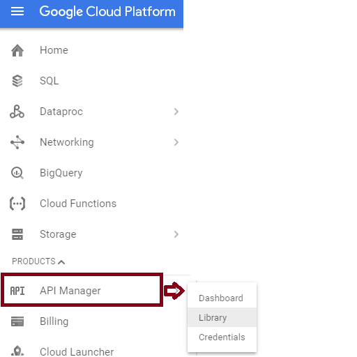
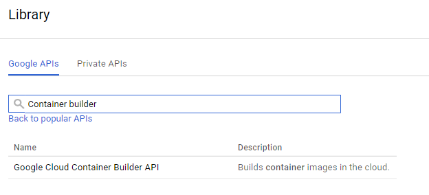
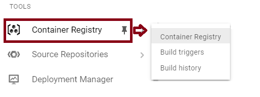
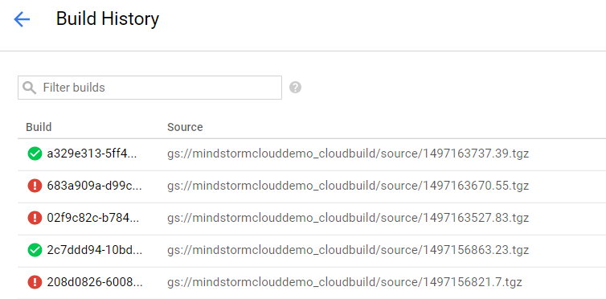
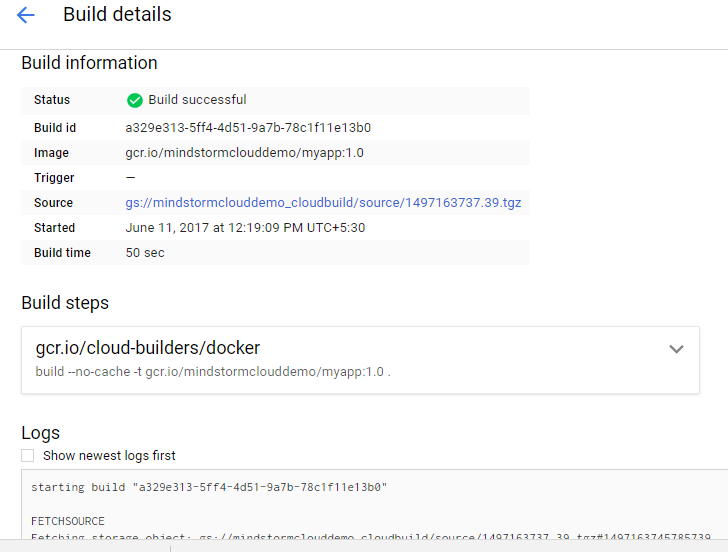
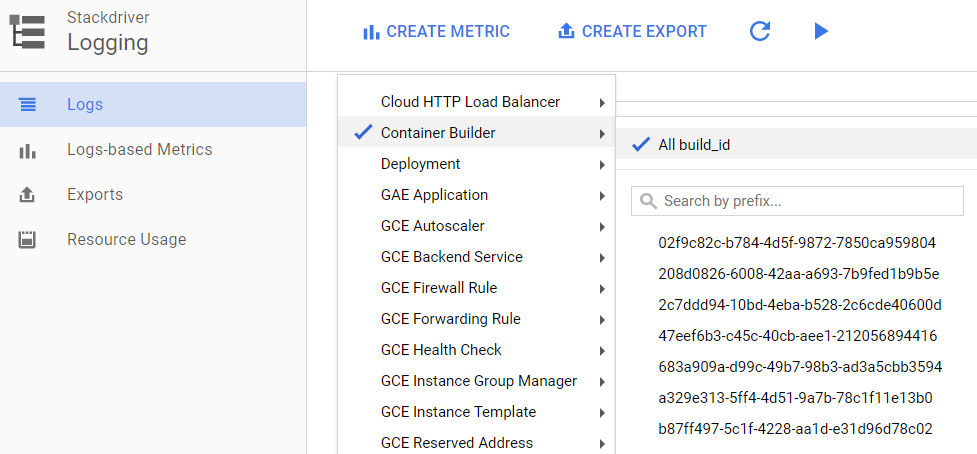
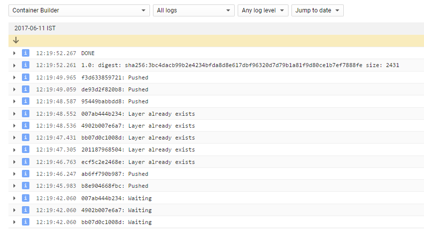

Introduction to Google Container Builder – Romin Irani – Medium

# Introduction to Google Container Builder

[Google Container Builder](https://cloud.google.com/container-builder/) is an interesting tool that allows you to use the power of the Google Cloud Platform to enable a fast and reliable build for your container images.

The name is a bit confusing to understand in terms of the things that it can do but I am going to talk about a process scenario that I have been using and which I believe applies to most of us and see how Google Container Builder makes it more efficient.

Image Reference: https://cloud.google.com/container-builder/

### Our use case

If you have been using Docker, one of the key things is to build a Docker image and make it available for others to pull the image to use in their local environment. The process goes something like this:

- •You should have a local Docker environment setup with all the tools.
- •Write a Docker file that builds out your Docker image.
- •Execute the `docker build` command to create the image and tag it with a image name and version
- •Use the `docker push` command to push the resultant image to the Docker Hub

The process is no doubt simple but there are a few things that you would have observed if you have been using it for a while. These points are based on my experience, doing both local development and while teaching Docker to a wide range to developers:

- •The `docker build` requires that you have a got a good network in place to pull down the dependencies. Ideally you would eventually look at moving this step to part of an overall build system.
- •It takes a long time to execute the `docker push` command, that moves the image to the Docker Hub. The problem gets compounded when your Docker image files are big.
- •Integrating other Container Registries like [Google Container Registry](https://cloud.google.com/container-registry/) is not simple. It takes some settings to make it worth with the standard Docker tools.
- •In many scenarios, the network is such a limiting factor that I often advise that when learning Docker or using Docker, the Cloud is your best friend. I suggest folks to have a VM in the cloud and then get amazed at the speed at which the `docker build/push` commands run. It seriously boosts your efficiency while working with the Docker tool set.

What we are going to see next is how Google Container Builder addresses the above by giving you an environment in the Cloud that will speed up your Container builds, automatically push the images to Google Container Registry. We are only scratching the surface of Google Container Builder that has the capabilities for you to integrate with your build process, trigger events to notify external users, custom build scripts and more.

### Using Google Container Builder to build Docker images

We are going to assume here that you already have your application and the associated Dockerfile to help build your Docker image. If not, you can pull a simple project from [here](https://github.com/rominirani/Google-Container-Builder-Demo) (instructions on doing that are given later in this post):

We are going to be using the Google Cloud SDK that provides us command line utilities (commands) to work with Container Images. It contains commands to build, list and perform other operations with Container images.

#### The Setup

I shall assume that you are familiar with the Google Cloud Platform (GCP) to the extent that you have a billing account, can navigate the [GCP Console](http://console.cloud.google.com/), have a Google Cloud Platform project and most importantly have downloaded and initialized the [Google Cloud SDK](https://cloud.google.com/sdk/).

If the above is true, we need to ensure a few things as given below:

1. 1Go to the GCP Console for your project and ensure that the Google Container Builder API is enabled. From the console, visit API Manager → Library as shown below:

Type in Container builder and it should bring up the Google Container Builder API. Click that and make sure that you enable it.

2. From the console or terminal, we will assume that you have authenticated your Google Cloud SDK and set the default project with a set of commands as shown below:

`$ gcloud auth login` and
`$ gcloud config set project [YOUR_PROJECT_ID]`

#### The Commands

The first thing that we are going to do is have a simple application with its associated Dockerfile. I have provided a project that is just about enough to see this process in action.

Simple pull in the project from here:

[**rominirani/Google-Container-Builder-Demo** *Google-Container-Builder-Demo - Sample Project to build Docker image*github.com](https://github.com/rominirani/Google-Container-Builder-Demo)[(L)](https://github.com/rominirani/Google-Container-Builder-Demo)

Assuming that you have `git` installed on your local machine, do the following in a specific directory of your choice:

$ git clone https://github.com/rominirani/Google-Container-Builder-Demo

Great! All we need to do next is to submit our image build to Google Container Builder. That’s it.

The `gcloud`tool command to submit a build to the Container Builder environment in the Google Cloud is as follows:

$ gcloud container builds submit --tag gcr.io/[PROJECT-ID]/[IMAGENAME]:[VERSION] .

The command is easy to understand:

- •It submits a build to the Google Container Builder.
- •The `tag` option is what you know from Docker. In this case, the image that will be finally built will be pushed to the [Google Container Registry](https://cloud.google.com/container-registry/), which is a fast and reliable Container Image hosting service. The prefix for that is gcr.io. The next two parts are your project name in Google Cloud Platform and then the Docker Image and Version.
- •The last parameter is the `.` which is the directory in which the `Dockerfile` can be located.

In my case, my GCP project is named mindstormclouddemo and I wish to name my Docker image as myapp and the version is 1.0. The command for that is as follows:

$ gcloud container builds submit --tag gcr.io/mindstormclouddemo/myapp:1.0 .

This will trigger the process as shown below and it makes for an interesting series of steps to see what is going on **(I have annotated and formatted some parts of it with my comments)**:

$ gcloud container builds submit --tag gcr.io/mindstormclouddemo/myapp:1.0 .

**Creating temporary tarball** archive of 37 file(s) totalling 34.1 KiB before compression. **<-- This zips the folder and moves to Google Cloud Storage**

Uploading tarball of [.] to [gs://mindstormclouddemo_cloudbuild/source/1497163737.39.tgz]

Created [https://cloudbuild.googleapis.com/v1/projects/mindstormclouddemo/builds/a329e313-5ff4-4d51-9a7b-78c1f11e13b0].

Logs are available at [https://console.cloud.google.com/gcr/builds/a329e313-5ff4-4d51-9a7b-78c1f11e13b0?project=mindstormclouddemo].

------------------------------------------------- REMOTE BUILD OUTPUT --------------------------------------------------

starting build "a329e313-5ff4-4d51-9a7b-78c1f11e13b0"
**--> NOW START THE BUILD. PICK UP THE ZIP FILE THAT WAS PUT IN CLOUD STORAGE**
FETCHSOURCE

Fetching storage object: gs://mindstormclouddemo_cloudbuild/source/1497163737.39.tgz#1497163745785739

Copying gs://mindstormclouddemo_cloudbuild/source/1497163737.39.tgz#1497163745785739...

/ [1 files][ 18.1 KiB/ 18.1 KiB]
Operation completed over 1 objects/18.1 KiB.
BUILD
Already have image (with digest): gcr.io/cloud-builders/docker
Sending build context to Docker daemon 79.36kB

**--> THE STEPS BELOW SHOULD BE FAMILIAR TO EVERYONE WHO HAS DONE A DOCKER BUILD. IT IS EXECUTING THE COMMANDS THAT IT HAS FOUND IN DOCKERFILE**

Step 1/8 : FROM python:2.7
2.7: Pulling from library/python
ef0380f84d05: Already exists
24c170465c65: Pulling fs layer
4f38f9d5c3c0: Pulling fs layer
4125326b53d8: Pulling fs layer
35de80d77198: Pulling fs layer
ed5d9d659d3d: Pulling fs layer
cdb5322408aa: Pulling fs layer
9c9c3d6f5264: Pulling fs layer
35de80d77198: Waiting
ed5d9d659d3d: Waiting
cdb5322408aa: Waiting
9c9c3d6f5264: Waiting
24c170465c65: Verifying Checksum
24c170465c65: Download complete
24c170465c65: Pull complete
4f38f9d5c3c0: Verifying Checksum
4f38f9d5c3c0: Download complete
35de80d77198: Verifying Checksum
35de80d77198: Download complete
4f38f9d5c3c0: Pull complete
cdb5322408aa: Verifying Checksum
cdb5322408aa: Download complete
ed5d9d659d3d: Verifying Checksum
ed5d9d659d3d: Download complete
4125326b53d8: Verifying Checksum
4125326b53d8: Download complete
9c9c3d6f5264: Verifying Checksum
9c9c3d6f5264: Download complete
4125326b53d8: Pull complete
35de80d77198: Pull complete
ed5d9d659d3d: Pull complete
cdb5322408aa: Pull complete
9c9c3d6f5264: Pull complete
Digest: sha256:e9508797d99ab5b2e1311febbdbb22c92595fe82719ab3ccb61a0c458d9bac5d
Status: Downloaded newer image for python:2.7
---> c061fb1b6aa4

Step 2/8 : MAINTAINER Romin Irani "[romin.k.irani@gmail.com](https://medium.com/@iromin/introduction-to-google-container-builder-dbe6645f9421mailto:romin.k.irani@gmail.com)"

---> Running in 10673c027bb1
---> a2f2a0ecc9fe
Removing intermediate container 10673c027bb1
Step 3/8 : COPY . /app
---> a8bbd17c74e3
Removing intermediate container 2b7ef1e2af6d
Step 4/8 : WORKDIR /app
---> 290884694d72
Removing intermediate container bafd9afe6536
Step 5/8 : RUN pip install -r requirements.txt
---> Running in 73260323b338
Collecting flask (from -r requirements.txt (line 1))
Downloading Flask-0.12.2-py2.py3-none-any.whl (83kB)
Collecting itsdangerous>=0.21 (from flask->-r requirements.txt (line 1))
Downloading itsdangerous-0.24.tar.gz (46kB)
Collecting Jinja2>=2.4 (from flask->-r requirements.txt (line 1))
Downloading Jinja2-2.9.6-py2.py3-none-any.whl (340kB)
Collecting Werkzeug>=0.7 (from flask->-r requirements.txt (line 1))
Downloading Werkzeug-0.12.2-py2.py3-none-any.whl (312kB)
Collecting click>=2.0 (from flask->-r requirements.txt (line 1))
Downloading click-6.7-py2.py3-none-any.whl (71kB)

Collecting MarkupSafe>=0.23 (from Jinja2>=2.4->flask->-r requirements.txt (line 1))

Downloading MarkupSafe-1.0.tar.gz
Building wheels for collected packages: itsdangerous, MarkupSafe
Running setup.py bdist_wheel for itsdangerous: started
Running setup.py bdist_wheel for itsdangerous: finished with status 'done'

Stored in directory: /root/.cache/pip/wheels/fc/a8/66/24d655233c757e178d45dea2de22a04c6d92766abfb741129a

Running setup.py bdist_wheel for MarkupSafe: started
Running setup.py bdist_wheel for MarkupSafe: finished with status 'done'

Stored in directory: /root/.cache/pip/wheels/88/a7/30/e39a54a87bcbe25308fa3ca64e8ddc75d9b3e5afa21ee32d57

Successfully built itsdangerous MarkupSafe

Installing collected packages: itsdangerous, MarkupSafe, Jinja2, Werkzeug, click, flask

Successfully installed Jinja2-2.9.6 MarkupSafe-1.0 Werkzeug-0.12.2 click-6.7 flask-0.12.2 itsdangerous-0.24

---> 4ef93aa93c12
Removing intermediate container 73260323b338
Step 6/8 : ENTRYPOINT python
---> Running in 9b562217e6f0
---> fa730d15fbb7
Removing intermediate container 9b562217e6f0
Step 7/8 : CMD app.py
---> Running in c6406b0f22b4
---> fe3b17b083e7
Removing intermediate container c6406b0f22b4
Step 8/8 : EXPOSE 8080
---> Running in 2600ada9fd32
---> c75fbbe837f9
Removing intermediate container 2600ada9fd32
**--> THE IMAGE IS BUILD SUCCESSFULLY NOW**
Successfully built c75fbbe837f9
Successfully tagged gcr.io/mindstormclouddemo/myapp:1.0

**--> PUSH IT TO GOOGLE CONTAINER REGISTRY NOW WITH THE TAGGED NAME and VERSION**

PUSH
Pushing gcr.io/mindstormclouddemo/myapp:1.0
The push refers to a repository [gcr.io/mindstormclouddemo/myapp]
ab6ff790b987: Preparing
b8e904668fbc: Preparing
de93d2f820b8: Preparing
95449babbdd8: Preparing
f3d633859721: Preparing
201187968504: Preparing
ecf5c2e2468e: Preparing
bb07d0c1008d: Preparing
4902b007e6a7: Preparing
007ab444b234: Preparing
201187968504: Waiting
ecf5c2e2468e: Waiting
bb07d0c1008d: Waiting
4902b007e6a7: Waiting
007ab444b234: Waiting
b8e904668fbc: Pushed
ab6ff790b987: Pushed
ecf5c2e2468e: Layer already exists
201187968504: Layer already exists
bb07d0c1008d: Layer already exists
4902b007e6a7: Layer already exists
007ab444b234: Layer already exists
95449babbdd8: Pushed
de93d2f820b8: Pushed
f3d633859721: Pushed

1.0: digest: sha256:3bc4dacb99b2e4234bfda8d8e617dbf96320d7d79b1a81f9d80ce1b7ef7888fe size: 2431

DONE

------------------------------------------------------------------------------------------------------------------------

ID CREATE_TIME DURATION SOURCE IMAGES STATUS

a329e313-5ff4-4d51-9a7b-78c1f11e13b0 2017-06-11T06:49:09+00:00 49S gs://mindstormclouddemo_cloudbuild/source/1497163737.39.tgz gcr.io/mindstormclouddemo/myapp:1.0 SUCCESS

As you can see from the build process above, every step of it is provided to you from the process that Google Container Builder has launched in the cloud. I have annotated the output above with some comments to help you understand what is going on and if you have dealt with a Docker build before, this process should be familiar.

Do note that each build process thus fired from the `gloud container build`command is unique. You can get a status/logs on the build too via the `gcloud container builds`command via the `list` or `log` sub command.

One important thing to note from here is the time that **it took to complete the build**. In my case, it was **49 seconds** as seen in the final statement that it printed in the build output. This is important because there is a free tier that Google Container Builder provides i.e. First 120 build-minutes per day per billing account are free.

#### Viewing Container Images list

You can view the list of Container images via the gcloud command as shown below:

$ gcloud container images list
A sample output (from my system) is shown below:
NAME
gcr.io/mindstormclouddemo/myapp
gcr.io/mindstormclouddemo/pingpong
gcr.io/mindstormclouddemo/simpleserver

Do explore the `gcloud container` command for multiple other operations that you can do with Container images like tagging, untagging, deleting and more.

### Container Registry in Google Cloud Console

If you use the Google Cloud Console more than the command line (I do) — you can take a look at Google Container Registry option in the console.

This brings up the main screen of Container Registry, where you can see your image that just got built:

What is interesting here is that you can also view the **Build History **for the builds that you submitted. You can view the build process output in detail over here:

Click on any of the Build instances and you should see the build process output.

You could also use Stackdriver Logging to check out your build logs. Container Builder is a first class citizen with StackDriver too:

You can view the build output logs here too:

### Pricing

You might be wondering if this whole process is free for you as a user. It sounds too good to be true since there is a compute environment that is being provisioned for you to execute the build, your files are zipped and stored in Google Cloud Storage and there could be network egress for your Container images.

I suggest that you should look at the [pricing page](https://cloud.google.com/container-builder/pricing) for full details, but here are some points at a glance.

- •Google Container Builder comes with a free tier. You are provided 120 build minutes per day for free. After that you are charged at $0.0034 / build-minute. Again the free tier minutes are a promotion and subject to change.
- •Now let’s come to Container Registry where our Container images are getting stored. Check out the [pricing](https://cloud.google.com/container-registry/pricing) for that too. To quote the official documentation on pricing, “ Container Registry only charges for the Cloud Storage [storage](https://cloud.google.com/storage/pricing#storage-pricing) and [network egress](https://cloud.google.com/storage/pricing#network-pricing) used by your Docker images.”

Hope you enjoyed this tutorial. What we have seen is one area that Container Builder can streamline for you. It has a lot more capabilities like custom builds, triggers, notifying users in external apps like Slack when certain Build events happen, tying into Google Source Repositories to kick in builds when a code is pushed, etc. Do check those details out too.