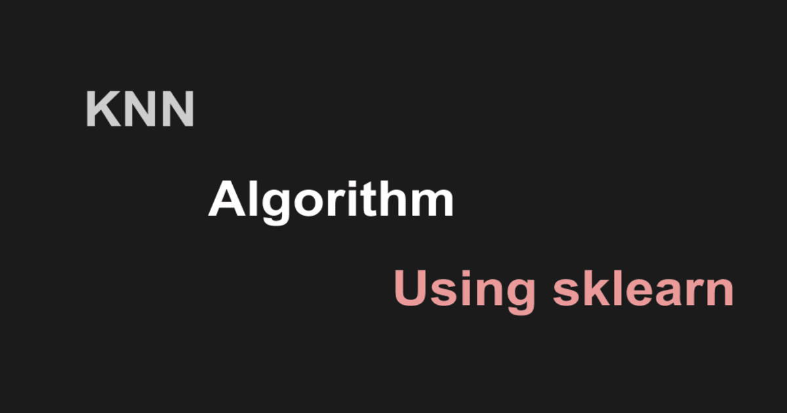
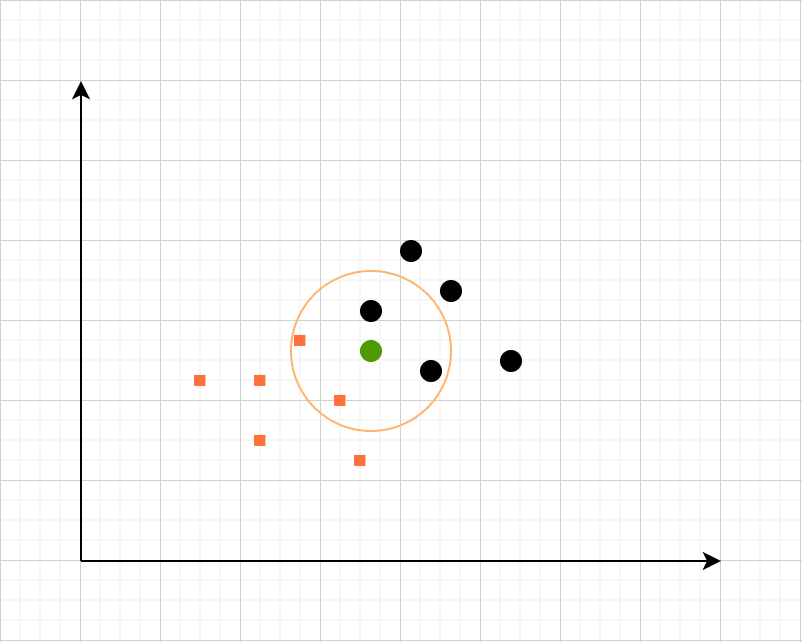
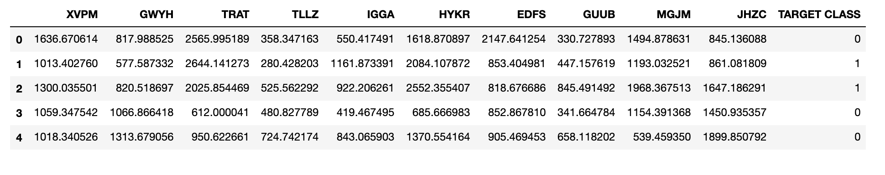
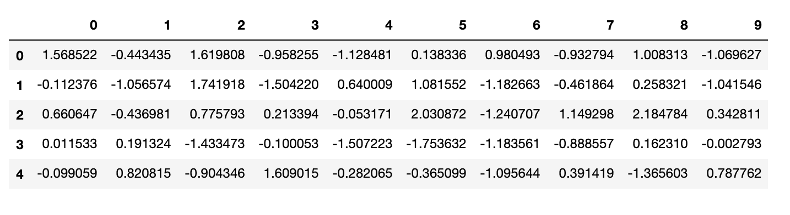
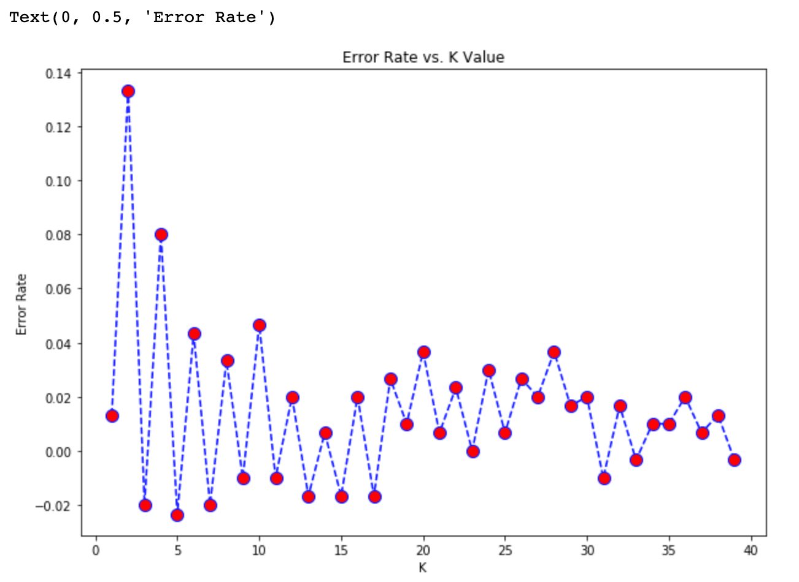
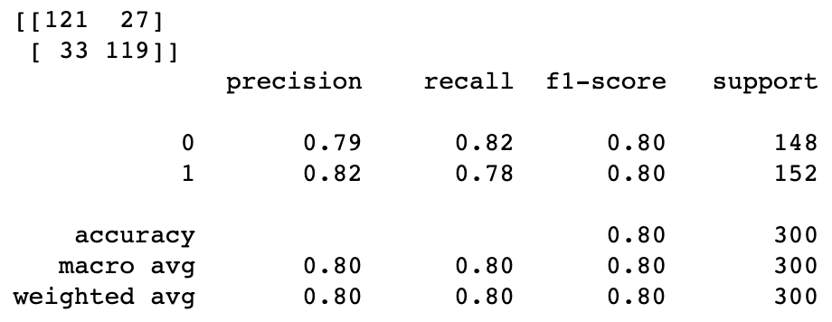

Introduction to KNN K-nearest neighbour algorithm using Examples | Ranvir’s Blog

# Introduction to KNN | K-nearest neighbour algorithm using Examples

 **Updated on:** March 22, 2020 ·  8 mins read

 ** Categories: **  [python](https://ranvir.xyz/blog/categories/#python)   **|**  [sklearn](https://ranvir.xyz/blog/categories/#sklearn)   **|**  [knn](https://ranvir.xyz/blog/categories/#knn)   **|**  [machinelearning](https://ranvir.xyz/blog/categories/#machinelearning)  **|**

 

 [1. Probability of classification of test value in KNN](https://ranvir.xyz/blog/k-nearest-neighbor-algorithm-using-sklearn-distance-metric/#probability-of-classification-of-test-value-in-knn)

 [2. Ways to calculate the distance in KNN](https://ranvir.xyz/blog/k-nearest-neighbor-algorithm-using-sklearn-distance-metric/#ways-to-calculate-the-distance-in-knn)

 [3. The process of KNN with Example](https://ranvir.xyz/blog/k-nearest-neighbor-algorithm-using-sklearn-distance-metric/#the-process-of-knn-with-example)

 [4. KneighborsClassifier: KNN Python Example](https://ranvir.xyz/blog/k-nearest-neighbor-algorithm-using-sklearn-distance-metric/#kneighborsclassifier-knn-python-example)

 [5. Evaluating the KNN model](https://ranvir.xyz/blog/k-nearest-neighbor-algorithm-using-sklearn-distance-metric/#evaluating-the-knn-model)

 [6. Benefits of using KNN algorithm](https://ranvir.xyz/blog/k-nearest-neighbor-algorithm-using-sklearn-distance-metric/#benefits-of-using-knn-algorithm)

 [7. Disadvantages of KNN algorithm](https://ranvir.xyz/blog/k-nearest-neighbor-algorithm-using-sklearn-distance-metric/#disadvantages-of-knn-algorithm)

 `KNN` also known as K-nearest neighbour is a [supervised and pattern classification learning algorithm](https://ranvir.xyz/blog/how-to-evaluate-your-machine-learning-model-like-a-pro-metrics/#supervised-learning-and-classification-problems) which helps us find which class the new input(test value) belongs to when `k` nearest neighbours are chosen and distance is calculated between them.

**>  It attempts to estimate the conditional distribution of `Y`>  given `X`> , and classify a given observation(test value) to the class with highest estimated probability.

**

It first identifies the `k` points in the training data that are closest to the `test value` and calculates the distance between all those categories. The test value will belong to the category whose distance is the least.

 

## Probability of classification of test value in KNN

It calculates the probability of test value to be in class `j` using this function

 Pr(Y=j|X=xo)=1K∑iϵNoI(yi=j)Pr(Y=j|X=xo)=1K∑iϵNoI(yi=j)

## Ways to calculate the distance in KNN

The distance can be calculated using different ways which include these methods,

- Euclidean Method

- Manhattan Method

- Minkowski Method

- etc…

For more information on distance metrics which can be used, please read [this post on KNN](https://www.saedsayad.com/k_nearest_neighbors.htm).

You can use any method from the list by passing `metric` parameter to the KNN object. Here is an answer on [Stack Overflow which will help](https://stackoverflow.com/questions/21052509/sklearn-knn-usage-with-a-user-defined-metric). You can even use some random distance metric.

Also [read this answer as well](https://stackoverflow.com/questions/34408027/how-to-allow-sklearn-k-nearest-neighbors-to-take-custom-distance-metric) if you want to use your own method for distance calculation.

## The process of KNN with Example

Let’s consider that we have a dataset containing heights and weights of dogs and horses marked properly. We will create a plot using weight and height of all the entries.

Now whenever a new entry comes in, we will choose a value of `k`.

For the sake of this example, let’s assume that we choose 4 as the value of `k`. We will find the distance of nearest four values and the one having the least distance will have more probability and is assumed as the winner.

 

## KneighborsClassifier: KNN Python Example

GitHub Repo: [KNN GitHub Repo](https://github.com/singh1114/ml/blob/master/datascience/Machine%20learning/knn/knn.ipynb)

Data source used: [GitHub of Data Source](https://github.com/singh1114/ml/blob/master/datascience/Machine%20learning/knn/KNN_Project_Data)

In K-nearest neighbours algorithm most of the time you don’t really know about the meaning of the input parameters or the classification classes available.

In case of interviews this is done to hide the real customer data from the potential employee.

	# Import everything
	import pandas as pd
	import numpy as np

	import matplotlib.pyplot as plt
	import seaborn as sns
	%matplotlib inline

	# Create a DataFrame
	df = pd.read_csv('KNN_Project_Data')

	# Print the head of the data.
	df.head()

 

The head of the data clearly says that we have a few variables and a target class which contain different classes for given parameters.

### Why normalize/ standardize the variables for KNN

As we can already see that the data in the data frame is not standardize, if we don’t normalize the data the outcome will be fairly different and we won’t be able to get the correct results.

This happens because some feature have a good amount of deviation in them (values range from 1-1000). This will lead to a very bad plot producing a lot of defects in the model.

For more info on normalization, check this answer on [stack exchange](https://stats.stackexchange.com/a/287439).

Sklearn provides a very simple way to standardize your data.

	from sklearn.preprocessing import StandardScaler

	scaler = StandardScaler()
	scaler.fit(df.drop('TARGET CLASS', axis=1))
	sc_transform = scaler.transform(df.drop('TARGET CLASS', axis=1))
	sc_df = pd.DataFrame(sc_transform)

	# Now you can safely use sc_df as your input features.
	sc_df.head()

 

### Test/Train split using sklearn

We can simply [split the data using sklearn](https://ranvir.xyz/blog/how-to-evaluate-your-machine-learning-model-like-a-pro-metrics/#test-train-split-using-sklearn).

	from sklearn.model_selection import train_test_split

	X = sc_transform
	y = df['TARGET CLASS']
	X_train, X_test, y_train, y_test = train_test_split(X, y, test_size=0.3)

### Using KNN and finding an optimal k value

Choosing a good value of `k` can be a daunting task. We are going to automate this task using Python. We were able to find a good value of `k` which can minimize the error rate in the model.

	# Initialize an array that stores the error rates.
	from sklearn.neighbors import KNeighborsClassifier

	error_rates = []

	for a in range(1, 40):
	    k = a
	    knn = KNeighborsClassifier(n_neighbors=k)
	    knn.fit(X_train, y_train)
	    preds = knn.predict(X_test)
	    error_rates.append(np.mean(y_test - preds))

	plt.figure(figsize=(10, 7))
	plt.plot(range(1,40),error_rates,color='blue', linestyle='dashed', marker='o',
	         markerfacecolor='red', markersize=10)
	plt.title('Error Rate vs. K Value')
	plt.xlabel('K')
	plt.ylabel('Error Rate')

 

Seeing the graph, we can see that `k=30` gives a very optimal value of error rate.

	k = 30
	knn = KNeighborsClassifier(n_neighbors=k)
	knn.fit(X_train, y_train)
	preds = knn.predict(X_test)

## Evaluating the KNN model

Read the following post to learn more about evaluating a machine learning model.

### [How to evaluate your Machine learning model like a pro](https://ranvir.xyz/blog/how-to-evaluate-your-machine-learning-model-like-a-pro-metrics/)

#machinelearning   #datascience   #python

February 20, 2020  13 mins read

	from sklearn.metrics import confusion_matrix, classification_report

	print(confusion_matrix(y_test, preds))
	print(classification_report(y_test, preds))

 

## Benefits of using KNN algorithm

- KNN algorithm is widely used for different kinds of learnings because of its uncomplicated and easy to apply nature.

- There are only two metrics to provide in the algorithm. value of `k` and `distance metric`.

- Work with any number of classes not just binary classifiers.

- It is fairly easy to add new data to algorithm.

## Disadvantages of KNN algorithm

- The cost of predicting the `k` nearest neighbours is very high.

- Doesn’t work as expected when working with big number of features/parameters.

- Hard to work with categorical features.

A good read that [benchmarks various options present in sklearn for Knn](https://jakevdp.github.io/blog/2013/04/29/benchmarking-nearest-neighbor-searches-in-python/)

Hope you liked the post. Feel free to share any issue or any question that you have in the comments below.

#### Share this:

 [* facebook*](https://www.facebook.com/sharer/sharer.php?u=https://ranvir.xyz/blog/k-nearest-neighbor-algorithm-using-sklearn-distance-metric/)  [* twitter*](https://twitter.com/intent/tweet?text=Introduction%20to%20KNN%20|%20K-nearest%20neighbour%20algorithm%20using%20Examples&url=https://ranvir.xyz/blog/k-nearest-neighbor-algorithm-using-sklearn-distance-metric/)  [* pinterest*](http://pinterest.com/pin/create/button/?url=https://ranvir.xyz/blog/k-nearest-neighbor-algorithm-using-sklearn-distance-metric/)  [* tumblr*](http://www.tumblr.com/share/link?url=https://ranvir.xyz/blog/k-nearest-neighbor-algorithm-using-sklearn-distance-metric/)  [* reddit*](http://www.reddit.com/submit?url=https://ranvir.xyz/blog/k-nearest-neighbor-algorithm-using-sklearn-distance-metric/)  [* linkedin*](https://www.linkedin.com/shareArticle?mini=true&url=https://ranvir.xyz/blog/k-nearest-neighbor-algorithm-using-sklearn-distance-metric/&title=Introduction%20to%20KNN%20|%20K-nearest%20neighbour%20algorithm%20using%20Examples&summary=Introduction%20to%20K-nearest%20neighbour(%20KNN)%20algorithm%20using%20sklearn.%20Using%20different%20distance%20metrics%20and%20why%20is%20it%20important%20to%20normalize%20KNN%20features?&source=Ranvir%27s%20Blog)  [* email*](https://ranvir.xyz/blog/k-nearest-neighbor-algorithm-using-sklearn-distance-metric/mailto:?subject=Introduction%20to%20KNN%20|%20K-nearest%20neighbour%20algorithm%20using%20Examples&body=Check%20out%20this%20site%20https://ranvir.xyz/blog/k-nearest-neighbor-algorithm-using-sklearn-distance-metric/)  [* hackernews*](https://news.ycombinator.com/submitlink?u=https://ranvir.xyz/blog/k-nearest-neighbor-algorithm-using-sklearn-distance-metric/&t=Introduction%20to%20KNN%20|%20K-nearest%20neighbour%20algorithm%20using%20Examples)

#### You May Also Enjoy

##### 1. [How to evaluate your Machine learning model like a pro](https://ranvir.xyz/blog/how-to-evaluate-your-machine-learning-model-like-a-pro-metrics/)

##### 2. [Data Science II - Introduction to Pandas](https://ranvir.xyz/blog/data-science-ii-introduction-to-pandas/)

##### 3. [Data science I - Power up your NumPy array skills( Basics)](https://ranvir.xyz/blog/data-science-i-all-things-you-need-to-know-about-numpy/)

 **Please share your Feedback:**

Did you enjoy reading or think it can be improved? Don’t forget to leave your thoughts in the comments section below! If you liked this article, please share it with your friends, and read a few more!

Subscribe for the weekly updates!
We don't share your details with others