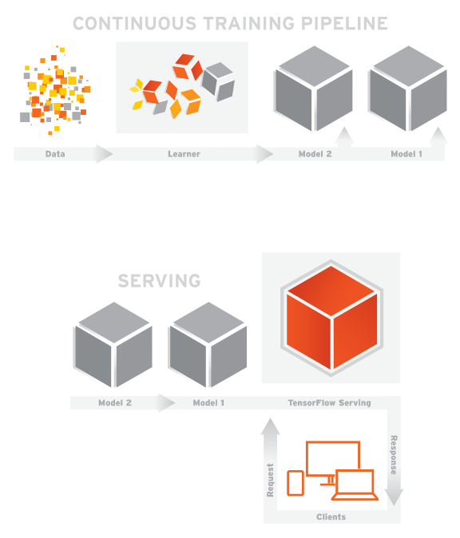

Introduction  |  TensorFlow

#  Introduction

TensorFlow Serving is a flexible, high-performance serving system for machine learning models, designed for production environments. TensorFlow Serving makes it easy to deploy new algorithms and experiments, while keeping the same server architecture and APIs. TensorFlow Serving provides out-of-the-box integration with TensorFlow models, but can be easily extended to serve other types of models and data.

To get started with TensorFlow Serving:

- Read the [overview](https://www.tensorflow.org/serving/architecture_overview)
- [Set up](https://www.tensorflow.org/serving/setup) your environment
- Do the [basic tutorial](https://www.tensorflow.org/serving/serving_basic)

Except as otherwise noted, the content of this page is licensed under the [Creative Commons Attribution 3.0 License](http://creativecommons.org/licenses/by/3.0/), and code samples are licensed under the [Apache 2.0 License](http://www.apache.org/licenses/LICENSE-2.0). For details, see our [Site Policies](https://developers.google.com/terms/site-policies). Java is a registered trademark of Oracle and/or its affiliates.

Last updated August 4, 2017.