Intuition behind permutations and combinations – Building VTS

# Intuition behind permutations and combinations

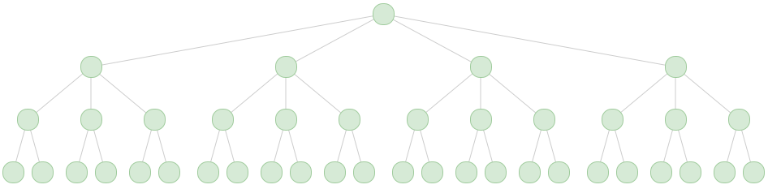

The way I was originally taught permutations and combinations — *Here’s the problem and here’s the formula *— was very shallow and forgettable. As developers, we’re familiar with tree data structures and can relate to them. I found that a lot of permutation and combination intuition can come by visualizing multiplication using trees, and eventually speculating on what the general solutions to permutation and combination are.

### Multiplication with trees

4 x 3 x 2

If we examine the tree above,** 4** branches leave the level one node, **3** branches leave the level two nodes, and **2** branches leave the level three nodes. Counting the number leaf nodes, we arrive at 24, i.e., starting from the root node, there are 24 **paths** to leaf nodes. Paths, as we’ll see later, are the permutations.

### Permutations with repetition — k^n

Permutations with repetition are the different n-length **ordered** arrangements from a k-length set. The arrangements are allowed to reuse elements, e.g., a set {A, B, C} could have a 3-length arrangement of (A, A, A).

Formula:

#### Why?

Look at — *Allowing replacement,* h*ow many three letter words can you create using the letters A, B, and C?*

Manually construct a tree where the paths from root to leafs are the different words you can create with set {A, B, C}.

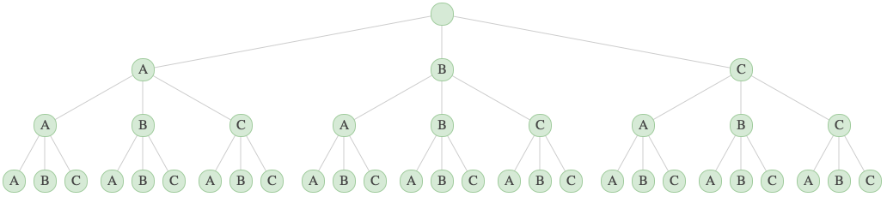

3 x 3 x 3 = 27

If we examine the multiplication, each level has its nodes branching out 3 times, giving us 3 x 3 x 3 leaf nodes. If the set contained 4 elements, the multiplication would be 4 x 4 x 4 x 4. A pattern emerges; The number of n-length words from k-length sets is just:

We’ll see k^n tree structures throughout the rest of the article because general solutions to permutation and combination questions can be reached by pruning a k^n tree. This allows me to intuitively recollect the permutation and combination formulas by visualizing the pruning of a k^n tree.

### Permutations — n!

The classic definition of permutations is the ordered arrangements you can make from**  **an n-length set with all elements being used exactly **once**.

#### Formula:

#### Why?

Look at — Without replacement, h*ow many three letter words can you create using the letters A, B, C?*

Given the definition, the permutations of set {A, B, C} are:
(A, B, C), (A, C, B), (B, A, C), (B, C, A), (C, A, B) ,(C, B, A)

Note that an ordering such as (A, A, B) is not a permutation, but was a path in the k^n tree. So let’s have the k^n tree be our starting point and then prune the invalid orderings:

Step 1. Start with 3³ tree.

3 x 3 x 3 = 27
Step 2. Prune invalid orderings.

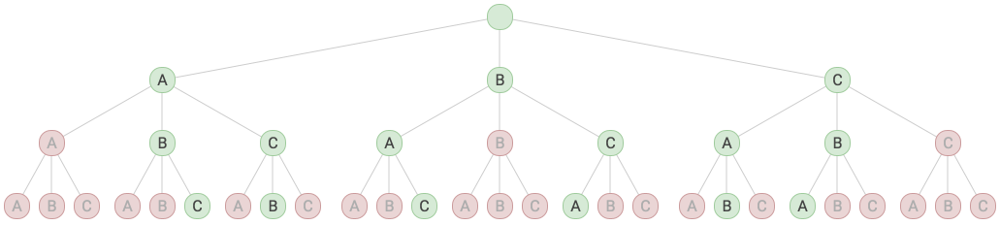

3! = 3 * 2 * 1 = 6
Step 3. Examine the multiplication.

The mutiplication has changed since we removed paths with invalid orderings, and an interesting pattern has developed. Each level’s nodes are branching less than the level above it— The first level node branches out 3 times, the second level nodes branch out 2 times, and the third level nodes branch out 1 time. This is the factorial pattern, and it’s the reason why the number of permutations can be quickly found by using **n!**

### Partial Permutations — P(n,k)

Partial Permutations are the different ways you can order a *k*-length subset of an *n*-length set.

#### Formula:

#### Why?

look at — *How many ways can you order 2 elements from a 4-length set, i.e., P(4,2)?*

Given the definition, the permutations are:
(A,B),(A,C),(A,D),(B,B),(B,C),(B,D),(C,A),(C,B),(C,D),(D,A),(D,B),(D,C)
We can start with a k^n tree, and prune it until we get the paths above.
Step 1. Start with a 4⁴ tree structure — (too big to show).
Step 2. Prune to a 4! tree structure — (too big to show red).

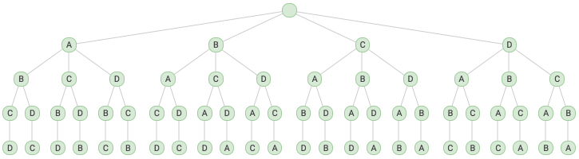

4 x 3 x 2 x 1
Step 3. Remove levels until all path lengths are 2.

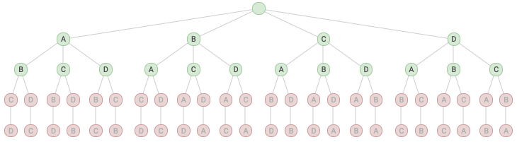

(4 x 3 x 2 x 1) x 1/1 * 1/2
Step 4. Examine the multiplication:

After step 3 the paths match what we listed out, and the multiplication that got us there was:

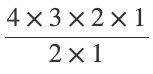

The numerator is obvious, it’s just **4!**. We got rid of levels by dividing each level by its node’s branch count. Third level nodes had **1** branch so we divided by **1**. The second level nodes had **2** branches so we divided by **2**. If we kept the pattern going, the denominator turns into a factorial:

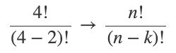

### Combinations — C(n,k)

Combinations represent the different ways you can **pick** a set of elements from a set. They’re they same as partial permutations except ordering is disregard, e.g., Paths (A, B, C) and (A, C, B) both are in the permutation tree, but only one would be in the combination tree. The paths of C(n,k) turn out to be a subset of P(n,k).

#### Formula:

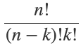

#### Why?

Look at — *How many ways can you pick 3 elements from set *{A, B, C, D}*, i.e., *C(4,3)

Given the definition, the combinations are:
(A, B, D) (B, C, D) (C, D, A) (D, C, A)

Since C(n,k) is a subset of P(n,k) we can start with the steps from partial permutations, and prune further until we get to the above 4 paths.

Step 1. Start with a 4⁴ tree structure (too big to show).
Step 2. Prune to a 4! tree structure (too big to show red).

4 x 3 x 2 x 1
Step 3. Remove the bottom level to by to 3 levels.

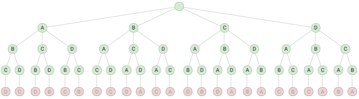

(4 x 3 x 2) x 1/1
Step 4: Remove paths whose elements match another path.

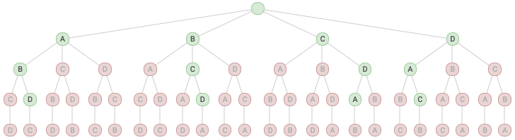

(4 x 3 x 2) x 1/1 x 1/2 x 1/3
Step 5. Examine the multiplication:

The first part is P(n,k) because steps 1–3 are the same as in the permutation walkthrough. The second part is another factorial pattern:

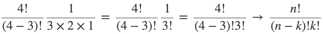

### Permutations of multisets

Permutations of multisets are where the set contains duplicate entries.

#### Formula:

#### Why?

Look at *How many anagrams are there for the set {A, A, A, N}.*
Write out all 4 anagrams:
(A, A, A, N), (A, A, N, A), (A, N, A, A), (N, A, A, A)
Step 1. Start with a 4⁴ tree structure — (too big to show).
Step 2. Prune to a 4! tree structure — (too big to show red).

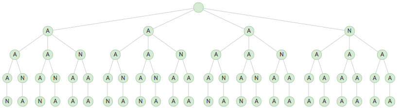

4 x 3 x 2 x 1

Step 3. Prune to only allow the 4 anagrams. There’s actually different ways you can prune this tree, however the symmetrical way is easier to recognize the multiplication pattern.

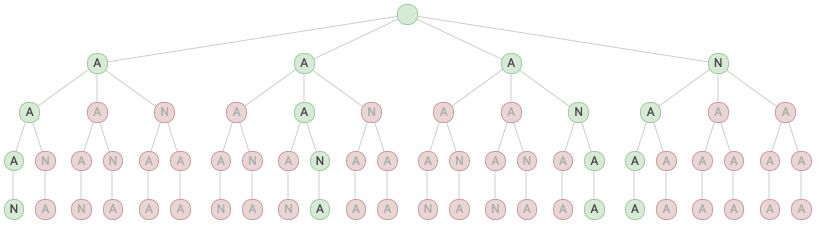

(4 x 3 x 2 x 1) (1/3 * 1/2)
Step 4. Examine the multiplication:
The second level nodes went from 3 branches to 1 branch — 1/3 remains.
The third level nodes went from 2 branches to 1 branch — 1/2 remains.

We can speculate that a factorial pattern is developing in the denominator, and if we do more examples, we’d find that to be true.

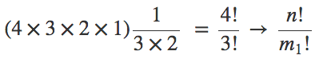

It also turns out that if there’s more than one multiset, the solution generalizes to:

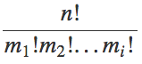
For example— *How many anagrams are there in the set {A, A, N, N}.*

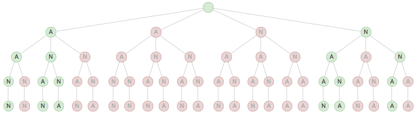

(4 * 3 * 2 * 1) (2/4 + 2/12 + 2/24)

(2/4 + 2/12 + 2/24) comes from what each level kept from the total tree. We can’t multiply in a *clean *way like we have been doing because nodes on a given level branch differently. For example, the nodes on the third level have 2 or 1 branches coming out of them. After simplifying, a pattern in the denominator emerges.

