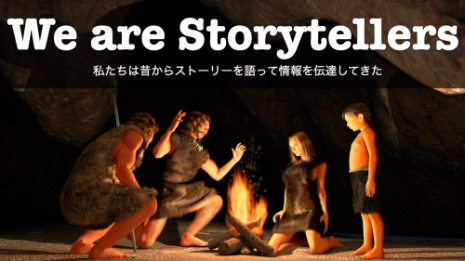

Ira Glass:Tips on storytelling

##   [Ira Glass:Tips on storytelling](http://www.presentationzen.com/presentationzen/2007/03/ira_glasstips_o.html)

#####   [March 07, 2007](http://www.presentationzen.com/presentationzen/2007/03/ira_glasstips_o.html)

Updated September 8, 2016

 

**Ira Glass: What makes for a good story?**

We are a storytelling animal. In fact, [we are wired for story.](https://www.amazon.com/gp/product/1607742454?ie=UTF8&tag=presentatio00-20&camp=1789&linkCode=xm2&creativeASIN=1607742454) The thing is, there is no single right way to tell a story or to use story elements in your presentations and other communications. There are many paths. The important thing is to be aware and open to the many lessons that are out there. About nine years ago I originally pointed to these four, short videos made by Ira Glass (in those days YouTube videos had to be shorter). Below are the four videos of [Ira Glass,](http://en.wikipedia.org/wiki/Ira_glass) a veteran radio personality and host of [This American Life](http://www.thislife.org/), giving advice to those making short stories. There are good pieces of wisdom in there we can apply to presentation in the broader sense as well. All this time later and his advice is still valuable. If you have never seen these clips, I highly recommend you set some time aside to watch these this week. And if you have seen them, they are worth watching again. I have highlighted some of my key takeaways from his monologue.

**Part 1 (on the basics...)

[(L)](https://www.youtube.com/watch?v=loxJ3FtCJJA)

This video is unavailable.

0:00 / 0:00
[(L)](https://www.youtube.com/watch?v=loxJ3FtCJJA)

**

The old way, says Ira, looks like this: Have a topic statement then fill out the facts that support your statement. (This is not to say that logic and evidence and support are not important. Of course, they are important, but they're rarely sufficient.)

In storytelling there are two basic building blocks, says Ira Glass:

**(1)**  **The anecdote,** a sequence of actions, a story in its purest form, one thing following from another (rather than just disjointed "facts").

**> "The Power of the anecdote is so great...No matter how boring the material is, if it is in story form...there is suspense in it, it feels like something's going to happen. The reason why is because literally it's a sequence of events...you can feel through its form [that it's] inherently like being on a train that has a destination...and that you're going to find something..."**

>                                                                 — Ira Glass

(1a) Raise questions. Provide the "bait." The anecdote should raise a question right from the beginning. Implied in any question that you raise, however, is that you are going to answer it. Constantly raise questions and answer them. The shape of the story is that you are throwing out questions and answering them along the way.

**(2)**  **The moment of reflection.** What is the key point? What does this all mean? Why have I asked you to sit and listen for 30 min, etc. It is not just a series of facts/events. Many people get the first part, they tell an interesting sequence of events, but in the end it fails because it doesn't say anything new, it did not have meaning. And sometimes people have the reflection part and the question is clear in their mind, but they fail to put it in a sequence that compels people to follow and engage.

In a good story you need both -- you can flip back and forth between the two. The Anecdote and the Moment of Reflection are interwoven to make a story.

**Part 2 (on finding great stories...)**

Here Ira is talking about the importance of editing and choosing, choosing even to decide to *not* do something (because it is not meeting your standards, etc.). The hardest thing can be deciding to cut and even abandon, but it must be done.[

[(L)](https://www.youtube.com/watch?v=KW6x7lOIsPE)

This video is unavailable.

0:00 / 0:00

[(L)](https://www.youtube.com/watch?v=KW6x7lOIsPE)            ](http://www.youtube.com/watch?v=3qmtwa1yZRM)

**     "Not enough gets said about the importance of abandoning crap."**
** **                                                        — Ira Glass
**Part 3 (on good taste, persevering...)**

If you're going to do creative work, you may go through years of producing stuff that does not meet your own high standards. The way to get better is to keep you standards high and just keep doing a lot of work and getting a lot of experience. This applies to presentations too. [Guy Kawasaki,](http://blog.guykawasaki.com/) for example, said that he used to be a terrible presenter when he was young. Today he's great, but it took years and lot's of experience.

[(L)](https://www.youtube.com/watch?v=BI23U7U2aUY)

**
Part 4 (on finding your own voice...)**

Speaking in your own voice. Good advice applicable to live presentations or making podcasts, etc.

**> "Everything is more compelling when you talk like a human being, when you talk like yourself."**

>                                                                  — Ira Glass

**

[(L)](https://www.youtube.com/watch?v=baCJFAGEuJM)

So are there boring subjects?**

Sure, some subjects may be sexier than others, but I don't buy the notion that there are necessarily boring presentation subjects. If you're presenting then there must be an important reason why you have been chosen to do so. If not, why on earth are you going to speak? If it's important, then what is the point in just getting through it and appearing effective when in reality the audience got nothing and remember even less?

 Here's an example from my undergraduate days long ago: The most boring class I ever had in college was a course called Human Sexuality. I don't know how he did it, but the stuffy, boring, rambling lecturer managed to make the subject as dry as burnt toast. I received a final score of "B" for the class. "B"! Do you know how humiliating it is not to ace a class on sex? Yet, my Economics class — a so-called "boring topic" — was fascinating to me, largely because the lecturer was passionate about the topic (and showed it) and taught concepts and illustrated them with real stories and real examples. He also had a sense of humor. I liked the class and aced it even though when I registered for the class I hoped only just to "get by" and survive in what I thought would surely be a tediously dull, difficult subject. The moral of the story for me is that any subject *can* be boring and any subject *can* be quite interesting indeed, but no subject is necessarily either. Designing a story is not easy work, but it's worth it.

**Related**

**•**  [How to "lecture" and keep 'em engaged](http://presentationzen.blogs.com/presentationzen/2005/05/how_to_lecture_.html) (PZ)

**•**  [No excuses: There are no boring topics](http://www.presentationzen.com/presentationzen/2005/04/no_excuses_ther.html) (PZ)

**•**  [No excuse for tedium: Advice on giving technical presentations](http://www.presentationzen.com/presentationzen/2006/03/no_excuse_for_t.html) (PZ)

**• **[Dana Atchley: A Digital Storytelling Pioneer](http://presentationzen.blogs.com/presentationzen/2005/07/dana_atchley_19.html) (PZ)

**•**  [Lessons from the Cluetrain: Imperatives for presenters](http://www.presentationzen.com/presentationzen/2006/02/lessons_from_th.html) (PZ) *

*

Posted at 07:14 PM  |  [Permalink](http://www.presentationzen.com/presentationzen/2007/03/ira_glasstips_o.html)  |  [Comments (4)](http://www.presentationzen.com/presentationzen/2007/03/ira_glasstips_o.html#comments)

 [**](http://twitter.com/share?url=http%3A%2F%2Fbit.ly%2FYtHvkq&text=Ira%20Glass%3ATips%20on%20storytelling)  [**](https://plus.google.com/share?url=http://www.presentationzen.com/presentationzen/2007/03/ira_glasstips_o.html)    [**](#)    [**](http://www.facebook.com/sharer.php?u=http%3A%2F%2Fwww.presentationzen.com%2Fpresentationzen%2F2007%2F03%2Fira_glasstips_o.html)