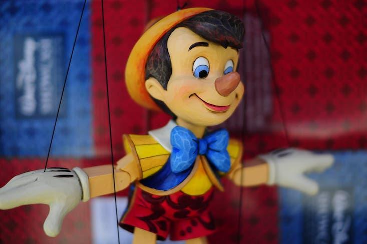
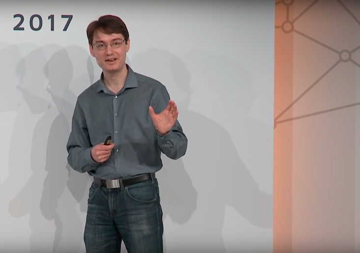
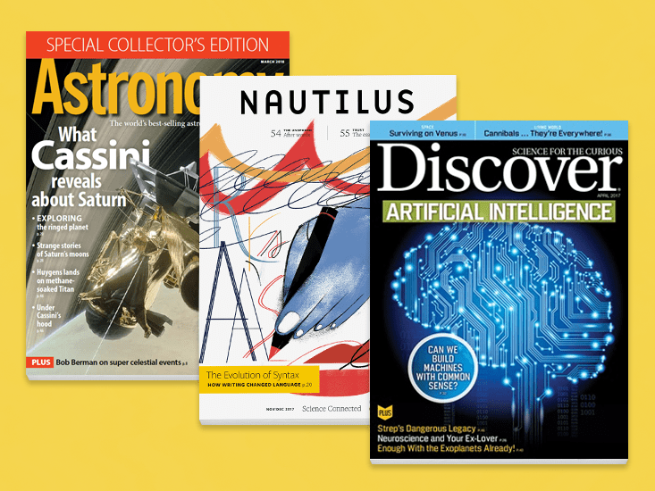
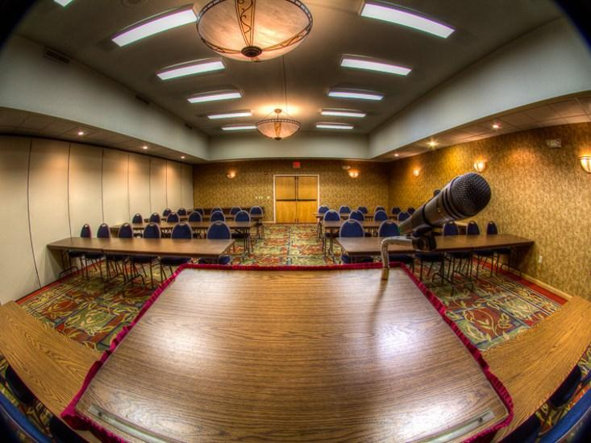
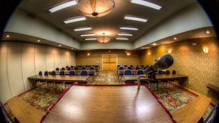
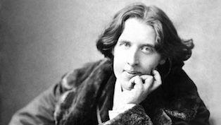
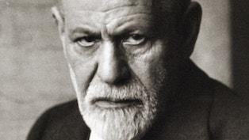

Is Facebook Really Scarier Than Google? - Facts So Romantic - Nautilus

# Is Facebook Really Scarier Than Google?

Posted By Brian Gallagher on Mar 23, 2018

*On Twitter, in a thread that went viral, François Chollet, an A.I. software engineer at Google DeepMind, argued, “Facebook is, in effect, in control of your political beliefs and your worldview.”*Photograph by Joe Penniston / Flickr

Mark Zuckerberg, the founder and C.E.O. of Facebook, admitted recently his company knew, in 2015, that the data firm Cambridge Analytica, which assisted with Donald Trump’s election campaign, had improperly acquired information on 50 million Facebook users. “This was a breach of trust,” Zuckerberg said, in a Facebook [post](https://www.facebook.com/zuck/posts/10104712037900071). “We need to fix that.”

But that’s not the only thing Facebook needs to fix. “The problem with Facebook is not *just* the loss of your privacy and the fact that it can be used as a totalitarian panopticon,” said François Chollet, an artificial intelligence and machine learning software engineer at Google DeepMind, in a [tweet](https://twitter.com/fchollet/status/976563870322999296) yesterday. “The more worrying issue, in my opinion, is its use of digital information consumption as a psychological control vector.” He elaborated on this point in a thread that’s been shared thousands of times. I caught it when global-surveillance critic and *The Intercept* writer Glenn Greenwald [quote-retweeted](https://twitter.com/ggreenwald/status/976825393960378368) Chollet, calling it a “great thread” on “Facebook’s menacing use” of psychology-manipulating A.I. “But remember,” Greenwald added, “Google is also a major exploiter of artificial intelligence with very little transparency or public oversight.”

Chollet bristled at this. “This is the laziest kind of thinking—just because two things share some superficial similarity (they’re large tech [companies]) doesn’t mean they’re equivalent,” he [said](https://twitter.com/fchollet/status/976783608219279360). Why? Look to the Newsfeed, Facebook’s signature feature, Chollet went on, in this Twitter thread. “If Facebook gets to decide, over the span of many years, which news you will see (real or fake), whose political status updates you’ll see, and who will see yours, then Facebook is, in effect, in control of your political beliefs and your worldview.”

Fil Menczer, Professor of Informatics and Computer Science at Indiana University, told *Nautilus*, in a discussion about his [work on fake news](http://science.sciencemag.org/content/359/6380/1094), that the algorithms used on social media platforms, like Facebook, bias our decision-making in ways that exploit our socio-cognitive biases—but search engines like Google [aren’t entirely innocent](http://nautil.us/issue/52/the-hive/modern-media-is-a-dos-attack-on-your-free-will).

> If Zuckerberg is morally bankrupt, he’s trying to hide it.
>

“The algorithmic biases feed into social and cognitive biases, like confirmation bias, which in turn feed into the algorithmic biases. Before, people were looking at the evening news on TV, or reading the local paper, for example. But the fact that the medium has changed to online social networks, where you shape the sources of information to which you are exposed, now means that you become even more vulnerable,” he said. “Search engines and social media, for example, try to predict what content may be most engaging for someone. Ranking algorithms use popularity as one of the ingredients in their formulas. That means that the more people in your group interact or engage with a piece of fake news, the more likely you are to see it. The social network can act as an amplifier because the people near you have opinions similar to you, so they are more likely to be tricked by a certain kind of fake news, which means you are more likely to see it, too.”

*François Chollet*Image from [Google Developers / YouTube](https://www.youtube.com/watch?v=UeheTiBJ0Io)

For Chollet, though, the sort of danger Facebook poses is unique. “There’s only one company where the product is an opaque algorithmic newsfeed, that has been running large-scale mood/opinion manipulation experiments, that is neck-deep in an election manipulation scandal, that has shown time and time again to have morally bankrupt leadership. Essentially nothing about the threat described applies to Google. Nor Amazon. Nor Apple. It could apply to Twitter, in principle, but in practice it almost entirely doesn’t,” he [said](https://twitter.com/fchollet/status/976784465245515776). What seems to clinch it for him is that Facebook is ambitiously pursuing advances in A.I. “What do you use AI…for, when your product is a newsfeed?” he [wondered](https://twitter.com/fchollet/status/976569278328549378). “Personally, it really scares me. If you work in A.I., please don’t help them. Don’t play their game. Don’t participate in their research ecosystem. Please show some conscience.”

He takes the decision to work for his current employer, Alphabet—former motto “Don’t be evil,” and now “Do the right thing”—as a demonstration of scrupulousness. “For me, working at Google”—an Alphabet subsidiary—“is a deliberate choice,” he [said](https://twitter.com/fchollet/status/976786099254181888). “If I start feeling uncomfortable, I’ll definitely leave. If I had been working at [Facebook], I would have left in 2017.” For now, he’s glad to labor for a company whose products—like Gmail and Android—are “anti-Facebook,” he [went on](https://twitter.com/fchollet/status/976935081817251840). These empower people, while Facebook’s Newsfeed “seeks to maximally waste your time.”

If Zuckerberg is morally bankrupt, he’s trying to hide it. On Wednesday, he told CNN that he’d be “happy to” to testify to Congress and, on Facebook, announced several changes that will, supposedly, rectify what went wrong with the Cambridge Analytica data-breach scandal. “I started Facebook,” he wrote, “and at the end of the day I’m responsible for what happens on our platform.”

This is worth keeping in mind, though: That, also at the end of the day, “The motivation for Facebook is not to make you a better person—to improve you morally or intellectually—and it’s not even designed to improve your social group,” Simon DeDeo, an assistant professor at Carnegie Mellon University, where he runs the Laboratory for Social Minds, and external faculty at the Santa Fe Institute, [told](http://nautil.us/issue/12/feedback/ingenious-simon-dedeo)  *Nautilus*. “It’s designed to make money, to show you things you want to see to hopefully induce you to purchase things.”

*Brian Gallagher is the editor of Facts So Romantic, the *Nautilus* blog. Follow him on Twitter [@brianga11agher](https://twitter.com/brianga11agher).*

*Victor Gomes, an editorial intern at *Nautilus*, contributed reporting to this post.*

Join the Discussion

Facts So Romantic On [Ideas](http://nautil.us/term/l/Ideas)

# Nautilus Joins Forces with Discover and Astronomy

Posted By John Steele on Mar 24, 2018

You may not know it, but *Nautilus* and *Discover* go way back. Our features editor, Kevin Berger, came to us from Discover Magazine. So did our long-time (now former) blog editor, Amos Zeeberg. *Discover* editors have written and guest-edited for us, and we’ve been regular consumers of *Discover*’s great features and blog content since we started.

So it brings me great pleasure to announce that *Nautilus*, *Discover*, and *Discover*’s sister magazine, *Astronomy*, are [entering into a marketing partnership](https://www.kalmbach.com/2018/03/20/kalmbach-media-announces-marketing-partnership-with-nautilus-magazine) that will reach over 10 million science enthusiasts a month. The combination of the three titles represents a unique platform in science media for institutional and marketing partners looking to strengthen their brand.

Readers will notice a few changes. We’ll be featuring *Discover* and *Astronomy* content in our newsletters and our social channels. There will be new Channels content appearing on all three magazines. We may even dip our toes into joint eBooks.

*Nautilus* is the only independent science magazine of its reach to appear in decades. We’ve gotten where we are—two National Magazine Awards, a Webby for best science on the web, inclusion in *Best American Science and Nature Writing* every year we’ve been publishing—with the help of some great relationships. This new relationship with Kalmbach will help us write our next chapter.

*John Steele is the **publisher and editorial director of *Nautilus*.*

Join the Discussion

 

Facts So Romantic On [Ideas](http://nautil.us/term/l/Ideas)

# Why Forests Give You Awe

Posted By Mike Shanahan on Mar 21, 2018

*When you walk in a tropical forest, the sheer abundance and variety of life can have a powerful and somewhat disorienting effect.*Painting by Caspar David Friedrich (circa 1820-1821) / Wikicommons

Can you remember the time when you first felt awe, that feeling of being in the presence of something immense and mind-blowing? The natural world—with its domineering mountains, colossal trees, and tall waterfalls—is one of its main sources. I felt [awe](http://nautil.us/issue/43/heroes/a-prescription-for-awe) first when I was a young boy at the feet of the [biggest tree](https://underthebanyan.wordpress.com/2012/04/08/what-trees-tell-us-when-we-stand-close-and-listen/) in the world. I felt it next as a young man, when I walked in a tropical rainforest for the first time, in Sri Lanka. Here’s how I described it in my 2016 book *[Gods, Wasps and Stranglers: The Secret History and Redemptive Future of Fig Trees](https://www.chelseagreen.com/product/gods-wasps-and-stranglers/)*:

It hugged all it contained in a humid, humming gloom. The trees towered over us, viscerally alive yet so alien to our animal ways. Their breath sweetened the air we inhaled. It is hard to explain, but I could feel the concentration of life around me, as if its great density there had somehow reached into me physically. What struck me was the neutrality of that force. There was no malice or love there, just existence.

In 2003, psychologists Dacher Keltner and Jonathan Haidt [wrote](https://greatergood.berkeley.edu/dacherkeltner/docs/keltner.haidt.awe.2003.pdf) that “nature-produced awe involves a diminished self, the giving way of previous conceptual distinctions (e.g., between master and servant) and the sensed presence of a higher power. Natural objects that are vast in relation to the self…are more likely to produce awe.”

I asked Keltner what it might be about forests—as opposed to, say, single very large trees—that inspires feelings of awe. “I think it’s the perception of collectivity in forests,” he said, “where the eye doesn’t focus on one object but on interconnections amongst many.” That chimes with my experience. When you walk in a tropical forest, the sheer abundance and variety of life can have a powerful and somewhat disorienting effect.

In 1836, in his essay *Nature*, Ralph Waldo Emerson hinted at this: “Standing on the bare ground, my head bathed by the blithe air and uplifted into infinite space, all mean egotism vanishes. I become a transparent eyeball; I am nothing; I see all; the currents of the Universal Being circulate through me; I am part or parcel of God.”

It’s a positive experience. Keltner’s research has [revealed](https://greatergood.berkeley.edu/article/item/why_do_we_feel_awe) that awe is good for our minds, bodies, and relationships. Awe may even make us kinder. It appears to encourage us to look beyond ourselves and to cooperate with others. Tapping into this power may be as simple as taking a walk in a forest; the less familiar it is, the better—Keltner and Haidt say nature is more likely to produce awe if it transcends one’s previous knowledge.

Here’s how Alfred Russel Wallace, co-discoverer of evolution with Charles Darwin, described his first experience of the forests of Southeast Asia. “When, for the first time, the traveller wanders in these primeval forests, he can scarcely fail to experience sensations of awe. There is a vastness, a solemnity, a gloom, a sense of solitude and of human insignificance which for a time overwhelm him.”

With so much life vibrating in one place, it is hard not to feel some connection to the rhythm.

*Mike Shanahan is a freelance writer with a doctorate in rainforest ecology. He has lived in a national park in Borneo, bred endangered penguins, investigated illegal bear farms, produced award-winning journalism and spent several weeks of his life at the annual United Nations climate change negotiations. He has written for numerous publications including *The Economist*, *Nature*, *The Ecologist* and *Ensia*. He maintains a blog at *[Under the Banyan](https://underthebanyan.wordpress.com/)*. His book *[Gods, Wasps and Stranglers](https://www.chelseagreen.com/product/gods-wasps-and-stranglers/)* (Chelsea Green, 2016) will be out in paperback April 2018.*

**WATCH: The Buddhists are right—the self is partly illusory.**

1 Comment - Join the Discussion

 

Facts So Romantic On [Culture](http://nautil.us/term/l/Culture)

#  Your Speech Is Packed With Misunderstood, Unconscious Messages

Posted By Julie Sedivy on Mar 20, 2018

Imagine standing up to give a speech in front of a critical audience. As you do your best to wax eloquent, someone in the room uses a clicker to conspicuously count your every stumble, hesitation, *um* and *uh*; once you’ve finished, this person loudly announces how many of these blemishes have marred your presentation.

*If disfluencies appear to generally help communication more than they hinder it, why are they so stigmatized?*Photograph by Sean Lamb / Flickr

This is exactly the tactic used by the Toastmasters public-speaking club, in which a designated “Ah Counter” is charged with tallying up the speaker’s slip-ups as part of the training regimen. The goal is total eradication. The club’s punitive measures may be extreme, but they reflect the folk wisdom that *ums* and *uhs* betray a speaker as weak, nervous, ignorant, and sloppy, and should be avoided at all costs, even in spontaneous conversation.

Many scientists, though, think that our cultural fixation with stamping out what they call “disfluencies” is deeply misguided. Saying *um* is no character flaw, but an organic feature of speech; far from distracting listeners, there’s evidence that it focuses their attention in ways that enhance comprehension.

Disfluencies arise mainly because of the time pressures inherent in speaking. Speakers don’t pre-plan an entire sentence and then mentally press “play” to begin unspooling it. If they did, they’d probably need to pause for several seconds between each sentence as they assembled it, and it’s doubtful that they could hold a long, complex sentence in working memory. Instead, speakers talk and think at the same time, launching into speech with only a vague sense of how the sentence will unfold, taking it on faith that by the time they’ve finished uttering the earlier portions of the sentence, they’ll have worked out exactly what to say in the later portions. Mostly, the timing works out, but occasionally it takes longer than expected to find the right phrase. Saying “um” is the speaker’s way of signaling that processing is ongoing, the verbal equivalent of a computer’s spinning circle. People sometimes have more disfluencies while speaking in public, ironically, because they are trying hard not to misspeak.

Since disfluencies show that a speaker is thinking carefully about what she is about to say, they provide useful information to listeners, cueing them to focus attention on upcoming content that’s likely to be meaty. One famous example comes [from the movie *Jurassic Park*](https://www.youtube.com/watch?v=SkWeMvrNiOM)*.* When Jeff Goldblum’s character is asked whether a group of only female animals can breed, he replies, “No, I’m, I’m simply saying that life, uh…finds a way.” The disfluencies emphasize that he’s coming to grips with something not easy to explain—an idea that turns out to be a key part of the movie.

Experiments with *ums* or *uhs* spliced in or out of speech show that when words are preceded by disfluencies, listeners [recognize them faster](http://link.springer.com/article/10.3758/BF03194926) and remember them [more accurately](http://www.sciencedirect.com/science/article/pii/S0010027706002186). In some cases, disfluencies allow listeners to make useful predictions about what they’re about to hear. In [one study](http://www.sciencedirect.com/science/article/pii/S0167639307001033), for example, listeners correctly inferred that speakers’ stumbles meant that they were describing complicated conglomerations of shapes rather than to simple single shapes.

> In fact, designers of synthesized voice systems have begun experimenting with the insertion of naturalistic disfluencies into artificial speech.

>

Disfluencies can also improve our comprehension of longer pieces of content. Psychologists [Scott Fraundorf and Duane Watson](http://www.sciencedirect.com/science/article/pii/S0749596X11000234) tinkered with recordings of a speaker’s retellings of passages from *Alice’s Adventures in Wonderland* and compared how well listeners remembered versions that were purged of all disfluencies as opposed to ones that contained an average number of *ums* and *uhs* (about two instances out of every 100 words). They found that hearers remembered plot points better after listening to the disfluent versions, with enhanced memory apparent even for plot points that weren’t preceded by a disfluency. Stripping a speech of *ums* and *uhs*, as Toastmasters are intent on doing, appears to be doing listeners no favors.

Moreover, there’s reason to question the implicit assumption that disfluencies reveal a speaker’s lack of knowledge. In a [study](http://citeseerx.ist.psu.edu/viewdoc/download?doi=10.1.1.310.7548&rep=rep1&type=pdf#page=11) led by Kathryn Womack, experienced physicians and residents in training looked at images of various dermatological conditions while talking their way to a diagnosis. Not surprisingly, the expert doctors were more accurate in their diagnoses than the residents. They also produced more complex sentences—and a greater number of disfluencies, giving lie to the notion that disfluencies reflect a lack of control over one’s material. On the contrary, the study’s authors suggest that the seasoned doctors had more disfluent speech because they were sifting through a larger body of knowledge and constructing more detailed explanations while planning their speech.

If disfluencies appear to generally help communication more than they hinder it, why are they so stigmatized? Writer and linguist Michael Erard argues in his book *Um…* that historically, public speakers have been blissfully unconcerned with disinfecting their speech of disfluencies until about the 20th Century—possibly because neither hearers nor speakers consciously noticed them until it became possible to record and replay spoken language in all its circuitous and halting glory. The aversion to disfluencies may well have arisen from speakers’ horror at hearing their own recorded voices. Erard suggests that the modern repugnance for disfluencies is less an assessment of a person’s speech than it is a “deeper judgment about how much control he should have over his self-presentation and his identity.” In truth, disfluencies appear to distract mainly those who have been trained to revile them.

Perhaps there’s an argument to be made that public speaking is different from day-to-day communication, that it’s a performance in which the artist is meant to demonstrate almost superhuman mastery over speech and make verbal virtuosity look easy precisely because of the absence of cues that reveal its complexity. Maybe so. But the prohibition of *ums* should be recognized for what it is—a display focused on presenting the speaker in a flattering light—and not mistaken for courtesy directed at the listener.

In fact, designers of synthesized voice systems, who often *are* rather solicitous when it comes to the hearer’s ease and comfort, have begun experimenting with the insertion of naturalistic disfluencies into [artificial speech](http://homepages.inf.ed.ac.uk/mwester/publications/Dall_Tomalin_Wester.pdf) (though it’s too soon to tell whether listeners respond to these as they do to human disfluencies). It’s an irony of our age that robots, unconcerned with ego, may be busy putting disfluencies into their speech just as humans, preoccupied with their self-images, are submitting to strenuous training to take them out.

*Julie Sedivy has taught linguistics and psychology at Brown University and the University of Calgary. She is the co-author of *Sold on Language: How Advertisers Talk to You and What This Says About You *and more recently, the author of *Language in Mind: An Introduction to Psycholinguistics.

**WATCH: How studying language can shape your life.**

*This classic Facts So Romantic post was originally published in December 2015.*

Join the Discussion

 

## Related Facts So Romantic

- [Culture](http://nautil.us/term/l/Culture)

### [Your Speech Is Packed With Misunderstood, Unconscious Messages](http://nautil.us/blog/-your-speech-is-packed-with-misunderstood-unconscious-messages)

Imagine standing up to give a speech in front of a critical audience. As you do your best to wax eloquent, someone in the room uses a clicker to conspicuously…

[Read More](http://nautil.us/blog/-your-speech-is-packed-with-misunderstood-unconscious-messages)

- [Culture](http://nautil.us/term/l/Culture)

### [Why Doing Good Makes It Easier to Be Bad](http://nautil.us/blog/why-doing-good-makes-it-easier-to-be-bad)

Oscar Wilde, the famed Irish essayist and playwright, had a gift, among other things, for counterintuitive aphorisms. In “The Soul of Man Under Socialism,”…

[Read More](http://nautil.us/blog/why-doing-good-makes-it-easier-to-be-bad)

- [Culture](http://nautil.us/term/l/Culture)

### [You Can Have Emotions You Don’t Feel](http://nautil.us/blog/-you-can-have-emotions-you-dont-feel)

What does it mean to have an emotion? It seems obvious that having one means feeling it. If you’re happy but don’t know it, in what sense could you…

[Read More](http://nautil.us/blog/-you-can-have-emotions-you-dont-feel)

- [Culture](http://nautil.us/term/l/Culture)

### [The Point of Men’s Cults](http://nautil.us/blog/the-point-of-mens-cults)

Men’s cults are not universal, but they recur throughout history and across cultures. Does their pervasiveness tell us something important about evolution…

[Read More](http://nautil.us/blog/the-point-of-mens-cults)