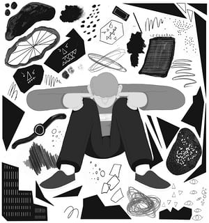

Is everything you think you know about depression wrong?

# Is everything you think you know about depression wrong?

In this extract from his new book, Johann Hari, who took antidepressants for 13 years, calls for a new approach

[• Johann Hari Q&A: ‘I was afraid to dismantle the story about depression and anxiety’](https://www.theguardian.com/media/2018/jan/07/johann-hari-depression-brain-lost-connections-book-interview)

[Johann Hari](https://www.theguardian.com/profile/johann-hari)
Sun 7 Jan 2018 09.00 GMTLast modified on Thu 11 Jan 2018 10.49 GMT

‘Drugs are having a positive effect for some people – but they clearly can’t be the main solution for the majority of us.’ Photograph: Alamy

In the 1970s, a truth was accidentally discovered about depression – one that was quickly swept aside, because its implications were too inconvenient, and too explosive. American psychiatrists had produced a book that would lay out, in detail, all the symptoms of different mental illnesses, so they could be identified and treated in the same way across the United States. It was called the *Diagnostic and Statistical Manual*. In the latest edition, they laid out nine symptoms that a patient has to show to be diagnosed with depression – like, for example, decreased interest in pleasure or persistent low mood. For a doctor to conclude you were depressed, you had to show five of these symptoms over several weeks.

The manual was sent out to doctors across the US and they began to use it to diagnose people. However, after a while they came back to the authors and pointed out something that was bothering them. If they followed this guide, they had to diagnose every grieving person who came to them as depressed and start giving them medical treatment. If you lose someone, it turns out that these symptoms will come to you automatically. So, the doctors wanted to know, are we supposed to start drugging all the bereaved people in America?

The authors conferred, and they decided that there would be a special clause added to the list of symptoms of depression. None of this applies, they said, if you have lost somebody you love in the past year. In that situation, all these symptoms are natural, and not a disorder. It was called “the grief exception”, and it seemed to resolve the problem.

Then, as the years and decades passed, doctors on the frontline started to come back with another question. All over the world, they were being encouraged to tell patients that depression is, in fact, just the result of a spontaneous chemical imbalance in your brain – it is produced by low serotonin, or a natural lack of some other chemical. It’s not caused by your life – it’s caused by your broken brain. Some of the doctors began to ask how this fitted with the grief exception. If you agree that the symptoms of depression are a logical and understandable response to one set of life circumstances – losing a loved one – might they not be an understandable response to other situations? What about if you lose your job? What if you are stuck in a job that you hate for the next 40 years? What about if you are alone and friendless?

> Drug companies would fund huge numbers of studies and then only release the ones that showed success

The grief exception seemed to have blasted a hole in the claim that the causes of depression are sealed away in your skull. It suggested that there are causes out here, in the world, and they needed to be investigated and solved there. This was a debate that mainstream psychiatry (with some exceptions) did not want to have. So, they responded in a simple way – by whittling away the grief exception. With each new edition of the manual they reduced the period of grief that you were allowed before being labelled mentally ill – down to a few months and then, finally, to nothing at all. Now, if your baby dies at 10am, your doctor can diagnose you with a mental illness at 10.01am and start drugging you straight away.

[Dr Joanne Cacciatore](https://socialwork.asu.edu/content/joanne-cacciatore-1), of Arizona State University, became a leading expert on the grief exception after her own baby, Cheyenne, died during childbirth. She had seen many grieving people being told that they were mentally ill for showing distress. She told me this debate reveals a key problem with how we talk about depression, anxiety and other forms of suffering: we don’t, she said, “consider context”. We act like human distress can be assessed solely on a checklist that can be separated out from our lives, and labelled as brain diseases. If we started to take people’s actual lives into account when we treat depression and anxiety, Joanne explained, it would require “an entire system overhaul”. She told me that when “you have a person with extreme human distress, [we need to] stop treating the symptoms. The symptoms are a messenger of a deeper problem. Let’s get to the deeper problem.”

*****

I was a teenager when I swallowed my first antidepressant. I was standing in the weak English sunshine, outside a pharmacy in a shopping centre in London. The tablet was white and small, and as I swallowed, it felt like a chemical kiss. That morning I had gone to see my doctor and I had told him – crouched, embarrassed – that pain was leaking out of me uncontrollably, like a bad smell, and I had felt this way for several years. In reply, he told me a story. There is a chemical called serotonin that makes people feel good, he said, and some people are naturally lacking it in their brains. You are clearly one of those people. There are now, thankfully, new drugs that will restore your serotonin level to that of a normal person. Take them, and you will be well. At last, I understood what had been happening to me, and why.

However, a few months into my drugging, something odd happened. The pain started to seep through again. Before long, I felt as bad as I had at the start. I went back to my doctor, and he told me that I was clearly on too low a dose. And so, 20 milligrams became 30 milligrams; the white pill became blue. I felt better for several months. And then the pain came back through once more. My dose kept being jacked up, until I was on 80mg, where it stayed for many years, with only a few short breaks. And still the pain broke back through.

I started to research my book, [*Lost Connections: Uncovering The Real Causes of Depression – and the Unexpected Solutions*](https://www.guardianbookshop.com/lost-connections.html), because I was puzzled by two mysteries. Why was I still depressed when I was doing everything I had been told to do? I had identified the low serotonin in my brain, and I was boosting my serotonin levels – yet I still felt awful. But there was a deeper mystery still. Why were so many other people across the western world feeling like me? Around one in five US adults are taking at least one drug for a psychiatric problem. In Britain, antidepressant prescriptions have doubled in a decade, to the point where now one in 11 of us drug ourselves to deal with these feelings. What has been causing depression and its twin, anxiety, to spiral in this way? I began to ask myself: could it really be that in our separate heads, all of us had brain chemistries that were spontaneously malfunctioning at the same time?

To find the answers, I ended up going on a 40,000-mile journey across the world and back. I talked to the leading social scientists investigating these questions, and to people who have been overcoming depression in unexpected ways – from an Amish village in Indiana, to a Brazilian city that banned advertising and a laboratory in Baltimore conducting a startling wave of experiments. From these people, I learned the best scientific evidence about what really causes depression and anxiety. They taught me that it is not what we have been told it is up to now. I found there is evidence that seven specific factors in the way we are living today are causing depression and anxiety to rise – alongside two real biological factors (such as your genes) that can combine with these forces to make it worse.

Once I learned this, I was able to see that a very different set of solutions to my depression – and to our depression – had been waiting for me all along.

To understand this different way of thinking, though, I had to first investigate the old story, the one that had given me so much relief at first. Professor Irving Kirsch at Harvard University is the Sherlock Holmes of chemical antidepressants – the man who has scrutinised the evidence about giving drugs to depressed and anxious people most closely in the world. In the 1990s, he prescribed chemical antidepressants to his patients with confidence. He knew the published scientific evidence, and it was clear: it showed that 70% of people who took them got significantly better. He began to investigate this further, and put in a freedom of information request to get the data that the drug companies had been privately gathering into these drugs. He was confident that he would find all sorts of other positive effects – but then he bumped into something peculiar.

Illustration by Michael Driver.

We all know that when you take selfies, you take 30 pictures, throw away the 29 where you look bleary-eyed or double-chinned, and pick out the best one to be your Tinder profile picture. It turned out that the drug companies – who fund almost all the research into these drugs – were taking this approach to studying chemical antidepressants. They would fund huge numbers of studies, throw away all the ones that suggested the drugs had very limited effects, and then only release the ones that showed success. To give one example: in one trial, the drug was given to 245 patients, but the drug company published the results for only 27 of them. Those 27 patients happened to be the ones the drug seemed to work for. Suddenly, Professor Kirsch realised that the 70% figure couldn’t be right.

It turns out that between 65 and 80% of people on antidepressants are depressed again within a year. I had thought that I was freakish for remaining depressed while on these drugs. In fact, Kirsch explained to me in Massachusetts, I was totally typical. These drugs are having a positive effect for some people – but they clearly can’t be the main solution for the majority of us, because we’re still depressed even when we take them. At the moment, we offer depressed people a menu with only one option on it. I certainly don’t want to take anything off the menu – but I realised, as I spent time with him, that we would have to expand the menu.

This led Professor Kirsch to ask a more basic question, one he was surprised to be asking. How do we know depression is even caused by low serotonin at all? When he began to dig, it turned out that the evidence was strikingly shaky. Professor Andrew Scull of Princeton, writing in the *Lancet*, explained that attributing depression to spontaneously low serotonin is “deeply misleading and unscientific”. Dr David Healy told me: “There was never any basis for it, ever. It was just marketing copy.”

I didn’t want to hear this. Once you settle into a story about your pain, you are extremely reluctant to challenge it. It was like a leash I had put on my distress to keep it under some control. I feared that if I messed with the story I had lived with for so long, the pain would run wild, like an unchained animal. Yet the scientific evidence was showing me something clear, and I couldn’t ignore it.

*****

So, what is really going on? When I interviewed social scientists all over the world – from São Paulo to Sydney, from Los Angeles to London – I started to see an unexpected picture emerge. We all know that every human being has basic physical needs: for food, for water, for shelter, for clean air. It turns out that, in the same way, all humans have certain basic psychological needs. We need to feel we belong. We need to feel valued. We need to feel we’re good at something. We need to feel we have a secure future. And there is growing evidence that our culture isn’t meeting those psychological needs for many – perhaps most – people. I kept learning that, in very different ways, we have become disconnected from things we really need, and this deep disconnection is driving this epidemic of depression and anxiety all around us.

Let’s look at one of those causes, and one of the solutions we can begin to see if we understand it differently. There is strong evidence that human beings need to feel their lives are meaningful – that they are doing something with purpose that makes a difference. It’s a natural psychological need. But between 2011 and 2012, the polling company Gallup conducted the most detailed study ever carried out of how people feel about the thing we spend most of our waking lives doing – our paid work. They found that 13% of people say they are “engaged” in their work – they find it meaningful and look forward to it. Some 63% say they are “not engaged”, which is defined as “sleepwalking through their workday”. And 24% are “actively disengaged”: they hate it.

Antidepressant prescriptions have doubled over the last decade. Photograph: Anthony Devlin/PA

Most of the depressed and anxious people I know, I realised, are in the 87% who don’t like their work. I started to dig around to see if there is any evidence that this might be related to depression. It turned out that a breakthrough had been made in answering this question in the 1970s, by an Australian scientist called Michael Marmot. He wanted to investigate what causes stress in the workplace and believed he’d found the perfect lab in which to discover the answer: the British civil service, based in Whitehall. This small army of bureaucrats was divided into 19 different layers, from the permanent secretary at the top, down to the typists. What he wanted to know, at first, was: who’s more likely to have a stress-related heart attack – the big boss at the top, or somebody below him?

Everybody told him: you’re wasting your time. Obviously, the boss is going to be more stressed because he’s got more responsibility. But when Marmot published his results, he revealed the truth to be the exact opposite. The lower an employee ranked in the hierarchy, the higher their stress levels and likelihood of having a heart attack. Now he wanted to know: why?

And that’s when, after two more years studying civil servants, he discovered the biggest factor. It turns out if you have no control over your work, you are far more likely to become stressed – and, crucially, depressed. Humans have an innate need to feel that what we are doing, day-to-day, is meaningful. When you are controlled, you can’t create meaning out of your work.

Suddenly, the depression of many of my friends, even those in fancy jobs – who spend most of their waking hours feeling controlled and unappreciated – started to look not like a problem with their brains, but a problem with their environments. There are, I discovered, many causes of depression like this. However, my journey was not simply about finding the reasons why we feel so bad. The core was about finding out how we can feel better – how we can find real and lasting antidepressants that work for most of us, beyond only the packs of pills we have been offered as often the sole item on the menu for the depressed and anxious. I kept thinking about what Dr Cacciatore had taught me – we have to deal with the deeper problems that are causing all this distress.

I found the beginnings of an answer to the epidemic of meaningless work – in Baltimore. Meredith Mitchell used to wake up every morning with her heart racing with anxiety. She dreaded her office job. So she took a bold step – one that lots of people thought was crazy. Her husband, Josh, and their friends had worked for years in a bike store, where they were ordered around and constantly felt insecure, Most of them were depressed. One day, they decided to set up their own bike store, but they wanted to run it differently. Instead of having one guy at the top giving orders, they would run it as a democratic co-operative. This meant they would make decisions collectively, they would share out the best and worst jobs and they would all, together, be the boss. It would be like a busy democratic tribe. When I went to their store – [Baltimore Bicycle Works](http://baltimorebicycleworks.com/) – the staff explained how, in this different environment, their persistent depression and anxiety had largely lifted.

It’s not that their individual tasks had changed much. They fixed bikes before; they fix bikes now. But they had dealt with the unmet psychological needs that were making them feel so bad – by giving themselves autonomy and control over their work. Josh had seen for himself that depressions are very often, as he put it, “rational reactions to the situation, not some kind of biological break”. He told me there is no need to run businesses anywhere in the old humiliating, depressing way – we could move together, as a culture, to workers controlling their own workplaces.

*****

With each of the nine causes of depression and anxiety I learned about, I kept being taught startling facts and arguments like this that forced me to think differently. Professor John Cacioppo of Chicago University taught me that being acutely lonely is as stressful as being punched in the face by a stranger – and massively increases your risk of depression. Dr Vincent Felitti in San Diego showed me that surviving severe childhood trauma makes you 3,100% more likely to attempt suicide as an adult. Professor Michael Chandler in Vancouver explained to me that if a community feels it has no control over the big decisions affecting it, the suicide rate will shoot up.

This new evidence forces us to seek out a very different kind of solution to our despair crisis. One person in particular helped me to unlock how to think about this. In the early days of the 21st century, a South African psychiatrist named Derek Summerfeld went to Cambodia, at a time when antidepressants were first being introduced there. He began to explain the concept to the doctors he met. They listened patiently and then told him they didn’t need these new antidepressants, because they already had anti-depressants that work. He assumed they were talking about some kind of herbal remedy.

# Is everything Johann Hari knows about depression wrong?

Read more

He asked them to explain, and they told him about a rice farmer they knew whose left leg was blown off by a landmine. He was fitted with a new limb, but he felt constantly anxious about the future, and was filled with despair. The doctors sat with him, and talked through his troubles. They realised that even with his new artificial limb, his old job—working in the rice paddies—was leaving him constantly stressed and in physical pain, and that was making him want to just stop living. So they had an idea. They believed that if he became a dairy farmer, he could live differently. So they bought him a cow. In the months and years that followed, his life changed. His depression—which had been profound—went away. “You see, doctor,” they told him, the cow was an “antidepressant”.

To them, finding an antidepressant didn’t mean finding a way to change your brain chemistry. It meant finding a way to solve the problem that was causing the depression in the first place. We can do the same. Some of these solutions are things we can do as individuals, in our private lives. Some require bigger social shifts, which we can only achieve together, as citizens. But all of them require us to change our understanding of what depression and anxiety really are.

This is radical, but it is not, I discovered, a maverick position. In its official statement for [World Health Day in 2017](http://www.who.int/campaigns/world-health-day/2017/en/), the United Nations reviewed the best evidence and concluded that “the dominant biomedical narrative of depression” is based on “biased and selective use of research outcomes” that “must be abandoned”. We need to move from “focusing on ‘chemical imbalances’”, they said, to focusing more on “power imbalances”.

After I learned all this, and what it means for us all, I started to long for the power to go back in time and speak to my teenage self on the day he was told a story about his depression that was going to send him off in the wrong direction for so many years. I wanted to tell him: “This pain you are feeling is not a pathology. It’s not crazy. It is a signal that your natural psychological needs are not being met. It is a form of grief – for yourself, and for the culture you live in going so wrong. I know how much it hurts. I know how deeply it cuts you. But you need to listen to this signal. We all need to listen to the people around us sending out this signal. It is telling you what is going wrong. It is telling you that you need to be connected in so many deep and stirring ways that you aren’t yet – but you can be, one day.”

If you are depressed and anxious, you are not a machine with malfunctioning parts. You are a human being with unmet needs. The only real way out of our epidemic of despair is for all of us, together, to begin to meet those human needs – for deep connection, to the things that really matter in life.

*•* This is an edited extract from *Lost Connections: Uncovering the Real Causes of Depression – and the Unexpected Solutions* by Johann Hari, published by Bloomsbury on 11 January (£16.99). To order a copy for £14.44 go to [guardianbookshop.com](https://www.guardianbookshop.com/lost-connections.html) or call 0330 333 6846. Free UK p&p over £10, online orders only. Phone orders min p&p of £1.99. It will be available in audio at [audible.co.uk](https://www.audible.co.uk/)