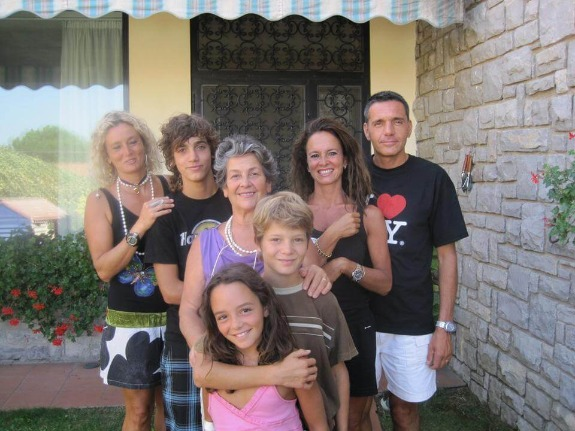

Italian family's inability to feel pain spurs research on relief for chronic sufferers | Genetic Literacy Project

## Italian family's inability to feel pain spurs research on relief for chronic sufferers

[Ricki Lewis](https://geneticliteracyproject.org/author/ricki-lewis-2/) | [Genetic Literacy Project](https://geneticliteracyproject.org/source/genetic-literacy-project/) | December 19, 2017

Chronic pain affects millions of people, who not only suffer but also risk becoming addicted to the opioid drugs used to treat it. A new report on six members of a three-generation Italian family who barely notice burns, bone breaks, and even red hot chili pepper extract rubbed into pricked skin, may pave the way to new painkillers — following clues from a single mutant gene.

The new report, published in the journal [****Brai***n*](https://academic.oup.com/brain/advance-article/doi/10.1093/brain/awx326/4725107), is from James Cox, PhD, senior lecturer in the Molecular Nociception Group at University College London (UCL) and colleagues. The featured family experiences very limited pain, unlike the famous case of a 10-year-old boy from Pakistan that I’ve included in every textbook edition I’ve written.

Cox and co-workers introduced the boy in a 2006 paper in ***[Nature,](https://www.ncbi.nlm.nih.gov/pubmed/17167479)*** “... a ten-year-old child, well known to the medical service after regularly performing 'street theatre.’ He placed knives through his arms and walked on burning coals, but experienced no pain. He died before being seen on his fourteenth birthday, after jumping off a house roof.”

The title of that paper, “An ***SCN9A*** channelopathy causes congenital inability to experience pain,” tells the tale. The “disease of an ion channel” arises from abnormality of one of several types of proteins that form a channel in cell membranes that admits sodium ions. In the boy’s family, the mutant gene is ***[SCN9A](https://www.omim.org/entry/603415?search=SCN9A&highlight=scn9a)***, and the encoded small protein, Nav1.7.

### Sodium channel proteins control pain

At least ten genes encode sodium channel proteins, and mutations in them affect the sensation of pain. Mutations that hamper the functioning of the channels diminish pain, like in the Pakistani boy, whose body made too many endogenous opioids.

Mutations that rev up sodium channels do the opposite, causing “burning man syndrome” [(erythermalgia)](http://www.orpha.net/consor/cgi-bin/OC_Exp.php?Expert=90026) that makes putting on socks unbearable and “paroxysmal extreme pain disorder,” in which sodium channels stay open too long, causing excruciating pain in the rectum, jaw, and eyes.

The pain-free Pakistani boy and the almost-pain-free Italian family members have mutations in different protein parts of the sodium channels. Researchers from the University of Siena introduced the Italian Marsili family in 2008 in the journal ***[Molecular Pain](https://www.ncbi.nlm.nih.gov/pubmed/18983665)***, which focused more on gene expression in white blood cells than on street performers like the Pakistani boy.

Cox picks up the story: “Around 2010, professor John Wood from UCL visited the Siena Pain School and met Letizia, a member of the family and also an associate professor at the university (and co-author of the 2008 paper) and learned more about her symptoms and those of the extended family. We took blood samples and began analyzing their DNA.” They sequenced exomes, the protein-encoding part of the genome.

The Marsilis barely noticed their oddity, just thinking something wasn’t quite right. A broken limb bone would cause a momentary startle, perhaps fleeting faintness, and then no pain. They could eat lots of red hot chili peppers with nary a flush. They didn’t notice burns until they looked at their skin. Yet their sense of smell was hyperacute, sometimes leading to vomiting in response to strong odors. And they didn’t sweat. Three other families are known to have what’s now called Marsili syndrome, and some of them have unwittingly bitten off fingers and lips.

The Marsili family consisted of a 78-year-old mother and two daughters — a 52-year-old with a 16-year-old daughter and a 50-year-old with 24- and 21-year-old sons. The mom, both daughters, and three grandchildren all experienced the dampened pain response. “Fortunately they haven’t suffered any serious injuries, apart from multiple bone fractures. This may be because they are not completely pain insensitive (unlike the ***SCN9A*** patients),” Cox said.

### Poking and prodding in the lab

At the University of Siena, the researchers poked and prodded the Marsilis with pressure gauges on the sensitive area beneath the thumb, exposed their hands to superficial hot and cold, plunged their hands into ice water, and splayed sharp-tipped thingies called von Frey hairs across their inner forearms. Even capsaicin dripped into skin pricks didn’t make them shriek in pain, as most people would when so intimately exposed to chili pepper.

Yet the family members did feel pain not stemming from the body’s periphery: headache, backache, and labor pains. And they experienced deep pressure that would normally cause pain as pleasurable, like a massage.

Cox and his team zeroed in on a gene called ***ZFHX2*** (zinc finger homeobox 2) behind the low pain sensitivity. A single DNA base change alters an arginine to a lysine, hampering the function of the sodium channel protein Nav1.9. Skin biopsies showed that the problem isn’t in the peripheral nerves, and gene expression studies led to the dorsal root ganglia (clustered nerve cell bodies) in the spinal cord. The nerve cells themselves are apparently undamaged — but their signaling appears compromised.

### A cascade of gene activity

***ZFHX2*** encodes a giant protein that is a transcription factor – it controls suites of other genes. The mutation increases expression of six genes while decreasing expression of 16 others, several of them part of pain-signaling pathways and the sense of smell. And the fact that the affected part of the gene is exactly the same in DNA base sequence in a spectrum of species — chimps, dogs, cows, mice, rats, and frogs — indicates its importance.

In parallel to probing the pain-resistant people, the investigators bred mice that either lacked ***ZFHX2*** (knockouts) or had two gene copies bearing the mutation sent in on a bacterial artificial chromosome, in addition to the animals’ own two functional copies (transgenics). Results with the knockouts were inconsistent, but the transgenic mice recapitulated some of the symptoms seen in the people — the animals were sensitive to light touch, but didn’t seem to notice hits to their tails, withstood heat, and didn’t mind chili peppers. They also didn’t seem to enjoy massages as the people did. Dissecting spinal cords of the mice revealed the telltale altered gene expression in the dorsal root ganglia.

### From mutation to drug discovery

The researchers call the study of the Italian family and others “a powerful route to identify novel analgesic drug targets,” perhaps by developing ways to selectively block sodium channels. “With more research to understand exactly how the mutation impacts pain sensitivity, and to see what other genes might be involved, we could identify novel targets for drug development,” said co-author Anna Maria Aloisi, MD, PhD, who was part of the team that initially identified the Marsili family’s condition and is co-author of the new paper.

But the route to a new analgesic isn’t straightforward, as Cox explained:
**

> “***> ZFHX2***>  encodes a transcription factor with enriched expression in damage-sensing neurons. Our focus is now to understand which are the critical genes that are dysregulated by the mutant transcription factor in relation to the pain insensitive phenotype. Some of the genes have known links to pain pathways, others are completely novel. In an ideal world, a single druggable downstream gene could be targeted as part of a drug development program, such as by a small molecule or gene therapy.”

**

Usually gene therapy introduces a functional copy of a gene to augment a disabled one, but in taking advantage of the pain-dampening mutation, gene therapy would actually deliver the mutant ***ZFHX2*** gene — into the spinal cord, which has already been done in some of the [gene therapies](http://blogs.plos.org/dnascience/2016/07/21/hannah-has-her-gene-therapy-for-gan-when-science-becomes-medicine/) I’ve written about. But the best vector, adeno-associated virus (AAV), isn’t big enough to accommodate the gargantuan ***ZFHX2*** gene, a challenge also encountered in gene therapy to deliver the megagene dystrophin to treat muscular dystrophy. “One way around that would be to shorten the gene to see what bits we could lose and still retain function,” Cox told me.

With 10 percent of the world’s population — more than 60 million people — living with [chronic pain](https://bmcpublichealth.biomedcentral.com/articles/10.1186/1471-2458-11-770), against the backdrop of minimizing prescription of [opioids](http://www.slate.com/articles/health_and_science/medical_examiner/2017/08/cutting_down_on_opioids_has_made_life_miserable_for_chronic_pain_patients.html), a new approach to pain management is sorely needed. Perhaps the rare individuals with inherited diminished or absent pain sensations can help the many people suffering from chronic pain.

**Ricki Lewis has a PhD in genetics and is a genetics counselor, science writer and author of The Forever Fix: Gene Therapy and the Boy Who Saved It, the only popular book about gene therapy . Follow her at her [website](http://www.rickilewis.com/) or Twitter [@rickilewis](https://twitter.com/rickilewis?lang=en).**