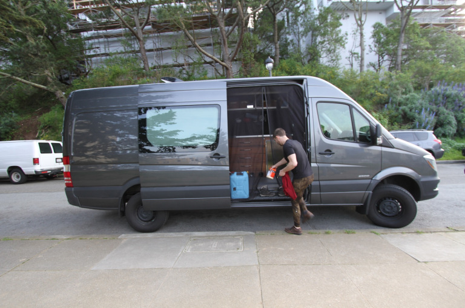
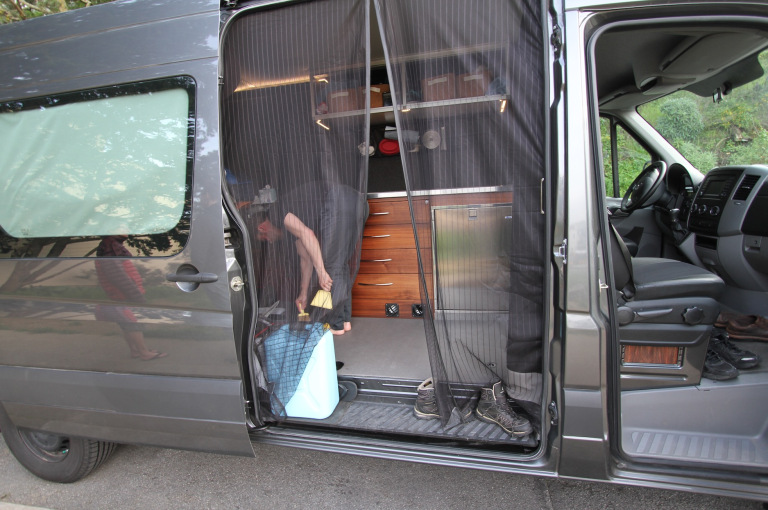
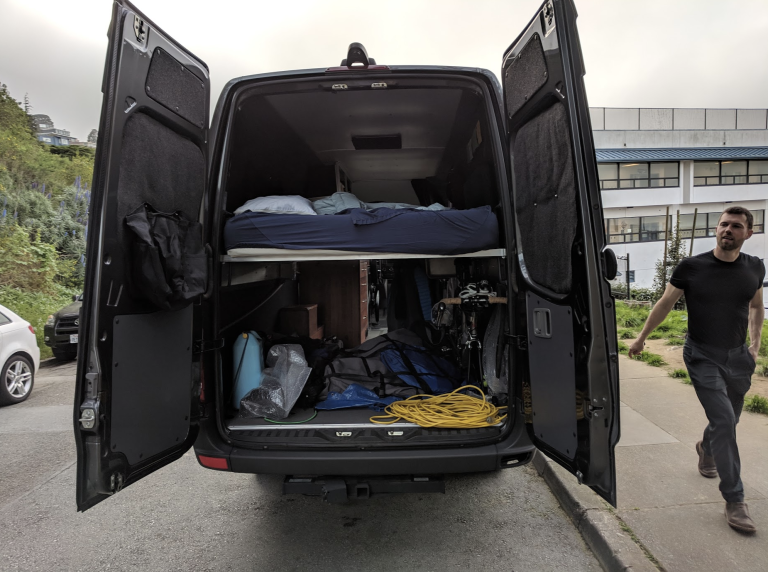
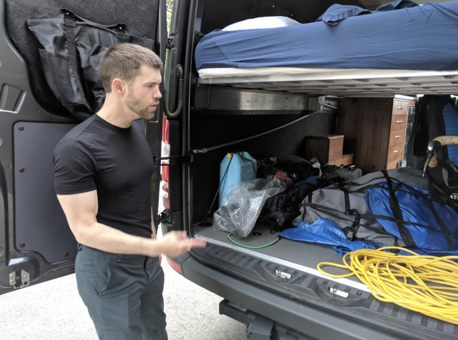
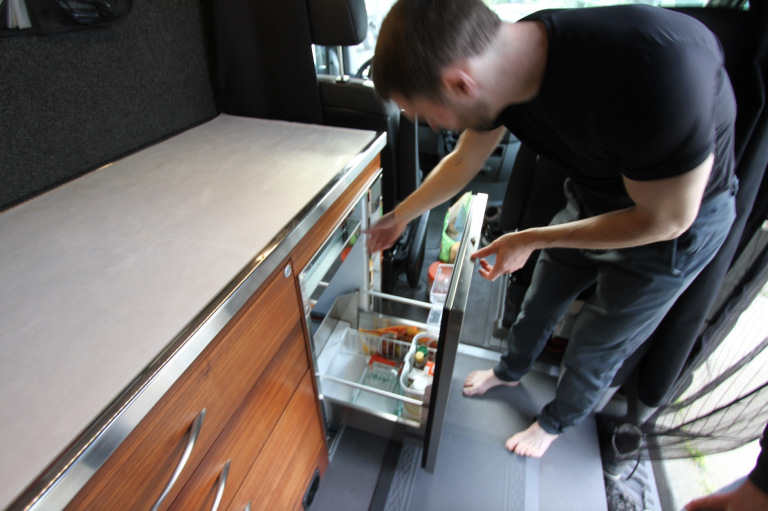
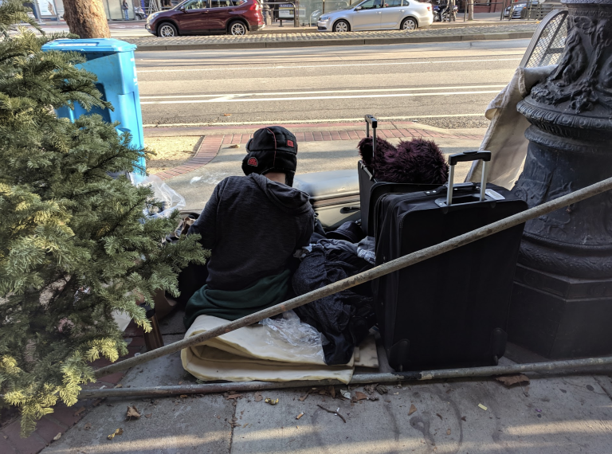
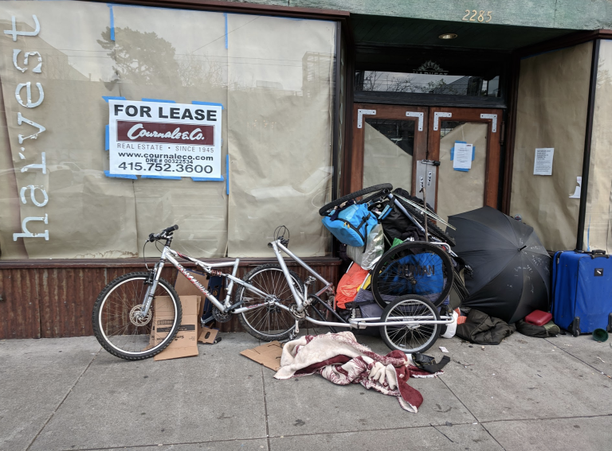
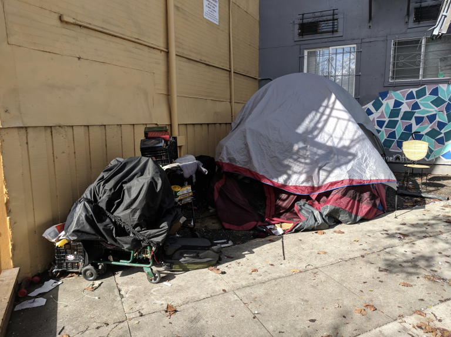
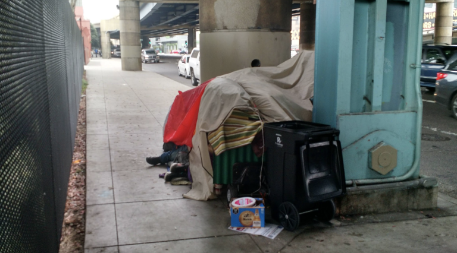

It’s Complicated

Posted on [April 8, 2019](https://granolashotgun.com/2019/04/08/its-complicated/)

# It’s Complicated

[Scroll down to see more content](https://granolashotgun.com/2019/04/08/its-complicated/#)

Last night I had dinner at a friend’s house. The group was composed of the usual San Francisco mix: a college professor, an architect, and a collection of software engineers of various stripes. They were single-ish. Childless. Forty-ish. Well traveled. Charming. Between them they could speak eight languages. They were old enough to be semi-established in their careers, but not flush enough to own property. The conversation turned to everyone’s housing situation.

One of the women at the table just saw the building next to hers sell for an astonishing amount of money and the former tenants were evicted. She’s renting half of a duplex which places her in an especially vulnerable position. Unlike larger multi-unit apartment buildings where tenants have more legal protections, a duplex is small enough to make her defenseless against an owner-move-in-eviction. (If you buy a house you have the right to live in it even if it displaces an existing tenant. Fair enough.) She’s trying to save enough money to buy her apartment when it inevitably comes on the market, but her savings rate is never high enough to keep up with the ever inflating real estate market. She has no Plan B.

Another woman described her situation renting a room (from one of the other dinner guests) and she can’t see any other option for the duration. She’s an adjunct instructor at an institution that is disinclined to create new tenured professors. Her salary in many other parts of the country might buy her a marginally middle class life, but in San Francisco it’s cutting close to cat food territory once housing is factored in. Her most likely trajectory is to use her current position as a slingshot to another school in a different city – or to change professions.

Our host has a rent controlled* apartment he’s been in since he arrived in the city after graduating university. He manages to pay his rent entirely by Airbnbing the spare room – effectively living rent free in San Francisco. *He rolls his eyes*. Having a new stranger in your apartment every few days, organizing the bookings, doing the laundry and dishes, having the same tourist conversations ten thousand times… It’s a job. It’s not free. And he didn’t accurately calculate the income tax from all the Airbnb revenue so he had to write a $7,000 check to the feds this year. His career trajectory stalled out for a number of years as his start-up remains viable, but not yet profitable. And he’s still trying to absorb $100,000 of graduate school student loan debt at forty. If he ever lost that apartment for any reason every other part of his life would fold in on itself pretty fast.

*I’ve heard the argument that rent control is just the government’s way of depriving landlords of a full market rate rent without compensation – a bald wealth transfer and an example of social engineering. The landlord in this instance is north of seventy and inherited a number of apartment buildings from his parents decades ago. He also inherited their [Prop 13](https://en.wikipedia.org/wiki/1978_California_Proposition_13) property tax rate. (For you non-Californians that means the property taxes on his buildings are based on the value they had when they were first purchased, not the current market value. And yes, that arrangement is hereditary.) So the landlord is collecting rent for a couple of dozen apartments from buildings worth many millions of dollars each and he’s paying very little in property tax to the city. These protections against rising property taxes are extended to corporations that own property as well as commercial (rather than residential) properties. That’s another form of wealth transfer and social engineering, no?

But the biggest surprise was the guy who lives in a van. I’ve known him for years and I had no idea. He had an apartment for four years and was paying nose bleed rent. Then he decided to try a different approach. He’s a tech guy. He goes from gig to gig solving computer problems for giant corporations. He works in one place for a while and then moves on. San Francisco, Seattle, wherever. He’s responsible for his own health insurance, his own retirement savings, and there’s never any job security. He doesn’t expect the companies he works for to care about him beyond the next data platform transfer and the feeling is mutual. He works hard for a while, then takes off for Wyoming, New Zealand, Alaska… Then he goes back to work again at the next gig. Living in a van allows him to save money. He’s looking forward to buying property (not necessarily in San Francisco) after the next market correction when real estate comes down in price. In the meantime, he’s got a mobile man cave and a gym membership.

I spent this morning helping a friend in her garden on some little projects. She’s of a retirement age and is a rare creature – a native San Franciscan. It was a gorgeous spring day. I mentioned the van dwelling arrangement and she didn’t approve. “He’s not paying his share. Everyone else is contributing to support the system and he’s cheating.” This is a woman who came from  modest beginnings, struggled at a time when women had very few career options, worked hard all her life, raised children, and continues to look after her infirm husband. She understands the need for personal responsibility. But like a lot of people her age she’s blind to the structural changes in the economy that effect others.

I went down the list of items that applied to her generation. Student loans? Never. Full *defined benefits* pension from a private company where she spent decades. Social Security – something no young person expects to even exist by the time they retire. (Retire? That’s adorable.) Medicare and Medicaid? Same same. Prop 13… But most importantly it’s the spread between what an educated professional can earn and what housing of any kind costs. Those two points have grown miles apart since she was young. And she’s a direct beneficiary of those massively inflated property values that must be carried by others. The institutions that once served the broad middle of the American population have been gutted and are now predatory. Living in a van is a rational response.

All this needs to be placed within a larger context. Healthy middle class people with advanced degrees who speak three languages and have other resources to fall back on are wrestling with how to navigate the current economy. We need to reexamine the narrative that people who fail in this environment are simply lazy, stupid, weak, and prone to addiction. It’s easy to fall between the cracks. I’d drink vodka for breakfast too if I lived under the freeway. And how do you get back up once you fall? It’s complicated.

### Share this:

- [Share](https://granolashotgun.com/2019/04/08/its-complicated/#)

-

[Like](https://widgets.wp.com/likes/index.html?ver=20190321#)

- 
- 
- 
- 
- 
- 
- 
- 

[8 bloggers](https://widgets.wp.com/likes/index.html?ver=20190321#) like this.

[Responding to External Reality](https://granolashotgun.com/2018/10/12/responding-to-external-reality/)In "Affordable housing"

[Moving House](https://granolashotgun.com/2018/12/05/moving-house/)In "Displacement"

[Some Kindly Advice From an Old White Guy](https://granolashotgun.com/2015/06/21/some-kindly-advice-from-an-old-white-guy/)In "Baltimore"

## Published by

### Johnny

I'm an amateur architecture buff with a passionate interest in where and how we all live and occupy the landscape, from small rural towns to skyscrapers and everything in between. I travel often, conduct interviews with people of interest, and gather photos and video of places worth talking about. The good, the bad, and the ugly - it's all fascinating to me.[View all posts by Johnny](https://granolashotgun.com/author/jdsfrisco/)

Categories [Uncategorized](https://granolashotgun.com/category/uncategorized/)Tags [Affordable housing](https://granolashotgun.com/tag/affordable-housing/), [Airbnb](https://granolashotgun.com/tag/airbnb/), [California](https://granolashotgun.com/tag/california/), [Gentrification](https://granolashotgun.com/tag/gentrification/), [Gig economy](https://granolashotgun.com/tag/gig-economy/), [High property values](https://granolashotgun.com/tag/high-property-values/), [High rents](https://granolashotgun.com/tag/high-rents/), [Homeless population](https://granolashotgun.com/tag/homeless-population/), [Household resilience](https://granolashotgun.com/tag/household-resilience/), [Individual response](https://granolashotgun.com/tag/individual-response/), [Prop 13](https://granolashotgun.com/tag/prop-13/), [Rent Control](https://granolashotgun.com/tag/rent-control/), [Room mates](https://granolashotgun.com/tag/room-mates/), [San Francisco](https://granolashotgun.com/tag/san-francisco/), [Tech economy](https://granolashotgun.com/tag/tech-economy/), [Van dwelling](https://granolashotgun.com/tag/van-dwelling/), [Van living](https://granolashotgun.com/tag/van-living/)[61 Comments](https://granolashotgun.com/2019/04/08/its-complicated/#comments)

## 61 thoughts on “It’s Complicated”

1. **Pepsy**  says:

[April 12, 2019 at 9:24 pm](https://granolashotgun.com/2019/04/08/its-complicated/#comment-15789)

check this out: https://www.youtube.com/watch?v=Bhy3zI3wvAo

“Cycling through Homeless Camps on Santa Ana River Bike Trail in Orange County California”

go down there and have a look

[Reply](https://granolashotgun.com/2019/04/08/its-complicated/?replytocom=15789#respond)

    1. **[Johnny](https://granolashotgun.wordpress.com/)**  says:

[April 12, 2019 at 9:31 pm](https://granolashotgun.com/2019/04/08/its-complicated/#comment-15790)

Yes, I’ve been there. I have lots of photos. I also talked to some officials in the area. They won’t provide services for fear of attracting even more homeless and creating a permanent condition. But not providing at least clean water and sanitary facilities is creating a public health risk that can and likely will affect the larger community. So we get a favela…this problem doesn’t have a solution anyone wants to embrace. So we won’t…

[Reply](https://granolashotgun.com/2019/04/08/its-complicated/?replytocom=15790#respond)

2. **Mike P**  says:

[April 11, 2019 at 3:47 am](https://granolashotgun.com/2019/04/08/its-complicated/#comment-15769)

For whatever reason I have hobby interest in American residential development and auto use. I have a common interest in many postings here, and I have grow to appreciate, not only the posts here but the discourse too.

California’s housing issue, is a mostly matter of exclusionary zoning, not Prop 13

Here in Petaluma, “R2 (Residential 2) zone. The R2 zone is applied to areas previously developed and intended for detached single dwellings on individual lots, at densities ranging from 2.6 to 8.0 units per acre. The R2 zone is consistent with and implements the Low Density Residential land use classification of the General Plan.”

2.6 to 8.0 units per acre at 2.53 people (average household in the US) = 20.24 people per acre maximum !

Cost

One reason housing is expensive here, is low density development. For example minimum lot size for R2 is 6000 SF, currently if available is around $350,000 today. It can house 1 family by law. Minimum entry is $350,000 with no house. If this was replaced with what Minneapolis did, allow 3 housing units per lot, then the cost basis for each unit is divided by 3, or $116,000 land cost per unit. A significant saving.

Currently 80% of America housing stock is ‘low density single family homes”. A real monoculture.

History

Two things have long been known about land-use regulations. One is that elements of them—in the form of large lot requirements and other aspects of “exclusionary zoning”—have led to racial and economic segregation. The other is that restrictive land use and building codes in cities limit housing construction (and therefore housing supply), leading to increased costs, worse affordability problems, and deepened inequality in urban centers. ” The Atlantic https://www.theatlantic.com/business/archive/2016/01/zoning-land-use-segregation/422595/

Expensive by Design is what I call this. It wasn’t until began looking up the history of Zoning, did I fully grasp this issue.

California is a unique example of a policy taken to the end result. Where I live has a narrow development corridor, along the 101. The lands West of 101 are predominately Agriculture or Trust, and won’t be developed. 1960 when zoning has we know it was adopted here, the population of California was 15.87 million people. Today the population is 39.56 million people, a net 23.69 million people. If I divide 23.69 million x 20.24 people per acre (low density development) = 1,170,454 million acres of development. That’s lot of land ! Many places in the US, like Las Vegas for example, continues to spread out horizontally. The 101 corridor is tapped out, like many desirable areas of California.

What we are facing (California) is the end of road of a monoculture of development, low density single family homes, car centric too. (separate but connected issue) . That’s all Americans know because its all we’ve built for more than 70 years.

The policy that would have the single largest impact ? Remove the low density development standard for the whole state. What stands in the way ? Every community built to this standard. No one wants to change.

Jerry Brown passing ADU bill, SB1069, was critical piece of legislation in my mind, in such that it mandated every jurisdiction in California allow ADUs (accessory dwelling units) as a development standard and create guideline for implementation of such.

Why was this a big deal ? In a single bill it legally allowed the density of all R-1 development in the entire state to increase. Granted many places ADU were an allowed development standard, but other places, ADUs were still a conditional use that needed approval.

Scott Wiener’s SB50 is a narrow attempt to kill that “low density development standard” in some areas of the state. It also is a step in the right direction. It might pass.

“The housing situation in the Baya Area isn’t about land availability. It’s about a culture that simply can’t come to grips with how to move forward in a cohesive manner. All the individual incentives pit groups against each other and are fundamentally unresolvable.”

I can easily see what would help, changing the zoning laws, however 70 years into a monoculture of ‘low density’ is quite a force to overcome.

[Reply](https://granolashotgun.com/2019/04/08/its-complicated/?replytocom=15769#respond)

    1. **TD**  says:

[April 11, 2019 at 4:25 pm](https://granolashotgun.com/2019/04/08/its-complicated/#comment-15777)

Your suggestions would, of course, continue to help drive up the price of single family homes because while you may not approve of them, a lot of people still want them. It’s hard to get around the old law of supply and demand. This will continue to enrich existing homeowners. In fact, I’d guess that owning a home in Petaluma has the potential of eventually scoring better than most high tech stock options. Meanwhile, we’re telling people who’d like a house of their own that they should give up those aspirations or move elsewhere.

There is also a racial aspect to this in that people who own houses tend to be older and disproportionately white while people crammed into high density or second units tend to be younger and disproportionately minority. The homeowners get richer (and their disproportionately white kids will inherit well one day) while those in these second units have no chance of garnering some equity of their own, and many of the minorities are less likely to inherit much one day.

[Reply](https://granolashotgun.com/2019/04/08/its-complicated/?replytocom=15777#respond)

        1. **Theo**  says:

[April 30, 2019 at 4:59 am](https://granolashotgun.com/2019/04/08/its-complicated/#comment-15983)

In San Francisco, I would be fine with single-family homes being rare luxury items if it means people can afford to live in apartments. Apartments don’t have to mean a lifetime of rent. There is such a thing as condos, which here are usually cheaper than single-family homes.

If I didn’t have to pay for it, of course I would love to have a castle of my own. Who wouldn’t? That is the story of the Suburban Experiment. Americans are insulated from the fiscal and societal impacts of their choices, and so they have built an expectation that they can get the castle in a field, a car for every adult, and a highway to drive everywhere.

Regardless of any social engineering, or Agenda 21, my concern is that the Suburban Experiment is completely unsustainable. It is environmentally destructive, it doesn’t have the productivity to pay for upkeep, and it damages its inhabitants in many ways. The collapse of the Suburban Experiment is inevitable, and I don’t want to be caught in the fallout.

[Reply](https://granolashotgun.com/2019/04/08/its-complicated/?replytocom=15983#respond)

3. **Pat**  says:

[April 10, 2019 at 3:42 pm](https://granolashotgun.com/2019/04/08/its-complicated/#comment-15764)

***“The deal used to be that civil servants were paid less than private sector workers in exchange for an understanding that they had job security for life.***

******

***But we politicians, pushed by our friends in labor, gradually expanded pay and benefits to private-sector levels while keeping the job protections and layering on incredibly generous retirement packages that pay ex-workers almost as much as current workers.”***

I was driving a relative to get chemo.

During one of those days, there were two CDCR (prison guards) who transported a prisoner to get chemo done.

And after the prisoner was hooked up, the nurse walks briskly back to the office, and I notice her sobbing. At first I thought either she was one of those bleeding hearts or knew the prison inmate personally. One of the CDCR guard walks towards her, i guess just to make sure all was okay.

I overheard them talking softly, basically the nurse (private sector) told the prison guard (state employee) that the person sitting a couple of stations away (another chemo drip station) is a retired school teacher (local school district) and she’s getting some no-name chemo brand due to her insurance ; but,

the prison inmate (state ward) was getting the very best most expensive chemo brand available.

I felt for the nurse.

Look I don’t know what the prisoner did; I don’t know what insurance plans small school districts have, but there is a scam somewhere in this story—- with the CDCR, and i’m sure the prison guard fits your above description of generous retirement packages and pay, also the teacher’s union is also probably on the take, the chemo place ordering the best and the not-so-best chemo options depending on customer…

it’s all topsy-turvy, and people need to look into these stories closer.

[Reply](https://granolashotgun.com/2019/04/08/its-complicated/?replytocom=15764#respond)

4. **[Macster](http://gravatar.com/hhicyclust)**  says:

[April 10, 2019 at 4:04 am](https://granolashotgun.com/2019/04/08/its-complicated/#comment-15761)

Started out in Southern California in 1974, I was a 29 year old, no degree, Honorably discharged pot head (remember Brad Pitt in True Romance?) that was me. Two years later I bought the duplex two doors down the street from the apartment I was living in ($126 a month with a room mate) the duplex cost 90 grand. I went to the bank and with a hand shake received $15 grand non secured as my down payment and the owners carried the paper on the balance at 9% for ten years. Eight years later I sold the place for $350,000.00, all that dumb kid did was buy a house. Now fast forward 46 years……you can’t do that anymore, not in Northern or Southern California. That duplex would cost at least a million bucks now. Go to Chile and buy 200 acres, fuck I don’t know, just don’t piss into the wind.

[Reply](https://granolashotgun.com/2019/04/08/its-complicated/?replytocom=15761#respond)

5. **[Nick_Adams](http://sweetferocityofexcellence.wordpress.com/)**  says:

[April 10, 2019 at 1:43 am](https://granolashotgun.com/2019/04/08/its-complicated/#comment-15760)

“But like a lot of people her age she’s blind to the structural changes in the economy that effect others.”

People her age lived through the largest, most equitably distributed economic expansion in the history of the country, and possibly the history of the world. (https://press.princeton.edu/titles/10544.html)

Those days are never coming back. Rather than mourning what’s not going to return, maybe we ought to be thinking more about how best to play the hand we’ve been dealt, just like the van guy.

[Reply](https://granolashotgun.com/2019/04/08/its-complicated/?replytocom=15760#respond)

6. **[Celeste Bancos](http://pebblesrox.wordpress.com/)**  says:

[April 9, 2019 at 6:23 pm](https://granolashotgun.com/2019/04/08/its-complicated/#comment-15757)

I watched this Extra History series on the Bronze Age collapse recently and there were some themes that reminded me of your work. Mainly, the idea that the Bronze Age civilizations were brought down as a result of too much complexity and interconnecting parts leading to fragility. I figured I’d share it with you since it seems like something you might enjoy 

The Bronze Age Collapse – Before the Storm – Extra History – #1 https://youtu.be/KkMP328eU5Q

[Reply](https://granolashotgun.com/2019/04/08/its-complicated/?replytocom=15757#respond)

    1. **[Johnny](https://granolashotgun.wordpress.com/)**  says:

[April 9, 2019 at 7:48 pm](https://granolashotgun.com/2019/04/08/its-complicated/#comment-15758)

Eric Cline is an expert in the late bronze age collapse. 1177 was a bad year for civilization. Google him. He’s actually kind of funny.

[Reply](https://granolashotgun.com/2019/04/08/its-complicated/?replytocom=15758#respond)

7. **Olivier**  says:

[April 9, 2019 at 11:37 am](https://granolashotgun.com/2019/04/08/its-complicated/#comment-15751)

Van guy is eye candy! But, seriously, is van living even legal? Is there any danger a live-in van might get impounded (not in SF specifically but in general) and if so what would be his plan C?

[Reply](https://granolashotgun.com/2019/04/08/its-complicated/?replytocom=15751#respond)

    1. **[Johnny](https://granolashotgun.wordpress.com/)**  says:

[April 9, 2019 at 12:44 pm](https://granolashotgun.com/2019/04/08/its-complicated/#comment-15752)

Yes, Eric is very pretty. Nice guy too. Technically van living is usually illegal in many jurisdictions, but every place is different. A shiny well maintained Mercedes van occupied by the eye candy guy – if parked in a spot where no one complains…

[Reply](https://granolashotgun.com/2019/04/08/its-complicated/?replytocom=15752#respond)

        1. **David G.**  says:

[April 15, 2019 at 1:44 am](https://granolashotgun.com/2019/04/08/its-complicated/#comment-15802)

Sorry to ask a crude question, but where does he pee?

[Reply](https://granolashotgun.com/2019/04/08/its-complicated/?replytocom=15802#respond)

            1. **[Johnny](https://granolashotgun.wordpress.com/)**  says:

[April 15, 2019 at 3:39 am](https://granolashotgun.com/2019/04/08/its-complicated/#comment-15805)

I did a full interview with him.My friend Kirsten from Faircompanies.com will be doing a video soon. Short answer 1) gym 2) work 3) friends house 4) pee bottle.

[Reply](https://granolashotgun.com/2019/04/08/its-complicated/?replytocom=15805#respond)

8. **Orca**  says:

[April 8, 2019 at 6:12 pm](https://granolashotgun.com/2019/04/08/its-complicated/#comment-15708)

Prop 13 was a solution to a problem….41 years ago. Wealth transfer…social engineering? All true. Just plain welfare for the rich and more-or-less-rich, actually.

Reasonable people would recognize the perverse incentives of Prop 13 and correct them in a fair way (say, reducing sales/income taxes and other “fees” for the concomitant increase in property tax revenue.) But that will never happen. So loggerheads it is.

I guess at some point the dinner party guests will simply throw in the towel and look back years from now at the fun and interesting times they had while living in San Francisco. (I’m assuming that few, if any at that table are Bay Area natives).

[Reply](https://granolashotgun.com/2019/04/08/its-complicated/?replytocom=15708#respond)

    1. **Brian**  says:

[April 8, 2019 at 7:14 pm](https://granolashotgun.com/2019/04/08/its-complicated/#comment-15714)

Without Prop 13, my property tax would have at least doubled in the 8 years I’ve owned my home ($6k to $12k), based on comparable properties. Is that fair, even if I could absorb the extra bump? My grandparents certainly couldn’t. What do you say to them – suck it up and move to Arizona even though your house is paid for? Also, contrary to popular belief, property taxes do rise every year, albeit slowly.

As for commercial properties, different animal entirely.

[Reply](https://granolashotgun.com/2019/04/08/its-complicated/?replytocom=15714#respond)

        1. **[Johnny](https://granolashotgun.wordpress.com/)**  says:

[April 8, 2019 at 7:21 pm](https://granolashotgun.com/2019/04/08/its-complicated/#comment-15715)

I’m not making an argument for rescinding Prop 13. I’m a property owner in San Francisco and I would be in even worse shape than you – more like your grandparents. And politically it’s never going to happen. Instead, I predict Prop 13 will endure and become increasingly irrelevant as new kinds of taxes on all sorts of things fill the gap.

By the way, what impact do you think the theoretical removal of Prop 13 would have on property values and resale? How many people would sell and move, and at what price? What effect might that have on the movement of people from place to place – including renters. See also, the theoretical removal of rent control…

[Reply](https://granolashotgun.com/2019/04/08/its-complicated/?replytocom=15715#respond)

            1. **Chris**  says:

[April 22, 2019 at 9:26 am](https://granolashotgun.com/2019/04/08/its-complicated/#comment-15908)

I am one of the evil people who inherited residential and commercial properties with significant Prop 13 savings. Prop 13 doesn’t just protect white people. My family are Armenian immigrants and have intermarried with Mexican and Colombian immigrants. Most of my friends and family are non-white property owners. Welfare for the rich??? The money we don’t pay in taxes enables us to keep long-time local businesses and tenants in place that otherwise couldn’t afford to pay market rents elsewhere, and 80-90% of our rental income goes back into to capital upgrades and maintenance of the properties. Buildings wear out and break and it cost a lot of money paying licensed, union labor to repair them. Imagine renovating a building and then paying 30K in taxes on top of that without raising rent on the tenants. I’d like to think of our business as self-sufficient affordable housing. I don’t raise my rents, I don’t ask for affordable housing subsidies but I refuse to pay taxes to some bureaucracy either. Any increase in property taxes will just hurt my tenants even more, and consolidate property ownership into mega-corporations who can absorb the regulatory costs. The only long-term solution is to gut zoning codes and let the market drive down prices.

[Reply](https://granolashotgun.com/2019/04/08/its-complicated/?replytocom=15908#respond)

                1. **[Johnny](https://granolashotgun.wordpress.com/)**  says:

[April 22, 2019 at 2:46 pm](https://granolashotgun.com/2019/04/08/its-complicated/#comment-15912)

No one in this scenario is evil. What I’m describing is a collection of institutional incentives and prohibitions that have locked in a particular set of dynamics. No one wants any of the individual rules to change, but everyone seems to want someone else to do things differently. In the end things won’t bend. Instead, they’re snap and break.

[Reply](https://granolashotgun.com/2019/04/08/its-complicated/?replytocom=15912#respond)

        2. **Orca**  says:

[April 8, 2019 at 7:58 pm](https://granolashotgun.com/2019/04/08/its-complicated/#comment-15716)

That’s assuming your assessor matches market fluctuations in lock step……which is doubtful. I’m just suggesting it might be an idea to take a more rational – if even partial – mark-to-market approach. (I mean, what do they do in the other 49? The rest of the planet?) That said, JS’s crystal ball is accurate…..more “fees” and hidden taxes. Many of which are regressive and will even further tighten screws on CA’s vanishing middle class.

[Reply](https://granolashotgun.com/2019/04/08/its-complicated/?replytocom=15716#respond)

            1. **[Johnny](https://granolashotgun.wordpress.com/)**  says:

[April 8, 2019 at 8:11 pm](https://granolashotgun.com/2019/04/08/its-complicated/#comment-15717)

Here’s one potential gap-filling source of tax revenue that will contribute to Prop 13 being less important moving forward.

A per mile fee for all vehicles on public roads. All the cars are already de facto chipped. Imbedding sensors everywhere is relatively cheap and easy. Billing in real time is already a reality in many systems. See also parking on public streets. No need for parking meters. The roads and the cars will work it out seamlessly in the cloud. This will happen first in city centers then ripple out to the suburbs in increments. Rural populations will resist and rebel, but the county, state, and federal roads will all be pay-per-view soon enough. I’m sure you can imagine other such revenue enhancement systems.

[Reply](https://granolashotgun.com/2019/04/08/its-complicated/?replytocom=15717#respond)

                1. **Kent**  says:

[April 8, 2019 at 9:01 pm](https://granolashotgun.com/2019/04/08/its-complicated/#comment-15723)

I’d give it 24 hours until we start seeing youtube tutorials on how to defeat traffic-monitoring GPS chips in cars so that you can drive around tax-free.

[Reply](https://granolashotgun.com/2019/04/08/its-complicated/?replytocom=15723#respond)

                    1. **[Johnny](https://granolashotgun.wordpress.com/)**  says:

[April 8, 2019 at 9:03 pm](https://granolashotgun.com/2019/04/08/its-complicated/#comment-15724)

That could become a federal crime… The surveillance cameras will cross reference the chips and sensors. These systems are already in place. They just need to be tuned.

[Reply](https://granolashotgun.com/2019/04/08/its-complicated/?replytocom=15724#respond)

                        1. **Brian**  says:

[April 8, 2019 at 9:50 pm](https://granolashotgun.com/2019/04/08/its-complicated/#comment-15728)

Yes. Cameras that take a picture of the license plates of all cars that pass are already a thing. You might be able to disconnect your tracker, but try driving around without a license plate.

[Reply](https://granolashotgun.com/2019/04/08/its-complicated/?replytocom=15728#respond)

            2. **Michael**  says:

[April 9, 2019 at 12:34 am](https://granolashotgun.com/2019/04/08/its-complicated/#comment-15738)

So the $64 question is always, ” How much do you want a home owner to pay each year?”

I’ve been a Calif home owner since 1980. In my third home. I pay $4843 per year plus $878 in bonds and assessments. Total $5721 or $477 per month. Fair? Reasonable? Need more info?

Property taxes were never designed to be “wealth” taxes, but to to pay for services provided, like roads, schools, water etc. Its those program costs that are out of whack as well as the cost of administering the never ending litany of new programs.

[Reply](https://granolashotgun.com/2019/04/08/its-complicated/?replytocom=15738#respond)

                1. **Andy Stow**  says:

[April 12, 2019 at 4:14 am](https://granolashotgun.com/2019/04/08/its-complicated/#comment-15780)

I pay nearly that much in the midwest, in a home worth under $200k.

[Reply](https://granolashotgun.com/2019/04/08/its-complicated/?replytocom=15780#respond)

        3. **irrational_urbanist**  says:

[April 9, 2019 at 4:18 pm](https://granolashotgun.com/2019/04/08/its-complicated/#comment-15756)

My property taxes have more than doubled in that same timeframe – house value was below yours but yeah it happens, and it has no effect on property values or sales in my area. My taxes are higher than Michael’s below, on a home value below $300k. There are reasonable exemptions for those on fixed income – such that there are still plenty of them.

[Reply](https://granolashotgun.com/2019/04/08/its-complicated/?replytocom=15756#respond)

    2. **Stevie**  says:

[April 9, 2019 at 8:58 pm](https://granolashotgun.com/2019/04/08/its-complicated/#comment-15759)

Prop 13 was a bad solution to a real problem. Perhaps a partial fix would be a split roll where commercial property pays market rate, as corporations have gamed the system (using loopholes to avoid transfer of ownership) to the point where residential is carrying most of the load, the reverse of when Prop 13 passed.

[Reply](https://granolashotgun.com/2019/04/08/its-complicated/?replytocom=15759#respond)

9. **Mike B**  says:

[April 8, 2019 at 5:23 pm](https://granolashotgun.com/2019/04/08/its-complicated/#comment-15706)

As messy as these problems are, it’s worth noting the vast majority of the country is not besest by them. Other places have other problems of course — The recent posts on this blog from Memphis illustrate that. But there is still a huge middle part of the spectrum that is pretty good and even great. Its not expensive to buy a home and live well in the vicinity of, say, Columbus, OH.

[Reply](https://granolashotgun.com/2019/04/08/its-complicated/?replytocom=15706#respond)

    1. **Chris B**  says:

[April 9, 2019 at 10:57 am](https://granolashotgun.com/2019/04/08/its-complicated/#comment-15750)

Nor any other mid-sized, mid-continent metro area of ~2 million.

[Reply](https://granolashotgun.com/2019/04/08/its-complicated/?replytocom=15750#respond)

10. **Brian**  says:

[April 8, 2019 at 4:28 pm](https://granolashotgun.com/2019/04/08/its-complicated/#comment-15703)

I work at a tech startup in SF. In a nutshell, home ownership and/or kids is something reserved for the C suite. Everyone else, with a few exceptions, is paying nose bleed rents or has the “golden handcuffs” in a rent controlled unit. An informal survey reveals no Plan Bs. None. Keep in mind these are folks ranging from 25-50 years old, with advanced degrees. People that could give talks about linear algebra, global politics and the like. They’re effectively resigned to being lifetime renters.

Meanwhile, I have a relative who’s developmentally disabled. Her and her boyfriend had been getting by in Sonoma County for years on a combination of public assistance & crappy part time jobs. Same apartment for a decade. They recently got evicted. Legal but kind of petty reasons. They are effectively homeless although the State keeps them up in hotels for the time being. Because of their history, and the general market situation on Sonoma County, no one will rent to them.

[Reply](https://granolashotgun.com/2019/04/08/its-complicated/?replytocom=15703#respond)

11. **[Andrew](http://www.hereinvannuys.com/)**  says:

[April 8, 2019 at 4:21 pm](https://granolashotgun.com/2019/04/08/its-complicated/#comment-15702)

I went out to get some items at the 99 Ranch Market in Van Nuys yesterday. I walked there and passed a mentally ill man who has lived in the parking lot, under the rafters, behind the alley, for more than a year. He pushes a shopping basket and talks to himself, he dances around and mutters unintelligible things.

I thought to myself how can this be tolerated? How can an obviously ill person just be left to fend for himself on the street? This is California, the whatever 5th, 6th, 7th largest economy in the world. And this is just fine, homeless people everywhere, mentally ill, not mentally ill, drug addicted, sober, living in cars, living on benches, living in vans.

This is where I feel my conservative leanings come in. I don’t think any of this should be allowed. Period. I want to see “homeless” people housed, first by registering anyone who is homeless, secondly by evaluating their mental, physical, financial condition. Thirdly, by erecting regulated, policed, licensed homeless camps with sanitation and security.

The toleration of SF for alternate lifestyles has been a long standing marker of the city since the 1950s. It used be a positive, as in open mindedness about artists, gays, non-conformists of all kinds.

But now there is a cruelty to the toleration because it goes on and permits the suffering of hundreds of thousands of people who cannot afford to live in a minimally civilized, clean, affordable home. The liberalism of SF has become a way to tolerate freedom of squalor, which in turn degrades life for the entire region.

Liberalism and openness to everything sometimes leads to unintended consequences. The desire to open our southern border to welcome illegal immigration in turn causes every parent in Los Angeles to drive their child to school out of the school district to avoid “bad schools.” So simply being open minded, without understanding the consequences, put everyone in peril. The same is true of permitting homeless while allowing parks, streets, sidewalks, cities to turn into open air urine smelling dumps.

Only an earthquake will turn things around I’m afraid.

[Reply](https://granolashotgun.com/2019/04/08/its-complicated/?replytocom=15702#respond)

    1. **Orca**  says:

[April 8, 2019 at 8:31 pm](https://granolashotgun.com/2019/04/08/its-complicated/#comment-15722)

Unintended consequences are a 8itch. As to homeless—- in retrospect, we didn’t do ourselves any favors when we went all pitchforks and torches against SRO hotels a while back. (Think “Mars Hotel”, @ 4th and Howard, where the Moscone Center now stands. Some of you may be familiar with it….=)) Yes, they were disgusting…..but the alternative is…..sleeping on the sidewalk?

One thing for certain……Granola Shotgun is a place where people of good faith can come and reason together.

[Reply](https://granolashotgun.com/2019/04/08/its-complicated/?replytocom=15722#respond)

    2. **Dan S**  says:

[April 8, 2019 at 10:22 pm](https://granolashotgun.com/2019/04/08/its-complicated/#comment-15733)

> This is where I feel my conservative leanings come in. I don’t think any of this should be allowed. Period. I want to see “homeless” people housed, first by registering anyone who is homeless, secondly by evaluating their mental, physical, financial condition. Thirdly, by erecting regulated, policed, licensed homeless camps with sanitation and security.

Clearly you mean “socially” conservative, because you’re describing what sounds like a rather extensive public housing, safety, sanitation, and healthcare program, so … “socialist”.

But I think you are mistaken to think that SF’s homelessness problem continues because people “tolerate” the lifetstyle. Rather, it’s that there isn’t enough political interest at the local, state, or national level to fund the programs you describe that would help mitigate the problem – because voters are “fiscally” conservative.

What you’re seeing on the streets is a vulnerable population being left to the “market” and its incentive framework, as determined at the local ballot box.

[Reply](https://granolashotgun.com/2019/04/08/its-complicated/?replytocom=15733#respond)

        1. **TD**  says:

[April 8, 2019 at 10:51 pm](https://granolashotgun.com/2019/04/08/its-complicated/#comment-15735)

However, CA is already one of the highest taxed states, yet still struggles with providing government services. If there is opposition to additional taxes a lot has to do with a sense that the politicians and bureaucrats will keep it for themselves in the form of compensation and rich pensions.

Willie Brown once wrote:

“If we as a state want to make a New Year’s resolution, I suggest taking a good look at the California we have created. From our out-of-sync tax system to our out-of-control civil service, it’s time for politicians to begin an honest dialogue about what we’ve become.

Take the civil service.

The system was set up so politicians like me couldn’t come in and fire the people (relatives) hired by the guy they beat and replace them with their own friends and relatives.

Over the years, however, the civil service system has changed from one that protects jobs to one that runs the show.

The deal used to be that civil servants were paid less than private sector workers in exchange for an understanding that they had job security for life.

But we politicians, pushed by our friends in labor, gradually expanded pay and benefits to private-sector levels while keeping the job protections and layering on incredibly generous retirement packages that pay ex-workers almost as much as current workers.

Talking about this is politically unpopular and potentially even career suicide for most officeholders. But at some point, someone is going to have to get honest about the fact that 80 percent of the state, county and city budget deficits are due to employee costs.

Either we do something about it at the ballot box, or a judge will do something about in Bankruptcy Court. And if you think I’m kidding, just look at Vallejo.”

[Reply](https://granolashotgun.com/2019/04/08/its-complicated/?replytocom=15735#respond)

            1. **Michael**  says:

[April 9, 2019 at 12:39 am](https://granolashotgun.com/2019/04/08/its-complicated/#comment-15739)

I’m sending this to Kamala Harris right now!

[Reply](https://granolashotgun.com/2019/04/08/its-complicated/?replytocom=15739#respond)

12. **Diane**  says:

[April 8, 2019 at 3:48 pm](https://granolashotgun.com/2019/04/08/its-complicated/#comment-15701)

This statement is not to criticize your friends’ choices, but just to say that others of us do make choices to avoid the situations they are in. (Which also means we don’t get to *enjoy* the situation they are in.) My husband and I were willing to work for less pay in order to have employer-paid insurance because we figured the group rate (including covering pre-existing conditions) would be a better deal for us in the long run. We went (and sent our children) to public (and second-rate and even third-rate) colleges on academic scholarships or our own (and theirs) dime. Housing interest rates were 19 percent when we were in our early 20s, so we had to wait for the inevitable course correction to buy our first house, a fixer-upper. (And when something gets fixed, something else needs fixing.) We live someplace that’s not glamorous (not even shabby chic) and don’t work in the top tier (probably somewhere in the bottom 10) of our fields. But we and our children have permanent employment, have defined retirement and generous insurance benefits, will always own a house if that’s the choice, and have a reasonable cost of living. We are content with the poison we picked. (Although I admit I sure hate missing out on a cool Granola Shotgun supper party in an alluring place like San Francisco !)

[Reply](https://granolashotgun.com/2019/04/08/its-complicated/?replytocom=15701#respond)

13. **[Andrew Burleson](http://strongtowns.org/)**  says:

[April 8, 2019 at 3:13 pm](https://granolashotgun.com/2019/04/08/its-complicated/#comment-15699)

Hey Johnny,

As an imported San Franciscan (2.5 years) who has lived a bit all over the US, one thing genuinely confuses me:

Why don’t more people leave the Bay Area (and other major metros that are having the same issues)?

On the one hand I completely understand that SF offers interesting jobs (not as easy to find elsewhere) and a walkable city (almost impossible to find elsewhere).

But, to me, that’s only worth so much. If you’re struggling to make ends meet here, you can almost certainly move to a place like Spokane, Salt Lake, Colorado Springs, Tucson, Houston, etc, or any number of small towns, and put together a pretty comfortable life.

And to be fair a lot of people leave.

But considering how pervasive these problems are it seems like a more rational response would be a flood of people heading out, rather than the steady trickle I see in practice.

Why do you think that is? I suppose that people who are “staying in a precarious situation with no plan B” must feel they have no other choice. Can you help me understand why that is?

Thanks for your blog, it captions my pain 

[Reply](https://granolashotgun.com/2019/04/08/its-complicated/?replytocom=15699#respond)

    1. **Dan S**  says:

[April 8, 2019 at 6:16 pm](https://granolashotgun.com/2019/04/08/its-complicated/#comment-15709)

A lot of people are leaving, and a lot of people are coming in, too. Net migration to the Bay Area (if not San Francisco) is still positive, and those who come in tend to be more economically upward mobile than those who leave:

https://www.bayareamarketreports.com/trend/media-reports-of-bay-area-decline

Couple this with low housing supply (which some would call a policy, not a physics problem), and you have the beginnings of an explanation for the extreme housing unaffordability.

[Reply](https://granolashotgun.com/2019/04/08/its-complicated/?replytocom=15709#respond)

        1. **daodow**  says:

[April 9, 2019 at 5:19 am](https://granolashotgun.com/2019/04/08/its-complicated/#comment-15743)

Andrew, San Francisco is an irrational market, and a unicorn all its own. It’s not only renters. Startups could cut their burn rate in half merely by relocating to Culver City or Burbank, and add to their talent draw (hot girls and sunshine). But they don’t. That would be seen as a Tier 2 move to a Tier 2 location. VC is always on the lookout for a unicorn (read: billion dollar exit). There have only been two down here, Snapchat and The Honest Co., consequentially VC at Silcon Beach is a fraction of what it is up north. The cycle is self-reinforcing. The startups are chasing funding, techies are chasing startups, everyone else is drafting on the river of money.

[Reply](https://granolashotgun.com/2019/04/08/its-complicated/?replytocom=15743#respond)

    2. **[Johnny](https://granolashotgun.wordpress.com/)**  says:

[April 8, 2019 at 6:38 pm](https://granolashotgun.com/2019/04/08/its-complicated/#comment-15712)

Andrew, I would start by asking why you’re here… Surely you could live better for less elsewhere. No? And by the way, why haven’t you been to my house for dinner yet? We could have this conversation in person.

[Reply](https://granolashotgun.com/2019/04/08/its-complicated/?replytocom=15712#respond)

    3. **TD**  says:

[April 8, 2019 at 11:00 pm](https://granolashotgun.com/2019/04/08/its-complicated/#comment-15737)

Andrew. CA has lost more residents to other states than have moved from other states to CA for at least 30 years now. CA’s population continues to grow through immigration and births, but its rate of growth is low enough compared to some other states that there is some speculation that it may lose one or two Congressional seats following the 2020 census. I suspect, however, that interesting, and well paid, jobs keep many. And if you bought a house a few years ago chances are you’ve made a good bit of equity with the prospect of more to come. For older folks the traffic can be a bit much, but your mortgage has either been paid off or is at least low, and life can still be pretty good.

[Reply](https://granolashotgun.com/2019/04/08/its-complicated/?replytocom=15737#respond)

14. **TD**  says:

[April 8, 2019 at 2:26 pm](https://granolashotgun.com/2019/04/08/its-complicated/#comment-15697)

Much of his is quite true. I see it in young people packing up and heading for Texas or Utah on a regular basis. Even my very well paid niece is considering transferring to another office so that she could buy a home somewhere. In defense of Prop 13, people really were being taxed out of their homes in the late ’70s and they rebelled rather than sell and move. As more and more communities struggle under pension obligations if they could jack up property taxes on everyone they would in a heartbeat. It’s one of California’s few protections from government overreach.

Which brings me to a question. How many young people with advanced degrees, professional jobs, and even foreign languages, in their heart support the policies that brought us to this place? It appears to me that many do.

[Reply](https://granolashotgun.com/2019/04/08/its-complicated/?replytocom=15697#respond)

15. **[capitalistroader1](http://zlatepieske.wordpress.com/)**  says:

[April 8, 2019 at 1:26 pm](https://granolashotgun.com/2019/04/08/its-complicated/#comment-15694)

There’s plenty of land to build housing in the Bay Area. It’s just that so much of that land has been restricted by Open Space designations:

https://www.google.com/maps/search/san+francisco+bay+area+open+space/@37.3628359,-122.349785,35149m/data=!3m2!1e3!4b1

Boulder’s the same way. It’s insane. Restricting half the land from housing in a metro area creates a bifurcated society, those with real property and everyone else.

[Reply](https://granolashotgun.com/2019/04/08/its-complicated/?replytocom=15694#respond)

    1. **[Johnny](https://granolashotgun.wordpress.com/)**  says:

[April 8, 2019 at 2:25 pm](https://granolashotgun.com/2019/04/08/its-complicated/#comment-15696)

The housing situation in the Baya Area isn’t about land availability. It’s about a culture that simply can’t come to grips with how to move forward in a cohesive manner. All the individual incentives pit groups against each other and are fundamentally unresolvable.

[Reply](https://granolashotgun.com/2019/04/08/its-complicated/?replytocom=15696#respond)

        1. **Scott**  says:

[April 8, 2019 at 3:07 pm](https://granolashotgun.com/2019/04/08/its-complicated/#comment-15698)

I am increasingly hopeful about the yimby movement and increasing awareness of traditional urban planning nationwide. At some point, the pressure on some part of the log jam may cause it to break, creating a very different reality. I am curious what everyone here thinks about California SB 50. Could it be a game changer?

[Reply](https://granolashotgun.com/2019/04/08/its-complicated/?replytocom=15698#respond)

        2. **[capitalistroader1](https://zlatepieske.wordpress.com/)**  says:

[April 9, 2019 at 2:10 pm](https://granolashotgun.com/2019/04/08/its-complicated/#comment-15754)

This Stanford economist has a different take:
https://www.nationalreview.com/2014/04/housing-price-liberalism-thomas-sowell/

[Reply](https://granolashotgun.com/2019/04/08/its-complicated/?replytocom=15754#respond)

    2. **IAN! Mitchell**  says:

[April 8, 2019 at 4:38 pm](https://granolashotgun.com/2019/04/08/its-complicated/#comment-15704)

If the Bay Area was as populated per square mile as the sleepy town of Cudahy in the LA area, you wouldn’t need to usurp the open space to fit the people.

The government mandating (as is in the case in San Jose), that a bar (somewhere people shouldn’t drive!) has to have more parking than actual bar space is largely responsible for the issue. Floor-to-area. Minimum lot size. Maximum lot coverage. Must have a closet to be a bedroom. Apartments mandated to a minimum size.

Affordable housing isn’t just unavailable- it’s illegal.

[Reply](https://granolashotgun.com/2019/04/08/its-complicated/?replytocom=15704#respond)

16. **[capitalistroader1](https://zlatepieske.wordpress.com/)**  says:

[April 8, 2019 at 1:23 pm](https://granolashotgun.com/2019/04/08/its-complicated/#comment-15693)

There’s plenty of land to build housing in the Bay Area. It’s just that it’s been restricted by Open Space designations. A satellite view:

https://www.google.com/maps/search/san+francisco+bay+area+open+space/@37.3628359,-122.349785,35149m/data=!3m2!1e3!4b1

Boulder’s the same way. It’s insane. Restricting more than half the land in a metro area from housing development creates a bifurcated society, those with real property and everyone else.

[Reply](https://granolashotgun.com/2019/04/08/its-complicated/?replytocom=15693#respond)

17. **Byron**  says:

[April 8, 2019 at 12:53 pm](https://granolashotgun.com/2019/04/08/its-complicated/#comment-15691)

It is complicated. I am going through a restructuring. It essentially involves getting rid my debt via tapping the equity in my house. The plan allows me to still pay off the home mortgage within 10 years; arguably giving me an additional few years to sock money away for (a possible) retirement. This will put me back into the land of no credit-card debt (or debt of any kind, outside of a mortgage that is rather high, but very manageable). It’s not a perfect plan but, given my situation, it’s the best I have right now.

While I will have a small amount of savings once all is said and done, what happens if one more “big item” goes down? My car has been totaled twice in the last 10 years, neither time my fault. Other people do as many silly/stupid/accidental things as I do; sometimes I have to pay for them. It won’t take much to put me back in debt cycle, regardless of what I do. It’s a rough path to realize one it on. Living with less is a good option but it doesn’t produce large chunks of cash for an emergency; it’s more of a trickle that may help in the long run….

[Reply](https://granolashotgun.com/2019/04/08/its-complicated/?replytocom=15691#respond)

    1. **Brian**  says:

[April 8, 2019 at 4:44 pm](https://granolashotgun.com/2019/04/08/its-complicated/#comment-15705)

Yeah, it’s complicated. Dave Ramsey’s debt snowball method is trite but might work better than tapping the equity (more debt) to pay for your old debt.

[Reply](https://granolashotgun.com/2019/04/08/its-complicated/?replytocom=15705#respond)

        1. **Byron**  says:

[April 8, 2019 at 6:34 pm](https://granolashotgun.com/2019/04/08/its-complicated/#comment-15711)

I don’t mind tapping the equity I have to pay off all my debt (aside from the mortgage itself). I have calculated the cost of paying down the new mortgage in roughly the same time-frame that I had left on the original one (10 years instead of 8) so I’m not increasing my debt substantially and I’m freeing up $600+ per month.

I looked at options to pay off the old debt but they all backfire based on “one big thing” breaking down and adding to the existing debt (which has already happened more than once). This is the only option I could find that would remove the debt and give me savings to cover something, large or small, that may crop up in the next 5 years (after which I’ll once again have substantial equity in my home). So, yeah, it’s not perfect by any measure but it gives me room to breathe and the ability to save while still addressing my debt and getting rid of the interest I was having to pay on it each month.

I think the biggest issue is that we live in a society that **encourages** debt–and once anyone is far enough into the debt cycle, they cannot get out. How far that is will depend on the balance of income to debt, of course, but it affects everyone. The debt cycle takes somewhat different forms in different places but it exists everywhere.

[Reply](https://granolashotgun.com/2019/04/08/its-complicated/?replytocom=15711#respond)

            1. **Tristan**  says:

[April 8, 2019 at 9:51 pm](https://granolashotgun.com/2019/04/08/its-complicated/#comment-15730)

This. Much of the problem is that most individuals incur far too much debt (via car loans, mortgages, etc) compared to their net worth. All this is done to live the “middle class life” — something that media has told us that we all deserve and ought to have. So, people take on massive amounts of debt in the hopes that they will “outgrow” the debt gradually through increased future earnings. This is especially true for millennials like myself who have student loans (which, of course, cannot ever be written off in bankruptcy). The problem is that debt reduces an individual’s ability to relocate to find a better living situation, and it makes the individual’s financial situation far more fragile and vulnerable to unexpected negative events. Essentially, it puts pressure on your situation, while simultaneously making it more difficult to escape from that difficult situation. None of this leads to anything good.

[Reply](https://granolashotgun.com/2019/04/08/its-complicated/?replytocom=15730#respond)

18. **Cara**  says:

[April 8, 2019 at 11:56 am](https://granolashotgun.com/2019/04/08/its-complicated/#comment-15689)

The person living out of a van probably has the best chance of future financial security.

But to elaborate on “It’s complicated,” for the street people the most likely ending is that they will not get back up. Ever.

[Reply](https://granolashotgun.com/2019/04/08/its-complicated/?replytocom=15689#respond)

    1. **Brian**  says:

[April 8, 2019 at 10:04 pm](https://granolashotgun.com/2019/04/08/its-complicated/#comment-15731)

Some cities are experimenting with a radical plan to deal with the homeless: Give them homes! Then deal with whatever other issues they have.

This doesn’t seem possible in San Francisco, unfortunately. There are no homes to give them.

I pretty lefty in general, but the market does some things well when allowed to work, like make housing available. Unfortunately the distortions of Prop 13, rent control, NIMBYs, and zoning that prevents more housing being built is causing the disaster we see.

[Reply](https://granolashotgun.com/2019/04/08/its-complicated/?replytocom=15731#respond)

19. **Anonymous**  says:

[April 8, 2019 at 11:37 am](https://granolashotgun.com/2019/04/08/its-complicated/#comment-15688)

Depressing but a fascinating insight into housing economics in a large US city. Clearly it’s not just in GB where people have it tough when they try to get a roof over their heads.

[Reply](https://granolashotgun.com/2019/04/08/its-complicated/?replytocom=15688#respond)

20. **eremophila**  says:

[April 8, 2019 at 10:57 am](https://granolashotgun.com/2019/04/08/its-complicated/#comment-15687)

I live in a van. Depending on perspective, I am enjoying the freedom to travel and live where I choose, or I am homeless, due to unaffordable housing. Or it’s a mix of both. Housing can splinter or form community, it’s such a huge issue. Times have changed dramatically, and I’ve read of many who choose to be digital nomads. Why not?

[Reply](https://granolashotgun.com/2019/04/08/its-complicated/?replytocom=15687#respond)

21. **Fred Pakon**  says:

[April 8, 2019 at 8:51 am](https://granolashotgun.com/2019/04/08/its-complicated/#comment-15685)

America is the land of capitalism but beset by crazy rules like prop 13, rent control etc. Get real and get rid of all the distorting regulations and taxes and leave it up to the market. If SF is attractive, prices will go up to a level where people leave……that’s life. Or pay will rise to keep people at the workplace.

Similarly get health insurance and pensions away from employment. Linking them to a corporation (likely to go bust at any time) is a strange american thing which limits job movement and flexibility.

[Reply](https://granolashotgun.com/2019/04/08/its-complicated/?replytocom=15685#respond)

22. **[cryptomathecian](http://maharajagar.wordpress.com/)**  says:

[April 8, 2019 at 8:45 am](https://granolashotgun.com/2019/04/08/its-complicated/#comment-15684)

Approve fully the man living in a van. He will not fall on his face when one of his gigs come apart, but will just move on and take his turtle house with him. Maybe soon he will be able to upgrade to an RV. I remember having done something similar, long time ago. Only difference was that I lived on a boat. So the next gig had to be somewhere that was river-connected. I suppose I also didn’t pay my share to “The System”. Fuck the system, before it fucks you.

[Reply](https://granolashotgun.com/2019/04/08/its-complicated/?replytocom=15684#respond)

    1. **drewster2000**  says:

[April 8, 2019 at 5:25 pm](https://granolashotgun.com/2019/04/08/its-complicated/#comment-15707)

We might all end up living in vans, but that should be recognized for what it is – a good survival tactic for the individual, not a good modus operandi for a community. Individuals might survive but only communities can actually find a way to live. Like Johnny said,

“It’s about a culture that simply can’t come to grips with how to move forward in a cohesive manner. All the individual incentives pit groups against each other and are fundamentally unresolvable.”

[Reply](https://granolashotgun.com/2019/04/08/its-complicated/?replytocom=15707#respond)

        1. **[cryptomathecian](http://maharajagar.wordpress.com/)**  says:

[April 8, 2019 at 6:23 pm](https://granolashotgun.com/2019/04/08/its-complicated/#comment-15710)

Only bought a house when I was way above my 40ties. Just because “The System”can’t deal with families who’re nomads. Bought cheap, countryside and in a place where taxes, social security and all the other crap were affordable. Have a couple of rentals also. Cheap ones. Rent paid by the ha occupier’s employer or Airbnb. Have to think about retirement and don’t trust “The System” to provide. And it’s a nice deductible. Just make sure you have a good accountant.

[Reply](https://granolashotgun.com/2019/04/08/its-complicated/?replytocom=15710#respond)

### Leave a Reply

This site uses Akismet to reduce spam. [Learn how your comment data is processed](https://akismet.com/privacy/).

## Post navigation

[Previous  Previous post:  Yak Shaving in the Craft Room](https://granolashotgun.com/2019/04/06/yak-shaving-in-the-craft-room/)

[Next  Next post:  Army Surplus](https://granolashotgun.com/2019/04/14/army-surplus/)