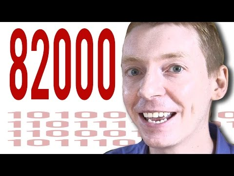

James Grime - YouTube

Why 82,000 is an extraordinary number - Numberphile

https://www.youtube.com/watch?v=LNS1fabDkeA&list=PLt5AfwLFPxWLNZRKWlcRmTABh_SExiiCj&index=6

[(L)](https://www.youtube.com/watch?v=LNS1fabDkeA&list=PLt5AfwLFPxWLNZRKWlcRmTABh_SExiiCj&index=6)

945,361 views views
Published on Jun 12, 2015

|     |
| --- |
| [(L)](https://www.youtube.com/watch?v=LNS1fabDkeA&list=PLt5AfwLFPxWLNZRKWlcRmTABh_SExiiCj&index=6) |

Description

Just some of the Numberphile videos featuring Dr James Grime

Top Comments

Slartibartfass  | If we go on like this, all numbers will be special by the end of the year :P

2 years ago (edited)

SnippingTool  | "Or is it?" -Vsauce (michael here)
1 year ago

Jake Day Williams  | Numberphile videos need a NSFW tag. It's hard to get any work done after watching them.

2 years ago

Young Gucci  | 80085
2 years ago

milo  | There is another number, it's 0
Glad i solved this for you and i didn't even need fancy computers and stuff!
2 years ago

pavle vivec  | how do pure mathematicians sleep with these many mysteries floating around :D

1 year ago

zeidrichthorene  | An interesting thing about this: In Base 2, 82000 is 10100000001010000. In base 2, 10100000001010000 is 1 + 11 + 1111 + 111111 + 11111111111111 + 1111111111111111

In Base 3, 82000 is 11011111001 In Base 3, 11011111001 is 22 + 222 + 2222 + 22222 + 222222 + 2222222 + 222222222 + 2222222222 (corrected)

In Base 5, 82000 is 10111000  In Base 5, 10111000 is 4 + 444 + 4444 + 44444 + 4444444

Just food for thought.
It doesn't really work in base 4, it is 3 + 33 +333 + 3333333 + 33333333 (+ 1)
But it's interesting that these are similar for the prime bases.
2 years ago (edited)

Erik  | I am currently writing a C# program that will hopefully solve this mystery (of what comes after 82,000). I will return.

2 years ago

João Solimeo  | Numberphile videos. I don´t get a thing, but they make me feel more intelligent. ;)

1 year ago (edited)

Dwarf Of Programming  | Another day when we are closer to total binary world domination... ( ﾟ∀ﾟ)ｱﾊﾊ八八ﾉヽﾉヽﾉヽﾉ ＼ / ＼/ ＼

2 years ago