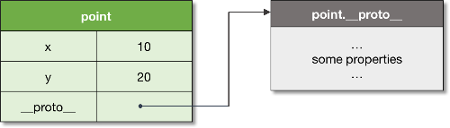
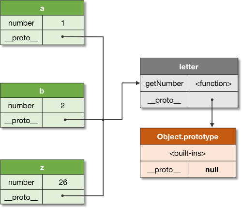
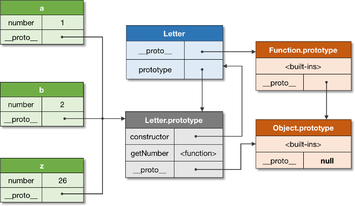
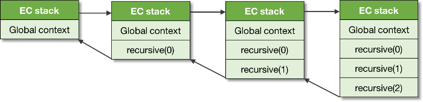
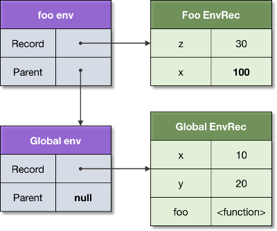
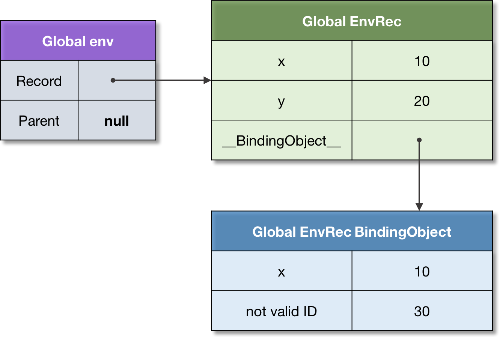
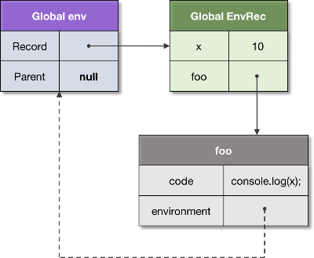
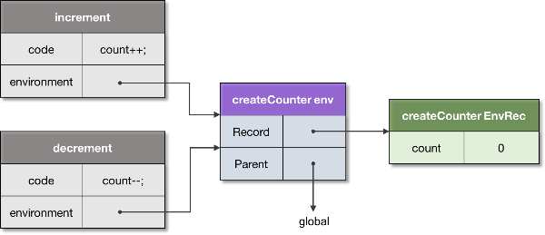
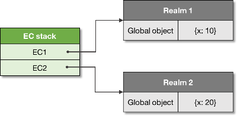
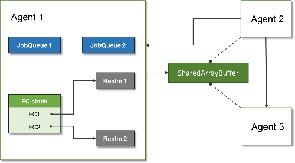

JavaScript. The Core: 2nd Edition

## [Dmitry Soshnikov](http://dmitrysoshnikov.com/)in [ECMAScript](http://dmitrysoshnikov.com/category/ecmascript/) | [2017-11-14](http://dmitrysoshnikov.com/ecmascript/javascript-the-core-2nd-edition/)

# JavaScript. The Core: 2nd Edition

- [](https://twitter.com/intent/tweet?text=JavaScript.+The+Core%3A+2nd+Edition&url=http%3A%2F%2Fdmitrysoshnikov.com%2Fecmascript%2Fjavascript-the-core-2nd-edition%2F)
- [](https://www.facebook.com/sharer/sharer.php?u=http%3A%2F%2Fdmitrysoshnikov.com%2Fecmascript%2Fjavascript-the-core-2nd-edition%2F&t=JavaScript.+The+Core%3A+2nd+Edition)
- [](https://plus.google.com/share?url=http%3A%2F%2Fdmitrysoshnikov.com%2Fecmascript%2Fjavascript-the-core-2nd-edition%2F)

Read this article in: [Russian](http://dmitrysoshnikov.com/ecmascript/javascript-the-core-2nd-edition-rus/), [Chinese](http://www.xiaojichao.com/post/jscorev2.html), [German](https://molily.de/javascript-core/2/).

This is the *second edition* of the [JavaScript. The Core](http://dmitrysoshnikov.com/ecmascript/javascript-the-core/) overview lecture, devoted to ECMAScript programming language and core components of its runtime system.

**Audience:** experienced programmers, experts.

1. [Object](http://dmitrysoshnikov.com/ecmascript/javascript-the-core-2nd-edition/#object)

2. [Prototype](http://dmitrysoshnikov.com/ecmascript/javascript-the-core-2nd-edition/#prototype)

3. [Class](http://dmitrysoshnikov.com/ecmascript/javascript-the-core-2nd-edition/#class)

4. [Execution context](http://dmitrysoshnikov.com/ecmascript/javascript-the-core-2nd-edition/#execution-context)

5. [Environment](http://dmitrysoshnikov.com/ecmascript/javascript-the-core-2nd-edition/#environment)

6. [Closure](http://dmitrysoshnikov.com/ecmascript/javascript-the-core-2nd-edition/#closure)

7. [This](http://dmitrysoshnikov.com/ecmascript/javascript-the-core-2nd-edition/#this)

8. [Realm](http://dmitrysoshnikov.com/ecmascript/javascript-the-core-2nd-edition/#realm)

9. [Job](http://dmitrysoshnikov.com/ecmascript/javascript-the-core-2nd-edition/#job)

10. [Agent](http://dmitrysoshnikov.com/ecmascript/javascript-the-core-2nd-edition/#agent)

The [first edition](http://dmitrysoshnikov.com/ecmascript/javascript-the-core/) of the article covers generic aspects of JS language, using abstractions mostly from the legacy ES3 spec, with some references to the appropriate changes in ES5 and ES6 (aka ES2015).

Starting since ES2015, the specification changed descriptions and structures of some core components, introduced new models, etc. And in this edition we focus on the newer abstractions, updated terminology, but still maintaining the very basic JS structures which stay consistent throughout the spec versions.

This article covers ES2017+ runtime system.

**Note:** the latest version of the [ECMAScript specification](https://tc39.github.io/ecma262/) can be found on the TC-39 website.

We start our discussion with the concept of an *object*, which is fundamental to ECMAScript.

## [Object](http://dmitrysoshnikov.com/ecmascript/javascript-the-core-2nd-edition/#object)

ECMAScript is an *object-oriented* programming language with the *prototype-based* organization, having the concept of an *object* as its core abstraction.

 **Def. 1: Object:** An *object* is a *collection of properties*, and has a *single prototype object*. The prototype may be either an object or the `null` value.

Let’s take a basic example of an object. A prototype of an object is referenced by the internal `[[Prototype]]` property, which to user-level code is exposed via the `__proto__` property.

For the code:
1
2
3
4
[object Object]  [object Object]
[object Object][object Object]
[object Object][object Object]
[object Object]

we have the structure with two *explicit own properties* and one *implicit*  `__proto__` property, which is the reference to the prototype of `point`:

Figure 1. A basic object with a prototype.

**Note:** objects may store also *symbols*. You can get more info on symbols in [this documentation](https://developer.mozilla.org/en-US/docs/Web/JavaScript/Reference/Global_Objects/Symbol).

The prototype objects are used to implement *inheritance* with the mechanism of *dynamic dispatch*. Let’s consider the *prototype chain* concept to see this mechanism in detail.

## [Prototype](http://dmitrysoshnikov.com/ecmascript/javascript-the-core-2nd-edition/#prototype)

Every object, when is created, receives its *prototype*. If the prototype is not set *explicitly*, objects receive *default prototype* as their *inheritance object*.

 **Def. 2: Prototype:** A *prototype* is a delegation object used to implement *prototype-based inheritance*.

The prototype can be set *explicitly* via either the `__proto__` property, or `Object.create` method:

1
2
3
4
5
6
7
8
9
10
11
12
13
14
15
16
17
[object Object]
[object Object]  [object Object]
[object Object][object Object]
[object Object][object Object]
[object Object]

[object Object]
[object Object]  [object Object]
[object Object][object Object]
[object Object][object Object]
[object Object]

[object Object]
[object Object][object Object][object Object]
[object Object][object Object][object Object]
[object Object][object Object][object Object]
[object Object]

**Note:** by default objects receive `Object.prototype` as their inheritance object.

Any object can be used as a prototype of another object, and the prototype itself can have its own prototype. If a prototype has a non-null reference to its prototype, and so on, it is called the *prototype chain*.

 **Def. 3: Prototype chain:** A *prototype chain* is a *finite* chain of objects used to implement *inheritance* and *shared properties*.

Figure 2. A prototype chain.

The rule is very simple: if a property is not found in the object itself, there is an attempt to *resolve* it in the prototype; in the prototype of the prototype, etc. — until the whole prototype chain is considered.

Technically this mechanism is known as *dynamic dispatch* or *delegation*.

 **Def. 4: Delegation:** a mechanism used to resolve a property in the inheritance chain. The process happens at runtime, hence is also called ***dynamic dispatch***.

**Note:** in contrast with *static dispatch* when references are resolved at *compile time*, *dynamic dispatch* resolves the references at *runtime*.

And if a property eventually is not found in the prototype chain, the `undefined` value is returned:

1
2
3
4
5
6
7
8
9
10
11
12
[object Object]
[object Object]  [object Object]

[object Object]

[object Object][object Object]
[object Object][object Object]
[object Object]
[object Object][object Object]
[object Object][object Object]

[object Object]

As we can see, a default object is actually *never empty* — it always inherits *something* from the `Object.prototype`. To create a *prototype-less dictionary*, we have to explicitly set its prototype to `null`:

1
2
3
4
[object Object]
[object Object]  [object Object][object Object][object Object]

[object Object][object Object]

The *dynamic dispatch* mechanism allows *full mutability* of the inheritance chain, providing an ability to change the delegation object:

1
2
3
4
5
6
7
8
9
10
[object Object]  [object Object]
[object Object]  [object Object]

[object Object]
[object Object]  [object Object]
[object Object][object Object]

[object Object]
[object Object]
[object Object][object Object]

**Note:** even though the `__proto__` property is standardized today, and is easier to use for explanations, on practice prefer using API methods for prototype manipulations, such as `Object.create`, `Object.getPrototypeOf`,

 `Object.setPrototypeOf`, and similar on the `Reflect` module.

On the example of `Object.prototype`, we see that the *same prototype* can be shared across *multiple objects*. On this principle the *class-based inheritance* is implemented in ECMAScript. Let’s see the example, and look under the hood of the “class” abstraction in JS.

## [Class](http://dmitrysoshnikov.com/ecmascript/javascript-the-core-2nd-edition/#class)

When several objects share the same initial state and behavior, they form a *classification*.

 **Def. 5: Class:** A *class* is a formal abstract set which specifies initial state and behavior of its objects.

In case we need to have *multiple objects* inheriting from the same prototype, we could of course create this one prototype, and explicitly inherit it from the newly created objects:

1
2
3
4
5
6
7
8
9
10
11
12
13
14
15
16
17
[object Object]
[object Object]  [object Object]
[object Object][object Object]
[object Object][object Object]  [object Object][object Object]
[object Object][object Object]
[object Object]

[object Object]  [object Object]
[object Object]  [object Object]
[object Object]
[object Object]  [object Object]

[object Object]
[object Object][object Object][object Object]
[object Object][object Object][object Object]
[object Object][object Object][object Object]
[object Object]
We can see these relationships on the following figure:

Figure 3. A shared prototype.

However, this is obviously *cumbersome*. And the class abstraction serves exactly this purpose — being a *syntactic sugar* (i.e. a construct which *semantically does the same*, but in a much *nicer syntactic form*), it allows creating such multiple objects with the convenient pattern:

1
2
3
4
5
6
7
8
9
10
11
12
13
14
15
16
17
18
19
20
[object Object]  [object Object]
[object Object][object Object]
[object Object][object Object][object Object]
[object Object][object Object]

[object Object][object Object]
[object Object][object Object]  [object Object][object Object]
[object Object][object Object]
[object Object]

[object Object]  [object Object][object Object]  [object Object]
[object Object]  [object Object][object Object]  [object Object]
[object Object]
[object Object]  [object Object][object Object]  [object Object]

[object Object]
[object Object][object Object][object Object]
[object Object][object Object][object Object]
[object Object][object Object][object Object]
[object Object]

**Note:**  *class-based inheritance* in ECMAScript is implemented on top of the *prototype-based delegation*.

**Note:** a *“class”* is just a *theoretical abstraction*. Technically it can be implemented with the *static dispatch* as in Java or C++, or *dynamic dispatch (delegation)* as in JavaScript, Python, Ruby, etc.

Technically a “class” is represented as a *“constructor function + prototype”* pair. Thus, a constructor function *creates objects*, and also *automatically* sets the *prototype* for its newly created instances. This prototype is stored in the `<ConstructorFunction>.prototype` property.

 **Def. 6: Constructor:** A *constructor* is a function which is used to create instances, and automatically set their prototype.

It is possible to use a constructor function explicitly. Moreover, before the class abstraction was introduced, JS developers used to do so not having a better alternative (we can still find a lot of such legacy code allover the internets):

1
2
3
4
5
6
7
8
9
10
11
12
13
14
15
16
17
18
[object Object]  [object Object]
[object Object][object Object][object Object]
[object Object]

[object Object][object Object][object Object]
[object Object][object Object]  [object Object][object Object]
[object Object]

[object Object]  [object Object][object Object]  [object Object]
[object Object]  [object Object][object Object]  [object Object]
[object Object]
[object Object]  [object Object][object Object]  [object Object]

[object Object]
[object Object][object Object][object Object]
[object Object][object Object][object Object]
[object Object][object Object][object Object]
[object Object]

And while creating a single-level constructor was pretty easy, the inheritance pattern from parent classes required much more boilerplate. Currently this boilerplate is hidden as an *implementation detail*, and that exactly what happens under the hood when we create a class in JavaScript.

**Note:**  *constructor functions* are just *implementation details* of the class-based inheritance.

Let’s see the relationships of the objects and their class:

Figure 4. A constructor and objects relationship.

The figure above shows that *every object* has an associated prototype. Even the constructor function (class) `Letter` has its own prototype, which is `Function.prototype`. Notice, that `Letter.prototype` is the prototype of the Letter *instances*, that is `a`, `b`, and `z`.

**Note:** the *actual* prototype of *any* object is *always* the `__proto__` reference. And the explicit `prototype` property on the constructor function is just a reference to the prototype of its *instances*; from instances it’s still referred by the `__proto__`. See details [here](http://dmitrysoshnikov.com/ecmascript/chapter-7-2-oop-ecmascript-implementation/#explicit-codeprototypecode-and-implicit-codeprototypecode-properties).

You can find a detailed discussion on generic OPP concepts (including detailed descriptions of the class-based, prototype-based, etc) in the [ES3. 7.1 OOP: The general theory](http://dmitrysoshnikov.com/ecmascript/chapter-7-1-oop-general-theory/) article.

Now when we understand the basic relationships between ECMAScript objects, let’s take a deeper look at JS *runtime system*. As we will see, almost everything there can also be presented as an object.

## [Execution context](http://dmitrysoshnikov.com/ecmascript/javascript-the-core-2nd-edition/#execution-context)

To execute JS code and track its runtime evaluation, ECMAScript spec defines the concept of an *execution context*. Logically execution contexts are maintained using a *stack* (the *execution context stack* as we will see shortly), which corresponds to the generic concept of a *call-stack*.

 **Def. 7: Execution context:** An *execution context* is a specification device that is used to track the runtime evaluation of the code.

There are several types of ECMAScript code: the *global code*, *function code*, *`eval` code*, and *module code*; each code is evaluated in its execution context. Different code types, and their appropriate objects may affect the structure of an execution context: for example, *generator functions* save their *generator object* on the context.

Let’s consider a recursive function call:
1
2
3
4
5
6
7
8
9
10
11
12
13
[object Object]  [object Object]

[object Object][object Object]
[object Object][object Object]  [object Object]
[object Object][object Object][object Object]
[object Object][object Object]

[object Object][object Object]
[object Object][object Object]
[object Object]

[object Object]
[object Object]

When a function is called, a *new execution context* is created, and *pushed* onto the stack — at this point it becomes *an active execution context*. When a function returns, its context is *popped* from the stack.

A context which calls another context is called a *caller*. And a context which is being called, accordingly, is a *callee*. In our example the `recursive` function plays both roles: of a callee and a caller — when calls itself recursively.

 **Def. 8: Execution context stack:** An *execution context stack* is a LIFO structure used to maintain control flow and order of execution.

For our example from above we have the following stack *“push-pop”* modifications:

Figure 5. An execution context stack.

As we can also see, the *global context* is always at the bottom of the stack, it is created prior execution of any other context.

You can find more details on execution contexts in the [appropriate chapter](http://dmitrysoshnikov.com/ecmascript/chapter-1-execution-contexts/).

In general, the code of a context *runs to completion*, however as we mentioned above, some objects — such as *generators*, may violate LIFO order of the stack. A generator function may suspend its running context, and *remove* it from the stack *before completion*. Once a generator is activated again, its context is *resumed* and again is *pushed* onto the stack:

1
2
3
4
5
6
7
8
9
10
11
[object Object]  [object Object]
[object Object][object Object]  [object Object]
[object Object][object Object]  [object Object]
[object Object]

[object Object]  [object Object]

[object Object]
[object Object][object Object][object Object]
[object Object][object Object][object Object]
[object Object]

The `yield` statement here returns the value to the caller, and pops the context. On the second `next` call, the *same context* is pushed again onto the stack, and is *resumed*. Such context may *outlive* the caller which creates it, hence the violation of the LIFO structure.

**Note:** you can read more about generators and iterators in [this documentation](https://developer.mozilla.org/en-US/docs/Web/JavaScript/Guide/Iterators_and_Generators).

We shall now discuss the important components of an execution context; in particular we should see how ECMAScript runtime manages *variables storage*, and *scopes* created by nested blocks of a code. This is the generic concept of *lexical environments*, which is used in JS to store data, and solve the *“Funarg problem”* — with the mechanism of *closures*.

## [Environment](http://dmitrysoshnikov.com/ecmascript/javascript-the-core-2nd-edition/#environment)

Every execution context has an associated *lexical environment*.

 **Def. 9: Lexical environment:** A *lexical environment* is a structure used to define association between *identifiers* appearing in the context with their values. Each environment can have a reference to an *optional parent environment*.

So an environment is a *storage* of variables, functions, and classes defined in a scope.

Technically, an environment is a *pair*, consisting of an *environment record* (an actual storage table which maps identifiers to values), and a reference to the parent (which can be `null`).

For the code:
1
2
3
4
5
6
7
8
9
[object Object]  [object Object]
[object Object]  [object Object]

[object Object]  [object Object]
[object Object][object Object]  [object Object]
[object Object][object Object]  [object Object]
[object Object]

[object Object][object Object]

The environment structures of the *global context*, and a context of the `foo` function would look as follows:

Figure 6. An environment chain.

Logically this reminds us of the *prototype chain* which we’ve discussed above. And the rule for *identifiers resolution* is very similar: if a variable is *not found* in the *own* environment, there is an attempt to lookup it in the *parent environment*, in the parent of the parent, and so on — until the whole *environment chain* is considered.

 **Def. 10: Identifier resolution:** the process of resolving a variable *(binding)* in an environment chain. An unresolved binding results to `ReferenceError`.

This explains why variable `x` is resolved to `100`, but not to `10` — it is found directly in the *own* environment of `foo`; why we can access parameter `z` — it’s also just stored on the *activation environment*; and also why we can access the variable `y` — it is found in the parent environment.

Similarly to prototypes, the same parent environment can be shared by several child environments: for example, two global functions share the same global environment.

**Note:** you can get detailed information about lexical environment in [this article](http://dmitrysoshnikov.com/ecmascript/es5-chapter-3-2-lexical-environments-ecmascript-implementation/).

Environment records differ by *type*. There are ***object*** environment records and ***declarative*** environment records. On top of the declarative record there are also ***function*** environment records, and ***module*** environment records. Each type of the record has specific only to it properties. However, the generic mechanism of the identifier resolution is common across all the environments, and doesn’t depend on the type of a record.

An example of an *object environment record* can be the record of the *global environment*. Such record has also associated *binding object*, which may store some properties from the record, but not the others, and vice-versa. The binding object can also be provided as `this` value.

1
2
3
4
5
6
7
8
9
10
11
12
13
14
15
16
17
18
19
20
21
22
23
24
25
26
27
28
29
30
[object Object]
[object Object]  [object Object]

[object Object]
[object Object]  [object Object]

[object Object]
[object Object]
[object Object][object Object][object Object]
[object Object][object Object][object Object]
[object Object]

[object Object]
[object Object]
[object Object]

[object Object]
[object Object][object Object][object Object][object Object]
[object Object][object Object][object Object][object Object]
[object Object]

[object Object]
[object Object]
[object Object]

[object Object][object Object][object Object]

[object Object]
[object Object][object Object][object Object][object Object]
[object Object]
This is depicted on the following figure:

Figure 7. A binding object.

Notice, the binding object exists to cover *legacy constructs* such as `var`-declarations, and `with`-statements, which also provide their object as a binding object. These are historical reason when environments were represented as simple objects. Currently the environments model is much more optimized, however as a result we can’t access binding as properties anymore.

We have already seen how environments are related via the parent link. Now we shall see how an environment can *outlive* the context which creates it. This is the basis for the mechanism of *closures* which we’re about to discuss.

## [Closure](http://dmitrysoshnikov.com/ecmascript/javascript-the-core-2nd-edition/#closure)

Functions in ECMAScript are *first-class*. This concept is fundamental to *functional programming*, which aspects are supported in JavaScript.

 **Def. 11: First-class function:** a function which can participate as a normal data: be stored in a variable, passed as an argument, or returned as a value from another function.

With the concept of first-class functions so called [“Funarg problem”](https://en.wikipedia.org/wiki/Funarg_problem) is related (or *“A problem of a functional argument”*). The problem arises when a function has to deal with *free variables*.

 **Def. 12: Free variable:** a variable which is *neither a parameter*, *nor a local variable* of this function.

Let’s take a look at the Funarg problem, and see how it’s solved in ECMAScript.
Consider the following code snippet:
1
2
3
4
5
6
7
8
9
10
11
12
13
[object Object]  [object Object]

[object Object]  [object Object]
[object Object][object Object]
[object Object]

[object Object]  [object Object]
[object Object][object Object]  [object Object]
[object Object][object Object][object Object]
[object Object]

[object Object]
[object Object]

For the function `foo` the variable `x` is free. When the `foo` function is activated (via the `funArg` parameter) — where should it resolve the `x` binding? From the *outer scope* where the function was *created*, or from the *caller scope*, from where the function is *called*? As we see, the caller, that is the `bar` function, also provides the binding for `x` — with the value `20`.

The use-case described above is known as the ***downwards funarg problem***, i.e. an *ambiguity* at determining a *correct environment* of a binding: should it be an environment of the *creation time*, or environment of the *call time*?

This is solved by an agreement of using *static scope*, that is the scope of the *creation time*.

 **Def. 13: Static scope:** a language implements *static scope*, if only by looking at the source code one can determine in which environment a binding is resolved.

The static scope sometimes is also called *lexical scope*, hence the *lexical environments* naming.

Technically the static scope is implemented by *capturing the environment* where a function is *created*.

**Note:** you can read about *static* and *dynamic* scopes in [this article](https://codeburst.io/js-scope-static-dynamic-and-runtime-augmented-5abfee6223fe).

In our example, the environment captured by the `foo` function, is the *global environment*:

Figure 8. A closure.

We can see that an environment references a function, which in turn reference the environment *back*.

 **Def. 14: Closure:** A *closure* is a function which *captures the environment* where it’s *defined*. Further this environment is used for *identifier resolution*.

**Note:** a function is *called* in a *fresh activation environment* which stores *local variables*, and *arguments*. The *parent environment* of the activation environment is set to the *closured environment* of the function, resulting to the *lexical scope* semantics.

The second sub-type of the Funarg problem is known as the ***upwards funarg problem***. The only difference here is that a capturing environment *outlives* the context which creates it.

Let’s see the example:
1
2
3
4
5
6
7
8
9
10
11
12
13
14
15
16
17
18
[object Object]  [object Object]
[object Object][object Object]  [object Object]
[object Object]
[object Object][object Object]
[object Object][object Object]  [object Object]
[object Object][object Object]  [object Object]
[object Object][object Object]

[object Object][object Object]
[object Object][object Object]  [object Object]
[object Object]

[object Object]  [object Object]

[object Object]
[object Object]  [object Object]

[object Object][object Object]

Again, technically it doesn’t differ from the same exact mechanism of capturing the definition environment. Just in this case, hadn’t we have the closure, the activation environment of `foo`  *would be destroyed*. But we *captured* it, so it *cannot be deallocated*, and is preserved — to support *static scope* semantics.

Often there is an incomplete understanding of closures — usually developers think about closures only in terms of the upward funarg problem (and practically it really makes more sense). However, as we can see, the technical mechanism for the *downwards* and *upwards funarg problem* is *exactly the same* — and is the *mechanism of the static scope*.

As we mentioned above, similarly to prototypes, the same parent environment can be *shared* across *several* closures. This allows accessing and mutating the shared data:

1
2
3
4
5
6
7
8
9
10
11
12
13
14
15
16
[object Object]  [object Object]
[object Object][object Object]  [object Object]

[object Object][object Object]  [object Object]
[object Object][object Object][object Object]  [object Object]
[object Object][object Object][object Object]  [object Object]
[object Object][object Object]
[object Object]

[object Object]  [object Object]

[object Object]
[object Object][object Object][object Object]
[object Object][object Object][object Object]
[object Object][object Object][object Object]
[object Object]

Since both closures, `increment` and `decrement`, are created within the scope containing the `count` variable, they *share* this *parent scope*. That is, capturing always happens *“by-reference”* — meaning the *reference* to the *whole parent environment* is stored.

We can see this on the following picture:

Figure 9. A shared environment.

Some languages may capture *by-value*, making a copy of a captured variable, and do not allow changing it in the parent scopes. However in JS, to repeat, it is always the *reference* to the parent scope.

**Note:** implementations may optimize this step, and do not capture the whole environment. Capturing *only used* free-variables, they though still maintain invariant of mutable data in parent scopes.

You can find a detailed discussion on closures and the Funarg problem in the [appropriate chapter](http://dmitrysoshnikov.com/ecmascript/chapter-6-closures/).

So all identifiers are statically scoped. There is however *one* value which is *dynamically scoped* in ECMAScript. It’s the value of `this`.

## [This](http://dmitrysoshnikov.com/ecmascript/javascript-the-core-2nd-edition/#this)

The `this` value is a special object which is *dynamically* and *implicitly* passed to the code of a context. We can consider it as an *implicit extra parameter*, which we can access, but cannot mutate.

The purpose of the `this` value is to executed the same code for multiple objects.

 **Def. 15: This:** an implicit *context object* accessible from a code of an execution context — in order to apply the same code for multiple objects.

The major use-case is the class-based OOP. An instance method (which is defined on the prototype) exists in *one exemplar*, but is *shared* across *all the instances* of this class.

1
2
3
4
5
6
7
8
9
10
11
12
13
14
15
16
17
18
19
20
21
22
23
24
25
[object Object]  [object Object]
[object Object][object Object]
[object Object][object Object][object Object]
[object Object][object Object][object Object]
[object Object][object Object]

[object Object][object Object]
[object Object][object Object]  [object Object][object Object]
[object Object][object Object]

[object Object][object Object]
[object Object][object Object]  [object Object][object Object]
[object Object][object Object]
[object Object]

[object Object]  [object Object][object Object]  [object Object]
[object Object]  [object Object][object Object]  [object Object]

[object Object]
[object Object]

[object Object]
[object Object][object Object][object Object]
[object Object][object Object][object Object]
[object Object]

When the `getX` method is activated, a new environment is created to store local variables and parameters. In addition, *function environment record* gets the `[[ThisValue]]` passed, which is bound *dynamically* depending how a function is *called*. When it’s called with `p1`, the `this` value is exactly `p1`, and in the second case it’s `p2`.

Another application of `this`, is *generic interface functions*, which can be used in *mixins* or *traits*.

In the following example, the `Movable` interface contains generic function `move`, which expects the users of this mixin to implement `_x`, and `_y` properties:

1
2
3
4
5
6
7
8
9
10
11
12
13
14
15
16
17
18
19
20
21
22
23
[object Object]
[object Object]  [object Object]

[object Object][object Object]
[object Object][object Object]
[object Object][object Object]
[object Object][object Object]
[object Object][object Object]
[object Object][object Object]
[object Object][object Object][object Object]
[object Object][object Object][object Object]
[object Object][object Object]
[object Object]

[object Object]  [object Object][object Object]  [object Object]

[object Object]
[object Object]

[object Object]
[object Object]

[object Object][object Object]

As an alternative, a mixin can also be applied at *prototype level* instead of *per-instance* as we did in the example above.

Just to show the dynamic nature of `this` value, consider this example, which we leave to a reader as an exercise to solve:

1
2
3
4
5
6
7
8
9
10
11
12
13
14
15
16
17
18
19
20
21
22
23
24
25
26
27
[object Object]  [object Object]
[object Object][object Object]  [object Object][object Object]
[object Object]

[object Object]  [object Object]
[object Object][object Object]

[object Object][object Object]
[object Object][object Object]  [object Object][object Object]
[object Object][object Object]
[object Object]

[object Object]
[object Object]
[object Object][object Object][object Object]

[object Object][object Object][object Object]
[object Object][object Object][object Object]

[object Object][object Object][object Object]
[object Object]

[object Object]
[object Object][object Object]

[object Object]  [object Object]
[object Object][object Object]

Since only by looking at the source code of the `foo` function we *cannot tell* what value of `this` will it have *in a particular call*, we say that `this` value is *dynamically scoped*.

**Note:** you can get a detailed explanation how `this` value is determined, and why the code from above works the way it does, in the [appropriate chapter](http://dmitrysoshnikov.com/ecmascript/chapter-3-this/).

The ***arrow functions*** are special in terms of `this` value: their `this` is *lexical (static)*, but *not dynamic*. I.e. their function environment record *does not provide `this` value*, and it’s taken from the *parent environment*.

1
2
3
4
5
6
7
8
9
10
11
12
13
14
15
16
17
18
19
20
21
22
23
24
25
26
[object Object]  [object Object]

[object Object]  [object Object]
[object Object][object Object]

[object Object][object Object]
[object Object][object Object]
[object Object][object Object]  [object Object][object Object]
[object Object][object Object]

[object Object][object Object]
[object Object][object Object][object Object][object Object]

[object Object][object Object]
[object Object][object Object]
[object Object][object Object]  [object Object][object Object][object Object]

[object Object][object Object]  [object Object]
[object Object][object Object]
[object Object]

[object Object]
[object Object][object Object][object Object]
[object Object][object Object][object Object]
[object Object][object Object][object Object]
[object Object]

Like we said, in the *global context* the `this` value is the *global object* (the *binding object* of the *global environment record*). Previously there was only one global object. In current version of the spec there might be *multiple global objects* which are part of *code realms*. Let’s discuss this structure.

## [Realm](http://dmitrysoshnikov.com/ecmascript/javascript-the-core-2nd-edition/#realm)

Before it is evaluated, all ECMAScript code must be associated with a *realm*. Technically a realm just provides a global environment for a context.

 **Def. 16: Realm:** A *code realm* is an object which encapsulates a separate *global environment*.

When an *execution context* is *created* it’s *associated* with a particular *code realm*, which provides the *global environment* for this context. This association further *stays unchanged*.

**Note:** a direct realm equivalent in browser environment is the `iframe` element, which exactly provides a custom global environment. In Node.js it is close to the sandbox of the [vm module](https://nodejs.org/api/vm.html).

Current version of the specification doesn’t provide an ability to explicitly create realms, but they can be created implicitly by the implementations. There is a [proposal](https://github.com/tc39/proposal-realms/) though to expose this API to user-code.

Logically though, each context from the stack is always associated with its realm:

Figure 10. A context and realm association.
Let’s see the separate realms example, using the `vm` module:
1
2
3
4
5
6
7
8
9
10
11
12
13
[object Object][object Object][object Object]

[object Object]
[object Object]

[object Object]
[object Object]

[object Object]
[object Object]

[object Object][object Object]
[object Object][object Object]

Now we’re getting closer to the bigger picture of the ECMAScript runtime. Yet however we still need to see the *entry point* to the code, and the *initialization process*. This is managed by the mechanism of *jobs* and *job queues*.

## [Job](http://dmitrysoshnikov.com/ecmascript/javascript-the-core-2nd-edition/#job)

Some operations can be postponed, and executed as soon as there is an available spot on the execution context stack.

 **Def. 17: Job:** A *job* is an abstract operation that initiates an ECMAScript computation when *no other* ECMAScript computation is currently in progress.

Jobs are enqueued on the ***job queues***, and in current spec version there are two job queues: ***ScriptJobs***, and ***PromiseJobs***.

And *initial job* on the *ScriptJobs* queue is the *main entry point* to our program — initial script which is loaded and evaluated: a realm is created, a global context is created and is associated with this realm, it’s pushed onto the stack, and the global code is executed.

Notice, the *ScriptJobs* queue manages both, *scripts* and *modules*.

Further this context can execute *other contexts*, or enqueue *other jobs*. An example of a job which can be spawned and enqueued is a *promise*.

When there is *no running* execution context and the execution context stack is *empty*, the ECMAScript implementation removes the first *pending job* from a job queue, creates an execution context and starts its execution.

**Note:** the job queues are usually handled by the abstraction known as the ***“Event loop”***. ECMAScript standard doesn’t specify the event loop, leaving it up to implementations, however you can find an educational example — [here](https://gist.github.com/DmitrySoshnikov/26e54990e7df8c3ae7e6e149c87883e4).

Example:
1
2
3
4
5
6
7
8
9
[object Object]
[object Object]  [object Object]
[object Object][object Object]

[object Object]
[object Object]
[object Object]

[object Object]

**Note:** you can read more about promises in [this documentation](https://developer.mozilla.org/en-US/docs/Web/JavaScript/Reference/Global_Objects/Promise).

The ***async functions*** can *await* for promises, so they also enqueue promise jobs:

1
2
3
4
5
6
7
8
9
10
11
12
13
14
[object Object][object Object]  [object Object]
[object Object][object Object]  [object Object]
[object Object]

[object Object]
[object Object][object Object]  [object Object]
[object Object][object Object][object Object]
[object Object]

[object Object]
[object Object]
[object Object]

[object Object]

**Note:** read more about async functions in [here](https://developer.mozilla.org/en-US/docs/Web/JavaScript/Reference/Statements/async_function).

Now we’re very close to the final picture of the current JS Universe. We shall see now *main owners* of all those components we discussed, the *Agents*.

## [Agent](http://dmitrysoshnikov.com/ecmascript/javascript-the-core-2nd-edition/#agent)

The *concurrency* and *parallelism* is implemented in ECMAScript using *Agent pattern*. The Agent pattern is very close to the [Actor pattern](https://en.wikipedia.org/wiki/Actor_model) — a *lightweight process* with *message-passing* style of communication.

 **Def. 18: Agent:** An *agent* is an abstraction encapsulating execution context stack, set of job queues, and code realms.

Implementation dependent an agent can run on the same thread, or on a separate thread. The `Worker` agent in the browser environment is an example of the *Agent* concept.

The agents are *state isolated* from each other, and can communicate by *sending messages*. Some data can be shared though between agents, for example `SharedArrayBuffer`s. Agents can also combine into *agent clusters*.

In the example below, the `index.html` calls the `agent-smith.js` worker, passing shared chunk of memory:

1
2
3
4
5
6
7
8
9
10
11
12
13
14
15
16
17
18
19
20
21
[object Object]

[object Object]
[object Object]  [object Object][object Object]  [object Object]

[object Object]
[object Object]  [object Object][object Object]  [object Object]

[object Object]

[object Object]  [object Object][object Object]  [object Object][object Object][object Object]

[object Object]
[object Object][object Object]
[object Object][object Object]  [object Object]

[object Object][object Object]
[object Object][object Object][object Object]
[object Object]

[object Object]
[object Object]
And the worker code:
1
2
3
4
5
6
7
8
9
10
11
12
13
14
15
[object Object]

[object Object]
[object Object][object Object]
[object Object][object Object]
[object Object]
[object Object][object Object]
[object Object][object Object]  [object Object][object Object]  [object Object]

[object Object][object Object]  [object Object]
[object Object][object Object]

[object Object][object Object]
[object Object][object Object]
[object Object]

You can find the full code for the example above in [this gist](https://gist.github.com/DmitrySoshnikov/b75a2dbcdb60b18fd9f05b595135dc82).

(Notice, if you run this example locally, run it in Firefox, since Chrome due to security reasons doesn’t allow loading web workers from a local file)

So below is the picture of the ECMAScript runtime:

Figure 11. ECMAScript runtime.
And that is it; that’s what happens under the hood of the ECMAScript engine!

Now we come to an end. This is the amount of information on JS core which we can cover within an overview article. Like we mentioned, JS code can be grouped into *modules*, properties of objects can be tracked by `Proxy` objects, etc, etc. — there are many user-level details which you can find in different documentations on JavaScript language.

Here though we tried to represent the *logical structure* of an ECMAScript program itself, and hopefully it clarified these details. If you have any questions, suggestions or feedback, — as always I’ll be glad to discuss them in comments.

I’d like to thank the TC-39 representatives and spec editors which helped with clarifications for this article. The discussion can be found in [this Twitter thread](https://twitter.com/DmitrySoshnikov/status/930507793047592960).

Good luck in studying ECMAScript!
**Written by:** Dmitry Soshnikov
**Published on:** November 14th, 2017

# [Dmitry Soshnikov](http://dmitrysoshnikov.com/)

## Software engineer interested in learning and education. Sometimes blog on topics of programming languages theory, compilers, and ECMAScript.

## Published

## [2017-11-14](http://dmitrysoshnikov.com/ecmascript/javascript-the-core-2nd-edition/)

## **38 Comments

1. James Levine

[2017-11-15](http://dmitrysoshnikov.com/ecmascript/javascript-the-core-2nd-edition/#comment-208350)

As always, fantastic and in-depth explanations of JavaScript internals. Thank you for your great job, Dmitry!

2. Maksim Ryzhikov

[2017-11-16](http://dmitrysoshnikov.com/ecmascript/javascript-the-core-2nd-edition/#comment-208356)

Hi, Dmitry
Awesome work as usual! Thanks!
One note, here the error in the code:
1
2
3
4
5
6
7
8
9
10
11
12
13
14
15
16
17
18
[object Object]  [object Object]
[object Object][object Object]  [object Object]
[object Object]
[object Object][object Object]
[object Object][object Object]  [object Object]
[object Object][object Object]  [object Object]
[object Object][object Object]
[object Object]
[object Object][object Object]
[object Object][object Object]  [object Object]
[object Object]
[object Object]
[object Object]  [object Object]
[object Object]
[object Object]
[object Object]  [object Object]
[object Object]
[object Object][object Object]
1
2
3
4
[object Object]
[object Object]  [object Object]
[object Object][object Object]  [object Object]
[object Object]
should be
1
2
3
4
[object Object]
[object Object]  [object Object]
[object Object][object Object]  [object Object]
[object Object]
Thanks again!

3. Dzhavat

[2017-11-16](http://dmitrysoshnikov.com/ecmascript/javascript-the-core-2nd-edition/#comment-208360)

I always enjoy it when I read something that deepens my understanding of JavaScript. Thank you for publishing this.

After going through Closures I noticed that the example under Def. 14 has a small error. It looks like the y variable, which is part of the foo function, is not defined. So running the code gives an error.

4. alejandro

[2017-11-16](http://dmitrysoshnikov.com/ecmascript/javascript-the-core-2nd-edition/#comment-208369)

good stuff, thanks!

5. [Dmitry Soshnikov](http://dmitrysoshnikov.com/)

[2017-11-16](http://dmitrysoshnikov.com/ecmascript/javascript-the-core-2nd-edition/#comment-208371)

@**James Levine**, thanks for the feedback! Glad to see more people interested in deeper JS.

@**Maksim Ryzhikov**, good catch, and thanks for the feedback! The copy-paste typo is fixed.

@**Dzhavat**, thanks, appreciated; the typo is fixed!

6. Valeriy Podbeltsev

[2017-11-16](http://dmitrysoshnikov.com/ecmascript/javascript-the-core-2nd-edition/#comment-208372)

**
> We can consider it as an *> implicit extra parameter*
**

So that is why some languages like Python pass `this` explicitly, the `self` argument.

Thanks for the awesome explanations, Dmitry!

7. [Dmitry Soshnikov](http://dmitrysoshnikov.com/)

[2017-11-16](http://dmitrysoshnikov.com/ecmascript/javascript-the-core-2nd-edition/#comment-208373)

@**Valeriy Podbeltsev**, correct, and also e.g. Rust — also have to pass `self` explicitly. This just shows that *dynamic scope* can be *fully replaced* by *extra parameters*.

8. juan Barahona

[2017-11-16](http://dmitrysoshnikov.com/ecmascript/javascript-the-core-2nd-edition/#comment-208374)

excelente explicación amigo!!

9. [Dmitry Soshnikov](http://dmitrysoshnikov.com/)

[2017-11-16](http://dmitrysoshnikov.com/ecmascript/javascript-the-core-2nd-edition/#comment-208375)

@**juan Barahona**, gracias, amigo!

10. Brian Jung

[2017-11-16](http://dmitrysoshnikov.com/ecmascript/javascript-the-core-2nd-edition/#comment-208376)

This is the deepest explanation of JavaScript I’ve ever seen! Thanks so much for this effort. Amazing material.

11. Rock

[2017-11-16](http://dmitrysoshnikov.com/ecmascript/javascript-the-core-2nd-edition/#comment-208387)

Great job for the new ECMA description, thanks.

12. Rick

[2017-11-16](http://dmitrysoshnikov.com/ecmascript/javascript-the-core-2nd-edition/#comment-208389)

Great job! Thank you.

13. ehui

[2017-11-17](http://dmitrysoshnikov.com/ecmascript/javascript-the-core-2nd-edition/#comment-208399)

Beau travail, Merci!

14. Ramesh Thangamani

[2017-11-17](http://dmitrysoshnikov.com/ecmascript/javascript-the-core-2nd-edition/#comment-208406)

1
2
3
[object Object]
[object Object]  [object Object][object Object][object Object]
[object Object][object Object]
The above code snippet displays “undefined” and not null ?

15. [Dmitry Soshnikov](http://dmitrysoshnikov.com/)

[2017-11-17](http://dmitrysoshnikov.com/ecmascript/javascript-the-core-2nd-edition/#comment-208407)

@**Brian Jung**, @**Rock**, @**Rick**, @**ehui**, thanks for the feedback guys, appreciated!

@**Ramesh Thangamani**, yep, thanks, typo is fixed (should be `undefined` of course as described in property resolution).

16. Alexander Pearson

[2017-11-17](http://dmitrysoshnikov.com/ecmascript/javascript-the-core-2nd-edition/#comment-208418)

The deepest explanation of closures I’ve seen! Going to the very roots of the functional programming and the Funarg problem. Congratulations, sir!

17. Ramesh Thangamani

[2017-11-17](http://dmitrysoshnikov.com/ecmascript/javascript-the-core-2nd-edition/#comment-208423)

Dimtry thanks a lot! for taking time and writing an excellent writeup. Learnt lot of stuff.

18. Dmitriy

[2017-11-22](http://dmitrysoshnikov.com/ecmascript/javascript-the-core-2nd-edition/#comment-208545)

Awesome article, helped me to recall a lot of things I could have forgotten. Also made me rethink some stuff. So thanks a lot! [1f642.svg](../_resources/4f22736614151ae463b63a5a78aac9d9.bin)

19. artin

[2017-11-22](http://dmitrysoshnikov.com/ecmascript/javascript-the-core-2nd-edition/#comment-208546)

Thanks for the article. You the best.

I have few questions, some of them not related directly to EcmaScript spec but rather to browser implementation details, sorry about that. Just trying to connect all pieces and see whole picture.

1. Is ‘microtask’ a valid term or we should use ‘job’?

‘microtask’ was popularized by Jake Archibald`s article as opposed to browser’s ‘task’ / ‘task queue’, but looks like spec only knows ‘job’s

2. Is that correct that task queue (event loop) is not part of JS engine (implemeted separately by browser/nodejs/etc), while job queues are inside JS engine (eg. implemented directly by V8), or job queues implemented as environmental extension too?

3. What is the reason to split job queue into two parts (ScriptJobs, PromiseJobs)? Is there any difference in execution priority, like job from queue A should be executed before job from queue B if both are not empty, or something else?

4. AFAIK we have 2 sources of microtasks (jobs) now: Promise and MutationObserver. Does MutationObserver enqueues its jobs to PromiseJobs queue too, or there’s another queue in web engine for that?

5. Is that correct that main page and all child iframes (deep) share same task-queue/job-queues/execution-context-stack/thread, but execution contexts of functions from their scripts have different realms (ie. global environments)?

6. What is the purpose of ‘realm’ concept?

Each EC is associated with realm, ok. Each realm holds reference to global env, ok. But each EC already has reference to chain of lexical envs, and last env in that chain – is global env. So identifier lookup down to global object already works without ‘realm’. How ‘realm’ is useful then?

20. [Dmitry Soshnikov](http://dmitrysoshnikov.com/)

[2017-11-22](http://dmitrysoshnikov.com/ecmascript/javascript-the-core-2nd-edition/#comment-208553)

@**artin**, thanks for the feedback, and a good set of questions!
**
> 1. Is ‘microtask’ a valid term or we should use ‘job’?
**

The ECMAScript spec doesn’t define any “microtask” concept (even though it might be the term of the DOM/HTML spec). Since JS can be used outside of the browser environment, the term “job” is correct relatively exactly JS language itself.

**

> 2. Is that correct that task queue (event loop) is not part of JS engine (implemeted separately by browser/nodejs/etc), while job queues are inside JS engine (eg. implemented directly by V8), or job queues implemented as environmental extension too?

**

Right, the ES spec doesn’t define the event loop, and leaves it up to an implementation (host environment). In addition, hosts may provide any other needed job queues (if browser environment choses to implement some “MicroTasksJobs” queue, it can do so).

**

> 3. What is the reason to split job queue into two parts (ScriptJobs, PromiseJobs)? Is there any difference in execution priority, like job from queue A should be executed before job from queue B if both are not empty, or something else?

**

The spec actually doesn’t define the order of serving the *implementation dependent* job queues, however, in the [8.6 RunJobs](https://tc39.github.io/ecma262/#sec-runjobs), other queues (including `PromiseJobs` queue) are served after `ScriptJobs`.

**

> 4. AFAIK we have 2 sources of microtasks (jobs) now: Promise and MutationObserver. Does MutationObserver enqueues its jobs to PromiseJobs queue too, or there’s another queue in web engine for that?

**

Unfortunately I’m not an expert of the DOM/HTML specifications, and can’t tell about `MutationObserver` queue, this is the specifics of the particular host.

**

> 5. Is that correct that main page and all child iframes (deep) share same task-queue/job-queues/execution-context-stack/thread, but execution contexts of functions from their scripts have different realms (ie. global environments)?

**

Yes, if this is per-agent, they are all shared, and each iframe provides just a new Realm (global environment). Though again, “iframe” terminology, etc relates to the HTML spec, not JS.

**
> 6. What is the purpose of ‘realm’ concept?

> Each EC is associated with realm, ok. Each realm holds reference to global env, ok. But each EC already has reference to chain of lexical envs, and last env in that chain – is global env. So identifier lookup down to global object already works without ‘realm’. How ‘realm’ is useful then?

**

In addition to the global environment, and global object, a realm also holds some internal state (like intrinsic objects, etc); you can see the structure in [8.2. Realms](https://tc39.github.io/ecma262/#sec-code-realms).

Also, here is an [es-discuss thread](https://esdiscuss.org/topic/the-initialization-steps-for-web-browsers#content-16), where Allen Wirfs-Brock (spec editor) explains this in some details.

And one more interesting link for [EnqueueJob in HTML spec](https://html.spec.whatwg.org/#enqueuejob(queuename,-job,-arguments)), which says: *“Assert: queueName is “PromiseJobs”. (“ScriptJobs” must not be used by user agents.)”*.

21. Ranjit

[2017-11-23](http://dmitrysoshnikov.com/ecmascript/javascript-the-core-2nd-edition/#comment-208567)

Awesome Article. Thanks..!!!

22. Moahmed samih

[2017-11-29](http://dmitrysoshnikov.com/ecmascript/javascript-the-core-2nd-edition/#comment-208736)

Really , i can not find words to say . Thans alot.[1f600.svg](:/5c04ac2b97de83c767c22cb0028544ee)

23. [Dmitry Soshnikov](http://dmitrysoshnikov.com/)

[2017-11-29](http://dmitrysoshnikov.com/ecmascript/javascript-the-core-2nd-edition/#comment-208739)

@**Ranjit**, @**Moahmed samih**, thanks for the feedback, guys, appreciated. And glad it’s useful.

24. Kittsjs

[2017-12-03](http://dmitrysoshnikov.com/ecmascript/javascript-the-core-2nd-edition/#comment-208833)

Hi Dmitry,

I would like to appreciate the effort put in for writing the tutorial. I have a request of my own, can you please write an article on how promises and generators really work. I am new to these concepts and loose my way very easily when trying to learn these.

Thank You

25. [Dmitry Soshnikov](http://dmitrysoshnikov.com/)

[2017-12-03](http://dmitrysoshnikov.com/ecmascript/javascript-the-core-2nd-edition/#comment-208834)

@**Kittsjs**, thanks for the feedback, appreciated! Yes, perhaps I’ll do some round on generators; there are though already good amount of articles on generators and promises on internets.

26. Kittsjs

[2017-12-06](http://dmitrysoshnikov.com/ecmascript/javascript-the-core-2nd-edition/#comment-208923)

Hi Dmitry,

What I actually meant to say was that I do know how to use these, but how do they work internally is what I meant. There are articles out that say how to use these, but I did not find one that states that how do these internally work.

27. [Dmitry Soshnikov](http://dmitrysoshnikov.com/)

[2017-12-06](http://dmitrysoshnikov.com/ecmascript/javascript-the-core-2nd-edition/#comment-208924)

@**Kittsjs**, gotcha! Yeah, we’ll see, maybe I’ll have a write-up on internals of generators, thanks for the suggestion.

28. Hong

[2017-12-12](http://dmitrysoshnikov.com/ecmascript/javascript-the-core-2nd-edition/#comment-209074)

Greate Article. Thanks!!!

29. Xiaojichao

[2017-12-14](http://dmitrysoshnikov.com/ecmascript/javascript-the-core-2nd-edition/#comment-209143)

Thank you for your great job！
do you mind I translate into Chinese?

30. [Dmitry Soshnikov](http://dmitrysoshnikov.com/)

[2017-12-14](http://dmitrysoshnikov.com/ecmascript/javascript-the-core-2nd-edition/#comment-209144)

@**Xiaojichao**, great job, thanks! I added the translation.

31. Shahnawaz Sharief

[2018-01-01](http://dmitrysoshnikov.com/ecmascript/javascript-the-core-2nd-edition/#comment-209626)

Hello Dmitry,

First of all, thanks for all these excellent articles. The question I want to ask you is related to execution contexts: when you say ECs are used to “To execute JS code and track its runtime evaluation”, what do you mean by “track”? What is being tracked? Variables? Functions? Is EC an abstraction? Could please explain, with an example. Also, why do we even need execution context in the first place?

Thanks

32. [Dmitry Soshnikov](http://dmitrysoshnikov.com/)

[2018-01-03](http://dmitrysoshnikov.com/ecmascript/javascript-the-core-2nd-edition/#comment-209698)

@**Shahnawaz Sharief**, thanks for the feedback, appreciated!
**

> “To execute JS code and track its runtime evaluation”, what do you mean by “track”? What is being tracked? Variables? Functions? Is EC an abstraction?

**

The generic [call-stack](https://en.wikipedia.org/wiki/Call_stack) abstraction is used to manage *recursive function calls*, and store *local variables*, and *parameters* of a function.

The *execution contexts stack* in JS is the extended analogue of the call-stack: besides just storing the local variables, and parameters (in the environment component of EC), it also may store some other components. So a combination of the different components which are needed in order to execute (“track the execution” as we say) the code is called an *execution context*.

Run the following in Chrome’s console:
1
2
3
4
5
6
[object Object]  [object Object]
[object Object][object Object]
[object Object][object Object]  [object Object]
[object Object]

[object Object]

This opens the debugger console, where you can introspect what is tracked: local variables, parameters, `this` value, etc.

33. MuradSofi

[2018-03-02](http://dmitrysoshnikov.com/ecmascript/javascript-the-core-2nd-edition/#comment-211203)

In Class section we can do same thing look like this. But what difference this examples?

1
2
3
4
5
6
7
8
[object Object]  [object Object][object Object][object Object]
[object Object][object Object][object Object]
[object Object][object Object][object Object][object Object][object Object]
[object Object][object Object]  [object Object][object Object]
[object Object][object Object]
[object Object]

[object Object]  [object Object][object Object]  [object Object][object Object][object Object]

Thanks

34. [Dmitry Soshnikov](http://dmitrysoshnikov.com/)

[2018-03-02](http://dmitrysoshnikov.com/ecmascript/javascript-the-core-2nd-edition/#comment-211228)

@**MuradSofi**, in this case you create an *own* function per each `letter` instance. I.e you create 1000 instances, you’ll get 1000 (the same) functions allocated. And when it’s on prototype (class), it’s allocated *once*, and is *shared* across all instances via the inheritance/delegation.

35. Richard

[2018-03-06](http://dmitrysoshnikov.com/ecmascript/javascript-the-core-2nd-edition/#comment-211377)

Two job queue? so what is the priority when the engine needs to fetch a new job?

36. Marco

[2018-03-09](http://dmitrysoshnikov.com/ecmascript/javascript-the-core-2nd-edition/#comment-211482)

Great article, but I would like to know something more about “Variable environment”. It’s not mentioned in this article. What is its role? What’s the difference between “lexical environment” and “variable environment”?

Thank you

37. [Dmitry Soshnikov](http://dmitrysoshnikov.com/)

[2018-03-09](http://dmitrysoshnikov.com/ecmascript/javascript-the-core-2nd-edition/#comment-211486)

@**Richard**,
From the [spec](https://tc39.github.io/ecma262/#sec-jobs-and-job-queues):
**

> This specification does not define the order in which multiple Job Queues are serviced. An ECMAScript implementation may interweave the FIFO evaluation of the PendingJob records of a Job Queue with the evaluation of the PendingJob records of one or more other Job Queues.

**

38. [Dmitry Soshnikov](http://dmitrysoshnikov.com/)

[2018-03-09](http://dmitrysoshnikov.com/ecmascript/javascript-the-core-2nd-edition/#comment-211487)

@**Marco**, thanks, glad it’s useful. The `VariableEnvironment`, and `LexicalEnvironment` components are discussed in detail in the appropriate chapter, please refer the [ES5.3.2 Lexical Environments](http://dmitrysoshnikov.com/ecmascript/es5-chapter-3-2-lexical-environments-ecmascript-implementation/#variable-environment).

- Related Content by Tag
- [Closure](http://dmitrysoshnikov.com/tag/closure/)
- [Core](http://dmitrysoshnikov.com/tag/core/)
- [ECMAScript](http://dmitrysoshnikov.com/tag/ecmascript/)
- [Funarg](http://dmitrysoshnikov.com/tag/funarg/)
- [JavaScript](http://dmitrysoshnikov.com/tag/javascript/)
- [lexical environment](http://dmitrysoshnikov.com/tag/lexical-environment/)
- [Prototype](http://dmitrysoshnikov.com/tag/prototype/)
- [this](http://dmitrysoshnikov.com/tag/this/)