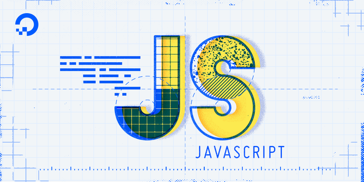
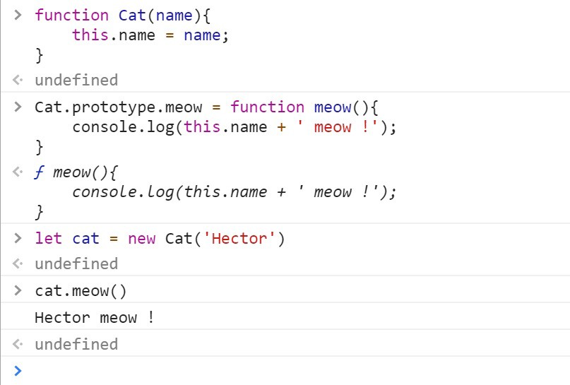

Javascript : Prototype vs Class – Valentin PARSY – Medium

# Javascript : Prototype vs Class

“Now that we have the keyword class we can use JS like any OOP language” — Someone that needs to read what’s below

My last story was about ‘*class vs interface*’ in Typescript and I’m happy to say I had a lot of feedback. In those feedback I saw some people lost when talking about classes in Javascript.

Then a sentence triggered the will to write this story today :

> “ plain javascript has had proper classes since the ECMAScript 2015 standard “

Well … no, and I’ll show you why.

* * *

*...*

### Before the ‘class’ keyword

Here is an exemple of how we implemented ‘*classes*’ in Javascript not so long ago. The first function would be kind of a **constructor**, so we have a Cat class and we have a function in this class that will meow :

You create cat with the keyword **new**

Quicknote : what if you forget the **new **keyword ? Well it doesn’t throw any error … and you just renamed your window.

It’s all about what **this** is referring to

### Where is the prototype

In the console you can clearly see the prototypal chain:

Here’s what your cat contains

Your cat is an object with a name, it has an object **__proto__ **that contains a function meow and the Cat constructor, this object/prototype also contains an object **Object** (which is the base object, kind of like Java, that is the base prototype of all javascript objects). You can see why it is called a prototypal **chain.**

Now one of the things that differs a lot from how it would work with ‘classical’ classes is that prototypes are references. Which means that if you create a lot of cats and do that on one of them

delete cat.__proto__.meow

You just removed the capacity to meow to all your cats, because they all share the same reference to the Cat prototype.

* * *

*...*

Now let’s create a Dog class, the same as the cat but instead of meowing, it’s barking :

Who’s a good boy ?!

Now you got a dog and a cat, let’s do something really bad, forbidden, seriously never try this at ho … work :

cat.__proto__ = dog.__proto__;
Now what is inside our cat :

OMG the cat can bark now ! He is still a Cat, but his prototype is one of a Dog … and if I tell you that

cat instanceof Dog === true

You can begin to understand how everything is connected to object’s prototype in JS.

* * *

*...*

See ? That’s what’s crazy with Javascript : you can do everything you want even make your cat bark just by switching its prototype. The problem is obviously that with that much freedom, a lot of mistakes can happen.

### We got class now

Let’s begin by a reminder of the definition of class in Javascript according to MDN :

> JavaScript classes, introduced in ECMAScript 2015, are primarily **> syntactical sugar**>  over JavaScript’s existing prototype-based inheritance. The class syntax **> does not**>  introduce a new object-oriented inheritance model to JavaScript.

If it isn’t clear enough, let me show you how much it doesn’t introduce new OO model in JS.

Let’s continue our example of cats and dogs using the class syntax :

We got everything written like any OOP language : **class**, **constructor**, **super**, **extends **and I even added a **static **function for fun. But what does our supercat looks like ?

Clearly it’s a bigger Cat

The fact that we used extends means we added a depth in the prototypal chain. Now we have our object having a name and a superpower, it has an object **__proto__ **with the SuperCat constructor and your SuperCat function meow, which has a **__proto__** etc...

That means that like before, you can delete a property or a method of a prototype and it will destroy it for every instance you created.

Nothing has changed … well something has changed :

We had to wait 20 years for that

You can try changing a proto the way we did before and have a barking SuperCat that still has a powerfull MEOW, or do other crazy things, the (prototypal) world is yours now.

Who’s a …

* * *

*...*

Now you see that, behind the class keyword, it is still the same prototypal approach as before. I hope you think about it when using it in your code.

I’d like to thanks Florian Orpelière ( [**@**florpeliere](https://twitter.com/florpeliere) ) who did a speech about this subject not so long before I wrote this article, it was so clear and well directed it inspired me a lot.