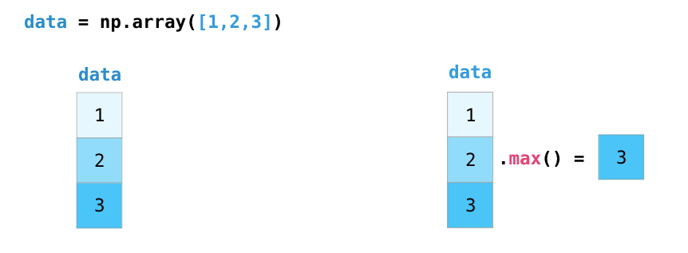
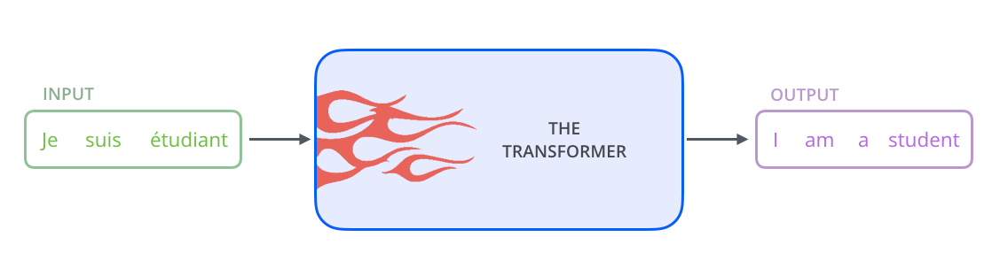

Jay Alammar – Visualizing machine learning one concept at a time

# [A Visual Intro to NumPy and Data Representation](https://jalammar.github.io/visual-numpy/)

 

The [NumPy](https://www.numpy.org/) package is the workhorse of data analysis, machine learning, and scientific computing in the python ecosystem. It vastly simplifies manipulating and crunching vectors and matrices. Some of python’s leading package rely on NumPy as a fundamental piece of their infrastructure (examples include scikit-learn, SciPy, pandas, and tensorflow). Beyond the ability to slice and dice numeric data, mastering numpy will give you an edge when dealing and debugging with advanced usecases in these libraries.

In this post, we’ll look at some of the main ways to use NumPy and how it can represent different types of data (tables, images, text…etc) before we an serve them to machine learning models.

 [Read More](https://jalammar.github.io/visual-numpy/)

# [Video: Intuition & Use-Cases of Embeddings in NLP & beyond](https://jalammar.github.io/skipgram-recommender-talk/)

 

I gave a talk at [Qcon London](https://qconlondon.com/) this year. Watch it here:

https://www.infoq.com/presentations/nlp-word-embedding/

In this video, I introduced word embeddings and the word2vec algorithm. I then proceeded to discuss how the word2vec algorithm is used to create recommendation engines in companies like Airbnb and Alibaba. I close by glancing at real-world consequences of popular recommendation systems like those of YouTube and Facebook.

My [Illustrated Word2vec](https://jalammar.github.io/illustrated-word2vec/) post used and built on the materials I created for this talk (but didn’t include anything on the recommender application of word2vec). This was my first talk at a technical conference and I spent quite a bit of time preparing for it. In the six weeks prior to the conference I spent about 100 hours working on the presentation and ended up with 200 slides. It was an interesting balancing act of trying to make it introductory but not shallow, suitable for senior engineers and architects yet not necessarily ones who have machine learning experience.

 [Read More](https://jalammar.github.io/skipgram-recommender-talk/)

# [The Illustrated Word2vec](https://jalammar.github.io/illustrated-word2vec/)

Discussions:[Hacker News (347 points, 37 comments)](https://news.ycombinator.com/item?id=19498356), [Reddit r/MachineLearning (151 points, 19 comments)](https://www.reddit.com/r/MachineLearning/comments/b60jtg/p_the_illustrated_word2vec/)

Translations: [Chinese (Simplified)](https://mp.weixin.qq.com/s?__biz=MjM5MTQzNzU2NA==&mid=2651669277&idx=2&sn=bc8f0590f9e340c1f1359982726c5a30&chksm=bd4c648e8a3bed9817f30c5a512e79fe0cc6fbc58544f97c857c30b120e76508fef37cae49bc&scene=0&xtrack=1#rd), [Korean](https://databreak.netlify.com/2019-04-25-illustrated_word2vec/), [Russian](https://habr.com/ru/post/446530/)

 

**>  “**> There is in all things a pattern that is part of our universe. It has symmetry, elegance, and grace**>  - those qualities you find always in that which the true artist captures. You can find it in the turning of the seasons, in the way sand trails along a ridge, in the branch clusters of the creosote bush or the pattern of its leaves.

>  We try to copy these patterns in our lives and our society, seeking the rhythms, the dances, the forms that comfort. Yet, it is possible to see peril in the finding of ultimate perfection. It is clear that the ultimate pattern contains it own fixity. In such perfection, all things move toward death.” ~ Dune (1965)**

I find the concept of embeddings to be one of the most fascinating ideas in machine learning. If you’ve ever used Siri, Google Assistant, Alexa, Google Translate, or even smartphone keyboard with next-word prediction, then chances are you’ve benefitted from this idea that has become central to Natural Language Processing models. There has been quite a development over the last couple of decades in using embeddings for neural models (Recent developments include contextualized word embeddings leading to cutting-edge models like [BERT](https://jalammar.github.io/illustrated-bert/) and GPT2).

Word2vec is a method to efficiently create word embeddings and has been around since 2013. But in addition to its utility as a word-embedding method, some of its concepts have been shown to be effective in creating recommendation engines and making sense of sequential data even in commercial, non-language tasks. Companies like [Airbnb](https://www.kdd.org/kdd2018/accepted-papers/view/real-time-personalization-using-embeddings-for-search-ranking-at-airbnb), [Alibaba](https://www.kdd.org/kdd2018/accepted-papers/view/billion-scale-commodity-embedding-for-e-commerce-recommendation-in-alibaba), [Spotify](https://www.slideshare.net/AndySloane/machine-learning-spotify-madison-big-data-meetup), and [Anghami](https://towardsdatascience.com/using-word2vec-for-music-recommendations-bb9649ac2484) have all benefitted from carving out this brilliant piece of machinery from the world of NLP and using it in production to empower a new breed of recommendation engines.

In this post, we’ll go over the concept of embedding, and the mechanics of generating embeddings with word2vec. But let’s start with an example to get familiar with using vectors to represent things. Did you know that a list of five numbers (a vector) can represent so much about your personality?

 [Read More](https://jalammar.github.io/illustrated-word2vec/)

# [The Illustrated BERT, ELMo, and co. (How NLP Cracked Transfer Learning)](https://jalammar.github.io/illustrated-bert/)

Discussions:[Hacker News (98 points, 19 comments)](https://news.ycombinator.com/item?id=18751469), [Reddit r/MachineLearning (164 points, 20 comments)](https://www.reddit.com/r/MachineLearning/comments/a3ykzf/r_the_illustrated_bert_and_elmo_how_nlp_cracked/)

Translations: [Chinese (Simplified)](https://blog.csdn.net/qq_41664845/article/details/84787969), [Persian](http://blog.class.vision/1397/09/bert-in-nlp/)

The year 2018 has been an inflection point for machine learning models handling text (or more accurately, Natural Language Processing or NLP for short). Our conceptual understanding of how best to represent words and sentences in a way that best captures underlying meanings and relationships is rapidly evolving. Moreover, the NLP community has been putting forward incredibly powerful components that you can freely download and use in your own models and pipelines (It’s been referred to as [NLP’s ImageNet moment](http://ruder.io/nlp-imagenet/), referencing how years ago similar developments accelerated the development of machine learning in Computer Vision tasks).

 

 [Read More](https://jalammar.github.io/illustrated-bert/)

# [A Gentle Visual Intro to Data Analysis in Python Using Pandas](https://jalammar.github.io/gentle-visual-intro-to-data-analysis-python-pandas/)

Discussions:[Hacker News (195 points, 51 comments)](https://news.ycombinator.com/item?id=18351685), [Reddit r/Python (140 points, 18 comments)](https://www.reddit.com/r/Python/comments/9scznd/a_gentle_visual_intro_to_data_analysis_in_python/)

If you’re planning to learn data analysis, machine learning, or data science tools in python, you’re most likely going to be using the wonderful [pandas](https://pandas.pydata.org/) library. Pandas is an open source library for data manipulation and analysis in python.

## Loading Data

One of the easiest ways to think about that, is that you can load tables (and excel files) and then slice and dice them in multiple ways:

 [Read More](https://jalammar.github.io/gentle-visual-intro-to-data-analysis-python-pandas/)

# [The Illustrated Transformer](https://jalammar.github.io/illustrated-transformer/)

Discussions:[Hacker News (65 points, 4 comments)](https://news.ycombinator.com/item?id=18351674), [Reddit r/MachineLearning (29 points, 3 comments)](https://www.reddit.com/r/MachineLearning/comments/8uh2yz/p_the_illustrated_transformer_a_visual_look_at/)

Translations: [Chinese (Simplified)](https://blog.csdn.net/yujianmin1990/article/details/85221271), [Korean](https://nlpinkorean.github.io/illustrated-transformer/)

Watch: MIT’s [Deep Learning State of the Art](https://youtu.be/53YvP6gdD7U?t=432) lecture referencing this post

In the [previous post, we looked at Attention](https://jalammar.github.io/visualizing-neural-machine-translation-mechanics-of-seq2seq-models-with-attention/) – a ubiquitous method in modern deep learning models. Attention is a concept that helped improve the performance of neural machine translation applications. In this post, we will look at **The Transformer** – a model that uses attention to boost the speed with which these models can be trained. The Transformers outperforms the Google Neural Machine Translation model in specific tasks. The biggest benefit, however, comes from how The Transformer lends itself to parallelization. It is in fact Google Cloud’s recommendation to use The Transformer as a reference model to use their [Cloud TPU](https://cloud.google.com/tpu/) offering. So let’s try to break the model apart and look at how it functions.

The Transformer was proposed in the paper [Attention is All You Need](https://arxiv.org/abs/1706.03762). A TensorFlow implementation of it is available as a part of the [Tensor2Tensor](https://github.com/tensorflow/tensor2tensor) package. Harvard’s NLP group created a [guide annotating the paper with PyTorch implementation](http://nlp.seas.harvard.edu/2018/04/03/attention.html). In this post, we will attempt to oversimplify things a bit and introduce the concepts one by one to hopefully make it easier to understand to people without in-depth knowledge of the subject matter.

## A High-Level Look

Let’s begin by looking at the model as a single black box. In a machine translation application, it would take a sentence in one language, and output its translation in another.

 

 [Read More](https://jalammar.github.io/illustrated-transformer/)

# [Visualizing A Neural Machine Translation Model (Mechanics of Seq2seq Models With Attention)](https://jalammar.github.io/visualizing-neural-machine-translation-mechanics-of-seq2seq-models-with-attention/)

Translations: [Chinese (Simplified)](https://blog.csdn.net/qq_41664845/article/details/84245520), [Korean](https://nlpinkorean.github.io/visualizing-neural-machine-translation-mechanics-of-seq2seq-models-with-attention/)

Watch: MIT’s [Deep Learning State of the Art](https://youtu.be/53YvP6gdD7U?t=335) lecture referencing this post

**May 25th update:** New graphics (RNN animation, word embedding graph), color coding, elaborated on the final attention example.

**Note:** The animations below are videos. Touch or hover on them (if you’re using a mouse) to get play controls so you can pause if needed.

Sequence-to-sequence models are deep learning models that have achieved a lot of success in tasks like machine translation, text summarization, and image captioning. Google Translate started [using](https://blog.google/products/translate/found-translation-more-accurate-fluent-sentences-google-translate/) such a model in production in late 2016. These models are explained in the two pioneering papers ([Sutskever et al., 2014](https://papers.nips.cc/paper/5346-sequence-to-sequence-learning-with-neural-networks.pdf), [Cho et al., 2014](http://emnlp2014.org/papers/pdf/EMNLP2014179.pdf)).

I found, however, that understanding the model well enough to implement it requires unraveling a series of concepts that build on top of each other. I thought that a bunch of these ideas would be more accessible if expressed visually. That’s what I aim to do in this post. You’ll need some previous understanding of deep learning to get through this post. I hope it can be a useful companion to reading the papers mentioned above (and the attention papers linked later in the post).

A sequence-to-sequence model is a model that takes a sequence of items (words, letters, features of an images…etc) and outputs another sequence of items. A trained model would work like this:

 [Read More](https://jalammar.github.io/visualizing-neural-machine-translation-mechanics-of-seq2seq-models-with-attention/)

# [Visualizing Pandas' Pivoting and Reshaping Functions](https://jalammar.github.io/visualizing-pandas-pivoting-and-reshaping/)

I love using python’s [Pandas](https://pandas.pydata.org/) package for data analysis. The [10 Minutes to pandas](https://pandas.pydata.org/pandas-docs/stable/10min.html) is a great place to start learning how to use it for data analysis.

Things get a lot more interesting once you’re comfortable with the fundamentals and start with [Reshaping and Pivot Tables](https://pandas.pydata.org/pandas-docs/stable/reshaping.html). That guide shows some of the more interesting functions of reshaping data. Below are some visualizations to go along with the Pandas reshaping guide.

 [Read More](https://jalammar.github.io/visualizing-pandas-pivoting-and-reshaping/)

# [A Visual And Interactive Look at Basic Neural Network Math](https://jalammar.github.io/feedforward-neural-networks-visual-interactive/)

In the [previous post, we looked at the basic concepts of neural networks](https://jalammar.github.io/visual-interactive-guide-basics-neural-networks/). Let us now take another example as an excuse to guide us to explore some of the basic mathematical ideas involved in prediction with neural networks.

 [Read More](https://jalammar.github.io/feedforward-neural-networks-visual-interactive/)

# [A Visual and Interactive Guide to the Basics of Neural Networks](https://jalammar.github.io/visual-interactive-guide-basics-neural-networks/)

Discussions:[Hacker News (63 points, 8 comments)](https://news.ycombinator.com/item?id=13183171), [Reddit r/programming (312 points, 37 comments)](https://www.reddit.com/r/programming/comments/5igdix/a_visual_and_interactive_guide_to_the_basics_of/)

 

**Update**: Part 2 is now live: [A Visual And Interactive Look at Basic Neural Network Math](https://jalammar.github.io/feedforward-neural-networks-visual-interactive/)

## Motivation

I’m not a machine learning expert. I’m a software engineer by training and I’ve had little interaction with AI. I had always wanted to delve deeper into machine learning, but never really found my “in”. That’s why when Google open sourced TensorFlow in November 2015, I got super excited and knew it was time to jump in and start the learning journey. Not to sound dramatic, but to me, it actually felt kind of like Prometheus handing down fire to mankind from the Mount Olympus of machine learning. In the back of my head was the idea that the entire field of Big Data and technologies like Hadoop were vastly accelerated when Google researchers released their Map Reduce paper. This time it’s not a paper – it’s the actual software they use internally after years and years of evolution.

So I started learning what I can about the basics of the topic, and saw the need for gentler resources for people with no experience in the field. This is my attempt at that.

 [Read More](https://jalammar.github.io/visual-interactive-guide-basics-neural-networks/)

# [Supercharging Android Apps With TensorFlow (Google's Open Source Machine Learning Library)](https://jalammar.github.io/Supercharging-android-apps-using-tensorflow/)

Discussion:[Reddit r/Android (80 points, 16 comments)](https://www.reddit.com/r/androiddev/comments/3zpkb6/supercharging_android_apps_with_tensorflow/)

In November 2015, Google [announced](https://googleblog.blogspot.com/2015/11/tensorflow-smarter-machine-learning-for.html) and open sourced [TensorFlow](https://www.tensorflow.org/), its latest and greatest machine learning library. This is a big deal for three reasons:

1. Machine Learning expertise: Google is a dominant force in machine learning. Its prominence in search owes a lot to the strides it achieved in machine learning.

2. Scalability: the announcement noted that TensorFlow was initially designed for internal use and that it’s already in production for some live product features.

3. Ability to run on Mobile.

This last reason is the operating reason for this post since we’ll be focusing on Android. If you examine the [tensorflow repo on GitHub](https://github.com/tensorflow/tensorflow), you’ll find a little [tensorflow/examples/android](https://github.com/tensorflow/tensorflow/tree/master/tensorflow/examples/android) directory. I’ll try to shed some light on the Android TensorFlow example and some of the things going on under the hood.

 [Read More](https://jalammar.github.io/Supercharging-android-apps-using-tensorflow/)