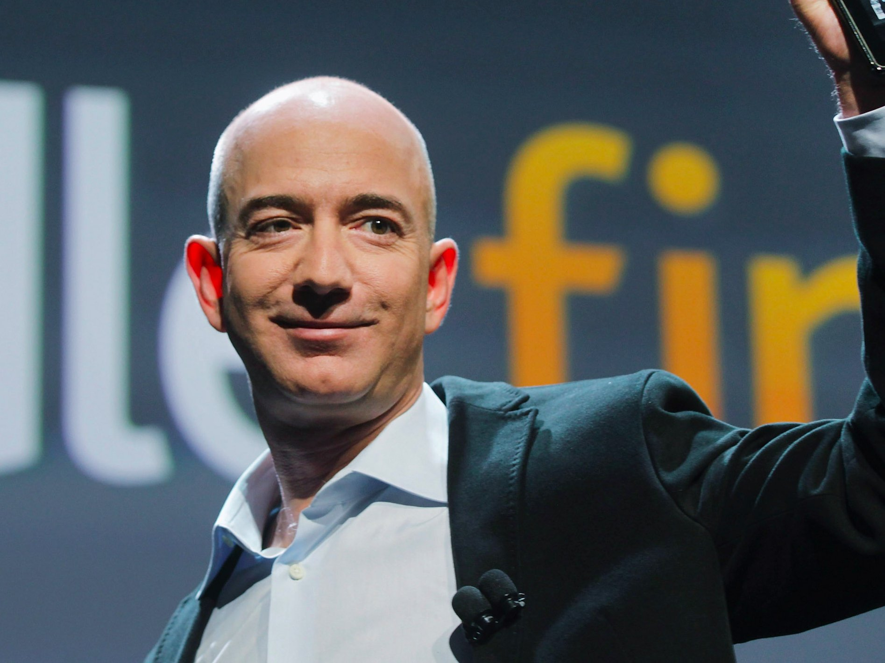

Jeff Bezos explains the perfect way to make risky business decisions

# Jeff Bezos explains the perfect way to make risky business decisions

- [Julie Bort](http://uk.businessinsider.com/author/julie-bort)

- [**](http://uk.businessinsider.com/jeff-bezos-explains-the-perfect-way-to-make-risky-business-decisions-2017-4?r=US&IR=Tmailto:jbort@businessinsider.com)  [**](http://twitter.com/Julie188)  [**](https://plus.google.com/s/Julie%20Bort?rel=author)

- 13h
- 2,294

- [**  facebook](https://www.facebook.com/sharer/sharer.php?u=http://uk.businessinsider.com/jeff-bezos-explains-the-perfect-way-to-make-risky-business-decisions-2017-4)

- [**  linkedin](http://www.linkedin.com/shareArticle?mini=true&url=http://uk.businessinsider.com/jeff-bezos-explains-the-perfect-way-to-make-risky-business-decisions-2017-4&title=Jeff%20Bezos%20explains%20the%20perfect%20way%20to%20make%20risky%20business%20decisions&summary=How%20Bezos%20plans%20to%20keep%20his%20300,000-employee%20company%20running%20like%20a%20startup%20by%20making%20faster%20decisions.)

- [**  twitter](http://twitter.com/share?url=http://uk.businessinsider.com/jeff-bezos-explains-the-perfect-way-to-make-risky-business-decisions-2017-4&via=BIUK_Tech&text=Jeff+Bezos+explains+the+perfect+way+to+make+risky+business+decisions)

- [**  email](http://uk.businessinsider.com/jeff-bezos-explains-the-perfect-way-to-make-risky-business-decisions-2017-4?r=US&IR=T#)

- [**  print](#)

     Spencer Platt/Getty Images

"Most decisions should probably be made with somewhere around 70% of the information you wish you had. If you wait for 90%, in most cases, you’re probably being slow," Jeff Bezos advised in his annual shareholder's [letter released on Wednesday.](http://phx.corporate-ir.net/External.File?item=UGFyZW50SUQ9NjY2MjA1fENoaWxkSUQ9Mzc0MDUyfFR5cGU9MQ==&t=1)

Bezos was explaining how he goes about running the absolutely massive company [Amazon](http://www.amazon.co.uk/) has become — 341,000 employees — like a startup.

That's a concept he calls Day 1. The Day 1 mantra is so top of mind for him that the building he works in is named Day 1, "and when I moved buildings, I took the name with me."

One of the tenets of the Day 1 mentality is to make faster decisions, he writes.

But it's not just about speed. Anyone can pick things fast, willy nilly. "You have to somehow make high-quality, high-velocity decisions. Easy for start-ups and very challenging for large organizations," he writes.

 [ Sponsor Content   **]()

 [](https://adclick.g.doubleclick.net/pcs/click?xai=AKAOjsujzvLtwat1k6DEP3hDFU3gxZ29sG22ZGUtwrN8NgfT8Ip6NyygGDOhwfcN5SPNOSzhafG5M9aVABQDQLeWFx_t5Lv82E6AjA35wOg92CLZRML40Ap0iNPE-ZOA1sRZe_IPE32vLy_mQBjk1NQikU1Ab5-nTGv4V3HGDjihew3Eec9un6NolFRvomUSwv-uLhO1QOVwqv_--YF2q0HNRmRl-8Am_tFmu3z9e7mNZ_8ZDXdaU6lgSyJt7MkSixDY1A8QVy9o&sig=Cg0ArKJSzDxVbhcDpGxMEAE&urlfix=1&adurl=https://ad.doubleclick.net/ddm/trackclk/N1657.1715363BUSINESSTECHINSIDER/B10464556.139657702%3Bdc_trk_aid%3D311893628%3Bdc_trk_cid%3D64713871%3Bdc_lat%3D%3Bdc_rdid%3D%3Btag_for_child_directed_treatment%3D)

##   [3 things that all rapidly expanding businesses have in common](https://adclick.g.doubleclick.net/pcs/click?xai=AKAOjsujzvLtwat1k6DEP3hDFU3gxZ29sG22ZGUtwrN8NgfT8Ip6NyygGDOhwfcN5SPNOSzhafG5M9aVABQDQLeWFx_t5Lv82E6AjA35wOg92CLZRML40Ap0iNPE-ZOA1sRZe_IPE32vLy_mQBjk1NQikU1Ab5-nTGv4V3HGDjihew3Eec9un6NolFRvomUSwv-uLhO1QOVwqv_--YF2q0HNRmRl-8Am_tFmu3z9e7mNZ_8ZDXdaU6lgSyJt7MkSixDY1A8QVy9o&sig=Cg0ArKJSzDxVbhcDpGxMEAE&urlfix=1&adurl=https://ad.doubleclick.net/ddm/trackclk/N1657.1715363BUSINESSTECHINSIDER/B10464556.139657702%3Bdc_trk_aid%3D311893628%3Bdc_trk_cid%3D64713871%3Bdc_lat%3D%3Bdc_rdid%3D%3Btag_for_child_directed_treatment%3D)

- [Sponsor Content by Oracle CX](https://adclick.g.doubleclick.net/pcs/click?xai=AKAOjsujzvLtwat1k6DEP3hDFU3gxZ29sG22ZGUtwrN8NgfT8Ip6NyygGDOhwfcN5SPNOSzhafG5M9aVABQDQLeWFx_t5Lv82E6AjA35wOg92CLZRML40Ap0iNPE-ZOA1sRZe_IPE32vLy_mQBjk1NQikU1Ab5-nTGv4V3HGDjihew3Eec9un6NolFRvomUSwv-uLhO1QOVwqv_--YF2q0HNRmRl-8Am_tFmu3z9e7mNZ_8ZDXdaU6lgSyJt7MkSixDY1A8QVy9o&sig=Cg0ArKJSzDxVbhcDpGxMEAE&urlfix=1&adurl=https://ad.doubleclick.net/ddm/trackclk/N1657.1715363BUSINESSTECHINSIDER/B10464556.139657702%3Bdc_trk_aid%3D311893628%3Bdc_trk_cid%3D64713871%3Bdc_lat%3D%3Bdc_rdid%3D%3Btag_for_child_directed_treatment%3D)

- Apr. 10, 2017

So he outlined a couple of steps for that.

1. Learn to work with just enough data, aiming for most of what you need (70%) instead of gunning for near certainty (90%).

2. Get comfortable with uncertainty by staying flexible *after *the decision is made. "Many decisions are reversible, two-way doors," he writes. And for those decisions that can be easily undone use "a light-weight process." You can tell if it's a light-weight decision by answering the question: "So what if you’re wrong?" he writes.

3. Instead of focusing on avoiding mistakes by making perfect decisions, become a master of "quickly recognizing and correcting bad decisions. If you’re good at course correcting, being wrong may be less costly than you think, whereas being slow is going to be expensive for sure."

4. Finally, for the biggies, those decisions that are not reversible or that have a big impact on customers, employees or partners, turn the traditional idea of buy-in/approval on its head. Go with "disagree and commit."

 "If you have conviction on a particular direction even though there’s no consensus, it’s helpful to say, 'Look, I know we disagree on this but will you gamble with me on it? Disagree and commit?'" Bezos writes.

This is one of Amazon's core values and [we've previously reported on](http://www.businessinsider.com/amazon-unusual-process-to-decide-on-new-products-2016-9) it's used to decide which new products to pursue, including Alexa and the Echo.

Bezos adds that this concept applies to bosses, including himself:  "If you’re the boss, you should do this too. I disagree and commit all the time. We recently greenlit a particular [Amazon](http://www.amazon.co.uk/) Studios original. I told the team my view: debatable whether it would be interesting enough, complicated to produce, the business terms aren’t that good, and we have lots of other opportunities. They had a completely different opinion and wanted to go ahead. I wrote back right away with 'I disagree and commit and hope it becomes the most watched thing we’ve ever made.'"

And, he notes, when you disagree and commit, it's not about holding an "I-told-you-so" over other people's heads. It's a chance for people to hear an opposing point of view but to move ahead with action, and everyone's full support, even if the holdouts never really changed their mind.

In other words: "'You’ve worn me down' is an awful decision-making process. It’s slow and de-energizing," Bezos explains. but "a high-velocity decision making environment is more fun."

Disclosure: Jeff Bezos is an investor in Business Insider through his personal investment company Bezos Expeditions.

### NOW WATCH: [Ocean ‘dead zones’ exist — and there are more of them than scientists thought](http://uk.businessinsider.com/dead-zones-threaten-coral-reefs-worldwide-ocean-smithsonian-tropical-research-institute-2017-3)

[h]()

More: [Amazon](http://uk.businessinsider.com/category/amazon)  [Jeff Bezos](http://uk.businessinsider.com/category/jeff-bezos)