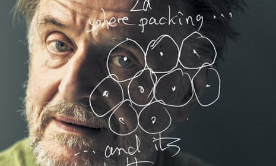
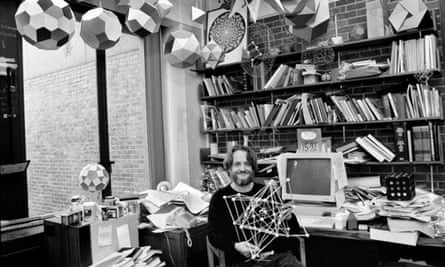
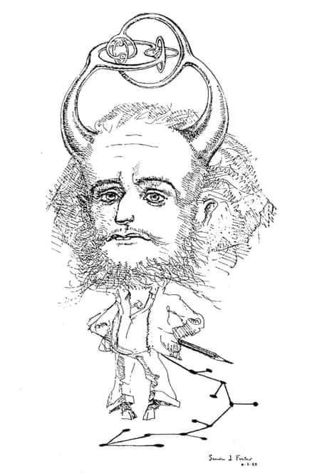
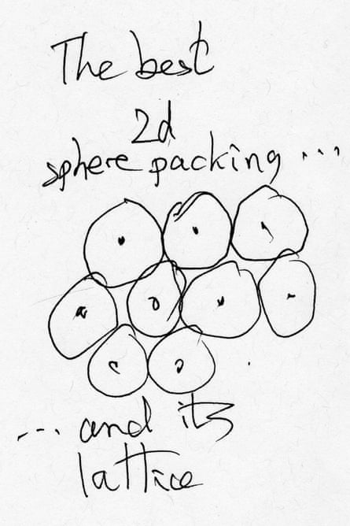
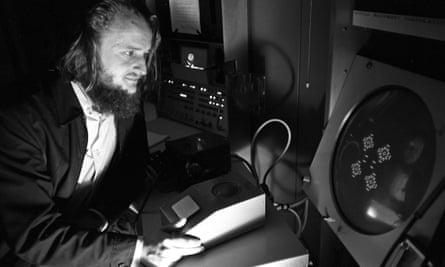

John Horton Conway: the world’s most charismatic mathematician | Siobhan Roberts | Science | The Guardian

[The long read](https://www.theguardian.com/news/series/the-long-read)
[Mathematics](https://www.theguardian.com/science/mathematics)

# John Horton Conway: the world’s most charismatic mathematician

John Horton Conway is a cross between Archimedes, Mick Jagger and Salvador Dalí. For many years, he worried that his obsession with playing silly games was ruining his career – until he realised that it could lead to extraordinary discoveries

[Siobhan Roberts](https://www.theguardian.com/profile/siobhan-roberts)
Thu 23 Jul 2015 06.00 BSTLast modified on Wed 29 Nov 2017 14.09 GMT

- 
- 
- 

Shares

4,979

[ ###   Comments   113](https://www.theguardian.com/science/2015/jul/23/john-horton-conway-the-most-charismatic-mathematician-in-the-world#comments)

John Horton Conway and his Leech lattice doodle. Photograph: Hollandse Hoogte/Eyevine

On a late September day in 1956, John Horton Conway left home with a trunk on his back. He was a skinny 18-year-old, with long, unkempt hair – a sort of proto-hippie – and although he generally preferred to go barefoot, on this occasion he wore strappy Jesus sandals. He travelled by steam train from Liverpool to Cambridge, where he was to start life as an undergraduate. During the five-hour journey, via Crewe with a connection in Bletchley, something dawned on him: this was a chance to reinvent himself.

In junior school, one of Conway’s teachers had nicknamed him “Mary”. He was a delicate, effeminate creature. Being Mary made his life absolute hell until he moved on to secondary school, at Liverpool’s Holt High School for Boys. Soon after term began, the headmaster called each boy into his office and asked what he planned to do with his life. John said he wanted to read mathematics at Cambridge. Instead of “Mary” he became known as “The Prof”. These nicknames confirmed Conway as a terribly introverted adolescent, painfully aware of his own suffering.

Advertisement

After loitering for a time with the teenage reprobates at the back of the classroom, Conway ultimately did well enough on the university entrance exams to receive a minor scholarship and get his name published in the Liverpool Daily Post. As he sat on the train to Cambridge, it dawned on him that since none of his classmates would be joining him at university, he would be able to transform himself into a new person: an extrovert! He wasn’t sure it would work. He worried that his introversion might be too entrenched, but he decided to try. He would be boisterous and witty, he would tell funny stories at parties, he would laugh at himself – that was key.

“Roughly speaking,” he recalled, “I was going to become the kind of person you see now. It was a free decision.”

 

##   [Sign up for Lab Notes - the Guardian's weekly science update]()

   

Read more

 [(L)](https://www.theguardian.com/science/2016/jun/07/sign-up-for-lab-notes-the-guardians-weekly-science-update)

Now 77, John Horton Conway is perhaps the world’s most lovable egomaniac. He is Archimedes, Mick Jagger, Salvador Dalí, and [Richard Feynman](https://www.theguardian.com/science/2011/may/15/quantum-man-richard-feynman-review), all rolled into one. He is one of the greatest living mathematicians, with a sly sense of humour, a polymath’s promiscuous curiosity, and a compulsion to explain everything about the world to everyone in it. According to Sir Michael Atiyah, former president of the Royal Society and arbiter of mathematical fashion, “Conway is the most magical mathematician in the world.”

For the last quarter century Conway has held the position of Princeton’s John von Neumann distinguished professor in applied and computational mathematics, now emeritus. Before that, he spent three decades at Cambridge, where in the 1970s, he dived deep into the vast ocean of mathematical symmetry. He discovered a 24-dimensional symmetry group that came to bear his name, and, with his colleague Simon Norton, he illuminated the 196,883-dimensional Monster group with a paper titled “Monstrous Moonshine”. Conway also discovered a new class of numbers, infinitely large and infinitesimally small, which are now known as “surreal numbers”. Those achievements earned him a spot as a fellow of the Royal Society of London for Improving Natural Knowledge, the oldest scientific society in the world. Conway likes to mention that when he was elected in 1981, he signed the big book of fellows at the induction ceremony and was pleased to see on previous pages the names Isaac Newton, Albert Einstein, Alan Turing, and Bertrand Russell.

Advertisement

Conway’s is a jocund and playful egomania, sweetened by self-deprecating charm. He has on many occasions admitted: “I do have a big ego! As I often say, modesty is my only vice. If I weren’t so modest, I’d be perfect.” That said, he is irresistibly drawn to piddling away his days playing games, preferably silly children’s games. While his colleagues zealously guard their vacations for uninterrupted research time, Conway prefers to spend his summers hopping between maths camps for students. This July, for instance, Conway is playing games at a maths camp for teens in Bremen, Germany, and then flying over to Portland, Oregon, for a middle-schoolers’ camp.

This lust for the seemingly trivial has consumed a remarkable amount of Conway’s time and energy. In addition to all the gaming, he’s also been infatuated with factoring large numbers in his head; with reciting pi from memory to 1,111+ digits; with calculating, nearly instantaneously, the day of the week for any given date using what he calls his “Doomsday” algorithm. He’s invented many peculiar algorithms—for counting stairs while you climb without actually counting, and for how best to read through a stack of double-sided loose-leaf pages. And he’s been known to carry on his person decks of cards, dice, ropes, pennies, coat hangers, sometimes a Slinky, maybe a miniature toy bicycle, all props he deploys both for explaining ideas and for his own amusement.

While there may seem little method to this madness, curiosity-driven research is attracting renewed attention and support as a strategy for success in the sciences, both pure and applied, and economically for society as a whole. At the first National [Mathematics](https://www.theguardian.com/education/mathematics) Festival in Washington in April, the Italian economist Mario Draghi, president of the European Central Bank and one of the keynote speakers, noted that to believe and invest in fundamental research is to believe and invest in the future – that with increasing constraints on demographic and natural resources, and the impending “secular stagnation” as some call it, the countries that make fundamental research in maths and science a high priority will be the countries that prosper economically. Although Conway himself regards money with an indifference verging on contempt, he is a crusading ambassador for simple curiosity, which he considers the universal force driving discovery.

## * * *

**By 1964, a couple of years longer** than it should have taken, Conway finished his PhD thesis, which explored a modest byway of set theory. He then needed a job. This was a challenge. Not because there weren’t jobs to be had, nor because he wasn’t qualified. The insuperable obstacle was merely applying. As the end of his PhD funding approached, Conway did nothing. He remembers walking down the street and bumping into Ian Cassels, a canny Scot who for a time held the post of the Sadleirian professor of pure mathematics, and also the position of department head. Cassels asked him, “What have you done about a job?”

Advertisement

“Er, nothing,” replied Conway.
“There’s a position opening here, why don’t you apply?”
“How do I go about it?”
“You write me a letter.”
“What should I say?”

Cassels took pity. He offered to write the letter for Conway. He sat down at the side of the road on a stone wall in front of King’s College, rummaged through his briefcase, found a pen, pulled out a piece of paper, and began, “Dear Professor Cassels, I wish to apply for …” He handed it to Conway and instructed him to sign, and Cassels filed the letter away in his briefcase. Victory was his, Conway was sure. A while later he got the news in the mail: “I’m terribly sorry,” Cassels wrote. “You didn’t get the job.” But, he continued, “there is another position coming open next year, and unless you indicate your wishes to the contrary, I shall take your previous letter as a letter of application for that position.” Conway succeeded in obtaining this second position. He became an assistant lecturer.

   John Conway in his office at Princeton in 1993. Photograph: Dith Pran/The New York Times/Red/Eyevine

The students loved their new lecturer as much for his mind as his high jinks. He had a homely lecturing style, discussing abstract concepts in terms of trains and cars, cats and dogs. In lecturing on symmetry and the Platonic solids, he sometimes brought a large turnip and a carving knife to class, transforming the vegetable one slice at a time into an icosahedron with 20 triangular faces, eating the scraps as he went.

For one student, Edward Welbourne, now a software engineer in Oslo, the most memorable was Conway’s linear algebra course – specifically, a session wherein Conway proved that for two symmetric quadratic forms, both can be simultaneously diagonalised (no small feat). “Doing each takes a moderately tricky piece of computation,” said Welbourne. “To do two at the same time is thus doubly tricky, like balancing a broom by its handle on one’s chin while juggling.” This is exactly what Conway did, while concluding the proof. When I mentioned this to Conway, he quibbled that in fact he had balanced a broom on his chin and simultaneously balanced a penny on the hook of a coat hanger and then with a centrifugal swoop spun this coat hanger contraption around like a helicopter rotor.

Advertisement

Such incidents inspired the creation of the John Conway Appreciation Society. “He was by far the most charismatic lecturer in the faculty,” said his Cambridge colleague, Sir Peter Swinnerton-Dyer. “I’m not sure that I can describe how charisma happens. It just is or isn’t. And with most mathematicians it markedly isn’t.”

## * * *

**Part of Conway’s charm is his talent** for spinning tales – he seems almost as expert at storytelling as he is at discovering deep mathematical truths. A favourite in his repertoire involves Oliver Cromwell, lord protector of the Commonwealth and fellow circa 1616 of Sidney Sussex College, where Conway also belonged as a fellow. Working on his biography, I heard it many times from Conway himself, and during a research trip to Cambridge I heard it again from his first wife, Eileen.

Late one night in the early 1960s, Conway came home and told Eileen of an odd party he’d just attended. At the summons of the master of college, Conway and select fellows gathered for a private dinner, together with the college chaplain and alumnus Dr Horace Wilkinson, an anaesthetist, whose family had kept Cromwell’s head in a velvet-lined oak box for nearly 150 years. Wilkinson donated to the college the well-travelled skull, with the intention that it finally be laid to rest. To hear Conway’s telling, it was a raucous night, with ample drink and a sumptuous dinner, after which the master led a candlelit procession to the antechapel, where the chaplain gave a brief service, followed by the burial and consecration.

Stopping by Sidney Sussex College to do some fact checking, I asked after Cromwell. The porter escorted me to the antechapel and pointed to a plaque on the wall: “Near to this place was buried on 25 March 1960 the head of Oliver Cromwell.” This prompted me to put a few questions to Conway. Where exactly was the dinner? What was on the menu? What was the conversation at the table? And, had he actually seen the head? My questions were not greeted with Conway’s usual know-it-all enthusiasm. “*Yeeesss?*” he said. “That is a great story, isn’t it? And I often tell that story with myself playing a supporting role. As if I had actually been there.”

He had made it up – he wasn’t even a fellow at Sidney Sussex until 1964. He’d no doubt heard rumours, and in an opportune moment, when he needed a captivating story to tell, he claimed this tale as his own, because, well, it was a great story. The incident revealed Conway as an accomplished fictioneer and a rather unreliable narrator of his own life.

There is a cartoon drawing of Conway that neatly captures this devilishness. Growing from his head is a “horned sphere,” a topological entity classified more generally as a “pathological example” and known for being counterintuitive and ill-behaved, much like Conway himself. In attempting to get a better read on Conway and his caricature, I consulted Irving Lavin, an art historian at the institute for advanced study in Princeton. Lavin noted that Conway was in good company among artists – Picasso, for one – who matched creativity with promiscuity, both intellectual and interpersonal. So maybe Conway’s seeming inability to distinguish fact from fiction correlated to his uncanny ability to see mathematics differently, to pursue pure curiosity-driven research no matter how superficially trivial, and to achieve his idiosyncratically original results.

[  Facebook](https://www.facebook.com/dialog/share?app_id=180444840287&href=https%3A%2F%2Fwww.theguardian.com%2Fscience%2F2015%2Fjul%2F23%2Fjohn-horton-conway-the-most-charismatic-mathematician-in-the-world%3FCMP%3Dshare_btn_fb%26page%3Dwith%3Aimg-2%23img-2&picture=https%3A%2F%2Fstatic.guim.co.uk%2Fsys-images%2FGuardian%2FPix%2Fpictures%2F2015%2F7%2F22%2F1437584393771%2F3db9c18e-188b-4fdc-a073-8cea4014a18c-1360x2040.jpeg)[  Twitter](https://twitter.com/intent/tweet?text=John%20Horton%20Conway%3A%20the%20world%E2%80%99s%20most%20charismatic%20mathematician%20%7C%20Siobhan%20Roberts&url=https%3A%2F%2Fwww.theguardian.com%2Fscience%2F2015%2Fjul%2F23%2Fjohn-horton-conway-the-most-charismatic-mathematician-in-the-world%3FCMP%3Dshare_btn_tw%26page%3Dwith%3Aimg-2%23img-2)[  Pinterest](http://www.pinterest.com/pin/create/button/?description=John%20Horton%20Conway%3A%20the%20world%E2%80%99s%20most%20charismatic%20mathematician%20%7C%20Siobhan%20Roberts&url=https%3A%2F%2Fwww.theguardian.com%2Fscience%2F2015%2Fjul%2F23%2Fjohn-horton-conway-the-most-charismatic-mathematician-in-the-world%3Fpage%3Dwith%3Aimg-2%23img-2&media=https%3A%2F%2Fstatic.guim.co.uk%2Fsys-images%2FGuardian%2FPix%2Fpictures%2F2015%2F7%2F22%2F1437584393771%2F3db9c18e-188b-4fdc-a073-8cea4014a18c-1360x2040.jpeg)

   A cartoon of Conway. Photograph: Simon J Fraser

Advertisement

Through the early to mid 1960s, however, Conway didn’t accomplish much. He spent the majority of his time playing games, inventing games – such as Sprouts, with graduate student Michael Paterson – and reinventing rules to games he found boring, such as chess. He liked games that moved in a flash. He played backgammon constantly, for small stakes – chalk, honour – though he never got very good at it. By all outward appearances he was blissfully playing around, but Conway was well aware he was doing nothing, had done nothing. He began to worry that he didn’t deserve his job, that he was on the verge of being sacked. He was pissing away his days playing games, though with an ever present grouping of student disciples gathered at his knee. He oscillated between having fun and feeling guilty and depressed. He calls this period in his life “The Black Blank”. Inwardly he worried that his mathematical soul was withering away.

## * * *

**In August 1966, the International Congress** of Mathematicians convened at Moscow State University, and it was there, reclining against a giant cylindrical pillar at least 5ft in diameter, that Conway turned a crucial corner. A man approached and asked, “Are you Conway?” The interlocutor was John McKay, then a PhD student the University of Edinburgh (now a professor at Concordia University in Montreal).

> He spent most of his time playing games, inventing games and reinventing rules to games he found boring, such as chess

McKay had a tip for Conway; he suggested that it might be worthwhile exploring a mathematical commodity that had recently attracted interest: the Leech lattice (discovered by the University of Stirling’s John Leech) – the best lattice for a sphere packing in 24 dimensions, with the “lattice” being a set of points derived from the centres of the spheres.

By analogy, consider that the best packing of circles in two dimensions is the hexagonal, because if you connect the dots of the centres of any six circles surrounding a central circle (pennies on a table, say), these central dots connect to form hexagons. The arrangement of circles has 12 symmetries; it can be rotated or reflected in 12 different ways and it looks exactly the same. By extension, then, mathematicians suspected that the Leech lattice might contain an exquisitely large and coveted symmetry.

Advertisement

The Leech lattice intrigued Conway. He decided to go hunting for this big symmetry, for the lattice’s “symmetry group”. Conway told his wife that were he to succeed, this would make his name. By now he had four young daughters – he memorised his girls’ birthdates by classifying them as “the 60-Fibs”, since they were born in 1960 plus the [Fibonacci](https://www.theguardian.com/science/2011/nov/27/fibonacci-numbers-keith-devlin-review) numbers, ie 1960 + 2, 3, 5, 8 = 1962, 1963, 1965, 1968. And in setting out in search of the group, he told Susie, Rosie, Ellie and Annie that Daddy wasn’t to be disturbed. He planned to set aside Wednesday nights from six o’clock to midnight and Saturdays from noon to midnight, for as long as necessary. He put away the games. He would play around with the Leech lattice instead.

[  Facebook](https://www.facebook.com/dialog/share?app_id=180444840287&href=https%3A%2F%2Fwww.theguardian.com%2Fscience%2F2015%2Fjul%2F23%2Fjohn-horton-conway-the-most-charismatic-mathematician-in-the-world%3FCMP%3Dshare_btn_fb%26page%3Dwith%3Aimg-3%23img-3&picture=https%3A%2F%2Fstatic.guim.co.uk%2Fsys-images%2FGuardian%2FPix%2Fpictures%2F2015%2F7%2F22%2F1437584807962%2F16616f5e-f410-42e4-8dd8-ae92c5220462-1360x2040.jpeg)[  Twitter](https://twitter.com/intent/tweet?text=John%20Horton%20Conway%3A%20the%20world%E2%80%99s%20most%20charismatic%20mathematician%20%7C%20Siobhan%20Roberts&url=https%3A%2F%2Fwww.theguardian.com%2Fscience%2F2015%2Fjul%2F23%2Fjohn-horton-conway-the-most-charismatic-mathematician-in-the-world%3FCMP%3Dshare_btn_tw%26page%3Dwith%3Aimg-3%23img-3)[  Pinterest](http://www.pinterest.com/pin/create/button/?description=John%20Horton%20Conway%3A%20the%20world%E2%80%99s%20most%20charismatic%20mathematician%20%7C%20Siobhan%20Roberts&url=https%3A%2F%2Fwww.theguardian.com%2Fscience%2F2015%2Fjul%2F23%2Fjohn-horton-conway-the-most-charismatic-mathematician-in-the-world%3Fpage%3Dwith%3Aimg-3%23img-3&media=https%3A%2F%2Fstatic.guim.co.uk%2Fsys-images%2FGuardian%2FPix%2Fpictures%2F2015%2F7%2F22%2F1437584807962%2F16616f5e-f410-42e4-8dd8-ae92c5220462-1360x2040.jpeg)

   Conway’s Leech lattice doodle. Photograph: John Horton Conway

“Conway is the rare sort of mathematician whose ability to connect his pet mathematical interests makes one wonder if he isn’t, at some level, shaping mathematical reality and not just exploring it,” James Propp, a professor of mathematics at the University of Massachusetts Lowell, once told me. “The example of this that I know best is a connection he discovered between sphere packing and games. These were two separate areas of study that Conway had arrived at by two different paths. So there’s no reason for them to be linked. But somehow, through the force of his personality, and the intensity of his passion, he bent the mathematical universe to his will.”

And he almost seemed to do the same while looking for the Leech lattice’s symmetry group. Conway had expected to keep to his house-arrest work ethic for weeks or months or beyond. Locking himself away that first Saturday, he unfurled an unused roll of wallpaper backing paper and sketched out all he knew about the problem. By that very evening, he’d figured it out. He’d deduced the Leech lattice’s number of symmetries. It was: 4,157,776,806,543,360,000. Or possibly double that. He telephoned Cambridge’s John Thompson, the God of group theory, and they determined it was the double: 8,315,553,613,086,720,000.

When I pestered Conway for more details regarding the seminal Moscow meeting that inspired his triumphant half-day of discovery, he begged off. He was loth to add any “spurious precision”, as he came to refer to his embellishments, advertent or accidental. “My memory. My memory is a liar,” he said. “It’s a good liar. It deceives even me.”

Advertisement

One thing he was willing to discuss was what precisely he was doing when he was looking for the group. For instance, when he was working with the lattice, he wasn’t just working with the basic (x, y) coordinates, he was working with 24-dimensional coordinates – for example: (3,1,1,1,1,1,1,1,1,1,1,1,1,1,1,1,1,1,1,1,1,1,1,1)

And some of the work was as simple as applying the Pythagorean theorem. Still Conway refused to pull back the curtain too far. “Yes, it’s true, my calculations, technically speaking, were using Pythagoras’ theorem,” he said. “But to concentrate on the calculation is misleading. It’s like asking an artist, ‘Where did you paint the person’s chin? Was it one-foot-five above the base of the picture, or one-foot-six?’ If you’re thinking about conceptual things, the measurements don’t matter … It’s rather unfortunate that we can’t just see these things. Because it means that I can only appreciate the beauty of them, truly, after I’ve have done the calculation. Since I can’t conjure up 24-dimensional space, I use numbers to do it.

“For a time I was thinking so geometrically about these things that I used to imagine myself with lots and lots of arms and legs, extra limbs. Because if I have two arms and point ’em out, then they both lie in a plane. And I’ll use a leg as well, and now they are lying in three-dimensional space. To form an adequate idea, an adequate geometric visualisation, of what is going on in 24 dimensions is more or less impossible. In large dimensional space, there are large numbers of directions to point, so you would seem to need quite a lot of arms and legs. I distinctly remember imagining myself stuck in the middle of this space, and waving all my arms and legs in the air, and trying to understand things, looking up at the stars, pretending they are the lattice points, and just sort of daydreaming.”

As tradition dictates, Conway’s discovery of the Leech lattice’s symmetry meant that it became known as the Conway group (which in fact contains three smaller groups, sometimes collectively called the Conway constellation). This was the hot mathematical news of the day and earned him invitations to lecture across the globe.

It was at this juncture, having found his namesake group, that Conway made what he called “The Vow”, promising himself: “Thou shalt stop worrying and feeling guilty; thou shalt do whatever thou pleasest.” He no longer worried that he was eroding his mathematical soul when he indulged his curiosity and followed wherever it went, whether towards recreation or research, or somewhere altogether nonmathematical, such as his longing to learn the etymology of words. Conway’s fate now was to do all the stuff that he had formerly feared his fellow mathematicians might floccinaucinihilipilificate. “Floccinaucinihilipilification” is his favourite word. He reckons it’s the longest word in the Oxford English Dictionary (it is certainly in the top three), and without prompting he gives an account of its etymology: it is a Latin-based word, invented circa 1730 at Eton as a schoolboy’s joke. And, Conway recites nearly verbatim the OED’s definition: “the action or habit of estimating as worthless.”

## * * *

Advertisement

**The period of time during which Conway** discovered his group, circa 1969 – though he prefers to round it up to 1970 – he calls his annus mirabilis. Within roughly the same 12-month period he also discovered his surreal numbers. This came as a direct if unexpected byproduct of playing all those games, when he noticed that big games broke down into a sum of small games. He deconstructed the games, classifying the moves of each player, determining who was ahead and by how much, and while doing this deconstructing, analysing the sum of mini games within the larger game, he happened upon the surreal numbers. Like an [Escher optical illusion](https://www.google.co.uk/search?q=Escher+optical+illusion&espv=2&biw=1897&bih=1136&tbm=isch&tbo=u&source=univ&sa=X&ved=0CCAQsARqFQoTCPiXvbvv7sYCFXEj2wodZuEPJw) – say, a regular tessellation of birds morphing into fish – Conway beheld the game, and then he saw that it embedded or contained something else entirely: the numbers.

That same year he also invented the Game of Life, a cellular automaton that to this day retains cult status. It is not a game proper; Conway calls it a “no-player never-ending” game. It is played on a grid, like tic-tac-toe and, according to three simple rules of Conway’s devising, the cells placed on the grid proliferate, resembling skittering micro-organisms viewed under a microscope. A cellular automaton is in essence a little machine with groups of cells that evolve from iteration to iteration in discrete rather than continuous time – in seconds, say, each tick of the clock advances the next iteration, and then over time, behaving a bit like a transformer or a shape-shifter, the cells evolve into something, anything, everything else. As such, the Game of Life demonstrates how simplicity generates complexity, providing an analogy for all of mathematics, and the entire universe.

[  Facebook](https://www.facebook.com/dialog/share?app_id=180444840287&href=https%3A%2F%2Fwww.theguardian.com%2Fscience%2F2015%2Fjul%2F23%2Fjohn-horton-conway-the-most-charismatic-mathematician-in-the-world%3FCMP%3Dshare_btn_fb%26page%3Dwith%3Aimg-4%23img-4&picture=https%3A%2F%2Fstatic.guim.co.uk%2Fsys-images%2FGuardian%2FPix%2Fpictures%2F2015%2F7%2F22%2F1437585075275%2F0874b6b2-7ace-4752-b81d-dbf5282946cd-2060x1236.jpeg)[  Twitter](https://twitter.com/intent/tweet?text=John%20Horton%20Conway%3A%20the%20world%E2%80%99s%20most%20charismatic%20mathematician%20%7C%20Siobhan%20Roberts&url=https%3A%2F%2Fwww.theguardian.com%2Fscience%2F2015%2Fjul%2F23%2Fjohn-horton-conway-the-most-charismatic-mathematician-in-the-world%3FCMP%3Dshare_btn_tw%26page%3Dwith%3Aimg-4%23img-4)[  Pinterest](http://www.pinterest.com/pin/create/button/?description=John%20Horton%20Conway%3A%20the%20world%E2%80%99s%20most%20charismatic%20mathematician%20%7C%20Siobhan%20Roberts&url=https%3A%2F%2Fwww.theguardian.com%2Fscience%2F2015%2Fjul%2F23%2Fjohn-horton-conway-the-most-charismatic-mathematician-in-the-world%3Fpage%3Dwith%3Aimg-4%23img-4&media=https%3A%2F%2Fstatic.guim.co.uk%2Fsys-images%2FGuardian%2FPix%2Fpictures%2F2015%2F7%2F22%2F1437585075275%2F0874b6b2-7ace-4752-b81d-dbf5282946cd-2060x1236.jpeg)

   Conway playing Game of Life, which he invented in 1970. Photograph: Kelvin Brodie/the Sun

Conway summed up his annus mirabilis thus: “Before, everything I touched turned to nothing. Now I was Midas, and everything I touched turned to gold.” Nevertheless, it was more than a decade later that the Royal Society installed him as a Fellow in 1981. Thereupon Conway went around Cambridge translating the initials FRS (fellow of the Royal Society), telling people he was now officially a “Filthy Rotten Swine!”

Advertisement

The year 1985 also proved productive for Conway – if not quite another annus mirabilis, it came close. He had continued his sphere packing work with AT&T Labs mathematician Neil Sloane, and that year the duo secured US Patent No. 4,507,648, “Decoding Techniques for Multi-Dimensional Codes”, applying their sphere-packing in coding theory, figuring out how to most efficiently send signals across telephone and fibre-optic lines. This and other papers on the subject were recognised with a prize from the IEEE Information Theory Society; they possessed a superior understanding of multidimensional geometry, and they were solving crucial problems necessary for higher-dimensional coding.

Also in 1985, after 15 years of gestation, Conway and his coauthoring “sum chums” (Robert Curtis, Simon Norton, Richard Parker and Robert Wilson) published the [ATLAS of Finite Groups](http://www.amazon.co.uk/ATLAS-Finite-Groups-Subgroups-Characters/dp/0198531990/ref=sr_1_1?s=books&ie=UTF8&qid=1314023319&sr=1-1), perhaps the most important book in group theory, a realm subsequently picked up by physicists, with “supersymmetry” offering a crucial extension to the [Standard Model of particle physics](https://www.theguardian.com/science/life-and-physics/2014/jun/01/gravity-versus-the-standard-model), the model explaining the basic building blocks of the universe and the fundamental forces of nature.

The same year, Conway accepted an invitation to speak at Princeton, which eventually led to a job offer. He took up a full-time position in 1987. For Princeton, it was a coup. The communications office sent out a glossy press release and the university president, in announcing the hire, praised Conway as a “multifaceted phenomenon … one of the most eminent mathematicians of the century”.

## * * *

**In 1993, Conway attracted the attention** of a New York Times reporter. The resulting profile opened with what Conway calls his “doomsday rule”, an algorithm by which he can calculate the day of the week for any given date:

> “Dr John H Conway sits down at his computer and gets ready to log on. But before the computer allows him to begin work, it quickly spews out 10 randomly selected dates from the past and the future, dates like 3/15/2005 or 4/29/1803. Dr Conway has to mentally calculate what day of the week each would be before his computer lets him open a file and get to work. It is a game he has rigged up to play with himself.”

After inventing the Doomsday game of sorts in 1972, Conway had set a goal to double his speed every five years for doing 10 dates in rapid succession. Landing at Princeton did nothing to put him off course. “Why did I want to be fast? It’s impressive,” he said. “It’s a nice party trick. I don’t know that it ever got me any girls, but it’s the sort of thing that might’ve done occasionally with the right girl, a certain type of girl.”

His record was then 15.92 seconds to calculate all 10 dates, roughly 1.5 seconds for each one. He was on track with his doubling goal, and he informed the reporter that he was the fastest person in the world.

Advertisement

The fastest, that is, until Stephen D Miller, a 19-year-old PhD student, arrived on the scene in the early 1990s. He and Conway entered into hostile competition to see who could smack out 10 dates faster. Conway used this as a strategy to keep his brain sharp and ward off aging, a worry that was increasingly playing on his mind. He had always avoided mirrors, never much liking his appearance, and as the years clicked onward he also avoided catching sight of his reflection in shop windows.

These were turbulent times for Conway. He had survived a difficult divorce from his second wife, Larissa (with whom he has two boys, Alex and Oliver, both now pursuing mathematics, at Rutgers and NYU respectively), as well as a heart attack, and attempted suicide. He had suffered bouts of depression in the past, and after the heart attack he got depressed again – contributing factors being the acrimony with Larissa, alienation from his young boys, and money troubles. He ate a stash of sleeping pills like an entrée at lunch with Larissa and her lawyer.

Following the suicide attempt he made his comeback, so to speak – his re-entry to daily life, knowing full well that people around town were talking – by borrowing a T-shirt belonging to his rock climber friend Neil Sloane, and wearing it around town for days, emblazoned as it was with the big bold letters “SUICIDE” and the tiny word “rock” beneath. Conway thereby instituted his “Let It All Hang Out Policy”, which involved frequently and flippantly recounting this trying chapter in his life – even to this day, he sometimes off-handedly adds it as a chatty preface to a lecture about maths.

Shortly following this dark period, during a manic intellectual cliff-jumping escapade, Conway wondered what his time would be with the help of GAD – short for “Gimme A Date!” – a computer program one of his graduate students had designed to help Conway get even quicker. He was nearly too scared to try. He sat down at the computer and ripped off 10 dates in an astonishing 9.62 seconds. “I didn’t try again,” he recalled. “My heart was pumping away like mad. I got this enormous amount of adrenaline, I actually felt liquids pouring into my brain. And it was scary as all hell. But it was interesting, taking the lid off and seeing how the brain works.”

In the end, not counting Conway’s manic 9.62 seconds, Steve Miller prevailed in the GAD competition – Miller calculated ten dates in 10.66 seconds; his brain was much younger, plain and simple (he is now a professor and vice-chair of the maths department at Rutgers). But no matter. This routine for Conway was all part of deceiving himself into believing he was still only five years older than his students. It was getting to the point, however, where he wasn’t so easily fooled. “You are young, and then you are old. And here, I’m always surrounded by brilliant young mathematicians. How do you keep your end up?”

> You are young, then you are old. I’m always surrounded by brilliant young mathematicians. How do you keep your end up?

> John Horton Conway

Advertisement

Keeping up with the youngsters is the gist of what Conway calls his “Nerd’s Nightmare”: A hunchbacked centenarian, looking a wreck, he hobbles into the Princeton maths department common room. A graduate student asks: “Who’s the old geezer?” Her friend says: “I think that’s what’s-his-name …? Conway!” Conway sits there wearing his Mona Lisa smile, waiting for an opportunity to pounce. Finally, in the course of the students’ conversation they happen to mention a date. “When were you born, again?” “April 1, 2015.” And quick as a flash Conway works it out: “THAT WAS A WEDNESDAY!” And the students say to themselves: “Oh, there is someone in there.”

“It’s my insurance policy against old age,” explained Conway. “This decrepit old guy snaps off a date.”

## * * *

**In spring 2009, three years after he suffered** a stroke that spared him intellectually but left him with a cane and a gammy right side, Conway delivered a six-part lecture series on his latest brainchild: The Free Will Theorem, devised with his Princeton colleague Simon Kochen. The theorem deploys a motley combination of quantum mechanics axioms, philosophy, and geometry. It is most simply stated as follows: If physicists have free will while performing experiments, then elementary particles possess free will as well, and this probably explains why and how humans have free will in the first place.

As unlikely as it sounds, it is a line of thinking that has an illustrious lineage, originating with [John von Neumann](https://www.theguardian.com/technology/2012/feb/26/first-computers-john-von-neumann), the father of the modern computer. In certain quarters, the theorem is being taken seriously, roundly debated and thoroughly discussed – with, for example, a paper just last year in the journal Foundations of Physics, where Conway and Kochen originally published their result in 2006, that picks up the idea and rolls it along.

Over the course of the lectures, graduate students in maths marvelled at how Conway and Kochen had managed to infuriate two departments at once – trespassing on physicists’ territory in such a way as to make philosophers’ hair stand on end. Jacob Tsimerman, another prodigious 19-year-old, was particularly interested. He’d been spending lots of time with Conway, playing Phutball – short for Philosopher’s Football, yet another game of Conway’s invention, using a grid board with white and black stones – and at once debating the merits and demerits of the theorem. Tsimerman thought it was deep and fun and puzzling. But he was more impressed with Phutball. “[Phutball] is arguably the greatest triumph of this man,” he told me. “And I don’t mean that condescendingly. It’s a great game.”

A few years ago, I watched Tsimerman face off against Conway in the Princeton maths department common room, where Conway spends all of his time because his office is such an uninhabitable tip. After some tsk-tsking from Conway followed by a “Pfwooooah!” from Tsimerman, the youngster enthusiastically conceded another defeat. “Your game, professor!” He accepted a rematch, even though another game was bound to make him late for his seminar.

Advertisement

Tsimerman soon suffered a setback. A few tackles later, Conway faced trouble. He cautioned: “Reports of my death have been greatly exaggerated!” This time, though, he was beaten at his own game, and the victorious Tsimerman sprinted off to class. “But he’s now 15 minutes late,” noted Conway. “That’s my real aim in getting them to play these games, to ensure they don’t do well in maths, to destroy all these formerly promising mathematicians.”

Tsimerman subsequently went on to Harvard, and he’s currently an assistant professor at the Univeristy of Toronto. Conway subsequently went on to, as ever, play more games, and engage in all manner of nerdish delights – spending hours upon hours, for example, curing the [Rubik’s cube](https://www.theguardian.com/culture/2015/may/26/erno-rubik-how-we-made-rubiks-cube), and reciting pi, and playing Dots and Boxes, or Sprouts, with his 13-year-old son Gareth, via his third wife Diana.

Usually, though, Conway can be found squatting in the Princeton common room. Although still young at heart and head, he looks more and more like his old friend Archimedes, increasingly bearded and increasingly grey, with an otherworldly mien – a look that should earn him a spot in the online quiz featuring portraits of frumpy old men under the rubric “Prof or Hobo?” His uniform is faded chinos, stained with splotches that he camouflages by doodling spirals or crisscrosses with his pen; and on top he always wears a T-shirt from his infinite collection emblazoned with mathsy messages, such as: “Are you crying? There’s no crying! THERE’S NO CRYING IN MATH CLASS!”

For Conway it is mathematics that allows him to clear away the clouds of reality. As he put it, “Math was always there for me.” It is the realm where he finds solace and infinite unadulterated pleasure. He’s retired, but he keeps on playing, and as he himself noticed, he’s now being more productive than ever. With his Cambridge friend and collaborator Alex Ryba, now a professor of computer science at the City University of New York’s Queens College, he’s writing papers on magic squares, on Pascal’s theorem about a mysterious hexagram — the *Hexagrammum Mysticum* — and on “The Extra Fibonacci Series and the Empire State Building”. They are also finishing The Triangle Book (which Conway’s had in the works for decades), and starting The Monster Book. Perhaps Conway’s bestselling book ever was Winning Ways for Your Mathematical Plays (first published in 1982), a collection of wisdom about games which, in early August, is being feted at the Museum of [Mathematics](https://www.theguardian.com/science/mathematics) in New York City, celebrating Conway and his co-authors, UC Berkeley’s Elwyn Berlekamp and Calgary’s Richard Guy.

As an epigram in the book advises, borrowing from Oscar Wilde: “Life is far too important to be taken seriously.”

*Siobhan Roberts is the author of Genius at Play, The Curious Mind of John Horton Conway (Bloomsbury), out this month in the US, and September in the UK*

*• Follow the Long Read on Twitter:**[@gdnlongread](https://twitter.com/@gdnlongread)*

• This article was amended on 28 July 2015 to clarify that Pascal’s theorem about a mysterious hexagram is called the *Hexagrammum Mysticum Theorem*

##  Since you’re here...

… we’re asking readers like you to support our open, independent journalism. In these frightening and uncertain times, the expertise, scientific knowledge and careful judgment in our reporting has never been so vital. No matter how unpredictable the future feels, we will remain with you, delivering high quality news so we can all make critical decisions about our lives, health and security. Together we can find a way through this.

You’ve read 84 articles in the last four months. We believe every one of us deserves equal access to accurate news and calm explanation. So, unlike many others, we made a different choice: to keep Guardian journalism open for all, regardless of where they live or what they can afford to pay. This would not be possible without the generosity of readers, who now support our work from 180 countries around the world.

We have upheld our editorial independence in the face of the disintegration of traditional media – with social platforms giving rise to misinformation, the seemingly unstoppable rise of big tech and independent voices being squashed by commercial ownership. The Guardian’s independence means we can set our own agenda and voice our own opinions. Our journalism is free from commercial and political bias – never influenced by billionaire owners or shareholders. This makes us different. It means we can challenge the powerful without fear and give a voice to those less heard.

Your financial support has meant we can keep investigating, disentangling and interrogating. It has protected our independence, which has never been so critical. We are so grateful.

We need your support so we can keep delivering quality journalism that’s open and independent. And that is here for the long term. Every reader contribution, however big or small, is so valuable. **Support the Guardian from as little as £1 – and it only takes a minute. Thank you.**

 [Contribute](https://support.theguardian.com/uk/contribute?REFPVID=k8wu0pvi6jklkorut8o8&INTCMP=gdnwb_copts_memco_2020-04-03_UK_EPIC_SUBS_CTA__ARTICLE_COUNT_V1_SUBS_CTA&acquisitionData=%7B%22source%22%3A%22GUARDIAN_WEB%22%2C%22componentId%22%3A%22gdnwb_copts_memco_2020-04-03_UK_EPIC_SUBS_CTA__ARTICLE_COUNT_V1_SUBS_CTA%22%2C%22componentType%22%3A%22ACQUISITIONS_EPIC%22%2C%22campaignCode%22%3A%22gdnwb_copts_memco_2020-04-03_UK_EPIC_SUBS_CTA__ARTICLE_COUNT_V1_SUBS_CTA%22%2C%22abTest%22%3A%7B%22name%22%3A%222020-04-03_UK_EPIC_SUBS_CTA__ARTICLE_COUNT%22%2C%22variant%22%3A%22V1_SUBS_CTA%22%7D%2C%22referrerPageviewId%22%3A%22k8wu0pvi6jklkorut8o8%22%2C%22referrerUrl%22%3A%22https%3A%2F%2Fwww.theguardian.com%2Fscience%2F2015%2Fjul%2F23%2Fjohn-horton-conway-the-most-charismatic-mathematician-in-the-world%22%7D)

 [Subscribe](https://support.theguardian.com/subscribe/digital?REFPVID=k8kfy00uw3xywi1ec3f6&INTCMP=gdnwb_copts_memco_2020-04-03_UK_EPIC_SUBS_CTA__ARTICLE_COUNT_V1_SUBS_CTA&acquisitionData=%7B%22source%22%3A%22GUARDIAN_WEB%22%2C%22componentId%22%3A%22gdnwb_copts_memco_2020-04-03_UK_EPIC_SUBS_CTA__ARTICLE_COUNT_V1_SUBS_CTA%22%2C%22componentType%22%3A%22ACQUISITIONS_EPIC%22%2C%22campaignCode%22%3A%22gdnwb_copts_memco_2020-04-03_UK_EPIC_SUBS_CTA__ARTICLE_COUNT_V1_SUBS_CTA%22%2C%22abTest%22%3A%7B%22name%22%3A%222020-04-03_UK_EPIC_SUBS_CTA__ARTICLE_COUNT%22%2C%22variant%22%3A%22V1_SUBS_CTA%22%7D%2C%22referrerPageviewId%22%3A%22k8kfy00uw3xywi1ec3f6%22%2C%22referrerUrl%22%3A%22https%3A%2F%2Fwww.theguardian.com%2Fcommentisfree%2F2020%2Fapr%2F03%2Fraheem-sterling-coronavirus-matt-hancock-premier-league-footballers%22%7D)

 

Topics

- [Mathematics/](https://www.theguardian.com/science/mathematics)
- [The long read/](https://www.theguardian.com/news/series/the-long-read)
- [Princeton University/](https://www.theguardian.com/education/princeton-university)
- [features/](https://www.theguardian.com/tone/features)
- 
- 
- 
- [Share on LinkedIn](http://www.linkedin.com/shareArticle?mini=true&title=John%20Horton%20Conway%3A%20the%20world%E2%80%99s%20most%20charismatic%20mathematician%20%7C%20Siobhan%20Roberts&url=https%3A%2F%2Fwww.theguardian.com%2Fscience%2F2015%2Fjul%2F23%2Fjohn-horton-conway-the-most-charismatic-mathematician-in-the-world)
- [Share on Pinterest](http://www.pinterest.com/pin/find/?url=https%3A%2F%2Fwww.theguardian.com%2Fscience%2F2015%2Fjul%2F23%2Fjohn-horton-conway-the-most-charismatic-mathematician-in-the-world)
- [Reuse this content](https://syndication.theguardian.com/automation/?url=https%3A%2F%2Fwww.theguardian.com%2Fscience%2F2015%2Fjul%2F23%2Fjohn-horton-conway-the-most-charismatic-mathematician-in-the-world&type=article&internalpagecode=2341658)